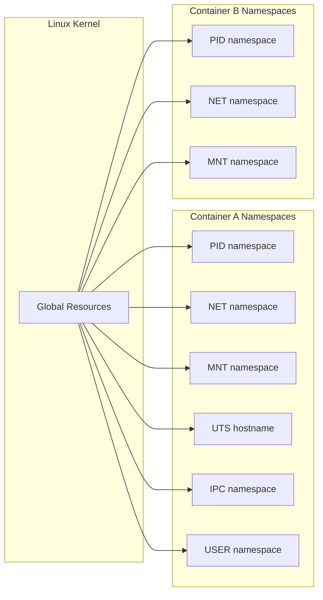
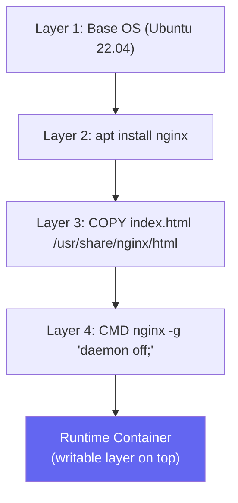
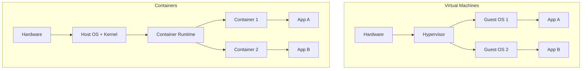
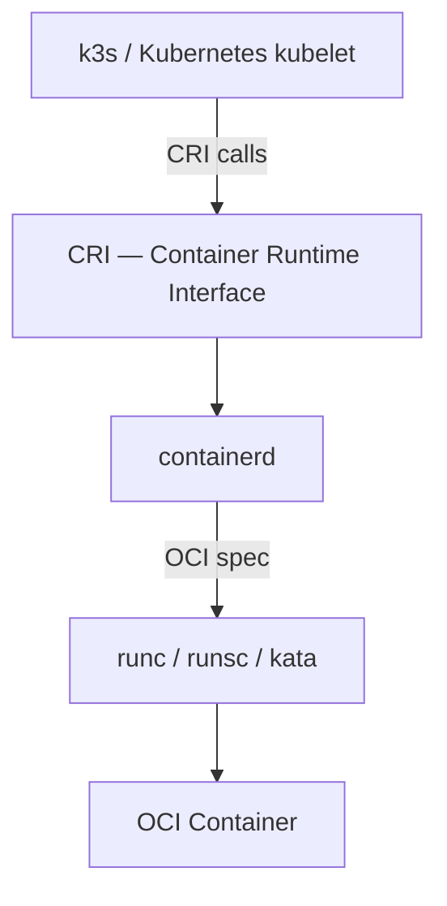

# Linux & Containers Primer

> Module 00 · Lesson 01 | [↑ Course Index](../README.md)

## Table of Contents

- [Why This Primer?](#why-this-primer)
- [Linux Fundamentals for k3s](#linux-fundamentals-for-k3s)
- [Processes, Namespaces & Cgroups](#processes-namespaces--cgroups)
- [Container Concepts](#container-concepts)
- [Container Runtimes](#container-runtimes)
- [Networking Basics](#networking-basics)
- [Storage Basics](#storage-basics)
- [systemd Essentials](#systemd-essentials)
- [Lab: Verify Your Environment](#lab-verify-your-environment)
- [Common Pitfalls](#common-pitfalls)
- [Further Reading](#further-reading)

---

## Why This Primer?

k3s is a Kubernetes distribution. Kubernetes is a container orchestrator. To understand either, you need a solid foundation in:

- How Linux processes and isolation work
- What containers actually are under the hood
- How Linux networking enables pod-to-pod communication
- How `systemd` manages long-running services (like k3s itself)

If you already know Linux and containers well, skim or skip this module. If any of the above sounds unfamiliar, work through every section carefully — it will save you hours of confusion later.

[↑ Back to TOC](#table-of-contents) · [↑ Course Index](../README.md)

---

## Linux Fundamentals for k3s

### Essential command reference

```bash
# File system navigation
ls -la /etc/rancher/k3s/      # list files with permissions
cat /etc/rancher/k3s/k3s.yaml # print file contents
less /var/log/syslog           # page through logs
tail -f /var/log/syslog        # follow log output

# Process management
ps aux                         # list all processes
top / htop                     # live process monitor
kill -9 <PID>                  # force-kill a process

# User & permissions
id                             # show current user & groups
sudo <command>                 # run as root
chmod 600 ~/.kube/config       # restrict file permissions
chown user:group file          # change ownership

# Networking
ip addr                        # show network interfaces
ip route                       # show routing table
ss -tulnp                      # show open ports
ping <host>                    # test connectivity
curl -sv https://example.com   # test HTTP/HTTPS

# Disk
df -h                          # disk usage
du -sh /var/lib/rancher        # directory size
lsblk                          # list block devices
```

### File system paths you will encounter frequently

| Path | Purpose |
|------|---------|
| `/etc/rancher/k3s/` | k3s configuration files |
| `/var/lib/rancher/k3s/` | k3s data directory (etcd, images, etc.) |
| `/usr/local/bin/k3s` | k3s binary |
| `/usr/local/bin/kubectl` | kubectl symlink |
| `/etc/systemd/system/k3s.service` | k3s systemd unit |
| `~/.kube/config` | kubectl authentication config |

[↑ Back to TOC](#table-of-contents) · [↑ Course Index](../README.md)

---

## Processes, Namespaces & Cgroups

Containers are not magic — they are Linux processes with extra isolation. That isolation comes from two kernel features: **namespaces** and **cgroups**.

### Linux Namespaces

A namespace wraps a global resource and makes it appear private to a process:



| Namespace | Isolates |
|-----------|---------|
| `pid` | Process IDs — container thinks PID 1 is its init |
| `net` | Network interfaces, routing tables, sockets |
| `mnt` | Mount points — container has its own filesystem view |
| `uts` | Hostname and domain name |
| `ipc` | Inter-process communication (shared memory, semaphores) |
| `user` | User/group IDs — map host UIDs to container UIDs |

### Cgroups (Control Groups)

Cgroups **limit and account for** resource usage (CPU, memory, disk I/O, network):

```bash
# See cgroup limits for a running container
cat /sys/fs/cgroup/memory/memory.limit_in_bytes
cat /sys/fs/cgroup/cpu/cpu.shares

# k3s uses cgroup v2 — check if enabled
mount | grep cgroup2
# or:
stat -fc %T /sys/fs/cgroup/
# outputs "cgroup2fs" if v2 is active
```

> **Why it matters:** k3s requires cgroup v2 (or properly configured v1) on modern Linux. If cgroups are misconfigured, pods will fail with cryptic OOM or CPU throttle errors.

[↑ Back to TOC](#table-of-contents) · [↑ Course Index](../README.md)

---

## Container Concepts

### What is a container image?

A container image is a **read-only, layered filesystem** built from a `Dockerfile` (or `Containerfile`). Each instruction in the Dockerfile adds a new layer:



### Image registries

Images are stored in registries:

| Registry | URL | Notes |
|----------|-----|-------|
| Docker Hub | `docker.io` | Default public registry |
| GitHub Container Registry | `ghcr.io` | GitHub-hosted images |
| Quay.io | `quay.io` | Red Hat hosted |
| Your own | any hostname | Used in air-gap setups |

### Containers vs VMs



Key differences:
- Containers share the **host kernel** — no guest OS overhead
- Containers start in **milliseconds** vs seconds for VMs
- Containers are **less isolated** than VMs by default
- VMs provide **stronger security boundaries**

[↑ Back to TOC](#table-of-contents) · [↑ Course Index](../README.md)

---

## Container Runtimes

k3s uses **containerd** as its embedded container runtime. You do not need Docker installed.

### Runtime hierarchy



| Layer | Tool | Role |
|-------|------|------|
| Orchestrator | k3s (kubelet) | Schedules containers on nodes |
| CRI | containerd | Manages image pull, container lifecycle |
| OCI runtime | runc | Low-level: creates namespaces, cgroups, mounts |

### Useful containerd commands (via k3s)

```bash
# k3s bundles crictl and ctr
sudo k3s crictl ps                  # list running containers
sudo k3s crictl images              # list images
sudo k3s crictl logs <container-id> # view container logs
sudo k3s ctr images ls              # ctr image list
sudo k3s ctr containers ls          # ctr container list
```

[↑ Back to TOC](#table-of-contents) · [↑ Course Index](../README.md)

---

## Networking Basics

### IP addressing

Every node and every pod in k3s has an IP address. You need to understand:

```bash
# View all network interfaces
ip addr show

# Example output:
# 1: lo: <LOOPBACK> 127.0.0.1/8
# 2: eth0: <BROADCAST> 192.168.1.10/24   ← your node IP
# 3: flannel.1: 10.42.0.0/24             ← k3s pod network (added by Flannel CNI)
```

### Ports and firewalls

k3s requires specific ports to be open:

| Port | Protocol | Purpose |
|------|----------|---------|
| 6443 | TCP | Kubernetes API server |
| 10250 | TCP | Kubelet metrics |
| 8472 | UDP | Flannel VXLAN (node-to-node pod traffic) |
| 51820 | UDP | Flannel WireGuard (if enabled) |
| 2379–2380 | TCP | etcd (HA clusters only) |

```bash
# Check if a port is open
ss -tulnp | grep 6443

# Allow port through firewall (firewalld)
sudo firewall-cmd --permanent --add-port=6443/tcp
sudo firewall-cmd --reload

# Allow port through firewall (ufw)
sudo ufw allow 6443/tcp
```

[↑ Back to TOC](#table-of-contents) · [↑ Course Index](../README.md)

---

## Storage Basics

### Block vs filesystem vs object storage

| Type | Examples | Use case |
|------|----------|---------|
| Block | EBS, iSCSI, raw disk | Databases, high-performance I/O |
| Filesystem | NFS, CephFS, local dirs | General-purpose shared storage |
| Object | S3, MinIO | Backups, images, unstructured data |

k3s's default `local-path` provisioner uses **filesystem storage** (a directory on the local disk). Longhorn provides **block storage** with replication.

### Mount points

```bash
# List mounted filesystems
mount | grep -E "(ext4|xfs|btrfs)"

# Check available disk space
df -h

# Check inode usage (can cause "no space" errors even with free disk)
df -i
```

[↑ Back to TOC](#table-of-contents) · [↑ Course Index](../README.md)

---

## systemd Essentials

k3s runs as a **systemd service**. You must be comfortable with basic systemd operations:

```bash
# Service lifecycle
sudo systemctl start k3s        # start the service
sudo systemctl stop k3s         # stop the service
sudo systemctl restart k3s      # restart the service
sudo systemctl reload k3s       # reload config without full restart

# Service status
sudo systemctl status k3s       # current state + last log lines
sudo systemctl is-active k3s    # prints "active" or "inactive"
sudo systemctl is-enabled k3s   # prints "enabled" if starts on boot

# Enable/disable on boot
sudo systemctl enable k3s       # start on boot
sudo systemctl disable k3s      # do not start on boot

# Logs (via journald)
sudo journalctl -u k3s          # all k3s logs
sudo journalctl -u k3s -f       # follow live
sudo journalctl -u k3s --since "1 hour ago"
sudo journalctl -u k3s -n 100   # last 100 lines
```

### systemd unit file anatomy

```ini
[Unit]
Description=Lightweight Kubernetes
After=network-online.target

[Service]
Type=notify
ExecStart=/usr/local/bin/k3s server
Restart=on-failure

[Install]
WantedBy=multi-user.target
```

[↑ Back to TOC](#table-of-contents) · [↑ Course Index](../README.md)

---

## Lab: Verify Your Environment

Run these checks before starting the course. Every command should succeed.

```bash
#!/usr/bin/env bash
# prereq-check.sh — run as root or with sudo

echo "=== OS Version ==="
cat /etc/os-release | grep PRETTY_NAME

echo "=== Kernel Version ==="
uname -r

echo "=== cgroup version ==="
if stat -fc %T /sys/fs/cgroup/ | grep -q cgroup2fs; then
  echo "cgroup v2: OK"
else
  echo "cgroup v1 detected — may need kernel params for full k3s support"
fi

echo "=== Available RAM ==="
free -h

echo "=== Available Disk ==="
df -h /

echo "=== Network interfaces ==="
ip addr show | grep "inet " | awk '{print $2, $NF}'

echo "=== Required ports free? ==="
for port in 6443 10250 8472; do
  if ss -tulnp | grep -q ":$port"; then
    echo "  Port $port: IN USE (may conflict)"
  else
    echo "  Port $port: FREE"
  fi
done

echo "=== curl available? ==="
command -v curl && echo "curl: OK" || echo "curl: MISSING — install it"

echo "=== Done ==="
```

Save as `prereq-check.sh`, make executable, and run:

```bash
chmod +x prereq-check.sh
sudo ./prereq-check.sh
```

[↑ Back to TOC](#table-of-contents) · [↑ Course Index](../README.md)

---

## Common Pitfalls

| Pitfall | Symptom | Fix |
|---------|---------|-----|
| cgroup v1 without swap accounting | Pods OOMKilled unexpectedly | Add `cgroup_enable=memory swapaccount=1` to kernel cmdline |
| SELinux enforcing | k3s fails to start or pods crash | Set SELinux to permissive or install correct k3s SELinux policy |
| AppArmor blocking containerd | Containers fail to start | Load k3s AppArmor profile or set to complain mode |
| Swap enabled | kubelet refuses to run | Disable swap: `sudo swapoff -a` and remove from `/etc/fstab` |
| Firewall blocking 6443 | kubectl connection refused | Open port: `sudo ufw allow 6443/tcp` |
| Non-root user without sudo | Permission denied on k3s files | Add user to `sudo` group or run as root |

[↑ Back to TOC](#table-of-contents) · [↑ Course Index](../README.md)

---

## Further Reading

- [Linux Namespaces — man7.org](https://man7.org/linux/man-pages/man7/namespaces.7.html)
- [cgroups v2 — Kernel docs](https://www.kernel.org/doc/html/latest/admin-guide/cgroup-v2.html)
- [containerd documentation](https://containerd.io/docs/)
- [OCI Runtime Spec](https://opencontainers.org/posts/announcements/2021-07-release/)
- [systemd documentation](https://systemd.io/)

[↑ Back to TOC](#table-of-contents) · [↑ Course Index](../README.md)

---

*Licensed under [CC BY-NC-SA 4.0](../LICENSE.md) · © 2026 UncleJS*
