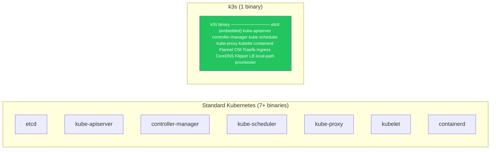
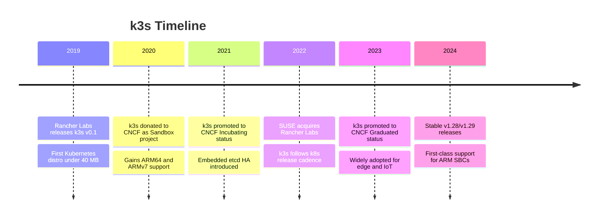
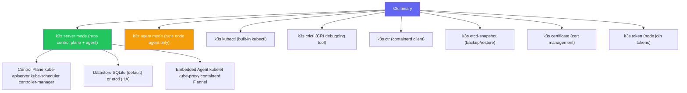

# What is k3s?

> Module 01 · Lesson 01 | [↑ Course Index](../README.md)

## Table of Contents

- [The Problem k3s Solves](#the-problem-k3s-solves)
- [What k3s Is](#what-k3s-is)
- [What k3s Is Not](#what-k3s-is-not)
- [k3s Origins & History](#k3s-origins--history)
- [Who Uses k3s?](#who-uses-k3s)
- [Key Features at a Glance](#key-features-at-a-glance)
- [The Single Binary Design](#the-single-binary-design)
- [Common Pitfalls](#common-pitfalls)
- [Further Reading](#further-reading)

---

## The Problem k3s Solves

Standard Kubernetes (k8s) is powerful but heavyweight. A minimal k8s control plane requires:

- `etcd` — distributed key-value store
- `kube-apiserver` — REST API for the cluster
- `kube-controller-manager` — control loops
- `kube-scheduler` — pod placement decisions
- `kube-proxy` — network rules
- `kubelet` — node agent
- A container runtime (containerd, CRI-O, etc.)
- A CNI plugin (Flannel, Calico, Cilium…)

That's 7+ separate processes to manage, update, and secure. On a 512 MB Raspberry Pi or an edge device, this is simply too heavy.

k3s was built to solve exactly this problem.

[↑ Back to TOC](#table-of-contents) · [↑ Course Index](../README.md)

---

## What k3s Is

**k3s** is a certified, lightweight Kubernetes distribution created by Rancher Labs (now part of SUSE). It is:

- A **single binary** under 100 MB that packages the entire Kubernetes control plane, node agent, container runtime (containerd), CNI (Flannel), load balancer (Klipper), ingress (Traefik), CoreDNS, and local storage provisioner
- **100% upstream Kubernetes compliant** — passes the CNCF conformance test suite
- Designed for **resource-constrained environments**: edge, IoT, CI, single-board computers, dev laptops
- Production-ready for **small to medium clusters**

[↑ Back to TOC](#table-of-contents) · [↑ Course Index](../README.md)

---

## What k3s Is Not

It is important to understand what k3s does **not** do:

| Not | Explanation |
|-----|-------------|
| Not a managed service | k3s is self-hosted. You manage updates, backups, and HA yourself |
| Not a replacement for large clusters | For 100+ nodes with complex networking, vanilla k8s or managed offerings scale better |
| Not Docker | k3s uses containerd, not the Docker daemon. `docker` CLI commands do not work against k3s |
| Not a development-only tool | k3s is fully production-ready — it just also runs well on small machines |
| Not limited to ARM | k3s runs on x86_64, ARM64, ARMv7, s390x |

[↑ Back to TOC](#table-of-contents) · [↑ Course Index](../README.md)

---

## k3s Origins & History

The name "k3s" comes from: if "k8s" is Kubernetes (k + 8 letters + s), then half of Kubernetes would be "k3s" (k + 3 letters + s) — a "5 less than k8s" joke about being lighter.

[↑ Back to TOC](#table-of-contents) · [↑ Course Index](../README.md)

---

## Who Uses k3s?

k3s is used in a wide variety of scenarios:

| Scenario | Example |
|----------|---------|
| Edge computing | Retail stores, factories, substations running local workloads |
| IoT | Raspberry Pi clusters processing sensor data |
| Home lab | Learning Kubernetes on commodity hardware |
| CI/CD | Ephemeral test clusters in pipelines |
| Developer workstations | Local dev cluster that mirrors production |
| Small production clusters | Startups, internal tools, low-traffic services |
| Air-gapped environments | Secure facilities with no internet access |

[↑ Back to TOC](#table-of-contents) · [↑ Course Index](../README.md)

---

## Key Features at a Glance

| Feature | Detail |
|---------|--------|
| **Single binary** | `k3s` binary < 100 MB packages everything |
| **Low memory** | Server: ~512 MB RAM minimum; Agent: ~75 MB RAM |
| **SQLite by default** | Uses SQLite instead of etcd for single-node clusters |
| **Embedded HA** | Embedded etcd available for multi-server HA clusters |
| **External DB support** | Can use PostgreSQL, MySQL, or etcd as external datastore |
| **Auto TLS** | Automatically generates and rotates cluster TLS certificates |
| **Helm CRD** | Deploy Helm charts via `HelmChart` CRDs, no Helm CLI needed |
| **Traefik included** | HTTP ingress controller installed by default |
| **Klipper LB** | Built-in service load balancer for bare-metal nodes |
| **Local storage** | `local-path-provisioner` creates PVCs automatically |
| **Air-gap support** | Pre-load images and install without internet |
| **Rootless mode** | Run k3s without root privileges (experimental) |

[↑ Back to TOC](#table-of-contents) · [↑ Course Index](../README.md)

---

## The Single Binary Design

Understanding how k3s packages everything into one binary helps you reason about how it works:

When you run `k3s server`, a single process starts that embeds all the Kubernetes components. This makes:
- **Installation** trivial — just run the installer script
- **Updates** atomic — replace one binary
- **Debugging** easier — all logs in one systemd unit
- **Resource usage** lower — shared Go runtime, no IPC overhead

[↑ Back to TOC](#table-of-contents) · [↑ Course Index](../README.md)

---

## Common Pitfalls

| Pitfall | Detail |
|---------|--------|
| Expecting Docker | k3s uses containerd. Use `k3s crictl` or `k3s ctr` instead of `docker` commands |
| Using k3s for very large clusters | k3s works up to ~100 nodes but upstream k8s may scale better beyond that |
| Confusing k3s with k3d | **k3d** runs k3s inside Docker containers for local dev. They are different tools |
| Confusing k3s with microk8s | microk8s is a different lightweight k8s distro by Canonical. k3s is by SUSE/Rancher |
| Assuming all k8s addons work | Most do, but some addons assume Docker or specific CNI features not present in k3s |

[↑ Back to TOC](#table-of-contents) · [↑ Course Index](../README.md)

---

## Further Reading

- [k3s Official Documentation](https://docs.k3s.io)
- [k3s GitHub Repository](https://github.com/k3s-io/k3s)
- [CNCF k3s Project Page](https://www.cncf.io/projects/k3s/)
- [Rancher k3s Blog](https://www.rancher.com/blog/tags/k3s)

[↑ Back to TOC](#table-of-contents) · [↑ Course Index](../README.md)

---

*Licensed under [CC BY-NC-SA 4.0](../LICENSE.md) · © 2026 UncleJS*
