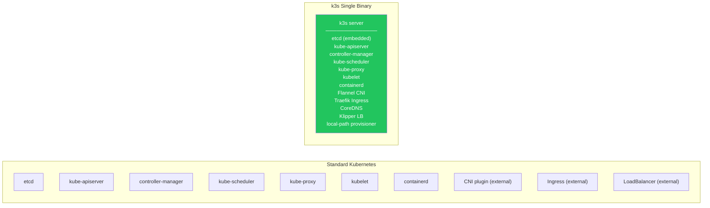
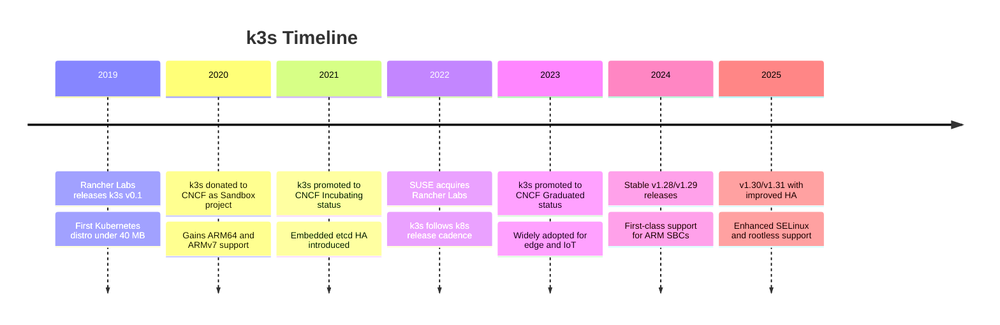
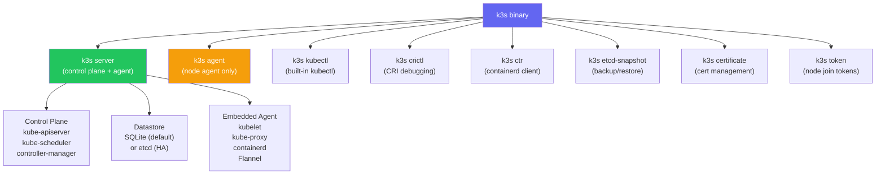
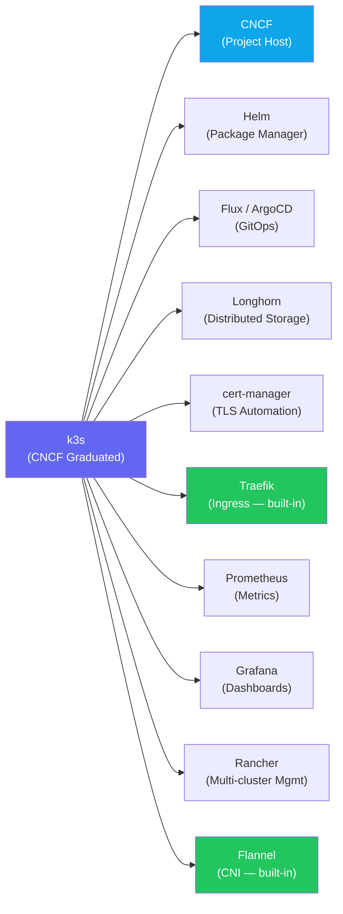
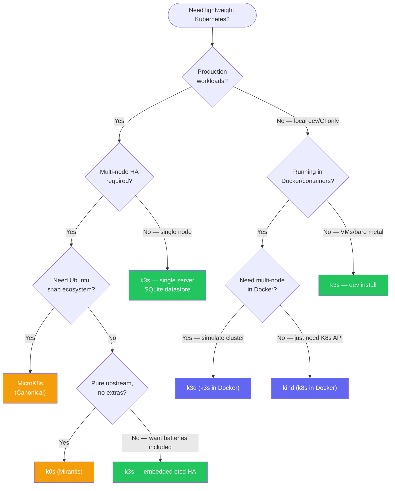
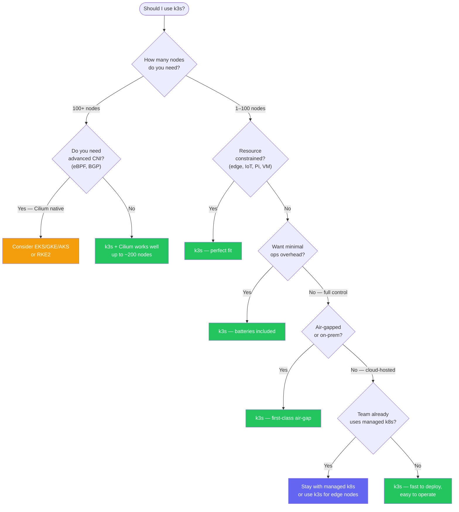

# What is k3s?

> Module 01 · Lesson 01 | [↑ Course Index](../README.md)

[](../README.md)
[](../LICENSE.md)

## Table of Contents

- [The Problem k3s Solves](#the-problem-k3s-solves)
- [What k3s Is](#what-k3s-is)
- [What k3s Is Not](#what-k3s-is-not)
- [k3s Origins & History](#k3s-origins--history)
- [Who Uses k3s?](#who-uses-k3s)
- [Key Features at a Glance](#key-features-at-a-glance)
- [The Single Binary Design](#the-single-binary-design)
- [k3s in the CNCF Landscape](#k3s-in-the-cncf-landscape)
- [Real-World Use Cases](#real-world-use-cases)
- [k3s Release Cadence and Support](#k3s-release-cadence-and-support)
- [k3s vs k0s vs MicroK8s vs kind vs k3d](#k3s-vs-k0s-vs-microk8s-vs-kind-vs-k3d)
- [Should I Use k3s?](#should-i-use-k3s)
- [Common Pitfalls](#common-pitfalls)
- [Further Reading](#further-reading)

---

## The Problem k3s Solves

Standard Kubernetes (k8s) is powerful but heavyweight. A minimal k8s control plane requires:

- `etcd` — distributed key-value store
- `kube-apiserver` — REST API for the cluster
- `kube-controller-manager` — control loops
- `kube-scheduler` — pod placement decisions
- `kube-proxy` — network rules
- `kubelet` — node agent
- A container runtime (containerd, CRI-O, etc.)
- A CNI plugin (Flannel, Calico, Cilium…)

That's 7+ separate processes to manage, update, and secure. On a 512 MB Raspberry Pi or an edge device, this is simply too heavy.

Beyond resource constraints, vanilla Kubernetes also demands:

- **Operational knowledge** to install and wire up each component
- **External infrastructure** — etcd is typically a separate 3-node cluster
- **Add-on management** — ingress, storage, load balancing all need separate installation
- **Certificate management** — TLS for every component, manually or via tooling

For teams that need Kubernetes semantics without a dedicated platform engineering team, or for hardware where every megabyte matters, all of this is an obstacle. k3s was built to remove those obstacles without sacrificing Kubernetes compatibility.

[↑ Back to TOC](#table-of-contents) · [↑ Course Index](../README.md)

---

## What k3s Is

**k3s** is a certified, lightweight Kubernetes distribution created by Rancher Labs (now part of SUSE). It is:

- A **single binary** under 100 MB that packages the entire Kubernetes control plane, node agent, container runtime (containerd), CNI (Flannel), load balancer (Klipper), ingress (Traefik), CoreDNS, and local storage provisioner
- **100% upstream Kubernetes compliant** — passes the CNCF conformance test suite
- Designed for **resource-constrained environments**: edge, IoT, CI, single-board computers, dev laptops
- Production-ready for **small to medium clusters**



[↑ Back to TOC](#table-of-contents) · [↑ Course Index](../README.md)

---

## What k3s Is Not

It is important to understand what k3s does **not** do:

| Not | Explanation |
|-----|-------------|
| Not a managed service | k3s is self-hosted. You manage updates, backups, and HA yourself |
| Not a replacement for large clusters | For 100+ nodes with complex networking, vanilla k8s or managed offerings scale better |
| Not Docker | k3s uses containerd, not the Docker daemon. `docker` CLI commands do not work against k3s |
| Not a development-only tool | k3s is fully production-ready — it just also runs well on small machines |
| Not limited to ARM | k3s runs on x86_64, ARM64, ARMv7, s390x |
| Not a managed PaaS | k3s is the Kubernetes layer only — you still manage your applications |
| Not a replacement for security hardening | k3s simplifies operations but you still need RBAC, NetworkPolicy, and secrets management |

[↑ Back to TOC](#table-of-contents) · [↑ Course Index](../README.md)

---

## k3s Origins & History



The name "k3s" comes from: if "k8s" is Kubernetes (k + 8 letters + s), then half of Kubernetes would be "k3s" (k + 3 letters + s) — a "5 less than k8s" joke about being lighter.

### Why Rancher Built It

Rancher Labs was already deeply invested in Kubernetes tooling (Rancher, RKE) when they saw a gap: enterprise customers wanted to run Kubernetes at the edge — on thin clients, gateway devices, and factory floor machines — but the resource requirements were prohibitive. Rather than strip down k8s manually for each deployment, they created a reproducible, conformant, minimal distribution. The first version was so small it could run on a single 512 MB node — something that was unthinkable with vanilla Kubernetes at the time.

SUSE's acquisition of Rancher Labs in 2021 gave k3s enterprise backing without changing its open-source trajectory. It remains one of the fastest-growing Kubernetes distributions and is now a CNCF Graduated project alongside Kubernetes itself.

[↑ Back to TOC](#table-of-contents) · [↑ Course Index](../README.md)

---

## Who Uses k3s?

k3s is used in a wide variety of scenarios:

| Scenario | Example |
|----------|---------|
| Edge computing | Retail stores, factories, substations running local workloads |
| IoT | Raspberry Pi clusters processing sensor data |
| Home lab | Learning Kubernetes on commodity hardware |
| CI/CD | Ephemeral test clusters in pipelines |
| Developer workstations | Local dev cluster that mirrors production |
| Small production clusters | Startups, internal tools, low-traffic services |
| Air-gapped environments | Secure facilities with no internet access |
| Branch offices | Satellite locations running local apps with optional cloud sync |
| Telecom / 5G edge | MEC nodes running latency-sensitive workloads near base stations |

**Notable adopters** include automotive manufacturers running inference workloads in vehicles, energy companies managing substations with local Kubernetes controllers, and retail chains running point-of-sale and inventory management on in-store k3s nodes — all scenarios where pulling cloud resources on every request is impractical or impossible.

[↑ Back to TOC](#table-of-contents) · [↑ Course Index](../README.md)

---

## Key Features at a Glance

| Feature | Detail |
|---------|--------|
| **Single binary** | `k3s` binary < 100 MB packages everything |
| **Low memory** | Server: ~512 MB RAM minimum; Agent: ~75 MB RAM |
| **SQLite by default** | Uses SQLite instead of etcd for single-node clusters |
| **Embedded HA** | Embedded etcd available for multi-server HA clusters |
| **External DB support** | Can use PostgreSQL, MySQL, or etcd as external datastore |
| **Auto TLS** | Automatically generates and rotates cluster TLS certificates |
| **Helm CRD** | Deploy Helm charts via `HelmChart` CRDs, no Helm CLI needed |
| **Traefik included** | HTTP ingress controller installed by default |
| **Klipper LB** | Built-in service load balancer for bare-metal nodes |
| **Local storage** | `local-path-provisioner` creates PVCs automatically |
| **Air-gap support** | Pre-load images and install without internet |
| **Rootless mode** | Run k3s without root privileges (experimental) |
| **SELinux support** | First-class SELinux policy for RHEL/Fedora/CentOS |
| **Multi-arch** | x86_64, ARM64, ARMv7, s390x from the same release pipeline |

[↑ Back to TOC](#table-of-contents) · [↑ Course Index](../README.md)

---

## The Single Binary Design

Understanding how k3s packages everything into one binary helps you reason about how it works:



When you run `k3s server`, a single process starts that embeds all the Kubernetes components. This makes:
- **Installation** trivial — just run the installer script
- **Updates** atomic — replace one binary
- **Debugging** easier — all logs in one systemd unit
- **Resource usage** lower — shared Go runtime, no IPC overhead

The binary also acts as a multiplexer for sub-commands: `k3s kubectl` is identical to running `kubectl` with the cluster's kubeconfig pre-configured, `k3s crictl` wraps `crictl` pointed at k3s's containerd socket, and so on. This means you never need to install separate tools to operate the cluster.

[↑ Back to TOC](#table-of-contents) · [↑ Course Index](../README.md)

---

## k3s in the CNCF Landscape

The Cloud Native Computing Foundation (CNCF) hosts the Kubernetes ecosystem. k3s is a Graduated project — the highest maturity tier, alongside Kubernetes itself, Prometheus, Helm, and Argo.



### How k3s Relates to Other Graduated Projects

**Helm** — k3s includes a built-in Helm controller. You deploy Helm charts by creating `HelmChart` CRDs in the cluster, and the Helm controller installs them automatically. This means you get GitOps-style Helm management without installing the Helm CLI.

**Flux / ArgoCD** — k3s is a primary target for GitOps deployments. Its low footprint makes it ideal for edge GitOps patterns where a Flux agent on a small device synchronizes workloads from a central Git repository.

**Longhorn** — SUSE's own distributed block storage project. Longhorn runs on k3s clusters to provide replicated persistent volumes across multiple nodes, solving the single-point-of-failure problem with `local-path` storage.

**cert-manager** — Works identically on k3s. Used to automate Let's Encrypt TLS certificates for services exposed via the built-in Traefik ingress.

**Prometheus and Grafana** — The kube-prometheus-stack Helm chart installs cleanly on k3s, giving you full cluster observability. k3s exposes metrics endpoints compatible with Prometheus scraping.

**Rancher** — k3s clusters can be imported into Rancher for centralized multi-cluster management. This is the canonical enterprise pattern for managing many k3s edge nodes from a central Rancher instance.

CNCF graduation means k3s has:
- Demonstrated production usage at scale by multiple independent organizations
- A clearly defined governance model and code of conduct
- A security vulnerability disclosure process
- A path for community contributions independent of SUSE

[↑ Back to TOC](#table-of-contents) · [↑ Course Index](../README.md)

---

## Real-World Use Cases

### Edge Computing

Large retail chains run k3s nodes in every store. Each node runs local inventory management, payment processing, and loyalty program workloads. If the WAN link to the central cloud goes down, the store keeps running. When connectivity is restored, the GitOps agent (Flux/ArgoCD) re-syncs the desired state. This pattern — local autonomy with central control — is only viable with a lightweight distribution like k3s.

### IoT Gateways

Manufacturing plants deploy k3s on ruggedized industrial PCs near production lines. These nodes collect data from PLCs and sensors, run local ML inference for defect detection, and batch-upload results to a central data lake. The Kubernetes API lets the central team push configuration changes, update models, and observe workload health using standard tooling, regardless of the device hardware.

### Home Lab

k3s is the most popular way to learn Kubernetes outside of a cloud environment. A cluster of three Raspberry Pi 4 boards (4 GB RAM each) can run a fully functional production-pattern cluster with Traefik ingress, Longhorn storage, and a GitOps pipeline — for under $200. The skills transfer directly to enterprise Kubernetes.

### CI/CD Ephemeral Clusters

GitHub Actions, GitLab CI, and Jenkins pipelines can spin up a k3s cluster in under 30 seconds using k3d (k3s in Docker). This lets teams run integration tests against a real Kubernetes cluster on every pull request, without the cost and latency of a cloud-managed cluster. The cluster is destroyed when the job finishes.

### Branch Offices

Organizations with many physical locations (banks, clinics, restaurants) run k3s at each site to host local applications — POS systems, appointment booking, inventory — while a central Rancher instance provides visibility, policy enforcement, and rollout management. k3s's small footprint means it runs reliably on whatever hardware already exists at the site.

### Air-Gapped / High-Security Environments

Government agencies, defense contractors, and healthcare organizations with strict data residency requirements run k3s in fully air-gapped networks. All artifacts (binary, images, Helm charts) are transferred via approved channels, and the cluster operates indefinitely without internet access. Module 02 Lesson 03 covers this scenario in detail.

[↑ Back to TOC](#table-of-contents) · [↑ Course Index](../README.md)

---

## k3s Release Cadence and Support

k3s tracks upstream Kubernetes releases very closely — typically publishing a k3s release within days of a new Kubernetes minor or patch version.

| Kubernetes Release | k3s Equivalent | Notes |
|-------------------|---------------|-------|
| v1.30.x | v1.30.x+k3s1, +k3s2, … | Patch releases follow upstream patches |
| v1.29.x | v1.29.x+k3s1, +k3s2, … | Minor versions supported for ~14 months |
| v1.28.x | v1.28.x+k3s1, +k3s2, … | Follows upstream EOL dates |

### Version String Anatomy

```
v1.30.3+k3s1
│  │ │   └── k3s patch number (k3s-specific fixes on top of k8s patch)
│  │ └────── Kubernetes patch version
│  └──────── Kubernetes minor version
└─────────── Kubernetes major version
```

The `+k3s1` suffix increments when the k3s team needs to release fixes or bundled component updates on top of a given Kubernetes patch without changing the Kubernetes version. For example, `v1.30.3+k3s2` would include the same Kubernetes 1.30.3 but with an updated Traefik or Flannel version, or a k3s-specific bug fix.

### Support Policy

k3s supports the same number of minor versions as upstream Kubernetes: the **three most recent minor versions** receive patch updates. Older versions are not actively patched. For security-sensitive environments, stay within one minor version of the current stable release.

### Channels

| Channel | Description |
|---------|-------------|
| `stable` | Latest stable release (default) |
| `latest` | Most recent release, may include RC builds |
| `testing` | Pre-release/RC builds |
| `v1.30` | Pin to a specific minor version's latest patch |

```bash
# Install from a specific channel
curl -sfL https://get.k3s.io | INSTALL_K3S_CHANNEL=v1.30 sh -

# Check current k3s version
k3s --version
```

[↑ Back to TOC](#table-of-contents) · [↑ Course Index](../README.md)

---

## k3s vs k0s vs MicroK8s vs kind vs k3d

The lightweight Kubernetes landscape has several options. Understanding the differences helps you choose the right tool:



### Detailed Comparison Table

| Feature | k3s | k0s | MicroK8s | kind | k3d |
|---------|-----|-----|----------|------|-----|
| **Vendor** | SUSE/Rancher | Mirantis | Canonical | Kubernetes SIG | Rancher (community) |
| **Binary size** | ~100 MB | ~170 MB | Snap package | Docker images | Docker images |
| **Min RAM** | 512 MB | 1 GB | 540 MB | Docker host RAM | Docker host RAM |
| **Datastore** | SQLite/etcd | etcd/SQLite | etcd | etcd | SQLite/etcd |
| **Built-in ingress** | Traefik | No | nginx (addon) | No | No |
| **Built-in CNI** | Flannel | Kube-router | Calico | kindnet | Flannel |
| **Built-in LB** | Klipper | No | MetalLB (addon) | No | No |
| **HA support** | Yes (embedded etcd) | Yes | Yes | No | Limited |
| **ARM support** | Yes (ARM64/ARMv7) | Yes (ARM64) | Yes (ARM64) | Partial | Via k3s |
| **Air-gap** | First-class | Yes | Limited | No | No |
| **CNCF certified** | Yes | Yes | Yes | Yes | N/A |
| **Production use** | Yes | Yes | Yes | No | No |
| **Windows nodes** | No | No | No | No | No |
| **Best for** | Edge, IoT, production | Pure upstream, no extras | Ubuntu/snap shops | Local dev | Local multi-node dev |

### Key Differentiators

**k3s vs k0s:** k0s is closer to vanilla Kubernetes with fewer opinions about built-in addons. k3s is more batteries-included (Traefik, Klipper, CoreDNS, local-path) and has stronger ARM and air-gap support. Choose k0s if you want a near-vanilla experience with minimal extras; choose k3s if you want a working cluster immediately.

**k3s vs MicroK8s:** MicroK8s is snap-based and tightly integrated with the Ubuntu ecosystem. It has an addon system for optional components. k3s works on any Linux distribution and has better ARM and air-gap support. Choose MicroK8s if you're all-in on Ubuntu snap; choose k3s for cross-distro portability.

**k3s vs kind:** kind runs Kubernetes entirely in Docker containers and is primarily a development/testing tool. It has no air-gap support, no production use case, and requires Docker. k3s runs on bare metal or VMs and is production-ready. Don't compare them — they solve different problems.

**k3s vs k3d:** k3d wraps k3s in Docker containers to simulate multi-node clusters on a development machine. It's the same k3s runtime underneath, but running inside Docker. Use k3d for local dev multi-node simulation; use k3s for actual nodes.

[↑ Back to TOC](#table-of-contents) · [↑ Course Index](../README.md)

---

## Should I Use k3s?



**Choose k3s when:**
- You need Kubernetes on resource-constrained hardware
- You want a working cluster in under 60 seconds
- You're building edge, IoT, or air-gapped deployments
- You're learning Kubernetes or building a dev environment
- You need a quick, production-ready cluster for small workloads
- You want batteries included (ingress, storage, DNS) without extra installation

**Consider alternatives when:**
- You need 100+ nodes with advanced eBPF networking at scale
- You require advanced multi-tenancy with strict hardware-level isolation
- Your team already operates managed k8s (EKS/GKE/AKS) and cost is not a concern
- You need Windows node support (k3s is Linux-only)
- You need an FIPS-compliant distribution (consider RKE2/k0s instead)

[↑ Back to TOC](#table-of-contents) · [↑ Course Index](../README.md)

---

## Common Pitfalls

| Pitfall | Detail |
|---------|--------|
| Expecting Docker | k3s uses containerd. Use `k3s crictl` or `k3s ctr` instead of `docker` commands |
| Using k3s for very large clusters | k3s works up to ~100 nodes but upstream k8s may scale better beyond that |
| Confusing k3s with k3d | **k3d** runs k3s inside Docker containers for local dev. They are different tools |
| Confusing k3s with microk8s | microk8s is a different lightweight k8s distro by Canonical. k3s is by SUSE/Rancher |
| Assuming all k8s addons work | Most do, but some addons assume Docker or specific CNI features not present in k3s |
| Skipping version pinning | Always pin `INSTALL_K3S_VERSION` in production to avoid unexpected upgrades |
| Ignoring air-gap image prep | If you disable public internet later, pre-load images before cutting access |
| Treating k3s as dev-only | k3s is fully production-ready for appropriate workloads; don't under-invest in hardening |

[↑ Back to TOC](#table-of-contents) · [↑ Course Index](../README.md)

---

## Further Reading

- [k3s Official Documentation](https://docs.k3s.io)
- [k3s GitHub Repository](https://github.com/k3s-io/k3s)
- [CNCF k3s Project Page](https://www.cncf.io/projects/k3s/)
- [Rancher k3s Blog](https://www.rancher.com/blog/tags/k3s)
- [k0s Documentation](https://docs.k0sproject.io)
- [MicroK8s Documentation](https://microk8s.io/docs)
- [kind Documentation](https://kind.sigs.k8s.io)
- [k3d Documentation](https://k3d.io)
- [CNCF Landscape — Certified Kubernetes](https://landscape.cncf.io/card-mode?category=certified-kubernetes-distribution)

[↑ Back to TOC](#table-of-contents) · [↑ Course Index](../README.md)

---

*Licensed under [CC BY-NC-SA 4.0](../LICENSE.md) · © 2026 UncleJS*
