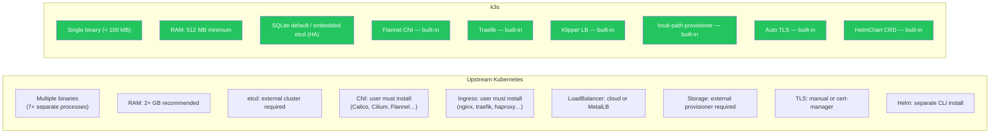
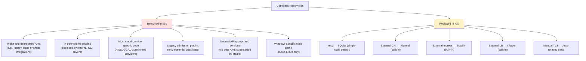
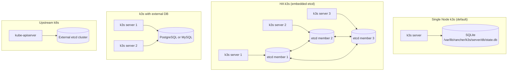
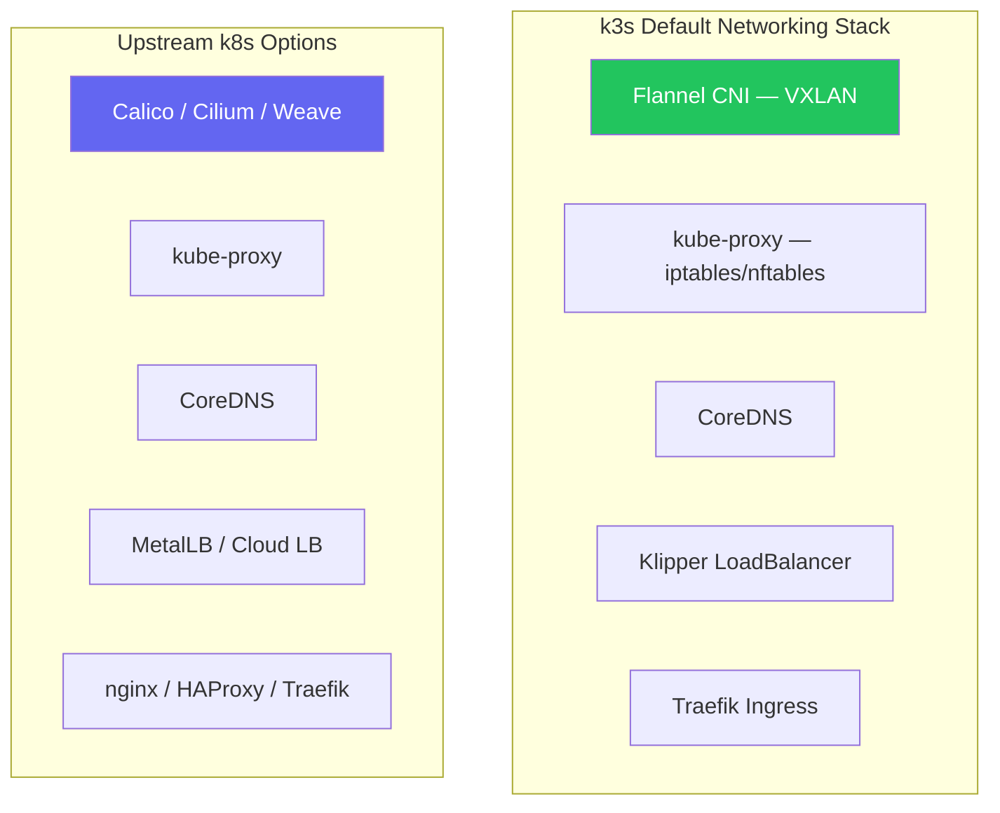
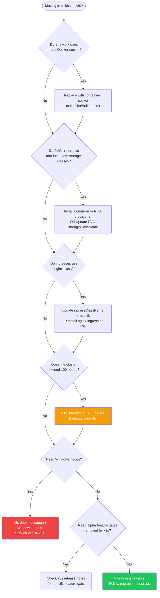

# k3s vs Kubernetes

> Module 01 · Lesson 02 | [↑ Course Index](../README.md)

[](../README.md)
[](../LICENSE.md)

## Table of Contents

- [Side-by-Side Comparison](#side-by-side-comparison)
- [Component Comparison Diagram](#component-comparison-diagram)
- [What k3s Removes from Upstream Kubernetes](#what-k3s-removes-from-upstream-kubernetes)
- [What k3s Replaces](#what-k3s-replaces)
- [What k3s Adds Over Upstream k8s](#what-k3s-adds-over-upstream-k8s)
- [Component Mapping](#component-mapping)
- [API Compatibility](#api-compatibility)
- [Datastore Differences](#datastore-differences)
- [Networking Differences](#networking-differences)
- [Migrating Workloads from k8s to k3s](#migrating-workloads-from-k8s-to-k3s)
- [Migration Decision Tree](#migration-decision-tree)
- [When to Choose k3s vs Full k8s](#when-to-choose-k3s-vs-full-k8s)
- [Common Pitfalls](#common-pitfalls)
- [Further Reading](#further-reading)

---

## Side-by-Side Comparison

| Feature | Upstream k8s | k3s |
|---------|-------------|-----|
| Binary size | ~500 MB total | ~100 MB single binary |
| Minimum RAM (server) | ~2 GB | 512 MB |
| Default datastore | etcd (external) | SQLite (embedded) |
| HA datastore | etcd (external) | Embedded etcd or external DB |
| Default CNI | None (must install) | Flannel (built-in) |
| Default Ingress | None (must install) | Traefik v2 (built-in) |
| Default LoadBalancer | None (cloud or MetalLB) | Klipper (built-in) |
| Default Storage | None (must install) | local-path-provisioner |
| Helm support | Helm CLI required | HelmChart CRD + Helm controller |
| Container runtime | containerd / CRI-O | containerd (embedded) |
| TLS management | Manual or cert-manager | Automatic (built-in) |
| Release cadence | Every ~3 months | Follows upstream within days |
| CNCF certified | Yes | Yes |
| Air-gap support | Manual setup | First-class built-in support |
| SELinux support | Manual policy | Built-in policy package |
| ARM support | Yes (manual setup) | Yes (official release artifacts) |

[↑ Back to TOC](#table-of-contents) · [↑ Course Index](../README.md)

---

## Component Comparison Diagram

The diagram below shows each major Kubernetes component and what happens to it in k3s: removed, replaced, embedded, or kept as-is.



[↑ Back to TOC](#table-of-contents) · [↑ Course Index](../README.md)

---

## What k3s Removes from Upstream Kubernetes

k3s deliberately strips out portions of upstream Kubernetes that are either obsolete, cloud-specific, or add unnecessary complexity for the target use cases. This is not a deficiency — it is an intentional design choice that reduces binary size, attack surface, and operational complexity.



### Detailed Removal Table

| Removed Component | Original Purpose | Why Removed |
|-------------------|-----------------|-------------|
| In-tree AWS/GCP/Azure cloud providers | Auto-provision cloud LBs, volumes | Replaced by out-of-tree cloud controller managers |
| `--cloud-provider` flag behavior | Connect to cloud APIs | Not needed for bare-metal/edge deployments |
| Most alpha-gated features | Experimental upstream features | Reduces surface area; alpha = unstable by definition |
| Legacy `dockershim` | Docker as container runtime | Removed upstream in 1.24; containerd used directly |
| In-tree volume plugins (Ceph, GlusterFS, etc.) | Legacy storage integration | Use CSI drivers instead |
| `kube-cloud-manager` (full version) | Cloud-specific controller loops | Stripped down or disabled for non-cloud environments |
| Unused legacy APIs (e.g., `v1beta1` for resources with stable `v1`) | Backward compatibility | Follow upstream API removals |
| Windows node support | Run k8s on Windows nodes | k3s targets Linux only |

The removals reduce the binary size from ~500 MB (all k8s components combined) to under 100 MB. Critically, they also remove code paths that could be exploited. A smaller attack surface means fewer CVEs to patch.

[↑ Back to TOC](#table-of-contents) · [↑ Course Index](../README.md)

---

## What k3s Replaces

Some components are not removed but swapped for lighter-weight equivalents that serve the same purpose with far fewer resources.

| Kubernetes Component | Upstream Default | k3s Replacement | Why |
|---------------------|-----------------|-----------------|-----|
| Datastore (single node) | External etcd | SQLite | etcd requires 3 nodes for HA; SQLite works for one node with zero ops |
| Datastore (HA) | External etcd cluster | Embedded etcd | Manages etcd internally; no separate etcd cluster to operate |
| CNI plugin | Must install manually | Flannel (VXLAN) | Works on all hardware, simple to operate, zero-config |
| Ingress controller | Must install manually | Traefik v2 | Lightweight, integrates with Let's Encrypt, runs on 64 MB |
| Service LoadBalancer | Cloud LB or MetalLB | Klipper LB | Uses host ports on nodes; no cloud API or BGP required |
| Storage provisioner | Must install manually | local-path-provisioner | Creates `hostPath` PVs automatically; zero-config |
| Helm charts deployment | Helm CLI + tiller/v3 | HelmChart CRD + controller | Declarative, GitOps-friendly, no CLI needed on the node |
| TLS certificate management | Manual or cert-manager | Built-in auto-rotation | Certificates issued and rotated automatically at startup |

### A Closer Look: SQLite vs etcd

etcd is a distributed key-value store designed for high availability across multiple nodes. For a single-node cluster, it is significant overhead — etcd's Raft consensus protocol requires at least 3 nodes to function safely, and even a single-node etcd instance consumes 100–300 MB of RAM.

SQLite is an embedded database that requires zero separate processes. For a single k3s node, it provides equivalent functionality with a fraction of the resource cost. The tradeoff: SQLite cannot be used in a multi-server HA configuration. As soon as you need more than one control-plane node, k3s switches to embedded etcd or an external database.

### A Closer Look: Klipper LoadBalancer

Upstream Kubernetes has no built-in solution for exposing `LoadBalancer`-type Services on bare-metal or edge environments. This leaves services stuck in `<pending>` state without MetalLB or a cloud provider.

Klipper solves this by running a DaemonSet (`svclb-*` pods) that uses `hostPort` to forward traffic from each node's IP to the service's ClusterIP. This means any service of type `LoadBalancer` immediately gets the node's IP as its external IP. It is simpler than MetalLB (no BGP or ARP spoofing required) but less flexible — all node IPs are used, not a separate IP pool.

[↑ Back to TOC](#table-of-contents) · [↑ Course Index](../README.md)

---

## What k3s Adds Over Upstream k8s

k3s also adds functionality that upstream Kubernetes does not have:

| Addition | Description |
|----------|-------------|
| `HelmChart` CRD | Deploy Helm charts declaratively via Kubernetes manifests — no Helm CLI needed |
| `HelmChartConfig` CRD | Override values of existing `HelmChart` resources without modifying them |
| `AddonsJob` CRD | Run one-time jobs to install manifests at cluster startup |
| Auto-deploying manifests | Drop YAML files in `/var/lib/rancher/k3s/server/manifests/` and they are applied automatically |
| Klipper LoadBalancer | Built-in bare-metal service load balancer — no cloud provider needed |
| Embedded etcd operator | Built-in etcd cluster management for HA without external tooling |
| `k3s etcd-snapshot` | Built-in backup and restore CLI for embedded etcd |
| `k3s token` | Manage node join tokens from the CLI |
| `k3s certificate` | Inspect and rotate cluster TLS certificates |
| Auto-image pre-loading | Place image tarballs in `/var/lib/rancher/k3s/agent/images/` for air-gap support |

[↑ Back to TOC](#table-of-contents) · [↑ Course Index](../README.md)

---

## Component Mapping

When reading k8s documentation, use this map to understand the k3s equivalent:

| Kubernetes Concept | Upstream k8s | k3s Equivalent |
|-------------------|-------------|----------------|
| Datastore | External etcd | SQLite (dev) / Embedded etcd (HA) |
| API Server | `kube-apiserver` process | Embedded in `k3s server` |
| Scheduler | `kube-scheduler` process | Embedded in `k3s server` |
| Controller Manager | `kube-controller-manager` | Embedded in `k3s server` |
| Node Agent | `kubelet` process | Embedded in `k3s server`/`agent` |
| Network proxy | `kube-proxy` process | Embedded in `k3s server`/`agent` |
| Container runtime | Install separately | Embedded containerd |
| CNI plugin | Install separately | Embedded Flannel |
| Ingress controller | Install separately | Embedded Traefik |
| LoadBalancer | Cloud or MetalLB | Embedded Klipper |
| DNS | Install CoreDNS manually | Embedded CoreDNS |
| Storage provisioner | Install separately | Embedded local-path |
| Helm charts | Helm CLI + kubectl | `HelmChart` CRD |
| Kubeconfig | `~/.kube/config` | `"/etc/rancher/k3s/k3s.yaml"` |

[↑ Back to TOC](#table-of-contents) · [↑ Course Index](../README.md)

---

## API Compatibility

k3s implements the **full Kubernetes API**. Any valid Kubernetes manifest works with k3s without modification:

```bash
# Apply a standard k8s Deployment — works identically on k3s
kubectl apply -f https://k8s.io/examples/controllers/nginx-deployment.yaml

# All standard API groups are available
kubectl api-versions | grep apps
# apps/v1

kubectl api-resources | grep Deployment
# deployments   deploy   apps/v1   true   Deployment
```

k3s passes the [CNCF Kubernetes Conformance tests](https://www.cncf.io/certification/software-conformance/), meaning any workload certified for Kubernetes will run on k3s.

### Which APIs Work

All stable (`v1`, `apps/v1`, `batch/v1`, etc.) and beta APIs that are present in the corresponding upstream Kubernetes version are available in k3s. The conformance suite covers hundreds of API behaviors, and k3s passes them all.

```bash
# Check available API versions on your k3s cluster
kubectl api-versions

# Check available resources
kubectl api-resources

# Useful: check if a specific API is available
kubectl explain Deployment.spec.strategy
```

### Which APIs Do Not Work

- **Removed upstream APIs** — When upstream Kubernetes removes a deprecated API (e.g., `apps/v1beta1` was removed in 1.16), k3s also removes it. This is correct behavior, not a k3s limitation.
- **Alpha APIs** — k3s strips most alpha feature gates to reduce binary size. If your workload depends on a specific alpha feature gate, check the k3s release notes.
- **Cloud-specific API extensions** — APIs that depend on a specific cloud provider's in-tree code (e.g., AWS ALB annotations for `LoadBalancer` services) require the corresponding out-of-tree cloud controller.

> **Important exception:** If your workload uses deprecated or alpha APIs that upstream has removed, k3s (which follows upstream closely) will also not support them.

### Conformance Testing

You can run the conformance suite against your k3s cluster with [Sonobuoy](https://sonobuoy.io):

```bash
sonobuoy run --mode=certified-conformance
sonobuoy status
sonobuoy retrieve
```

k3s clusters submitted to CNCF's conformance program pass all required tests.

[↑ Back to TOC](#table-of-contents) · [↑ Course Index](../README.md)

---

## Datastore Differences

This is the most significant architectural difference:



| Mode | Datastore | Use case | Notes |
|------|-----------|---------|-------|
| Default | SQLite | Dev, single-node, edge | Not HA, simple to manage |
| HA embedded | etcd (embedded) | Production HA | Requires 3+ server nodes |
| HA external | PostgreSQL / MySQL | Production HA | Familiar DB tooling, backups |
| Upstream k8s | etcd (external) | Large clusters | More ops overhead |

### Migrating from SQLite to Embedded etcd

If you start with a single-node SQLite k3s cluster and later need HA, you cannot migrate in-place. You must:

1. Back up your workloads (`kubectl get all -A -o yaml > backup.yaml`)
2. Stand up a new 3-node k3s cluster with `--cluster-init`
3. Re-apply your workloads to the new cluster

This is a known limitation and a strong reason to start with `--cluster-init` if you anticipate needing HA later.

[↑ Back to TOC](#table-of-contents) · [↑ Course Index](../README.md)

---

## Networking Differences

k3s uses **Flannel** with VXLAN as the default CNI. This is simpler than most production k8s CNI choices:



You can **replace** Flannel with Calico or Cilium in k3s if you need:
- Network policies with enforcement (Flannel alone doesn't enforce them)
- eBPF-based networking
- Advanced security features

> **Note:** k3s includes a basic `NetworkPolicy` controller via Flannel + kube-router, but for full NetworkPolicy support, replace Flannel with Calico or Cilium.

### Flannel Backend Options

k3s supports several Flannel backends:

| Backend | Use case | Notes |
|---------|---------|-------|
| `vxlan` (default) | Most environments | UDP encapsulation; works through firewalls |
| `host-gw` | Same L2 network | No encapsulation; lower overhead; requires L2 adjacency |
| `wireguard-native` | Encrypted overlay | WireGuard encryption for untrusted networks |
| `none` | Bring your own CNI | Disable Flannel entirely; install Calico/Cilium manually |

[↑ Back to TOC](#table-of-contents) · [↑ Course Index](../README.md)

---

## Migrating Workloads from k8s to k3s

Moving workloads from a vanilla Kubernetes cluster to k3s is generally straightforward because the API is identical. However, several areas require attention.

### What to Check Before Migration

**1. Container runtime assumptions**

If your workloads or build pipelines use `docker` commands directly (e.g., `docker exec` into pods, Docker socket mounts), these will not work on k3s. k3s uses containerd, not Docker.

```bash
# Check if any pods mount the Docker socket
kubectl get pods -A -o jsonpath='{range .items[*]}{.metadata.name}{"\t"}{.spec.volumes[*].hostPath.path}{"\n"}{end}' | grep docker.sock
```

Replace Docker socket mounts with:
- `containerd` socket (`/run/k3s/containerd/containerd.sock`)
- A dedicated image builder like Kaniko or Buildah
- The Kubernetes `exec` API instead of `docker exec`

**2. Storage class names**

Your existing PVCs likely reference a `StorageClass` that does not exist in k3s. Map your storage class names:

```bash
# Check what storage classes your PVCs reference
kubectl get pvc -A -o custom-columns=NAME:.metadata.name,SC:.spec.storageClassName

# k3s default storage class
kubectl get storageclass
# NAME                   PROVISIONER             RECLAIMPOLICY   VOLUMEBINDINGMODE
# local-path (default)   rancher.io/local-path   Delete          WaitForFirstConsumer
```

Update PVC definitions to use `local-path` or install a compatible provisioner. For production multi-node clusters, consider Longhorn.

**3. Ingress class annotations**

k3s ships Traefik as its ingress controller. If your ingresses use the nginx ingress class, update them:

```yaml
# Before (nginx)
annotations:
  kubernetes.io/ingress.class: nginx

# After (k3s Traefik)
annotations:
  kubernetes.io/ingress.class: traefik
# or using IngressClass resource (preferred in k8s 1.18+):
spec:
  ingressClassName: traefik
```

**4. LoadBalancer services**

On vanilla k8s without MetalLB, `LoadBalancer` services stay in `<pending>`. On k3s, Klipper assigns the node IP. Verify your DNS or external routing points to the correct IP.

**5. Resource quotas and limits**

If your source cluster enforced quotas, reapply them. Quotas are not preserved in manifest exports.

**6. Custom resource definitions (CRDs)**

CRDs from add-ons (cert-manager, Prometheus Operator, etc.) must be re-installed on the k3s cluster. Export and re-apply your CRD instances separately from the operator installation.

### Migration Checklist

```bash
# 1. Export all workloads from source cluster
kubectl get all,cm,secret,pvc,ingress -A -o yaml > full-backup.yaml

# 2. Filter out cluster-managed fields before applying
# (resourceVersion, uid, creationTimestamp, etc.)

# 3. On k3s — apply namespace structure first
kubectl apply -f namespaces.yaml

# 4. Apply secrets and configmaps
kubectl apply -f configmaps.yaml
kubectl apply -f secrets.yaml

# 5. Apply PVCs (storage class names may need updating)
kubectl apply -f pvcs.yaml

# 6. Apply workloads
kubectl apply -f deployments.yaml
kubectl apply -f statefulsets.yaml

# 7. Apply services and ingresses
kubectl apply -f services.yaml
kubectl apply -f ingresses.yaml

# 8. Verify all pods reach Running state
kubectl get pods -A -w
```

### Gotchas

| Gotcha | Detail |
|--------|--------|
| Secrets exported from source cluster are base64, not encrypted | Re-evaluate sensitive secrets before applying to k3s |
| Helm releases not portable via `kubectl get` | Re-install Helm charts from source; use `helm get values` to capture current values |
| PersistentVolume data not exported | Migrate data separately (rsync, velero, etc.); PVs contain pointers, not data |
| Namespace-scoped RBAC roles don't carry cluster-level context | Review ClusterRole bindings that span namespaces |
| `NodePort` ranges differ | k3s default NodePort range is `30000–32767` (same as upstream) — verify no conflicts |

[↑ Back to TOC](#table-of-contents) · [↑ Course Index](../README.md)

---

## Migration Decision Tree



[↑ Back to TOC](#table-of-contents) · [↑ Course Index](../README.md)

---

## When to Choose k3s vs Full k8s

**Choose k3s when:**
- You need Kubernetes on resource-constrained hardware
- You want minimal operational overhead
- You're building edge, IoT, or air-gapped deployments
- You're learning Kubernetes or building a dev environment
- You need a quick, production-ready cluster for small workloads

**Consider alternatives when:**
- You need 100+ nodes with advanced networking (Cilium, BGP)
- You require advanced multi-tenancy with strict isolation
- Your team already operates managed k8s (EKS/GKE/AKS)
- You need Windows node support

[↑ Back to TOC](#table-of-contents) · [↑ Course Index](../README.md)

---

## Common Pitfalls

| Pitfall | Detail |
|---------|--------|
| Assuming Docker commands work | k3s uses containerd. Use `k3s crictl` not `docker` |
| Expecting Calico NetworkPolicy | Flannel's network policy support is limited; install Calico if needed |
| Using k3s in 1000-node clusters | k3s is tested and recommended for up to ~100 nodes |
| Mixing k3s and k8s configs | Keep kubeconfig files separate; use `KUBECONFIG` env var to switch |
| Migrating etcd snapshots from upstream k8s | k3s embedded etcd is not compatible with upstream etcd snapshot formats for cross-distro restore |
| Forgetting storage class migration | PVCs referencing non-existent storage classes will stay `Pending` |
| Expecting in-tree cloud provider APIs | Remove or update annotations that depend on AWS/GCP/Azure in-tree providers |

[↑ Back to TOC](#table-of-contents) · [↑ Course Index](../README.md)

---

## Further Reading

- [k3s vs k8s — Official Comparison](https://docs.k3s.io/faq)
- [CNCF Conformance](https://www.cncf.io/certification/software-conformance/)
- [Flannel CNI](https://github.com/flannel-io/flannel)
- [Klipper LoadBalancer](https://github.com/k3s-io/klipper-lb)
- [Sonobuoy Conformance Testing](https://sonobuoy.io)
- [Kubernetes API Deprecation Policy](https://kubernetes.io/docs/reference/using-api/deprecation-policy/)
- [k3s Helm Controller](https://github.com/k3s-io/helm-controller)

[↑ Back to TOC](#table-of-contents) · [↑ Course Index](../README.md)

---

*Licensed under [CC BY-NC-SA 4.0](../LICENSE.md) · © 2026 UncleJS*
