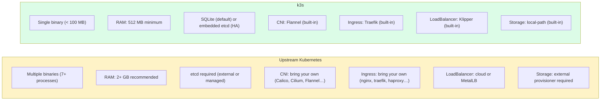
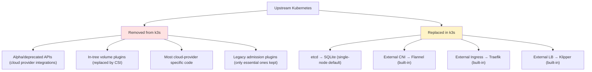
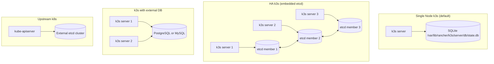
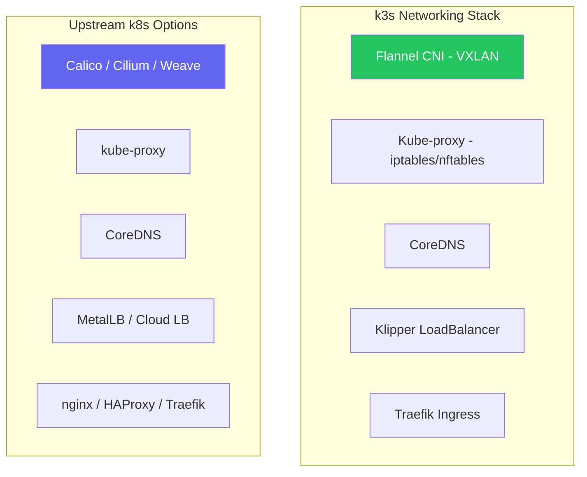

# k3s vs Kubernetes

> Module 01 · Lesson 02 | [↑ Course Index](../README.md)


[](../README.md)
[](../LICENSE.md)

## Table of Contents

- [Side-by-Side Comparison](#side-by-side-comparison)
- [What k3s Removes from Upstream k8s](#what-k3s-removes-from-upstream-k8s)
- [What k3s Adds Over Upstream k8s](#what-k3s-adds-over-upstream-k8s)
- [Component Mapping](#component-mapping)
- [API Compatibility](#api-compatibility)
- [Datastore Differences](#datastore-differences)
- [Networking Differences](#networking-differences)
- [When to Choose k3s vs Full k8s](#when-to-choose-k3s-vs-full-k8s)
- [Common Pitfalls](#common-pitfalls)
- [Further Reading](#further-reading)

---

## Side-by-Side Comparison



| Feature | Upstream k8s | k3s |
|---------|-------------|-----|
| Binary size | ~500 MB total | ~100 MB single binary |
| Minimum RAM (server) | ~2 GB | 512 MB |
| Default datastore | etcd (external) | SQLite (embedded) |
| HA datastore | etcd (external) | Embedded etcd or external DB |
| Default CNI | None (must install) | Flannel (built-in) |
| Default Ingress | None (must install) | Traefik v2 (built-in) |
| Default LoadBalancer | None (cloud or MetalLB) | Klipper (built-in) |
| Default Storage | None (must install) | local-path-provisioner |
| Helm support | Helm CLI required | HelmChart CRD + Helm controller |
| Container runtime | containerd / CRI-O | containerd (embedded) |
| TLS management | Manual or cert-manager | Automatic (built-in) |
| Release cadence | Every ~3 months | Follows upstream within days |
| CNCF certified | Yes | Yes |

[↑ Back to TOC](#table-of-contents) · [↑ Course Index](../README.md)

---

## What k3s Removes from Upstream k8s

k3s is not just "smaller k8s" — it deliberately removes or replaces certain components:



The removals reduce binary size and complexity. The replacements mean you get a usable cluster immediately after install — no extra addon installation needed.

[↑ Back to TOC](#table-of-contents) · [↑ Course Index](../README.md)

---

## What k3s Adds Over Upstream k8s

k3s also adds functionality that upstream Kubernetes does not have:

| Addition | Description |
|----------|-------------|
| `HelmChart` CRD | Deploy Helm charts declaratively via Kubernetes manifests — no Helm CLI needed |
| `HelmChartConfig` CRD | Override values of existing `HelmChart` resources without modifying them |
| `AddonsJob` CRD | Run one-time jobs to install manifests at cluster startup |
| Auto-deploying manifests | Drop YAML files in `/var/lib/rancher/k3s/server/manifests/` and they are applied automatically |
| Klipper LoadBalancer | Built-in bare-metal service load balancer — no cloud provider needed |
| Embedded etcd operator | Built-in etcd cluster management for HA without external tooling |
| `k3s etcd-snapshot` | Built-in backup and restore CLI for embedded etcd |
| `k3s token` | Manage node join tokens from the CLI |
| `k3s certificate` | Inspect and rotate cluster TLS certificates |

[↑ Back to TOC](#table-of-contents) · [↑ Course Index](../README.md)

---

## Component Mapping

When reading k8s documentation, use this map to understand the k3s equivalent:

| Kubernetes Concept | Upstream k8s | k3s Equivalent |
|-------------------|-------------|----------------|
| Datastore | External etcd | SQLite (dev) / Embedded etcd (HA) |
| API Server | `kube-apiserver` process | Embedded in `k3s server` |
| Scheduler | `kube-scheduler` process | Embedded in `k3s server` |
| Controller Manager | `kube-controller-manager` | Embedded in `k3s server` |
| Node Agent | `kubelet` process | Embedded in `k3s server`/`agent` |
| Network proxy | `kube-proxy` process | Embedded in `k3s server`/`agent` |
| Container runtime | Install separately | Embedded containerd |
| CNI plugin | Install separately | Embedded Flannel |
| Ingress controller | Install separately | Embedded Traefik |
| LoadBalancer | Cloud or MetalLB | Embedded Klipper |
| DNS | Install CoreDNS manually | Embedded CoreDNS |
| Storage provisioner | Install separately | Embedded local-path |
| Helm charts | Helm CLI + kubectl | `HelmChart` CRD |
| Kubeconfig | `~/.kube/config` | `/etc/rancher/k3s/k3s.yaml` |

[↑ Back to TOC](#table-of-contents) · [↑ Course Index](../README.md)

---

## API Compatibility

k3s implements the **full Kubernetes API**. Any valid Kubernetes manifest works with k3s without modification:

```bash
# Apply a standard k8s Deployment — works identically on k3s
kubectl apply -f https://k8s.io/examples/controllers/nginx-deployment.yaml

# All standard API groups are available
kubectl api-versions | grep apps
# apps/v1

kubectl api-resources | grep Deployment
# deployments   deploy   apps/v1   true   Deployment
```

k3s passes the [CNCF Kubernetes Conformance tests](https://www.cncf.io/certification/software-conformance/), meaning any workload certified for Kubernetes will run on k3s.

> **Important exception:** If your workload uses deprecated or alpha APIs that upstream has removed, k3s (which follows upstream closely) will also not support them.

[↑ Back to TOC](#table-of-contents) · [↑ Course Index](../README.md)

---

## Datastore Differences

This is the most significant architectural difference:



| Mode | Datastore | Use case | Notes |
|------|-----------|---------|-------|
| Default | SQLite | Dev, single-node, edge | Not HA, simple to manage |
| HA embedded | etcd (embedded) | Production HA | Requires 3+ server nodes |
| HA external | PostgreSQL / MySQL | Production HA | Familiar DB tooling, backups |
| Upstream k8s | etcd (external) | Large clusters | More ops overhead |

[↑ Back to TOC](#table-of-contents) · [↑ Course Index](../README.md)

---

## Networking Differences

k3s uses **Flannel** with VXLAN as the default CNI. This is simpler than most production k8s CNI choices:



You can **replace** Flannel with Calico or Cilium in k3s if you need:
- Network policies with enforcement (Flannel alone doesn't enforce them)
- eBPF-based networking
- Advanced security features

> **Note:** k3s includes a basic `NetworkPolicy` controller via Flannel + kube-router, but for full NetworkPolicy support, replace Flannel with Calico or Cilium.

[↑ Back to TOC](#table-of-contents) · [↑ Course Index](../README.md)

---

## When to Choose k3s vs Full k8s

```mermaid
flowchart TD
    Q1{Cluster size?}
    Q1 -->|"< 100 nodes"| Q2
    Q1 -->|"100+ nodes"| FULLK8S[Consider full k8s or managed service]

    Q2{Resource constrained?}
    Q2 -->|"Yes — edge/IoT/Pi"| K3S_YES[k3s ✅]
    Q2 -->|"No"| Q3

    Q3{Need simplicity?}
    Q3 -->|"Yes — minimal ops"| K3S_YES2[k3s ✅]
    Q3 -->|"No — full control"| Q4

    Q4{Air-gapped or on-prem?}
    Q4 -->|"Yes"| K3S_YES3[k3s ✅]
    Q4 -->|"No — cloud native"| Q5

    Q5{Advanced CNI (eBPF/Cilium)?}
    Q5 -->|"Yes — built-in"| MANAGED[EKS / GKE / AKS]
    Q5 -->|"Configurable"| K3S_YES4[k3s + Cilium ✅]

    style K3S_YES fill:#22c55e,color:#fff
    style K3S_YES2 fill:#22c55e,color:#fff
    style K3S_YES3 fill:#22c55e,color:#fff
    style K3S_YES4 fill:#22c55e,color:#fff
    style FULLK8S fill:#f59e0b,color:#fff
    style MANAGED fill:#6366f1,color:#fff
```

**Choose k3s when:**
- You need Kubernetes on resource-constrained hardware
- You want minimal operational overhead
- You're building edge, IoT, or air-gapped deployments
- You're learning Kubernetes or building a dev environment
- You need a quick, production-ready cluster for small workloads

**Consider alternatives when:**
- You need 100+ nodes with advanced networking (Cilium, BGP)
- You require advanced multi-tenancy with strict isolation
- Your team already operates managed k8s (EKS/GKE/AKS)
- You need Windows node support

[↑ Back to TOC](#table-of-contents) · [↑ Course Index](../README.md)

---

## Common Pitfalls

| Pitfall | Detail |
|---------|--------|
| Assuming Docker commands work | k3s uses containerd. Use `k3s crictl` not `docker` |
| Expecting Calico NetworkPolicy | Flannel's network policy support is limited; install Calico if needed |
| Using k3s in 1000-node clusters | k3s is tested and recommended for up to ~100 nodes |
| Mixing k3s and k8s configs | Keep kubeconfig files separate; use `KUBECONFIG` env var to switch |

[↑ Back to TOC](#table-of-contents) · [↑ Course Index](../README.md)

---

## Further Reading

- [k3s vs k8s — Official Comparison](https://docs.k3s.io/faq)
- [CNCF Conformance](https://www.cncf.io/certification/software-conformance/)
- [Flannel CNI](https://github.com/flannel-io/flannel)
- [Klipper LoadBalancer](https://github.com/k3s-io/klipper-lb)

[↑ Back to TOC](#table-of-contents) · [↑ Course Index](../README.md)

---

*Licensed under [CC BY-NC-SA 4.0](../LICENSE.md) · © 2026 UncleJS*
