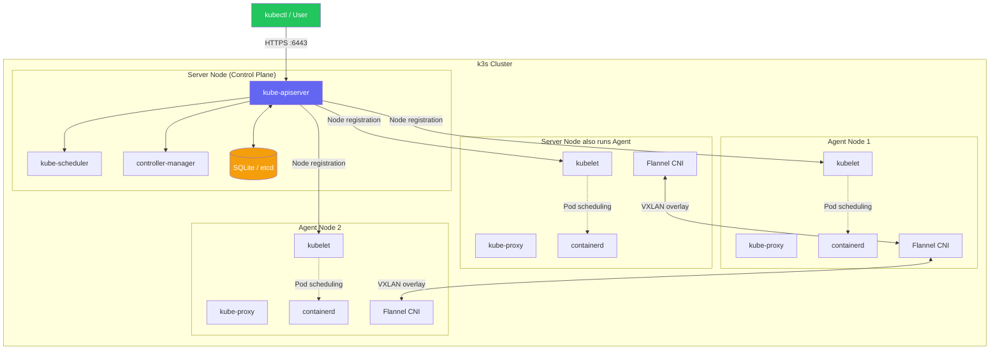
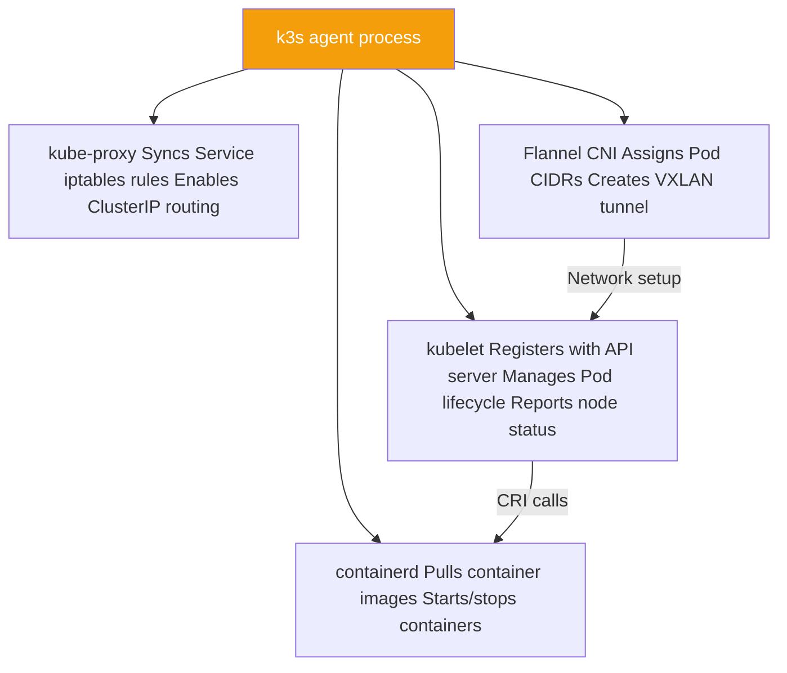
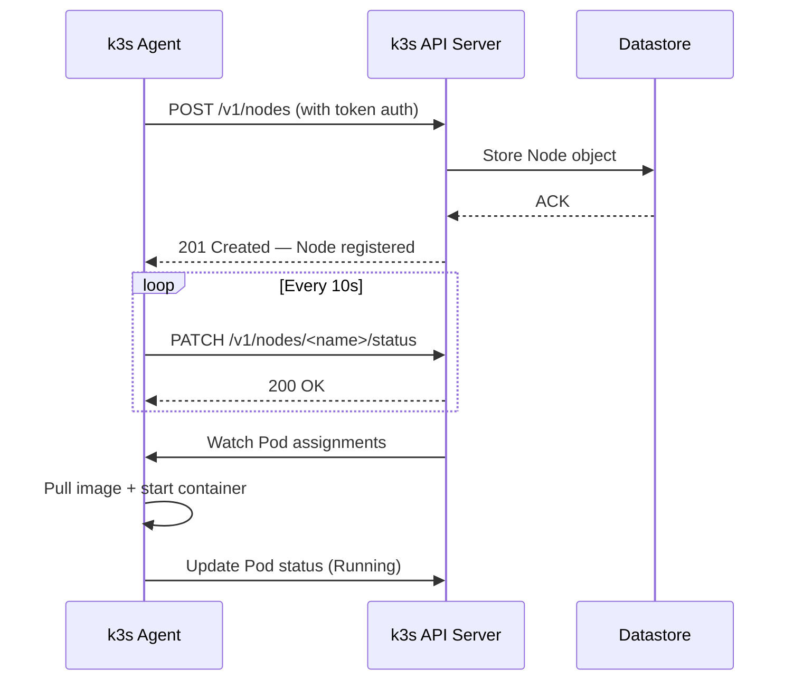
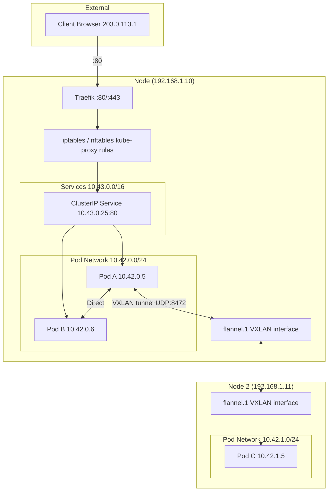
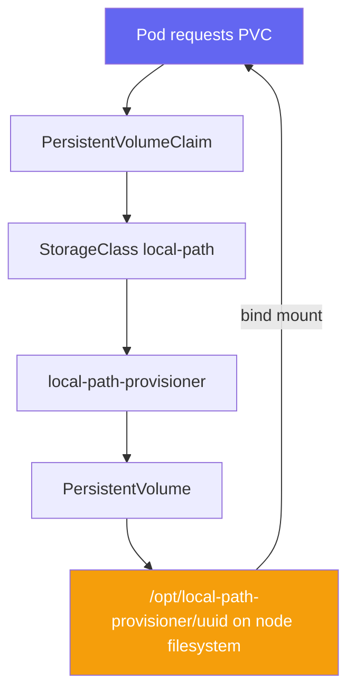
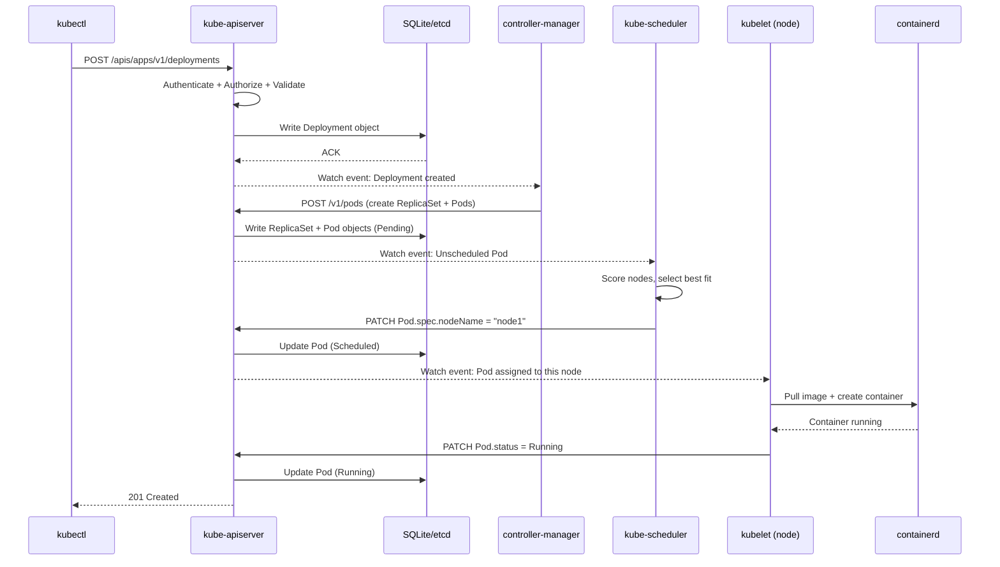
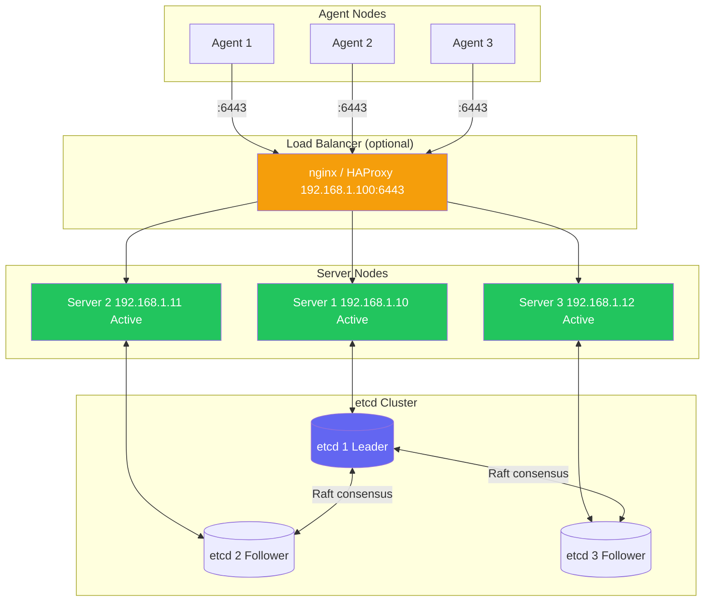

# Architecture Overview

> Module 01 · Lesson 03 | [↑ Course Index](../README.md)


[](../README.md)
[](../LICENSE.md)

## Table of Contents

- [High-Level Architecture](#high-level-architecture)
- [Server Node (Control Plane)](#server-node-control-plane)
- [Agent Node (Worker)](#agent-node-worker)
- [Embedded Components Deep Dive](#embedded-components-deep-dive)
- [Networking Architecture](#networking-architecture)
- [Storage Architecture](#storage-architecture)
- [Request Lifecycle](#request-lifecycle)
- [HA Architecture](#ha-architecture)
- [Data Flow Diagrams](#data-flow-diagrams)
- [Common Pitfalls](#common-pitfalls)
- [Further Reading](#further-reading)

---

## High-Level Architecture



The k3s cluster has two node types:

1. **Server node** — runs the control plane AND a local agent (can schedule workloads by default)
2. **Agent node** — runs only the agent components, registers with the server, runs workloads

[↑ Back to TOC](#table-of-contents) · [↑ Course Index](../README.md)

---

## Server Node (Control Plane)

A k3s server node runs these components inside a single `k3s` process:

```mermaid
flowchart TD
    K3S["k3s server process (PID 1)"]
    K3S --> API["kube-apiserver REST API :6443 Validates & stores resources"]
    K3S --> SCH["kube-scheduler Watches unscheduled Pods Assigns to Nodes"]
    K3S --> CM["kube-controller-manager Deployment controller Node controller Endpoint controller etc."]
    K3S --> DS["Datastore SQLite (default) etcd (HA mode)"]
    K3S --> KL["kubelet (local agent) Manages Pods on this node"]
    K3S --> KP["kube-proxy Manages iptables/nftables rules"]
    K3S --> CD["containerd Pulls images Starts containers"]
    K3S --> FL["Flannel CNI Pod network overlay"]
    K3S --> TR["Traefik Ingress (deployed as Pod)"]
    K3S --> DNS["CoreDNS (deployed as Pod)"]
    K3S --> LB["Klipper LoadBalancer (deployed as Pod)"]
    K3S --> SP["local-path-provisioner (deployed as Pod)"]

    style K3S fill:#6366f1,color:#fff
    style DS fill:#f59e0b,color:#fff
```



### Key server paths

| Path | Purpose |
|------|---------|
| `/etc/rancher/k3s/k3s.yaml` | Kubeconfig file for kubectl |
| `/var/lib/rancher/k3s/server/` | Server data (etcd/SQLite, certs, tokens) |
| `/var/lib/rancher/k3s/server/node-token` | Node join token (agents) |
| `/var/lib/rancher/k3s/server/token` | Server join token |
| `/var/lib/rancher/k3s/server/manifests/` | Auto-deploy manifests directory |
| `/var/lib/rancher/k3s/server/tls/` | Cluster TLS certificates |
| `/etc/rancher/k3s/config.yaml` | k3s configuration file |

[↑ Back to TOC](#table-of-contents) · [↑ Course Index](../README.md)

---

## Agent Node (Worker)

A k3s agent node runs a subset of components:



### Agent registration flow



[↑ Back to TOC](#table-of-contents) · [↑ Course Index](../README.md)

---

## Embedded Components Deep Dive

### containerd

k3s bundles containerd and configures it automatically. The containerd socket is at:

```
/run/k3s/containerd/containerd.sock
```

k3s sets up containerd with:
- Pause image for pod sandboxes
- Registry mirror configuration (if provided)
- Snapshotter (overlayfs by default)

```bash
# Inspect containerd state via k3s
sudo k3s crictl info           # runtime info
sudo k3s crictl ps             # running containers
sudo k3s crictl images         # pulled images
sudo k3s ctr namespaces ls     # containerd namespaces (k8s.io is k3s's)
```

### Flannel CNI

Flannel creates a flat Layer 3 network across all nodes using VXLAN:

```
Pod CIDR (default): 10.42.0.0/16
  Node 1 pods: 10.42.0.0/24
  Node 2 pods: 10.42.1.0/24
  Node 3 pods: 10.42.2.0/24

Service CIDR (default): 10.43.0.0/16
```

### CoreDNS

CoreDNS provides DNS resolution for Service names:

```
Service format:  <service>.<namespace>.svc.cluster.local
Pod format:      <pod-ip-dashes>.<namespace>.pod.cluster.local

Example:
  my-service.default.svc.cluster.local → 10.43.0.25
```

### Traefik

Traefik is deployed as a DaemonSet in the `kube-system` namespace and binds to host ports 80 and 443.

### Klipper LoadBalancer

Klipper assigns the node's IP as the `LoadBalancer` IP for `Service` objects of type `LoadBalancer`. On multi-node clusters, it uses the first available node.

[↑ Back to TOC](#table-of-contents) · [↑ Course Index](../README.md)

---

## Networking Architecture



[↑ Back to TOC](#table-of-contents) · [↑ Course Index](../README.md)

---

## Storage Architecture



The default `local-path` storage class:
- Creates a directory under `/opt/local-path-provisioner/`
- Binds the PVC to whichever node the pod is scheduled on
- **Not replicated** — if the node fails, data is lost (use Longhorn for HA storage)

[↑ Back to TOC](#table-of-contents) · [↑ Course Index](../README.md)

---

## Request Lifecycle

Trace what happens when you run `kubectl apply -f deployment.yaml`:



[↑ Back to TOC](#table-of-contents) · [↑ Course Index](../README.md)

---

## HA Architecture

When running k3s in HA mode (3+ server nodes with embedded etcd):



HA requirements:
- Minimum **3 server nodes** (odd number for etcd quorum)
- A **load balancer** or VIP in front of the API servers (k3s can use embedded supervisor LB)
- All servers must be able to reach each other on ports 2379, 2380 (etcd), and 6443 (API)

[↑ Back to TOC](#table-of-contents) · [↑ Course Index](../README.md)

---

## Common Pitfalls

| Pitfall | Detail |
|---------|--------|
| Server node scheduling workloads | By default, the server node also runs workloads. Taint it if you want a dedicated control plane |
| Single server = single point of failure | SQLite on one server has no HA. Use embedded etcd with 3 servers for production |
| Flannel VXLAN blocked | UDP port 8472 must be open between nodes for pod-to-pod communication |
| API server port blocked | TCP 6443 must be open from agents to servers |
| Node token exposure | `/var/lib/rancher/k3s/server/node-token` (and `/var/lib/rancher/k3s/server/token`) must be kept secret — they allow machines to join the cluster |

[↑ Back to TOC](#table-of-contents) · [↑ Course Index](../README.md)

---

## Further Reading

- [k3s Architecture Docs](https://docs.k3s.io/architecture)
- [Kubernetes Components](https://kubernetes.io/docs/concepts/overview/components/)
- [etcd Documentation](https://etcd.io/docs/)
- [Flannel Network Documentation](https://github.com/flannel-io/flannel/blob/master/Documentation/backends.md)
- [containerd Architecture](https://containerd.io/docs/getting-started/)

[↑ Back to TOC](#table-of-contents) · [↑ Course Index](../README.md)

---

*Licensed under [CC BY-NC-SA 4.0](../LICENSE.md) · © 2026 UncleJS*
