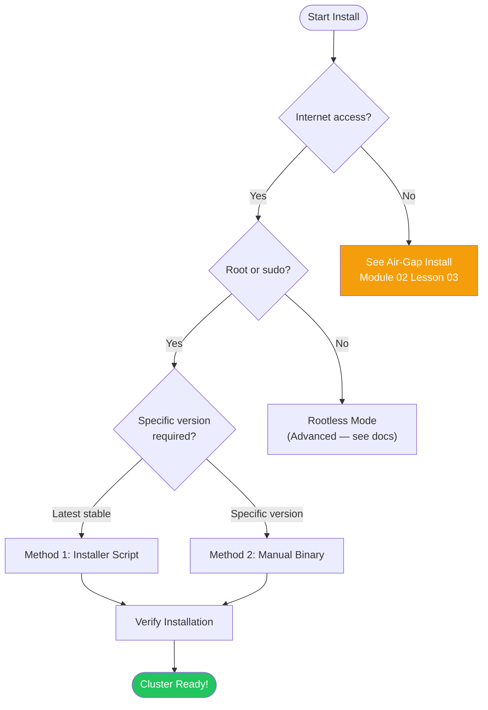
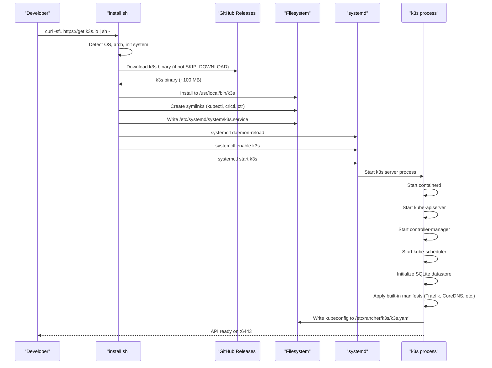
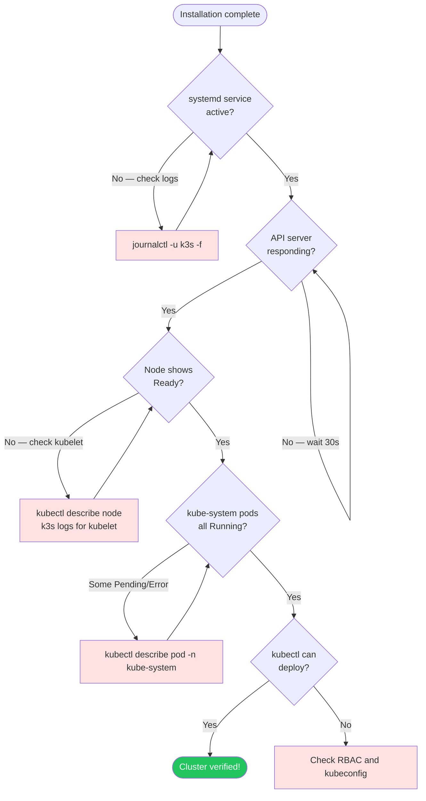

# Single-Node Quickstart

> Module 02 · Lesson 01 | [↑ Course Index](../README.md)

[](../README.md)
[](../LICENSE.md)

## Table of Contents

- [Prerequisites](#prerequisites)
- [Installation Methods](#installation-methods)
- [Method 1: Official Installer Script](#method-1-official-installer-script)
- [What the Install Script Does](#what-the-install-script-does)
- [Method 2: Manual Binary Install](#method-2-manual-binary-install)
- [Configure kubectl Access](#configure-kubectl-access)
- [Accessing the Cluster Remotely](#accessing-the-cluster-remotely)
- [Verifying the Installation](#verifying-the-installation)
- [Understanding the Default Configuration](#understanding-the-default-configuration)
- [First kubectl Commands](#first-kubectl-commands)
- [Deploy Your First App](#deploy-your-first-app)
- [Uninstalling k3s](#uninstalling-k3s)
- [Common Pitfalls](#common-pitfalls)
- [Further Reading](#further-reading)

---

## Prerequisites

Before installing, verify your system meets the minimum requirements:

> **Important:** This lesson installs a **single-node server** cluster. That one machine runs the control plane, datastore, and workloads, so use **server** sizing guidance (2 CPU / 2 GB RAM minimum). The 512 MB minimum applies to **agent-only** nodes.

```bash
# Check OS
cat /etc/os-release

# Check kernel version (4.15+ required, 5.x+ recommended)
uname -r

# Check CPU cores (2 cores minimum for a server node)
nproc

# Check available RAM (2 GB minimum for a server node)
free -h

# Check available disk (5 GB minimum)
df -h /

# Check cgroup support
stat -fc %T /sys/fs/cgroup/

# Swap guidance: recommended to disable for predictable behavior.
# Older k3s/kubelet versions require swap off.
sudo swapoff -a
# Optional: make it permanent if this host is dedicated to k3s.
sudo sed -i '/ swap / s/^\(.*\)$/#\1/' /etc/fstab
```

### Supported Operating Systems

| OS | Versions | Notes |
|----|----------|-------|
| Ubuntu | 20.04, 22.04, 24.04 | LTS recommended |
| Debian | 11, 12 | |
| RHEL / Rocky / AlmaLinux | 8, 9 | SELinux support available |
| Fedora | 37+ | |
| Raspberry Pi OS | Bookworm (64-bit) | arm64 binary |
| openSUSE / SLES | Leap 15.x | Native SUSE support |
| Alpine Linux | 3.17+ | |

### Installation decision tree



[↑ Back to TOC](#table-of-contents) · [↑ Course Index](../README.md)

---

## Installation Methods

k3s can be installed several ways:

| Method | Best for | Pros | Cons |
|--------|---------|------|------|
| Installer script | Most users | Automatic, handles systemd | Requires internet |
| Manual binary | Air-gap, custom | Full control | More steps |
| k3sup (third party) | Multi-node automation | Fast for clusters | Requires SSH |
| Helm (k3s-io/k3s) | GitOps install | Declarative | Complex |

[↑ Back to TOC](#table-of-contents) · [↑ Course Index](../README.md)

---

## Method 1: Official Installer Script

The official installer script downloads the binary, creates the systemd service, and starts k3s in one step:

```bash
# Install latest stable k3s
curl -sfL https://get.k3s.io | sh -

# Install specific version
curl -sfL https://get.k3s.io | INSTALL_K3S_VERSION="YOUR_K3S_VERSION" sh -
# Example: INSTALL_K3S_VERSION="v1.30.3+k3s1"

# Install with custom options
curl -sfL https://get.k3s.io | sh -s - \
  --write-kubeconfig-mode 644 \
  --disable traefik \
  --node-name my-server-01
```

### Watch the install happen

```bash
# In a second terminal, watch the service come up
journalctl -u k3s -f
```

Expected output:
```
k3s[1234]: time="..." level=info msg="Starting k3s YOUR_K3S_VERSION"
k3s[1234]: time="..." level=info msg="Starting containerd"
k3s[1234]: time="..." level=info msg="containerd is now running"
k3s[1234]: time="..." level=info msg="Running kube-apiserver"
k3s[1234]: time="..." level=info msg="Node controller sync successful"
k3s[1234]: time="..." level=info msg="k3s is up and running"
```

[↑ Back to TOC](#table-of-contents) · [↑ Course Index](../README.md)

---

## What the Install Script Does

The installer script (`get.k3s.io`) performs a well-defined sequence of steps. Understanding this helps you debug failed installs and customize the process for air-gap or corporate environments.



### Step-by-Step Breakdown

**Step 1: Detect environment**
The script detects your OS, CPU architecture (amd64/arm64/arm), init system (systemd/openrc), and package manager. This determines which binary to download and how to install it.

**Step 2: Download binary**
The `k3s` binary is downloaded from `github.com/k3s-io/k3s/releases`. If `INSTALL_K3S_SKIP_DOWNLOAD=true`, this step is skipped (air-gap mode).

**Step 3: Install binary and symlinks**
The binary is installed to `INSTALL_K3S_BIN_DIR` (default `/usr/local/bin`). Symlinks are created:
- `/usr/local/bin/kubectl` → `k3s`
- `/usr/local/bin/crictl` → `k3s`
- `/usr/local/bin/ctr` → `k3s`

**Step 4: Create systemd service**
The installer writes `/etc/systemd/system/k3s.service` with appropriate resource limits (`LimitNOFILE=1048576`, `TasksMax=infinity`), restarts on failure, and the `Delegate=yes` setting required for cgroup management.

**Step 5: Enable and start**
`systemctl enable k3s` creates the WantedBy symlink so k3s starts on boot. `systemctl start k3s` starts the process immediately.

**Step 6: k3s initialization**
The k3s process starts its embedded components in order: containerd → datastore (SQLite) → kube-apiserver → controller-manager → scheduler. The API server is typically ready in 15–30 seconds on a modern machine.

**Step 7: Write kubeconfig**
Once the API is ready, k3s writes the kubeconfig to `/etc/rancher/k3s/k3s.yaml` (mode `0600` by default, or the value of `--write-kubeconfig-mode`).

**Step 8: Apply built-in manifests**
k3s watches `/var/lib/rancher/k3s/server/manifests/` and applies YAML files automatically. Built-in components (Traefik, CoreDNS, Klipper, local-path, metrics-server) are applied via files in this directory.

[↑ Back to TOC](#table-of-contents) · [↑ Course Index](../README.md)

---

## Method 2: Manual Binary Install

Use this when you need full control over the install or are doing an air-gap setup:

```bash
# 1. Download the binary
K3S_VERSION="YOUR_K3S_VERSION"
curl -LO "https://github.com/k3s-io/k3s/releases/download/${K3S_VERSION}/k3s"

# 2. Make it executable and move to PATH
chmod +x k3s
sudo mv k3s /usr/local/bin/k3s

# 3. Verify binary
k3s --version

# 4. Create the systemd unit file
sudo tee /etc/systemd/system/k3s.service <<'EOF'
[Unit]
Description=Lightweight Kubernetes
Documentation=https://k3s.io
Wants=network-online.target
After=network-online.target

[Service]
Type=notify
EnvironmentFile=-/etc/default/k3s
EnvironmentFile=-/etc/sysconfig/k3s
ExecStartPre=-/sbin/modprobe br_netfilter
ExecStartPre=-/sbin/modprobe overlay
ExecStart=/usr/local/bin/k3s server
KillMode=process
Delegate=yes
LimitNOFILE=1048576
LimitNPROC=infinity
LimitCORE=infinity
TasksMax=infinity
TimeoutStartSec=0
Restart=always
RestartSec=5s

[Install]
WantedBy=multi-user.target
EOF

# 5. Enable and start
sudo systemctl daemon-reload
sudo systemctl enable k3s
sudo systemctl start k3s
```

[↑ Back to TOC](#table-of-contents) · [↑ Course Index](../README.md)

---

## Configure kubectl Access

By default, the kubeconfig requires root. Configure user access:

```bash
# Option A: Set KUBECONFIG env var (reads /etc/rancher/k3s/k3s.yaml)
export KUBECONFIG=/etc/rancher/k3s/k3s.yaml
kubectl get nodes

# Option B: Make kubeconfig world-readable (not recommended for shared systems)
sudo chmod 644 /etc/rancher/k3s/k3s.yaml

# Option C: Copy kubeconfig to your home directory (recommended for single-user)
mkdir -p ~/.kube
sudo cp /etc/rancher/k3s/k3s.yaml ~/.kube/config
sudo chown $(id -u):$(id -g) ~/.kube/config
# Edit the server URL if accessing from another machine:
# sed -i 's/127.0.0.1/<SERVER_IP>/' ~/.kube/config

# Add to your shell profile for persistence
echo 'export KUBECONFIG=~/.kube/config' >> ~/.bashrc
source ~/.bashrc

# Verify
kubectl get nodes
```

[↑ Back to TOC](#table-of-contents) · [↑ Course Index](../README.md)

---

## Accessing the Cluster Remotely

By default, k3s binds the API server on `127.0.0.1:6443` and the kubeconfig uses that address. To access the cluster from a remote machine, you need to update the kubeconfig to use the server's public IP.

```bash
# On the k3s server — get the kubeconfig
sudo cat /etc/rancher/k3s/k3s.yaml

# Copy it to your local machine, then replace 127.0.0.1 with the server's IP:
scp user@server:/etc/rancher/k3s/k3s.yaml ~/.kube/k3s-config
sed -i 's/127.0.0.1/<SERVER_PUBLIC_IP>/' ~/.kube/k3s-config
export KUBECONFIG=~/.kube/k3s-config
kubectl get nodes
```

> **TLS certificate requirement:** Remote access requires the server's IP or hostname to be included in the API server's TLS certificate SAN list. If you get a TLS error, you need to add the IP as a TLS SAN when installing k3s:
> ```bash
> curl -sfL https://get.k3s.io | sh -s - --tls-san <SERVER_PUBLIC_IP>
> ```
> Or if already installed, add it to `/etc/rancher/k3s/config.yaml` and rotate certificates:
> ```bash
> # Add to config.yaml:
> # tls-san:
> #   - <SERVER_PUBLIC_IP>
> sudo k3s certificate rotate
> sudo systemctl restart k3s
> ```

### Using Multiple Kubeconfigs

If you manage multiple clusters, use `KUBECONFIG` with multiple files or merge them:

```bash
# Point to multiple kubeconfigs
export KUBECONFIG=~/.kube/config:~/.kube/k3s-config

# List all contexts
kubectl config get-contexts

# Switch between clusters
kubectl config use-context k3s-context-name

# Or use kubectx for easy switching
kubectx k3s-home
kubectx production
```

[↑ Back to TOC](#table-of-contents) · [↑ Course Index](../README.md)

---

## Verifying the Installation

A successful installation requires verifying multiple layers. Use this systematic checklist:



```bash
# 1. Check service status
systemctl status k3s
# Expected: Active: active (running)

# 2. Check k3s version
k3s --version
kubectl version
# Both should show matching Kubernetes versions

# 3. Check node is Ready
kubectl get nodes
# Expected:
# NAME         STATUS   ROLES                  AGE   VERSION
# my-server    Ready    control-plane,master   1m    vX.YY.Z+k3s1

# 4. Check all system pods are Running
kubectl get pods -n kube-system
# Expected: coredns, traefik, local-path-provisioner, metrics-server all Running

# 5. Check cluster info
kubectl cluster-info
# Expected:
# Kubernetes control plane is running at https://127.0.0.1:6443
# CoreDNS is running at .../api/v1/namespaces/kube-system/services/kube-dns:dns/proxy

# 6. Verify API server health endpoint
kubectl get --raw /healthz
# Expected: ok

# 7. Check node resource usage
kubectl top nodes
# Expected: CPU and memory usage shown

# 8. Verify DNS works
kubectl run dns-test --image=busybox:1.36 --restart=Never -- nslookup kubernetes.default
kubectl logs dns-test
# Expected: kubernetes.default resolved successfully
kubectl delete pod dns-test
```

[↑ Back to TOC](#table-of-contents) · [↑ Course Index](../README.md)

---

## Understanding the Default Configuration

After installation, k3s runs several components by default. Understanding what runs and where files live is essential for debugging and customization.

### What Runs by Default

| Component | Namespace | Purpose |
|-----------|-----------|---------|
| `traefik` | `kube-system` | HTTP/HTTPS ingress controller |
| `coredns` | `kube-system` | Cluster DNS for service discovery |
| `local-path-provisioner` | `kube-system` | Automatic PVC provisioning on the node |
| `metrics-server` | `kube-system` | Resource metrics API (for `kubectl top`) |
| `svclb-traefik` | `kube-system` | Klipper DaemonSet exposing Traefik ports |

### Important File Locations

| Path | Purpose |
|------|---------|
| `/usr/local/bin/k3s` | k3s binary |
| `/etc/rancher/k3s/k3s.yaml` | Kubeconfig (root-owned by default) |
| `/etc/rancher/k3s/config.yaml` | k3s server configuration file |
| `/etc/rancher/k3s/registries.yaml` | Private registry configuration |
| `/var/lib/rancher/k3s/server/db/` | SQLite database (single-node datastore) |
| `/var/lib/rancher/k3s/server/manifests/` | Auto-applied YAML manifests |
| `/var/lib/rancher/k3s/server/tls/` | Cluster TLS certificates |
| `/var/lib/rancher/k3s/agent/images/` | Pre-loaded container images (air-gap) |
| `/var/lib/rancher/k3s/agent/containerd/` | Containerd state and images |
| `/run/k3s/containerd/containerd.sock` | Containerd socket |
| `/etc/systemd/system/k3s.service` | Systemd unit file |

### Auto-Deploying Manifests

k3s watches `/var/lib/rancher/k3s/server/manifests/` and applies any YAML files there automatically. Built-in components are loaded from here:

```bash
ls /var/lib/rancher/k3s/server/manifests/
# ccm.yaml          (cloud controller manager)
# coredns.yaml      (CoreDNS)
# local-storage.yaml (local-path-provisioner)
# metrics-server/   (metrics-server)
# rolebindings.yaml (default RBAC)
# traefik.yaml      (Traefik ingress)
```

You can add your own manifests here for automatic application. This is k3s's native GitOps mechanism for system-level components.

[↑ Back to TOC](#table-of-contents) · [↑ Course Index](../README.md)

---

## First kubectl Commands

Run these ten commands immediately after installation to orient yourself in the cluster:

```bash
# 1. What version is running?
kubectl version --short
# Client Version: vX.YY.Z
# Server Version: vX.YY.Z+k3s1

# 2. What nodes are in the cluster?
kubectl get nodes -o wide
# Shows node name, status, roles, age, version, IP, OS, kernel, container runtime

# 3. What namespaces exist?
kubectl get namespaces
# default, kube-node-lease, kube-public, kube-system

# 4. What's running in kube-system?
kubectl get pods -n kube-system -o wide
# Shows all system pods, their nodes, IPs, and status

# 5. What storage classes are available?
kubectl get storageclass
# local-path (default) — rancher.io/local-path

# 6. What services are running?
kubectl get svc -A
# Includes kubernetes (API), kube-dns (CoreDNS), traefik

# 7. What API resources are available?
kubectl api-resources | head -30
# Lists all resource types with their API groups and scope

# 8. What are the resource usages?
kubectl top nodes
kubectl top pods -A

# 9. What events have occurred recently?
kubectl get events -A --sort-by='.lastTimestamp' | tail -20
# Recent cluster events — useful for spotting issues

# 10. What is the full cluster info?
kubectl cluster-info dump | head -100
# Detailed cluster state snapshot (useful for bug reports)
```

### Expected Output Walkthrough

After a clean install, `kubectl get pods -n kube-system` should show something like:

```
NAME                                     READY   STATUS    RESTARTS   AGE
coredns-7b98449c4-abcde                  1/1     Running   0          2m
helm-install-traefik-crd-xyz12           0/1     Completed 0          2m
helm-install-traefik-abc34               0/1     Completed 0          2m
local-path-provisioner-6c86858495-xyz    1/1     Running   0          2m
metrics-server-54fd9b65b-abcde           1/1     Running   0          2m
svclb-traefik-12345-abc                  2/2     Running   0          2m
traefik-d7c9c5778-abcde                  1/1     Running   0          2m
```

The `helm-install-*` pods show `Completed` — this is normal. They are one-shot Jobs that install Traefik and its CRDs via the HelmChart controller.

[↑ Back to TOC](#table-of-contents) · [↑ Course Index](../README.md)

---

## Deploy Your First App

Let's deploy nginx to verify the cluster works end-to-end:

```bash
# Create a simple nginx deployment
kubectl create deployment nginx --image=nginx:alpine

# Expose it
kubectl expose deployment nginx --port=80 --type=NodePort

# Watch pods come up
kubectl get pods -w
# NAME                     READY   STATUS    RESTARTS   AGE
# nginx-7d96c7c456-abc12   1/1     Running   0          30s

# Find the NodePort
kubectl get svc nginx
# NAME    TYPE       CLUSTER-IP    EXTERNAL-IP   PORT(S)        AGE
# nginx   NodePort   10.43.0.123   <none>        80:31234/TCP   10s

# Test it (use the NodePort shown above)
curl http://localhost:31234
# Expected: nginx welcome page HTML

# Clean up
kubectl delete deployment nginx
kubectl delete svc nginx
```

[↑ Back to TOC](#table-of-contents) · [↑ Course Index](../README.md)

---

## Uninstalling k3s

k3s ships with uninstall scripts for quick removal:

```bash
# Uninstall server node
sudo /usr/local/bin/k3s-uninstall.sh

# Uninstall agent node
sudo /usr/local/bin/k3s-agent-uninstall.sh
```

For full uninstall guidance (pre-flight backups, multi-node tear-down order, manual cleanup fallback, and post-uninstall audit), see [Uninstall & Cleanup](04_uninstall_and_cleanup.md).

> **Warning:** Uninstall removes local k3s state, certs, and images from the host.

[↑ Back to TOC](#table-of-contents) · [↑ Course Index](../README.md)

---

## Common Pitfalls

| Pitfall | Symptom | Fix |
|---------|---------|-----|
| Swap configuration mismatch | `kubelet` startup errors on older versions | Disable swap with `sudo swapoff -a` or configure kubelet swap behavior for your k3s version |
| Firewall blocking 6443 | `kubectl` connection refused | Open TCP 6443: `sudo ufw allow 6443/tcp` |
| SELinux enforcing | Pods crash, permission denied in logs | `sudo setenforce 0` or install k3s SELinux policy |
| cgroup v1 without memory accounting | Pods OOMKilled | Add `cgroup_enable=memory swapaccount=1` to grub cmdline |
| Low disk space | Pods fail to pull images, API errors | Ensure 5 GB free on the partition with `/var/lib/rancher` |
| Kubeconfig permissions | `kubectl` permission denied | `sudo chmod 644 /etc/rancher/k3s/k3s.yaml` or copy to `~/.kube/config` |
| Wrong server IP in kubeconfig | `kubectl` times out from remote | Edit kubeconfig: replace `127.0.0.1` with the server's real IP |
| Missing TLS SAN for remote access | x509 certificate error | Add `--tls-san <IP>` and rotate certs |
| Port 6443 not in TLS certificate | TLS handshake fails | Always add external IPs to `--tls-san` before remote access |

[↑ Back to TOC](#table-of-contents) · [↑ Course Index](../README.md)

---

## Further Reading

- [k3s Quick Start Guide](https://docs.k3s.io/quick-start)
- [k3s Installation Options](https://docs.k3s.io/installation/configuration)
- [k3s Releases on GitHub](https://github.com/k3s-io/k3s/releases)
- [k3sup — Multi-node k3s installer](https://github.com/alexellis/k3sup)
- [Containerd Documentation](https://containerd.io/docs/)

[↑ Back to TOC](#table-of-contents) · [↑ Course Index](../README.md)

---

*Licensed under [CC BY-NC-SA 4.0](../LICENSE.md) · © 2026 UncleJS*
