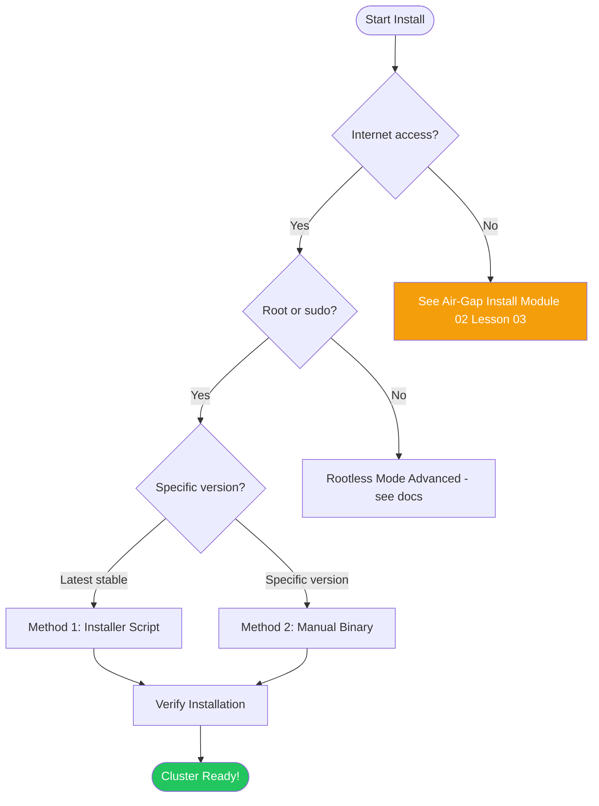
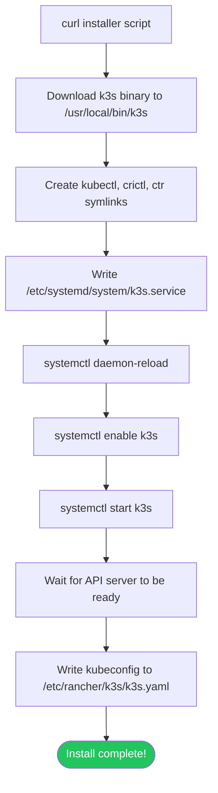

# Single-Node Quickstart

> Module 02 · Lesson 01 | [↑ Course Index](../README.md)

## Table of Contents

- [Prerequisites](#prerequisites)
- [Installation Methods](#installation-methods)
- [Method 1: Official Installer Script](#method-1-official-installer-script)
- [Method 2: Manual Binary Install](#method-2-manual-binary-install)
- [Configure kubectl Access](#configure-kubectl-access)
- [Verify the Installation](#verify-the-installation)
- [Deploy Your First App](#deploy-your-first-app)
- [Uninstalling k3s](#uninstalling-k3s)
- [Common Pitfalls](#common-pitfalls)
- [Further Reading](#further-reading)

---

## Prerequisites

Before installing, verify your system meets the minimum requirements:

> **Important:** This lesson installs a **single-node server** cluster. That one machine runs the control plane, datastore, and workloads, so use **server** sizing guidance (2 CPU / 2 GB RAM minimum). The 512 MB minimum applies to **agent-only** nodes.

```bash
# Check OS
cat /etc/os-release

# Check kernel version (4.15+ required, 5.x+ recommended)
uname -r

# Check CPU cores (2 cores minimum for a server node)
nproc

# Check available RAM (2 GB minimum for a server node)
free -h

# Check available disk (5 GB minimum)
df -h /

# Check cgroup support
stat -fc %T /sys/fs/cgroup/

# Swap guidance: recommended to disable for predictable behavior.
# Older k3s/kubelet versions require swap off.
sudo swapoff -a
# Optional: make it permanent if this host is dedicated to k3s.
sudo sed -i '/ swap / s/^\(.*\)$/#\1/' /etc/fstab
```

### Installation decision tree



[↑ Back to TOC](#table-of-contents) · [↑ Course Index](../README.md)

---

## Installation Methods

k3s can be installed several ways:

| Method | Best for | Pros | Cons |
|--------|---------|------|------|
| Installer script | Most users | Automatic, handles systemd | Requires internet |
| Manual binary | Air-gap, custom | Full control | More steps |
| k3sup (third party) | Multi-node automation | Fast for clusters | Requires SSH |
| Helm (k3s-io/k3s) | GitOps install | Declarative | Complex |

[↑ Back to TOC](#table-of-contents) · [↑ Course Index](../README.md)

---

## Method 1: Official Installer Script

The official installer script downloads the binary, creates the systemd service, and starts k3s in one step:

```bash
# Install latest stable k3s
curl -sfL https://get.k3s.io | sh -

# Install specific version
curl -sfL https://get.k3s.io | INSTALL_K3S_VERSION="YOUR_K3S_VERSION" sh -
# Example: INSTALL_K3S_VERSION="v1.35.1+k3s1"

# Install with custom options
curl -sfL https://get.k3s.io | sh -s - \
  --write-kubeconfig-mode 644 \
  --disable traefik \
  --node-name my-server-01
```

### What the installer does



### Watch the install happen

```bash
# In a second terminal, watch the service come up
journalctl -u k3s -f
```

Expected output:
```
k3s[1234]: time="..." level=info msg="Starting k3s YOUR_K3S_VERSION"
k3s[1234]: time="..." level=info msg="Starting containerd"
k3s[1234]: time="..." level=info msg="containerd is now running"
k3s[1234]: time="..." level=info msg="Running kube-apiserver"
k3s[1234]: time="..." level=info msg="Node controller sync successful"
k3s[1234]: time="..." level=info msg="k3s is up and running"
```

[↑ Back to TOC](#table-of-contents) · [↑ Course Index](../README.md)

---

## Method 2: Manual Binary Install

Use this when you need full control over the install or are doing an air-gap setup:

```bash
# 1. Download the binary
K3S_VERSION="YOUR_K3S_VERSION"
curl -LO "https://github.com/k3s-io/k3s/releases/download/${K3S_VERSION}/k3s"

# 2. Make it executable and move to PATH
chmod +x k3s
sudo mv k3s /usr/local/bin/k3s

# 3. Verify binary
k3s --version

# 4. Create the systemd unit file
sudo tee /etc/systemd/system/k3s.service <<'EOF'
[Unit]
Description=Lightweight Kubernetes
Documentation=https://k3s.io
Wants=network-online.target
After=network-online.target

[Service]
Type=notify
EnvironmentFile=-/etc/default/k3s
EnvironmentFile=-/etc/sysconfig/k3s
ExecStartPre=-/sbin/modprobe br_netfilter
ExecStartPre=-/sbin/modprobe overlay
ExecStart=/usr/local/bin/k3s server
KillMode=process
Delegate=yes
LimitNOFILE=1048576
LimitNPROC=infinity
LimitCORE=infinity
TasksMax=infinity
TimeoutStartSec=0
Restart=always
RestartSec=5s

[Install]
WantedBy=multi-user.target
EOF

# 5. Enable and start
sudo systemctl daemon-reload
sudo systemctl enable k3s
sudo systemctl start k3s
```

[↑ Back to TOC](#table-of-contents) · [↑ Course Index](../README.md)

---

## Configure kubectl Access

By default, the kubeconfig requires root. Configure user access:

```bash
# Option A: Set KUBECONFIG env var (reads /etc/rancher/k3s/k3s.yaml)
export KUBECONFIG=/etc/rancher/k3s/k3s.yaml
kubectl get nodes

# Option B: Make kubeconfig world-readable (not recommended for shared systems)
sudo chmod 644 /etc/rancher/k3s/k3s.yaml

# Option C: Copy kubeconfig to your home directory (recommended for single-user)
mkdir -p ~/.kube
sudo cp /etc/rancher/k3s/k3s.yaml ~/.kube/config
sudo chown $(id -u):$(id -g) ~/.kube/config
# Edit the server URL if accessing from another machine:
# sed -i 's/127.0.0.1/<SERVER_IP>/' ~/.kube/config

# Add to your shell profile for persistence
echo 'export KUBECONFIG=~/.kube/config' >> ~/.bashrc
source ~/.bashrc

# Verify
kubectl get nodes
```

### Access k3s cluster from a remote machine

```bash
# On the k3s server — get the kubeconfig
sudo cat /etc/rancher/k3s/k3s.yaml

# Copy it to your local machine, then replace 127.0.0.1 with the server's IP:
scp user@server:/etc/rancher/k3s/k3s.yaml ~/.kube/k3s-config
sed -i 's/127.0.0.1/<SERVER_PUBLIC_IP>/' ~/.kube/k3s-config
export KUBECONFIG=~/.kube/k3s-config
kubectl get nodes
```

[↑ Back to TOC](#table-of-contents) · [↑ Course Index](../README.md)

---

## Verify the Installation

```bash
# Check service status
systemctl status k3s

# Check k3s version
k3s --version
kubectl version

# Check node is Ready
kubectl get nodes
# Expected:
# NAME         STATUS   ROLES                  AGE   VERSION
# my-server    Ready    control-plane,master   1m    YOUR_K3S_VERSION

# Check all system pods are Running
kubectl get pods -n kube-system
# Expected: coredns, traefik, local-path-provisioner, metrics-server all Running

# Check cluster info
kubectl cluster-info
# Expected:
# Kubernetes control plane is running at https://127.0.0.1:6443
# CoreDNS is running at .../api/v1/namespaces/kube-system/services/kube-dns:dns/proxy

# Verify API server health
curl -k https://localhost:6443/healthz
# Expected: ok
```

[↑ Back to TOC](#table-of-contents) · [↑ Course Index](../README.md)

---

## Deploy Your First App

Let's deploy nginx to verify the cluster works end-to-end:

```bash
# Create a simple nginx deployment
kubectl create deployment nginx --image=nginx:alpine

# Expose it
kubectl expose deployment nginx --port=80 --type=NodePort

# Watch pods come up
kubectl get pods -w
# NAME                     READY   STATUS    RESTARTS   AGE
# nginx-7d96c7c456-abc12   1/1     Running   0          30s

# Find the NodePort
kubectl get svc nginx
# NAME    TYPE       CLUSTER-IP    EXTERNAL-IP   PORT(S)        AGE
# nginx   NodePort   10.43.0.123   <none>        80:31234/TCP   10s

# Test it (use the NodePort shown above)
curl http://localhost:31234
# Expected: nginx welcome page HTML

# Clean up
kubectl delete deployment nginx
kubectl delete svc nginx
```

[↑ Back to TOC](#table-of-contents) · [↑ Course Index](../README.md)

---

## Uninstalling k3s

k3s ships with uninstall scripts for quick removal:

```bash
# Uninstall server node
sudo /usr/local/bin/k3s-uninstall.sh

# Uninstall agent node
sudo /usr/local/bin/k3s-agent-uninstall.sh
```

For full uninstall guidance (pre-flight backups, multi-node tear-down order, manual cleanup fallback, and post-uninstall audit), see [Uninstall & Cleanup](04_uninstall_and_cleanup.md).

> **Warning:** Uninstall removes local k3s state, certs, and images from the host.

[↑ Back to TOC](#table-of-contents) · [↑ Course Index](../README.md)

---

## Common Pitfalls

| Pitfall | Symptom | Fix |
|---------|---------|-----|
| Swap configuration mismatch | `kubelet` startup errors on older versions | Disable swap with `sudo swapoff -a` or configure kubelet swap behavior for your k3s version |
| Firewall blocking 6443 | `kubectl` connection refused | Open TCP 6443: `sudo ufw allow 6443/tcp` |
| SELinux enforcing | Pods crash, permission denied in logs | `sudo setenforce 0` or install k3s SELinux policy |
| cgroup v1 without memory accounting | Pods OOMKilled | Add `cgroup_enable=memory swapaccount=1` to grub cmdline |
| Low disk space | Pods fail to pull images, API errors | Ensure 5 GB free on the partition with `/var/lib/rancher` |
| Kubeconfig permissions | `kubectl` permission denied | `sudo chmod 644 /etc/rancher/k3s/k3s.yaml` or copy to `~/.kube/config` |
| Wrong server IP in kubeconfig | `kubectl` times out from remote | Edit kubeconfig: replace `127.0.0.1` with the server's real IP |

[↑ Back to TOC](#table-of-contents) · [↑ Course Index](../README.md)

---

## Further Reading

- [k3s Quick Start Guide](https://docs.k3s.io/quick-start)
- [k3s Installation Options](https://docs.k3s.io/installation/configuration)
- [k3s Releases on GitHub](https://github.com/k3s-io/k3s/releases)

[↑ Back to TOC](#table-of-contents) · [↑ Course Index](../README.md)

---

*Licensed under [CC BY-NC-SA 4.0](../LICENSE.md) · © 2026 UncleJS*
