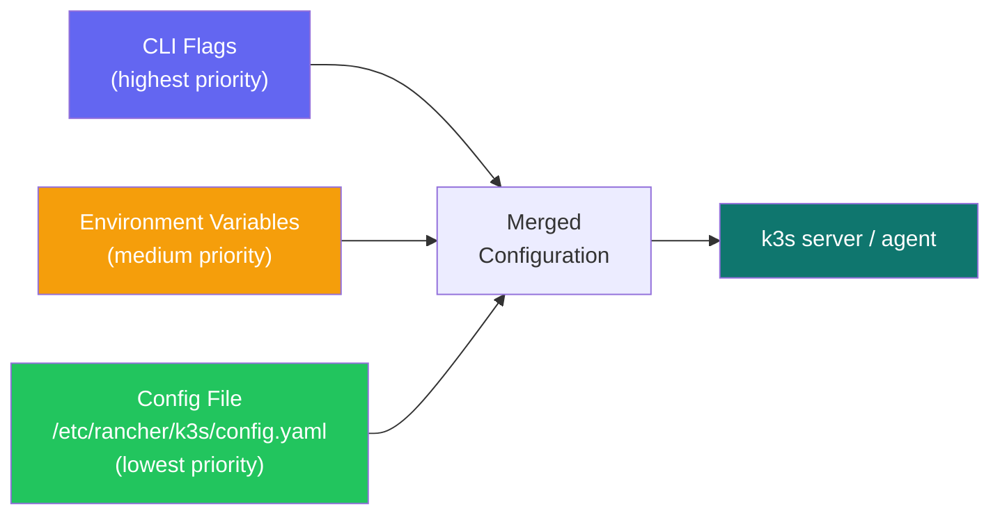
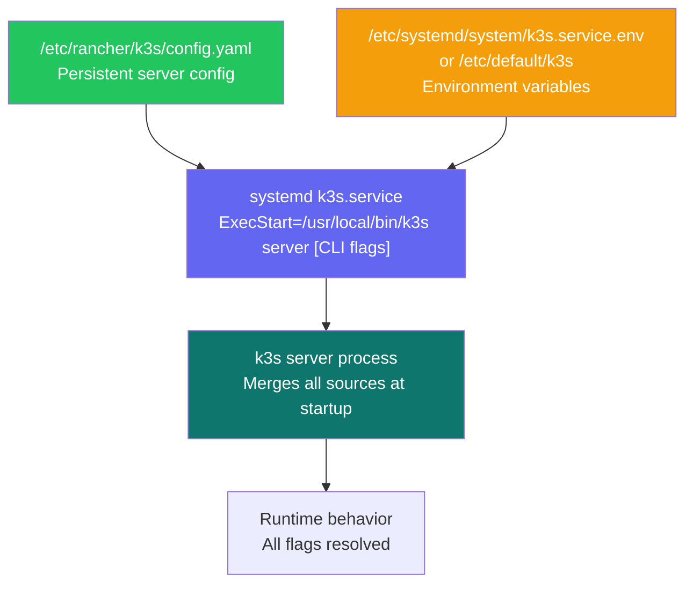
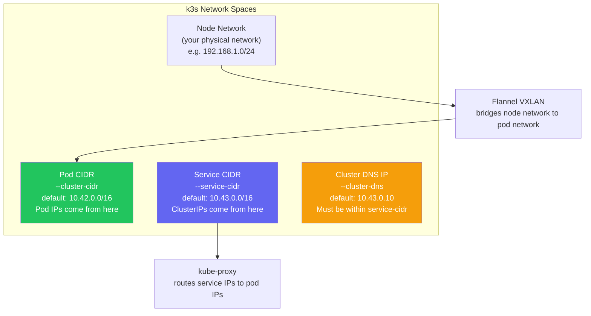

# Installation Options & Flags

> Module 02 · Lesson 02 | [↑ Course Index](../README.md)

[](../README.md)
[](../LICENSE.md)

## Table of Contents

- [Configuration Methods](#configuration-methods)
- [Configuration Precedence](#configuration-precedence)
- [Environment Variables](#environment-variables)
- [The k3s Config File](#the-k3s-config-file)
- [Server Flags Reference](#server-flags-reference)
- [Agent Flags Reference](#agent-flags-reference)
- [Disabling Built-in Components](#disabling-built-in-components)
- [Networking Flags](#networking-flags)
- [TLS and Certificate Flags](#tls-and-certificate-flags)
- [Custom CNI Configuration](#custom-cni-configuration)
- [Registry Configuration](#registry-configuration)
- [Node Labels and Taints at Install](#node-labels-and-taints-at-install)
- [Common Configurations by Use Case](#common-configurations-by-use-case)
- [Common Pitfalls](#common-pitfalls)
- [Further Reading](#further-reading)

---

## Configuration Methods

k3s can be configured in three ways, applied in this order of precedence:

1. **CLI flags** — passed directly to `k3s server` or `k3s agent`
2. **Environment variables** — set before running the install script or as systemd environment variables
3. **Config file** — `/etc/rancher/k3s/config.yaml`

When the same option is specified in multiple places, the highest-priority source wins.



**Best practice:** Use the config file for persistent settings. Use env vars for secrets (like tokens). Use CLI flags only for one-off testing.

[↑ Back to TOC](#table-of-contents) · [↑ Course Index](../README.md)

---

## Configuration Precedence

The relationship between the config file, systemd unit, and the running k3s process is worth understanding in detail.



To inspect the fully resolved configuration of a running k3s instance:

```bash
# See the active systemd service definition (including overrides)
systemctl cat k3s

# See environment variables loaded by the service
systemctl show k3s -p Environment

# Check what flags k3s is actually running with
ps aux | grep 'k3s server'
```

If you suspect a mismatch between your config file and what's running, `systemctl cat k3s` shows you the exact `ExecStart` line and any `EnvironmentFile` directives.

[↑ Back to TOC](#table-of-contents) · [↑ Course Index](../README.md)

---

## Environment Variables

Pass env vars to the installer script to control install behavior:

```bash
# Install with environment variables
curl -sfL https://get.k3s.io | \
  INSTALL_K3S_VERSION="YOUR_K3S_VERSION" \
  INSTALL_K3S_EXEC="server --disable traefik" \
  K3S_TOKEN="mysecrettoken" \
  K3S_KUBECONFIG_MODE="644" \
  sh -
```

| Variable | Description | Example |
|----------|-------------|---------|
| `INSTALL_K3S_VERSION` | Specific k3s version to install | `v1.30.3+k3s1` |
| `INSTALL_K3S_CHANNEL` | Release channel: stable, latest, testing | `stable` |
| `INSTALL_K3S_EXEC` | Extra args for the k3s command | `server --disable traefik` |
| `INSTALL_K3S_SKIP_START` | Install but don't start the service | `true` |
| `INSTALL_K3S_SKIP_DOWNLOAD` | Skip binary download (air-gap) | `true` |
| `INSTALL_K3S_BIN_DIR` | Directory for k3s binary | `/usr/local/bin` |
| `INSTALL_K3S_SYSTEMD_DIR` | Directory for systemd unit | `/etc/systemd/system` |
| `K3S_TOKEN` | Cluster join token | `mysecrettoken` |
| `K3S_KUBECONFIG_MODE` | Kubeconfig file permissions | `644` |
| `K3S_NODE_NAME` | Node hostname override | `server-01` |
| `K3S_URL` | Server URL (agent installs) | `https://192.168.1.10:6443` |
| `K3S_DATASTORE_ENDPOINT` | External DB connection string | `postgres://...` |
| `K3S_RESOLV_CONF` | Custom resolv.conf for CoreDNS | `/run/systemd/resolve/resolv.conf` |
| `K3S_SELINUX` | Enable SELinux support | `true` |

[↑ Back to TOC](#table-of-contents) · [↑ Course Index](../README.md)

---

## The k3s Config File

The config file at `/etc/rancher/k3s/config.yaml` is the recommended approach for all non-trivial deployments. It supports all the same options as CLI flags, using YAML syntax with hyphens converted to camelCase or kept as-is (k3s accepts both).

**Create the directory and file before running the installer:**

```bash
sudo mkdir -p /etc/rancher/k3s
sudo tee /etc/rancher/k3s/config.yaml <<'EOF'
# ============================================================
# k3s Server Configuration
# Full reference: https://docs.k3s.io/installation/configuration
# ============================================================

# ── Cluster Identity ──────────────────────────────────────
# Shared secret for joining agents and additional servers
token: "change-me-to-a-long-random-secret"

# Unique name for this node (default: hostname)
node-name: "server-01"

# ── API Server TLS ────────────────────────────────────────
# Add every IP / hostname that clients will use to reach the API server.
# Without these, remote kubectl will get a TLS certificate error.
tls-san:
  - "192.168.1.10"
  - "k3s.example.com"
  - "10.0.0.1"

# ── Kubeconfig ────────────────────────────────────────────
# File mode for /etc/rancher/k3s/k3s.yaml
# 0600 = root-only (default, more secure)
# 0644 = world-readable (convenient on single-user systems)
write-kubeconfig-mode: "0644"

# ── Disabled Built-in Components ─────────────────────────
# Disable components you want to replace with your own.
# Consequences: see "Disabling Built-in Components" section.
disable:
  - traefik         # replace with nginx-ingress or your own
  # - servicelb     # replace with MetalLB
  # - coredns       # rarely disabled; use upstream CoreDNS instead
  # - metrics-server
  # - local-storage # replace with Longhorn or NFS

# ── Networking ────────────────────────────────────────────
# WARNING: CIDRs cannot be changed after installation without full reset.
# Choose non-overlapping ranges for your environment.
cluster-cidr: "10.42.0.0/16"    # Pod network IP range
service-cidr: "10.43.0.0/16"    # Service ClusterIP range
cluster-dns: "10.43.0.10"       # CoreDNS ClusterIP (must be within service-cidr)
cluster-domain: "cluster.local" # DNS domain for services

# Flannel backend (vxlan, host-gw, wireguard-native, none)
flannel-backend: "vxlan"

# ── Node Configuration ────────────────────────────────────
node-label:
  - "environment=production"
  - "role=server"
  - "topology.kubernetes.io/zone=us-east-1a"

# ── Data & Logging ────────────────────────────────────────
data-dir: "/var/lib/rancher/k3s"

# Optional: write k3s logs to a file in addition to journald
# log: "/var/log/k3s.log"

# ── etcd Snapshots (single-node uses SQLite; HA uses etcd) ──
# etcd-snapshot-schedule-cron: "0 2 * * *"  # 2AM daily
# etcd-snapshot-retention: 7
# etcd-s3: true
# etcd-s3-endpoint: "s3.amazonaws.com"
# etcd-s3-bucket: "my-k3s-backups"
# etcd-s3-region: "us-east-1"
EOF
```

### Config File for Agent Nodes

Agent nodes use a simpler configuration:

```yaml
# /etc/rancher/k3s/config.yaml on agent nodes
server: "https://192.168.1.10:6443"
token: "change-me-to-a-long-random-secret"
node-name: "worker-01"
node-label:
  - "environment=production"
  - "role=worker"
node-taint:
  - "dedicated=gpu:NoSchedule"   # optional: restrict pod scheduling
```

### Config File Discovery

k3s reads the config file from:
1. `K3S_CONFIG_FILE` environment variable (if set)
2. `--config` CLI flag (if specified)
3. `/etc/rancher/k3s/config.yaml` (default)

You can use multiple config files with the `--config` flag (can be specified multiple times). Later files take precedence over earlier ones.

[↑ Back to TOC](#table-of-contents) · [↑ Course Index](../README.md)

---

## Server Flags Reference

```bash
k3s server [OPTIONS]
```

### Cluster management flags

| Flag | Default | Description |
|------|---------|-------------|
| `--token` / `-t` | Random | Shared secret for agent/server join |
| `--token-file` | — | File containing the token |
| `--cluster-init` | false | Initialize a new cluster with embedded etcd |
| `--cluster-reset` | false | Forget all peers and become sole member |
| `--cluster-reset-restore-path` | — | Path to snapshot to restore from |

### Networking flags

| Flag | Default | Description |
|------|---------|-------------|
| `--bind-address` | `0.0.0.0` | IP to bind the API server to |
| `--advertise-address` | Node IP | IP advertised by the API server to cluster members |
| `--advertise-port` | `6443` | Port advertised by the API server |
| `--cluster-cidr` | `10.42.0.0/16` | Network CIDR for pod IPs |
| `--service-cidr` | `10.43.0.0/16` | Network CIDR for service IPs |
| `--cluster-dns` | `10.43.0.10` | Cluster DNS IP |
| `--cluster-domain` | `cluster.local` | Cluster domain name |
| `--flannel-backend` | `vxlan` | `vxlan`, `wireguard-native`, `host-gw`, `none` |
| `--flannel-iface` | — | Interface for Flannel (default: host's primary interface) |

### Component disable flags

| Flag | Description |
|------|-------------|
| `--disable traefik` | Disable built-in Traefik ingress |
| `--disable coredns` | Disable built-in CoreDNS |
| `--disable local-storage` | Disable local-path-provisioner |
| `--disable metrics-server` | Disable metrics-server |
| `--disable-network-policy` | Disable built-in network policy controller |
| `--disable-kube-proxy` | Disable kube-proxy (for Cilium) |
| `--disable-cloud-controller` | Disable built-in cloud controller |

### Data & TLS flags

| Flag | Default | Description |
|------|---------|-------------|
| `--data-dir` | `/var/lib/rancher/k3s` | k3s data directory |
| `--tls-san` | — | Additional SANs for the API TLS cert (IP or hostname) |
| `--write-kubeconfig` | `/etc/rancher/k3s/k3s.yaml` | Kubeconfig output path |
| `--write-kubeconfig-mode` | `0600` | File mode for kubeconfig |

### etcd flags (HA mode)

| Flag | Default | Description |
|------|---------|-------------|
| `--etcd-expose-metrics` | false | Expose etcd metrics endpoint |
| `--etcd-disable-snapshots` | false | Disable automatic etcd snapshots |
| `--etcd-snapshot-schedule-cron` | `0 */12 * * *` | Snapshot schedule (cron format) |
| `--etcd-snapshot-retention` | `5` | Number of snapshots to keep |
| `--etcd-snapshot-dir` | `${data-dir}/db/snapshots` | Snapshot storage directory |
| `--etcd-s3` | false | Enable S3-compatible snapshot storage |
| `--etcd-s3-endpoint` | `s3.amazonaws.com` | S3 endpoint |
| `--etcd-s3-bucket` | — | S3 bucket name |

[↑ Back to TOC](#table-of-contents) · [↑ Course Index](../README.md)

---

## Agent Flags Reference

```bash
k3s agent [OPTIONS]
```

| Flag | Default | Description |
|------|---------|-------------|
| `--server` / `-s` | — | **Required.** URL of the k3s server |
| `--token` / `-t` | — | **Required.** Cluster join token |
| `--token-file` | — | File containing the token |
| `--node-name` | Hostname | Override the node name |
| `--node-label` | — | Labels to add to this node |
| `--node-taint` | — | Taints to add to this node |
| `--node-ip` | — | IP to advertise for this node |
| `--data-dir` | `/var/lib/rancher/k3s` | Agent data directory |
| `--kubelet-arg` | — | Pass extra args to kubelet |
| `--kube-proxy-arg` | — | Pass extra args to kube-proxy |

[↑ Back to TOC](#table-of-contents) · [↑ Course Index](../README.md)

---

## Disabling Built-in Components

k3s lets you disable its built-in components so you can replace them. Disabling a component removes its manifest from `/var/lib/rancher/k3s/server/manifests/` and prevents k3s from managing it.

```bash
# Disable Traefik — install your own ingress (nginx, etc.)
curl -sfL https://get.k3s.io | sh -s - --disable traefik

# Or in config.yaml:
# disable:
#   - traefik

# Disable ServiceLB (Klipper) — use MetalLB instead
curl -sfL https://get.k3s.io | sh -s - --disable servicelb

# Disable local-storage — use Longhorn or NFS
curl -sfL https://get.k3s.io | sh -s - --disable local-storage

# Disable kube-proxy — use Cilium's eBPF replacement
curl -sfL https://get.k3s.io | sh -s - --disable-kube-proxy

# Multiple disables
curl -sfL https://get.k3s.io | sh -s - \
  --disable traefik \
  --disable servicelb \
  --disable local-storage
```

> **Tip:** If you disabled a component after install, delete the leftover manifest from `/var/lib/rancher/k3s/server/manifests/` to remove it:
> ```bash
> sudo rm /var/lib/rancher/k3s/server/manifests/traefik.yaml
> ```

### Consequences of Disabling Each Component

| Component | When to Disable | What You Must Replace It With |
|-----------|----------------|-------------------------------|
| `traefik` | You prefer nginx-ingress, Istio, or another ingress | Install and configure your ingress controller separately |
| `servicelb` | You're installing MetalLB or have a cloud LB | MetalLB in L2 or BGP mode; cloud provider LB |
| `local-storage` | You want replicated or network storage | Longhorn, NFS subdir provisioner, Rook-Ceph |
| `metrics-server` | You're using a different metrics provider | Install standalone metrics-server or Prometheus adapter |
| `coredns` | Rarely needed; custom DNS requirements | Install your own CoreDNS or bind9 deployment |

**Important:** Disabling a component only stops k3s from managing it. If you disable `traefik` after it's already installed, delete its resources manually:

```bash
# Remove existing Traefik installation
kubectl delete -n kube-system deployment traefik
kubectl delete -n kube-system service traefik
kubectl delete -n kube-system service traefik-web
# Or delete the HelmChart resource:
kubectl delete helmchart traefik -n kube-system
kubectl delete helmchart traefik-crd -n kube-system
```

[↑ Back to TOC](#table-of-contents) · [↑ Course Index](../README.md)

---

## Networking Flags

Networking flags control the IP address ranges used by the cluster, the DNS configuration, and the overlay network behavior. These are some of the most critical flags because **they cannot be changed after installation** without a full cluster reset.



### CIDR Overlap Pitfall

The single most common networking misconfiguration is choosing CIDRs that overlap with your node network or with each other. k3s will start even if CIDRs overlap, but routing will be broken in unpredictable ways.

**Rules:**
- `cluster-cidr` (Pod CIDR) must not overlap with `service-cidr`
- Neither CIDR must overlap with your node network
- `cluster-dns` must be a single IP within `service-cidr`
- If you run multiple k3s clusters, use different CIDRs for each

```bash
# Example: corporate network is 10.0.0.0/8
# WRONG — pod CIDR overlaps with corporate network
cluster-cidr: "10.42.0.0/16"   # CONFLICT if your nodes are in 10.x.x.x

# CORRECT — use non-overlapping ranges
cluster-cidr: "172.16.0.0/16"
service-cidr: "172.17.0.0/16"
cluster-dns: "172.17.0.10"
```

### Flannel Backend Selection

| Backend | Overhead | Requirements | Use when |
|---------|----------|-------------|---------|
| `vxlan` | Moderate (UDP encap) | None | Default; works everywhere |
| `host-gw` | Minimal (no encap) | All nodes on same L2 | Performance-sensitive, flat network |
| `wireguard-native` | Low + encryption | WireGuard kernel module | Untrusted network segments |
| `none` | None | Manual CNI install | Installing Calico, Cilium, etc. |

```bash
# Edge/IoT: host-gw for lowest overhead (flat network)
flannel-backend: "host-gw"

# Encrypted overlay for branch-office or VPN-less setups
flannel-backend: "wireguard-native"

# Replace with Cilium (eBPF)
flannel-backend: "none"
# Then install Cilium separately
```

[↑ Back to TOC](#table-of-contents) · [↑ Course Index](../README.md)

---

## TLS and Certificate Flags

k3s automatically generates TLS certificates for all cluster components. Understanding the TLS flags lets you customize certificate behavior for production environments.

### tls-san — Subject Alternative Names

The API server certificate is signed for `localhost`, `127.0.0.1`, and the node's primary IP by default. Any client that accesses the API using a different address will receive a TLS certificate validation error.

```bash
# Add SANs at install time
curl -sfL https://get.k3s.io | sh -s - \
  --tls-san 192.168.1.10 \
  --tls-san k3s.example.com \
  --tls-san 10.0.0.1

# Or in config.yaml:
tls-san:
  - "192.168.1.10"
  - "k3s.example.com"
  - "10.0.0.1"
  - "my-load-balancer.internal"   # for HA setups with a VIP
```

### Adding SANs to an Existing Cluster

If you forget to add a SAN and need to add it later:

```bash
# 1. Add the new SAN to config.yaml
sudo tee -a /etc/rancher/k3s/config.yaml <<'EOF'
tls-san:
  - "new-ip-or-hostname.example.com"
EOF

# 2. Rotate certificates
sudo k3s certificate rotate

# 3. Restart k3s
sudo systemctl restart k3s

# 4. Copy the new kubeconfig
sudo cp /etc/rancher/k3s/k3s.yaml ~/.kube/config
sudo chown $(id -u):$(id -g) ~/.kube/config
```

### cluster-domain

The cluster domain affects the DNS suffix for services. Default is `cluster.local`. Only change this if you have a specific reason (e.g., multi-cluster service mesh requiring distinct domains).

```yaml
# All services resolve as: <svc>.<ns>.svc.custom.domain
cluster-domain: "custom.domain"
```

### Custom CA Certificates

For enterprise environments that require all TLS to be issued by a corporate CA, k3s supports custom CA certificates. Place your CA certificate and key in the k3s data directory before first startup:

```bash
# Create custom CA (or use your existing corporate CA)
sudo mkdir -p /var/lib/rancher/k3s/server/tls

# Place your CA cert and key here before first k3s start:
# /var/lib/rancher/k3s/server/tls/server-ca.crt
# /var/lib/rancher/k3s/server/tls/server-ca.key
# /var/lib/rancher/k3s/server/tls/client-ca.crt
# /var/lib/rancher/k3s/server/tls/client-ca.key

# k3s will use these instead of generating self-signed CAs
```

### Certificate Rotation

k3s certificates expire after 1 year by default. They are automatically rotated when they have less than 90 days remaining. To manually rotate:

```bash
# Force certificate rotation
sudo k3s certificate rotate

# Check certificate expiry
sudo k3s certificate check
```

[↑ Back to TOC](#table-of-contents) · [↑ Course Index](../README.md)

---

## Custom CNI Configuration

To replace Flannel with Calico or Cilium:

```bash
# Step 1: Install k3s with Flannel disabled
curl -sfL https://get.k3s.io | sh -s - \
  --flannel-backend=none \
  --disable-network-policy

# Step 2: Install Calico
kubectl apply -f https://raw.githubusercontent.com/projectcalico/calico/v3.27.0/manifests/calico.yaml

# OR install Cilium
helm repo add cilium https://helm.cilium.io/
helm install cilium cilium/cilium \
  --namespace kube-system \
  --set operator.replicas=1
```

[↑ Back to TOC](#table-of-contents) · [↑ Course Index](../README.md)

---

## Registry Configuration

Configure private registries or mirrors in `/etc/rancher/k3s/registries.yaml`:

```yaml
# /etc/rancher/k3s/registries.yaml

mirrors:
  # Mirror Docker Hub through a local registry cache
  "docker.io":
    endpoint:
      - "https://my-registry-cache.example.com"

  # Use a private registry for your own images
  "registry.example.com":
    endpoint:
      - "https://registry.example.com"

configs:
  # Auth for private registry
  "registry.example.com":
    auth:
      username: myuser
      password: mypassword
    tls:
      # Skip TLS verification (not recommended for production)
      insecure_skip_verify: false
      # Or provide a custom CA cert
      ca_file: "/etc/ssl/certs/my-registry-ca.crt"
```

Restart k3s after modifying this file:

```bash
sudo systemctl restart k3s
```

[↑ Back to TOC](#table-of-contents) · [↑ Course Index](../README.md)

---

## Node Labels and Taints at Install

```bash
# Add labels at install (agent)
curl -sfL https://get.k3s.io | \
  K3S_URL="https://192.168.1.10:6443" \
  K3S_TOKEN="mysecret" \
  sh -s - \
  --node-label "environment=production" \
  --node-label "zone=us-east-1a" \
  --node-taint "dedicated=gpu:NoSchedule"
```

[↑ Back to TOC](#table-of-contents) · [↑ Course Index](../README.md)

---

## Common Configurations by Use Case

### Minimal dev cluster (no ingress, no storage)

```yaml
# /etc/rancher/k3s/config.yaml
disable:
  - traefik
  - local-storage
  - metrics-server
write-kubeconfig-mode: "0644"
```

### Production single-node

```yaml
token: "change-me-long-random-string"
tls-san:
  - "your.domain.com"
  - "192.168.1.10"
write-kubeconfig-mode: "0600"
etcd-snapshot-schedule-cron: "0 2 * * *"
etcd-snapshot-retention: 7
node-label:
  - "environment=production"
```

### Edge/IoT minimal footprint

```yaml
disable:
  - traefik
  - metrics-server
  - coredns       # use host DNS
flannel-backend: "host-gw"  # no VXLAN overhead
kubelet-arg:
  - "max-pods=20"
```

### CI/CD cluster (fast startup)

```bash
curl -sfL https://get.k3s.io | sh -s - \
  --disable traefik \
  --disable metrics-server \
  --write-kubeconfig-mode 644
```

### HA cluster (3 servers)

```yaml
# Server 1 (--cluster-init)
token: "shared-secret-all-nodes-must-match"
cluster-init: true
tls-san:
  - "192.168.1.10"   # VIP or load balancer IP
  - "192.168.1.11"
  - "192.168.1.12"
etcd-snapshot-schedule-cron: "0 2 * * *"

# Server 2 and 3 (join existing)
token: "shared-secret-all-nodes-must-match"
server: "https://192.168.1.10:6443"
```

[↑ Back to TOC](#table-of-contents) · [↑ Course Index](../README.md)

---

## Common Pitfalls

| Pitfall | Detail |
|---------|--------|
| Forgetting `--cluster-init` for HA | Without it, the first server uses SQLite and cannot join an etcd cluster later |
| Token mismatch | All servers/agents in a cluster must use the same token |
| Changing CIDR after install | Pod and service CIDRs cannot be changed after install without a full reset |
| TLS SAN too late | If you access the API from a remote host without adding its IP as SAN, you get TLS errors |
| Config file vs CLI flags conflict | CLI flags override config file — if you're confused about which is active, check `systemctl cat k3s` |
| CIDR overlap with node network | Pod/service CIDRs must not overlap with the host network range |
| Forgetting to restart after config change | k3s reads the config file only at startup — always `systemctl restart k3s` after changes |
| Disabling coredns without a replacement | DNS resolution in pods will fail; all service discovery breaks |

[↑ Back to TOC](#table-of-contents) · [↑ Course Index](../README.md)

---

## Further Reading

- [k3s Configuration Reference](https://docs.k3s.io/installation/configuration)
- [k3s Server CLI](https://docs.k3s.io/cli/server)
- [k3s Agent CLI](https://docs.k3s.io/cli/agent)
- [k3s Registry Configuration](https://docs.k3s.io/installation/private-registry)
- [k3s TLS Certificate Management](https://docs.k3s.io/cli/certificate)
- [Flannel Backends](https://github.com/flannel-io/flannel/blob/master/Documentation/backends.md)

[↑ Back to TOC](#table-of-contents) · [↑ Course Index](../README.md)

---

*Licensed under [CC BY-NC-SA 4.0](../LICENSE.md) · © 2026 UncleJS*
