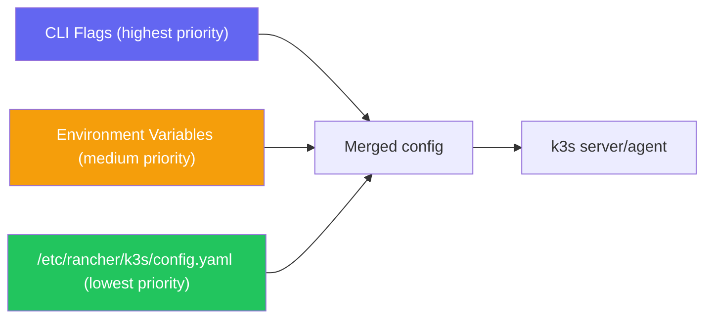

# Installation Options & Flags

> Module 02 · Lesson 02 | [↑ Course Index](../README.md)

## Table of Contents

- [Configuration Methods](#configuration-methods)
- [Environment Variables](#environment-variables)
- [Config File](#config-file)
- [Server Flags Reference](#server-flags-reference)
- [Agent Flags Reference](#agent-flags-reference)
- [Disabling Built-in Components](#disabling-built-in-components)
- [Custom CNI Configuration](#custom-cni-configuration)
- [Registry Configuration](#registry-configuration)
- [TLS SAN Configuration](#tls-san-configuration)
- [Node Labels and Taints at Install](#node-labels-and-taints-at-install)
- [Common Configurations by Use Case](#common-configurations-by-use-case)
- [Common Pitfalls](#common-pitfalls)
- [Further Reading](#further-reading)

---

## Configuration Methods

k3s can be configured in three ways, applied in this order of precedence:



**Best practice:** Use the config file for persistent settings. Use env vars for secrets (like tokens). Use CLI flags only for one-off testing.

[↑ Back to TOC](#table-of-contents) · [↑ Course Index](../README.md)

---

## Environment Variables

Pass env vars to the installer script to control install behavior:

```bash
# Install with environment variables
curl -sfL https://get.k3s.io | \
  INSTALL_K3S_VERSION="v1.29.3+k3s1" \
  INSTALL_K3S_EXEC="server --disable traefik" \
  K3S_TOKEN="mysecrettoken" \
  K3S_KUBECONFIG_MODE="644" \
  sh -
```

| Variable | Description | Example |
|----------|-------------|---------|
| `INSTALL_K3S_VERSION` | Specific k3s version to install | `v1.29.3+k3s1` |
| `INSTALL_K3S_CHANNEL` | Release channel: stable, latest, testing | `stable` |
| `INSTALL_K3S_EXEC` | Extra args for the k3s command | `server --disable traefik` |
| `INSTALL_K3S_SKIP_START` | Install but don't start the service | `true` |
| `INSTALL_K3S_SKIP_DOWNLOAD` | Skip binary download (air-gap) | `true` |
| `INSTALL_K3S_BIN_DIR` | Directory for k3s binary | `/usr/local/bin` |
| `INSTALL_K3S_SYSTEMD_DIR` | Directory for systemd unit | `/etc/systemd/system` |
| `K3S_TOKEN` | Cluster join token | `mysecrettoken` |
| `K3S_KUBECONFIG_MODE` | Kubeconfig file permissions | `644` |
| `K3S_NODE_NAME` | Node hostname override | `server-01` |
| `K3S_URL` | Server URL (agent installs) | `https://192.168.1.10:6443` |
| `K3S_DATASTORE_ENDPOINT` | External DB connection string | `postgres://...` |
| `K3S_RESOLV_CONF` | Custom resolv.conf for CoreDNS | `/run/systemd/resolve/resolv.conf` |
| `K3S_SELINUX` | Enable SELinux support | `true` |

[↑ Back to TOC](#table-of-contents) · [↑ Course Index](../README.md)

---

## Config File

The recommended approach for production installs. Create before running the installer:

```bash
sudo mkdir -p /etc/rancher/k3s
sudo tee /etc/rancher/k3s/config.yaml <<'EOF'
# k3s server configuration
# Full reference: https://docs.k3s.io/installation/configuration

# Cluster token (keep secret!)
token: "change-me-to-a-random-secret"

# Disable components you don't need
disable:
  - traefik        # use your own ingress
  # - coredns      # rarely disabled
  # - metrics-server
  # - local-storage

# TLS Subject Alternative Names — add your server IP/hostname
tls-san:
  - 192.168.1.10
  - k3s.example.com

# Kubeconfig permissions
write-kubeconfig-mode: "0644"

# Node configuration
node-name: "server-01"
node-label:
  - "role=server"
  - "environment=production"

# Networking
cluster-cidr: "10.42.0.0/16"   # Pod network CIDR
service-cidr: "10.43.0.0/16"   # Service network CIDR
cluster-dns: "10.43.0.10"       # CoreDNS ClusterIP

# Logging
log: "/var/log/k3s.log"

# Data directory
data-dir: "/var/lib/rancher/k3s"
EOF
```

[↑ Back to TOC](#table-of-contents) · [↑ Course Index](../README.md)

---

## Server Flags Reference

```bash
k3s server [OPTIONS]
```

### Cluster management flags

| Flag | Default | Description |
|------|---------|-------------|
| `--token` / `-t` | Random | Shared secret for agent/server join |
| `--token-file` | — | File containing the token |
| `--cluster-init` | false | Initialize a new cluster with embedded etcd |
| `--cluster-reset` | false | Forget all peers and become sole member |
| `--cluster-reset-restore-path` | — | Path to snapshot to restore from |

### Networking flags

| Flag | Default | Description |
|------|---------|-------------|
| `--bind-address` | `0.0.0.0` | IP to bind the API server to |
| `--advertise-address` | Node IP | IP advertised by the API server to cluster members |
| `--advertise-port` | `6443` | Port advertised by the API server |
| `--cluster-cidr` | `10.42.0.0/16` | Network CIDR for pod IPs |
| `--service-cidr` | `10.43.0.0/16` | Network CIDR for service IPs |
| `--cluster-dns` | `10.43.0.10` | Cluster DNS IP |
| `--cluster-domain` | `cluster.local` | Cluster domain name |
| `--flannel-backend` | `vxlan` | `vxlan`, `wireguard-native`, `host-gw`, `none` |
| `--flannel-iface` | — | Interface for Flannel (default: host's primary interface) |

### Component disable flags

| Flag | Description |
|------|-------------|
| `--disable traefik` | Disable built-in Traefik ingress |
| `--disable coredns` | Disable built-in CoreDNS |
| `--disable local-storage` | Disable local-path-provisioner |
| `--disable metrics-server` | Disable metrics-server |
| `--disable-network-policy` | Disable built-in network policy controller |
| `--disable-kube-proxy` | Disable kube-proxy (for Cilium) |
| `--disable-cloud-controller` | Disable built-in cloud controller |

### Data & TLS flags

| Flag | Default | Description |
|------|---------|-------------|
| `--data-dir` | `/var/lib/rancher/k3s` | k3s data directory |
| `--tls-san` | — | Additional SANs for the API TLS cert (IP or hostname) |
| `--write-kubeconfig` | `/etc/rancher/k3s/k3s.yaml` | Kubeconfig output path |
| `--write-kubeconfig-mode` | `0600` | File mode for kubeconfig |

### etcd flags (HA mode)

| Flag | Default | Description |
|------|---------|-------------|
| `--etcd-expose-metrics` | false | Expose etcd metrics endpoint |
| `--etcd-disable-snapshots` | false | Disable automatic etcd snapshots |
| `--etcd-snapshot-schedule-cron` | `0 */12 * * *` | Snapshot schedule (cron format) |
| `--etcd-snapshot-retention` | `5` | Number of snapshots to keep |
| `--etcd-snapshot-dir` | `${data-dir}/db/snapshots` | Snapshot storage directory |
| `--etcd-s3` | false | Enable S3-compatible snapshot storage |
| `--etcd-s3-endpoint` | `s3.amazonaws.com` | S3 endpoint |
| `--etcd-s3-bucket` | — | S3 bucket name |

[↑ Back to TOC](#table-of-contents) · [↑ Course Index](../README.md)

---

## Agent Flags Reference

```bash
k3s agent [OPTIONS]
```

| Flag | Default | Description |
|------|---------|-------------|
| `--server` / `-s` | — | **Required.** URL of the k3s server |
| `--token` / `-t` | — | **Required.** Cluster join token |
| `--token-file` | — | File containing the token |
| `--node-name` | Hostname | Override the node name |
| `--node-label` | — | Labels to add to this node |
| `--node-taint` | — | Taints to add to this node |
| `--node-ip` | — | IP to advertise for this node |
| `--data-dir` | `/var/lib/rancher/k3s` | Agent data directory |
| `--kubelet-arg` | — | Pass extra args to kubelet |
| `--kube-proxy-arg` | — | Pass extra args to kube-proxy |

[↑ Back to TOC](#table-of-contents) · [↑ Course Index](../README.md)

---

## Disabling Built-in Components

k3s lets you disable its built-in components so you can replace them:

```bash
# Disable Traefik — install your own ingress (nginx, etc.)
curl -sfL https://get.k3s.io | sh -s - --disable traefik

# Or in config.yaml:
# disable:
#   - traefik

# Disable ServiceLB (Klipper) — use MetalLB instead
curl -sfL https://get.k3s.io | sh -s - --disable servicelb

# Disable local-storage — use Longhorn or NFS
curl -sfL https://get.k3s.io | sh -s - --disable local-storage

# Disable kube-proxy — use Cilium's eBPF replacement
curl -sfL https://get.k3s.io | sh -s - --disable-kube-proxy

# Multiple disables
curl -sfL https://get.k3s.io | sh -s - \
  --disable traefik \
  --disable servicelb \
  --disable local-storage
```

> **Tip:** If you disabled a component after install, delete the leftover manifest from `/var/lib/rancher/k3s/server/manifests/` to remove it:
> ```bash
> sudo rm /var/lib/rancher/k3s/server/manifests/traefik.yaml
> ```

[↑ Back to TOC](#table-of-contents) · [↑ Course Index](../README.md)

---

## Custom CNI Configuration

To replace Flannel with Calico or Cilium:

```bash
# Step 1: Install k3s with Flannel disabled
curl -sfL https://get.k3s.io | sh -s - \
  --flannel-backend=none \
  --disable-network-policy

# Step 2: Install Calico
kubectl apply -f https://raw.githubusercontent.com/projectcalico/calico/v3.27.0/manifests/calico.yaml

# OR install Cilium
helm repo add cilium https://helm.cilium.io/
helm install cilium cilium/cilium \
  --namespace kube-system \
  --set operator.replicas=1
```

[↑ Back to TOC](#table-of-contents) · [↑ Course Index](../README.md)

---

## Registry Configuration

Configure private registries or mirrors in `/etc/rancher/k3s/registries.yaml`:

```yaml
# /etc/rancher/k3s/registries.yaml

mirrors:
  # Mirror Docker Hub through a local registry cache
  "docker.io":
    endpoint:
      - "https://my-registry-cache.example.com"

  # Use a private registry for your own images
  "registry.example.com":
    endpoint:
      - "https://registry.example.com"

configs:
  # Auth for private registry
  "registry.example.com":
    auth:
      username: myuser
      password: mypassword
    tls:
      # Skip TLS verification (not recommended for production)
      insecure_skip_verify: false
      # Or provide a custom CA cert
      ca_file: "/etc/ssl/certs/my-registry-ca.crt"
```

Restart k3s after modifying this file:

```bash
sudo systemctl restart k3s
```

[↑ Back to TOC](#table-of-contents) · [↑ Course Index](../README.md)

---

## TLS SAN Configuration

The k3s API server TLS certificate only includes `localhost` and the node's IP by default. If you access the API from another host, add SANs:

```bash
# Add SANs at install time
curl -sfL https://get.k3s.io | sh -s - \
  --tls-san 192.168.1.10 \
  --tls-san k3s.example.com \
  --tls-san 10.0.0.1

# Or in config.yaml:
# tls-san:
#   - 192.168.1.10
#   - k3s.example.com
```

After adding new SANs to an existing cluster, rotate the certificates:

```bash
sudo k3s certificate rotate
sudo systemctl restart k3s
```

[↑ Back to TOC](#table-of-contents) · [↑ Course Index](../README.md)

---

## Node Labels and Taints at Install

```bash
# Add labels at install (agent)
curl -sfL https://get.k3s.io | \
  K3S_URL="https://192.168.1.10:6443" \
  K3S_TOKEN="mysecret" \
  sh -s - \
  --node-label "environment=production" \
  --node-label "zone=us-east-1a" \
  --node-taint "dedicated=gpu:NoSchedule"
```

[↑ Back to TOC](#table-of-contents) · [↑ Course Index](../README.md)

---

## Common Configurations by Use Case

### Minimal dev cluster (no ingress, no storage)

```yaml
# /etc/rancher/k3s/config.yaml
disable:
  - traefik
  - local-storage
  - metrics-server
write-kubeconfig-mode: "0644"
```

### Production single-node

```yaml
token: "change-me-long-random-string"
tls-san:
  - "your.domain.com"
  - "192.168.1.10"
write-kubeconfig-mode: "0600"
etcd-snapshot-schedule-cron: "0 2 * * *"
etcd-snapshot-retention: 7
```

### Edge/IoT minimal footprint

```yaml
disable:
  - traefik
  - metrics-server
  - coredns     # use host DNS
flannel-backend: "host-gw"  # no VXLAN overhead
kubelet-arg:
  - "max-pods=20"
```

### CI/CD cluster (fast startup)

```bash
curl -sfL https://get.k3s.io | sh -s - \
  --disable traefik \
  --disable metrics-server \
  --write-kubeconfig-mode 644
```

[↑ Back to TOC](#table-of-contents) · [↑ Course Index](../README.md)

---

## Common Pitfalls

| Pitfall | Detail |
|---------|--------|
| Forgetting `--cluster-init` for HA | Without it, the first server uses SQLite and cannot join an etcd cluster later |
| Token mismatch | All servers/agents in a cluster must use the same token |
| Changing CIDR after install | Pod and service CIDRs cannot be changed after install without a full reset |
| TLS SAN too late | If you access the API from a remote host without adding its IP as SAN, you get TLS errors |
| Config file vs CLI flags conflict | CLI flags override config file — if you're confused about which is active, check `systemctl cat k3s` |

[↑ Back to TOC](#table-of-contents) · [↑ Course Index](../README.md)

---

## Further Reading

- [k3s Configuration Reference](https://docs.k3s.io/installation/configuration)
- [k3s Server CLI](https://docs.k3s.io/cli/server)
- [k3s Agent CLI](https://docs.k3s.io/cli/agent)
- [k3s Registry Configuration](https://docs.k3s.io/installation/private-registry)

[↑ Back to TOC](#table-of-contents) · [↑ Course Index](../README.md)

---

*Licensed under [CC BY-NC-SA 4.0](../LICENSE.md) · © 2026 UncleJS*
