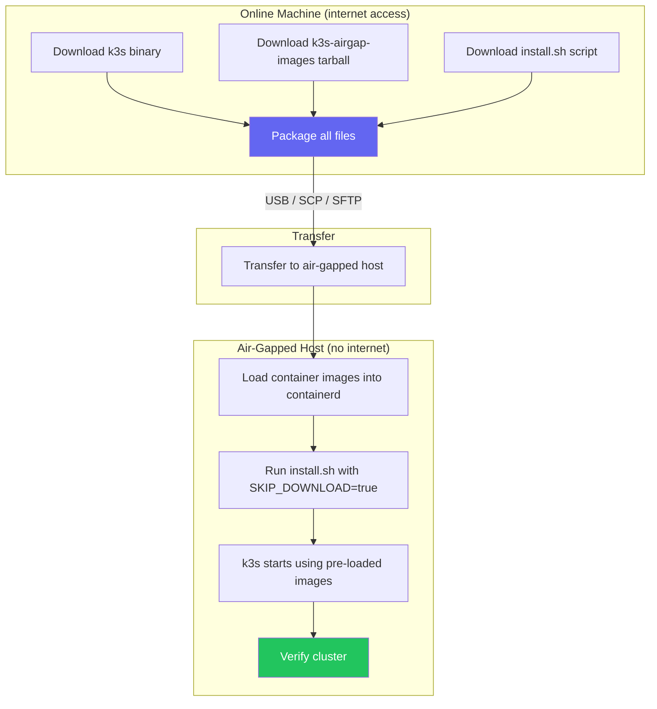
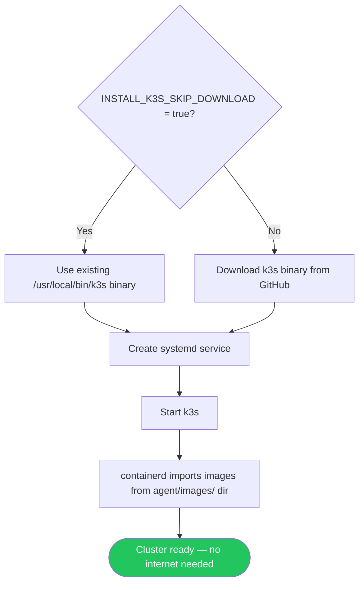
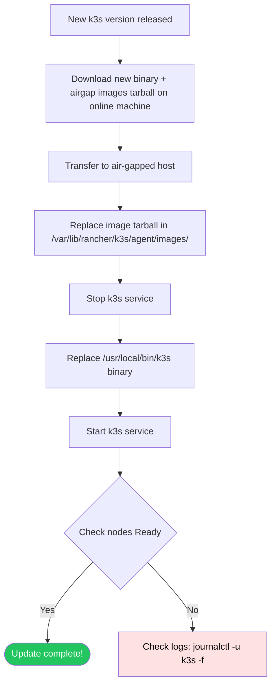

# Air-Gap Install

> Module 02 · Lesson 03 | [↑ Course Index](../README.md)


[](../README.md)
[](../LICENSE.md)

## Table of Contents

- [What is an Air-Gap Install?](#what-is-an-air-gap-install)
- [Air-Gap Install Workflow](#air-gap-install-workflow)
- [Step 1: Download Artifacts (Online Machine)](#step-1-download-artifacts-online-machine)
- [Step 2: Transfer Artifacts to Air-Gapped Host](#step-2-transfer-artifacts-to-air-gapped-host)
- [Step 3: Load Container Images](#step-3-load-container-images)
- [Step 4: Run the Installer](#step-4-run-the-installer)
- [Step 5: Verify Installation](#step-5-verify-installation)
- [Private Registry Setup](#private-registry-setup)
- [Updating an Air-Gapped Cluster](#updating-an-air-gapped-cluster)
- [Common Pitfalls](#common-pitfalls)
- [Further Reading](#further-reading)

---

## What is an Air-Gap Install?

An **air-gapped** environment has no internet access. This includes:

- Secure government or military networks
- Industrial control systems
- Healthcare systems with strict data isolation
- Offshore or remote infrastructure
- High-security corporate environments

k3s supports air-gap installs by allowing you to pre-download all artifacts and load them before running the installer.

> **Sizing note:** If you are following this lesson as a single-node setup, this host is a **server node**. Plan for server minimums (2 CPU / 2 GB RAM). The 512 MB minimum is for agent-only nodes.

[↑ Back to TOC](#table-of-contents) · [↑ Course Index](../README.md)

---

## Air-Gap Install Workflow



[↑ Back to TOC](#table-of-contents) · [↑ Course Index](../README.md)

---

## Step 1: Download Artifacts (Online Machine)

```bash
#!/usr/bin/env bash
# download-airgap.sh — run on a machine WITH internet access

K3S_VERSION="YOUR_K3S_VERSION"   # Example: v1.35.1+k3s1
ARCH="amd64"   # or arm64 for ARM servers, arm for ARMv7

OUTPUT_DIR="./k3s-airgap-${K3S_VERSION}"
mkdir -p "$OUTPUT_DIR"

echo "=== Downloading k3s binary ==="
curl -Lo "${OUTPUT_DIR}/k3s" \
  "https://github.com/k3s-io/k3s/releases/download/${K3S_VERSION}/k3s"

echo "=== Downloading air-gap images ==="
# These are all the container images k3s needs pre-loaded
curl -Lo "${OUTPUT_DIR}/k3s-airgap-images-${ARCH}.tar.zst" \
  "https://github.com/k3s-io/k3s/releases/download/${K3S_VERSION}/k3s-airgap-images-${ARCH}.tar.zst"

echo "=== Downloading install script ==="
curl -Lo "${OUTPUT_DIR}/install.sh" \
  "https://get.k3s.io"
chmod +x "${OUTPUT_DIR}/install.sh"

echo "=== Creating checksums ==="
sha256sum "${OUTPUT_DIR}"/* > "${OUTPUT_DIR}/SHA256SUMS"

echo "=== Package contents ==="
ls -lh "${OUTPUT_DIR}/"
echo "Done! Transfer the '${OUTPUT_DIR}' directory to your air-gapped host."
```

### What you're downloading

| File | Size (~) | Purpose |
|------|----------|---------|
| `k3s` | ~70 MB | The k3s binary |
| `k3s-airgap-images-amd64.tar.zst` | ~200 MB | All required container images |
| `install.sh` | ~30 KB | Official installer script |

### Architecture variants

| Arch flag | Target hardware |
|-----------|----------------|
| `amd64` | Standard x86_64 servers, VMs |
| `arm64` | ARM servers, Raspberry Pi 4 (64-bit), AWS Graviton |
| `arm` | ARMv7, Raspberry Pi 3, 32-bit ARM |
| `s390x` | IBM Z mainframes |

[↑ Back to TOC](#table-of-contents) · [↑ Course Index](../README.md)

---

## Step 2: Transfer Artifacts to Air-Gapped Host

```bash
# Via SCP (if the host is reachable by SSH from a jump host)
scp -r k3s-airgap-YOUR_K3S_VERSION/ user@airgap-host:/tmp/

# Via USB drive (physical transfer)
# Copy files to USB, then on the air-gapped host:
cp /media/usb/k3s-airgap-* /tmp/

# Verify checksums on the air-gapped host
cd /tmp/k3s-airgap-YOUR_K3S_VERSION/
sha256sum -c SHA256SUMS
```

[↑ Back to TOC](#table-of-contents) · [↑ Course Index](../README.md)

---

## Step 3: Load Container Images

k3s's containerd reads images from a special directory at startup. Place the image tarball there:

```bash
# Create the images directory
sudo mkdir -p /var/lib/rancher/k3s/agent/images/

# Copy the images tarball
sudo cp /tmp/k3s-airgap-YOUR_K3S_VERSION/k3s-airgap-images-amd64.tar.zst \
  /var/lib/rancher/k3s/agent/images/

# Set correct permissions
sudo chmod 755 /var/lib/rancher/k3s/agent/images/
```

> **How it works:** When k3s's containerd starts, it automatically imports all `.tar`, `.tar.gz`, `.tar.zst`, and `.tar.lz4` files from `/var/lib/rancher/k3s/agent/images/`. This populates the local image cache before any pods are scheduled.

[↑ Back to TOC](#table-of-contents) · [↑ Course Index](../README.md)

---

## Step 4: Run the Installer

```bash
cd /tmp/k3s-airgap-YOUR_K3S_VERSION/

# Make binary executable and place it
chmod +x k3s
sudo cp k3s /usr/local/bin/k3s

# Run the installer with SKIP_DOWNLOAD — uses the binary we placed manually
sudo INSTALL_K3S_SKIP_DOWNLOAD=true \
     INSTALL_K3S_VERSION="YOUR_K3S_VERSION" \
     ./install.sh

# Or with custom options
sudo INSTALL_K3S_SKIP_DOWNLOAD=true \
     INSTALL_K3S_VERSION="YOUR_K3S_VERSION" \
     ./install.sh server \
     --write-kubeconfig-mode 644 \
     --tls-san 192.168.1.10
```

### What `INSTALL_K3S_SKIP_DOWNLOAD=true` does



[↑ Back to TOC](#table-of-contents) · [↑ Course Index](../README.md)

---

## Step 5: Verify Installation

Use `sudo` only for system-level operations. Run `kubectl` as your regular user after configuring kubeconfig (see Lesson 01, Configure kubectl Access).

```bash
# Check service started
systemctl status k3s

# Wait for node to be Ready (images load takes 30-60s)
kubectl get nodes -w

# Verify all system pods are Running
kubectl get pods -n kube-system

# Confirm no external image pulls happened (all from local cache)
sudo k3s crictl images | grep -v "k8s.gcr.io\|registry.k8s.io"
# All images should be present — if a pod shows ImagePullBackOff,
# the image wasn't in the airgap tarball
```

[↑ Back to TOC](#table-of-contents) · [↑ Course Index](../README.md)

---

## Private Registry Setup

For custom application images in an air-gapped environment, set up a private registry:

### Option A: Load images directly into containerd

```bash
# Export an image from Docker on an online machine
docker pull nginx:alpine
docker save nginx:alpine | gzip > nginx-alpine.tar.gz

# Transfer to air-gapped host, then import
sudo k3s ctr images import nginx-alpine.tar.gz

# Verify
sudo k3s crictl images | grep nginx
```

### Option B: Run a local registry mirror (Harbor, Gitea, Nexus)

```yaml
# /etc/rancher/k3s/registries.yaml
mirrors:
  "docker.io":
    endpoint:
      - "https://my-internal-registry.corp.local"
  "registry.k8s.io":
    endpoint:
      - "https://my-internal-registry.corp.local"

configs:
  "my-internal-registry.corp.local":
    tls:
      ca_file: "/etc/ssl/certs/corp-ca.crt"
    auth:
      username: "k3s-puller"
      password: "supersecret"
```

```bash
sudo systemctl restart k3s
```

[↑ Back to TOC](#table-of-contents) · [↑ Course Index](../README.md)

---

## Updating an Air-Gapped Cluster



```bash
# On air-gapped host — update k3s binary and images

NEW_VERSION="YOUR_NEW_VERSION"

# 1. Place new images tarball (remove old one first)
sudo rm /var/lib/rancher/k3s/agent/images/k3s-airgap-images-amd64.tar.zst
sudo cp /tmp/new-k3s-airgap-images-amd64.tar.zst \
  /var/lib/rancher/k3s/agent/images/

# 2. Stop the service
sudo systemctl stop k3s

# 3. Replace binary
sudo cp /tmp/k3s-${NEW_VERSION} /usr/local/bin/k3s
sudo chmod +x /usr/local/bin/k3s

# 4. Start the service
sudo systemctl start k3s

# 5. Verify
kubectl get nodes
k3s --version
```

[↑ Back to TOC](#table-of-contents) · [↑ Course Index](../README.md)

---

## Common Pitfalls

| Pitfall | Symptom | Fix |
|---------|---------|-----|
| Wrong architecture tarball | Pods stuck `ImagePullBackOff` or containerd fails to start | Download the correct arch: `amd64`, `arm64`, or `arm` |
| Images tarball in wrong directory | Pods can't start, all images show as missing | Place in `/var/lib/rancher/k3s/agent/images/` (not anywhere else) |
| Forgot to set `SKIP_DOWNLOAD` | Installer tries to download and fails | Add `INSTALL_K3S_SKIP_DOWNLOAD=true` |
| Version mismatch between binary and images | Unexpected pod failures | Ensure binary version matches images tarball version |
| Private registry TLS errors | `ImagePullBackOff` with TLS cert errors | Provide the CA cert in `registries.yaml` |
| Custom app images not pre-loaded | App pods `ImagePullBackOff` | Load app images via `k3s ctr images import` or set up registry mirror |

[↑ Back to TOC](#table-of-contents) · [↑ Course Index](../README.md)

---

## Further Reading

- [k3s Air-Gap Install Docs](https://docs.k3s.io/installation/airgap)
- [k3s Private Registry Config](https://docs.k3s.io/installation/private-registry)
- [Harbor — Enterprise Registry](https://goharbor.io/)
- [k3s GitHub Releases](https://github.com/k3s-io/k3s/releases)

[↑ Back to TOC](#table-of-contents) · [↑ Course Index](../README.md)

---

*Licensed under [CC BY-NC-SA 4.0](../LICENSE.md) · © 2026 UncleJS*
