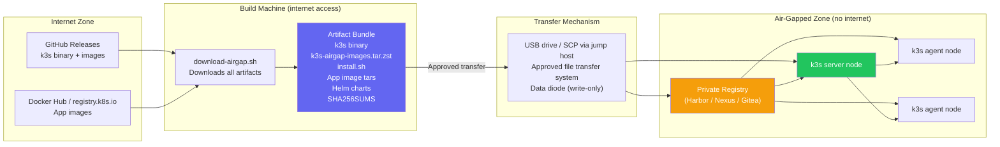
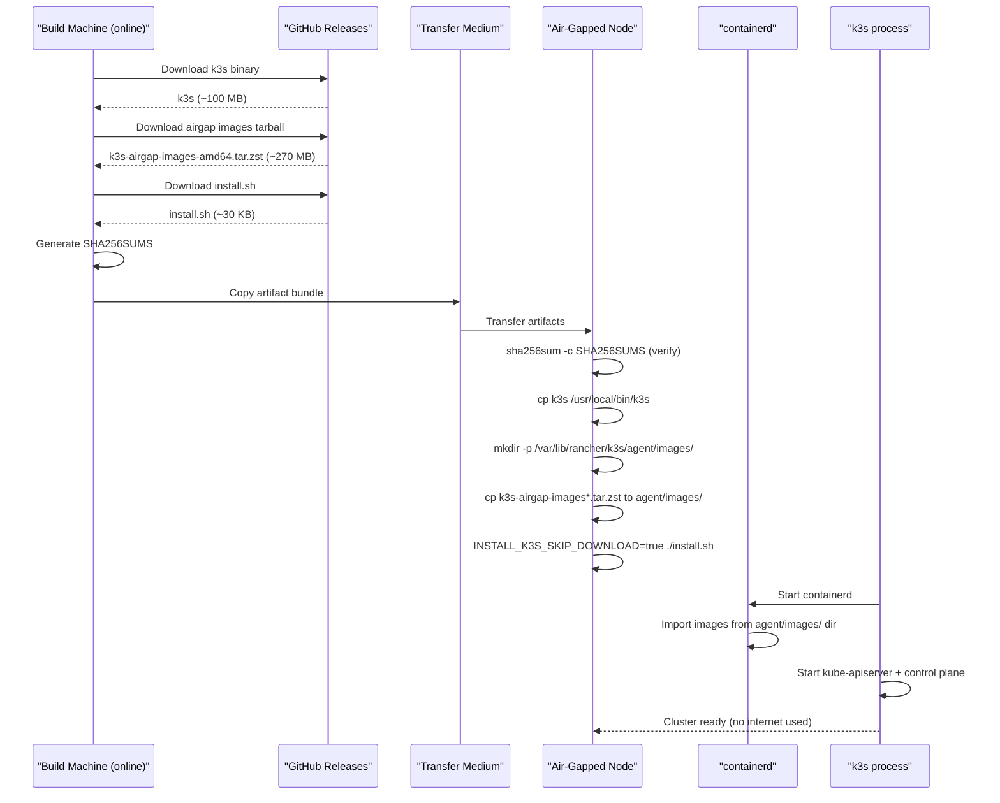
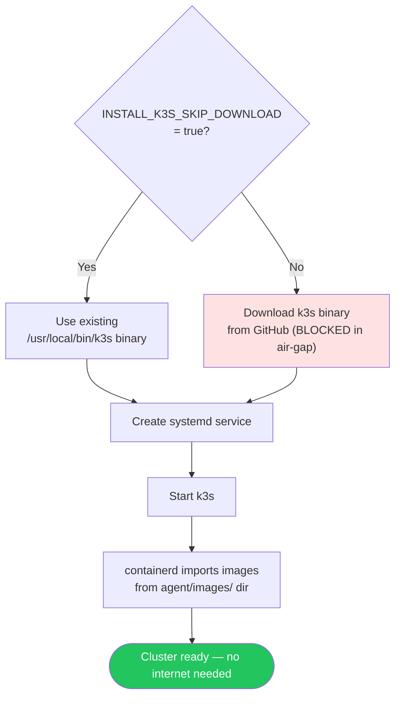
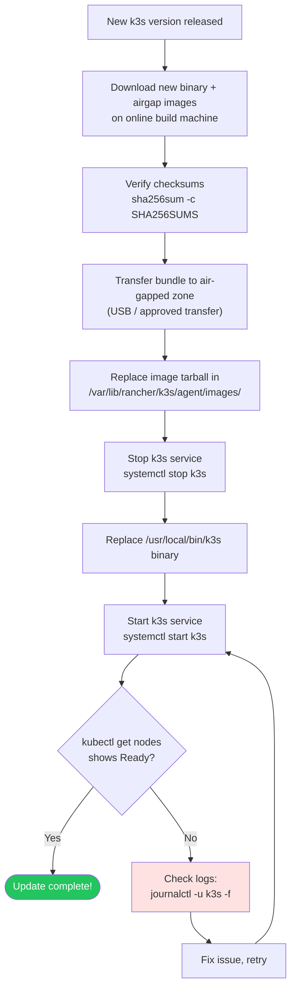

# Air-Gap Install

> Module 02 · Lesson 03 | [↑ Course Index](../README.md)

[](../README.md)
[](../LICENSE.md)

## Table of Contents

- [What is an Air-Gap Install?](#what-is-an-air-gap-install)
- [Why Air-Gap?](#why-air-gap)
- [Air-Gap Architecture](#air-gap-architecture)
- [Required Artifacts Checklist](#required-artifacts-checklist)
- [Air-Gap Install Workflow](#air-gap-install-workflow)
- [Step 1: Download Artifacts (Online Machine)](#step-1-download-artifacts-online-machine)
- [Step 2: Transfer Artifacts to Air-Gapped Host](#step-2-transfer-artifacts-to-air-gapped-host)
- [Step 3: Load Container Images](#step-3-load-container-images)
- [Step 4: Run the Installer](#step-4-run-the-installer)
- [Step 5: Verify Installation](#step-5-verify-installation)
- [Private Registry Setup](#private-registry-setup)
- [Registries.yaml Configuration](#registriesyaml-configuration)
- [Updating an Air-Gapped Cluster](#updating-an-air-gapped-cluster)
- [Common Pitfalls](#common-pitfalls)
- [Further Reading](#further-reading)

---

## What is an Air-Gap Install?

An **air-gapped** environment has no internet access. This includes:

- Secure government or military networks
- Industrial control systems
- Healthcare systems with strict data isolation
- Offshore or remote infrastructure
- High-security corporate environments

k3s supports air-gap installs by allowing you to pre-download all artifacts and load them before running the installer.

> **Sizing note:** If you are following this lesson as a single-node setup, this host is a **server node**. Plan for server minimums (2 CPU / 2 GB RAM). The 512 MB minimum is for agent-only nodes.

[↑ Back to TOC](#table-of-contents) · [↑ Course Index](../README.md)

---

## Why Air-Gap?

The air-gap installation model exists to satisfy requirements that go beyond technical preference. Understanding these motivations helps you design the right solution for your environment.

### Regulatory and Compliance Reasons

Many regulated industries mandate that production systems have no direct internet connectivity:

- **FISMA / FedRAMP** — US federal systems must demonstrate controlled network boundaries. Pulling container images from a public registry is prohibited without an approved proxy.
- **HIPAA** — Healthcare systems containing patient data must restrict data flows. A node that can reach the public internet is harder to audit.
- **PCI-DSS** — Payment systems must limit inbound and outbound connections to the minimum necessary.
- **IEC 62443** — Industrial control system security standards require isolated operational networks.

### Security Reasons

Even without a regulatory requirement, air-gapping provides genuine security benefits:

- **Supply chain attack prevention** — An air-gapped cluster cannot pull a compromised image version published after the last authorized update.
- **Exfiltration prevention** — Compromised workloads cannot reach command-and-control servers on the internet.
- **Reduced attack surface** — No ingress or egress to the public internet means fewer attack vectors.
- **Predictable behavior** — Images and binaries are fixed to known-good versions. A dependency cannot change unexpectedly.

### Operational Reasons

- **Unreliable connectivity** — Edge locations (ships, oil rigs, remote facilities) may have intermittent or expensive satellite connectivity. The cluster must function without it.
- **Latency** — Pulling a 500 MB image over a 1 Mbps link takes 70+ minutes. Pre-loading images eliminates this.
- **Bandwidth cost** — Cellular data at edge sites can be expensive. Image pulls would consume the entire budget.

[↑ Back to TOC](#table-of-contents) · [↑ Course Index](../README.md)

---

## Air-Gap Architecture



The key insight is that all preparation happens on an internet-connected machine. The air-gapped nodes never need internet access — they receive everything they need as a pre-packaged bundle.

[↑ Back to TOC](#table-of-contents) · [↑ Course Index](../README.md)

---

## Required Artifacts Checklist

Before initiating the air-gap transfer, verify you have every required file. Missing even one file will cause a failed or incomplete installation.

| File | Approx. Size | Source | Purpose |
|------|-------------|--------|---------|
| `k3s` binary | ~100 MB | GitHub Releases | The k3s runtime |
| `k3s-airgap-images-<arch>.tar.zst` | ~200–300 MB | GitHub Releases | All system container images |
| `install.sh` | ~30 KB | `get.k3s.io` | Official installer script |
| `SHA256SUMS` | Tiny | GitHub Releases | Checksum file for verification |
| `SHA256SUMS.asc` | Tiny | GitHub Releases | GPG signature for checksum file |
| Helm chart archives (if using custom apps) | Varies | Your chart repos | Application Helm charts |
| App container image tars | Varies | Your registry | Application images |
| `registries.yaml` | Tiny | Your config | Private registry config |
| `config.yaml` | Tiny | Your config | k3s server configuration |

### Architecture Variants

| Arch flag | Target hardware |
|-----------|----------------|
| `amd64` | Standard x86_64 servers, VMs |
| `arm64` | ARM servers, Raspberry Pi 4 (64-bit), AWS Graviton |
| `arm` | ARMv7, Raspberry Pi 3, 32-bit ARM |
| `s390x` | IBM Z mainframes |

> **Tip:** Always verify checksums after transfer. Corruption during USB or SCP transfer is more common than you might expect, especially for large files.

[↑ Back to TOC](#table-of-contents) · [↑ Course Index](../README.md)

---

## Air-Gap Install Workflow



[↑ Back to TOC](#table-of-contents) · [↑ Course Index](../README.md)

---

## Step 1: Download Artifacts (Online Machine)

```bash
#!/usr/bin/env bash
# download-airgap.sh — run on a machine WITH internet access

K3S_VERSION="YOUR_K3S_VERSION"   # Example: v1.30.3+k3s1
ARCH="amd64"   # or arm64 for ARM servers, arm for ARMv7

OUTPUT_DIR="./k3s-airgap-${K3S_VERSION}"
mkdir -p "$OUTPUT_DIR"

echo "=== Downloading k3s binary ==="
curl -Lo "${OUTPUT_DIR}/k3s" \
  "https://github.com/k3s-io/k3s/releases/download/${K3S_VERSION}/k3s"

echo "=== Downloading air-gap images ==="
# These are all the container images k3s needs pre-loaded
curl -Lo "${OUTPUT_DIR}/k3s-airgap-images-${ARCH}.tar.zst" \
  "https://github.com/k3s-io/k3s/releases/download/${K3S_VERSION}/k3s-airgap-images-${ARCH}.tar.zst"

echo "=== Downloading install script ==="
curl -Lo "${OUTPUT_DIR}/install.sh" \
  "https://get.k3s.io"
chmod +x "${OUTPUT_DIR}/install.sh"

echo "=== Downloading checksum file ==="
curl -Lo "${OUTPUT_DIR}/SHA256SUMS" \
  "https://github.com/k3s-io/k3s/releases/download/${K3S_VERSION}/sha256sum-${ARCH}.txt"

echo "=== Creating checksums for transferred files ==="
sha256sum "${OUTPUT_DIR}"/* > "${OUTPUT_DIR}/BUNDLE_SHA256SUMS"

echo "=== Package contents ==="
ls -lh "${OUTPUT_DIR}/"
echo "Done! Transfer the '${OUTPUT_DIR}' directory to your air-gapped host."
```

### What you're downloading

| File | Size (~) | Purpose |
|------|----------|---------|
| `k3s` | ~100 MB | The k3s binary |
| `k3s-airgap-images-amd64.tar.zst` | ~270 MB | All required container images |
| `install.sh` | ~30 KB | Official installer script |
| `SHA256SUMS` | ~4 KB | Official checksums from GitHub |

[↑ Back to TOC](#table-of-contents) · [↑ Course Index](../README.md)

---

## Step 2: Transfer Artifacts to Air-Gapped Host

```bash
# Via SCP (if the host is reachable by SSH from a jump host)
scp -r k3s-airgap-YOUR_K3S_VERSION/ user@airgap-host:/tmp/

# Via USB drive (physical transfer)
# Copy files to USB, then on the air-gapped host:
cp /media/usb/k3s-airgap-* /tmp/

# Verify checksums on the air-gapped host
cd /tmp/k3s-airgap-YOUR_K3S_VERSION/
sha256sum -c BUNDLE_SHA256SUMS
```

> **Security note:** In high-security environments, use a one-way data diode or the facility's approved data transfer mechanism. Do not bypass physical security controls by introducing USB drives without authorization.

[↑ Back to TOC](#table-of-contents) · [↑ Course Index](../README.md)

---

## Step 3: Load Container Images

k3s's containerd reads images from a special directory at startup. Place the image tarball there:

```bash
# Create the images directory
sudo mkdir -p /var/lib/rancher/k3s/agent/images/

# Copy the images tarball
sudo cp /tmp/k3s-airgap-YOUR_K3S_VERSION/k3s-airgap-images-amd64.tar.zst \
  /var/lib/rancher/k3s/agent/images/

# Set correct permissions
sudo chmod 755 /var/lib/rancher/k3s/agent/images/
```

> **How it works:** When k3s's containerd starts, it automatically imports all `.tar`, `.tar.gz`, `.tar.zst`, and `.tar.lz4` files from `/var/lib/rancher/k3s/agent/images/`. This populates the local image cache before any pods are scheduled.

### What's in the Airgap Images Tarball?

The airgap images tarball contains all container images needed to run k3s's built-in components:

| Image | Component |
|-------|-----------|
| `rancher/mirrored-pause` | Pod sandbox (infra container) |
| `rancher/mirrored-coredns-coredns` | CoreDNS |
| `rancher/mirrored-metrics-server` | Metrics Server |
| `rancher/klipper-helm` | Helm controller |
| `rancher/klipper-lb` | Klipper LoadBalancer |
| `rancher/local-path-provisioner` | local-path storage provisioner |
| `traefik` | Traefik ingress controller |
| `rancher/mirrored-library-traefik` | Traefik CRD installer |

Application images (your workloads) are **not** included. You must pre-load those separately.

[↑ Back to TOC](#table-of-contents) · [↑ Course Index](../README.md)

---

## Step 4: Run the Installer

```bash
cd /tmp/k3s-airgap-YOUR_K3S_VERSION/

# Make binary executable and place it
chmod +x k3s
sudo cp k3s /usr/local/bin/k3s

# Run the installer with SKIP_DOWNLOAD — uses the binary we placed manually
sudo INSTALL_K3S_SKIP_DOWNLOAD=true \
     INSTALL_K3S_VERSION="YOUR_K3S_VERSION" \
     ./install.sh

# Or with custom options
sudo INSTALL_K3S_SKIP_DOWNLOAD=true \
     INSTALL_K3S_VERSION="YOUR_K3S_VERSION" \
     ./install.sh server \
     --write-kubeconfig-mode 644 \
     --tls-san 192.168.1.10
```

### What `INSTALL_K3S_SKIP_DOWNLOAD=true` does



[↑ Back to TOC](#table-of-contents) · [↑ Course Index](../README.md)

---

## Step 5: Verify Installation

Use `sudo` only for system-level operations. Run `kubectl` as your regular user after configuring kubeconfig (see Lesson 01, Configure kubectl Access).

```bash
# Check service started
systemctl status k3s

# Wait for node to be Ready (images load takes 30-60s)
kubectl get nodes -w

# Verify all system pods are Running
kubectl get pods -n kube-system

# Confirm no external image pulls happened (all from local cache)
sudo k3s crictl images
# All system images should be present with recent import timestamps

# Check for any ImagePullBackOff (indicates missing images)
kubectl get pods -A | grep -v Running | grep -v Completed
# Should show nothing if all images were in the tarball
```

[↑ Back to TOC](#table-of-contents) · [↑ Course Index](../README.md)

---

## Private Registry Setup

For custom application images in an air-gapped environment, you have two main options.

### Option A: Load images directly into containerd

This is the simplest approach for small numbers of custom images:

```bash
# Export an image from Docker on an online machine
docker pull nginx:alpine
docker save nginx:alpine -o nginx-alpine.tar

# Transfer to air-gapped host, then import
sudo k3s ctr images import nginx-alpine.tar

# Verify
sudo k3s crictl images | grep nginx
# docker.io/library/nginx   alpine   sha256:...   17.5MB
```

This approach works but does not scale well for many images or frequent updates.

### Option B: Run a local registry mirror

A private registry running inside the air-gapped zone provides a scalable, manageable solution. Options include:

| Registry | License | Best for |
|----------|---------|---------|
| **Harbor** | Apache 2.0 | Enterprise; has vulnerability scanning, RBAC, replication |
| **Gitea with registry** | MIT | Small teams; combined git + registry |
| **Nexus Repository** | OSS / Pro | Organizations already using Nexus for artifacts |
| **Docker Registry v2** | Apache 2.0 | Minimal, simple setup |

```bash
# Run a basic Docker Registry v2 in the air-gapped zone
# (requires a node with containerd — use k3s itself or a separate node)

# Load the registry image (must be pre-loaded in the air-gap bundle)
sudo k3s ctr images import registry-2.tar

# Create a registry pod/service
kubectl apply -f - <<'EOF'
apiVersion: apps/v1
kind: Deployment
metadata:
  name: registry
  namespace: kube-system
spec:
  replicas: 1
  selector:
    matchLabels:
      app: registry
  template:
    metadata:
      labels:
        app: registry
    spec:
      containers:
      - name: registry
        image: registry:2
        ports:
        - containerPort: 5000
        volumeMounts:
        - name: data
          mountPath: /var/lib/registry
      volumes:
      - name: data
        persistentVolumeClaim:
          claimName: registry-data
---
apiVersion: v1
kind: Service
metadata:
  name: registry
  namespace: kube-system
spec:
  type: NodePort
  selector:
    app: registry
  ports:
  - port: 5000
    nodePort: 30500
EOF
```

[↑ Back to TOC](#table-of-contents) · [↑ Course Index](../README.md)

---

## Registries.yaml Configuration

The `/etc/rancher/k3s/registries.yaml` file controls how k3s's containerd resolves image references. It supports mirrors (redirecting pulls to a different registry) and authentication configuration.

```yaml
# /etc/rancher/k3s/registries.yaml
# Restart k3s after any change: sudo systemctl restart k3s

mirrors:
  # Redirect all docker.io pulls to the internal registry
  "docker.io":
    endpoint:
      - "https://registry.corp.internal:443"
      - "https://registry-backup.corp.internal:443"  # fallback

  # Redirect k8s system images
  "registry.k8s.io":
    endpoint:
      - "https://registry.corp.internal:443"

  # Redirect quay.io images
  "quay.io":
    endpoint:
      - "https://registry.corp.internal:443"

  # Your own private registry (direct)
  "registry.corp.internal:443":
    endpoint:
      - "https://registry.corp.internal:443"

configs:
  # TLS configuration for the internal registry
  "registry.corp.internal:443":
    tls:
      # Path to the corporate CA certificate
      ca_file: "/etc/ssl/certs/corp-root-ca.crt"
      # Optionally: client cert + key for mTLS
      # cert_file: "/etc/ssl/certs/k3s-client.crt"
      # key_file: "/etc/ssl/private/k3s-client.key"
      insecure_skip_verify: false   # Never true in production

    auth:
      # Service account credentials for k3s to pull from the registry
      username: "k3s-puller"
      password: "supersecretpassword"
      # Or use a token:
      # auth: "base64(username:password)"

  # Insecure local registry (for dev/test only)
  "localhost:5000":
    tls:
      insecure_skip_verify: true
```

### How Mirror Resolution Works

When a pod requests `nginx:alpine`, containerd resolves it as follows:

1. Check if `docker.io` has a mirror configured in `registries.yaml`
2. If yes, try each endpoint in order until one succeeds
3. If all mirrors fail and `insecure_skip_verify` is false, fail the pull
4. If no mirror is configured, attempt the original registry (blocked in air-gap)

This means that in a properly configured air-gap, a failed mirror pull does **not** fall back to the public internet — it simply fails. This is the desired behavior for compliance.

### Applying Registry Changes

```bash
# After editing registries.yaml
sudo systemctl restart k3s

# Verify the configuration was loaded (check containerd config)
sudo k3s ctr namespaces ls
sudo k3s crictl info | python3 -m json.tool | grep -A5 registry
```

[↑ Back to TOC](#table-of-contents) · [↑ Course Index](../README.md)

---

## Updating an Air-Gapped Cluster

Updating an air-gapped k3s cluster requires the same bundle-and-transfer process as the initial install. There is no automatic update mechanism — which is actually a security feature.



```bash
# On air-gapped host — update k3s binary and images

NEW_VERSION="YOUR_NEW_VERSION"

# 1. Place new images tarball (remove old one first to free disk space)
sudo rm /var/lib/rancher/k3s/agent/images/k3s-airgap-images-amd64.tar.zst
sudo cp /tmp/k3s-airgap-${NEW_VERSION}/k3s-airgap-images-amd64.tar.zst \
  /var/lib/rancher/k3s/agent/images/

# 2. Stop the service
sudo systemctl stop k3s

# 3. Replace binary
sudo cp /tmp/k3s-${NEW_VERSION}/k3s /usr/local/bin/k3s
sudo chmod +x /usr/local/bin/k3s

# 4. Start the service
sudo systemctl start k3s

# 5. Verify
kubectl get nodes
k3s --version
```

### Update Considerations

**Before updating:**
- Take an etcd snapshot: `sudo k3s etcd-snapshot save --name pre-update-$(date +%F)`
- Review the k3s changelog for breaking changes
- Test on a non-production cluster first if possible
- For multi-node clusters, update one server at a time

**After updating:**
- Verify all system pods reach `Running` or `Completed` state
- Check that your application pods are still healthy
- Verify DNS resolution still works
- Verify storage and networking still function

[↑ Back to TOC](#table-of-contents) · [↑ Course Index](../README.md)

---

## Common Pitfalls

| Pitfall | Symptom | Fix |
|---------|---------|-----|
| Wrong architecture tarball | Pods stuck `ImagePullBackOff` or containerd fails to start | Download the correct arch: `amd64`, `arm64`, or `arm` |
| Images tarball in wrong directory | Pods can't start, all images show as missing | Place in `/var/lib/rancher/k3s/agent/images/` (not anywhere else) |
| Forgot to set `SKIP_DOWNLOAD` | Installer tries to download and fails | Add `INSTALL_K3S_SKIP_DOWNLOAD=true` |
| Version mismatch between binary and images | Unexpected pod failures | Ensure binary version matches images tarball version |
| Private registry TLS errors | `ImagePullBackOff` with TLS cert errors | Provide the CA cert in `registries.yaml` |
| Custom app images not pre-loaded | App pods `ImagePullBackOff` | Load app images via `k3s ctr images import` or set up registry mirror |
| Corrupted transfer | Checksum mismatch or containerd fails to import | Re-transfer and re-verify `sha256sum -c` |
| Old images tarball left behind | containerd imports stale version | Remove old tarball before placing new one |
| Missing pause image | All pods fail to start | The pause image must be in the airgap tarball; verify with `k3s crictl images` |

[↑ Back to TOC](#table-of-contents) · [↑ Course Index](../README.md)

---

## Further Reading

- [k3s Air-Gap Install Docs](https://docs.k3s.io/installation/airgap)
- [k3s Private Registry Config](https://docs.k3s.io/installation/private-registry)
- [Harbor — Enterprise Registry](https://goharbor.io/)
- [k3s GitHub Releases](https://github.com/k3s-io/k3s/releases)
- [Containerd Hosts Configuration](https://github.com/containerd/containerd/blob/main/docs/hosts.md)
- [NIST SP 800-53 — Air-Gap Controls](https://csrc.nist.gov/publications/detail/sp/800-53/rev-5/final)

[↑ Back to TOC](#table-of-contents) · [↑ Course Index](../README.md)

---

*Licensed under [CC BY-NC-SA 4.0](../LICENSE.md) · © 2026 UncleJS*
