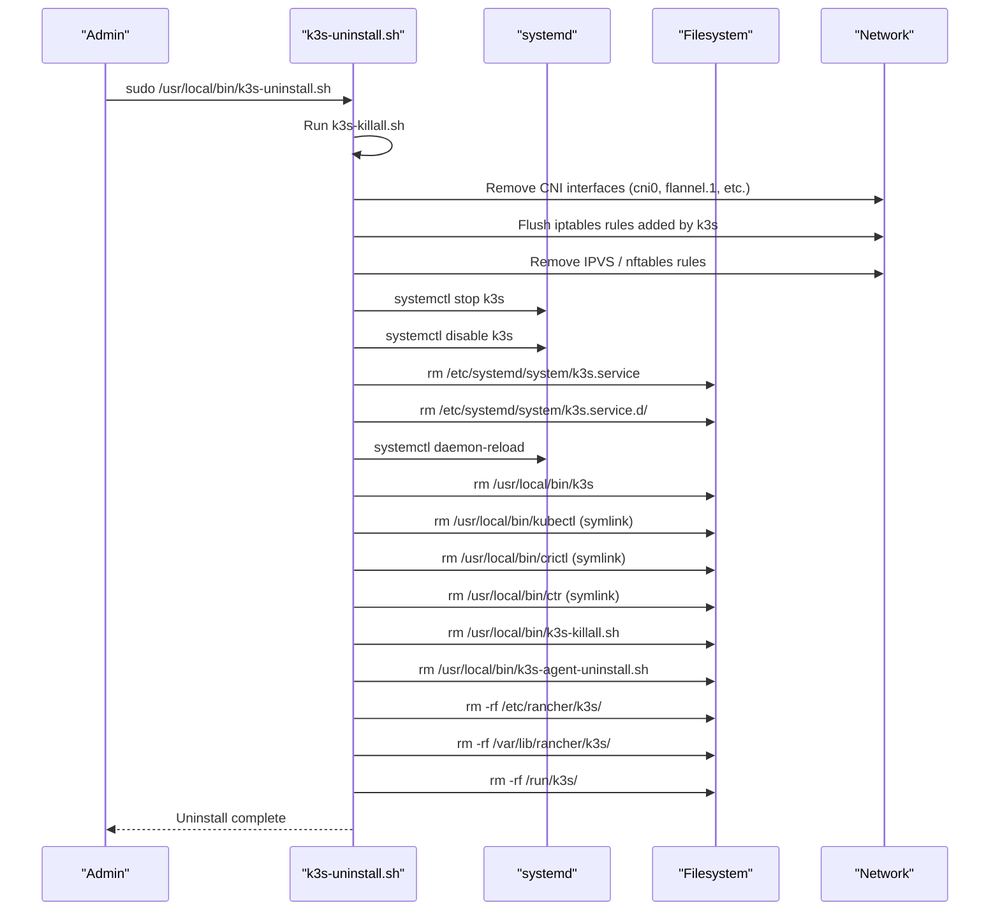
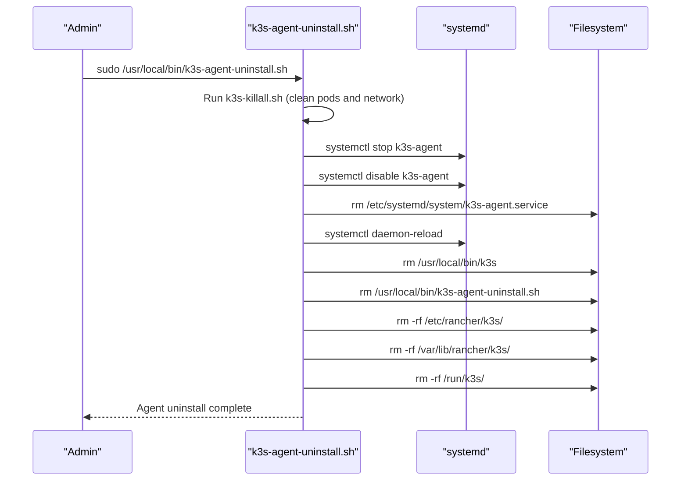
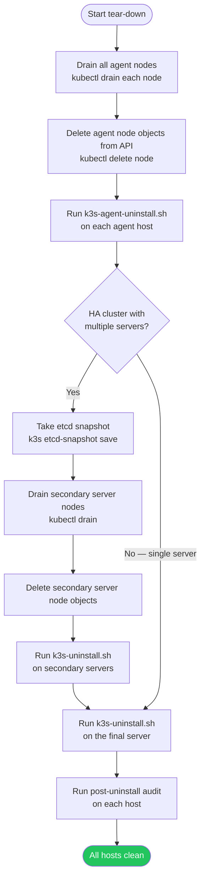
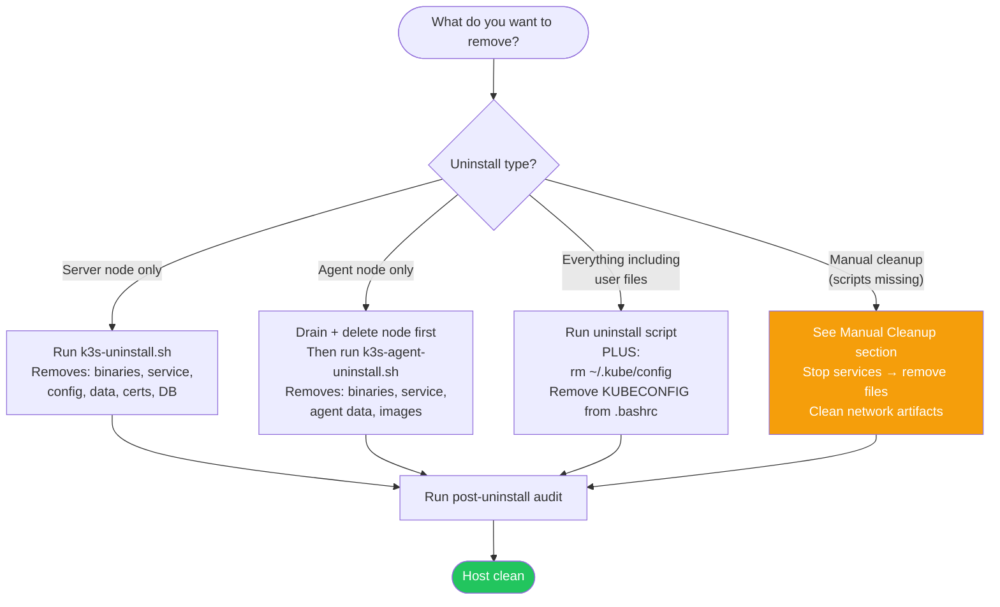

# Uninstall & Cleanup

> Module 02 · Lesson 04 | [↑ Course Index](../README.md)

[](../README.md)
[](../LICENSE.md)

## Table of Contents

- [When to Uninstall](#when-to-uninstall)
- [Before You Uninstall](#before-you-uninstall)
- [What Each Uninstall Script Does](#what-each-uninstall-script-does)
- [Uninstall a Single-Node Server](#uninstall-a-single-node-server)
- [Uninstall an Agent Node](#uninstall-an-agent-node)
- [Multi-Node Tear-Down Order](#multi-node-tear-down-order)
- [What to Remove Decision Tree](#what-to-remove-decision-tree)
- [Data Directories and What They Contain](#data-directories-and-what-they-contain)
- [Manual / Partial Cleanup](#manual--partial-cleanup)
- [Checking for Lingering Resources After Uninstall](#checking-for-lingering-resources-after-uninstall)
- [Post-Uninstall Audit](#post-uninstall-audit)
- [Reinstalling After Uninstall](#reinstalling-after-uninstall)
- [Reuse the Host Safely](#reuse-the-host-safely)
- [Lab Script](#lab-script)
- [Common Pitfalls](#common-pitfalls)
- [Further Reading](#further-reading)

---

## When to Uninstall

Typical cases:

- Rebuilding a node from scratch
- Moving from single-node to HA cluster design
- Recovering from unrecoverable config drift
- Repurposing a host for non-k3s workloads
- Rotating cluster TLS certificates from scratch (nuclear option)
- Changing pod/service CIDRs (requires full reset and reinstall)

Uninstalling k3s is destructive. It removes cluster state, local images, certificates, and runtime data from the node.

[↑ Back to TOC](#table-of-contents) · [↑ Course Index](../README.md)

---

## Before You Uninstall

Use this quick pre-flight checklist:

```bash
# 1) Export workloads and configs you want to keep
kubectl get all --all-namespaces -o yaml > backup-workloads.yaml

# 2) Save kubeconfig for later access
cp ~/.kube/config ~/.kube/config.backup.$(date +%F-%H%M%S)

# 3) Optional: save etcd snapshot (HA or server nodes)
sudo k3s etcd-snapshot save --name pre-uninstall-$(date +%F-%H%M%S)

# 4) Confirm what node you are on
hostname

# 5) Confirm no critical workloads are running
kubectl get pods -A --field-selector=status.phase=Running
```

If this node is part of a multi-node cluster, drain and delete nodes from the API before uninstalling binaries.

[↑ Back to TOC](#table-of-contents) · [↑ Course Index](../README.md)

---

## What Each Uninstall Script Does

k3s ships two uninstall scripts. Understanding what they do lets you predict the outcome and identify what manual cleanup (if any) is still needed.

### k3s-uninstall.sh (Server)



### k3s-agent-uninstall.sh (Agent)

The agent uninstall script follows the same sequence but stops the `k3s-agent` service instead of `k3s`, and removes the agent's data directory. Because agents don't run a control plane, there is no database or kubeconfig to remove.



### What k3s-killall.sh Does

Both uninstall scripts call `k3s-killall.sh` first. This script:

1. Kills all containerd-shim processes (stopping running containers)
2. Unmounts k3s-related bind mounts and overlay filesystems
3. Removes CNI network interfaces (`cni0`, `flannel.1`, etc.)
4. Cleans up iptables/nftables rules inserted by kube-proxy and Flannel
5. Removes IPVS virtual server rules if IPVS mode was used

This is why the uninstall scripts are more thorough than simply stopping the systemd service.

[↑ Back to TOC](#table-of-contents) · [↑ Course Index](../README.md)

---

## Uninstall a Single-Node Server

```bash
# Stops service and removes k3s server data from this host
sudo /usr/local/bin/k3s-uninstall.sh
```

The server uninstall script performs these actions:

1. Stops and disables the `k3s` service
2. Removes `k3s` binaries and helper scripts/symlinks
3. Removes systemd unit files created by installer
4. Removes `/etc/rancher/k3s/` config and cert material
5. Removes `/var/lib/rancher/k3s/` datastore/runtime/images
6. Cleans up networking artifacts where possible

> **Warning:** This operation is irreversible on the local host unless you have external backups.

[↑ Back to TOC](#table-of-contents) · [↑ Course Index](../README.md)

---

## Uninstall an Agent Node

```bash
# Stops service and removes k3s agent data from this host
sudo /usr/local/bin/k3s-agent-uninstall.sh
```

For joined worker nodes, do this before running the uninstall script:

```bash
# From a control-plane context
kubectl drain <agent-node-name> --ignore-daemonsets --delete-emptydir-data
kubectl delete node <agent-node-name>
```

Then run the agent uninstall command on that agent host.

[↑ Back to TOC](#table-of-contents) · [↑ Course Index](../README.md)

---

## Multi-Node Tear-Down Order



Recommended order in HA clusters:

- Snapshot etcd first (data protection)
- Remove agents first (avoids workload disruption)
- Remove non-final servers next (reduces quorum disruption)
- Remove final server last (keeps control plane available longest)

```bash
# Step 1: List all nodes to understand the topology
kubectl get nodes -o wide

# Step 2: For each agent node
kubectl drain agent-01 --ignore-daemonsets --delete-emptydir-data
kubectl delete node agent-01
ssh user@agent-01 sudo /usr/local/bin/k3s-agent-uninstall.sh

# Step 3: For each non-primary server (HA only)
kubectl drain server-02 --ignore-daemonsets
kubectl delete node server-02
ssh user@server-02 sudo /usr/local/bin/k3s-uninstall.sh

# Step 4: Final server
sudo /usr/local/bin/k3s-uninstall.sh
```

[↑ Back to TOC](#table-of-contents) · [↑ Course Index](../README.md)

---

## What to Remove Decision Tree



[↑ Back to TOC](#table-of-contents) · [↑ Course Index](../README.md)

---

## Data Directories and What They Contain

Understanding what is in each directory helps you decide what to preserve before uninstalling.

| Path | Contents | Safe to Delete? |
|------|----------|----------------|
| `/var/lib/rancher/k3s/server/db/` | SQLite database (cluster state) | Yes, after backup or if discarding cluster |
| `/var/lib/rancher/k3s/server/db/snapshots/` | etcd snapshot files | Save externally before deleting |
| `/var/lib/rancher/k3s/server/tls/` | Cluster CA, server, and client certificates | Yes — regenerated on reinstall |
| `/var/lib/rancher/k3s/server/manifests/` | Auto-applied YAML manifests for built-in components | Yes — reinstated by k3s on reinstall |
| `/var/lib/rancher/k3s/server/token` | Server token file | Sensitive — delete or rotate |
| `/var/lib/rancher/k3s/agent/images/` | Pre-loaded container image tarballs (air-gap) | Save if reusing for reinstall |
| `/var/lib/rancher/k3s/agent/containerd/` | containerd state, image layers, metadata | Large — safe to delete; images will re-pull |
| `/var/lib/rancher/k3s/agent/pods/` | Running pod data (volumes, etc.) | Delete after draining |
| `/etc/rancher/k3s/k3s.yaml` | Kubeconfig for cluster access | Save before deleting |
| `/etc/rancher/k3s/config.yaml` | k3s server configuration | Save before deleting if reusing config |
| `/etc/rancher/k3s/registries.yaml` | Registry mirror/auth configuration | Save before deleting if reusing |
| `/run/k3s/` | Runtime sockets and state (tmpfs) | Auto-cleaned on reboot |

### PersistentVolume Data

Data in PersistentVolumes provisioned by `local-path-provisioner` is stored under:

```
/var/lib/rancher/k3s/storage/pvc-<uuid>/
```

This data is **not** removed by the uninstall scripts. If you need to preserve PV data:

```bash
# List all local PV backing directories
ls /var/lib/rancher/k3s/storage/

# Copy a specific PV's data before uninstall
sudo cp -r /var/lib/rancher/k3s/storage/pvc-<uuid>/ /backup/pvc-<uuid>/
```

[↑ Back to TOC](#table-of-contents) · [↑ Course Index](../README.md)

---

## Manual / Partial Cleanup

Use this when uninstall scripts are missing or failed mid-way.

```bash
# Stop services
sudo systemctl stop k3s k3s-agent 2>/dev/null || true
sudo systemctl disable k3s k3s-agent 2>/dev/null || true

# Remove unit files
sudo rm -f /etc/systemd/system/k3s.service
sudo rm -f /etc/systemd/system/k3s-agent.service
sudo rm -f /etc/systemd/system/multi-user.target.wants/k3s.service
sudo rm -f /etc/systemd/system/multi-user.target.wants/k3s-agent.service
sudo systemctl daemon-reload

# Run network/process cleanup helper if present
if [ -x /usr/local/bin/k3s-killall.sh ]; then
  sudo /usr/local/bin/k3s-killall.sh
fi

# Remove binaries/scripts
sudo rm -f /usr/local/bin/k3s
sudo rm -f /usr/local/bin/k3s-killall.sh
sudo rm -f /usr/local/bin/k3s-uninstall.sh
sudo rm -f /usr/local/bin/k3s-agent-uninstall.sh

# Remove symlinks created by k3s installer (if they exist)
sudo rm -f /usr/local/bin/kubectl /usr/local/bin/crictl /usr/local/bin/ctr

# Remove k3s state and config
sudo rm -rf /etc/rancher/k3s
sudo rm -rf /var/lib/rancher/k3s
sudo rm -rf /run/k3s

# --- Local user file cleanup (run as the invoking user, not root) ---

# Remove the kubeconfig copy and any pre-flight backups
rm -f ~/.kube/config
rm -f ~/.kube/config.backup.*

# Remove KUBECONFIG export lines from shell profiles
sed -i '/export KUBECONFIG.*\.kube/d' ~/.bashrc ~/.bash_profile 2>/dev/null || true

# If other users on this host also copied the kubeconfig, clean those too:
# sudo rm -f /home/<other-user>/.kube/config
```

> **Note:** Removing `/usr/local/bin/kubectl` is safe only if that file came from k3s installer symlinks. If you installed `kubectl` separately, reinstall it after cleanup.
>
> **Note:** The `sed` command removes lines matching `export KUBECONFIG=.../.kube` from `~/.bashrc` and `~/.bash_profile`. If you used a different path or variable name, remove those lines manually.

[↑ Back to TOC](#table-of-contents) · [↑ Course Index](../README.md)

---

## Checking for Lingering Resources After Uninstall

After running the uninstall script, use these commands to confirm the host is fully clean. Lingering resources can cause problems if you reinstall k3s or reuse the host for other purposes.

### Network Artifacts

Network artifacts left behind are the most common source of problems on reinstall:

```bash
# Check for leftover CNI network interfaces
ip link show | grep -E 'cni0|flannel|vxlan|kube'
# Expected: no output

# Check for leftover iptables rules (may be extensive on a busy cluster)
sudo iptables -L -n | grep -E 'cni|flannel|KUBE|10\.42\.|10\.43\.'
# Expected: no output (or very few rules from other tools)

sudo iptables -t nat -L -n | grep -E 'cni|KUBE|10\.42\.|10\.43\.'
# Expected: no output

# Check for leftover routes
ip route show | grep -E '10\.42\.|10\.43\.'
# Expected: no output

# Check for leftover IPVS rules (if kube-proxy used IPVS mode)
sudo ipvsadm -L 2>/dev/null | grep -v 'IP Virtual'
# Expected: empty table
```

### Process Artifacts

```bash
# Check for running k3s or containerd processes
ps aux | grep -E '[k]3s|[c]ontainerd.*k3s|[k]ubelet|[f]lannel'
# Expected: no output

# Check for listening sockets on k3s ports
sudo ss -tlnp | grep -E '6443|2379|2380|10250|10251|10252'
# Expected: no output
```

### Filesystem Artifacts

```bash
# Check main data directories
ls /etc/rancher/k3s 2>/dev/null && echo "WARN: /etc/rancher/k3s still exists"
ls /var/lib/rancher/k3s 2>/dev/null && echo "WARN: /var/lib/rancher/k3s still exists"
ls /run/k3s 2>/dev/null && echo "WARN: /run/k3s still exists"

# Check for leftover binary
which k3s 2>/dev/null && echo "WARN: k3s binary still in PATH"
ls /usr/local/bin/k3s 2>/dev/null && echo "WARN: /usr/local/bin/k3s still exists"

# Check for leftover systemd unit
ls /etc/systemd/system/k3s*.service 2>/dev/null && echo "WARN: k3s systemd units still exist"

# Check for stale mounts related to k3s
mount | grep -E 'rancher|kubelet|k3s'
# Expected: no output
```

### User File Artifacts

```bash
# Stale kubeconfig copy
ls -l ~/.kube/config 2>/dev/null && echo "WARN: ~/.kube/config still exists" || echo "OK: no kubeconfig copy"

# Stale kubeconfig backups
ls ~/.kube/config.backup.* 2>/dev/null && echo "WARN: kubeconfig backups present" || true

# Stale KUBECONFIG export in shell profiles
grep -s 'KUBECONFIG' ~/.bashrc ~/.bash_profile && echo "WARN: KUBECONFIG still exported in shell profile" || echo "OK: no KUBECONFIG export found"
```

If artifacts remain, rerun the relevant cleanup commands from the Manual Cleanup section.

[↑ Back to TOC](#table-of-contents) · [↑ Course Index](../README.md)

---

## Post-Uninstall Audit

Use this consolidated checklist to verify the host is clean:

```bash
# Services should be absent or inactive
systemctl status k3s 2>/dev/null || true
systemctl status k3s-agent 2>/dev/null || true

# No running k3s processes
ps aux | grep -E '[k]3s|[c]ontainerd.*k3s' || true

# No leftover state paths
ls -ld /etc/rancher/k3s /var/lib/rancher/k3s /run/k3s 2>/dev/null || true

# No common CNI interfaces
ip link show cni0 2>/dev/null || true
ip link show flannel.1 2>/dev/null || true

# --- Local user file audit ---

# Stale kubeconfig copy
ls -l ~/.kube/config 2>/dev/null && echo "WARN: ~/.kube/config still exists" || echo "OK: no kubeconfig copy"

# Stale kubeconfig backups
ls ~/.kube/config.backup.* 2>/dev/null && echo "WARN: kubeconfig backups present" || true

# Stale KUBECONFIG export in shell profiles
grep -s 'KUBECONFIG' ~/.bashrc ~/.bash_profile && echo "WARN: KUBECONFIG still exported in shell profile" || echo "OK: no KUBECONFIG export found"
```

[↑ Back to TOC](#table-of-contents) · [↑ Course Index](../README.md)

---

## Reinstalling After Uninstall

Reinstalling k3s on a host that previously ran k3s is safe if the uninstall was clean. However, there are several gotchas that can cause a confusing failed reinstall.

### Gotcha 1: Stale TLS Certificates

If you did not fully remove `/etc/rancher/k3s/` before reinstalling, old certificates may conflict with new ones. Always verify the directory is gone:

```bash
# Must be empty/absent before reinstall
sudo ls /etc/rancher/k3s/
# Expected: No such file or directory
```

### Gotcha 2: Stale Node Objects in Another Cluster

If the host was an agent in a cluster that still exists (you're just replacing the node), the old node object might still be in the API server. When the new agent connects, it may conflict.

```bash
# From the control plane — check for stale node
kubectl get nodes

# Delete if present
kubectl delete node old-node-name
```

### Gotcha 3: Token Conflicts

If you reinstall k3s on a server with a new token but try to rejoin agents that were configured with the old token, they will fail to join with authentication errors. Solutions:

1. Use the same token for the new cluster (if token was preserved)
2. Update agent configuration with the new token and re-install agents
3. Use `k3s token generate` to document the expected token format

### Gotcha 4: Leftover CNI State

If network interfaces were not cleaned up before reinstall, Flannel may fail to initialize. Before reinstalling, verify:

```bash
# No cni0 interface
ip link show cni0 2>/dev/null
# No flannel.1 interface
ip link show flannel.1 2>/dev/null
# If either exists, remove manually:
sudo ip link delete cni0 2>/dev/null
sudo ip link delete flannel.1 2>/dev/null
```

### Gotcha 5: CIDR Overlap on the Same Host

If you reinstall with different CIDRs (e.g., changing from `10.42.0.0/16` to `172.16.0.0/16`), old iptables rules may route traffic incorrectly. Always flush the old rules or reboot before reinstalling with different CIDRs.

### Clean Reinstall Checklist

```bash
# 1. Verify clean state
ls /etc/rancher/k3s    # must not exist
ls /var/lib/rancher/k3s # must not exist
ip link show cni0      # must not exist
ip link show flannel.1 # must not exist

# 2. Verify kernel requirements
uname -r              # 4.15+
stat -fc %T /sys/fs/cgroup/  # cgroup v2 or v1 with memory

# 3. Reinstall
curl -sfL https://get.k3s.io | sh -
```

[↑ Back to TOC](#table-of-contents) · [↑ Course Index](../README.md)

---

## Reuse the Host Safely

If you plan to install k3s again on the same host:

- Confirm previous data paths are removed (`/var/lib/rancher/k3s`, `/etc/rancher/k3s`)
- Confirm no stale node object remains in old clusters
- Confirm the host has required CPU/RAM/disk for the new role (server vs agent)
- Re-check swap policy and cgroup support before reinstall

If you are repurposing the host for non-k3s tasks:

- Remove leftover kubeconfig files and shell exports
- Remove any firewall rules added specifically for k3s API access
- Reboot once to clear any lingering transient network state

[↑ Back to TOC](#table-of-contents) · [↑ Course Index](../README.md)

---

## Lab Script

Use the companion script to automate uninstall and cleanup with safety checks:

```bash
# Run with prompt
sudo ./labs/uninstall.sh

# Run without prompt
sudo ./labs/uninstall.sh --force

# Force mode selection
sudo ./labs/uninstall.sh --mode server
sudo ./labs/uninstall.sh --mode agent
sudo ./labs/uninstall.sh --mode manual
```

Script path: `02_installation/labs/uninstall.sh`

[↑ Back to TOC](#table-of-contents) · [↑ Course Index](../README.md)

---

## Common Pitfalls

| Pitfall | Symptom | Fix |
|---------|---------|-----|
| Uninstalling before draining | Workloads terminate abruptly | Drain and delete nodes first in multi-node clusters |
| Stale node objects remain | Old node still appears in `kubectl get nodes` | Delete node object manually from control plane |
| Leftover CNI interfaces | Networking oddities after reinstall | Run `k3s-killall.sh` (if present) and remove interfaces |
| Removing wrong kubectl binary | `kubectl` missing for other clusters | Reinstall standalone kubectl after cleanup |
| No backup before uninstall | Permanent data loss | Snapshot etcd and export manifests first |
| Stale iptables rules | New flannel can't set up routing | Flush iptables or reboot before reinstalling |
| PV data lost silently | Application data gone after reinstall | Backup `/var/lib/rancher/k3s/storage/` before uninstall |
| Token forgotten | New agents can't join after reinstall | Always save the cluster token before uninstall |

[↑ Back to TOC](#table-of-contents) · [↑ Course Index](../README.md)

---

## Further Reading

- [k3s Uninstall Docs](https://docs.k3s.io/installation/uninstall)
- [k3s Backup & Restore](https://docs.k3s.io/datastore/backup-restore)
- [k3s CLI Reference](https://docs.k3s.io/cli)
- [Velero — Cluster Backup and Migration](https://velero.io)

[↑ Back to TOC](#table-of-contents) · [↑ Course Index](../README.md)

---

*Licensed under [CC BY-NC-SA 4.0](../LICENSE.md) · © 2026 UncleJS*
