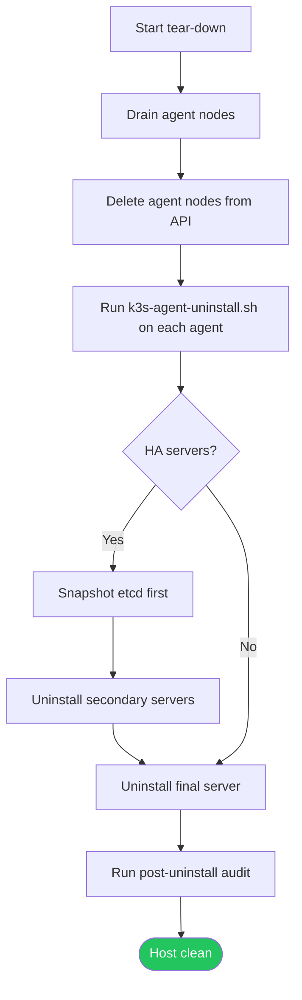

# Uninstall & Cleanup

> Module 02 · Lesson 04 | [↑ Course Index](../README.md)


[](../README.md)
[](../LICENSE.md)

## Table of Contents

- [When to Uninstall](#when-to-uninstall)
- [Before You Uninstall](#before-you-uninstall)
- [Uninstall a Single-Node Server](#uninstall-a-single-node-server)
- [Uninstall an Agent Node](#uninstall-an-agent-node)
- [Multi-Node Tear-Down Order](#multi-node-tear-down-order)
- [Manual / Partial Cleanup](#manual--partial-cleanup)
- [Post-Uninstall Audit](#post-uninstall-audit)
- [Reuse the Host Safely](#reuse-the-host-safely)
- [Lab Script](#lab-script)
- [Common Pitfalls](#common-pitfalls)
- [Further Reading](#further-reading)

---

## When to Uninstall

Typical cases:

- Rebuilding a node from scratch
- Moving from single-node to HA cluster design
- Recovering from unrecoverable config drift
- Repurposing a host for non-k3s workloads

Uninstalling k3s is destructive. It removes cluster state, local images, certificates, and runtime data from the node.

[↑ Back to TOC](#table-of-contents) · [↑ Course Index](../README.md)

---

## Before You Uninstall

Use this quick pre-flight checklist:

```bash
# 1) Export workloads and configs you want to keep
kubectl get all --all-namespaces -o yaml > backup-workloads.yaml

# 2) Save kubeconfig for later access
cp ~/.kube/config ~/.kube/config.backup.$(date +%F-%H%M%S)

# 3) Optional: save etcd snapshot (HA or server nodes)
sudo k3s etcd-snapshot save --name pre-uninstall-$(date +%F-%H%M%S)

# 4) Confirm what node you are on
hostname
```

If this node is part of a multi-node cluster, drain and delete nodes from the API before uninstalling binaries.

[↑ Back to TOC](#table-of-contents) · [↑ Course Index](../README.md)

---

## Uninstall a Single-Node Server

```bash
# Stops service and removes k3s server data from this host
sudo /usr/local/bin/k3s-uninstall.sh
```

The server uninstall script performs these actions:

1. Stops and disables the `k3s` service
2. Removes `k3s` binaries and helper scripts/symlinks
3. Removes systemd unit files created by installer
4. Removes `/etc/rancher/k3s/` config and cert material
5. Removes `/var/lib/rancher/k3s/` datastore/runtime/images
6. Cleans up networking artifacts where possible

> **Warning:** This operation is irreversible on the local host unless you have external backups.

[↑ Back to TOC](#table-of-contents) · [↑ Course Index](../README.md)

---

## Uninstall an Agent Node

```bash
# Stops service and removes k3s agent data from this host
sudo /usr/local/bin/k3s-agent-uninstall.sh
```

For joined worker nodes, do this before running the uninstall script:

```bash
# From a control-plane context
kubectl drain <agent-node-name> --ignore-daemonsets --delete-emptydir-data
kubectl delete node <agent-node-name>
```

Then run the agent uninstall command on that agent host.

[↑ Back to TOC](#table-of-contents) · [↑ Course Index](../README.md)

---

## Multi-Node Tear-Down Order



Recommended order in HA clusters:

- Snapshot etcd first
- Remove agents first
- Remove non-final servers next
- Remove final server last

[↑ Back to TOC](#table-of-contents) · [↑ Course Index](../README.md)

---

## Manual / Partial Cleanup

Use this when uninstall scripts are missing or failed mid-way.

```bash
# Stop services
sudo systemctl stop k3s k3s-agent 2>/dev/null || true
sudo systemctl disable k3s k3s-agent 2>/dev/null || true

# Remove unit files
sudo rm -f /etc/systemd/system/k3s.service
sudo rm -f /etc/systemd/system/k3s-agent.service
sudo rm -f /etc/systemd/system/multi-user.target.wants/k3s.service
sudo rm -f /etc/systemd/system/multi-user.target.wants/k3s-agent.service
sudo systemctl daemon-reload

# Run network/process cleanup helper if present
if [ -x /usr/local/bin/k3s-killall.sh ]; then
  sudo /usr/local/bin/k3s-killall.sh
fi

# Remove binaries/scripts
sudo rm -f /usr/local/bin/k3s
sudo rm -f /usr/local/bin/k3s-killall.sh
sudo rm -f /usr/local/bin/k3s-uninstall.sh
sudo rm -f /usr/local/bin/k3s-agent-uninstall.sh

# Remove symlinks created by k3s installer (if they exist)
sudo rm -f /usr/local/bin/kubectl /usr/local/bin/crictl /usr/local/bin/ctr

# Remove k3s state and config
sudo rm -rf /etc/rancher/k3s
sudo rm -rf /var/lib/rancher/k3s
sudo rm -rf /run/k3s

# --- Local user file cleanup (run as the invoking user, not root) ---

# Remove the kubeconfig copy and any pre-flight backups
rm -f ~/.kube/config
rm -f ~/.kube/config.backup.*

# Remove KUBECONFIG export lines from shell profiles
sed -i '/export KUBECONFIG.*\.kube/d' ~/.bashrc ~/.bash_profile 2>/dev/null || true

# If other users on this host also copied the kubeconfig, clean those too:
# sudo rm -f /home/<other-user>/.kube/config
```

> **Note:** Removing `/usr/local/bin/kubectl` is safe only if that file came from k3s installer symlinks. If you installed `kubectl` separately, reinstall it after cleanup.
>
> **Note:** The `sed` command removes lines matching `export KUBECONFIG=.../.kube` from `~/.bashrc` and `~/.bash_profile`. If you used a different path or variable name, remove those lines manually.

[↑ Back to TOC](#table-of-contents) · [↑ Course Index](../README.md)

---

## Post-Uninstall Audit

Use this checklist to verify the host is clean:

```bash
# Services should be absent or inactive
systemctl status k3s 2>/dev/null || true
systemctl status k3s-agent 2>/dev/null || true

# No running k3s processes
ps aux | grep -E '[k]3s|[c]ontainerd.*k3s' || true

# No leftover state paths
ls -ld /etc/rancher/k3s /var/lib/rancher/k3s /run/k3s 2>/dev/null || true

# No common CNI interfaces
ip link show cni0 2>/dev/null || true
ip link show flannel.1 2>/dev/null || true

# --- Local user file audit ---

# Stale kubeconfig copy
ls -l ~/.kube/config 2>/dev/null && echo "WARN: ~/.kube/config still exists" || echo "OK: no kubeconfig copy"

# Stale kubeconfig backups
ls ~/.kube/config.backup.* 2>/dev/null && echo "WARN: kubeconfig backups present" || true

# Stale KUBECONFIG export in shell profiles
grep -s 'KUBECONFIG' ~/.bashrc ~/.bash_profile && echo "WARN: KUBECONFIG still exported in shell profile" || echo "OK: no KUBECONFIG export found"
```

If artifacts remain, rerun the relevant cleanup commands from the section above.

[↑ Back to TOC](#table-of-contents) · [↑ Course Index](../README.md)

---

## Reuse the Host Safely

If you plan to install k3s again on the same host:

- Confirm previous data paths are removed (`/var/lib/rancher/k3s`, `/etc/rancher/k3s`)
- Confirm no stale node object remains in old clusters
- Confirm the host has required CPU/RAM/disk for the new role (server vs agent)
- Re-check swap policy and cgroup support before reinstall

If you are repurposing the host for non-k3s tasks:

- Remove leftover kubeconfig files and shell exports
- Remove any firewall rules added specifically for k3s API access
- Reboot once to clear any lingering transient network state

[↑ Back to TOC](#table-of-contents) · [↑ Course Index](../README.md)

---

## Lab Script

Use the companion script to automate uninstall and cleanup with safety checks:

```bash
# Run with prompt
sudo ./labs/uninstall.sh

# Run without prompt
sudo ./labs/uninstall.sh --force

# Force mode selection
sudo ./labs/uninstall.sh --mode server
sudo ./labs/uninstall.sh --mode agent
sudo ./labs/uninstall.sh --mode manual
```

Script path: `02_installation/labs/uninstall.sh`

[↑ Back to TOC](#table-of-contents) · [↑ Course Index](../README.md)

---

## Common Pitfalls

| Pitfall | Symptom | Fix |
|---------|---------|-----|
| Uninstalling before draining | Workloads terminate abruptly | Drain and delete nodes first in multi-node clusters |
| Stale node objects remain | Old node still appears in `kubectl get nodes` | Delete node object manually from control plane |
| Leftover CNI interfaces | Networking oddities after reinstall | Run `k3s-killall.sh` (if present) and remove interfaces |
| Removing wrong kubectl binary | `kubectl` missing for other clusters | Reinstall standalone kubectl after cleanup |
| No backup before uninstall | Permanent data loss | Snapshot etcd and export manifests first |

[↑ Back to TOC](#table-of-contents) · [↑ Course Index](../README.md)

---

## Further Reading

- [k3s Uninstall Docs](https://docs.k3s.io/installation/uninstall)
- [k3s Backup & Restore](https://docs.k3s.io/datastore/backup-restore)
- [k3s CLI Reference](https://docs.k3s.io/cli)

[↑ Back to TOC](#table-of-contents) · [↑ Course Index](../README.md)

---

*Licensed under [CC BY-NC-SA 4.0](../LICENSE.md) · © 2026 UncleJS*
