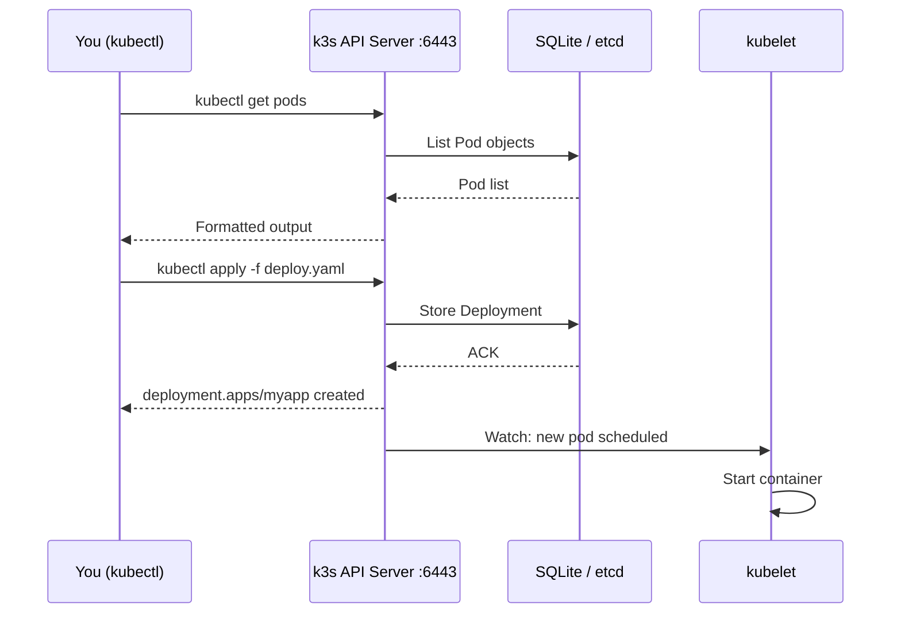

# kubectl Basics

> Module 03 · Lesson 01 | [↑ Course Index](../README.md)

## Table of Contents

- [What is kubectl?](#what-is-kubectl)
- [kubectl Configuration](#kubectl-configuration)
- [Core Command Structure](#core-command-structure)
- [Getting Information](#getting-information)
- [Creating & Applying Resources](#creating--applying-resources)
- [Editing Resources](#editing-resources)
- [Deleting Resources](#deleting-resources)
- [Logs & Events](#logs--events)
- [Executing Commands in Pods](#executing-commands-in-pods)
- [Port Forwarding](#port-forwarding)
- [Output Formats](#output-formats)
- [Context & Namespace Switching](#context--namespace-switching)
- [Common Pitfalls](#common-pitfalls)
- [Further Reading](#further-reading)

---

## What is kubectl?

`kubectl` is the command-line client for the Kubernetes API. Every operation you perform — creating pods, inspecting logs, scaling deployments — goes through kubectl talking to the k3s API server over HTTPS.



k3s bundles kubectl — you can always use `k3s kubectl` as a fallback even if the standalone binary isn't installed.

[↑ Back to TOC](#table-of-contents) · [↑ Course Index](../README.md)

---

## kubectl Configuration

```bash
# Default kubeconfig location
~/.kube/config

# k3s kubeconfig location
/etc/rancher/k3s/k3s.yaml

# Copy k3s kubeconfig for your user
mkdir -p ~/.kube
sudo cp /etc/rancher/k3s/k3s.yaml ~/.kube/config
sudo chown $(id -u):$(id -g) ~/.kube/config

# Set via environment variable
export KUBECONFIG=~/.kube/config

# Use multiple kubeconfig files (merged)
export KUBECONFIG=~/.kube/config:~/.kube/other-cluster.yaml

# View current config
kubectl config view

# View available contexts
kubectl config get-contexts

# Show current context
kubectl config current-context
```

[↑ Back to TOC](#table-of-contents) · [↑ Course Index](../README.md)

---

## Core Command Structure

```
kubectl <verb> <resource> [name] [flags]
```

| Component | Examples |
|-----------|---------|
| Verb | `get`, `describe`, `create`, `apply`, `delete`, `edit`, `patch`, `scale`, `rollout`, `logs`, `exec`, `port-forward` |
| Resource | `pod`/`pods`/`po`, `deployment`/`deploy`, `service`/`svc`, `node`/`no`, `namespace`/`ns`, `configmap`/`cm`, `secret`, `ingress`/`ing`, `pvc` |
| Name | Optional resource name; omit to list all |
| Flags | `-n namespace`, `-o format`, `--all-namespaces`/`-A`, `-l label=value`, `--watch`/`-w` |

```bash
# Pattern examples
kubectl get pods                    # list all pods in current namespace
kubectl get pod my-pod              # get specific pod
kubectl get pods -n kube-system     # list pods in kube-system namespace
kubectl get pods -A                 # list pods in ALL namespaces
kubectl get pods -l app=nginx       # filter by label
kubectl get pods -o wide            # extra columns (node, IP)
kubectl get pods -w                 # watch for changes
```

[↑ Back to TOC](#table-of-contents) · [↑ Course Index](../README.md)

---

## Getting Information

```bash
# --- get: list resources ---
kubectl get nodes
kubectl get pods
kubectl get deployments
kubectl get services
kubectl get configmaps
kubectl get secrets
kubectl get persistentvolumeclaims
kubectl get ingresses
kubectl get namespaces

# Get multiple resource types at once
kubectl get pods,services,deployments

# Get all resources in a namespace
kubectl get all -n myapp

# --- describe: detailed info ---
kubectl describe node my-node
kubectl describe pod my-pod
kubectl describe deployment my-deploy
kubectl describe service my-svc

# --- get with JSONPath (powerful extraction) ---
kubectl get pod my-pod -o jsonpath='{.spec.nodeName}'
kubectl get nodes -o jsonpath='{range .items[*]}{.metadata.name} {.status.conditions[-1].type}{"\n"}{end}'
kubectl get secret my-secret -o jsonpath='{.data.password}' | base64 -d

# --- explain: API schema reference ---
kubectl explain pod
kubectl explain pod.spec
kubectl explain pod.spec.containers
kubectl explain deployment.spec.strategy
```

[↑ Back to TOC](#table-of-contents) · [↑ Course Index](../README.md)

---

## Creating & Applying Resources

```bash
# --- apply: declarative, idempotent (RECOMMENDED) ---
kubectl apply -f deployment.yaml
kubectl apply -f ./manifests/           # apply all YAML in a directory
kubectl apply -f https://example.com/app.yaml  # apply from URL

# --- create: imperative, errors if exists ---
kubectl create deployment nginx --image=nginx:alpine
kubectl create service clusterip my-svc --tcp=80:80
kubectl create configmap my-config --from-literal=key=value
kubectl create secret generic my-secret --from-literal=password=supersecret
kubectl create namespace my-namespace

# --- Dry run (preview changes without applying) ---
kubectl apply -f deployment.yaml --dry-run=client
kubectl apply -f deployment.yaml --dry-run=server   # validates against API

# --- Generate YAML from imperative command ---
kubectl create deployment nginx --image=nginx:alpine --dry-run=client -o yaml > nginx-deploy.yaml
```

> **`apply` vs `create`:** Always prefer `kubectl apply`. It creates if the resource doesn't exist, updates if it does, and tracks changes. `create` fails if the resource already exists.

[↑ Back to TOC](#table-of-contents) · [↑ Course Index](../README.md)

---

## Editing Resources

```bash
# --- edit: opens resource in your $EDITOR ---
kubectl edit deployment my-deploy
kubectl edit configmap my-config

# --- patch: apply a specific change ---
# Strategic merge patch (most common)
kubectl patch deployment my-deploy -p '{"spec":{"replicas":3}}'

# JSON patch
kubectl patch deployment my-deploy --type=json \
  -p='[{"op":"replace","path":"/spec/replicas","value":3}]'

# --- set: change specific fields ---
kubectl set image deployment/my-deploy container=nginx:1.25
kubectl set env deployment/my-deploy ENV_VAR=value
kubectl set resources deployment/my-deploy --limits=cpu=200m,memory=256Mi

# --- scale: change replica count ---
kubectl scale deployment my-deploy --replicas=5
kubectl scale --replicas=3 -f deployment.yaml

# --- autoscale ---
kubectl autoscale deployment my-deploy --min=2 --max=10 --cpu-percent=80
```

[↑ Back to TOC](#table-of-contents) · [↑ Course Index](../README.md)

---

## Deleting Resources

```bash
# Delete by file (recommended — mirrors what you applied)
kubectl delete -f deployment.yaml

# Delete by type and name
kubectl delete deployment my-deploy
kubectl delete pod my-pod
kubectl delete service my-svc

# Delete all of a type in a namespace
kubectl delete pods --all -n my-namespace
kubectl delete deployments --all

# Delete with label selector
kubectl delete pods -l app=nginx

# Force delete a stuck pod (use sparingly)
kubectl delete pod my-pod --grace-period=0 --force

# Delete a namespace (deletes ALL resources in it)
kubectl delete namespace my-namespace
```

> **Warning:** Deleting a namespace deletes everything in it instantly and irreversibly. Double-check before running.

[↑ Back to TOC](#table-of-contents) · [↑ Course Index](../README.md)

---

## Logs & Events

```bash
# --- logs ---
kubectl logs my-pod                          # last ~100 lines
kubectl logs my-pod -f                       # follow live
kubectl logs my-pod --since=1h               # last 1 hour
kubectl logs my-pod --tail=50                # last 50 lines
kubectl logs my-pod -c container-name        # specific container in multi-container pod
kubectl logs my-pod --previous               # logs from the previous (crashed) container

# Logs from all pods of a deployment
kubectl logs -l app=my-app --all-containers=true

# --- events ---
kubectl get events                           # all events in namespace
kubectl get events --sort-by=.lastTimestamp  # sorted by time
kubectl get events -n kube-system
kubectl get events --field-selector reason=OOMKilling

# Events for a specific pod
kubectl describe pod my-pod | grep -A 20 "Events:"
```

[↑ Back to TOC](#table-of-contents) · [↑ Course Index](../README.md)

---

## Executing Commands in Pods

```bash
# Run a command in a running pod
kubectl exec my-pod -- ls /app
kubectl exec my-pod -- env
kubectl exec my-pod -- cat /etc/config/settings.yaml

# Interactive shell
kubectl exec -it my-pod -- /bin/bash
kubectl exec -it my-pod -- /bin/sh   # for Alpine-based images

# Multi-container pod — specify container
kubectl exec -it my-pod -c sidecar -- /bin/sh

# Run a temporary debug container (k8s 1.23+)
kubectl debug my-pod -it --image=busybox --target=my-container
```

[↑ Back to TOC](#table-of-contents) · [↑ Course Index](../README.md)

---

## Port Forwarding

Port forwarding creates a tunnel from your local machine to a pod or service:

```bash
# Forward local port 8080 to pod port 80
kubectl port-forward pod/my-pod 8080:80

# Forward to a service
kubectl port-forward svc/my-service 8080:80

# Forward to a deployment (picks one pod)
kubectl port-forward deployment/my-deploy 8080:80

# Access from any interface (not just localhost)
kubectl port-forward svc/my-service 8080:80 --address 0.0.0.0
```

Then access at `http://localhost:8080`.

> **Use case:** Access a service that isn't exposed externally (ClusterIP) without creating a NodePort or Ingress.

[↑ Back to TOC](#table-of-contents) · [↑ Course Index](../README.md)

---

## Output Formats

```bash
# Human-readable table (default)
kubectl get pods

# Wide — more columns
kubectl get pods -o wide

# YAML output (for inspection or saving)
kubectl get deployment my-deploy -o yaml

# JSON output
kubectl get deployment my-deploy -o json

# JSONPath — extract specific fields
kubectl get nodes -o jsonpath='{.items[*].metadata.name}'
kubectl get pods -o jsonpath='{range .items[*]}{.metadata.name}{"\t"}{.status.phase}{"\n"}{end}'

# Custom columns
kubectl get pods -o custom-columns=NAME:.metadata.name,STATUS:.status.phase,NODE:.spec.nodeName

# Sort by field
kubectl get pods --sort-by=.metadata.creationTimestamp
kubectl get events --sort-by=.lastTimestamp
```

[↑ Back to TOC](#table-of-contents) · [↑ Course Index](../README.md)

---

## Context & Namespace Switching

```bash
# Set default namespace for current context
kubectl config set-context --current --namespace=my-namespace

# Switch context (for multi-cluster)
kubectl config use-context my-other-cluster

# Run single command in different namespace
kubectl get pods -n kube-system

# Run across all namespaces
kubectl get pods -A

# Useful alias trick (add to ~/.bashrc)
alias k=kubectl
alias kns='kubectl config set-context --current --namespace'
alias kctx='kubectl config use-context'
```

[↑ Back to TOC](#table-of-contents) · [↑ Course Index](../README.md)

---

## Common Pitfalls

| Pitfall | Detail |
|---------|--------|
| Wrong namespace | Always check which namespace you're in — many issues are just `kubectl get pods -n correct-namespace` |
| `kubectl create` vs `kubectl apply` | `create` fails if resource exists; use `apply` for idempotency |
| Missing kubeconfig | `kubectl` not finding config — ensure `KUBECONFIG` is set or `~/.kube/config` exists |
| `kubectl delete namespace` | Instantly deletes all resources — no undo |
| Force-deleting pods | `--force --grace-period=0` skips cleanup; the pod may still exist in etcd if the node is unreachable |

[↑ Back to TOC](#table-of-contents) · [↑ Course Index](../README.md)

---

## Further Reading

- [kubectl Cheatsheet](../cheatsheets/kubectl-cheatsheet.md)
- [kubectl Official Reference](https://kubernetes.io/docs/reference/kubectl/)
- [kubectl JSONPath Guide](https://kubernetes.io/docs/reference/kubectl/jsonpath/)

[↑ Back to TOC](#table-of-contents) · [↑ Course Index](../README.md)

---

*Licensed under [CC BY-NC-SA 4.0](../LICENSE.md) · © 2026 UncleJS*
