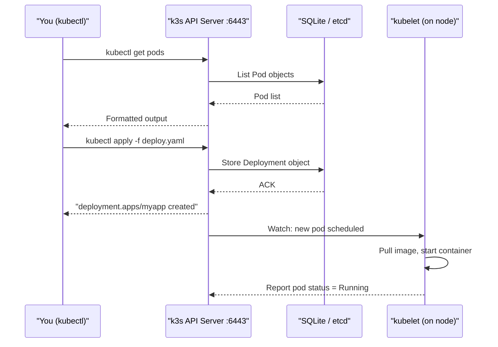
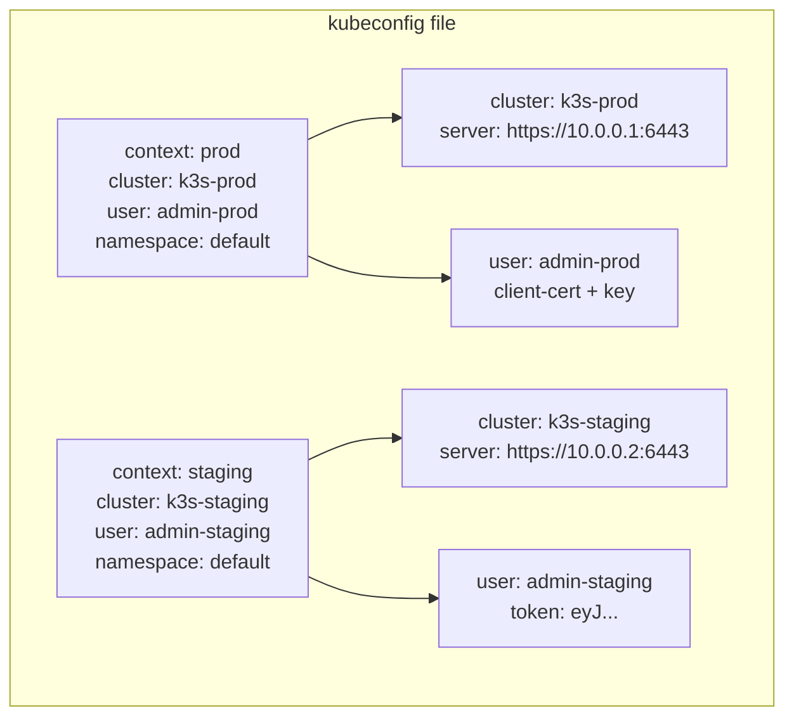
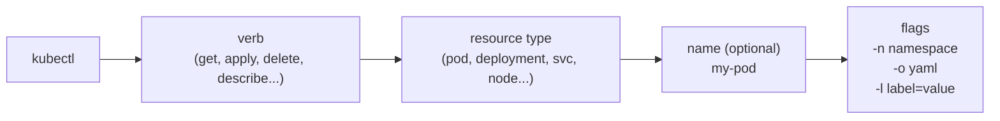
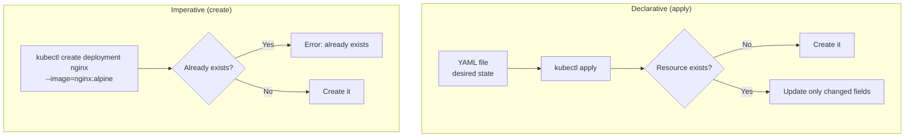
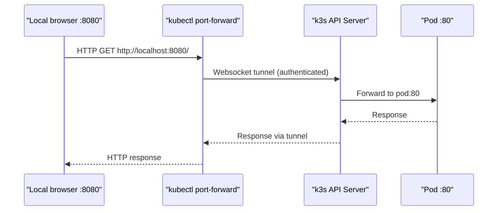

# kubectl Basics

> Module 03 · Lesson 01 | [↑ Course Index](../README.md)


[](../README.md)
[](../LICENSE.md)

## Table of Contents

- [What is kubectl?](#what-is-kubectl)
- [kubectl Configuration](#kubectl-configuration)
- [Multi-Cluster Kubeconfig](#multi-cluster-kubeconfig)
- [Core Command Structure](#core-command-structure)
- [Getting Information](#getting-information)
- [Creating & Applying Resources](#creating--applying-resources)
- [Editing Resources](#editing-resources)
- [Deleting Resources](#deleting-resources)
- [Logs & Events](#logs--events)
- [Executing Commands in Pods](#executing-commands-in-pods)
- [Port Forwarding](#port-forwarding)
- [Output Formats & JSONPath](#output-formats--jsonpath)
- [Context & Namespace Switching](#context--namespace-switching)
- [Useful Aliases & Productivity Tips](#useful-aliases--productivity-tips)
- [Common Pitfalls](#common-pitfalls)
- [Lab](#lab)
- [Further Reading](#further-reading)

---

## What is kubectl?

`kubectl` is the command-line client for the Kubernetes API. Every operation you perform — creating pods, inspecting logs, scaling deployments, reading secrets — is translated by kubectl into an authenticated HTTPS request to the k3s API server running on port 6443.

Think of kubectl as a very smart HTTP client: it reads your kubeconfig file to discover the cluster address and your credentials, serialises your intent into a JSON or YAML API request, sends it over TLS, and pretty-prints the response. Under the hood there is nothing magical — if you wanted, you could replicate everything kubectl does with `curl` and a bearer token.



k3s bundles kubectl — you can always use `k3s kubectl` as a fallback even if the standalone binary isn't installed. The bundled version matches the k3s server version, which avoids API skew problems when working with newer CRDs.

> **Why does version matching matter?** The kubectl client/server version skew policy allows ±1 minor version. If your client is v1.27 and the server is v1.29, some fields will silently be omitted or misinterpreted. Always install a kubectl binary within one minor version of your cluster.

[↑ Back to TOC](#table-of-contents) · [↑ Course Index](../README.md)

---

## kubectl Configuration

kubectl looks for its configuration in a file called **kubeconfig**. The file stores cluster addresses, user credentials (certificates or tokens), and logical groupings called **contexts** that map a user to a cluster and a default namespace.

```bash
# Default kubeconfig location
~/.kube/config

# k3s writes its kubeconfig here (root-owned by default)
/etc/rancher/k3s/k3s.yaml

# Copy k3s kubeconfig for your user
mkdir -p ~/.kube
sudo cp /etc/rancher/k3s/k3s.yaml ~/.kube/config
sudo chown $(id -u):$(id -g) ~/.kube/config
chmod 600 ~/.kube/config   # important: kubeconfig contains credentials

# Set via environment variable (overrides the default path)
export KUBECONFIG=~/.kube/config

# View current config (redacts certificate data by default)
kubectl config view

# View contexts
kubectl config get-contexts

# Show current context
kubectl config current-context
```

> **Security note:** The kubeconfig file for a k3s single-node install contains a client certificate that grants `cluster-admin` privileges. Protect it like a root password — `chmod 600`, don't commit it to Git, and don't share it unencrypted.

[↑ Back to TOC](#table-of-contents) · [↑ Course Index](../README.md)

---

## Multi-Cluster Kubeconfig

One of kubectl's most powerful features is its ability to manage credentials for many clusters in a single file. The kubeconfig format separates **clusters** (API server addresses + CA certs), **users** (credentials), and **contexts** (cluster + user + namespace triplets).



```bash
# Merge multiple kubeconfig files using KUBECONFIG env var (colon-separated)
export KUBECONFIG=~/.kube/config:~/.kube/staging.yaml:~/.kube/dev.yaml

# After merging, view all contexts
kubectl config get-contexts
# CURRENT   NAME       CLUSTER    AUTHINFO       NAMESPACE
# *         prod       k3s-prod   admin-prod     default
#           staging    k3s-stg    admin-staging  default

# Switch context
kubectl config use-context staging

# Run a single command in a different context without switching
kubectl --context=prod get nodes

# Rename a context
kubectl config rename-context old-name new-name

# Delete a context
kubectl config delete-context old-context
```

A popular community tool, `kubectx` / `kubens`, makes context and namespace switching much faster. Install via package manager or from https://github.com/ahmetb/kubectx.

[↑ Back to TOC](#table-of-contents) · [↑ Course Index](../README.md)

---

## Core Command Structure

Every kubectl command follows the same grammar:

```
kubectl <verb> <resource-type> [resource-name] [flags]
```



| Component | Examples |
|-----------|---------|
| Verb | `get`, `describe`, `create`, `apply`, `delete`, `edit`, `patch`, `scale`, `rollout`, `logs`, `exec`, `port-forward`, `explain`, `top` |
| Resource | `pod`/`pods`/`po`, `deployment`/`deploy`, `service`/`svc`, `node`/`no`, `namespace`/`ns`, `configmap`/`cm`, `secret`, `ingress`/`ing`, `pvc`, `pv`, `job`, `cronjob` |
| Name | Optional resource name; omit to list all |
| Flags | `-n namespace`, `-o format`, `--all-namespaces`/`-A`, `-l label=value`, `--watch`/`-w`, `--dry-run=client` |

```bash
# Pattern examples
kubectl get pods                    # list all pods in current namespace
kubectl get pod my-pod              # get specific pod
kubectl get pods -n kube-system     # list pods in kube-system namespace
kubectl get pods -A                 # list pods in ALL namespaces
kubectl get pods -l app=nginx       # filter by label selector
kubectl get pods -o wide            # extra columns (node IP, pod IP)
kubectl get pods -w                 # watch for changes (streaming)
kubectl get pods,services           # multiple resource types at once
kubectl get all -n myapp            # all common resource types in a namespace
```

Resource names are case-insensitive and support aliases: `pod`, `pods`, `po` all work. The full list of aliases is available via `kubectl api-resources`.

[↑ Back to TOC](#table-of-contents) · [↑ Course Index](../README.md)

---

## Getting Information

### `get` — list resources

`get` is the workhorse command for checking cluster state. It queries the API server's object store and returns a table by default.

```bash
# Core resources
kubectl get nodes
kubectl get pods
kubectl get deployments
kubectl get services
kubectl get configmaps
kubectl get secrets
kubectl get persistentvolumeclaims
kubectl get ingresses
kubectl get namespaces

# Get multiple resource types at once
kubectl get pods,services,deployments -n myapp

# Get all resources in a namespace
kubectl get all -n myapp
```

### `describe` — deep inspection

`describe` returns a human-readable summary of a resource including its spec, status, and — crucially — recent events. It's almost always the first command to run when debugging a broken pod.

```bash
kubectl describe node my-node
kubectl describe pod my-pod
kubectl describe deployment my-deploy
kubectl describe service my-svc
kubectl describe pvc my-claim

# The Events section at the bottom is often the fastest path to the root cause
kubectl describe pod my-failing-pod | grep -A 30 "Events:"
```

### `explain` — API schema reference

`explain` documents the API fields for any resource type directly from the server. No browser required:

```bash
kubectl explain pod
kubectl explain pod.spec
kubectl explain pod.spec.containers
kubectl explain pod.spec.containers.resources
kubectl explain deployment.spec.strategy
kubectl explain pvc.spec.accessModes
```

The `--recursive` flag prints the entire schema tree, which is useful when you can't remember a deeply nested field name:

```bash
kubectl explain deployment --recursive | grep -i rollout
```

### JSONPath extraction

JSONPath is a query language for extracting specific fields from JSON. It's invaluable for scripting:

```bash
# Get the node a pod is running on
kubectl get pod my-pod -o jsonpath='{.spec.nodeName}'

# Get all node names
kubectl get nodes -o jsonpath='{.items[*].metadata.name}'

# Decode a secret (base64 encoded at rest)
kubectl get secret my-secret -o jsonpath='{.data.password}' | base64 -d

# Get all pod names + their phase in a table
kubectl get pods -o jsonpath='{range .items[*]}{.metadata.name}{"\t"}{.status.phase}{"\n"}{end}'

# Get container image versions across all deployments
kubectl get deployments -A \
  -o jsonpath='{range .items[*]}{.metadata.namespace}/{.metadata.name}: {.spec.template.spec.containers[0].image}{"\n"}{end}'
```

[↑ Back to TOC](#table-of-contents) · [↑ Course Index](../README.md)

---

## Creating & Applying Resources

### Declarative vs imperative

There are two modes of working with Kubernetes resources:

- **Declarative** (`kubectl apply`): you describe the *desired state* in YAML and let the system reconcile. Idempotent — safe to run multiple times. This is the correct production approach.
- **Imperative** (`kubectl create`, `kubectl run`): you issue commands that act immediately. Faster for one-off tasks but not idempotent — running twice will error.



```bash
# --- apply: declarative, idempotent (RECOMMENDED) ---
kubectl apply -f deployment.yaml
kubectl apply -f ./manifests/           # apply entire directory
kubectl apply -f https://example.com/app.yaml  # apply from URL (be careful with URLs you don't control)

# --- create: imperative ---
kubectl create deployment nginx --image=nginx:alpine
kubectl create service clusterip my-svc --tcp=80:80
kubectl create configmap my-config --from-literal=key=value
kubectl create secret generic my-secret --from-literal=password=supersecret
kubectl create namespace my-namespace

# --- Dry run: preview changes without applying ---
kubectl apply -f deployment.yaml --dry-run=client   # local validation only
kubectl apply -f deployment.yaml --dry-run=server   # validated against cluster API (better)

# --- Generate YAML from imperative command (great for scaffolding) ---
kubectl create deployment nginx --image=nginx:alpine --dry-run=client -o yaml > nginx-deploy.yaml
kubectl create service clusterip my-svc --tcp=80:80 --dry-run=client -o yaml > svc.yaml
```

> **The `apply` vs `create` war story:** A common mistake is running `kubectl create` on a resource that already exists (e.g., in a CI pipeline). You get `Error from server (AlreadyExists)`. Switch to `kubectl apply` — it creates if absent, updates if present, and tracks what it manages via the `kubectl.kubernetes.io/last-applied-configuration` annotation.

[↑ Back to TOC](#table-of-contents) · [↑ Course Index](../README.md)

---

## Editing Resources

### Live editing with `kubectl edit`

`kubectl edit` fetches the resource YAML, opens it in your `$EDITOR` (defaults to `vi`), and applies your changes on save. Quick for one-off fixes but not tracked in Git — use with care in production.

```bash
kubectl edit deployment my-deploy
kubectl edit configmap my-config
kubectl edit svc my-service

# Change editor
EDITOR=nano kubectl edit deployment my-deploy
```

### Surgical changes with `kubectl patch`

`patch` lets you modify specific fields without editing the entire YAML:

```bash
# Strategic merge patch (the default — merges intelligently)
kubectl patch deployment my-deploy -p '{"spec":{"replicas":3}}'

# Add a label
kubectl patch deployment my-deploy --type=merge \
  -p '{"metadata":{"labels":{"env":"production"}}}'

# JSON patch (explicit operations)
kubectl patch deployment my-deploy --type=json \
  -p='[{"op":"replace","path":"/spec/replicas","value":3}]'

# Remove a field
kubectl patch deployment my-deploy --type=json \
  -p='[{"op":"remove","path":"/spec/template/spec/initContainers/0"}]'
```

### `kubectl set` — structured field updates

```bash
# Update container image (triggers rolling update)
kubectl set image deployment/my-deploy container=nginx:1.25

# Set environment variables
kubectl set env deployment/my-deploy ENV_VAR=value DB_HOST=10.0.0.5

# Set resource limits
kubectl set resources deployment/my-deploy \
  --limits=cpu=200m,memory=256Mi \
  --requests=cpu=100m,memory=128Mi
```

### Scaling and rollouts

```bash
# Scale replica count
kubectl scale deployment my-deploy --replicas=5

# Autoscale (creates HPA)
kubectl autoscale deployment my-deploy --min=2 --max=10 --cpu-percent=80

# Check rollout status
kubectl rollout status deployment/my-deploy

# View rollout history
kubectl rollout history deployment/my-deploy

# Rollback to previous version
kubectl rollout undo deployment/my-deploy

# Rollback to specific revision
kubectl rollout undo deployment/my-deploy --to-revision=2

# Pause a rollout (useful for staged rollouts)
kubectl rollout pause deployment/my-deploy
kubectl rollout resume deployment/my-deploy
```

[↑ Back to TOC](#table-of-contents) · [↑ Course Index](../README.md)

---

## Deleting Resources

```bash
# Delete by file (recommended — mirrors what you applied)
kubectl delete -f deployment.yaml

# Delete by type and name
kubectl delete deployment my-deploy
kubectl delete pod my-pod
kubectl delete service my-svc

# Delete all of a type in a namespace
kubectl delete pods --all -n my-namespace
kubectl delete deployments --all

# Delete with label selector
kubectl delete pods -l app=nginx

# Force delete a stuck pod (use sparingly)
# --grace-period=0 skips the graceful shutdown wait
kubectl delete pod my-pod --grace-period=0 --force

# Delete a namespace (deletes ALL resources in it)
kubectl delete namespace my-namespace
```

> **Warning:** Deleting a namespace deletes everything in it — all Deployments, Services, ConfigMaps, Secrets, PVCs. There is no undo. Double-check which namespace you're in before running this command, especially if you have `kubectl config set-context --current --namespace=...` pointing somewhere unexpected.

> **Force delete war story:** `--force --grace-period=0` is sometimes needed when a node is unreachable and a pod is stuck in `Terminating`. However, if the node comes back online later, the pod may briefly re-appear before the kubelet realises it should be gone. This rarely causes problems but can confuse operators. Always investigate *why* a pod is stuck before force-deleting.

[↑ Back to TOC](#table-of-contents) · [↑ Course Index](../README.md)

---

## Logs & Events

### Container logs

Logs are the first place to look when a pod isn't behaving as expected:

```bash
# Basic log retrieval
kubectl logs my-pod                           # last ~100 lines
kubectl logs my-pod -f                        # follow live (Ctrl+C to stop)
kubectl logs my-pod --since=1h                # last 1 hour
kubectl logs my-pod --since-time=2026-01-01T12:00:00Z  # since specific time
kubectl logs my-pod --tail=50                 # last 50 lines
kubectl logs my-pod -c container-name         # specific container in multi-container pod
kubectl logs my-pod --all-containers=true     # all containers in the pod

# View logs from a crashed container (previous run)
kubectl logs my-pod --previous

# Aggregate logs from all pods of a deployment via label
kubectl logs -l app=my-app --all-containers=true

# Stream logs from multiple pods (requires stern or a similar tool)
# stern my-app.*   ← install stern for multi-pod log tailing
```

### Kubernetes events

Events are time-limited cluster notifications about what happened to resources. They expire after ~1 hour by default in k3s (configurable). Always check events when pods won't start:

```bash
kubectl get events                           # all events in current namespace
kubectl get events --sort-by=.lastTimestamp  # most recent last
kubectl get events -n kube-system            # events in kube-system
kubectl get events --field-selector reason=OOMKilling    # filter by reason
kubectl get events --field-selector reason=BackOff       # crash-loop backs
kubectl get events --field-selector involvedObject.name=my-pod  # for specific resource

# Events embedded in describe output
kubectl describe pod my-pod
# ... scroll to bottom for Events section
```

[↑ Back to TOC](#table-of-contents) · [↑ Course Index](../README.md)

---

## Executing Commands in Pods

`kubectl exec` opens a shell or runs a command inside a running container. It's your primary tool for live debugging:

```bash
# Run a one-off command
kubectl exec my-pod -- ls /app
kubectl exec my-pod -- env
kubectl exec my-pod -- cat /etc/config/settings.yaml

# Interactive shell (the -- separates kubectl flags from the container command)
kubectl exec -it my-pod -- /bin/bash
kubectl exec -it my-pod -- /bin/sh   # for Alpine / BusyBox images

# Multi-container pod — specify which container
kubectl exec -it my-pod -c sidecar -- /bin/sh

# Run a temporary debug container (Kubernetes 1.23+, k3s v1.23+)
# Creates an ephemeral container attached to the target pod
kubectl debug my-pod -it --image=busybox --target=my-container

# Debug a crashed pod by copying it and overriding the entrypoint
kubectl debug my-pod -it --copy-to=debug-pod --image=busybox -- sh
```

> **Alpine images:** Many production images use Alpine Linux to minimise size. They ship with `/bin/sh` (BusyBox ash) rather than `/bin/bash`. If `bash` fails, try `sh`. If `sh` also fails, use `kubectl debug` with a more capable image like `nicolaka/netshoot` or `busybox`.

> **Security note:** `kubectl exec` requires the `pods/exec` RBAC verb. In production, restrict this permission carefully — anyone who can `exec` into a pod can read its environment variables, mounted secrets, and network connections.

[↑ Back to TOC](#table-of-contents) · [↑ Course Index](../README.md)

---

## Port Forwarding

Port forwarding creates an authenticated tunnel from your local machine through the API server to a pod or service. It's the cleanest way to access a ClusterIP service without creating an Ingress or NodePort:



```bash
# Forward local port 8080 to pod port 80
kubectl port-forward pod/my-pod 8080:80

# Forward to a service (picks a healthy pod)
kubectl port-forward svc/my-service 8080:80

# Forward to a deployment (picks one pod)
kubectl port-forward deployment/my-deploy 8080:80

# Bind to all interfaces (not just localhost) — useful when port-forwarding from a remote server
kubectl port-forward svc/my-service 8080:80 --address 0.0.0.0

# Forward multiple ports
kubectl port-forward svc/my-service 8080:80 9090:9090
```

Then access at `http://localhost:8080`.

> **Use cases:** Access Grafana dashboards, admin UIs, databases, or any ClusterIP service — all without exposing them externally. Port forwarding is a zero-infrastructure debug tool. The tunnel terminates when you Ctrl+C.

[↑ Back to TOC](#table-of-contents) · [↑ Course Index](../README.md)

---

## Output Formats & JSONPath

kubectl supports multiple output formats. Knowing them well dramatically accelerates both debugging and scripting:

```bash
# Human-readable table (default)
kubectl get pods

# Wide — more columns (pod IP, node name, nominated node, readiness gates)
kubectl get pods -o wide

# Full YAML dump (use to understand the API structure or save snapshots)
kubectl get deployment my-deploy -o yaml

# JSON dump
kubectl get deployment my-deploy -o json

# JSONPath — extract specific fields (powerful for scripting)
kubectl get nodes -o jsonpath='{.items[*].metadata.name}'
kubectl get pods -o jsonpath='{range .items[*]}{.metadata.name}{"\t"}{.status.phase}{"\n"}{end}'
kubectl get secret my-secret -o jsonpath='{.data.password}' | base64 -d

# Custom columns (define your own table headers)
kubectl get pods -o custom-columns=\
"NAME:.metadata.name,\
STATUS:.status.phase,\
NODE:.spec.nodeName,\
IP:.status.podIP"

# Sort results
kubectl get pods --sort-by=.metadata.creationTimestamp
kubectl get events --sort-by=.lastTimestamp
kubectl get pods --sort-by='.status.containerStatuses[0].restartCount'
```

### The `-o name` trick

`-o name` returns just `type/name` — perfect for piping:

```bash
# Delete all pods matching a label
kubectl get pods -l app=broken -o name | xargs kubectl delete

# Get YAML for all resources in a namespace
kubectl get all -n myapp -o name | xargs -I{} kubectl get {} -o yaml
```

[↑ Back to TOC](#table-of-contents) · [↑ Course Index](../README.md)

---

## Context & Namespace Switching

Managing multiple clusters and namespaces is a daily reality. Here are the essential commands:

```bash
# --- Namespace management ---

# Set default namespace for current context (persists in kubeconfig)
kubectl config set-context --current --namespace=my-namespace

# Run single command in different namespace (doesn't change default)
kubectl get pods -n kube-system

# Run across all namespaces
kubectl get pods -A

# --- Context management (multi-cluster) ---

# List all contexts
kubectl config get-contexts

# Show current context
kubectl config current-context

# Switch context
kubectl config use-context my-other-cluster

# Run command in specific context without switching
kubectl --context=prod get nodes

# --- Useful aliases (add to ~/.bashrc or ~/.zshrc) ---
alias k='kubectl'
alias kns='kubectl config set-context --current --namespace'
alias kctx='kubectl config use-context'
alias kgp='kubectl get pods'
alias kgpa='kubectl get pods -A'
alias kdp='kubectl describe pod'
alias kl='kubectl logs'
alias klf='kubectl logs -f'
```

> **The namespace trap:** The single most common reason for "I can't find my pod" is being in the wrong namespace. Before escalating any issue, always run `kubectl config current-context` and check `kubectl config view --minify | grep namespace`. Better yet, install a prompt plugin (kube-ps1, starship) that shows your current context and namespace in your shell prompt.

[↑ Back to TOC](#table-of-contents) · [↑ Course Index](../README.md)

---

## Useful Aliases & Productivity Tips

Power users and platform engineers accumulate a toolbox of shortcuts. Here's a curated set:

### Shell aliases

```bash
# ~/.bashrc or ~/.zshrc

alias k='kubectl'
alias kaf='kubectl apply -f'
alias kdf='kubectl delete -f'
alias kgp='kubectl get pods -o wide'
alias kgpa='kubectl get pods -A -o wide'
alias kgn='kubectl get nodes -o wide'
alias kgs='kubectl get svc'
alias kgd='kubectl get deployment'
alias kdesc='kubectl describe'
alias kl='kubectl logs'
alias klf='kubectl logs -f --tail=100'
alias ke='kubectl exec -it'
alias kpf='kubectl port-forward'

# Switch namespace quickly
kns() { kubectl config set-context --current --namespace="$1"; }
```

### kubectl plugins via krew

[krew](https://krew.sigs.k8s.io/) is the kubectl plugin manager. Highly recommended plugins:

| Plugin | Purpose |
|--------|---------|
| `kubectx` / `kubens` | Fast context and namespace switching |
| `stern` | Multi-pod log tailing |
| `neat` | Clean YAML output (removes managed fields) |
| `tree` | Shows resource ownership tree |
| `view-secret` | Base64-decodes secrets inline |
| `images` | Lists all images in a cluster |

```bash
# Install krew
(
  set -x; cd "$(mktemp -d)" &&
  OS="$(uname | tr '[:upper:]' '[:lower:]')" &&
  ARCH="$(uname -m | sed -e 's/x86_64/amd64/' -e 's/arm.*$/arm/')" &&
  KREW="krew-${OS}_${ARCH}" &&
  curl -fsSLO "https://github.com/kubernetes-sigs/krew/releases/latest/download/${KREW}.tar.gz" &&
  tar zxvf "${KREW}.tar.gz" &&
  ./"${KREW}" install krew
)

# Install plugins
kubectl krew install kubectx kubens stern neat tree
```

[↑ Back to TOC](#table-of-contents) · [↑ Course Index](../README.md)

---

## Common Pitfalls

| Pitfall | Detail | How to Avoid |
|---------|--------|--------------|
| Wrong namespace | Most "can't find my resource" issues are just wrong namespace | Set a shell prompt that shows current namespace (kube-ps1) |
| `kubectl create` in pipelines | Fails with `AlreadyExists` if run twice | Always use `kubectl apply` for idempotent pipelines |
| Missing kubeconfig | `The connection to the server was refused` | Ensure `KUBECONFIG` is set or `~/.kube/config` exists and is valid |
| Deleting namespaces carelessly | Instant, irreversible deletion of all resources | Require confirmation in scripts; never delete `kube-system` or `kube-public` |
| Force-deleting pods on unreachable nodes | Pod stays in etcd; node may re-create it when it comes back | Drain/cordon the node first, investigate why it's unreachable |
| Version skew | kubectl client ±1 minor version of server is fine; beyond that, some fields are silently dropped | Pin kubectl version in CI images to match the cluster |
| Committing kubeconfig to Git | Exposes cluster credentials to everyone with repo access | Add `~/.kube/config` to `.gitignore`; use `kubeseal` or Vault for secrets |

[↑ Back to TOC](#table-of-contents) · [↑ Course Index](../README.md)

---

## Lab

This lab gives you hands-on practice with the most important kubectl commands on a running k3s cluster.

### Prerequisites

- k3s installed and running (Module 02)
- kubectl configured (`~/.kube/config` or `KUBECONFIG` env var)

### Exercise 1 — Explore your cluster

```bash
# 1. Check the cluster is healthy
kubectl get nodes
kubectl cluster-info
kubectl get componentstatuses   # control plane health (deprecated in newer k8s but works in k3s)

# 2. See what's running in kube-system
kubectl get all -n kube-system

# 3. Decode the CoreDNS ClusterIP
kubectl get svc -n kube-system kube-dns -o jsonpath='{.spec.clusterIP}'
```

### Exercise 2 — Deploy and inspect

```bash
# 1. Create a namespace
kubectl create namespace lab-01

# 2. Deploy nginx
kubectl create deployment nginx --image=nginx:alpine -n lab-01

# 3. Expose it
kubectl expose deployment nginx --port=80 -n lab-01

# 4. Scale it
kubectl scale deployment nginx --replicas=3 -n lab-01

# 5. Watch the pods come up
kubectl get pods -n lab-01 -w

# 6. Describe one pod (inspect events)
kubectl describe pod -n lab-01 -l app=nginx | head -60

# 7. Check endpoints
kubectl get endpoints nginx -n lab-01
```

### Exercise 3 — Logs and exec

```bash
# 1. Get logs from all nginx pods
kubectl logs -n lab-01 -l app=nginx --all-containers=true --tail=20

# 2. Exec into one pod
kubectl exec -it -n lab-01 $(kubectl get pod -n lab-01 -l app=nginx -o name | head -1) -- sh

# Inside the container:
# hostname; cat /etc/nginx/nginx.conf; exit

# 3. Port-forward to nginx
kubectl port-forward -n lab-01 svc/nginx 8080:80 &
curl -s http://localhost:8080 | head -5
kill %1   # stop the port-forward
```

### Exercise 4 — Output formats

```bash
# 1. Get pod names and IPs as JSON
kubectl get pods -n lab-01 -o jsonpath='{range .items[*]}{.metadata.name} -> {.status.podIP}{"\n"}{end}'

# 2. Custom columns
kubectl get pods -n lab-01 \
  -o custom-columns="POD:.metadata.name,NODE:.spec.nodeName,IP:.status.podIP"

# 3. Sort pods by creation time
kubectl get pods -n lab-01 --sort-by=.metadata.creationTimestamp
```

### Clean up

```bash
kubectl delete namespace lab-01
```

[↑ Back to TOC](#table-of-contents) · [↑ Course Index](../README.md)

---

## Further Reading

- [kubectl Cheatsheet](../cheatsheets/kubectl-cheatsheet.md)
- [kubectl Official Reference](https://kubernetes.io/docs/reference/kubectl/)
- [kubectl JSONPath Guide](https://kubernetes.io/docs/reference/kubectl/jsonpath/)
- [krew Plugin Manager](https://krew.sigs.k8s.io/)

[↑ Back to TOC](#table-of-contents) · [↑ Course Index](../README.md)

---

*Licensed under [CC BY-NC-SA 4.0](../LICENSE.md) · © 2026 UncleJS*
