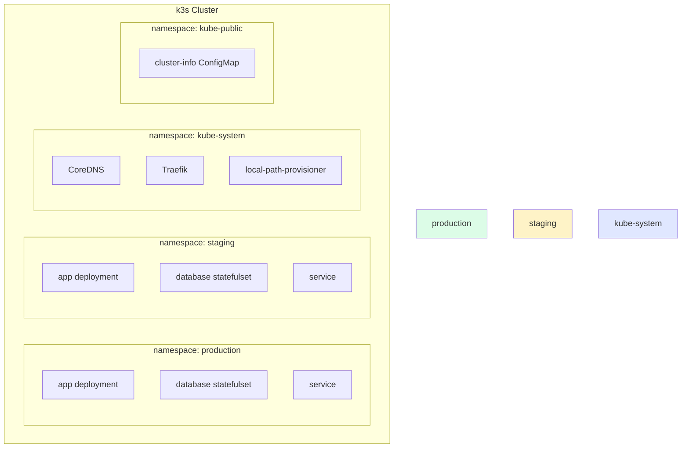
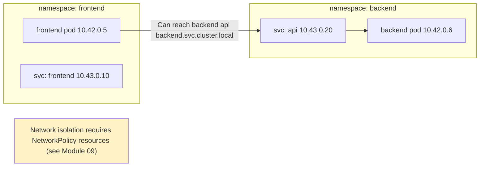
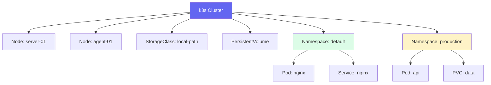
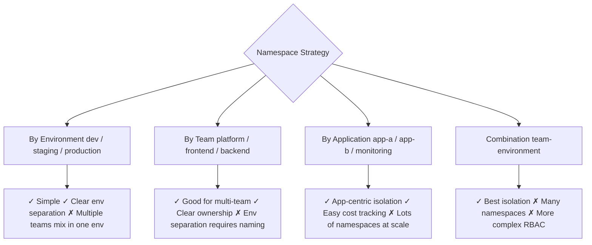

# Namespaces

> Module 03 · Lesson 02 | [↑ Course Index](../README.md)

## Table of Contents

- [What Are Namespaces?](#what-are-namespaces)
- [Default Namespaces in k3s](#default-namespaces-in-k3s)
- [Creating Namespaces](#creating-namespaces)
- [Working with Namespaces](#working-with-namespaces)
- [Resource Isolation with Namespaces](#resource-isolation-with-namespaces)
- [Cross-Namespace Communication](#cross-namespace-communication)
- [Namespace-Scoped vs Cluster-Scoped Resources](#namespace-scoped-vs-cluster-scoped-resources)
- [Namespace Best Practices](#namespace-best-practices)
- [Common Pitfalls](#common-pitfalls)
- [Further Reading](#further-reading)

---

## What Are Namespaces?

Namespaces are virtual clusters within a physical Kubernetes cluster. They provide a mechanism for:

- **Isolation** — separate teams or environments without separate clusters
- **Resource scoping** — names only need to be unique within a namespace
- **Access control** — RBAC policies are namespace-scoped
- **Resource quotas** — limit CPU/memory per namespace



> **Analogy:** Namespaces are like floors in an office building. Each floor (namespace) has its own rooms (resources). People on different floors can co-exist in the building (cluster) without seeing each other's rooms.

[↑ Back to TOC](#table-of-contents) · [↑ Course Index](../README.md)

---

## Default Namespaces in k3s

k3s creates these namespaces automatically:

| Namespace | Purpose |
|-----------|---------|
| `default` | Where resources go if you don't specify a namespace |
| `kube-system` | Kubernetes system components (CoreDNS, Traefik, kube-proxy, etc.) |
| `kube-public` | Publicly readable resources (cluster-info ConfigMap) |
| `kube-node-lease` | Node heartbeat lease objects (do not modify) |

```bash
# View all namespaces
kubectl get namespaces
# or shorthand:
kubectl get ns

# Output:
# NAME              STATUS   AGE
# default           Active   1d
# kube-node-lease   Active   1d
# kube-public       Active   1d
# kube-system       Active   1d
```

[↑ Back to TOC](#table-of-contents) · [↑ Course Index](../README.md)

---

## Creating Namespaces

```bash
# Imperative
kubectl create namespace development
kubectl create namespace staging
kubectl create namespace production

# Declarative (preferred for production — track in git)
kubectl apply -f - <<'EOF'
apiVersion: v1
kind: Namespace
metadata:
  name: production
  labels:
    environment: production
    team: platform
  annotations:
    contact: platform-team@example.com
EOF
```

### Namespace YAML template

```yaml
apiVersion: v1
kind: Namespace
metadata:
  name: my-app
  labels:
    # Labels are used for NetworkPolicy selectors and RBAC
    environment: production
    app.kubernetes.io/managed-by: "platform-team"
  annotations:
    # Annotations for documentation/tooling
    description: "Production namespace for my-app"
    contact: "team@example.com"
```

[↑ Back to TOC](#table-of-contents) · [↑ Course Index](../README.md)

---

## Working with Namespaces

```bash
# Specify namespace with -n flag
kubectl get pods -n production
kubectl apply -f deployment.yaml -n production
kubectl delete pod my-pod -n staging

# View resources across all namespaces
kubectl get pods --all-namespaces
kubectl get pods -A   # shorthand

# Set default namespace for current kubectl context
kubectl config set-context --current --namespace=production

# Now all commands default to 'production'
kubectl get pods     # shows production pods

# Switch back to default
kubectl config set-context --current --namespace=default

# Delete a namespace (WARNING: deletes all resources inside)
kubectl delete namespace staging
```

[↑ Back to TOC](#table-of-contents) · [↑ Course Index](../README.md)

---

## Resource Isolation with Namespaces

Resources in different namespaces are isolated by name but **not by network by default**:



- **Name isolation:** A `service` named `api` can exist in both `frontend` and `backend` namespaces independently
- **Network:** Pods in any namespace can reach pods in any other namespace by default (use NetworkPolicy to restrict)
- **RBAC:** Users can be granted access to specific namespaces only

[↑ Back to TOC](#table-of-contents) · [↑ Course Index](../README.md)

---

## Cross-Namespace Communication

Services in other namespaces are reachable via their full DNS name:

```
Format: <service-name>.<namespace>.svc.cluster.local

Examples:
  api.backend.svc.cluster.local         # 'api' service in 'backend' namespace
  postgres.database.svc.cluster.local   # 'postgres' in 'database' namespace
  my-svc.default.svc.cluster.local      # 'my-svc' in 'default' namespace
```

```bash
# Test cross-namespace DNS from a pod
kubectl run -it --rm debug --image=busybox --restart=Never -- sh

# Inside the pod:
nslookup api.backend.svc.cluster.local
wget -qO- http://api.backend.svc.cluster.local/health

# Short form works within same namespace:
wget -qO- http://api/health

# Short form with namespace:
wget -qO- http://api.backend/health
```

[↑ Back to TOC](#table-of-contents) · [↑ Course Index](../README.md)

---

## Namespace-Scoped vs Cluster-Scoped Resources

Some Kubernetes resources belong to a namespace; others are cluster-wide:

```bash
# See all API resources and their scope
kubectl api-resources --namespaced=true   # namespace-scoped
kubectl api-resources --namespaced=false  # cluster-scoped
```

| Namespace-Scoped | Cluster-Scoped |
|-----------------|----------------|
| Pod | Node |
| Deployment | PersistentVolume |
| Service | StorageClass |
| ConfigMap | ClusterRole |
| Secret | ClusterRoleBinding |
| PersistentVolumeClaim | Namespace itself |
| ServiceAccount | CustomResourceDefinition |
| Ingress | IngressClass |
| NetworkPolicy | — |



[↑ Back to TOC](#table-of-contents) · [↑ Course Index](../README.md)

---

## Namespace Best Practices



**Recommended patterns:**

```bash
# Small team or single app
kubectl create namespace development
kubectl create namespace staging
kubectl create namespace production

# Multi-team
kubectl create namespace team-alpha-prod
kubectl create namespace team-alpha-staging
kubectl create namespace team-beta-prod

# Always label your namespaces
kubectl label namespace production \
  environment=production \
  pod-security.kubernetes.io/enforce=restricted
```

**Rules of thumb:**
- Never put application workloads in `kube-system` or `default`
- Label namespaces with `environment` and `team` for RBAC and NetworkPolicy selectors
- Use resource quotas on every production namespace (Module 14)
- Apply Pod Security Standards labels at namespace level (Module 09)

[↑ Back to TOC](#table-of-contents) · [↑ Course Index](../README.md)

---

## Common Pitfalls

| Pitfall | Detail |
|---------|--------|
| Deploying to `default` namespace | Everything piles into `default`; use named namespaces for real workloads |
| Forgetting `-n` flag | `kubectl get pods` shows `default` — add `-n production` for your real pods |
| Assuming network isolation | Without NetworkPolicy, pods in all namespaces can talk to each other |
| Deleting namespace with important data | `kubectl delete namespace` deletes PVCs (and possibly data) — check first |
| Namespace stuck `Terminating` | Usually caused by finalizers; check `kubectl describe namespace <name>` for stuck resources |

```bash
# Fix stuck namespace (remove finalizers)
kubectl patch namespace stuck-ns \
  -p '{"spec":{"finalizers":[]}}' \
  --type=merge
```

[↑ Back to TOC](#table-of-contents) · [↑ Course Index](../README.md)

---

## Further Reading

- [Kubernetes Namespaces Docs](https://kubernetes.io/docs/concepts/overview/working-with-objects/namespaces/)
- [DNS for Services and Pods](https://kubernetes.io/docs/concepts/services-networking/dns-pod-service/)

[↑ Back to TOC](#table-of-contents) · [↑ Course Index](../README.md)

---

*Licensed under [CC BY-NC-SA 4.0](../LICENSE.md) · © 2026 UncleJS*
