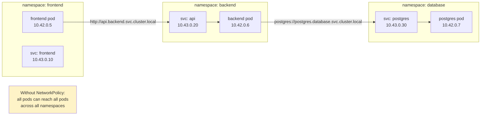
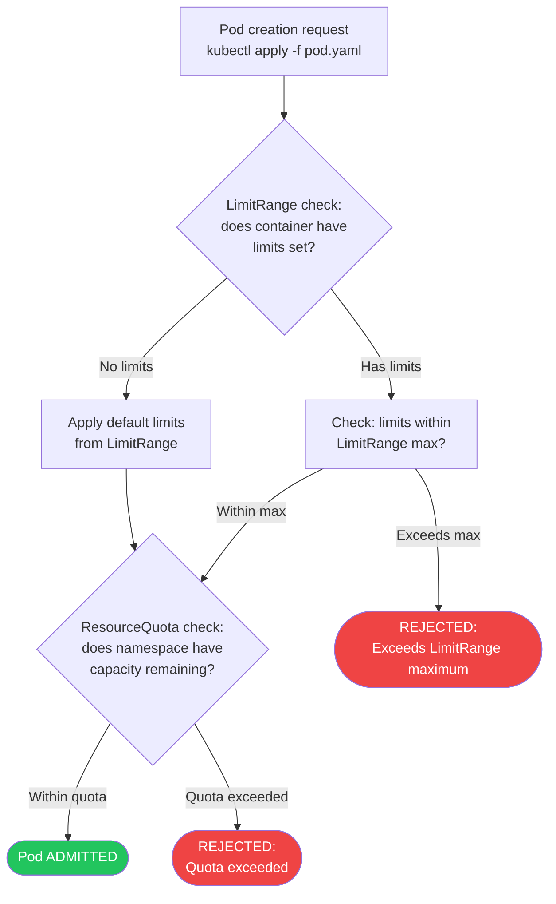
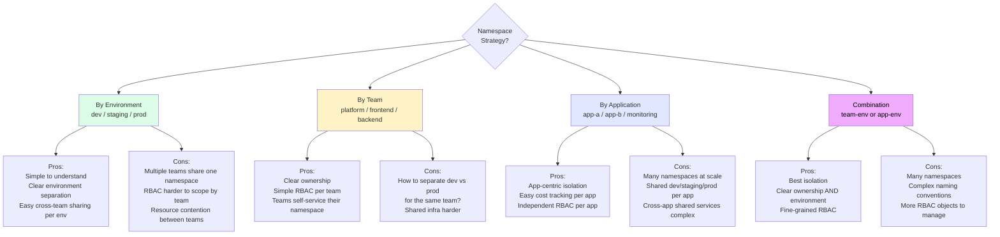

# Namespaces

> Module 03 · Lesson 02 | [↑ Course Index](../README.md)

[](../README.md)
[](../LICENSE.md)

## Table of Contents

- [What Are Namespaces?](#what-are-namespaces)
- [Namespace-Scoped vs Cluster-Scoped Resources](#namespace-scoped-vs-cluster-scoped-resources)
- [Default Namespaces in k3s](#default-namespaces-in-k3s)
- [Creating Namespaces](#creating-namespaces)
- [Working with Namespaces](#working-with-namespaces)
- [Resource Isolation with Namespaces](#resource-isolation-with-namespaces)
- [Cross-Namespace Communication](#cross-namespace-communication)
- [Namespace Quotas and LimitRanges](#namespace-quotas-and-limitranges)
- [Namespace-Based Multi-Tenancy Patterns](#namespace-based-multi-tenancy-patterns)
- [Namespace Best Practices](#namespace-best-practices)
- [Common Pitfalls](#common-pitfalls)
- [Further Reading](#further-reading)

---

## What Are Namespaces?

Namespaces are virtual clusters within a physical Kubernetes cluster. They provide a mechanism for:

- **Isolation** — separate teams or environments without separate clusters
- **Resource scoping** — names only need to be unique within a namespace
- **Access control** — RBAC policies are namespace-scoped
- **Resource quotas** — limit CPU/memory per namespace

```mermaid
graph TB
    subgraph "k3s Cluster"
        N1["Node: server-01"]
        N2["Node: agent-01"]
        PV["PersistentVolume"]
        SC["StorageClass: local-path"]
        CR["ClusterRole"]

        subgraph "namespace: dev"
            D_APP["app-v2 Deployment"]
            D_DB["postgres StatefulSet"]
            D_SVC["Service: api"]
            D_CM["ConfigMap: app-config"]
        end
        subgraph "namespace: staging"
            S_APP["app-v1 Deployment"]
            S_DB["postgres StatefulSet"]
            S_SVC["Service: api"]
            S_CM["ConfigMap: app-config"]
        end
        subgraph "namespace: prod"
            P_APP["app-v1 Deployment"]
            P_DB["postgres StatefulSet"]
            P_SVC["Service: api"]
            P_PVC["PVC: db-data"]
        end
        subgraph "namespace: kube-system"
            CORE["CoreDNS"]
            TR["Traefik"]
            LP["local-path-provisioner"]
        end
    end
    PV --> P_PVC
    style dev fill:#dcfce7
    style staging fill:#fef3c7
    style prod fill:#fee2e2
    style "kube-system" fill:#e0e7ff
```

The key insight: **resources with the same name can coexist in different namespaces**. A `ConfigMap` named `app-config` can exist independently in `dev`, `staging`, and `prod` with different values. A `Deployment` named `api` in `dev` is completely separate from `api` in `prod`. This is what makes namespace-based isolation practical.

> **Analogy:** Namespaces are like floors in an office building. Each floor (namespace) has its own rooms (resources). People on different floors can co-exist in the building (cluster) without seeing each other's rooms. The building's structural elements (elevators, power, plumbing) are shared — these are cluster-scoped resources.

[↑ Back to TOC](#table-of-contents) · [↑ Course Index](../README.md)

---

## Namespace-Scoped vs Cluster-Scoped Resources

This is one of the most important distinctions in Kubernetes. Some resources belong to a namespace and some are cluster-wide.

```mermaid
graph TB
    CLUSTER["k3s Cluster (cluster-scoped resources live here)"]
    CLUSTER --> N1["Node: server-01"]
    CLUSTER --> N2["Node: agent-01"]
    CLUSTER --> PV["PersistentVolume: pv-data"]
    CLUSTER --> SC["StorageClass: local-path"]
    CLUSTER --> CRD["CustomResourceDefinition"]
    CLUSTER --> CR["ClusterRole: cluster-admin"]
    CLUSTER --> CRB["ClusterRoleBinding"]
    CLUSTER --> IC["IngressClass: traefik"]

    CLUSTER --> NS1["Namespace: default"]
    CLUSTER --> NS2["Namespace: production"]
    CLUSTER --> NS3["Namespace: monitoring"]

    NS1 --> POD1["Pod: nginx"]
    NS1 --> SVC1["Service: nginx"]
    NS1 --> SA1["ServiceAccount: default"]

    NS2 --> DEP2["Deployment: api"]
    NS2 --> PVC2["PVC: db-data"]
    NS2 --> ING2["Ingress: api-tls"]
    NS2 --> SEC2["Secret: db-password"]

    NS3 --> DEP3["Deployment: prometheus"]
    NS3 --> CM3["ConfigMap: prometheus-config"]
    NS3 --> NP3["NetworkPolicy: allow-scrape"]

    style CLUSTER fill:#6366f1,color:#fff
    style NS1 fill:#dcfce7
    style NS2 fill:#fef3c7
    style NS3 fill:#e0e7ff
```



### Comprehensive Resource Scope Table

| Namespace-Scoped | Cluster-Scoped |
|-----------------|----------------|
| Pod | Node |
| Deployment | PersistentVolume |
| StatefulSet | StorageClass |
| DaemonSet | Namespace |
| ReplicaSet | ClusterRole |
| Job / CronJob | ClusterRoleBinding |
| Service | CustomResourceDefinition (CRD) |
| ConfigMap | IngressClass |
| Secret | PodSecurityPolicy (deprecated) |
| PersistentVolumeClaim | ValidatingWebhookConfiguration |
| ServiceAccount | MutatingWebhookConfiguration |
| Ingress | APIService |
| NetworkPolicy | PriorityClass |
| Role | RuntimeClass |
| RoleBinding | CSIDriver |
| ResourceQuota | CSINode |
| LimitRange | VolumeAttachment |
| HorizontalPodAutoscaler | FlowSchema |
| PodDisruptionBudget | — |
| Endpoints / EndpointSlice | — |

```bash
# Check scope for any resource type
kubectl api-resources --namespaced=true    # namespace-scoped
kubectl api-resources --namespaced=false   # cluster-scoped

# Check scope for a specific resource
kubectl api-resources | grep pod
# pods   po   v1   true   Pod   (true = namespaced)

kubectl api-resources | grep node
# nodes  no   v1   false  Node  (false = cluster-scoped)
```

### Practical Implication

When you apply a RBAC Role (namespace-scoped), it only grants permissions within one namespace. When you need to grant permissions across all namespaces or for cluster-scoped resources, you need a ClusterRole. This is why `kubectl get pods` without `-n` only shows pods in the default namespace — namespace-scoped resources always require a namespace context.

[↑ Back to TOC](#table-of-contents) · [↑ Course Index](../README.md)

---

## Default Namespaces in k3s

k3s creates these namespaces automatically:

| Namespace | Purpose |
|-----------|---------|
| `default` | Where resources go if you don't specify a namespace |
| `kube-system` | Kubernetes system components (CoreDNS, Traefik, kube-proxy, etc.) |
| `kube-public` | Publicly readable resources (cluster-info ConfigMap) |
| `kube-node-lease` | Node heartbeat lease objects (do not modify) |

```bash
# View all namespaces
kubectl get namespaces
# or shorthand:
kubectl get ns

# Output:
# NAME              STATUS   AGE
# default           Active   1d
# kube-node-lease   Active   1d
# kube-public       Active   1d
# kube-system       Active   1d
```

### What Lives in Each Default Namespace

**`kube-system`** — All of k3s's built-in components run here:

```bash
kubectl get pods -n kube-system
# coredns-*               DNS for cluster services
# traefik-*               Ingress controller
# svclb-traefik-*         Klipper LoadBalancer DaemonSet
# local-path-provisioner  PVC provisioner
# metrics-server-*        Resource metrics API
# helm-install-traefik-*  One-shot Helm install Job (Completed)
```

**`kube-public`** — Contains exactly one ConfigMap: `cluster-info`. This ConfigMap is readable by unauthenticated users and provides basic cluster discovery information (API server URL, cluster CA certificate). This is how tools like `kubeadm join` discover the cluster.

```bash
kubectl get configmap -n kube-public cluster-info -o yaml
```

**`kube-node-lease`** — Contains one Lease object per node. The kubelet on each node updates its Lease object every 10 seconds (by default). The controller manager uses these leases to determine node health, replacing the older heartbeat mechanism that stored heartbeat data in Node objects. This reduces API server load in large clusters.

```bash
kubectl get leases -n kube-node-lease
# NAME         HOLDER       AGE
# server-01    server-01    2d
```

**`default`** — The fallback namespace. Resources without an explicit namespace go here. Best practice: never put production workloads in `default`. Use it only for quick experiments that you will clean up immediately.

[↑ Back to TOC](#table-of-contents) · [↑ Course Index](../README.md)

---

## Creating Namespaces

```bash
# Imperative
kubectl create namespace development
kubectl create namespace staging
kubectl create namespace production

# Declarative (preferred for production — track in git)
kubectl apply -f - <<'EOF'
apiVersion: v1
kind: Namespace
metadata:
  name: production
  labels:
    environment: production
    team: platform
  annotations:
    contact: platform-team@example.com
EOF
```

### Namespace YAML template

```yaml
apiVersion: v1
kind: Namespace
metadata:
  name: my-app
  labels:
    # Labels are used for NetworkPolicy selectors and RBAC
    environment: production
    team: backend
    app.kubernetes.io/managed-by: "platform-team"
    # Pod Security Standards enforcement (Kubernetes 1.23+)
    pod-security.kubernetes.io/enforce: restricted
    pod-security.kubernetes.io/enforce-version: latest
    pod-security.kubernetes.io/warn: restricted
    pod-security.kubernetes.io/audit: restricted
  annotations:
    # Annotations for documentation/tooling
    description: "Production namespace for my-app"
    contact: "backend-team@example.com"
    cost-center: "CC-1234"
```

### Namespace Labels for Pod Security Standards

Kubernetes 1.23+ introduced Pod Security Admission (PSA), which uses namespace labels to enforce security policies:

```bash
# Apply restricted security standards to a namespace
kubectl label namespace production \
  pod-security.kubernetes.io/enforce=restricted \
  pod-security.kubernetes.io/enforce-version=latest

# Apply baseline standards (more permissive)
kubectl label namespace staging \
  pod-security.kubernetes.io/enforce=baseline

# Audit-only mode (logs violations without blocking)
kubectl label namespace development \
  pod-security.kubernetes.io/audit=restricted \
  pod-security.kubernetes.io/warn=restricted
```

[↑ Back to TOC](#table-of-contents) · [↑ Course Index](../README.md)

---

## Working with Namespaces

```bash
# Specify namespace with -n flag
kubectl get pods -n production
kubectl apply -f deployment.yaml -n production
kubectl delete pod my-pod -n staging

# View resources across all namespaces
kubectl get pods --all-namespaces
kubectl get pods -A   # shorthand

# Set default namespace for current kubectl context
kubectl config set-context --current --namespace=production

# Now all commands default to 'production'
kubectl get pods     # shows production pods

# Switch back to default
kubectl config set-context --current --namespace=default

# Delete a namespace (WARNING: deletes all resources inside)
kubectl delete namespace staging
```

### kubens — Namespace Switcher

The `kubens` tool (part of `kubectx`) makes namespace switching fast:

```bash
# Install kubens
# https://github.com/ahmetb/kubectx

# List all namespaces (current marked with *)
kubens

# Switch to production namespace
kubens production

# Switch back to previous namespace
kubens -
```

[↑ Back to TOC](#table-of-contents) · [↑ Course Index](../README.md)

---

## Resource Isolation with Namespaces

Resources in different namespaces are isolated by name but **not by network by default**:



**What namespace isolation provides:**
- **Name isolation:** A `Service` named `api` can exist independently in `frontend`, `backend`, and `database` namespaces
- **RBAC scope:** RBAC Roles and RoleBindings are namespace-scoped; a developer with access to `dev` cannot see `prod`
- **ResourceQuota scope:** Quotas apply per-namespace, limiting what each team can consume
- **NetworkPolicy scope:** NetworkPolicies are namespace-scoped

**What namespace isolation does NOT provide:**
- **Network isolation:** By default, pods in any namespace can reach pods in any other namespace. You must apply NetworkPolicy to restrict this.
- **Security isolation:** A pod with `hostNetwork: true` or a privileged container can escape namespace boundaries at the OS level
- **Storage isolation:** PersistentVolumes are cluster-scoped; a PVC in `production` can bind to a PV that was provisioned for a deleted `staging` PVC

[↑ Back to TOC](#table-of-contents) · [↑ Course Index](../README.md)

---

## Cross-Namespace Communication

Services in other namespaces are reachable via their full DNS name:

```
Format: <service-name>.<namespace>.svc.cluster.local

Examples:
  api.backend.svc.cluster.local         # 'api' service in 'backend' namespace
  postgres.database.svc.cluster.local   # 'postgres' in 'database' namespace
  my-svc.default.svc.cluster.local      # 'my-svc' in 'default' namespace
```

```bash
# Test cross-namespace DNS from a pod
kubectl run -it --rm debug --image=busybox --restart=Never -- sh

# Inside the pod:
nslookup api.backend.svc.cluster.local
wget -qO- http://api.backend.svc.cluster.local/health

# Short form works within same namespace:
wget -qO- http://api/health

# Short form with namespace:
wget -qO- http://api.backend/health
```

### DNS Search Domains

CoreDNS configures each pod's DNS search path to include:
1. `<pod-namespace>.svc.cluster.local`
2. `svc.cluster.local`
3. `cluster.local`
4. The host's search domains

This means within `frontend` namespace, `api` resolves as `api.frontend.svc.cluster.local`. To reach `api` in `backend`, you must use at least `api.backend`.

[↑ Back to TOC](#table-of-contents) · [↑ Course Index](../README.md)

---

## Namespace Quotas and LimitRanges

ResourceQuotas and LimitRanges are the primary tools for constraining resource consumption per namespace.

### ResourceQuota

A `ResourceQuota` limits the total resources that can be consumed within a namespace:

```yaml
apiVersion: v1
kind: ResourceQuota
metadata:
  name: production-quota
  namespace: production
spec:
  hard:
    # Compute resources
    requests.cpu: "4"          # Total CPU requests in this namespace
    requests.memory: 8Gi       # Total memory requests
    limits.cpu: "8"            # Total CPU limits
    limits.memory: 16Gi        # Total memory limits

    # Object counts
    pods: "50"                 # Max pods
    services: "20"             # Max services
    secrets: "50"              # Max secrets
    configmaps: "50"           # Max configmaps
    persistentvolumeclaims: "20"  # Max PVCs

    # Storage
    requests.storage: 100Gi   # Total storage across all PVCs

    # Service types (restrict expensive types)
    services.loadbalancers: "2"
    services.nodeports: "5"
```

```bash
# Apply quota to a namespace
kubectl apply -f quota.yaml

# Check quota usage
kubectl describe resourcequota production-quota -n production
# Name:                    production-quota
# Namespace:               production
# Resource                 Used  Hard
# --------                 ----  ----
# limits.cpu               2     8
# limits.memory            4Gi   16Gi
# pods                     5     50
# requests.cpu             1     4
# requests.memory          2Gi   8Gi
```

**Important:** When a ResourceQuota is active in a namespace, **every Pod must specify resource requests and limits**. Pods without requests/limits will be rejected. This is often an unexpected side effect of adding a quota.

### LimitRange

A `LimitRange` sets default and maximum resource limits for individual containers in a namespace. This is useful when you want to ensure no single container monopolizes resources:

```yaml
apiVersion: v1
kind: LimitRange
metadata:
  name: production-limits
  namespace: production
spec:
  limits:
  - type: Container
    default:            # Applied when container has no limits set
      cpu: "500m"
      memory: "256Mi"
    defaultRequest:     # Applied when container has no requests set
      cpu: "100m"
      memory: "128Mi"
    max:                # Maximum allowed per container
      cpu: "2"
      memory: "2Gi"
    min:                # Minimum required per container
      cpu: "50m"
      memory: "64Mi"

  - type: Pod
    max:                # Maximum for all containers in a pod combined
      cpu: "4"
      memory: "4Gi"

  - type: PersistentVolumeClaim
    max:
      storage: "20Gi"   # Maximum PVC size
    min:
      storage: "1Gi"    # Minimum PVC size
```

```bash
# Check what limits are active in a namespace
kubectl describe limitrange production-limits -n production
```

### ResourceQuota + LimitRange Together

Use both together for comprehensive control:
- **LimitRange** ensures every container has sensible defaults and cannot exceed per-container maximums
- **ResourceQuota** ensures the namespace as a whole cannot exceed aggregate limits



[↑ Back to TOC](#table-of-contents) · [↑ Course Index](../README.md)

---

## Namespace-Based Multi-Tenancy Patterns

There is no single right way to organize namespaces. The best strategy depends on your team size, workload characteristics, and security requirements.



### Pattern 1: By Environment

Best for small teams or single applications with clear environment boundaries:

```bash
kubectl create namespace development
kubectl create namespace staging
kubectl create namespace production
kubectl create namespace monitoring
```

| Use | Teams share namespace per environment |
|-----|--------------------------------------|
| RBAC | Grant developers read/write in `development`, read-only in `staging`, none in `production` |
| Quotas | Higher quotas in `production`, lower in `development` |
| Tradeoff | All teams share the same production namespace — hard to restrict one team without affecting others |

### Pattern 2: By Team

Best for organizations with clear team ownership over services:

```bash
kubectl create namespace team-platform
kubectl create namespace team-frontend
kubectl create namespace team-backend
kubectl create namespace team-data
```

| Use | Each team owns their namespace across all environments |
|-----|------------------------------------------------------|
| RBAC | Each team has admin on their namespace; platform team has cluster-wide read |
| Quotas | Per-team resource budgets |
| Tradeoff | Need naming conventions or labels to separate dev/staging/prod within one namespace |

### Pattern 3: By Application (Recommended for microservices)

Best for microservices organizations where each service is independently operated:

```bash
kubectl create namespace app-auth-service
kubectl create namespace app-payment-service
kubectl create namespace app-notification-service
kubectl create namespace infra-monitoring
kubectl create namespace infra-logging
```

| Use | Each application or infrastructure component has its own namespace |
|-----|-------------------------------------------------------------------|
| RBAC | Each team has write access to their app's namespace |
| Quotas | Per-service resource budgets |
| Tradeoff | Many namespaces; cross-service shared services need careful DNS planning |

### Pattern 4: Combination (team-environment)

Best for larger organizations with multiple teams and strict environment isolation:

```bash
kubectl create namespace alpha-dev
kubectl create namespace alpha-staging
kubectl create namespace alpha-production
kubectl create namespace beta-dev
kubectl create namespace beta-staging
kubectl create namespace beta-production
kubectl create namespace platform-monitoring
kubectl create namespace platform-logging
```

| Tradeoff | Best isolation | Most operational overhead |
|---------|---------------|--------------------------|
| Namespace count | High | Manageable with tooling |
| RBAC complexity | High | Each team gets access to their 3 namespaces |
| Recommended for | Enterprise | Teams > 10, services > 20 |

### Multi-Tenancy Trade-offs Table

| Pattern | RBAC Complexity | Namespace Count | Environment Isolation | Team Isolation | Recommended When |
|---------|----------------|----------------|----------------------|----------------|-----------------|
| By Environment | Low | Low (3–5) | Strong | Weak | Small team, single app |
| By Team | Medium | Medium | Weak | Strong | Small org, multiple teams |
| By Application | Medium | High | Weak | Medium | Microservices, clear ownership |
| Combination | High | High | Strong | Strong | Enterprise, strict compliance |

[↑ Back to TOC](#table-of-contents) · [↑ Course Index](../README.md)

---

## Namespace Best Practices

**Rules of thumb:**
- Never put application workloads in `kube-system` or `default`
- Label namespaces with `environment` and `team` for RBAC and NetworkPolicy selectors
- Use resource quotas on every production namespace
- Apply Pod Security Standards labels at namespace level
- Always set a contact/owner annotation for accountability

```bash
# Small team or single app
kubectl create namespace development
kubectl create namespace staging
kubectl create namespace production

# Multi-team
kubectl create namespace team-alpha-prod
kubectl create namespace team-alpha-staging
kubectl create namespace team-beta-prod

# Always label your namespaces
kubectl label namespace production \
  environment=production \
  team=platform \
  pod-security.kubernetes.io/enforce=restricted

# Always annotate for ownership
kubectl annotate namespace production \
  description="Production workloads for the main app" \
  contact="platform-team@example.com" \
  cost-center="CC-1234"
```

**Namespace as a unit of governance:**

Think of a namespace as the smallest unit of Kubernetes governance. Everything that applies to a namespace applies to all resources within it:
- ResourceQuota constraints
- LimitRange defaults
- RBAC permissions via RoleBindings
- NetworkPolicy rules
- Pod Security Standards enforcement

This means your namespace boundary is also your team/environment/application boundary. Design your namespace structure before you start deploying workloads — changing it later requires migrating resources.

[↑ Back to TOC](#table-of-contents) · [↑ Course Index](../README.md)

---

## Common Pitfalls

| Pitfall | Detail |
|---------|--------|
| Deploying to `default` namespace | Everything piles into `default`; use named namespaces for real workloads |
| Forgetting `-n` flag | `kubectl get pods` shows `default` — add `-n production` for your real pods |
| Assuming network isolation | Without NetworkPolicy, pods in all namespaces can talk to each other |
| Deleting namespace with important data | `kubectl delete namespace` deletes PVCs (and possibly data) — check first |
| Namespace stuck `Terminating` | Usually caused by finalizers; check `kubectl describe namespace <name>` for stuck resources |
| ResourceQuota added after deployment | Existing pods without resource limits still run, but new pods will be rejected until you add limits to all pod templates |
| Not labeling namespaces | NetworkPolicy selectors using `namespaceSelector` require labels to work |
| Too many or too few namespaces | Both extremes cause problems; design the structure deliberately |

```bash
# Fix stuck namespace (remove finalizers)
kubectl patch namespace stuck-ns \
  -p '{"spec":{"finalizers":[]}}' \
  --type=merge
```

[↑ Back to TOC](#table-of-contents) · [↑ Course Index](../README.md)

---

## Further Reading

- [Kubernetes Namespaces Docs](https://kubernetes.io/docs/concepts/overview/working-with-objects/namespaces/)
- [DNS for Services and Pods](https://kubernetes.io/docs/concepts/services-networking/dns-pod-service/)
- [Resource Quotas](https://kubernetes.io/docs/concepts/policy/resource-quotas/)
- [LimitRange](https://kubernetes.io/docs/concepts/policy/limit-range/)
- [Pod Security Admission](https://kubernetes.io/docs/concepts/security/pod-security-admission/)
- [kubectx and kubens](https://github.com/ahmetb/kubectx)
- [Kubernetes Multi-Tenancy Working Group](https://github.com/kubernetes-sigs/multi-tenancy)

[↑ Back to TOC](#table-of-contents) · [↑ Course Index](../README.md)

---

*Licensed under [CC BY-NC-SA 4.0](../LICENSE.md) · © 2026 UncleJS*
