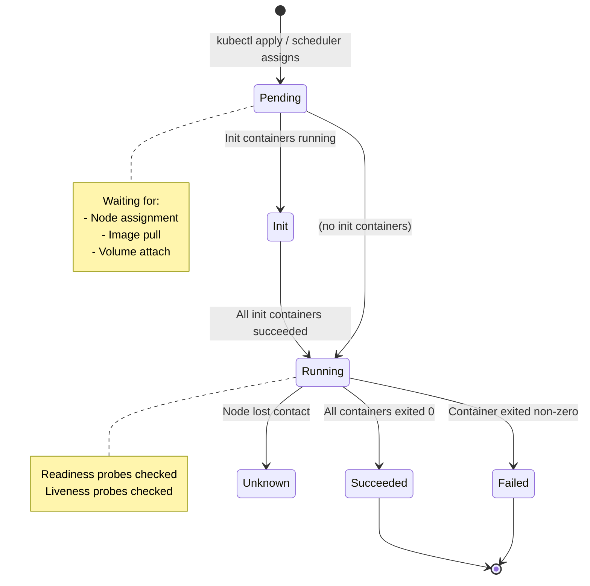
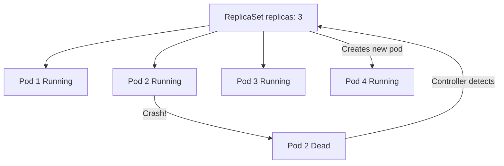
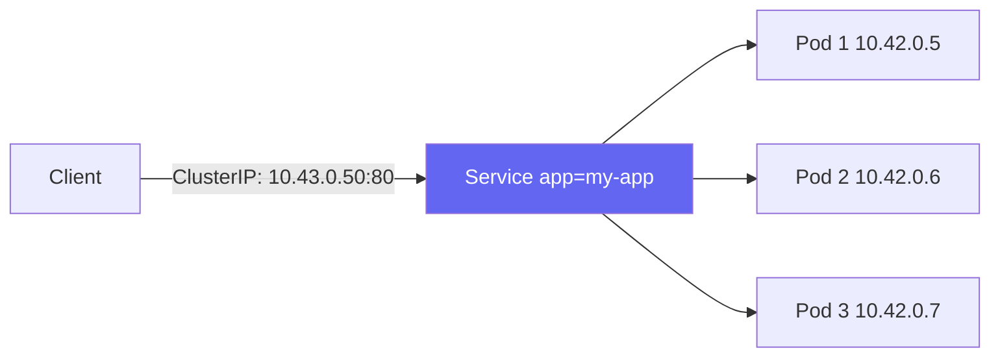
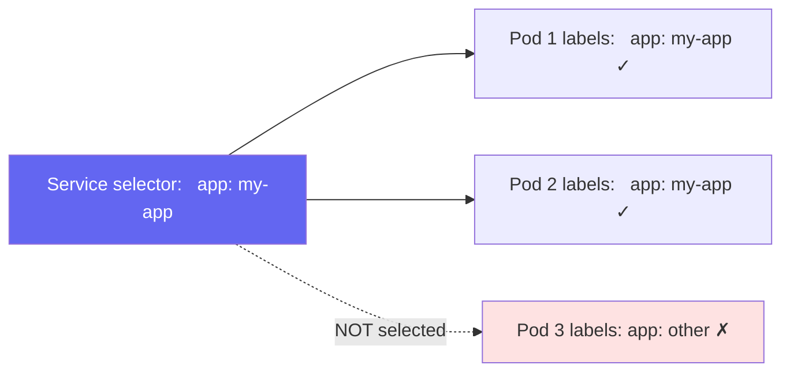
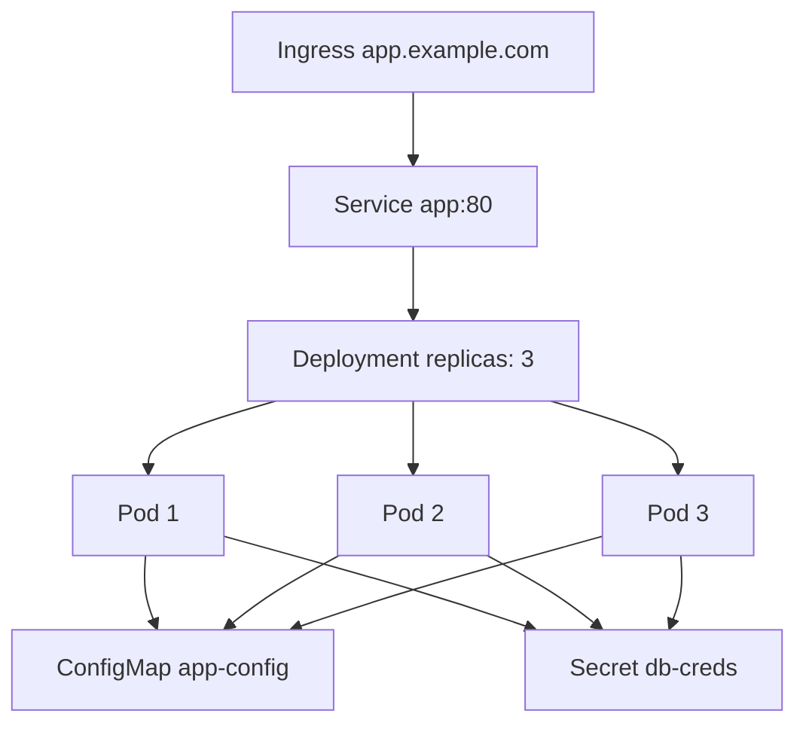

# Pods, Deployments & Services

> Module 03 · Lesson 03 | [↑ Course Index](../README.md)

## Table of Contents

- [Pods](#pods)
- [Pod Lifecycle](#pod-lifecycle)
- [ReplicaSets](#replicasets)
- [Deployments](#deployments)
- [Deployment Rollout Strategies](#deployment-rollout-strategies)
- [Services](#services)
- [Connecting Deployments to Services](#connecting-deployments-to-services)
- [ConfigMaps & Environment Variables](#configmaps--environment-variables)
- [Secrets](#secrets)
- [Full Application Example](#full-application-example)
- [Common Pitfalls](#common-pitfalls)
- [Further Reading](#further-reading)

---

## Pods

A **Pod** is the smallest deployable unit in Kubernetes. It wraps one or more containers that share:
- Network namespace (same IP address)
- Storage volumes
- Linux namespaces

```yaml
# simple-pod.yaml
apiVersion: v1
kind: Pod
metadata:
  name: my-pod
  labels:
    app: my-app
spec:
  containers:
    - name: web
      image: nginx:alpine
      ports:
        - containerPort: 80
      resources:
        requests:
          cpu: "50m"
          memory: "64Mi"
        limits:
          cpu: "200m"
          memory: "128Mi"
```

```bash
kubectl apply -f simple-pod.yaml
kubectl get pods
kubectl describe pod my-pod
kubectl delete pod my-pod
```

> **Important:** Bare pods are not self-healing. If a pod dies, it stays dead. Use Deployments.

[↑ Back to TOC](#table-of-contents) · [↑ Course Index](../README.md)

---

## Pod Lifecycle



| Phase | Meaning |
|-------|---------|
| `Pending` | Accepted by API; scheduler hasn't placed it yet, or image is pulling |
| `Running` | At least one container is running |
| `Succeeded` | All containers exited with 0 |
| `Failed` | At least one container exited non-zero |
| `Unknown` | Node lost; status cannot be determined |

```bash
# Watch pod phase changes
kubectl get pods -w

# Check detailed status
kubectl describe pod my-pod

# Check container state
kubectl get pod my-pod -o jsonpath='{.status.containerStatuses[0].state}'
```

[↑ Back to TOC](#table-of-contents) · [↑ Course Index](../README.md)

---

## ReplicaSets

A **ReplicaSet** ensures a specified number of pod replicas are running at all times. You rarely create ReplicaSets directly — Deployments manage them for you.



[↑ Back to TOC](#table-of-contents) · [↑ Course Index](../README.md)

---

## Deployments

A **Deployment** manages ReplicaSets and provides declarative updates, rollouts, and rollbacks.

```yaml
# deployment.yaml
apiVersion: apps/v1
kind: Deployment
metadata:
  name: my-app
  namespace: default
  labels:
    app: my-app
spec:
  replicas: 3
  selector:
    matchLabels:
      app: my-app          # MUST match template labels
  template:
    metadata:
      labels:
        app: my-app        # MUST match selector
    spec:
      containers:
        - name: app
          image: nginx:1.24-alpine
          ports:
            - containerPort: 80
          env:
            - name: ENVIRONMENT
              value: "production"
          resources:
            requests:
              cpu: "100m"
              memory: "128Mi"
            limits:
              cpu: "500m"
              memory: "256Mi"
          readinessProbe:
            httpGet:
              path: /
              port: 80
            initialDelaySeconds: 5
            periodSeconds: 10
          livenessProbe:
            httpGet:
              path: /
              port: 80
            initialDelaySeconds: 15
            periodSeconds: 20
```

```bash
# Apply the deployment
kubectl apply -f deployment.yaml

# Check status
kubectl get deployment my-app
kubectl rollout status deployment/my-app

# Scale
kubectl scale deployment my-app --replicas=5

# Update image
kubectl set image deployment/my-app app=nginx:1.25-alpine

# Rollback
kubectl rollout undo deployment/my-app

# View rollout history
kubectl rollout history deployment/my-app
```

[↑ Back to TOC](#table-of-contents) · [↑ Course Index](../README.md)

---

## Deployment Rollout Strategies

```mermaid
gantt
    title RollingUpdate Strategy (default)
    dateFormat X
    axisFormat %s

    section Old Version
    Pod 1 old :done, 0, 3
    Pod 2 old :done, 1, 4
    Pod 3 old :done, 2, 5

    section New Version
    Pod 1 new :active, 1, 4
    Pod 2 new :active, 2, 5
    Pod 3 new :active, 3, 6
```



### RollingUpdate (default)

```yaml
spec:
  strategy:
    type: RollingUpdate
    rollingUpdate:
      maxSurge: 1        # max pods above desired count during update
      maxUnavailable: 0  # max pods below desired count during update
```

### Recreate

```yaml
spec:
  strategy:
    type: Recreate   # Terminate ALL old pods, then start all new pods
```

| Strategy | Downtime | Use case |
|----------|---------|---------|
| `RollingUpdate` | None (default) | Stateless apps, most workloads |
| `Recreate` | Yes | Apps that can't run two versions simultaneously |

[↑ Back to TOC](#table-of-contents) · [↑ Course Index](../README.md)

---

## Services

A **Service** provides a stable IP and DNS name for a set of pods. Pods come and go, but the Service IP stays constant.



### Service types

| Type | Exposure | Use case |
|------|---------|---------|
| `ClusterIP` | Internal only | Service-to-service communication |
| `NodePort` | Node IP + random port (30000-32767) | Direct access, dev/testing |
| `LoadBalancer` | External IP (via Klipper on k3s) | Production external access |
| `ExternalName` | DNS CNAME to external host | Point to external services |

```yaml
# clusterip-service.yaml
apiVersion: v1
kind: Service
metadata:
  name: my-app
spec:
  selector:
    app: my-app          # selects pods with this label
  ports:
    - protocol: TCP
      port: 80           # Service port
      targetPort: 80     # Container port
  type: ClusterIP        # default

---
# nodeport-service.yaml
apiVersion: v1
kind: Service
metadata:
  name: my-app-nodeport
spec:
  selector:
    app: my-app
  ports:
    - protocol: TCP
      port: 80
      targetPort: 80
      nodePort: 30080    # optional: fixed node port (30000-32767)
  type: NodePort

---
# loadbalancer-service.yaml
apiVersion: v1
kind: Service
metadata:
  name: my-app-lb
spec:
  selector:
    app: my-app
  ports:
    - protocol: TCP
      port: 80
      targetPort: 80
  type: LoadBalancer
```

[↑ Back to TOC](#table-of-contents) · [↑ Course Index](../README.md)

---

## Connecting Deployments to Services

The key mechanism is **label selectors**. A Service routes to all pods matching its `selector`:



```bash
# Apply deployment + service
kubectl apply -f deployment.yaml
kubectl apply -f service.yaml

# Verify endpoints (shows which pod IPs the service routes to)
kubectl get endpoints my-app

# Test from within the cluster
kubectl run -it --rm test --image=busybox --restart=Never -- \
  wget -qO- http://my-app

# Test NodePort from outside
curl http://<NODE_IP>:30080
```

[↑ Back to TOC](#table-of-contents) · [↑ Course Index](../README.md)

---

## ConfigMaps & Environment Variables

ConfigMaps store non-sensitive configuration:

```yaml
# configmap.yaml
apiVersion: v1
kind: ConfigMap
metadata:
  name: app-config
data:
  APP_ENV: "production"
  APP_PORT: "8080"
  config.yaml: |
    server:
      port: 8080
      log_level: info
```

```yaml
# Use in Deployment
spec:
  containers:
    - name: app
      image: my-app:latest
      # Method 1: individual env vars from ConfigMap
      env:
        - name: APP_ENV
          valueFrom:
            configMapKeyRef:
              name: app-config
              key: APP_ENV
      # Method 2: all keys as env vars
      envFrom:
        - configMapRef:
            name: app-config
      # Method 3: mount as file
      volumeMounts:
        - name: config-vol
          mountPath: /etc/app
  volumes:
    - name: config-vol
      configMap:
        name: app-config
```

[↑ Back to TOC](#table-of-contents) · [↑ Course Index](../README.md)

---

## Secrets

Secrets store sensitive data (passwords, tokens, TLS certs). They are base64-encoded (not encrypted by default — use sealed secrets or external secret operators for encryption):

```bash
# Create secret imperatively
kubectl create secret generic db-creds \
  --from-literal=username=admin \
  --from-literal=password='S3cr3t!'

# Create from file
kubectl create secret generic tls-cert \
  --from-file=tls.crt=./cert.pem \
  --from-file=tls.key=./key.pem

# View (base64 encoded)
kubectl get secret db-creds -o yaml

# Decode
kubectl get secret db-creds -o jsonpath='{.data.password}' | base64 -d
```

```yaml
# Use in Deployment
spec:
  containers:
    - name: app
      env:
        - name: DB_PASSWORD
          valueFrom:
            secretKeyRef:
              name: db-creds
              key: password
```

[↑ Back to TOC](#table-of-contents) · [↑ Course Index](../README.md)

---

## Full Application Example

A complete, realistic example combining all the above:



```bash
# Deploy everything from the labs/ directory
kubectl create namespace demo
kubectl apply -f labs/ -n demo

# Watch it come up
kubectl get all -n demo -w

# Access via NodePort
kubectl get svc -n demo
curl http://<NODE_IP>:<NODE_PORT>

# Clean up
kubectl delete namespace demo
```

[↑ Back to TOC](#table-of-contents) · [↑ Course Index](../README.md)

---

## Common Pitfalls

| Pitfall | Detail |
|---------|--------|
| Label selector mismatch | If Service `selector` doesn't match Pod `labels`, endpoints will be empty — `kubectl get endpoints` shows `<none>` |
| Missing `resources` | Pods without resource requests/limits may starve other pods; OOM kills happen |
| No readiness probe | Without a readiness probe, traffic is sent to pods before they are ready |
| Exposing secrets in env | Anyone who can `kubectl exec` or read logs can see env-var secrets |
| Bare pods in production | If a bare pod's node dies, the pod is gone. Use Deployments |
| Port mismatch | `containerPort` in the pod must match `targetPort` in the Service |

[↑ Back to TOC](#table-of-contents) · [↑ Course Index](../README.md)

---

## Further Reading

- [Pods Docs](https://kubernetes.io/docs/concepts/workloads/pods/)
- [Deployments Docs](https://kubernetes.io/docs/concepts/workloads/controllers/deployment/)
- [Services Docs](https://kubernetes.io/docs/concepts/services-networking/service/)
- [ConfigMaps Docs](https://kubernetes.io/docs/concepts/configuration/configmap/)

[↑ Back to TOC](#table-of-contents) · [↑ Course Index](../README.md)

---

*Licensed under [CC BY-NC-SA 4.0](../LICENSE.md) · © 2026 UncleJS*
