# Pods, Deployments & Services

> Module 03 · Lesson 03 | [↑ Course Index](../README.md)


[](../README.md)
[](../LICENSE.md)

## Table of Contents

- [Pods](#pods)
- [Pod Internals: Containers, Init Containers & Sidecars](#pod-internals-containers-init-containers--sidecars)
- [Pod Lifecycle](#pod-lifecycle)
- [Health Probes](#health-probes)
- [ReplicaSets](#replicasets)
- [Deployments](#deployments)
- [Deployment Rollout Strategies](#deployment-rollout-strategies)
- [Services](#services)
- [How kube-proxy Implements Services](#how-kube-proxy-implements-services)
- [Connecting Deployments to Services](#connecting-deployments-to-services)
- [ConfigMaps & Environment Variables](#configmaps--environment-variables)
- [Secrets](#secrets)
- [Full Application Example](#full-application-example)
- [Common Pitfalls](#common-pitfalls)
- [Lab](#lab)
- [Further Reading](#further-reading)

---

## Pods

A **Pod** is the smallest deployable unit in Kubernetes. It is not a container — it is a *wrapper* around one or more containers that share the same network namespace (one IP address), the same storage volumes, and the same Linux process namespace when configured to do so.

This sharing model enables powerful patterns: a web server container and a sidecar log-shipping container can talk to each other via `localhost`, mount the same log directory, and appear as a single unit to the cluster scheduler.

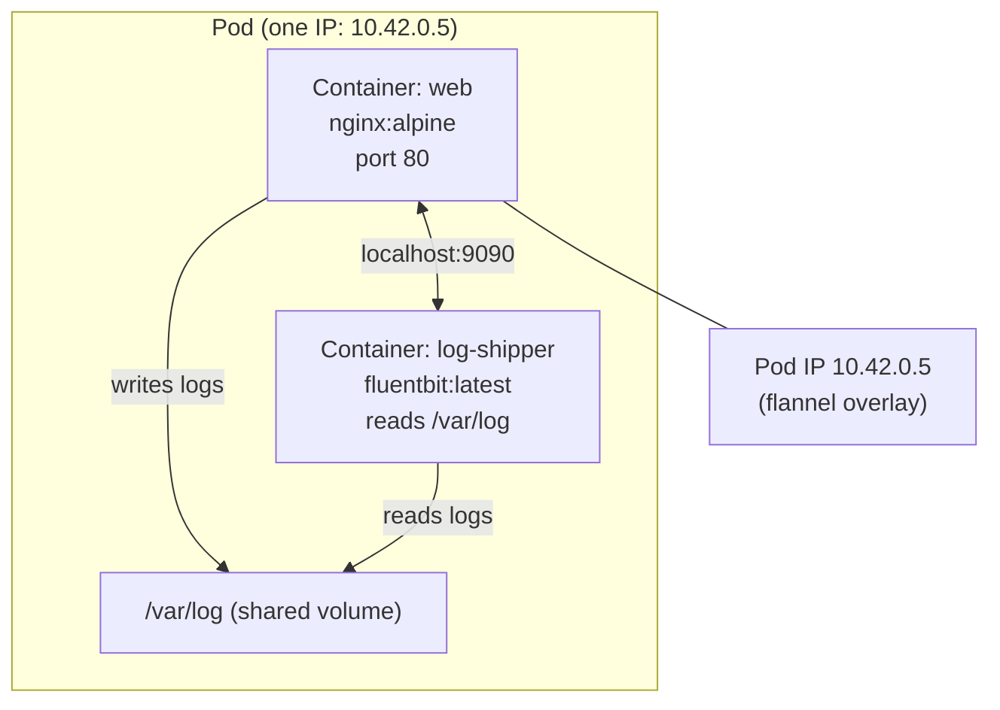

```yaml
# simple-pod.yaml
apiVersion: v1
kind: Pod
metadata:
  name: my-pod
  labels:
    app: my-app
spec:
  containers:
    - name: web
      image: nginx:alpine
      ports:
        - containerPort: 80
      resources:
        requests:
          cpu: "50m"
          memory: "64Mi"
        limits:
          cpu: "200m"
          memory: "128Mi"
```

```bash
kubectl apply -f simple-pod.yaml
kubectl get pods
kubectl describe pod my-pod
kubectl delete pod my-pod
```

> **Important:** Bare pods are not self-healing. If a bare pod dies, it stays dead. The scheduler will not restart it, the controller manager will not notice it is gone, and no new pod will be created. For any workload that must remain running, always use a **Deployment**.

[↑ Back to TOC](#table-of-contents) · [↑ Course Index](../README.md)

---

## Pod Internals: Containers, Init Containers & Sidecars

### Init containers

Init containers run **before** the main containers and must complete successfully before the Pod transitions to Running. They are useful for:

- Waiting for a database to be ready before the app starts
- Pre-populating a shared volume with configuration
- Running database migrations
- Validating external dependencies

```yaml
spec:
  initContainers:
    - name: wait-for-db
      image: busybox:latest
      command: ['sh', '-c',
        'until nc -z postgres-svc 5432; do echo waiting for db; sleep 2; done']

    - name: run-migrations
      image: my-app:latest
      command: ['/app/migrate', '--up']
      env:
        - name: DB_URL
          valueFrom:
            secretKeyRef:
              name: db-secret
              key: url

  containers:
    - name: app
      image: my-app:latest
      # Only starts after both init containers succeed
```

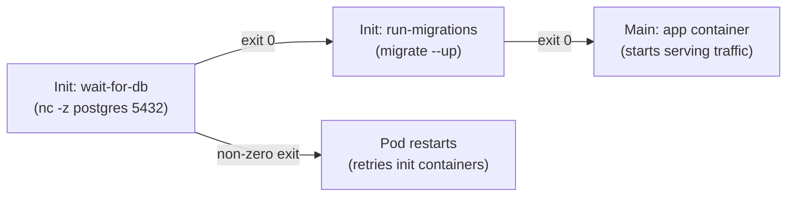

### Sidecar containers

Sidecars run alongside the main container for the entire Pod lifetime. Common patterns:

| Pattern | Example |
|---------|---------|
| Log shipping | Fluentbit reads `/var/log`, ships to Elasticsearch |
| Service mesh proxy | Istio/Linkerd Envoy proxy intercepts network traffic |
| Secret rotation | Vault agent sidecar refreshes tokens and writes to shared volume |
| Metrics exporter | JMX exporter converts Java metrics to Prometheus format |

### Lifecycle hooks

Containers support lifecycle hooks that run at specific moments:

```yaml
spec:
  containers:
    - name: app
      image: my-app:latest
      lifecycle:
        postStart:
          exec:
            command: ["/bin/sh", "-c", "echo started > /tmp/started"]
        preStop:
          exec:
            command: ["/bin/sh", "-c", "/app/graceful-shutdown.sh"]
      terminationMessagePath: /dev/termination-log
      terminationGracePeriodSeconds: 30   # at pod spec level
```

[↑ Back to TOC](#table-of-contents) · [↑ Course Index](../README.md)

---

## Pod Lifecycle

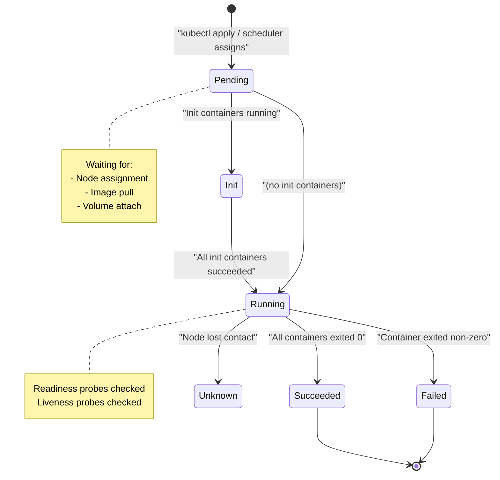

| Phase | Meaning |
|-------|---------|
| `Pending` | Accepted by API; scheduler hasn't placed it yet, or image is pulling |
| `Running` | At least one container is running |
| `Succeeded` | All containers exited with 0 |
| `Failed` | At least one container exited non-zero |
| `Unknown` | Node lost; status cannot be determined |

Within the `Running` phase, individual container states can be `Waiting`, `Running`, or `Terminated`. The pod is `Ready` only when all containers pass their readiness probes.

```bash
# Watch pod phase changes in real time
kubectl get pods -w

# Detailed status breakdown
kubectl describe pod my-pod

# Container-level state
kubectl get pod my-pod -o jsonpath='{.status.containerStatuses[0].state}'
```

[↑ Back to TOC](#table-of-contents) · [↑ Course Index](../README.md)

---

## Health Probes

Kubernetes uses three types of probes to determine container health and readiness:

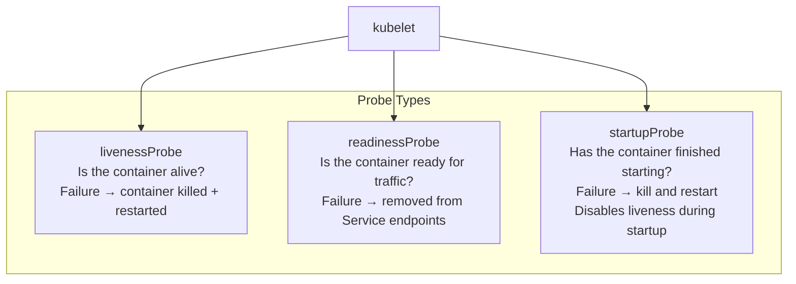

```yaml
spec:
  containers:
    - name: app
      image: my-app:latest
      # Startup probe: gives the app up to 5*60 = 300s to start
      startupProbe:
        httpGet:
          path: /healthz
          port: 8080
        failureThreshold: 30
        periodSeconds: 10

      # Liveness probe: restart if unhealthy
      livenessProbe:
        httpGet:
          path: /healthz
          port: 8080
        initialDelaySeconds: 5
        periodSeconds: 15
        failureThreshold: 3    # 3 consecutive failures → restart

      # Readiness probe: only send traffic when ready
      readinessProbe:
        httpGet:
          path: /ready
          port: 8080
        initialDelaySeconds: 5
        periodSeconds: 10
        successThreshold: 1
        failureThreshold: 3

      # Alternative probe types:
      # exec: run a command inside the container
      # livenessProbe:
      #   exec:
      #     command: ['cat', '/tmp/healthy']

      # tcpSocket: check if a port accepts connections
      # livenessProbe:
      #   tcpSocket:
      #     port: 5432
```

> **The most common mistake:** Skipping the readiness probe. Without it, Kubernetes considers a pod ready the moment the container starts — before your app has finished loading its config, connecting to the database, or warming up caches. You'll get a wave of `502` errors during every rolling update. Always add a readiness probe.

[↑ Back to TOC](#table-of-contents) · [↑ Course Index](../README.md)

---

## ReplicaSets

A **ReplicaSet** ensures a specified number of pod replicas are running at all times. It is the self-healing layer: if a pod dies, the ReplicaSet controller notices the current count has dropped below desired and creates a new pod.

You rarely create ReplicaSets directly — Deployments manage them for you. But understanding how they work helps you reason about Deployment rollouts.

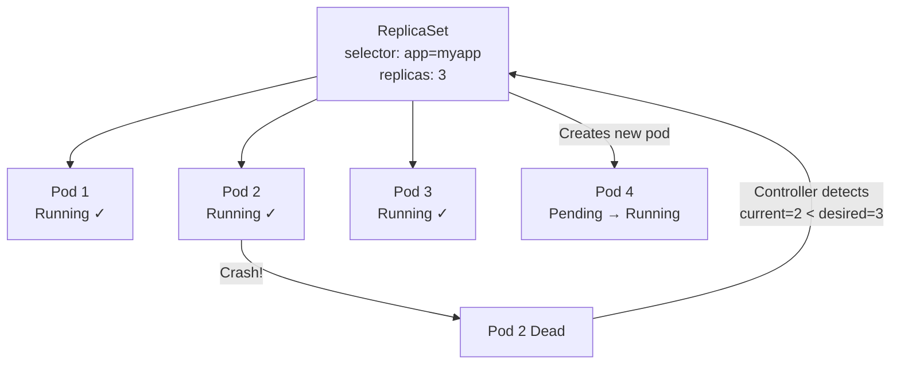

The ReplicaSet controller runs a continuous reconciliation loop:

1. **Observe**: count pods matching the label selector
2. **Compare**: compare count against `spec.replicas`
3. **Act**: create pods if below desired, delete pods if above desired
4. **Repeat**: indefinitely

[↑ Back to TOC](#table-of-contents) · [↑ Course Index](../README.md)

---

## Deployments

A **Deployment** manages ReplicaSets and adds declarative updates, rollouts, and rollbacks. When you change a Deployment's pod template (e.g., update the image), the Deployment controller creates a *new* ReplicaSet for the new version and gradually scales it up while scaling down the old one.

```yaml
# deployment.yaml
apiVersion: apps/v1
kind: Deployment
metadata:
  name: my-app
  namespace: default
  labels:
    app: my-app
spec:
  replicas: 3
  selector:
    matchLabels:
      app: my-app          # MUST match template labels — unchangeable after creation
  template:
    metadata:
      labels:
        app: my-app        # MUST match selector
    spec:
      containers:
        - name: app
          image: nginx:1.24-alpine
          ports:
            - containerPort: 80
          env:
            - name: ENVIRONMENT
              value: "production"
          resources:
            requests:
              cpu: "100m"
              memory: "128Mi"
            limits:
              cpu: "500m"
              memory: "256Mi"
          readinessProbe:
            httpGet:
              path: /
              port: 80
            initialDelaySeconds: 5
            periodSeconds: 10
          livenessProbe:
            httpGet:
              path: /
              port: 80
            initialDelaySeconds: 15
            periodSeconds: 20
```

```bash
# Apply the deployment
kubectl apply -f deployment.yaml

# Check status
kubectl get deployment my-app
kubectl rollout status deployment/my-app

# Scale
kubectl scale deployment my-app --replicas=5

# Update image (triggers rolling update)
kubectl set image deployment/my-app app=nginx:1.25-alpine

# Rollback
kubectl rollout undo deployment/my-app

# View rollout history
kubectl rollout history deployment/my-app
```

[↑ Back to TOC](#table-of-contents) · [↑ Course Index](../README.md)

---

## Deployment Rollout Strategies

```mermaid
gantt
    title "RollingUpdate Strategy (maxSurge=1, maxUnavailable=0)"
    dateFormat X
    axisFormat %ss

    section "Old Version (v1)"
    Pod 1 old :done, 0, 3
    Pod 2 old :done, 1, 4
    Pod 3 old :done, 2, 5

    section "New Version (v2)"
    Pod 1 new :active, 1, 4
    Pod 2 new :active, 2, 5
    Pod 3 new :active, 3, 6
```

### RollingUpdate (default)

The Deployment creates one new pod, waits for it to pass its readiness probe, then terminates one old pod. This continues until all old pods are replaced. Zero downtime if configured correctly.

```yaml
spec:
  strategy:
    type: RollingUpdate
    rollingUpdate:
      maxSurge: 1        # max pods above desired count during update
      maxUnavailable: 0  # max pods below desired count during update
      # maxSurge and maxUnavailable can also be percentages: "25%"
```

### Recreate

Terminates all old pods first, then starts all new pods. There will be downtime between the two phases. Use for apps that cannot run two versions simultaneously (e.g., database schema migrations that are backwards-incompatible).

```yaml
spec:
  strategy:
    type: Recreate
```

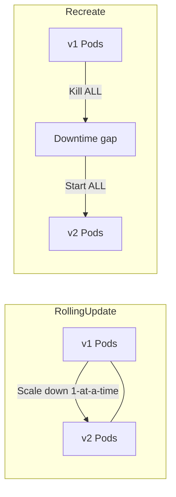

| Strategy | Downtime | Use case |
|----------|---------|---------|
| `RollingUpdate` | None (default) | Stateless apps, most workloads |
| `Recreate` | Yes | Apps that can't run two versions simultaneously |

> **War story:** A team ran a database migration that dropped a column in the new version. With `RollingUpdate`, the old pods (still running) crashed immediately because they tried to read the now-missing column. They had to roll back the Deployment and the migration. The correct approach: use feature flags to make old and new code compatible, or use `Recreate` strategy only after confirming the migration is backwards-compatible.

[↑ Back to TOC](#table-of-contents) · [↑ Course Index](../README.md)

---

## Services

A **Service** provides a stable virtual IP address and DNS name for a set of pods. Pods are ephemeral — they get new IPs every time they restart. Services abstract that away.

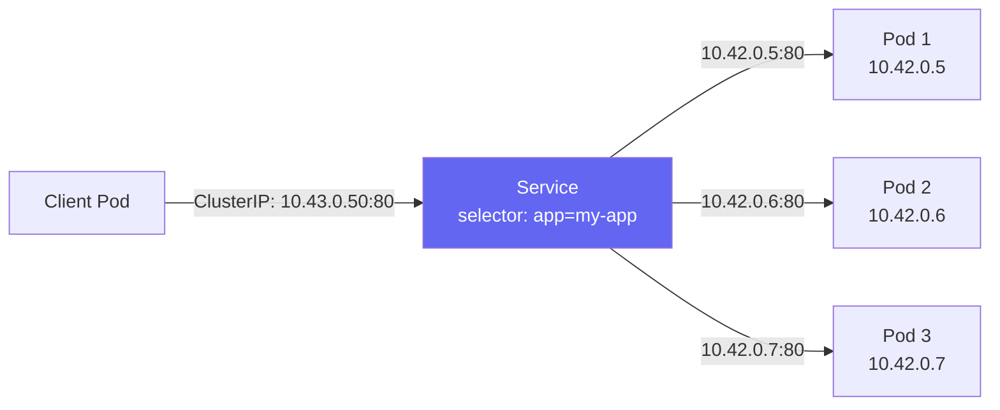

### Service types

| Type | Exposure | Use case |
|------|---------|---------|
| `ClusterIP` | Internal only | Service-to-service communication |
| `NodePort` | Node IP + random port (30000–32767) | Direct access, dev/testing |
| `LoadBalancer` | External IP (via Klipper on k3s) | Production external access |
| `ExternalName` | DNS CNAME to external host | Point to external services |

```yaml
# ClusterIP (default — internal only)
apiVersion: v1
kind: Service
metadata:
  name: my-app
spec:
  selector:
    app: my-app          # selects pods with this label
  ports:
    - protocol: TCP
      port: 80           # Service port
      targetPort: 80     # Container port
  type: ClusterIP

---
# NodePort — accessible from outside the cluster
apiVersion: v1
kind: Service
metadata:
  name: my-app-nodeport
spec:
  selector:
    app: my-app
  ports:
    - protocol: TCP
      port: 80
      targetPort: 80
      nodePort: 30080    # optional: fixed node port (30000–32767)
  type: NodePort

---
# LoadBalancer — k3s assigns external IP via Klipper
apiVersion: v1
kind: Service
metadata:
  name: my-app-lb
spec:
  selector:
    app: my-app
  ports:
    - protocol: TCP
      port: 80
      targetPort: 80
  type: LoadBalancer
```

[↑ Back to TOC](#table-of-contents) · [↑ Course Index](../README.md)

---

## How kube-proxy Implements Services

Understanding how Services actually route traffic helps you debug connectivity issues. In k3s (as in standard Kubernetes), Services are implemented via **iptables DNAT rules** managed by kube-proxy (or its k3s equivalent).

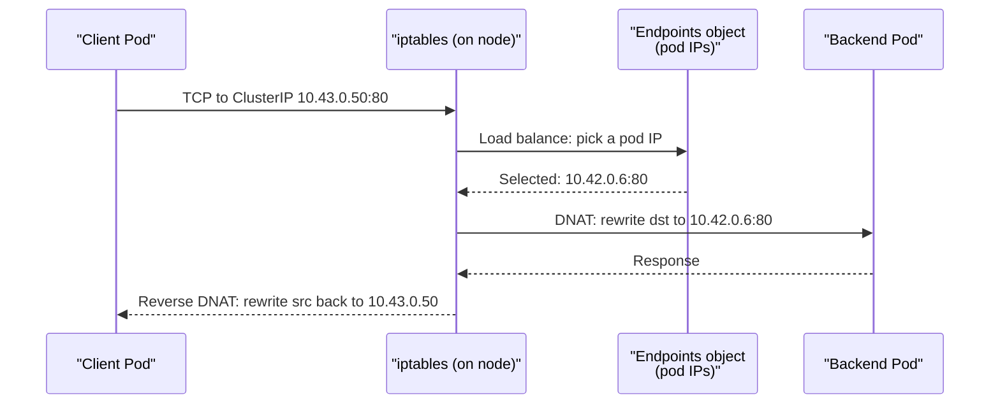

Key insight: the **ClusterIP is not a real IP address** — no device holds it. It is a virtual IP that exists only as an iptables rule. When traffic is sent to the ClusterIP, iptables rewrites the destination to one of the Endpoints pod IPs (chosen via round-robin or random selection). This happens entirely in the kernel, before the packet leaves the node.

When pods are added or removed, the Endpoints controller updates the Endpoints object, and kube-proxy watches that change and updates iptables rules accordingly.

[↑ Back to TOC](#table-of-contents) · [↑ Course Index](../README.md)

---

## Connecting Deployments to Services

The key mechanism is **label selectors**. A Service routes to all pods whose labels match the Service's `selector`. If the labels don't match, the Endpoints object will be empty and the Service routes to nothing.

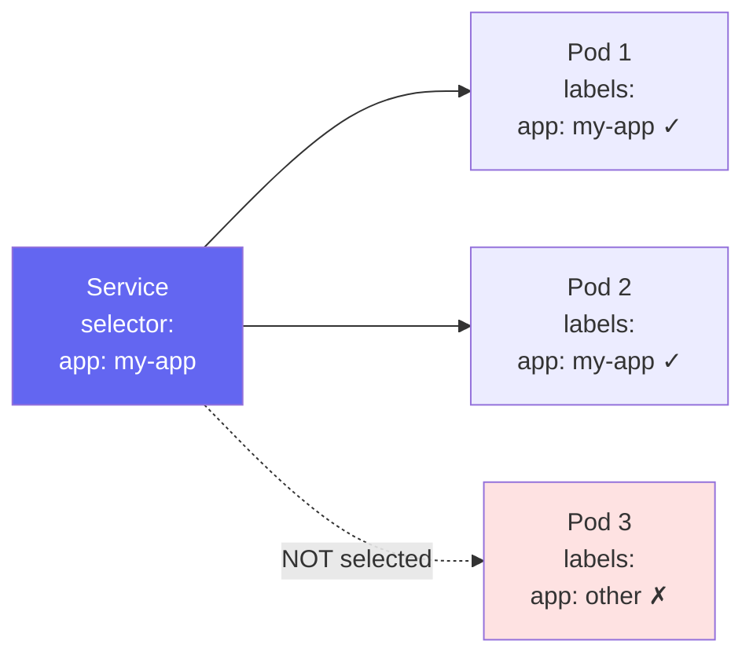

```bash
# Apply deployment + service
kubectl apply -f deployment.yaml
kubectl apply -f service.yaml

# Verify endpoints (shows which pod IPs the service routes to)
# Empty endpoints = selector mismatch!
kubectl get endpoints my-app

# Test from within the cluster
kubectl run -it --rm test --image=busybox --restart=Never -- \
  wget -qO- http://my-app

# Test NodePort from outside
curl http://<NODE_IP>:30080
```

> **Debugging endpoints:** If `kubectl get endpoints` shows `<none>` or no addresses, the selector isn't matching any pods. Compare `kubectl describe svc my-app` (shows the selector) against `kubectl get pods --show-labels` (shows the actual labels). One typo — `App: my-app` vs `app: my-app` — will break it.

[↑ Back to TOC](#table-of-contents) · [↑ Course Index](../README.md)

---

## ConfigMaps & Environment Variables

ConfigMaps store non-sensitive configuration data as key-value pairs or as file content. They are the right place for things like `LOG_LEVEL=debug`, feature flag files, and nginx configuration snippets.

```yaml
# configmap.yaml
apiVersion: v1
kind: ConfigMap
metadata:
  name: app-config
data:
  APP_ENV: "production"
  APP_PORT: "8080"
  config.yaml: |
    server:
      port: 8080
      log_level: info
    database:
      pool_size: 10
```

Three ways to consume a ConfigMap in a pod:

```yaml
spec:
  containers:
    - name: app
      image: my-app:latest

      # Method 1: Inject individual keys as env vars
      env:
        - name: APP_ENV
          valueFrom:
            configMapKeyRef:
              name: app-config
              key: APP_ENV

      # Method 2: Inject ALL keys as env vars (use with care — pollutes env)
      envFrom:
        - configMapRef:
            name: app-config

      # Method 3: Mount as a file (most flexible — can hot-reload)
      volumeMounts:
        - name: config-vol
          mountPath: /etc/app

  volumes:
    - name: config-vol
      configMap:
        name: app-config
```

> **Method 3 is the most production-ready:** Mounted ConfigMaps are updated in the pod within ~60 seconds when the ConfigMap is changed (without restarting the pod). Environment-variable-based injection requires a pod restart to pick up changes. For config files that support hot-reload (nginx, Prometheus, etc.), method 3 is strongly preferred.

[↑ Back to TOC](#table-of-contents) · [↑ Course Index](../README.md)

---

## Secrets

Secrets store sensitive data — passwords, tokens, TLS certificates, API keys. They are base64-encoded in the API and stored in etcd (or SQLite). By default, they are **not encrypted at rest** — the base64 encoding is not encryption. For production, enable etcd encryption at rest or use an external secrets operator (SealedSecrets, External Secrets Operator, or Vault).

```bash
# Create secret imperatively
kubectl create secret generic db-creds \
  --from-literal=username=admin \
  --from-literal=password='S3cr3t!'

# Create from file (common for TLS certs)
kubectl create secret generic tls-cert \
  --from-file=tls.crt=./cert.pem \
  --from-file=tls.key=./key.pem

# Create TLS secret (shorthand)
kubectl create secret tls my-tls \
  --cert=./cert.pem \
  --key=./key.pem

# View (values are base64 encoded)
kubectl get secret db-creds -o yaml

# Decode a specific value
kubectl get secret db-creds -o jsonpath='{.data.password}' | base64 -d
```

```yaml
# Use in Deployment
spec:
  containers:
    - name: app
      env:
        - name: DB_PASSWORD
          valueFrom:
            secretKeyRef:
              name: db-creds
              key: password
      # Or mount as file
      volumeMounts:
        - name: secret-vol
          mountPath: /run/secrets
          readOnly: true
  volumes:
    - name: secret-vol
      secret:
        secretName: db-creds
        defaultMode: 0400   # read-only for owner only
```

> **Security note:** Anyone who can `kubectl exec` into a pod can read environment variables. Prefer mounting secrets as files in `/run/secrets` — at least it requires knowing the file path. For genuinely sensitive workloads, use the Vault sidecar agent or External Secrets Operator to inject secrets directly without them ever appearing in Kubernetes objects.

[↑ Back to TOC](#table-of-contents) · [↑ Course Index](../README.md)

---

## Full Application Example

A complete, realistic example combining all the above:

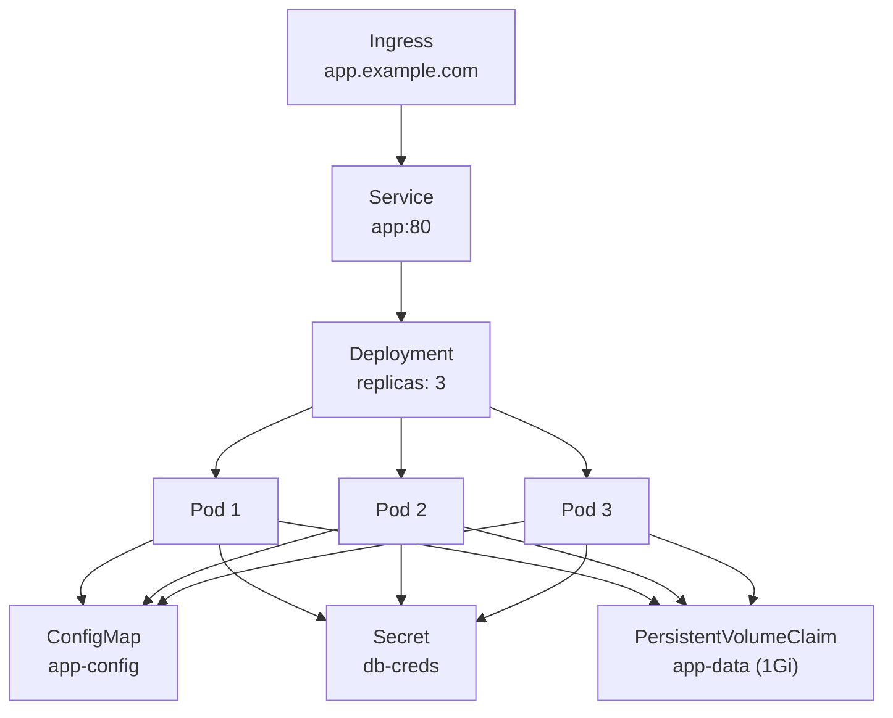

```bash
# Deploy everything from the labs/ directory
kubectl create namespace demo
kubectl apply -f labs/ -n demo

# Watch it come up
kubectl get all -n demo -w

# Access via NodePort
kubectl get svc -n demo
curl http://<NODE_IP>:<NODE_PORT>

# Clean up
kubectl delete namespace demo
```

[↑ Back to TOC](#table-of-contents) · [↑ Course Index](../README.md)

---

## Common Pitfalls

| Pitfall | Detail | Fix |
|---------|--------|-----|
| Label selector mismatch | Service `selector` doesn't match Pod `labels` → Endpoints shows `<none>` | `kubectl get endpoints` + `kubectl get pods --show-labels` |
| Missing `resources` | Pods without resource requests may starve other pods; without limits, OOM kills happen silently | Always set `resources.requests` and `resources.limits` |
| No readiness probe | Traffic sent to pods before they are ready → wave of errors during rolling updates | Add a `readinessProbe` for every long-startup service |
| Secrets in environment variables | Anyone with `exec` access can read them; they appear in logs if accidentally printed | Mount as files under `/run/secrets` or use an external secrets operator |
| Bare pods in production | If a bare pod's node dies, the pod is permanently gone | Use Deployments — always |
| Port mismatch | `containerPort` in pod ≠ `targetPort` in Service → connection refused | `containerPort` must match what the app listens on; `targetPort` in Service must match `containerPort` |
| Init container failure loop | Init container failing → pod stuck `Init:CrashLoopBackOff` | `kubectl logs my-pod -c init-container-name` |
| Missing `selector.matchLabels` | Deployment created with no selector → selects nothing | Selector and template labels must match exactly |

[↑ Back to TOC](#table-of-contents) · [↑ Course Index](../README.md)

---

## Lab

### Prerequisites

- k3s running, kubectl configured
- Module 03 Lesson 01 (kubectl basics) completed

### Exercise 1 — Pod lifecycle

```bash
# 1. Create a simple pod
kubectl run my-pod --image=nginx:alpine -n default

# 2. Watch it go through Pending → Running
kubectl get pods -w

# 3. Inspect the pod
kubectl describe pod my-pod

# 4. Access the nginx welcome page
kubectl port-forward pod/my-pod 8080:80 &
curl -s http://localhost:8080 | head -5
kill %1

# 5. Delete the pod — notice it does NOT restart
kubectl delete pod my-pod
kubectl get pods   # it's gone
```

### Exercise 2 — Deployment + rolling update

```bash
# 1. Create a deployment
kubectl create deployment web --image=nginx:1.24-alpine --replicas=3

# 2. Watch the rollout
kubectl rollout status deployment/web

# 3. Update the image
kubectl set image deployment/web web=nginx:1.25-alpine

# 4. Watch the rolling update (opens a new terminal or background it)
kubectl rollout status deployment/web -w

# 5. Check rollout history
kubectl rollout history deployment/web

# 6. Roll back
kubectl rollout undo deployment/web
kubectl rollout status deployment/web
```

### Exercise 3 — Service and endpoints

```bash
# 1. Expose the deployment
kubectl expose deployment web --port=80 --type=NodePort

# 2. Check the service and endpoints
kubectl get svc web
kubectl get endpoints web

# 3. Test connectivity via NodePort
NODE_IP=$(kubectl get node -o jsonpath='{.items[0].status.addresses[0].address}')
NODE_PORT=$(kubectl get svc web -o jsonpath='{.spec.ports[0].nodePort}')
curl -s http://$NODE_IP:$NODE_PORT | head -5

# 4. Intentionally break the selector and observe empty endpoints
kubectl patch svc web -p '{"spec":{"selector":{"app":"wrong"}}}'
kubectl get endpoints web   # shows <none>

# 5. Fix the selector
kubectl patch svc web -p '{"spec":{"selector":{"app":"web"}}}'
kubectl get endpoints web   # pods re-appear
```

### Clean up

```bash
kubectl delete deployment web
kubectl delete svc web
```

[↑ Back to TOC](#table-of-contents) · [↑ Course Index](../README.md)

---

## Further Reading

- [Pods Docs](https://kubernetes.io/docs/concepts/workloads/pods/)
- [Deployments Docs](https://kubernetes.io/docs/concepts/workloads/controllers/deployment/)
- [Services Docs](https://kubernetes.io/docs/concepts/services-networking/service/)
- [ConfigMaps Docs](https://kubernetes.io/docs/concepts/configuration/configmap/)
- [Init Containers Docs](https://kubernetes.io/docs/concepts/workloads/pods/init-containers/)

[↑ Back to TOC](#table-of-contents) · [↑ Course Index](../README.md)

---

*Licensed under [CC BY-NC-SA 4.0](../LICENSE.md) · © 2026 UncleJS*
