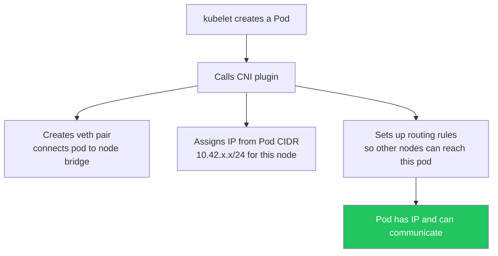
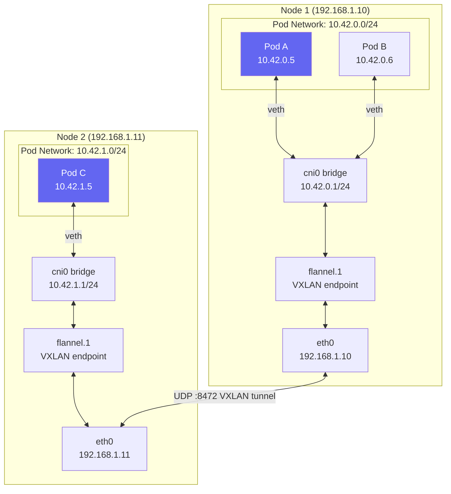
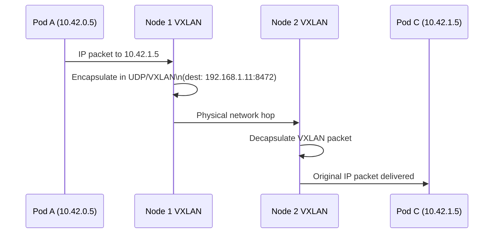

# Flannel & CNI

> Module 04 · Lesson 01 | [↑ Course Index](../README.md)

## Table of Contents

- [What is a CNI?](#what-is-a-cni)
- [Flannel in k3s](#flannel-in-k3s)
- [Pod Network Architecture](#pod-network-architecture)
- [VXLAN Backend](#vxlan-backend)
- [Flannel Backend Options](#flannel-backend-options)
- [Pod-to-Pod Communication](#pod-to-pod-communication)
- [Inspecting Flannel State](#inspecting-flannel-state)
- [Replacing Flannel with Calico](#replacing-flannel-with-calico)
- [Replacing Flannel with Cilium](#replacing-flannel-with-cilium)
- [Common Pitfalls](#common-pitfalls)
- [Further Reading](#further-reading)

---

## What is a CNI?

A **Container Network Interface (CNI)** plugin is responsible for:

1. Assigning IP addresses to pods
2. Setting up network interfaces inside pods
3. Routing traffic between pods on different nodes
4. Implementing NetworkPolicy rules (some CNIs)



k3s bundles **Flannel** as its default CNI. Flannel is simple, stable, and well-tested — ideal for the majority of k3s use cases.

[↑ Back to TOC](#table-of-contents) · [↑ Course Index](../README.md)

---

## Flannel in k3s

Flannel in k3s is embedded directly into the k3s binary — it is NOT deployed as a DaemonSet like in standard k8s. This means:

- No separate Flannel pods to manage
- Flannel starts and stops with k3s
- Flannel config lives in `/var/lib/rancher/k3s/server/manifests/`

```bash
# Verify Flannel interface is created
ip link show flannel.1
ip addr show flannel.1

# View Flannel subnet assignment
sudo cat /run/flannel/subnet.env
# FLANNEL_NETWORK=10.42.0.0/16
# FLANNEL_SUBNET=10.42.0.1/24
# FLANNEL_MTU=1450
# FLANNEL_IPMASQ=true

# View per-node subnet allocations
sudo kubectl get nodes -o jsonpath='{range .items[*]}{.metadata.name}{" "}{.spec.podCIDR}{"\n"}{end}'
```

[↑ Back to TOC](#table-of-contents) · [↑ Course Index](../README.md)

---

## Pod Network Architecture



### Key CIDRs

| CIDR | Default | Configured by |
|------|---------|--------------|
| Pod network | `10.42.0.0/16` | `--cluster-cidr` |
| Service network | `10.43.0.0/16` | `--service-cidr` |
| Per-node pod CIDR | `/24` slice of pod network | Auto-assigned by controller |

[↑ Back to TOC](#table-of-contents) · [↑ Course Index](../README.md)

---

## VXLAN Backend

VXLAN (Virtual eXtensible LAN) is the default Flannel backend in k3s. It encapsulates pod traffic in UDP packets:



**MTU consideration:** VXLAN adds ~50 bytes of overhead. k3s sets the pod MTU to 1450 (1500 - 50) automatically. If your network has non-standard MTU, adjust:

```yaml
# In k3s config or flannel-conflist
flannel-backend: vxlan
# Flannel MTU is auto-detected but can be overridden via:
# /etc/cni/net.d/10-flannel.conflist
```

[↑ Back to TOC](#table-of-contents) · [↑ Course Index](../README.md)

---

## Flannel Backend Options

Configure via `--flannel-backend` flag or config file:

| Backend | Encapsulation | Performance | Use case |
|---------|--------------|-------------|---------|
| `vxlan` | VXLAN over UDP | Good | Default; works everywhere |
| `host-gw` | Direct routing | Best | All nodes on same L2 network |
| `wireguard-native` | WireGuard VPN | Good + encrypted | Cross-site or zero-trust |
| `ipsec` | IPSec tunnel | Moderate | Regulated environments |
| `none` | None | — | Use a different CNI |

```bash
# Use host-gw (fastest — no encapsulation, requires L2 connectivity)
curl -sfL https://get.k3s.io | sh -s - --flannel-backend=host-gw

# Use WireGuard (encrypted pod traffic)
curl -sfL https://get.k3s.io | sh -s - --flannel-backend=wireguard-native
# Requires wireguard kernel module: sudo modprobe wireguard
```

[↑ Back to TOC](#table-of-contents) · [↑ Course Index](../README.md)

---

## Pod-to-Pod Communication

```bash
# Get pod IPs
kubectl get pods -o wide

# Test pod-to-pod connectivity
kubectl exec -it pod-a -- ping 10.42.1.5     # ping another pod's IP
kubectl exec -it pod-a -- wget -qO- http://10.42.1.5:8080  # HTTP to pod IP

# Test via Service DNS (preferred)
kubectl exec -it pod-a -- wget -qO- http://my-service.default.svc.cluster.local

# Run a temporary debug pod for network testing
kubectl run -it --rm nettest \
  --image=nicolaka/netshoot \
  --restart=Never -- bash

# Inside netshoot:
# ping 10.42.1.5
# curl http://my-service
# nslookup kubernetes.default.svc.cluster.local
# traceroute 10.42.1.5
```

[↑ Back to TOC](#table-of-contents) · [↑ Course Index](../README.md)

---

## Inspecting Flannel State

```bash
# View all network interfaces
ip link show

# View route table (should have routes for each node's pod CIDR)
ip route show
# Example:
# 10.42.0.0/24 dev cni0 proto kernel scope link src 10.42.0.1
# 10.42.1.0/24 via 10.42.1.0 dev flannel.1 onlink   ← route to node 2

# View ARP/FDB table for VXLAN
bridge fdb show dev flannel.1

# View Flannel's stored subnet info
sudo ls /run/flannel/

# Check for VXLAN tunnel traffic (should show UDP:8472 between nodes)
sudo tcpdump -i eth0 udp port 8472 -n
```

[↑ Back to TOC](#table-of-contents) · [↑ Course Index](../README.md)

---

## Replacing Flannel with Calico

Calico provides full NetworkPolicy enforcement plus more advanced networking:

```bash
# 1. Install k3s without Flannel
curl -sfL https://get.k3s.io | sh -s - \
  --flannel-backend=none \
  --disable-network-policy \
  --cluster-cidr=192.168.0.0/16   # Calico default

# 2. Install Calico operator
kubectl create -f https://raw.githubusercontent.com/projectcalico/calico/v3.27.0/manifests/tigera-operator.yaml

# 3. Configure Calico
kubectl apply -f - <<'EOF'
apiVersion: operator.tigera.io/v1
kind: Installation
metadata:
  name: default
spec:
  calicoNetwork:
    ipPools:
      - blockSize: 26
        cidr: 192.168.0.0/16
        encapsulation: VXLANCrossSubnet
        natOutgoing: Enabled
        nodeSelector: all()
EOF
```

[↑ Back to TOC](#table-of-contents) · [↑ Course Index](../README.md)

---

## Replacing Flannel with Cilium

Cilium uses eBPF for high-performance networking and full NetworkPolicy:

```bash
# 1. Install k3s without Flannel and kube-proxy
curl -sfL https://get.k3s.io | sh -s - \
  --flannel-backend=none \
  --disable-network-policy \
  --disable-kube-proxy \
  --disable servicelb

# 2. Install Cilium CLI
CILIUM_CLI_VERSION=$(curl -s https://raw.githubusercontent.com/cilium/cilium-cli/main/stable.txt)
curl -Lo /tmp/cilium-linux-amd64.tar.gz \
  "https://github.com/cilium/cilium-cli/releases/download/${CILIUM_CLI_VERSION}/cilium-linux-amd64.tar.gz"
tar -C /usr/local/bin -xzf /tmp/cilium-linux-amd64.tar.gz

# 3. Install Cilium
cilium install --set k8sServiceHost=<NODE_IP> --set k8sServicePort=6443

# 4. Verify
cilium status
```

[↑ Back to TOC](#table-of-contents) · [↑ Course Index](../README.md)

---

## Common Pitfalls

| Pitfall | Symptom | Fix |
|---------|---------|-----|
| UDP 8472 blocked by firewall | Pods on different nodes can't communicate | `sudo ufw allow 8472/udp` |
| MTU mismatch | TCP connections hang after initial packets | Check `ip link show flannel.1` MTU; set `--flannel-mtu` |
| Wrong flannel interface | Pods can't communicate in multi-NIC servers | Set `--flannel-iface=eth0` to specify the right interface |
| host-gw requires L2 | Pods can't reach other nodes with host-gw backend | Switch to vxlan, or ensure nodes are on the same L2 segment |
| Replacing Flannel after install | Networking breaks mid-migration | Only replace CNI at fresh install time |

[↑ Back to TOC](#table-of-contents) · [↑ Course Index](../README.md)

---

## Further Reading

- [Flannel Documentation](https://github.com/flannel-io/flannel)
- [CNI Specification](https://github.com/containernetworking/cni)
- [Calico on k3s](https://docs.tigera.io/calico/latest/getting-started/kubernetes/k3s/)
- [Cilium on k3s](https://docs.cilium.io/en/latest/installation/k3s/)

[↑ Back to TOC](#table-of-contents) · [↑ Course Index](../README.md)

---

*Licensed under [CC BY-NC-SA 4.0](../LICENSE.md) · © 2026 UncleJS*
