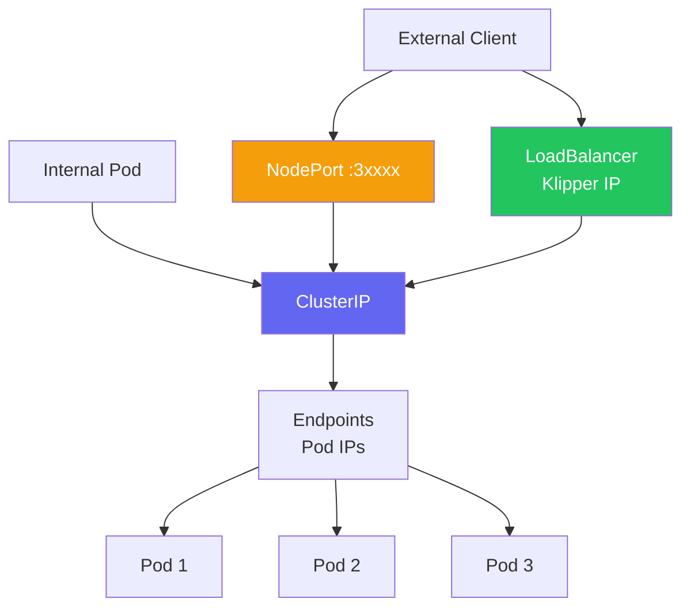
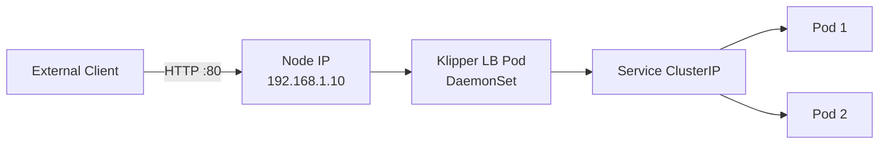
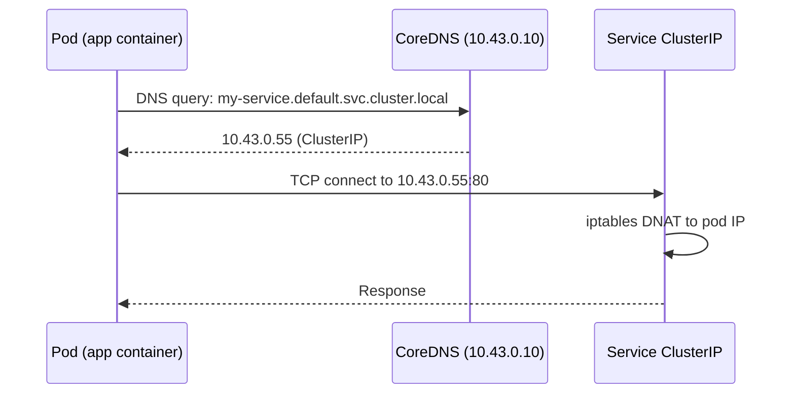

# Service Types

> Module 04 · Lesson 02 | [↑ Course Index](../README.md)

## Table of Contents

- [Service Overview](#service-overview)
- [ClusterIP](#clusterip)
- [NodePort](#nodeport)
- [LoadBalancer & Klipper](#loadbalancer--klipper)
- [ExternalName](#externalname)
- [Headless Services](#headless-services)
- [Service Discovery](#service-discovery)
- [Endpoints & EndpointSlices](#endpoints--endpointslices)
- [Session Affinity](#session-affinity)
- [Multi-Port Services](#multi-port-services)
- [Common Pitfalls](#common-pitfalls)
- [Further Reading](#further-reading)

---

## Service Overview



Every Service gets:
- A stable **ClusterIP** (virtual IP, routes via iptables/nftables)
- A stable **DNS name**: `<service>.<namespace>.svc.cluster.local`
- An **Endpoints** object listing the pod IPs it routes to

[↑ Back to TOC](#table-of-contents) · [↑ Course Index](../README.md)

---

## ClusterIP

The default Service type. Only reachable from inside the cluster.

```yaml
apiVersion: v1
kind: Service
metadata:
  name: my-backend
  namespace: default
spec:
  selector:
    app: my-backend
  ports:
    - name: http
      port: 80          # Port on the Service (ClusterIP)
      targetPort: 8080  # Port on the Pod
      protocol: TCP
  type: ClusterIP       # default — can be omitted
```

```bash
kubectl apply -f clusterip-service.yaml
kubectl get svc my-backend
# NAME         TYPE        CLUSTER-IP    EXTERNAL-IP   PORT(S)   AGE
# my-backend   ClusterIP   10.43.0.55    <none>        80/TCP    5s

# Access from another pod
kubectl exec -it some-pod -- curl http://my-backend
kubectl exec -it some-pod -- curl http://my-backend.default.svc.cluster.local
kubectl exec -it some-pod -- curl http://10.43.0.55
```

[↑ Back to TOC](#table-of-contents) · [↑ Course Index](../README.md)

---

## NodePort

Exposes the service on every node's IP at a static port (30000–32767):

```yaml
apiVersion: v1
kind: Service
metadata:
  name: my-app-nodeport
spec:
  selector:
    app: my-app
  ports:
    - port: 80
      targetPort: 80
      nodePort: 30080   # optional: omit to auto-assign
  type: NodePort
```

```bash
kubectl apply -f nodeport-service.yaml
kubectl get svc my-app-nodeport
# NAME               TYPE       CLUSTER-IP     PORT(S)        AGE
# my-app-nodeport    NodePort   10.43.0.88     80:30080/TCP   5s

# Access from outside the cluster
curl http://192.168.1.10:30080   # any node's IP + nodePort
```

> **When to use:** Development, testing, or when you don't have a load balancer. For production, use LoadBalancer or Ingress.

[↑ Back to TOC](#table-of-contents) · [↑ Course Index](../README.md)

---

## LoadBalancer & Klipper

k3s includes **Klipper**, a built-in service load balancer for bare-metal deployments:



```yaml
apiVersion: v1
kind: Service
metadata:
  name: my-app-lb
spec:
  selector:
    app: my-app
  ports:
    - port: 80
      targetPort: 80
  type: LoadBalancer
```

```bash
kubectl apply -f loadbalancer-service.yaml
kubectl get svc my-app-lb
# NAME        TYPE           CLUSTER-IP    EXTERNAL-IP     PORT(S)        AGE
# my-app-lb   LoadBalancer   10.43.0.99   192.168.1.10    80:31234/TCP   10s
#                                         ^^^^^^^^^^^^
#                                         Klipper assigns the node's IP

# Access
curl http://192.168.1.10:80
```

### Klipper behavior

- On single-node: assigns the node's IP
- On multi-node: runs a DaemonSet pod on each node and assigns **first available node's IP**
- Does NOT provide a floating VIP (for that, use MetalLB or an external LB)

### Using MetalLB instead of Klipper

```bash
# Disable Klipper
curl -sfL https://get.k3s.io | sh -s - --disable servicelb

# Install MetalLB
kubectl apply -f https://raw.githubusercontent.com/metallb/metallb/v0.14.0/config/manifests/metallb-native.yaml

# Configure IP pool
kubectl apply -f - <<'EOF'
apiVersion: metallb.io/v1beta1
kind: IPAddressPool
metadata:
  name: first-pool
  namespace: metallb-system
spec:
  addresses:
    - 192.168.1.200-192.168.1.250
---
apiVersion: metallb.io/v1beta1
kind: L2Advertisement
metadata:
  name: default
  namespace: metallb-system
EOF
```

[↑ Back to TOC](#table-of-contents) · [↑ Course Index](../README.md)

---

## ExternalName

Maps a Service to an external DNS name — useful to abstract external services:

```yaml
apiVersion: v1
kind: Service
metadata:
  name: external-db
  namespace: default
spec:
  type: ExternalName
  externalName: database.prod.example.com
```

```bash
# Pods can now use:
# external-db.default.svc.cluster.local
# which resolves to: database.prod.example.com
```

[↑ Back to TOC](#table-of-contents) · [↑ Course Index](../README.md)

---

## Headless Services

A headless service has no ClusterIP — DNS returns individual pod IPs directly. Used for StatefulSets and direct pod addressing:

```yaml
apiVersion: v1
kind: Service
metadata:
  name: my-headless
spec:
  selector:
    app: my-app
  clusterIP: None    # ← this makes it headless
  ports:
    - port: 80
      targetPort: 80
```

```bash
# DNS for headless service returns all pod IPs
kubectl exec -it some-pod -- nslookup my-headless
# Returns multiple A records, one per pod
```

[↑ Back to TOC](#table-of-contents) · [↑ Course Index](../README.md)

---

## Service Discovery

k3s CoreDNS handles service discovery automatically:



```bash
# DNS formats
my-service                                    # same namespace (short)
my-service.other-namespace                    # cross-namespace
my-service.other-namespace.svc                # explicit svc
my-service.other-namespace.svc.cluster.local  # fully qualified

# Test DNS from pod
kubectl run -it --rm dns-test --image=busybox --restart=Never -- nslookup kubernetes
# Server:    10.43.0.10
# Address 1: 10.43.0.10 kube-dns.kube-system.svc.cluster.local
# Name:      kubernetes
# Address 1: 10.43.0.1 kubernetes.default.svc.cluster.local
```

[↑ Back to TOC](#table-of-contents) · [↑ Course Index](../README.md)

---

## Endpoints & EndpointSlices

```bash
# View endpoints (pod IPs behind a service)
kubectl get endpoints my-service
# NAME         ENDPOINTS                         AGE
# my-service   10.42.0.5:80,10.42.0.6:80         5m

# If endpoints shows <none>, the selector doesn't match any pods
kubectl get endpoints my-service -o yaml

# EndpointSlices (newer API, auto-created)
kubectl get endpointslices -l kubernetes.io/service-name=my-service
```

[↑ Back to TOC](#table-of-contents) · [↑ Course Index](../README.md)

---

## Session Affinity

Ensure a client always hits the same pod (useful for session-based apps):

```yaml
spec:
  sessionAffinity: ClientIP
  sessionAffinityConfig:
    clientIP:
      timeoutSeconds: 3600   # 1 hour
```

> **Note:** Session affinity uses client IP, which may not work correctly behind NAT or load balancers. For true session persistence, use application-level solutions (JWT, database sessions).

[↑ Back to TOC](#table-of-contents) · [↑ Course Index](../README.md)

---

## Multi-Port Services

```yaml
apiVersion: v1
kind: Service
metadata:
  name: my-app-multiport
spec:
  selector:
    app: my-app
  ports:
    - name: http       # name required for multi-port services
      port: 80
      targetPort: 8080
    - name: https
      port: 443
      targetPort: 8443
    - name: metrics
      port: 9090
      targetPort: 9090
  type: ClusterIP
```

[↑ Back to TOC](#table-of-contents) · [↑ Course Index](../README.md)

---

## Common Pitfalls

| Pitfall | Symptom | Fix |
|---------|---------|-----|
| Selector mismatch | Endpoints shows `<none>` | Check `kubectl get endpoints` and compare selector/labels |
| Port vs targetPort confusion | Connection refused | `port` = service port; `targetPort` = container port |
| NodePort range violation | Validation error | NodePort must be 30000–32767 |
| Klipper on multi-node | Only one node's IP assigned | Use MetalLB for proper multi-node LB |
| ClusterIP from outside cluster | Connection timeout | ClusterIP is internal-only; use NodePort/LoadBalancer/Ingress |
| DNS short name fails cross-namespace | Name not found | Use full name: `svc.namespace.svc.cluster.local` |

[↑ Back to TOC](#table-of-contents) · [↑ Course Index](../README.md)

---

## Further Reading

- [Kubernetes Services Docs](https://kubernetes.io/docs/concepts/services-networking/service/)
- [Klipper LB](https://github.com/k3s-io/klipper-lb)
- [MetalLB](https://metallb.universe.tf/)
- [Networking Cheatsheet](../cheatsheets/networking-cheatsheet.md)

[↑ Back to TOC](#table-of-contents) · [↑ Course Index](../README.md)

---

*Licensed under [CC BY-NC-SA 4.0](../LICENSE.md) · © 2026 UncleJS*
