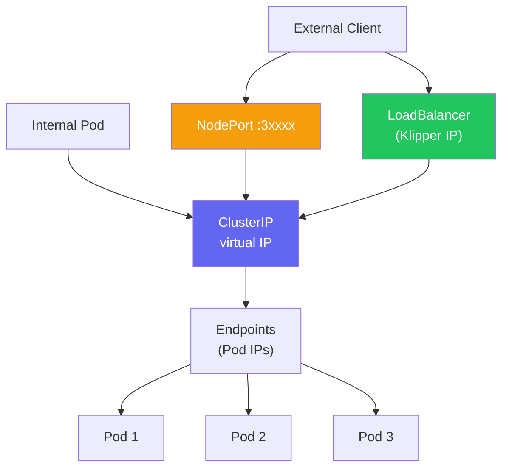
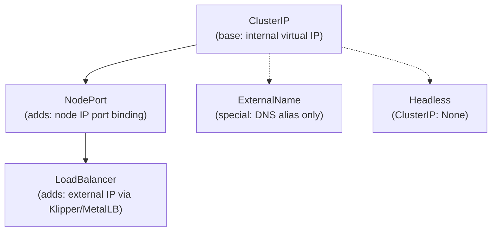
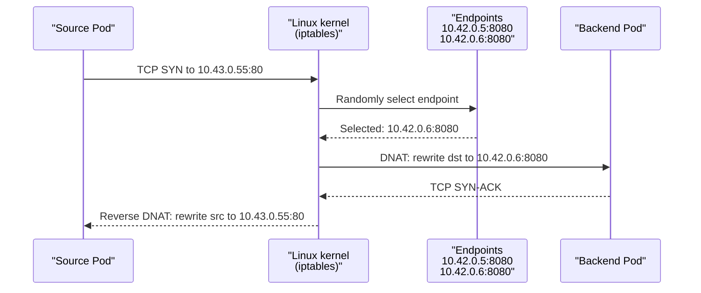
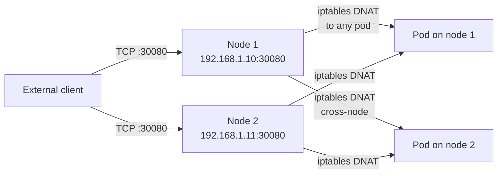
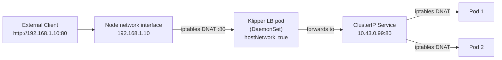
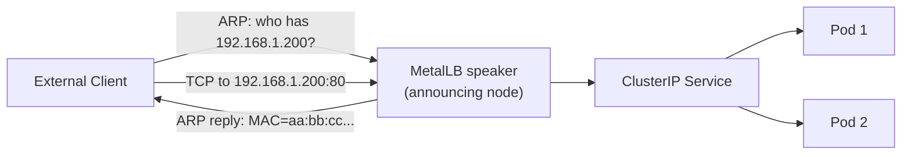
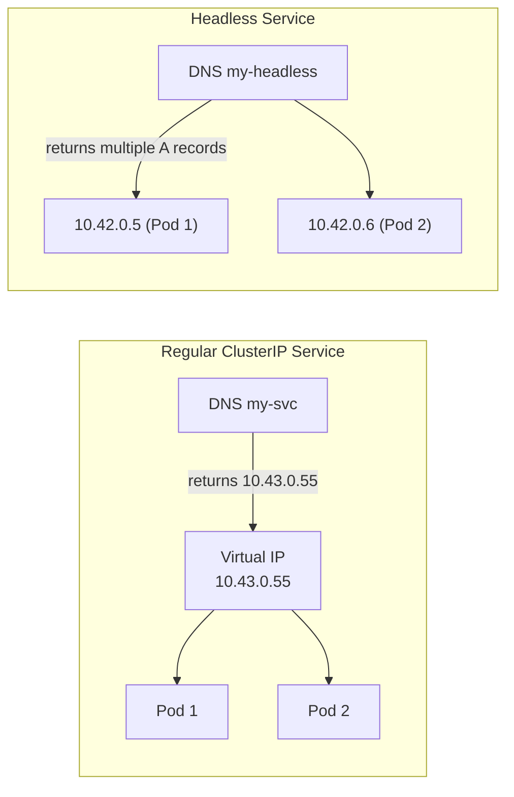
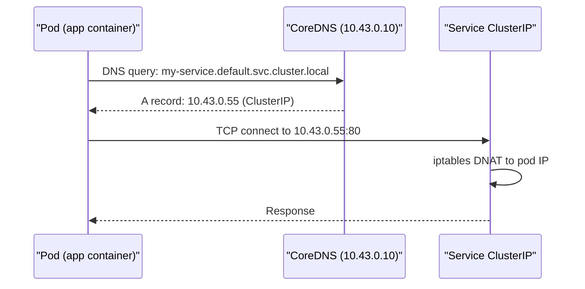

# Service Types

> Module 04 · Lesson 02 | [↑ Course Index](../README.md)


[](../README.md)
[](../LICENSE.md)

## Table of Contents

- [Service Overview](#service-overview)
- [ClusterIP — Deep Dive](#clusterip--deep-dive)
- [NodePort — Deep Dive](#nodeport--deep-dive)
- [LoadBalancer & Klipper — Deep Dive](#loadbalancer--klipper--deep-dive)
- [MetalLB: Production Load Balancing](#metallb-production-load-balancing)
- [ExternalName](#externalname)
- [Headless Services](#headless-services)
- [Service Discovery](#service-discovery)
- [Endpoints & EndpointSlices](#endpoints--endpointslices)
- [Session Affinity](#session-affinity)
- [Multi-Port Services](#multi-port-services)
- [Common Pitfalls](#common-pitfalls)
- [Lab](#lab)
- [Further Reading](#further-reading)

---

## Service Overview

Services solve the fundamental Kubernetes problem: pods are ephemeral and their IP addresses change every time they restart. A Service is a durable abstraction — a stable virtual IP and DNS name — that always routes to healthy pods regardless of how many times those pods have been rescheduled.



Every Service gets:
- A stable **ClusterIP** (virtual IP, routes via iptables/nftables)
- A stable **DNS name**: `<service>.<namespace>.svc.cluster.local`
- An **Endpoints** object listing the pod IPs it routes to

The four Service types form a hierarchy — each builds on the one below:



[↑ Back to TOC](#table-of-contents) · [↑ Course Index](../README.md)

---

## ClusterIP — Deep Dive

The default Service type. Only reachable from inside the cluster. Every other Service type also creates a ClusterIP — it is the foundation of all Service routing.

```yaml
apiVersion: v1
kind: Service
metadata:
  name: my-backend
  namespace: default
spec:
  selector:
    app: my-backend
  ports:
    - name: http
      port: 80          # Port on the Service (ClusterIP)
      targetPort: 8080  # Port on the Pod
      protocol: TCP
  type: ClusterIP       # default — can be omitted
```

```bash
kubectl apply -f clusterip-service.yaml
kubectl get svc my-backend
# NAME         TYPE        CLUSTER-IP    EXTERNAL-IP   PORT(S)   AGE
# my-backend   ClusterIP   10.43.0.55    <none>        80/TCP    5s

# Access from another pod (three equivalent forms)
kubectl exec -it some-pod -- curl http://my-backend             # short DNS name (same namespace)
kubectl exec -it some-pod -- curl http://my-backend.default     # namespace-qualified
kubectl exec -it some-pod -- curl http://my-backend.default.svc.cluster.local  # FQDN
kubectl exec -it some-pod -- curl http://10.43.0.55             # direct ClusterIP
```

### How iptables implements ClusterIP

When you create a ClusterIP service, kube-proxy on every node creates iptables rules:



The ClusterIP `10.43.0.55` is never assigned to any network interface — it exists only as an iptables DNAT rule. All load balancing happens in the kernel before any packet leaves the node.

> **iptables vs nftables vs IPVS:** k3s defaults to iptables. Larger clusters can switch to IPVS mode for better performance with thousands of services, since IPVS uses hash tables (O(1)) rather than linear iptables chain traversal.

[↑ Back to TOC](#table-of-contents) · [↑ Course Index](../README.md)

---

## NodePort — Deep Dive

NodePort extends ClusterIP by binding a port on **every node** in the cluster (in the range 30000–32767). External clients can reach the service by connecting to any node's IP at the NodePort.

```yaml
apiVersion: v1
kind: Service
metadata:
  name: my-app-nodeport
spec:
  selector:
    app: my-app
  ports:
    - port: 80
      targetPort: 80
      nodePort: 30080   # optional: omit to auto-assign from range
  type: NodePort
```

```bash
kubectl apply -f nodeport-service.yaml
kubectl get svc my-app-nodeport
# NAME               TYPE       CLUSTER-IP     PORT(S)        AGE
# my-app-nodeport    NodePort   10.43.0.88     80:30080/TCP   5s

# Access from outside the cluster — any node's IP works
curl http://192.168.1.10:30080   # node 1
curl http://192.168.1.11:30080   # node 2 — same result
```

### NodePort traffic flow



Notice that a request arriving at Node 1 may be forwarded to a pod on Node 2. This adds one extra network hop. To avoid this, set `externalTrafficPolicy: Local`:

```yaml
spec:
  type: NodePort
  externalTrafficPolicy: Local   # only routes to pods on the receiving node
  # CAUTION: if no pods are on a node, that node will drop the connection
```

`externalTrafficPolicy: Local` also **preserves the client source IP** (normally SNAT hides it), which is useful for logging real client IPs or implementing IP-based rate limiting.

> **When to use NodePort:** Development, testing, or simple setups where you have a single server and no cloud load balancer. For production multi-node clusters, prefer LoadBalancer or Ingress.

[↑ Back to TOC](#table-of-contents) · [↑ Course Index](../README.md)

---

## LoadBalancer & Klipper — Deep Dive

LoadBalancer is the standard Kubernetes mechanism for provisioning an external IP from the underlying infrastructure. In cloud environments (AWS, GCP, Azure), it provisions a cloud load balancer. On bare metal, k3s ships with **Klipper** to fill this role.

```yaml
apiVersion: v1
kind: Service
metadata:
  name: my-app-lb
spec:
  selector:
    app: my-app
  ports:
    - port: 80
      targetPort: 80
  type: LoadBalancer
```

```bash
kubectl apply -f loadbalancer-service.yaml
kubectl get svc my-app-lb
# NAME        TYPE           CLUSTER-IP    EXTERNAL-IP     PORT(S)        AGE
# my-app-lb   LoadBalancer   10.43.0.99   192.168.1.10    80:31234/TCP   10s
#                                         ^^^^^^^^^^^^
#                                         Klipper assigns the node's IP

# Access directly on port 80
curl http://192.168.1.10:80
```

### How Klipper works



Klipper runs a DaemonSet pod with `hostNetwork: true` — it binds to the node's real IP. When you create a `LoadBalancer` service, Klipper creates a DaemonSet pod on each node that forwards the port. The external IP assigned is the node's IP.

**Klipper limitations:**

- On a single-node cluster: assigns the node's IP — works perfectly
- On multi-node: runs pods on all nodes but assigns only **one** node's IP as `EXTERNAL-IP`
- No floating VIP — if the assigned node fails, the external IP becomes unreachable
- No BGP routing — purely L2/ARP based

[↑ Back to TOC](#table-of-contents) · [↑ Course Index](../README.md)

---

## MetalLB: Production Load Balancing

For production multi-node clusters, **MetalLB** replaces Klipper and provides proper L2 ARP or BGP-based load balancing with floating IPs.

### L2 mode (simpler, most common)

MetalLB responds to ARP requests for the external IP. Any node in the cluster can answer. On failure of the announcing node, another node takes over via gratuitous ARP.



```bash
# Step 1: Disable Klipper when installing k3s
curl -sfL https://get.k3s.io | sh -s - --disable servicelb

# Or add to /etc/rancher/k3s/config.yaml:
# disable: servicelb

# Step 2: Install MetalLB
kubectl apply -f https://raw.githubusercontent.com/metallb/metallb/v0.14.0/config/manifests/metallb-native.yaml

# Wait for MetalLB to be ready
kubectl wait -n metallb-system pod --all --for=condition=Ready --timeout=90s

# Step 3: Configure an IP pool (L2 mode)
kubectl apply -f - <<'EOF'
apiVersion: metallb.io/v1beta1
kind: IPAddressPool
metadata:
  name: first-pool
  namespace: metallb-system
spec:
  addresses:
    - 192.168.1.200-192.168.1.250
---
apiVersion: metallb.io/v1beta1
kind: L2Advertisement
metadata:
  name: default
  namespace: metallb-system
EOF
```

### BGP mode (advanced, data-centre)

BGP mode advertises the service IPs as routes to upstream routers. Provides true ECMP load balancing and no single point of failure. Requires a BGP-capable router.

```yaml
apiVersion: metallb.io/v1beta2
kind: BGPPeer
metadata:
  name: router
  namespace: metallb-system
spec:
  myASN: 64512
  peerASN: 64512
  peerAddress: 192.168.1.1
---
apiVersion: metallb.io/v1beta1
kind: BGPAdvertisement
metadata:
  name: default
  namespace: metallb-system
```

[↑ Back to TOC](#table-of-contents) · [↑ Course Index](../README.md)

---

## ExternalName

ExternalName is a special Service type that creates a DNS `CNAME` record pointing to an external hostname. It has no ClusterIP and does no actual proxying — it just rewrites DNS.

```yaml
apiVersion: v1
kind: Service
metadata:
  name: external-db
  namespace: default
spec:
  type: ExternalName
  externalName: database.prod.example.com
```

```bash
# Pods can now reference the database by in-cluster name
# external-db.default.svc.cluster.local
# resolves to CNAME: database.prod.example.com
# which then resolves normally via upstream DNS

kubectl exec -it some-pod -- nslookup external-db
# Server:    10.43.0.10
# Name:      external-db.default.svc.cluster.local
# Address 1: 203.0.113.5 database.prod.example.com
```

**Use cases:**
- Abstract a managed cloud database (RDS, Cloud SQL) behind an in-cluster name so you can change the endpoint without updating app configs
- Provide an alias for an external SaaS API that your cluster consumes
- Support migration: start with ExternalName pointing to legacy, later replace with a real in-cluster Service

> **Limitation:** ExternalName only works at the DNS level. It does not support TLS certificate verification (the returned hostname is the original), and it does not provide health checking, load balancing, or connection pooling.

[↑ Back to TOC](#table-of-contents) · [↑ Course Index](../README.md)

---

## Headless Services

A headless Service has `clusterIP: None`. Instead of creating a virtual IP, DNS returns the individual pod IP addresses directly. This enables clients to connect directly to specific pod instances — essential for StatefulSets.

```yaml
apiVersion: v1
kind: Service
metadata:
  name: my-headless
spec:
  selector:
    app: my-app
  clusterIP: None    # ← this makes it headless
  ports:
    - port: 80
      targetPort: 80
```



```bash
# DNS for headless service returns all pod IPs (multiple A records)
kubectl exec -it some-pod -- nslookup my-headless
# Server:    10.43.0.10
# Name:      my-headless.default.svc.cluster.local
# Address 1: 10.42.0.5 pod1.my-headless.default.svc.cluster.local
# Address 2: 10.42.0.6 pod2.my-headless.default.svc.cluster.local
```

**StatefulSet + headless service:** When a StatefulSet named `mysql` uses a headless service named `mysql`, each pod gets a stable DNS name:

- `mysql-0.mysql.default.svc.cluster.local` → Pod 0
- `mysql-1.mysql.default.svc.cluster.local` → Pod 1

This allows a MySQL Galera or Redis Sentinel member to always find its peers by a predictable name, regardless of IP changes.

[↑ Back to TOC](#table-of-contents) · [↑ Course Index](../README.md)

---

## Service Discovery

k3s CoreDNS handles service discovery automatically. Every pod's `/etc/resolv.conf` points to CoreDNS, and CoreDNS watches the Kubernetes API for Service changes.



```bash
# DNS name formats
my-service                                    # same namespace (short)
my-service.other-namespace                    # cross-namespace
my-service.other-namespace.svc                # explicit svc subdomain
my-service.other-namespace.svc.cluster.local  # fully qualified (FQDN)

# Test DNS from pod
kubectl run -it --rm dns-test --image=busybox --restart=Never -- nslookup kubernetes
# Server:    10.43.0.10
# Name:      kubernetes.default.svc.cluster.local
# Address 1: 10.43.0.1
```

[↑ Back to TOC](#table-of-contents) · [↑ Course Index](../README.md)

---

## Endpoints & EndpointSlices

The **Endpoints** object is the live list of pod IPs backing a Service. It's updated automatically by the Endpoints controller whenever pods are added, removed, or change health.

```bash
# View endpoints (pod IPs behind a service)
kubectl get endpoints my-service
# NAME         ENDPOINTS                         AGE
# my-service   10.42.0.5:80,10.42.0.6:80         5m

# If endpoints shows <none>, the selector doesn't match any pods
# Compare these two:
kubectl describe svc my-service | grep Selector
kubectl get pods --show-labels

# Full endpoint details
kubectl get endpoints my-service -o yaml

# EndpointSlices (newer API, auto-created, better scalability)
kubectl get endpointslices -l kubernetes.io/service-name=my-service
```

**EndpointSlices** were introduced to solve scalability problems with the original Endpoints object. A single Endpoints object for a 1000-replica service was enormous and caused performance issues — every update required retransmitting the entire object. EndpointSlices shard this into 100-endpoint chunks.

[↑ Back to TOC](#table-of-contents) · [↑ Course Index](../README.md)

---

## Session Affinity

By default, Services load-balance each connection independently. Session affinity ensures a client always hits the same pod — useful for applications that store session state in memory.

```yaml
spec:
  sessionAffinity: ClientIP
  sessionAffinityConfig:
    clientIP:
      timeoutSeconds: 3600   # 1 hour
```

Session affinity works by looking at the source IP in the iptables rule — connections from the same client IP are always forwarded to the same pod.

> **Important caveat:** Session affinity uses client IP, which may not work correctly behind NAT or cloud load balancers where multiple clients share the same external IP. It also breaks when pods restart (the pod IP changes). For robust session handling, use application-level solutions: JWT tokens, database-backed sessions, or Redis session stores.

[↑ Back to TOC](#table-of-contents) · [↑ Course Index](../README.md)

---

## Multi-Port Services

A single Service can expose multiple ports. Port names are required when multiple ports are defined:

```yaml
apiVersion: v1
kind: Service
metadata:
  name: my-app-multiport
spec:
  selector:
    app: my-app
  ports:
    - name: http       # name required for multi-port services
      port: 80
      targetPort: 8080
    - name: https
      port: 443
      targetPort: 8443
    - name: metrics    # Prometheus scraping
      port: 9090
      targetPort: 9090
  type: ClusterIP
```

Named ports offer an additional benefit: you can reference the port name in ProbeActions and readiness checks, and if the pod changes its port number, you only need to update the port definition in the pod spec — Services and Ingresses using the port by name automatically pick up the change.

[↑ Back to TOC](#table-of-contents) · [↑ Course Index](../README.md)

---

## Common Pitfalls

| Pitfall | Symptom | Fix |
|---------|---------|-----|
| Selector mismatch | Endpoints shows `<none>` | `kubectl get endpoints` + compare selector vs pod labels |
| `port` vs `targetPort` confusion | Connection refused | `port` = service port; `targetPort` = container port |
| NodePort range violation | Validation error on create | NodePort must be 30000–32767 |
| Klipper on multi-node | Only one node's IP assigned as EXTERNAL-IP | Disable Klipper (`--disable servicelb`), use MetalLB |
| ClusterIP from outside cluster | Connection timeout | ClusterIP is internal-only; use NodePort, LoadBalancer, or Ingress |
| DNS short name fails cross-namespace | `Name or service not known` | Use full FQDN: `svc.namespace.svc.cluster.local` |
| `externalTrafficPolicy: Local` with zero local pods | Connections dropped silently | Ensure at least one pod runs on nodes receiving external traffic, or use `Cluster` mode |
| Session affinity with NAT | All traffic hits same pod | Multiple clients behind NAT share one IP; use application-level sessions |

[↑ Back to TOC](#table-of-contents) · [↑ Course Index](../README.md)

---

## Lab

### Exercise 1 — Compare all Service types

```bash
# 1. Create a test deployment
kubectl create deployment echo --image=hashicorp/http-echo:latest \
  --port=5678 -- -text="hello from echo"
kubectl scale deployment echo --replicas=3

# 2. ClusterIP (internal)
kubectl expose deployment echo --port=5678 --name=echo-clusterip
kubectl get svc echo-clusterip
# Test from inside the cluster
kubectl run -it --rm test --image=busybox --restart=Never -- \
  wget -qO- http://echo-clusterip:5678

# 3. NodePort (external)
kubectl expose deployment echo --port=5678 --type=NodePort --name=echo-nodeport
kubectl get svc echo-nodeport
# Note the auto-assigned NodePort
NODE_PORT=$(kubectl get svc echo-nodeport -o jsonpath='{.spec.ports[0].nodePort}')
NODE_IP=$(kubectl get node -o jsonpath='{.items[0].status.addresses[0].address}')
curl http://$NODE_IP:$NODE_PORT

# 4. LoadBalancer (Klipper)
kubectl expose deployment echo --port=5678 --type=LoadBalancer --name=echo-lb
kubectl get svc echo-lb
# Watch for EXTERNAL-IP (may take a few seconds)
kubectl get svc echo-lb -w
EXT_IP=$(kubectl get svc echo-lb -o jsonpath='{.status.loadBalancer.ingress[0].ip}')
curl http://$EXT_IP:5678
```

### Exercise 2 — Headless service + DNS

```bash
# 1. Create a headless service
kubectl expose deployment echo --port=5678 --name=echo-headless \
  --cluster-ip=None

# 2. Compare DNS resolution
kubectl run -it --rm dnstest --image=busybox --restart=Never -- sh
# Inside busybox:
# nslookup echo-clusterip    → single A record (ClusterIP)
# nslookup echo-headless     → multiple A records (one per pod)
```

### Clean up

```bash
kubectl delete deployment echo
kubectl delete svc echo-clusterip echo-nodeport echo-lb echo-headless
```

[↑ Back to TOC](#table-of-contents) · [↑ Course Index](../README.md)

---

## Further Reading

- [Kubernetes Services Docs](https://kubernetes.io/docs/concepts/services-networking/service/)
- [Klipper LB](https://github.com/k3s-io/klipper-lb)
- [MetalLB](https://metallb.universe.tf/)
- [Networking Cheatsheet](../cheatsheets/networking-cheatsheet.md)

[↑ Back to TOC](#table-of-contents) · [↑ Course Index](../README.md)

---

*Licensed under [CC BY-NC-SA 4.0](../LICENSE.md) · © 2026 UncleJS*
