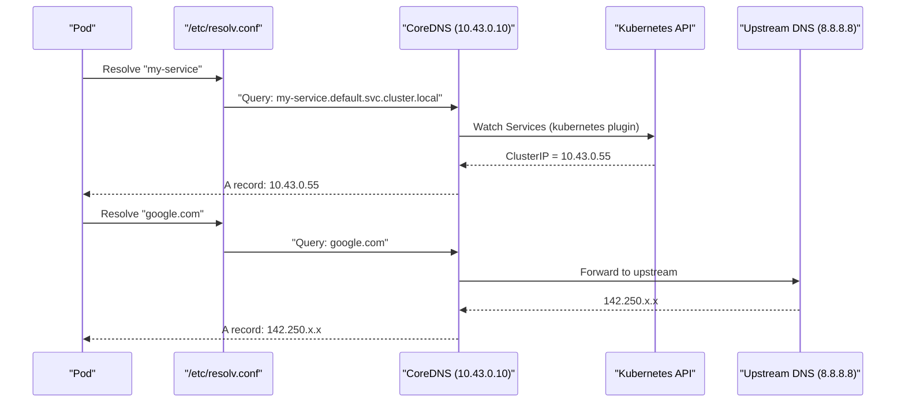
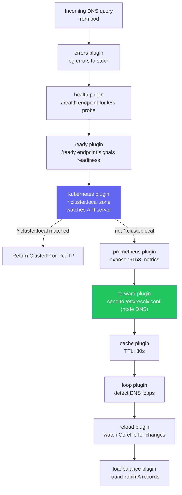
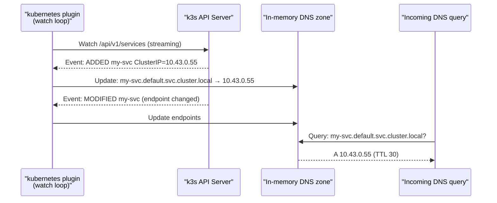
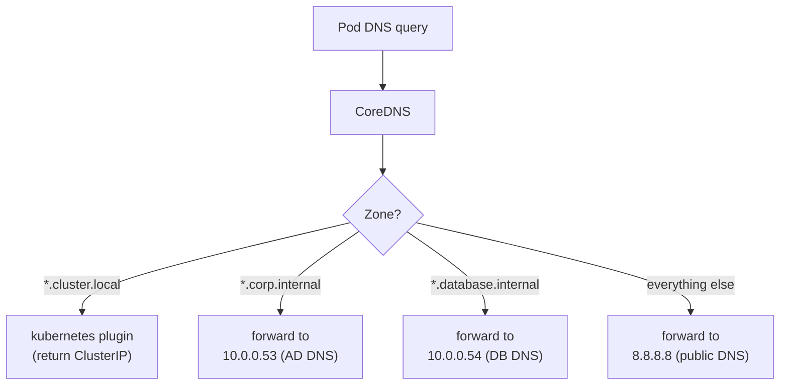
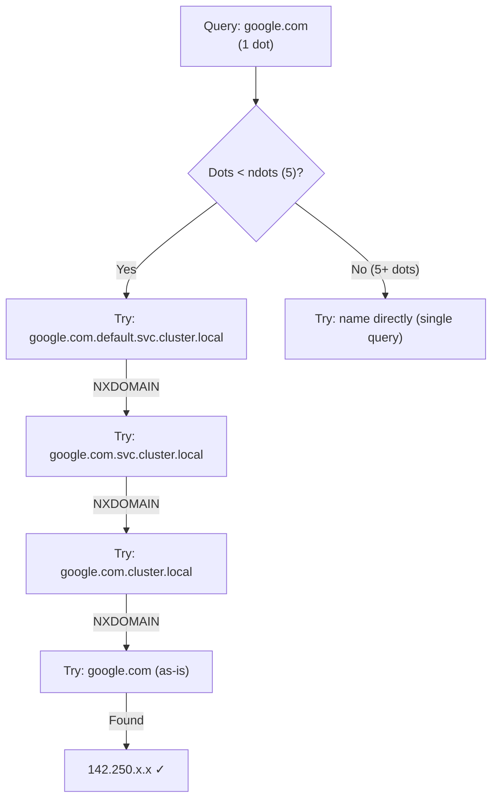
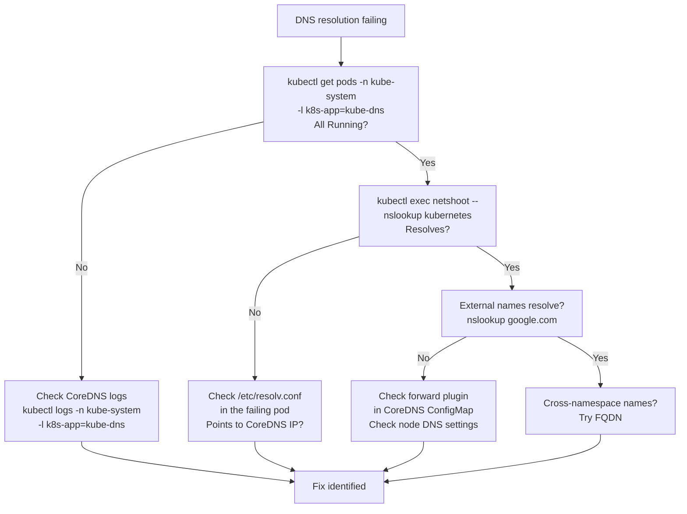

# DNS & CoreDNS

> Module 04 · Lesson 03 | [↑ Course Index](../README.md)


[](../README.md)
[](../LICENSE.md)

## Table of Contents

- [How DNS Works in k3s](#how-dns-works-in-k3s)
- [CoreDNS Architecture & Plugin Chain](#coredns-architecture--plugin-chain)
- [The kubernetes Plugin](#the-kubernetes-plugin)
- [DNS Name Formats](#dns-name-formats)
- [Configuring CoreDNS](#configuring-coredns)
- [Adding Custom DNS Entries](#adding-custom-dns-entries)
- [Stub Zones for On-Prem Environments](#stub-zones-for-on-prem-environments)
- [DNS for Pods](#dns-for-pods)
- [ndots & Search Domains — Performance Impact](#ndots--search-domains--performance-impact)
- [Debugging DNS Issues](#debugging-dns-issues)
- [Common Pitfalls](#common-pitfalls)
- [Lab](#lab)
- [Further Reading](#further-reading)

---

## How DNS Works in k3s

Every pod in k3s automatically uses **CoreDNS** for name resolution. When a pod starts, its `/etc/resolv.conf` is configured by the kubelet to point to the CoreDNS ClusterIP:

```bash
# Inside any pod:
cat /etc/resolv.conf
# nameserver 10.43.0.10        ← CoreDNS ClusterIP (always .10 in k3s default CIDR)
# search default.svc.cluster.local svc.cluster.local cluster.local
# options ndots:5
```

The flow from a pod name resolution to a response:



CoreDNS is deployed as a `Deployment` (typically 1–2 replicas) in the `kube-system` namespace, exposed via the `kube-dns` Service at a well-known ClusterIP.

```bash
# View CoreDNS deployment
kubectl get deployment coredns -n kube-system
kubectl get pods -n kube-system -l k8s-app=kube-dns

# View CoreDNS Service (the nameserver IP in /etc/resolv.conf)
kubectl get svc kube-dns -n kube-system
# NAME       TYPE        CLUSTER-IP   EXTERNAL-IP   PORT(S)                  AGE
# kube-dns   ClusterIP   10.43.0.10   <none>        53/UDP,53/TCP,9153/TCP   30d
```

[↑ Back to TOC](#table-of-contents) · [↑ Course Index](../README.md)

---

## CoreDNS Architecture & Plugin Chain

CoreDNS processes DNS queries through a **plugin chain** — a sequence of plugins applied in order to every incoming query. This is fundamentally different from traditional DNS servers with static zone files. Each plugin can modify the query, serve a response, or pass the query to the next plugin.



The default CoreDNS configuration (Corefile) in k3s:

```
.:53 {
    errors
    health {
       lameduck 5s
    }
    ready
    kubernetes cluster.local in-addr.arpa ip6.arpa {
       pods insecure
       fallthrough in-addr.arpa ip6.arpa
       ttl 30
    }
    prometheus :9153
    forward . /etc/resolv.conf
    cache 30
    loop
    reload
    loadbalance
}
```

View and edit the live config:

```bash
kubectl get configmap coredns -n kube-system -o yaml
kubectl edit configmap coredns -n kube-system
```

[↑ Back to TOC](#table-of-contents) · [↑ Course Index](../README.md)

---

## The kubernetes Plugin

The `kubernetes` plugin is the heart of Kubernetes DNS. It watches the Kubernetes API server for changes to Services, Endpoints, and Pods, maintains an in-memory DNS zone, and responds to queries without going to disk or an external resolver.



Key kubernetes plugin options:

```
kubernetes cluster.local in-addr.arpa ip6.arpa {
    pods insecure      # generate pod DNS entries (ip-with-dashes.ns.pod.cluster.local)
    fallthrough in-addr.arpa ip6.arpa  # pass PTR queries to next plugin if not found
    ttl 30             # TTL for returned records (seconds)
    endpoint_pod_names # use pod hostnames instead of IPs in endpoint DNS
}
```

### What the kubernetes plugin serves

| Query type | Zone | Example |
|-----------|------|---------|
| Service A records | `<svc>.<ns>.svc.cluster.local` | `my-api.default.svc.cluster.local` |
| Headless pod A records | `<pod>.<svc>.<ns>.svc.cluster.local` | `redis-0.redis.default.svc.cluster.local` |
| Pod A records (with `pods insecure`) | `<ip-dashes>.<ns>.pod.cluster.local` | `10-42-0-5.default.pod.cluster.local` |
| PTR (reverse DNS) | `in-addr.arpa` | `5.0.42.10.in-addr.arpa → 10-42-0-5...` |

[↑ Back to TOC](#table-of-contents) · [↑ Course Index](../README.md)

---

## DNS Name Formats

| Name format | Resolves to | Notes |
|------------|-------------|-------|
| `<service>` | Service in same namespace | Works due to search domains |
| `<service>.<namespace>` | Service in any namespace | Preferred for cross-namespace |
| `<service>.<namespace>.svc` | Explicit svc subdomain | Rarely needed |
| `<service>.<namespace>.svc.cluster.local` | Fully qualified (FQDN) | Unambiguous, no search expansion |
| `<pod-ip-dashes>.<namespace>.pod.cluster.local` | Direct pod IP | e.g., `10-42-0-5.default.pod.cluster.local` |
| `<pod-hostname>.<svc>.<namespace>.svc.cluster.local` | Pod via headless svc | StatefulSet pods |

```bash
# Test each format from a debug pod
kubectl run -it --rm dns-test --image=busybox --restart=Never -- sh

# Inside the pod:
nslookup kubernetes
nslookup kubernetes.default
nslookup kubernetes.default.svc
nslookup kubernetes.default.svc.cluster.local
nslookup coredns.kube-system.svc.cluster.local
```

[↑ Back to TOC](#table-of-contents) · [↑ Course Index](../README.md)

---

## Configuring CoreDNS

All CoreDNS configuration lives in the `coredns` ConfigMap in `kube-system`. The `reload` plugin watches this ConfigMap and automatically reloads CoreDNS when it changes — no pod restart needed.

```bash
kubectl edit configmap coredns -n kube-system
# After saving, CoreDNS reloads within ~30 seconds (reload plugin)

# Or restart explicitly for immediate effect
kubectl rollout restart deployment/coredns -n kube-system
```

### Forward to custom DNS servers

Replace or supplement the upstream resolvers:

```
forward . 192.168.1.1 8.8.8.8 {
    prefer_udp
    policy random   # default is sequential; random gives better distribution
}
```

### Multiple upstream resolvers with health checking

```
forward . 10.0.0.53 10.0.0.54 {
    max_fails 3        # mark unhealthy after 3 consecutive failures
    expire 10s         # time to wait before rechecking a failed upstream
    health_check 5s    # how often to check upstream health
}
```

[↑ Back to TOC](#table-of-contents) · [↑ Course Index](../README.md)

---

## Adding Custom DNS Entries

### Method 1: hosts plugin (static entries)

Add static host entries for legacy systems or on-prem services that don't have DNS:

```yaml
apiVersion: v1
kind: ConfigMap
metadata:
  name: coredns
  namespace: kube-system
data:
  Corefile: |
    .:53 {
        errors
        health
        ready
        kubernetes cluster.local in-addr.arpa ip6.arpa {
           pods insecure
           fallthrough in-addr.arpa ip6.arpa
           ttl 30
        }
        hosts {
          192.168.1.50  legacy-db.internal
          192.168.1.51  legacy-api.internal
          192.168.1.52  old-ldap.internal
          fallthrough
        }
        prometheus :9153
        forward . /etc/resolv.conf
        cache 30
        loop
        reload
        loadbalance
    }
```

### Method 2: rewrite plugin (DNS aliasing)

Rename services or provide backwards-compatible DNS names:

```
rewrite name my-old-service.default.svc.cluster.local my-new-service.default.svc.cluster.local
rewrite name api.internal api-gateway.apps.svc.cluster.local
```

### Method 3: file plugin (custom zone file)

For complete control over a zone:

```
example.internal:53 {
    file /etc/coredns/example.internal.db
    errors
    log
}
```

[↑ Back to TOC](#table-of-contents) · [↑ Course Index](../README.md)

---

## Stub Zones for On-Prem Environments

Enterprise environments often have an internal DNS zone (like `corp.internal` or `ad.company.com`) served by internal DNS servers (Active Directory, BIND, Unbound). CoreDNS can forward queries for those zones to the right resolver while sending everything else to public DNS.



Configuration with multiple stub zones:

```
.:53 {
    errors
    health
    ready
    kubernetes cluster.local in-addr.arpa ip6.arpa {
        pods insecure
        fallthrough in-addr.arpa ip6.arpa
        ttl 30
    }
    prometheus :9153
    forward . 8.8.8.8 8.8.4.4   # public DNS for everything else
    cache 30
    loop
    reload
    loadbalance
}

# Active Directory / internal zone
corp.internal:53 {
    errors
    cache 30
    forward . 10.0.0.53 10.0.0.54   # internal AD DNS servers
}

# Database infrastructure zone
database.internal:53 {
    errors
    cache 30
    forward . 10.0.0.100
}
```

> **Why this matters for air-gapped clusters:** In air-gapped environments, pods cannot reach public DNS at all. If your `forward` plugin points to an unreachable IP, all external DNS resolution hangs until timeout. Configure the forward plugin to point to your internal DNS proxy, or use an explicit `cache` + `hosts` setup for known external names.

[↑ Back to TOC](#table-of-contents) · [↑ Course Index](../README.md)

---

## DNS for Pods

### DNS policy options

Each pod can override the default DNS behaviour:

```yaml
spec:
  dnsPolicy: ClusterFirst    # default: use CoreDNS, fall back to node DNS
  # Other options:
  # ClusterFirstWithHostNet  # use CoreDNS even when hostNetwork: true
  # Default                  # use node's /etc/resolv.conf (bypass CoreDNS)
  # None                     # fully custom — requires dnsConfig
```

### Custom DNS configuration per pod

```yaml
spec:
  dnsPolicy: None
  dnsConfig:
    nameservers:
      - 10.0.0.53          # internal AD DNS
      - 8.8.8.8            # fallback
    searches:
      - default.svc.cluster.local
      - svc.cluster.local
      - cluster.local
      - corp.internal      # add corporate domain to search list
    options:
      - name: ndots
        value: "2"         # reduce extra lookups (see ndots section)
      - name: timeout
        value: "3"
      - name: attempts
        value: "2"
```

### Pod hostname and subdomain (StatefulSet DNS)

```yaml
spec:
  hostname: redis-0
  subdomain: redis-headless   # must be a headless Service name
  # Resulting DNS: redis-0.redis-headless.namespace.svc.cluster.local
```

[↑ Back to TOC](#table-of-contents) · [↑ Course Index](../README.md)

---

## ndots & Search Domains — Performance Impact

The `ndots:5` option in `/etc/resolv.conf` has a significant performance impact that surprises many Kubernetes users.

**What ndots does:** If the name being resolved contains fewer dots than `ndots`, the resolver tries appending each search domain before trying the name as-is. With `ndots:5` and 3 search domains, resolving `google.com` (1 dot < 5) triggers **4 DNS queries**:



This means any app making frequent external HTTP calls with short domains pays 3 extra DNS round-trips per connection. At scale — thousands of pods making hundreds of connections per second — this adds measurable latency and increases load on CoreDNS.

### Reducing ndots overhead

**Option 1: Use FQDNs with trailing dot** (no resolver change needed)

```python
# In your application config, use trailing dot
import requests
response = requests.get("https://api.stripe.com./v1/charges")
# The trailing dot marks it as FQDN → no search domain expansion
```

**Option 2: Lower ndots per pod**

```yaml
spec:
  dnsConfig:
    options:
      - name: ndots
        value: "2"   # only search-expand names with < 2 dots
```

**Option 3: Global ndots reduction** (patch CoreDNS ConfigMap + kubelet config)

For clusters where most apps connect to external services, lowering ndots globally to 1 or 2 significantly reduces DNS traffic without breaking internal service discovery (internal names like `my-service` expand via search domains as long as there are fewer than `ndots` dots).

[↑ Back to TOC](#table-of-contents) · [↑ Course Index](../README.md)

---

## Debugging DNS Issues

A systematic DNS debugging workflow:



```bash
# --- Step 1: Check CoreDNS is running ---
kubectl get pods -n kube-system -l k8s-app=kube-dns
kubectl get svc kube-dns -n kube-system

# --- Step 2: Run a debug pod with full network tools ---
kubectl run -it --rm dns-debug \
  --image=nicolaka/netshoot \
  --restart=Never -- bash

# Inside netshoot:
# Basic service resolution
nslookup kubernetes.default.svc.cluster.local
dig kubernetes.default.svc.cluster.local

# Check resolv.conf (should point to CoreDNS IP)
cat /etc/resolv.conf

# Test external DNS
nslookup google.com

# Query CoreDNS directly, bypassing resolv.conf
dig kubernetes.default.svc.cluster.local @10.43.0.10

# Check for NXDOMAIN vs timeout (timeout = network issue; NXDOMAIN = name issue)
dig @10.43.0.10 nonexistent.default.svc.cluster.local +timeout=2

# --- Step 3: Check CoreDNS logs ---
kubectl logs -n kube-system -l k8s-app=kube-dns --tail=50

# Enable verbose logging temporarily (add 'log' to Corefile)
kubectl edit configmap coredns -n kube-system
# Add "log" plugin after "errors"

# --- Step 4: Verify CoreDNS ConfigMap is valid ---
kubectl get configmap coredns -n kube-system -o yaml

# --- Step 5: Check CoreDNS metrics (Prometheus endpoint) ---
kubectl port-forward -n kube-system svc/kube-dns 9153:9153
curl -s http://localhost:9153/metrics | grep coredns_dns_requests_total

# --- Step 6: Check from the specific failing pod ---
kubectl exec -it my-failing-pod -- nslookup kubernetes 10.43.0.10
# If this works but service DNS fails → wrong namespace or selector
```

[↑ Back to TOC](#table-of-contents) · [↑ Course Index](../README.md)

---

## Common Pitfalls

| Pitfall | Symptom | Fix |
|---------|---------|-----|
| CoreDNS crashlooping | DNS resolution fails cluster-wide | Check logs; often caused by bad Corefile syntax after an edit |
| Wrong upstream DNS | External names don't resolve | Check `forward` in Corefile; test with `nslookup google.com @<node-dns>` |
| ndots causing extra lookups | Slow DNS for apps connecting to external services | Lower `ndots` to 2 or use FQDN with trailing dot |
| Cross-namespace DNS fails | `service not found` errors | Use full FQDN: `svc.namespace.svc.cluster.local` |
| Loop plugin CPU spike | CoreDNS consumes 100% CPU | Node's `/etc/resolv.conf` points back to CoreDNS — remove the loop |
| SELinux blocking DNS | CoreDNS `permission denied` errors | Install k3s SELinux policy: `dnf install k3s-selinux` |
| `reload` plugin not applying changes | ConfigMap changes not taking effect | Wait 30s or `kubectl rollout restart deployment/coredns -n kube-system` |
| DNS works for some pods but not others | Pod running with `dnsPolicy: Default` | Ensure pod spec uses `ClusterFirst` or `ClusterFirstWithHostNet` |

[↑ Back to TOC](#table-of-contents) · [↑ Course Index](../README.md)

---

## Lab

### Exercise 1 — Explore DNS resolution

```bash
# 1. Launch a debug pod
kubectl run -it --rm dns-lab --image=nicolaka/netshoot --restart=Never -- bash

# Inside netshoot:
# 2. Check /etc/resolv.conf
cat /etc/resolv.conf

# 3. Test all DNS name formats
nslookup kubernetes
nslookup kubernetes.default
nslookup kubernetes.default.svc
nslookup kubernetes.default.svc.cluster.local

# 4. See the extra queries ndots causes
dig google.com +search +showsearch 2>&1 | grep -E "^;; QUERY|ANSWER"

# 5. Compare with FQDN (trailing dot = no search expansion)
dig google.com. 2>&1 | grep -E "^;; QUERY|ANSWER"
```

### Exercise 2 — Add a custom hosts entry

```bash
# 1. Add a static hosts entry to CoreDNS
kubectl edit configmap coredns -n kube-system
# Add hosts block (see Adding Custom DNS Entries section)
# Map: 192.168.1.99 → test-legacy.internal

# 2. Restart CoreDNS
kubectl rollout restart deployment/coredns -n kube-system
kubectl rollout status deployment/coredns -n kube-system

# 3. Verify from a pod
kubectl run -it --rm dns-check --image=busybox --restart=Never -- \
  nslookup test-legacy.internal
```

### Exercise 3 — Stub zone for on-prem

```bash
# Add a stub zone to forward .corp.internal to a specific DNS
# (Use 8.8.8.8 as a stand-in if you don't have an internal DNS)
kubectl edit configmap coredns -n kube-system
# Add:
# corp.internal:53 {
#     errors
#     cache 30
#     forward . 8.8.8.8
# }

kubectl rollout restart deployment/coredns -n kube-system

# Test
kubectl run -it --rm dns-stub --image=busybox --restart=Never -- \
  nslookup anything.corp.internal
# Should get NXDOMAIN or a result — but confirm it's hitting the stub zone
```

[↑ Back to TOC](#table-of-contents) · [↑ Course Index](../README.md)

---

## Further Reading

- [CoreDNS Documentation](https://coredns.io/manual/toc/)
- [Kubernetes DNS Docs](https://kubernetes.io/docs/concepts/services-networking/dns-pod-service/)
- [CoreDNS Plugins Reference](https://coredns.io/plugins/)
- [ndots deep dive](https://pracucci.com/kubernetes-dns-resolution-ndots-options-and-why-kubernetes-clusters-need-to-resolve-external-names.html)

[↑ Back to TOC](#table-of-contents) · [↑ Course Index](../README.md)

---

*Licensed under [CC BY-NC-SA 4.0](../LICENSE.md) · © 2026 UncleJS*
