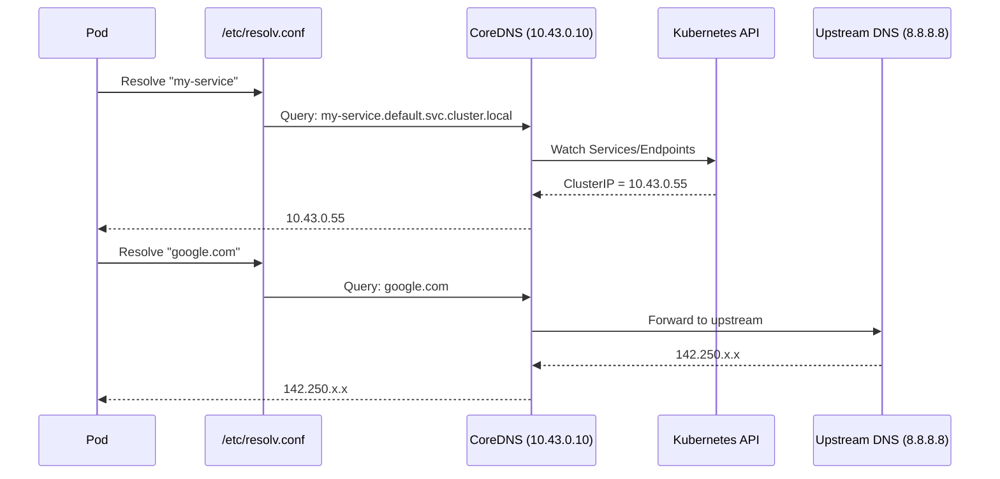
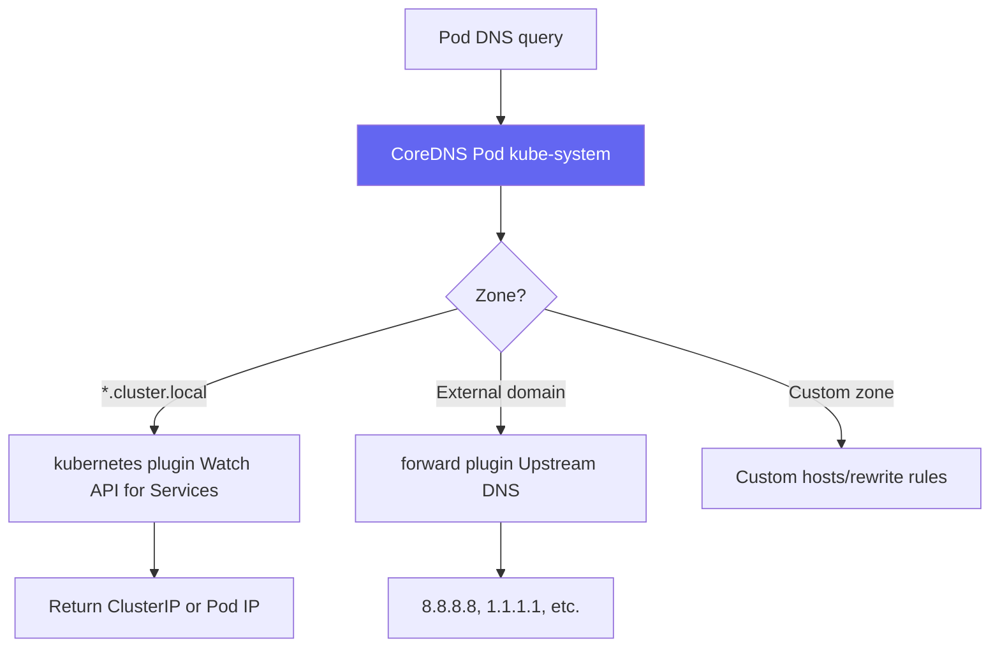
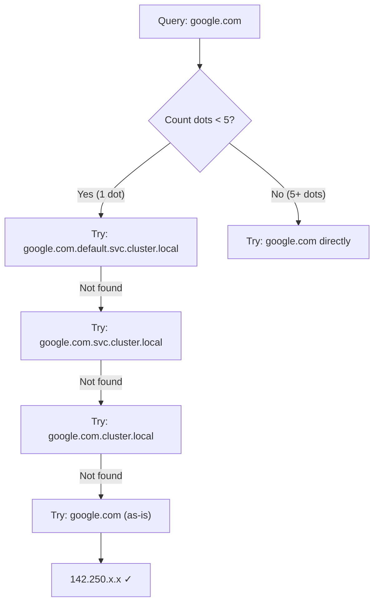

# DNS & CoreDNS

> Module 04 · Lesson 03 | [↑ Course Index](../README.md)

## Table of Contents

- [How DNS Works in k3s](#how-dns-works-in-k3s)
- [CoreDNS Architecture](#coredns-architecture)
- [DNS Name Formats](#dns-name-formats)
- [Configuring CoreDNS](#configuring-coredns)
- [Adding Custom DNS Entries](#adding-custom-dns-entries)
- [DNS for Pods](#dns-for-pods)
- [ndots & Search Domains](#ndots--search-domains)
- [Debugging DNS Issues](#debugging-dns-issues)
- [Common Pitfalls](#common-pitfalls)
- [Further Reading](#further-reading)

---

## How DNS Works in k3s

Every pod in k3s automatically uses CoreDNS for name resolution. When a pod starts, its `/etc/resolv.conf` is configured to point to the CoreDNS ClusterIP:

```bash
# Inside any pod:
cat /etc/resolv.conf
# nameserver 10.43.0.10        ← CoreDNS ClusterIP
# search default.svc.cluster.local svc.cluster.local cluster.local
# options ndots:5
```



[↑ Back to TOC](#table-of-contents) · [↑ Course Index](../README.md)

---

## CoreDNS Architecture



CoreDNS is deployed as a Deployment in the `kube-system` namespace:

```bash
kubectl get deployment coredns -n kube-system
kubectl get pods -n kube-system -l k8s-app=kube-dns

# View CoreDNS configuration
kubectl get configmap coredns -n kube-system -o yaml
```

Default CoreDNS config in k3s:

```
# Corefile
.:53 {
    errors
    health {
       lameduck 5s
    }
    ready
    kubernetes cluster.local in-addr.arpa ip6.arpa {
       pods insecure
       fallthrough in-addr.arpa ip6.arpa
       ttl 30
    }
    prometheus :9153
    forward . /etc/resolv.conf
    cache 30
    loop
    reload
    loadbalance
}
```

[↑ Back to TOC](#table-of-contents) · [↑ Course Index](../README.md)

---

## DNS Name Formats

| Name format | Resolves to | Example |
|------------|-------------|---------|
| `<service>` | Service in same namespace | `my-api` |
| `<service>.<namespace>` | Service in any namespace | `my-api.backend` |
| `<service>.<namespace>.svc` | Explicit svc subdomain | `my-api.backend.svc` |
| `<service>.<namespace>.svc.cluster.local` | Fully qualified | `my-api.backend.svc.cluster.local` |
| `<pod-ip-dashes>.<namespace>.pod.cluster.local` | Direct pod IP | `10-42-0-5.default.pod.cluster.local` |
| `<pod-ip-dashes>.<svc>.<namespace>.svc.cluster.local` | Pod via headless svc | `10-42-0-5.my-headless.default.svc.cluster.local` |

```bash
# Test each format
kubectl run -it --rm dns-test --image=busybox --restart=Never -- sh

# Inside the pod:
nslookup kubernetes
nslookup kubernetes.default
nslookup kubernetes.default.svc.cluster.local
nslookup coredns.kube-system.svc.cluster.local
```

[↑ Back to TOC](#table-of-contents) · [↑ Course Index](../README.md)

---

## Configuring CoreDNS

Edit the CoreDNS ConfigMap to customize behavior:

```bash
kubectl edit configmap coredns -n kube-system
```

### Forward to custom DNS servers

```
forward . 192.168.1.1 8.8.8.8 {
    prefer_udp
}
```

### Custom domain for on-prem DNS

```
# Resolve *.corp.internal via internal DNS server
corp.internal:53 {
    errors
    cache 30
    forward . 10.0.0.53
}
```

### Add this to the Corefile:

```bash
kubectl edit configmap coredns -n kube-system
# Add the corp.internal block before the final closing brace
```

After editing, restart CoreDNS:

```bash
kubectl rollout restart deployment/coredns -n kube-system
```

[↑ Back to TOC](#table-of-contents) · [↑ Course Index](../README.md)

---

## Adding Custom DNS Entries

### Method 1: NodeHosts configmap (k3s specific)

```yaml
apiVersion: v1
kind: ConfigMap
metadata:
  name: coredns
  namespace: kube-system
data:
  Corefile: |
    .:53 {
        errors
        health
        ready
        kubernetes cluster.local in-addr.arpa ip6.arpa {
           pods insecure
           fallthrough in-addr.arpa ip6.arpa
           ttl 30
        }
        hosts {
          192.168.1.50  legacy-db.internal
          192.168.1.51  legacy-api.internal
          fallthrough
        }
        prometheus :9153
        forward . /etc/resolv.conf
        cache 30
        loop
        reload
        loadbalance
    }
```

### Method 2: Rewrite plugin

```
rewrite name my-old-service.default.svc.cluster.local my-new-service.default.svc.cluster.local
```

[↑ Back to TOC](#table-of-contents) · [↑ Course Index](../README.md)

---

## DNS for Pods

### Pod DNS policy options

```yaml
spec:
  dnsPolicy: ClusterFirst    # default: use CoreDNS
  # dnsPolicy: ClusterFirstWithHostNet  # use CoreDNS even with hostNetwork
  # dnsPolicy: Default        # use node's /etc/resolv.conf
  # dnsPolicy: None           # configure via dnsConfig only
  dnsConfig:
    nameservers:
      - 8.8.8.8
    searches:
      - my-namespace.svc.cluster.local
    options:
      - name: ndots
        value: "5"
```

### Pod hostname and subdomain

```yaml
spec:
  hostname: my-pod-0
  subdomain: my-headless-svc
  # DNS: my-pod-0.my-headless-svc.namespace.svc.cluster.local
```

[↑ Back to TOC](#table-of-contents) · [↑ Course Index](../README.md)

---

## ndots & Search Domains

The `ndots:5` setting means: if the name has fewer than 5 dots, try appending search domains first before treating it as a fully-qualified domain:



This causes extra DNS queries for external names. To reduce latency for external lookups, use FQDNs ending with `.`:

```
# In application config, use trailing dot to skip search domains
google.com.     ← FQDN, won't trigger search domain expansion
```

Or reduce ndots:

```yaml
spec:
  dnsConfig:
    options:
      - name: ndots
        value: "2"   # only search-expand names with < 2 dots
```

[↑ Back to TOC](#table-of-contents) · [↑ Course Index](../README.md)

---

## Debugging DNS Issues

```bash
# --- Step 1: Check CoreDNS is running ---
kubectl get pods -n kube-system -l k8s-app=kube-dns

# --- Step 2: Run a debug pod ---
kubectl run -it --rm dns-debug \
  --image=nicolaka/netshoot \
  --restart=Never -- bash

# Inside netshoot:
# Basic resolution
nslookup kubernetes.default.svc.cluster.local
dig kubernetes.default.svc.cluster.local

# Check resolv.conf
cat /etc/resolv.conf

# Test external DNS
nslookup google.com

# Check which DNS server is being used
dig +short kubernetes.default.svc.cluster.local @10.43.0.10

# --- Step 3: Check CoreDNS logs ---
kubectl logs -n kube-system -l k8s-app=kube-dns --tail=50

# --- Step 4: Check CoreDNS config ---
kubectl get configmap coredns -n kube-system -o yaml

# --- Step 5: Check CoreDNS is reachable from the failing pod ---
kubectl exec -it my-failing-pod -- nslookup kubernetes 10.43.0.10
# If this fails but other pods work, it's a pod-level network issue

# --- Step 6: Verify CoreDNS ClusterIP ---
kubectl get svc -n kube-system kube-dns
# Should show 10.43.0.10 (or whatever your cluster DNS IP is)
```

[↑ Back to TOC](#table-of-contents) · [↑ Course Index](../README.md)

---

## Common Pitfalls

| Pitfall | Symptom | Fix |
|---------|---------|-----|
| CoreDNS crashlooping | DNS resolution fails cluster-wide | Check logs; often caused by bad Corefile syntax |
| Wrong upstream DNS | External names don't resolve | Check `forward` in Corefile; test with `nslookup google.com` from pod |
| ndots causing extra lookups | Slow DNS for external names | Lower `ndots` or use FQDN with trailing dot |
| Cross-namespace DNS fails | `service not found` errors | Use full name: `svc.namespace.svc.cluster.local` |
| Loop plugin causing high CPU | CoreDNS CPU spikes | Ensure node's `/etc/resolv.conf` doesn't point to CoreDNS IP |
| SELinux blocking DNS | CoreDNS permission denied | Check SELinux audit logs; install k3s SELinux policy |

[↑ Back to TOC](#table-of-contents) · [↑ Course Index](../README.md)

---

## Further Reading

- [CoreDNS Documentation](https://coredns.io/manual/toc/)
- [Kubernetes DNS Docs](https://kubernetes.io/docs/concepts/services-networking/dns-pod-service/)
- [CoreDNS Plugins](https://coredns.io/plugins/)

[↑ Back to TOC](#table-of-contents) · [↑ Course Index](../README.md)

---

*Licensed under [CC BY-NC-SA 4.0](../LICENSE.md) · © 2026 UncleJS*
