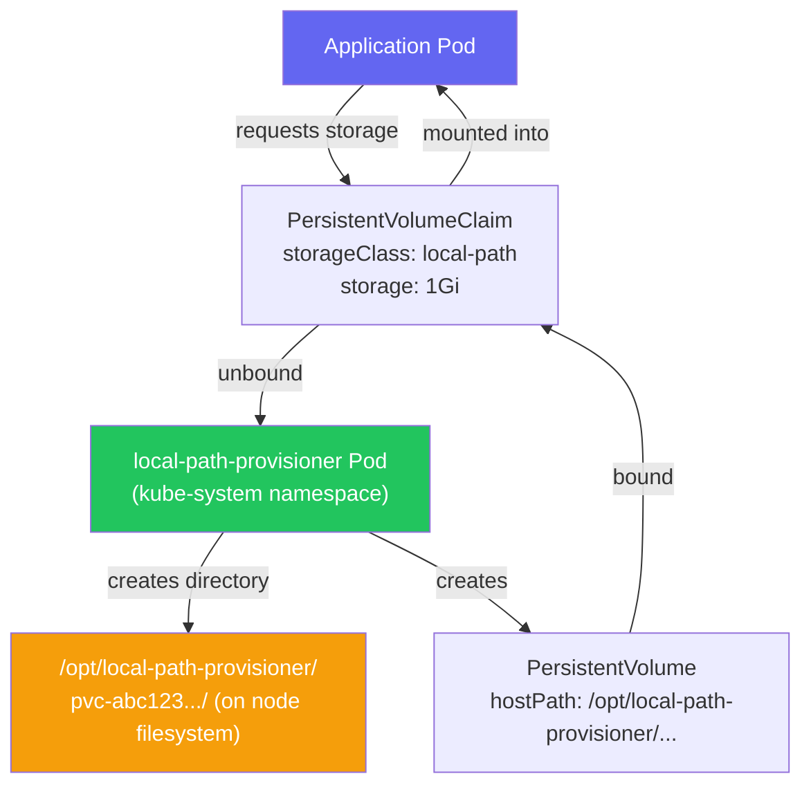
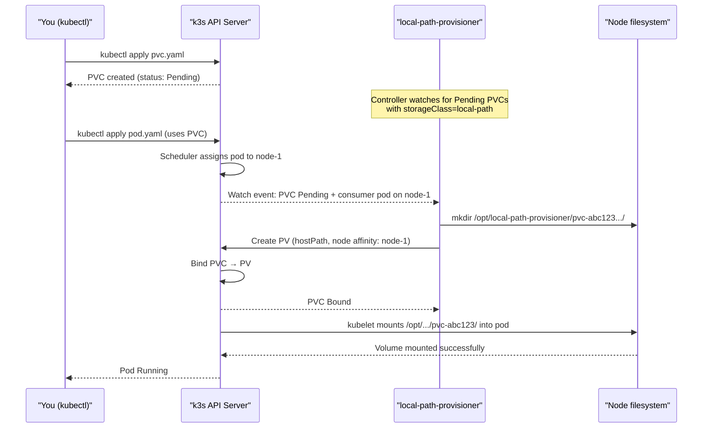
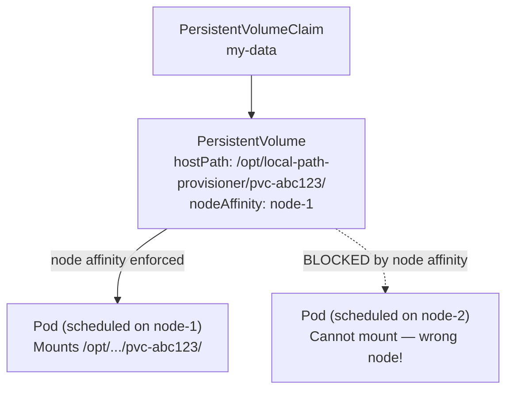
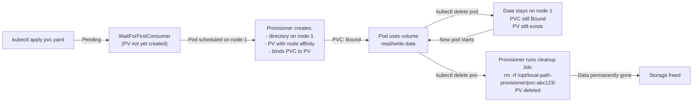
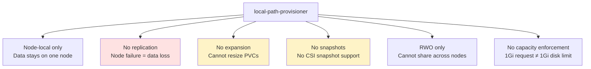

# Local Path Provisioner

> Module 05 · Lesson 01 | [↑ Course Index](../README.md)


[](../README.md)
[](../LICENSE.md)

## Table of Contents

- [What is the Local Path Provisioner?](#what-is-the-local-path-provisioner)
- [How the Provisioner Controller Loop Works](#how-the-provisioner-controller-loop-works)
- [Default StorageClass](#default-storageclass)
- [Creating a PVC](#creating-a-pvc)
- [Using PVCs in Pods](#using-pvcs-in-pods)
- [Data Location and Node Locality](#data-location-and-node-locality)
- [Data Lifecycle: Create, Delete, and What Happens In Between](#data-lifecycle-create-delete-and-what-happens-in-between)
- [Customizing the Provisioner](#customizing-the-provisioner)
- [Per-Node Path Configuration](#per-node-path-configuration)
- [Production Limitations](#production-limitations)
- [When to Graduate to Longhorn or NFS](#when-to-graduate-to-longhorn-or-nfs)
- [Common Pitfalls](#common-pitfalls)
- [Lab](#lab)
- [Further Reading](#further-reading)

---

## What is the Local Path Provisioner?

The **local-path-provisioner** is a storage provisioner bundled with k3s that automatically creates `PersistentVolumes` backed by directories on the node's local filesystem.

**No configuration required** — it works out of the box immediately after k3s installation. This makes it excellent for development, CI/CD environments, and small single-node production deployments where you need persistence without the complexity of a distributed storage system.



The provisioner is implemented as a standard Kubernetes controller — a pod running in `kube-system` that watches for unbound PVCs using the `local-path` StorageClass and acts on them.

[↑ Back to TOC](#table-of-contents) · [↑ Course Index](../README.md)

---

## How the Provisioner Controller Loop Works

Understanding the provisioner's reconciliation loop helps you reason about timing, failures, and what to do when things go wrong.



Key observations from this flow:

1. **WaitForFirstConsumer**: The PV is not created when the PVC is created — it's created when the first pod consuming the PVC is scheduled. This is why `kubectl get pvc` shows `Pending` until you deploy a pod.

2. **Node affinity**: The PV is created with a node affinity binding it to the node where the pod was scheduled. This means the pod will always be scheduled back to that same node — Kubernetes honours the PV's node affinity.

3. **Sequential watch**: If the provisioner pod is down or restarting, PVC provisioning is paused. The provisioner will catch up when it comes back online.

[↑ Back to TOC](#table-of-contents) · [↑ Course Index](../README.md)

---

## Default StorageClass

k3s marks `local-path` as the **default** StorageClass. Any PVC without an explicit `storageClassName` will use it automatically.

```bash
kubectl get storageclass
# NAME                   PROVISIONER             RECLAIMPOLICY   VOLUMEBINDINGMODE      ALLOWVOLUMEEXPANSION
# local-path (default)   rancher.io/local-path   Delete          WaitForFirstConsumer   false
```

| Setting | Value | Meaning |
|---------|-------|---------|
| `Provisioner` | `rancher.io/local-path` | The provisioner controller responsible |
| `ReclaimPolicy` | `Delete` | Directory is deleted when PVC is deleted — **data is permanently gone** |
| `VolumeBindingMode` | `WaitForFirstConsumer` | PV is created when a pod actually needs it, not when PVC is created |
| `AllowVolumeExpansion` | `false` | Cannot resize a volume after creation — size the PVC correctly upfront |

> **Setting a different default StorageClass:** If you install a second StorageClass (e.g., Longhorn) and want it to be the default, annotate it with `storageclass.kubernetes.io/is-default-class: "true"` and remove the annotation from `local-path`. You can only have one default StorageClass.

[↑ Back to TOC](#table-of-contents) · [↑ Course Index](../README.md)

---

## Creating a PVC

```yaml
# pvc-local-path.yaml
apiVersion: v1
kind: PersistentVolumeClaim
metadata:
  name: my-data
  namespace: default
spec:
  accessModes:
    - ReadWriteOnce           # RWO: only one pod/node can mount at a time
  storageClassName: local-path
  resources:
    requests:
      storage: 1Gi            # requested size (not enforced at OS level)
```

```bash
kubectl apply -f pvc-local-path.yaml

# PVC shows Pending until a pod uses it (WaitForFirstConsumer)
kubectl get pvc
# NAME      STATUS    VOLUME   CAPACITY   ACCESS MODES   STORAGECLASS   AGE
# my-data   Pending                                      local-path     5s

# Create a pod that uses it — PVC transitions to Bound
kubectl apply -f pod-with-pvc.yaml

# Now check again
kubectl get pvc
# NAME      STATUS   VOLUME            CAPACITY   ACCESS MODES   STORAGECLASS   AGE
# my-data   Bound    pvc-abc123...     1Gi        RWO            local-path     30s

# See the PV that was automatically created
kubectl get pv
```

### Access modes

| Mode | Abbreviation | Meaning |
|------|-------------|---------|
| `ReadWriteOnce` | RWO | One node can read/write |
| `ReadOnlyMany` | ROX | Multiple nodes can read |
| `ReadWriteMany` | RWX | Multiple nodes can read/write |
| `ReadWriteOncePod` | RWOP | One pod can read/write (k8s 1.22+) |

> `local-path` only supports `ReadWriteOnce`. For `ReadWriteMany` (shared volumes across multiple pods on different nodes), use NFS or Longhorn with RWX support.

[↑ Back to TOC](#table-of-contents) · [↑ Course Index](../README.md)

---

## Using PVCs in Pods

```yaml
apiVersion: apps/v1
kind: Deployment
metadata:
  name: app-with-storage
spec:
  replicas: 1          # WARNING: only 1 — local-path is ReadWriteOnce
  selector:
    matchLabels:
      app: app-with-storage
  template:
    metadata:
      labels:
        app: app-with-storage
    spec:
      containers:
        - name: app
          image: nginx:alpine
          volumeMounts:
            - name: data
              mountPath: /data    # where the volume appears inside the container
      volumes:
        - name: data
          persistentVolumeClaim:
            claimName: my-data   # must match PVC name
```

```bash
# Verify volume is mounted
kubectl exec -it <pod-name> -- df -h /data
# Filesystem      Size  Used Avail Use% Mounted on
# /dev/sda1        50G  2.1G   48G   5% /data

# Write data
kubectl exec -it <pod-name> -- sh -c "echo hello > /data/test.txt"
kubectl exec -it <pod-name> -- cat /data/test.txt
# hello

# Delete pod — data persists on the node's filesystem
kubectl delete pod <pod-name>
kubectl get pods -w    # wait for the new pod to start

# Verify data survived pod restart
kubectl exec -it <new-pod-name> -- cat /data/test.txt
# hello ← data survived!
```

[↑ Back to TOC](#table-of-contents) · [↑ Course Index](../README.md)

---

## Data Location and Node Locality

This is the most important characteristic of `local-path` to understand:



When `local-path` creates a PV, it embeds a `nodeAffinity` rule that binds the PV permanently to the node where it was first provisioned. The Kubernetes scheduler respects this affinity — it will only ever schedule pods that mount this PVC on that specific node.

```bash
# Find where the PV data is stored
kubectl get pv <pv-name> -o jsonpath='{.spec.hostPath.path}'
# /opt/local-path-provisioner/pvc-abc123-def456.../

# See the node affinity binding
kubectl get pv <pv-name> -o jsonpath='{.spec.nodeAffinity}'
# {"required":{"nodeSelectorTerms":[{"matchExpressions":[{"key":"kubernetes.io/hostname","operator":"In","values":["node-1"]}]}]}}

# On the node itself
sudo ls /opt/local-path-provisioner/
sudo ls /opt/local-path-provisioner/pvc-abc123.../
# your-files-are-here
```

> **Critical implication:** If `node-1` fails permanently and you delete the pod, the pod cannot be rescheduled on `node-2` because the PVC is bound to a PV with node affinity for `node-1`. Your application is stuck until `node-1` comes back online — or you accept data loss and recreate the PVC.

[↑ Back to TOC](#table-of-contents) · [↑ Course Index](../README.md)

---

## Data Lifecycle: Create, Delete, and What Happens In Between

Understanding the complete lifecycle prevents data loss surprises.



### The cleanup helper pod

When a PVC is deleted, the provisioner does NOT simply `rm -rf` on the host — it launches a short-lived **cleanup Job** pod:

```bash
# You can see this job briefly when deleting a PVC
kubectl get jobs -n kube-system
# NAME                                    COMPLETIONS   DURATION
# helper-pvc-abc123-def456-...            1/1           3s
```

This design avoids needing elevated host permissions directly in the provisioner — the helper pod runs with specific privileges only during cleanup.

### What "Delete" reclaim policy means in practice

With `ReclaimPolicy: Delete` (the default):
- Delete the PVC → provisioner deletes the directory → data is **permanently gone**
- There is no recycle bin or soft delete

If you want to keep data even after PVC deletion, you have two options:
1. **Before deleting**: copy data off the cluster first (`kubectl cp pod:/data /local/backup`)
2. **Change reclaim policy**: `kubectl patch pv <pv-name> -p '{"spec":{"persistentVolumeReclaimPolicy":"Retain"}}'` — the PV and data will survive PVC deletion (you must manually delete the PV later)

[↑ Back to TOC](#table-of-contents) · [↑ Course Index](../README.md)

---

## Customizing the Provisioner

### Change the default storage path

```bash
kubectl edit configmap local-path-config -n kube-system
```

```json
{
  "nodePathMap": [
    {
      "node": "DEFAULT_PATH_FOR_NON_LISTED_NODES",
      "paths": ["/opt/local-path-provisioner"]
    }
  ]
}
```

Change the default path for all nodes:

```json
{
  "nodePathMap": [
    {
      "node": "DEFAULT_PATH_FOR_NON_LISTED_NODES",
      "paths": ["/var/k3s-storage"]
    }
  ]
}
```

After editing, restart the provisioner for the change to take effect on new PVs (existing PVs are not affected):

```bash
kubectl rollout restart deployment/local-path-provisioner -n kube-system
```

[↑ Back to TOC](#table-of-contents) · [↑ Course Index](../README.md)

---

## Per-Node Path Configuration

Different nodes can use different storage paths — useful when some nodes have fast NVMe storage mounted at a specific path and others use a slower default disk:

```json
{
  "nodePathMap": [
    {
      "node": "DEFAULT_PATH_FOR_NON_LISTED_NODES",
      "paths": ["/opt/local-path-provisioner"]
    },
    {
      "node": "storage-node-01",
      "paths": ["/mnt/nvme0n1/k3s-storage"]
    },
    {
      "node": "storage-node-02",
      "paths": ["/mnt/nvme0n1/k3s-storage", "/mnt/nvme0n2/k3s-storage"]
    }
  ]
}
```

When multiple paths are specified for a node, the provisioner distributes new volumes across them (simple round-robin). This is a primitive form of striping — not RAID, but it spreads load across multiple disks.

> **Best practice:** Pin storage-heavy StatefulSets (databases, message queues) to the nodes with fast dedicated disks using node affinity or `nodeSelector`. Combine this with per-node path config to ensure the data lands on the fast disk.

[↑ Back to TOC](#table-of-contents) · [↑ Course Index](../README.md)

---

## Production Limitations

Before committing `local-path` to production, understand its hard limits:



### The capacity enforcement gotcha

A `storage: 1Gi` request in a PVC does NOT create a 1 GiB disk quota. The provisioner simply creates a directory — there is no underlying disk partition. A pod can write 10 GiB to a "1Gi PVC" if the underlying disk has space. This means:

- PVC capacity is advisory, not enforced
- Disk monitoring on the node is critical
- One misbehaving pod can fill the entire node's disk and crash other pods

```bash
# Monitor disk usage on nodes
kubectl top nodes   # doesn't show disk, only CPU/memory

# For disk monitoring, you need a DaemonSet (node-exporter) or
# check the node directly:
df -h /opt/local-path-provisioner/
du -sh /opt/local-path-provisioner/*/
```

[↑ Back to TOC](#table-of-contents) · [↑ Course Index](../README.md)

---

## When to Graduate to Longhorn or NFS

Use the following decision criteria:

| Requirement | local-path | Longhorn | NFS |
|------------|-----------|---------|-----|
| Node failure tolerance | ❌ | ✅ (replicated) | ✅ |
| Multiple pods mounting same volume (RWX) | ❌ | ✅ (with extra config) | ✅ |
| Volume snapshots / backups | ❌ | ✅ | ❌ |
| Volume expansion | ❌ | ✅ | ✅ |
| Setup complexity | ✅ Zero | Medium | Low |
| Resource overhead | ✅ Minimal | Medium (CSI pods) | Low |
| Works on single node | ✅ | ✅ | ✅ |
| Works on multiple nodes | ⚠️ (node-locked) | ✅ | ✅ |

**Graduate to Longhorn when:**
- You have a multi-node cluster with stateful workloads (databases, queues)
- You need node failure tolerance
- You want snapshot-based backups integrated with Velero

**Graduate to NFS when:**
- You already have an NFS server in your environment
- Multiple pods on different nodes need to share data (`ReadWriteMany`)
- You need cross-cluster or cross-platform shared storage

**Stay on local-path when:**
- Single-node k3s (dev, CI, edge devices)
- Stateless workloads with cache volumes (data loss on pod restart is acceptable)
- Databases with their own replication (PostgreSQL streaming replication, MySQL Galera)

[↑ Back to TOC](#table-of-contents) · [↑ Course Index](../README.md)

---

## Common Pitfalls

| Pitfall | Symptom | Fix |
|---------|---------|-----|
| PVC stuck `Pending` | No pod using it (WaitForFirstConsumer) | Normal — deploy a pod that mounts it |
| Pod stuck `Pending` after node change | `0/N nodes available: N pod has unbound immediate PersistentVolumeClaims` | local-path PVCs are node-locked; pod must run on same node |
| Disk full — pods fail to start | `no space left on device` | Monitor disk on nodes; PVCs don't enforce capacity |
| Deleted PVC loses all data | Data gone permanently | ReclaimPolicy=Delete; backup data before deleting PVC |
| Can't scale Deployment to 3 replicas | Only 1 pod starts; others pending | local-path is ReadWriteOnce; only one pod per node can mount |
| Provisioner pod restarted — PVC stuck Pending | Provisioner missed the event | `kubectl rollout restart deployment/local-path-provisioner -n kube-system` |

[↑ Back to TOC](#table-of-contents) · [↑ Course Index](../README.md)

---

## Lab

### Exercise 1 — Basic PVC provisioning

```bash
# 1. Create a PVC
kubectl apply -f - <<'EOF'
apiVersion: v1
kind: PersistentVolumeClaim
metadata:
  name: lab-data
spec:
  accessModes: [ReadWriteOnce]
  storageClassName: local-path
  resources:
    requests:
      storage: 500Mi
EOF

# 2. Check status (should be Pending — no consumer yet)
kubectl get pvc lab-data

# 3. Create a pod that uses it
kubectl apply -f - <<'EOF'
apiVersion: v1
kind: Pod
metadata:
  name: data-writer
spec:
  containers:
    - name: writer
      image: busybox:latest
      command: ['sh', '-c', 'echo "data written at $(date)" > /data/log.txt && sleep 3600']
      volumeMounts:
        - name: storage
          mountPath: /data
  volumes:
    - name: storage
      persistentVolumeClaim:
        claimName: lab-data
EOF

# 4. Watch PVC become Bound
kubectl get pvc lab-data -w

# 5. Find where the data lives on the node
PV_NAME=$(kubectl get pvc lab-data -o jsonpath='{.spec.volumeName}')
kubectl get pv $PV_NAME -o jsonpath='{.spec.hostPath.path}'
```

### Exercise 2 — Data persistence through pod restart

```bash
# 1. Read the data from the pod
kubectl exec data-writer -- cat /data/log.txt

# 2. Delete the pod
kubectl delete pod data-writer

# 3. Check that PVC is still Bound (data survives)
kubectl get pvc lab-data

# 4. Create a new pod with the same PVC
kubectl run data-reader --image=busybox \
  --overrides='{"spec":{"volumes":[{"name":"d","persistentVolumeClaim":{"claimName":"lab-data"}}],"containers":[{"name":"data-reader","image":"busybox","command":["cat","/data/log.txt"],"volumeMounts":[{"name":"d","mountPath":"/data"}]}],"restartPolicy":"Never"}}' \
  -- cat /data/log.txt

# Data is still there!
kubectl logs data-reader
```

### Clean up

```bash
kubectl delete pod data-writer data-reader --ignore-not-found
kubectl delete pvc lab-data
```

[↑ Back to TOC](#table-of-contents) · [↑ Course Index](../README.md)

---

## Further Reading

- [local-path-provisioner GitHub](https://github.com/rancher/local-path-provisioner)
- [Kubernetes Persistent Volumes](https://kubernetes.io/docs/concepts/storage/persistent-volumes/)
- [Storage Classes](https://kubernetes.io/docs/concepts/storage/storage-classes/)
- [Module 05 Lesson 03: Longhorn Setup](03_longhorn_setup.md)

[↑ Back to TOC](#table-of-contents) · [↑ Course Index](../README.md)

---

*Licensed under [CC BY-NC-SA 4.0](../LICENSE.md) · © 2026 UncleJS*
