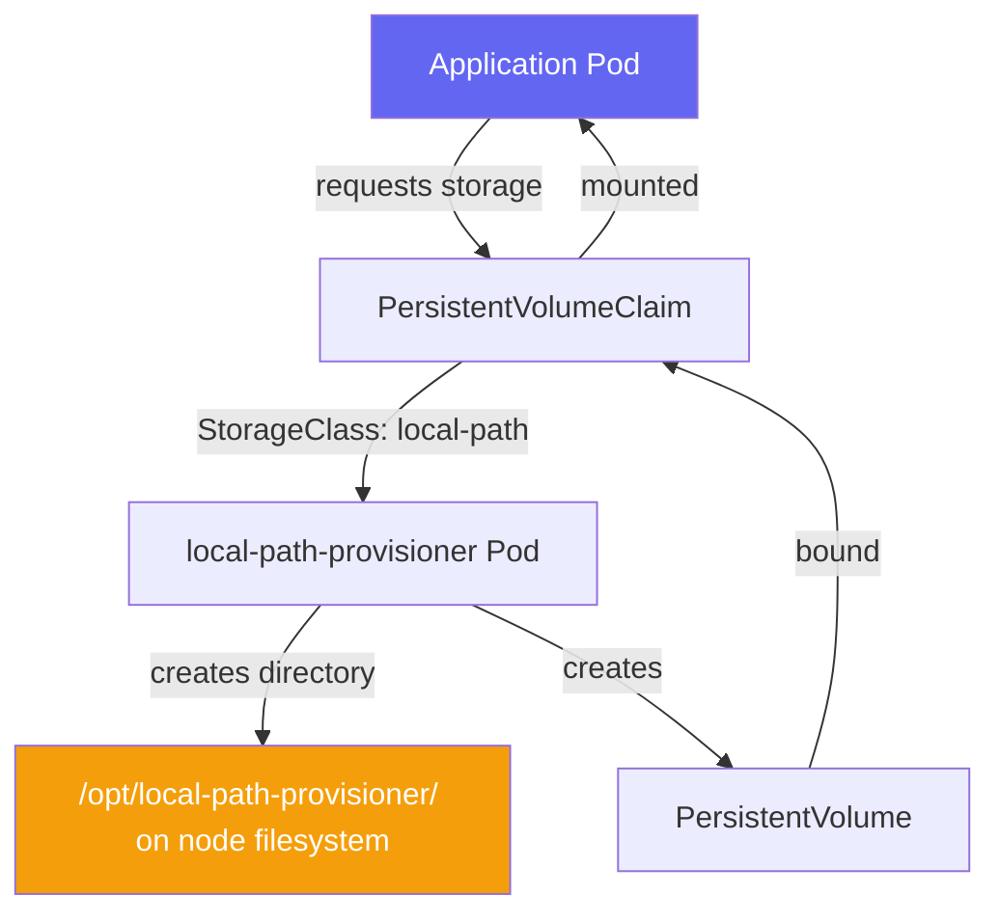

# Local Path Provisioner

> Module 05 · Lesson 01 | [↑ Course Index](../README.md)

## Table of Contents

- [What is the Local Path Provisioner?](#what-is-the-local-path-provisioner)
- [How It Works](#how-it-works)
- [Default StorageClass](#default-storageclass)
- [Creating a PVC](#creating-a-pvc)
- [Using PVCs in Pods](#using-pvcs-in-pods)
- [Data Location on the Node](#data-location-on-the-node)
- [Customizing the Provisioner](#customizing-the-provisioner)
- [Limitations](#limitations)
- [Common Pitfalls](#common-pitfalls)
- [Further Reading](#further-reading)

---

## What is the Local Path Provisioner?

The **local-path-provisioner** is a storage provisioner bundled with k3s that automatically creates `PersistentVolumes` backed by directories on the node's local filesystem.

**No configuration required** — it works out of the box after k3s installation.



[↑ Back to TOC](#table-of-contents) · [↑ Course Index](../README.md)

---

## How It Works

When you create a PVC with the `local-path` StorageClass:

1. The provisioner watches for unbound PVCs
2. It creates a directory: `/opt/local-path-provisioner/<namespace>-<pvc-name>-<pv-name>/`
3. It creates a PV pointing to that directory
4. The PVC binds to the PV
5. When the PVC is deleted, the provisioner deletes the directory

```bash
# Watch the provisioning process
kubectl get events --sort-by=.lastTimestamp -w &

# Create a PVC
kubectl apply -f labs/pvc-local-path.yaml

# Watch the PV get created automatically
kubectl get pv
```

[↑ Back to TOC](#table-of-contents) · [↑ Course Index](../README.md)

---

## Default StorageClass

k3s marks `local-path` as the **default** StorageClass. Any PVC without an explicit `storageClassName` will use it:

```bash
kubectl get storageclass
# NAME                   PROVISIONER             RECLAIMPOLICY   VOLUMEBINDINGMODE      ALLOWVOLUMEEXPANSION
# local-path (default)   rancher.io/local-path   Delete          WaitForFirstConsumer   false
```

Key settings:
| Setting | Value | Meaning |
|---------|-------|---------|
| `ReclaimPolicy` | `Delete` | Directory is deleted when PVC is deleted |
| `VolumeBindingMode` | `WaitForFirstConsumer` | PV is created when a pod actually needs it (not when PVC is created) |
| `AllowVolumeExpansion` | `false` | Cannot resize volumes after creation |

[↑ Back to TOC](#table-of-contents) · [↑ Course Index](../README.md)

---

## Creating a PVC

```yaml
# pvc-local-path.yaml
apiVersion: v1
kind: PersistentVolumeClaim
metadata:
  name: my-data
  namespace: default
spec:
  accessModes:
    - ReadWriteOnce           # only one pod/node at a time
  storageClassName: local-path
  resources:
    requests:
      storage: 1Gi
```

```bash
kubectl apply -f pvc-local-path.yaml

# PVC will show Pending until a pod tries to use it (WaitForFirstConsumer)
kubectl get pvc
# NAME      STATUS    VOLUME   CAPACITY   ACCESS MODES   STORAGECLASS   AGE
# my-data   Pending                                      local-path     5s

# Create a pod that uses it — then check again
kubectl get pvc
# NAME      STATUS   VOLUME            CAPACITY   ACCESS MODES   STORAGECLASS   AGE
# my-data   Bound    pvc-abc123...     1Gi        RWO            local-path     30s
```

[↑ Back to TOC](#table-of-contents) · [↑ Course Index](../README.md)

---

## Using PVCs in Pods

```yaml
apiVersion: apps/v1
kind: Deployment
metadata:
  name: app-with-storage
spec:
  replicas: 1
  selector:
    matchLabels:
      app: app-with-storage
  template:
    metadata:
      labels:
        app: app-with-storage
    spec:
      containers:
        - name: app
          image: nginx:alpine
          volumeMounts:
            - name: data
              mountPath: /data    # where the volume appears inside the container
      volumes:
        - name: data
          persistentVolumeClaim:
            claimName: my-data   # must match PVC name
```

```bash
# Verify volume is mounted
kubectl exec -it <pod-name> -- df -h /data
kubectl exec -it <pod-name> -- ls /data

# Write data
kubectl exec -it <pod-name> -- sh -c "echo hello > /data/test.txt"

# Delete and recreate pod — data persists
kubectl delete pod <pod-name>
kubectl get pods -w
# new pod starts...
kubectl exec -it <new-pod-name> -- cat /data/test.txt
# hello ← data survived pod restart
```

[↑ Back to TOC](#table-of-contents) · [↑ Course Index](../README.md)

---

## Data Location on the Node

```bash
# Find where the PV data is stored on the node
kubectl get pv <pv-name> -o jsonpath='{.spec.hostPath.path}'
# /opt/local-path-provisioner/pvc-abc123.../

# On the node itself:
sudo ls /opt/local-path-provisioner/
sudo ls /opt/local-path-provisioner/pvc-abc123.../
```

> **Important:** The data is stored on the **node where the pod is scheduled**. If you reschedule the pod to a different node, the data will NOT follow it. This is why `local-path` is not suitable for applications that may move between nodes.

[↑ Back to TOC](#table-of-contents) · [↑ Course Index](../README.md)

---

## Customizing the Provisioner

Change the default storage path:

```bash
# Edit the local-path-config ConfigMap
kubectl edit configmap local-path-config -n kube-system
```

```yaml
data:
  config.json: |-
    {
      "nodePathMap": [
        {
          "node": "DEFAULT_PATH_FOR_NON_LISTED_NODES",
          "paths": ["/opt/local-path-provisioner"]
        },
        {
          "node": "my-storage-node",
          "paths": ["/mnt/fast-disk/k3s-storage"]
        }
      ]
    }
```

After editing, restart the provisioner:

```bash
kubectl rollout restart deployment/local-path-provisioner -n kube-system
```

[↑ Back to TOC](#table-of-contents) · [↑ Course Index](../README.md)

---

## Limitations

| Limitation | Detail | Solution |
|-----------|--------|---------|
| Node-local only | Data lives on one node | Use Longhorn, NFS, or Ceph for replicated storage |
| No volume expansion | Cannot increase PVC size after creation | Pre-provision with sufficient size, or use a StorageClass that supports expansion |
| No snapshots | No CSI snapshot support | Use Velero or Longhorn for backups |
| `ReadWriteOnce` only | Only one node can mount at a time | Use NFS or CephFS for `ReadWriteMany` |
| Data lost if node fails | Not replicated | Use Longhorn for HA storage (Module 05 Lesson 03) |

[↑ Back to TOC](#table-of-contents) · [↑ Course Index](../README.md)

---

## Common Pitfalls

| Pitfall | Symptom | Fix |
|---------|---------|-----|
| PVC stuck `Pending` | No pod using it (WaitForFirstConsumer) | Normal — deploy a pod that mounts it |
| Pod can't start after node change | `Volume is already exclusively attached` | `local-path` PVCs are node-local; pod must run on same node |
| Disk full | Pods fail to start | Monitor disk usage; PVs are not capacity-enforced by the provisioner |
| Deleted PVC loses data | Data gone permanently | PVC ReclaimPolicy is `Delete` — backup first! |

[↑ Back to TOC](#table-of-contents) · [↑ Course Index](../README.md)

---

## Further Reading

- [local-path-provisioner GitHub](https://github.com/rancher/local-path-provisioner)
- [Kubernetes Persistent Volumes](https://kubernetes.io/docs/concepts/storage/persistent-volumes/)

[↑ Back to TOC](#table-of-contents) · [↑ Course Index](../README.md)

---

*Licensed under [CC BY-NC-SA 4.0](../LICENSE.md) · © 2026 UncleJS*
