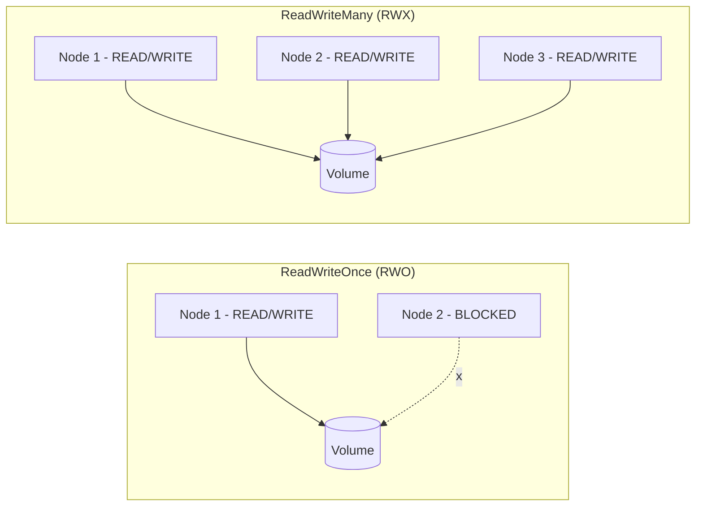
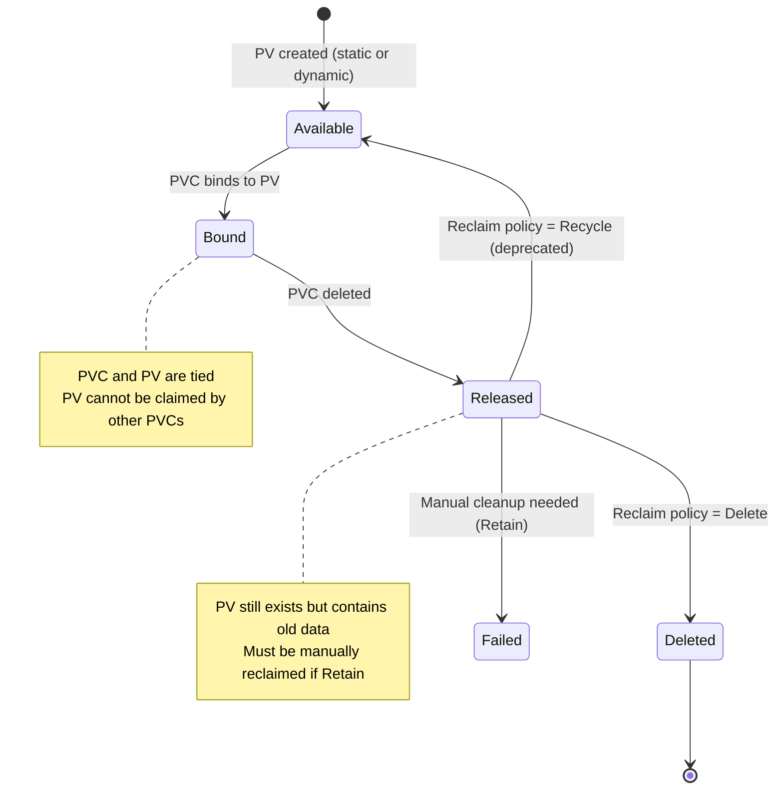
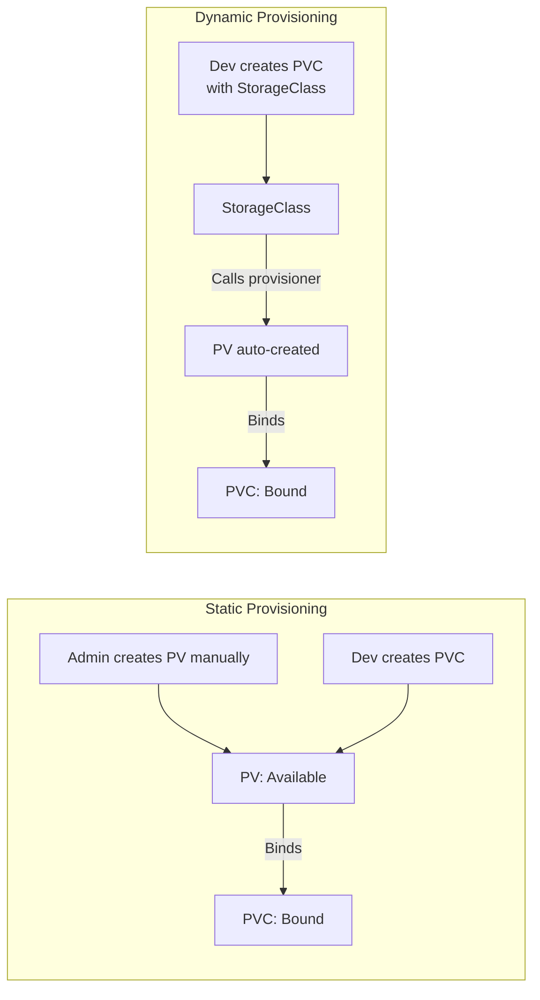

# Persistent Volumes & PVCs

> Module 05 · Lesson 02 | [↑ Course Index](../README.md)

## Table of Contents

- [Storage Concepts](#storage-concepts)
- [PersistentVolume (PV)](#persistentvolume-pv)
- [PersistentVolumeClaim (PVC)](#persistentvolumeclaim-pvc)
- [StorageClass](#storageclass)
- [Access Modes](#access-modes)
- [Reclaim Policies](#reclaim-policies)
- [PV/PVC Lifecycle](#pvpvc-lifecycle)
- [Volume Binding Modes](#volume-binding-modes)
- [Static vs Dynamic Provisioning](#static-vs-dynamic-provisioning)
- [Volume Snapshots](#volume-snapshots)
- [Common Pitfalls](#common-pitfalls)
- [Further Reading](#further-reading)

---

## Storage Concepts

```mermaid
graph TB
    subgraph "Developer"
        PVC[PersistentVolumeClaim\n"I need 10Gi ReadWriteOnce"]
    end
    subgraph "Cluster Admin / Provisioner"
        SC[StorageClass\n"local-path, longhorn, nfs"]
        PV[PersistentVolume\n"10Gi on node-1 at /mnt/data"]
    end
    subgraph "Underlying Storage"
        DISK["Local disk / NFS / Block device"]
    end

    PVC -->|"binds via StorageClass"| PV
    PV --> DISK
    SC -->|"dynamically provisions"| PV

    style PVC fill:#6366f1,color:#fff
    style SC fill:#22c55e,color:#fff
    style PV fill:#f59e0b,color:#fff
```

The separation of concerns:
- **PV** — cluster-level resource representing actual storage
- **PVC** — namespace-level resource representing a storage request
- **StorageClass** — defines how PVs are provisioned dynamically

[↑ Back to TOC](#table-of-contents) · [↑ Course Index](../README.md)

---

## PersistentVolume (PV)

A PV is a piece of storage provisioned by an admin or dynamically by a StorageClass:

```yaml
# Manual (static) PV — hostPath example
apiVersion: v1
kind: PersistentVolume
metadata:
  name: manual-pv-01
  labels:
    type: local
spec:
  capacity:
    storage: 5Gi
  accessModes:
    - ReadWriteOnce
  persistentVolumeReclaimPolicy: Retain
  storageClassName: manual
  hostPath:
    path: /mnt/data/pv01
    type: DirectoryOrCreate
```

```bash
kubectl apply -f manual-pv.yaml
kubectl get pv
# NAME           CAPACITY   ACCESS MODES   RECLAIM POLICY   STATUS      STORAGECLASS   AGE
# manual-pv-01   5Gi        RWO            Retain           Available   manual         5s
```

[↑ Back to TOC](#table-of-contents) · [↑ Course Index](../README.md)

---

## PersistentVolumeClaim (PVC)

A PVC requests storage from the cluster:

```yaml
apiVersion: v1
kind: PersistentVolumeClaim
metadata:
  name: app-data
  namespace: production
spec:
  accessModes:
    - ReadWriteOnce
  resources:
    requests:
      storage: 2Gi
  storageClassName: local-path    # must match a StorageClass or PV's storageClassName
  # Optional: bind to specific PV
  # volumeName: manual-pv-01
  # Optional: label selector to match specific PVs
  # selector:
  #   matchLabels:
  #     type: local
```

```bash
kubectl apply -f pvc.yaml
kubectl get pvc -n production
# NAME       STATUS    VOLUME                         CAPACITY   ACCESS MODES   STORAGECLASS   AGE
# app-data   Bound     pvc-a1b2c3d4-...               2Gi        RWO            local-path     10s
```

[↑ Back to TOC](#table-of-contents) · [↑ Course Index](../README.md)

---

## StorageClass

StorageClasses define the type of storage and how it's provisioned:

```yaml
apiVersion: storage.k8s.io/v1
kind: StorageClass
metadata:
  name: fast-local
  annotations:
    storageclass.kubernetes.io/is-default-class: "false"
provisioner: rancher.io/local-path
volumeBindingMode: WaitForFirstConsumer
reclaimPolicy: Delete
allowVolumeExpansion: false
parameters:
  # provisioner-specific parameters
```

```bash
# List StorageClasses
kubectl get storageclass
kubectl get sc   # shorthand

# Set a StorageClass as default
kubectl patch storageclass local-path \
  -p '{"metadata": {"annotations":{"storageclass.kubernetes.io/is-default-class":"true"}}}'

# Remove default from a StorageClass
kubectl patch storageclass old-default \
  -p '{"metadata": {"annotations":{"storageclass.kubernetes.io/is-default-class":"false"}}}'
```

[↑ Back to TOC](#table-of-contents) · [↑ Course Index](../README.md)

---

## Access Modes

| Mode | Short | Meaning |
|------|-------|---------|
| `ReadWriteOnce` | RWO | One node can read and write |
| `ReadOnlyMany` | ROX | Many nodes can read, none can write |
| `ReadWriteMany` | RWX | Many nodes can read and write |
| `ReadWriteOncePod` | RWOP | Only one **pod** can read and write (k8s 1.22+) |



> **k3s local-path** only supports `ReadWriteOnce`. For RWX, use NFS or Longhorn with the appropriate driver.

[↑ Back to TOC](#table-of-contents) · [↑ Course Index](../README.md)

---

## Reclaim Policies

What happens to a PV when its PVC is deleted:

| Policy | Behavior | Use case |
|--------|---------|---------|
| `Delete` | PV and underlying storage deleted | Dynamic provisioning (default) |
| `Retain` | PV preserved, must be manually cleaned | Production data, audit trails |
| `Recycle` | Deprecated — do not use | — |

```bash
# Check PV's reclaim policy
kubectl get pv <pv-name> -o jsonpath='{.spec.persistentVolumeReclaimPolicy}'

# Change reclaim policy (e.g., protect critical data)
kubectl patch pv my-pv -p '{"spec":{"persistentVolumeReclaimPolicy":"Retain"}}'
```

[↑ Back to TOC](#table-of-contents) · [↑ Course Index](../README.md)

---

## PV/PVC Lifecycle



```bash
# Full PVC lifecycle demo
kubectl apply -f pvc-local-path.yaml

# Check PVC status
kubectl get pvc

# Use in a pod
kubectl apply -f pod-with-pvc.yaml
kubectl exec -it <pod> -- sh -c "echo data > /mnt/test.txt"

# Delete the pod (data stays)
kubectl delete pod <pod>

# Delete the PVC (triggers PV deletion if policy=Delete)
kubectl delete pvc <pvc-name>

# Check PV is gone (or retained)
kubectl get pv
```

[↑ Back to TOC](#table-of-contents) · [↑ Course Index](../README.md)

---

## Volume Binding Modes

| Mode | Behavior | Best for |
|------|---------|---------|
| `Immediate` | PV created as soon as PVC is created | Network storage (NFS, cloud) |
| `WaitForFirstConsumer` | PV created when a pod needs it | Local storage (ensures same node) |

`WaitForFirstConsumer` is critical for `local-path` — it ensures the PV is created on the node where the pod will run.

[↑ Back to TOC](#table-of-contents) · [↑ Course Index](../README.md)

---

## Static vs Dynamic Provisioning



**Static:** Admin creates PVs ahead of time. PVCs are matched by size, access mode, and label selectors.

**Dynamic:** (preferred) StorageClass triggers automatic PV creation when a PVC is submitted.

[↑ Back to TOC](#table-of-contents) · [↑ Course Index](../README.md)

---

## Volume Snapshots

Supported by CSI drivers (Longhorn, etc.) — not available with local-path:

```yaml
# VolumeSnapshot (requires CSI snapshot controller)
apiVersion: snapshot.storage.k8s.io/v1
kind: VolumeSnapshot
metadata:
  name: my-snapshot
spec:
  volumeSnapshotClassName: longhorn
  source:
    persistentVolumeClaimName: my-data
```

```bash
# Install CSI snapshot controller (required for snapshots)
kubectl apply -f https://raw.githubusercontent.com/kubernetes-csi/external-snapshotter/v7.0.1/client/config/crd/snapshot.storage.k8s.io_volumesnapshotclasses.yaml
kubectl apply -f https://raw.githubusercontent.com/kubernetes-csi/external-snapshotter/v7.0.1/client/config/crd/snapshot.storage.k8s.io_volumesnapshotcontents.yaml
kubectl apply -f https://raw.githubusercontent.com/kubernetes-csi/external-snapshotter/v7.0.1/client/config/crd/snapshot.storage.k8s.io_volumesnapshots.yaml
```

[↑ Back to TOC](#table-of-contents) · [↑ Course Index](../README.md)

---

## Common Pitfalls

| Pitfall | Symptom | Fix |
|---------|---------|-----|
| PVC stuck `Pending` | No matching PV or StorageClass | Check `kubectl describe pvc` for "no matching PV" or "no StorageClass" |
| Wrong `storageClassName` | PVC not binding | Ensure PVC and PV storageClassNames match exactly |
| Size mismatch | PVC doesn't bind to PV | PVC size must be ≤ PV size for static binding |
| Access mode mismatch | PVC doesn't bind | PVC access modes must be subset of PV's modes |
| `Delete` reclaim policy | Data lost on PVC delete | Change to `Retain` for important data |
| Pod won't start after node move | Volume not found | local-path PVCs are node-local — don't reschedule to different nodes |

[↑ Back to TOC](#table-of-contents) · [↑ Course Index](../README.md)

---

## Further Reading

- [Kubernetes PV Docs](https://kubernetes.io/docs/concepts/storage/persistent-volumes/)
- [StorageClass Docs](https://kubernetes.io/docs/concepts/storage/storage-classes/)
- [CSI Volume Snapshots](https://kubernetes.io/docs/concepts/storage/volume-snapshots/)
- [Storage Cheatsheet](../cheatsheets/storage-cheatsheet.md)

[↑ Back to TOC](#table-of-contents) · [↑ Course Index](../README.md)

---

*Licensed under [CC BY-NC-SA 4.0](../LICENSE.md) · © 2026 UncleJS*
