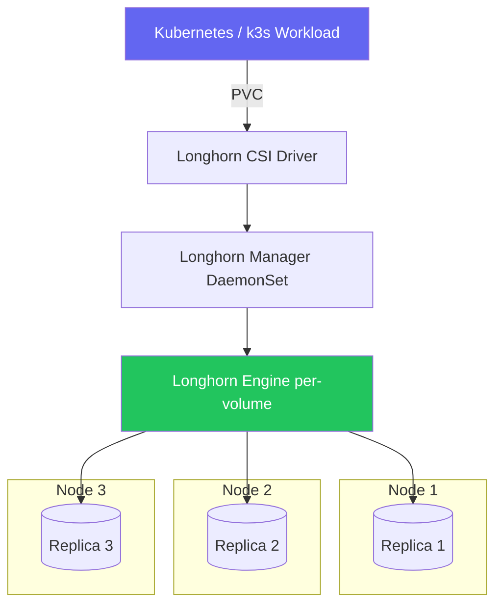
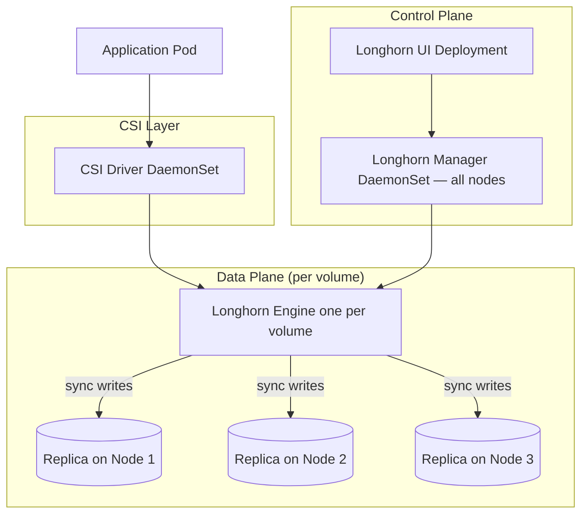
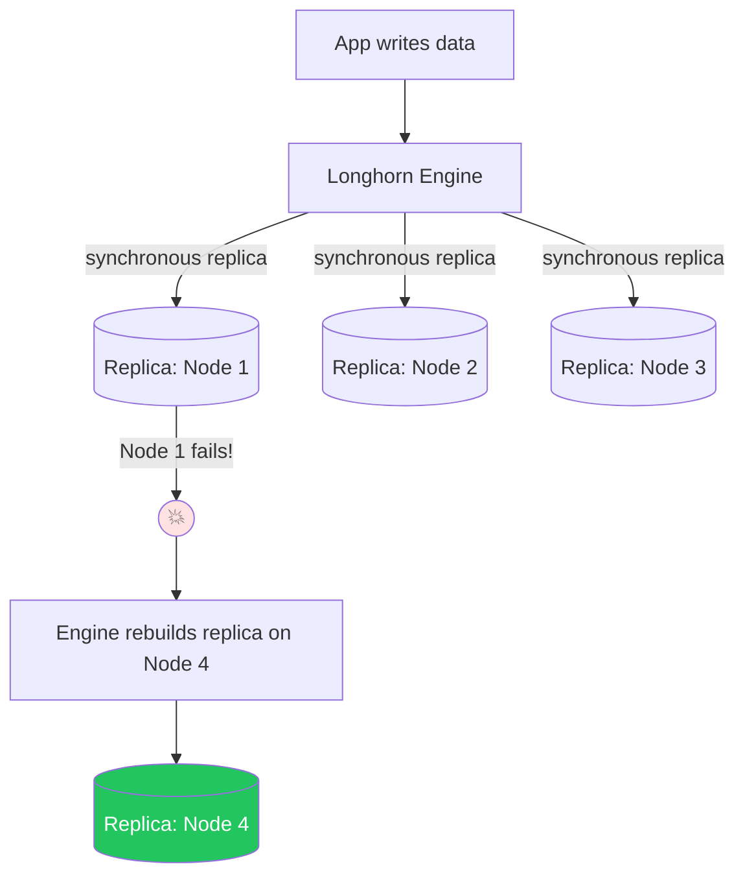
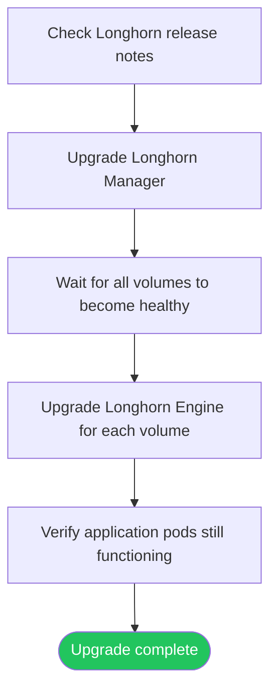

# Longhorn Setup

> Module 05 · Lesson 03 | [↑ Course Index](../README.md)


[](../README.md)
[](../LICENSE.md)

## Table of Contents

- [What is Longhorn?](#what-is-longhorn)
- [Longhorn Architecture](#longhorn-architecture)
- [Prerequisites](#prerequisites)
- [Installing Longhorn](#installing-longhorn)
- [Accessing the Longhorn UI](#accessing-the-longhorn-ui)
- [Creating Volumes with Longhorn](#creating-volumes-with-longhorn)
- [Volume Replication](#volume-replication)
- [Longhorn Snapshots & Backups](#longhorn-snapshots--backups)
- [Monitoring Longhorn](#monitoring-longhorn)
- [Upgrading Longhorn](#upgrading-longhorn)
- [Common Pitfalls](#common-pitfalls)
- [Further Reading](#further-reading)

---

## What is Longhorn?

**Longhorn** is a cloud-native, distributed block storage system for Kubernetes, originally developed by Rancher Labs (now SUSE). It provides:

- **Replicated block storage** across multiple nodes
- **Volume snapshots** and backups to S3/NFS
- **Cross-node volume recovery** when a node fails
- **Built-in CSI driver** for Kubernetes integration
- **Web UI** for easy management



[↑ Back to TOC](#table-of-contents) · [↑ Course Index](../README.md)

---

## Longhorn Architecture



| Component | Role |
|-----------|------|
| Longhorn Manager | Orchestrates volume creation, scheduling, recovery |
| Longhorn Engine | One per volume; handles replication to replicas |
| Replicas | Actual data storage on each node |
| CSI Driver | Standard Kubernetes storage interface |
| Instance Manager | Manages engine and replica processes |

[↑ Back to TOC](#table-of-contents) · [↑ Course Index](../README.md)

---

## Prerequisites

```bash
# Check required packages on each node
sudo apt-get install -y open-iscsi nfs-common   # Debian/Ubuntu
sudo yum install -y iscsi-initiator-utils nfs-utils  # RHEL/CentOS/Fedora
sudo dnf install -y iscsi-initiator-utils nfs-utils  # Fedora/RHEL 9

# Enable and start iscsid
sudo systemctl enable --now iscsid

# Verify open-iscsi
sudo iscsiadm -m session

# Check kernel modules
lsmod | grep dm_multipath
# If not loaded (and needed):
# sudo modprobe dm_multipath

# Run Longhorn's environment check script
curl -sSfL https://raw.githubusercontent.com/longhorn/longhorn/v1.6.0/scripts/environment_check.sh | bash
```

[↑ Back to TOC](#table-of-contents) · [↑ Course Index](../README.md)

---

## Installing Longhorn

### Method 1: Helm (recommended)

```bash
# Add Longhorn Helm repo
helm repo add longhorn https://charts.longhorn.io
helm repo update

# Install Longhorn
helm install longhorn longhorn/longhorn \
  --namespace longhorn-system \
  --create-namespace \
  --version 1.6.0

# Watch pods come up
kubectl get pods -n longhorn-system -w
# All pods should reach Running state (takes 2-3 minutes)
```

### Method 2: kubectl apply

```bash
kubectl apply -f https://raw.githubusercontent.com/longhorn/longhorn/v1.6.0/deploy/longhorn.yaml

# Wait for all pods
kubectl rollout status deployment/longhorn-manager -n longhorn-system
```

### Method 3: k3s HelmChart CRD (auto-deploy)

```yaml
# /var/lib/rancher/k3s/server/manifests/longhorn.yaml
apiVersion: helm.cattle.io/v1
kind: HelmChart
metadata:
  name: longhorn
  namespace: kube-system
spec:
  repo: https://charts.longhorn.io
  chart: longhorn
  targetNamespace: longhorn-system
  createNamespace: true
  version: "1.6.0"
```

[↑ Back to TOC](#table-of-contents) · [↑ Course Index](../README.md)

---

## Accessing the Longhorn UI

```bash
# Port-forward the Longhorn UI
kubectl port-forward svc/longhorn-frontend -n longhorn-system 8080:80

# Open in browser: http://localhost:8080
```

For persistent access, create an Ingress:

```yaml
apiVersion: networking.k8s.io/v1
kind: Ingress
metadata:
  name: longhorn-ui
  namespace: longhorn-system
  annotations:
    traefik.ingress.kubernetes.io/router.entrypoints: web
spec:
  rules:
    - host: longhorn.example.com
      http:
        paths:
          - path: /
            pathType: Prefix
            backend:
              service:
                name: longhorn-frontend
                port:
                  number: 80
```

[↑ Back to TOC](#table-of-contents) · [↑ Course Index](../README.md)

---

## Creating Volumes with Longhorn

After installing Longhorn, a new `longhorn` StorageClass is available:

```bash
kubectl get storageclass
# NAME                   PROVISIONER          RECLAIMPOLICY   VOLUMEBINDINGMODE
# local-path (default)   rancher.io/local-path  Delete       WaitForFirstConsumer
# longhorn               driver.longhorn.io     Delete       Immediate
```

```yaml
# pvc-longhorn.yaml
apiVersion: v1
kind: PersistentVolumeClaim
metadata:
  name: longhorn-data
spec:
  accessModes:
    - ReadWriteOnce
  storageClassName: longhorn
  resources:
    requests:
      storage: 5Gi
```

```bash
kubectl apply -f pvc-longhorn.yaml
kubectl get pvc longhorn-data
# STATUS: Bound immediately (Immediate binding mode)
```

[↑ Back to TOC](#table-of-contents) · [↑ Course Index](../README.md)

---

## Volume Replication

Longhorn replicates volumes across nodes for high availability:



Configure replication per StorageClass or per volume:

```yaml
apiVersion: storage.k8s.io/v1
kind: StorageClass
metadata:
  name: longhorn-3-replicas
provisioner: driver.longhorn.io
parameters:
  numberOfReplicas: "3"          # default is 3
  staleReplicaTimeout: "2880"    # minutes before considering replica stale
  fromBackup: ""
  fsType: ext4
reclaimPolicy: Delete
volumeBindingMode: Immediate
allowVolumeExpansion: true       # ← Longhorn supports volume expansion!
```

[↑ Back to TOC](#table-of-contents) · [↑ Course Index](../README.md)

---

## Longhorn Snapshots & Backups

### Snapshots

```bash
# Via UI: Volume → Create Snapshot
# Via kubectl:
kubectl apply -f - <<'EOF'
apiVersion: longhorn.io/v1beta2
kind: Snapshot
metadata:
  name: my-snapshot
  namespace: longhorn-system
spec:
  volume: pvc-abc123   # Longhorn volume name
EOF
```

### Backups to S3

```bash
# Configure S3 backup target in Longhorn UI:
# Settings → Backup Target: s3://my-bucket@us-east-1/longhorn

# Or via kubectl
kubectl edit configmap longhorn-default-setting -n longhorn-system
# Set:
# backup-target: s3://my-bucket@us-east-1/longhorn
# backup-target-credential-secret: aws-secret

# Create AWS credentials secret
kubectl create secret generic aws-secret \
  -n longhorn-system \
  --from-literal=AWS_ACCESS_KEY_ID=<key> \
  --from-literal=AWS_SECRET_ACCESS_KEY=<secret>
```

[↑ Back to TOC](#table-of-contents) · [↑ Course Index](../README.md)

---

## Monitoring Longhorn

```bash
# Node storage overview
kubectl get nodes.longhorn.io -n longhorn-system

# Volume status
kubectl get volumes.longhorn.io -n longhorn-system

# Replica status
kubectl get replicas.longhorn.io -n longhorn-system

# Longhorn manager logs
kubectl logs -n longhorn-system -l app=longhorn-manager --tail=50
```

[↑ Back to TOC](#table-of-contents) · [↑ Course Index](../README.md)

---

## Upgrading Longhorn



```bash
# Upgrade via Helm
helm upgrade longhorn longhorn/longhorn \
  --namespace longhorn-system \
  --version 1.7.0

# Check upgrade status
kubectl rollout status deployment/longhorn-manager -n longhorn-system

# After manager upgrade, upgrade engines (via UI or CLI)
# Longhorn UI: Volume → Upgrade Engine
```

[↑ Back to TOC](#table-of-contents) · [↑ Course Index](../README.md)

---

## Common Pitfalls

| Pitfall | Symptom | Fix |
|---------|---------|-----|
| open-iscsi not installed | Longhorn pods CrashLoopBackOff | Install `open-iscsi` on every node |
| Not enough nodes for replicas | Volumes stuck Degraded | Use `numberOfReplicas: 1` for single-node clusters |
| Disk space exhaustion | Volumes stuck Degraded or read-only | Add disk space or evict data |
| Node drain without Longhorn-aware drain | Volumes lose replicas | Use `kubectl cordon` + wait for replica rebuilds before drain |
| Large volume rebuild after node failure | High network I/O | Expected — Longhorn rebuilds replicas; wait for completion |

[↑ Back to TOC](#table-of-contents) · [↑ Course Index](../README.md)

---

## Further Reading

- [Longhorn Documentation](https://longhorn.io/docs/)
- [Longhorn GitHub](https://github.com/longhorn/longhorn)
- [k3s + Longhorn Tutorial](https://docs.k3s.io/storage)

[↑ Back to TOC](#table-of-contents) · [↑ Course Index](../README.md)

---

*Licensed under [CC BY-NC-SA 4.0](../LICENSE.md) · © 2026 UncleJS*
