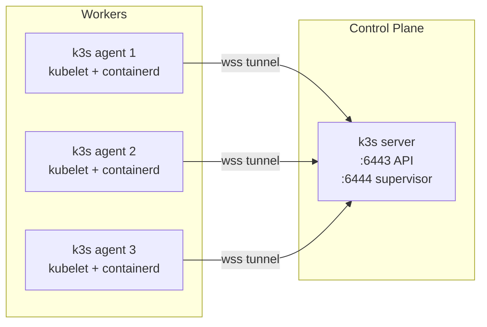
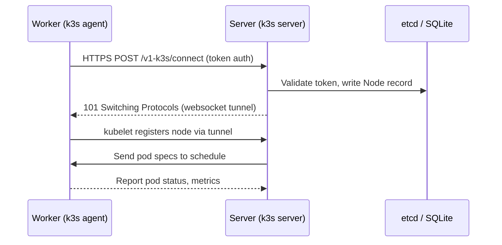

# Adding Agent Nodes
> Module 06 · Lesson 01 | [↑ Course Index](../README.md)

## Table of Contents
- [Overview](#overview)
- [How k3s Agent Nodes Work](#how-k3s-agent-nodes-work)
- [Prerequisites](#prerequisites)
- [Retrieve the Node Token](#retrieve-the-node-token)
- [Join an Agent Node](#join-an-agent-node)
- [Verify the Node Joined](#verify-the-node-joined)
- [Agent Node Architecture](#agent-node-architecture)
- [Environment Variables vs Flags](#environment-variables-vs-flags)
- [Systemd Service on the Agent](#systemd-service-on-the-agent)
- [Common Join Problems](#common-join-problems)
- [Lab](#lab)

---

## Overview

A k3s cluster becomes truly powerful when you add **agent nodes** — worker machines that run your workloads while the server node handles the control plane. This lesson walks through the exact steps to join one or more Linux hosts to an existing k3s server.

[↑ Back to TOC](#table-of-contents) · [↑ Course Index](../README.md)

---

## How k3s Agent Nodes Work

A k3s **agent** (worker) node:

- Runs `k3s agent` (not `k3s server`)
- Connects back to the server via a websocket tunnel (`wss://`)
- Runs the **kubelet** and **kube-proxy** equivalents
- Does **not** run the API server, scheduler, or controller manager
- Pulls and runs container workloads via `containerd`



[↑ Back to TOC](#table-of-contents) · [↑ Course Index](../README.md)

---

## Prerequisites

Before joining an agent node ensure:

| Requirement | Detail |
|-------------|--------|
| OS | Linux (same distros supported as server) |
| Arch | amd64, arm64, or armv7 |
| Network | Agent can reach server on **port 6443** (API) and **port 6444** (supervisor) |
| Firewall | Open TCP 6443 and 6444 on the server-side firewall |
| Hostname | Unique hostname per node (`hostnamectl set-hostname worker-01`) |
| Time sync | NTP/chrony synchronized — clock skew breaks TLS |
| No k3s yet | Agent node must **not** already have k3s installed |

Check reachability from the agent:
```bash
# From the worker node
curl -k https://<SERVER_IP>:6443/readyz
# Expected: ok
```

[↑ Back to TOC](#table-of-contents) · [↑ Course Index](../README.md)

---

## Retrieve the Node Token

The node token is a shared secret stored on the server. Every agent must present it to join.

```bash
# On the SERVER node
sudo cat /var/lib/rancher/k3s/server/node-token
# Example output:
# K10abc123::server:def456...
```

> **Security note:** Treat the node token like a password. It grants the right to join the cluster. Rotate it periodically with `k3s token rotate`.

[↑ Back to TOC](#table-of-contents) · [↑ Course Index](../README.md)

---

## Join an Agent Node

Run the following on each **worker** machine:

```bash
# Method 1 — environment variables (recommended for scripting)
export K3S_URL="https://<SERVER_IP>:6443"
export K3S_TOKEN="<NODE_TOKEN>"
curl -sfL https://get.k3s.io | sh -

# Method 2 — inline one-liner
curl -sfL https://get.k3s.io | \
  K3S_URL=https://<SERVER_IP>:6443 \
  K3S_TOKEN=<NODE_TOKEN> \
  sh -
```

What this does:
1. Downloads and installs the `k3s` binary
2. Creates a **systemd unit** `k3s-agent.service`
3. Writes config to `/etc/rancher/k3s/config.yaml`
4. Starts the agent and connects to the server

[↑ Back to TOC](#table-of-contents) · [↑ Course Index](../README.md)

---

## Verify the Node Joined

Back on the **server** (or from any machine with a valid kubeconfig):

```bash
kubectl get nodes -o wide
```

Expected output:
```
NAME        STATUS   ROLES                  AGE   VERSION        INTERNAL-IP
server-01   Ready    control-plane,master   10m   v1.29.x+k3s1  192.168.1.10
worker-01   Ready    <none>                 2m    v1.29.x+k3s1  192.168.1.11
worker-02   Ready    <none>                 1m    v1.29.x+k3s1  192.168.1.12
```

Check that the new node is `Ready`. If it shows `NotReady`, inspect the agent logs:

```bash
# On the worker node
sudo journalctl -u k3s-agent -f --no-pager
```

[↑ Back to TOC](#table-of-contents) · [↑ Course Index](../README.md)

---

## Agent Node Architecture



[↑ Back to TOC](#table-of-contents) · [↑ Course Index](../README.md)

---

## Environment Variables vs Flags

You can also configure the agent via `/etc/rancher/k3s/config.yaml` instead of environment variables:

```yaml
# /etc/rancher/k3s/config.yaml on the worker
server: "https://192.168.1.10:6443"
token: "K10abc123::server:def456..."
node-label:
  - "role=worker"
  - "zone=us-east-1a"
```

Or pass flags directly:
```bash
curl -sfL https://get.k3s.io | sh -s - \
  --server https://192.168.1.10:6443 \
  --token K10abc123::server:def456... \
  --node-label role=worker
```

| Method | Best for |
|--------|----------|
| Environment variables | CI/CD pipelines, ephemeral builds |
| `config.yaml` | Persistent, version-controlled config |
| CLI flags | Quick testing / one-offs |

[↑ Back to TOC](#table-of-contents) · [↑ Course Index](../README.md)

---

## Systemd Service on the Agent

After installation, the agent runs as a systemd service:

```bash
# Check agent service status
sudo systemctl status k3s-agent

# Restart agent
sudo systemctl restart k3s-agent

# Enable at boot (already done by installer)
sudo systemctl enable k3s-agent

# View recent logs
sudo journalctl -u k3s-agent --since "5 minutes ago"
```

The agent's config and data live at:
```
/etc/rancher/k3s/          # config files
/var/lib/rancher/k3s/      # agent state, containerd data
/var/log/                  # logs (via journald)
```

[↑ Back to TOC](#table-of-contents) · [↑ Course Index](../README.md)

---

## Common Join Problems

| Symptom | Likely Cause | Fix |
|---------|--------------|-----|
| `connection refused :6443` | Firewall blocking port | Open TCP 6443/6444 on server |
| `unauthorized: bad credentials` | Wrong token | Re-copy token from `/var/lib/rancher/k3s/server/node-token` |
| Node stays `NotReady` | Time skew > 5 min | Sync NTP: `chronyc makestep` |
| Node stays `NotReady` | CNI not ready | Wait 60s; check flannel pods on server |
| `certificate signed by unknown authority` | Wrong server IP | Use the IP/hostname in the server's TLS SAN |
| Duplicate node name | Same hostname | `hostnamectl set-hostname worker-02` before joining |

[↑ Back to TOC](#table-of-contents) · [↑ Course Index](../README.md)

---

## Lab

See [`labs/join-agent.sh`](labs/join-agent.sh) for a complete scripted walkthrough that:
- Validates network reachability
- Retrieves the node token automatically (when run on the server)
- Joins worker nodes
- Verifies cluster membership

```bash
# Run on server to generate the join command for workers
bash labs/join-agent.sh --generate

# Run on each worker node
bash labs/join-agent.sh --join --server 192.168.1.10 --token K10...
```

[↑ Back to TOC](#table-of-contents) · [↑ Course Index](../README.md)

---
*Licensed under [CC BY-NC-SA 4.0](../LICENSE.md) · © 2026 UncleJS*
