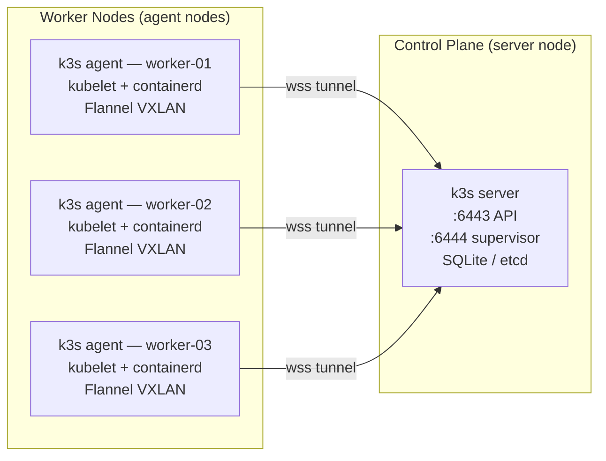
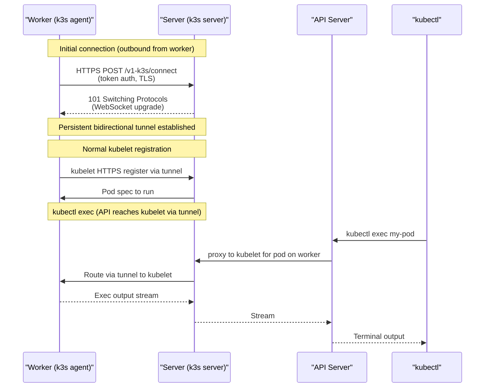
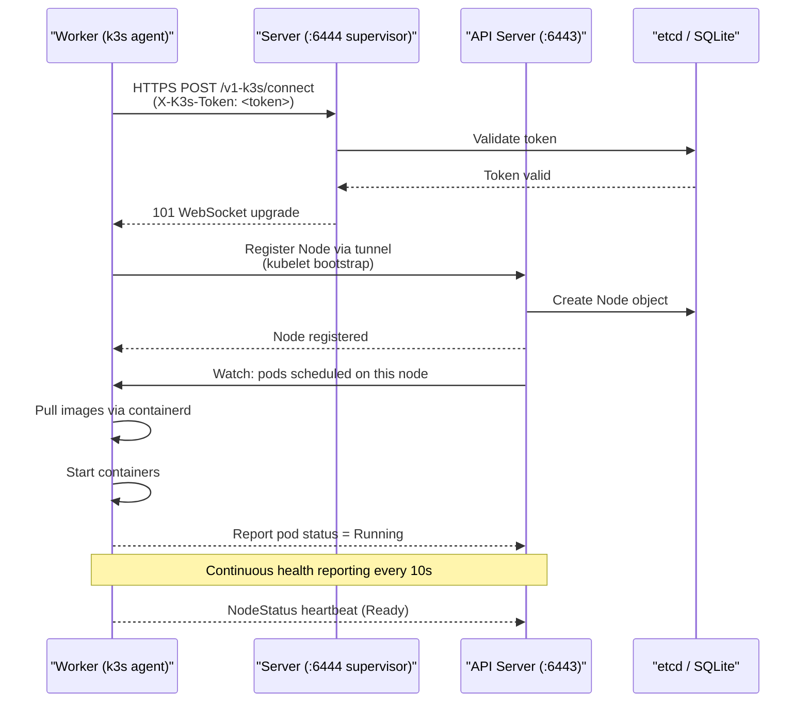
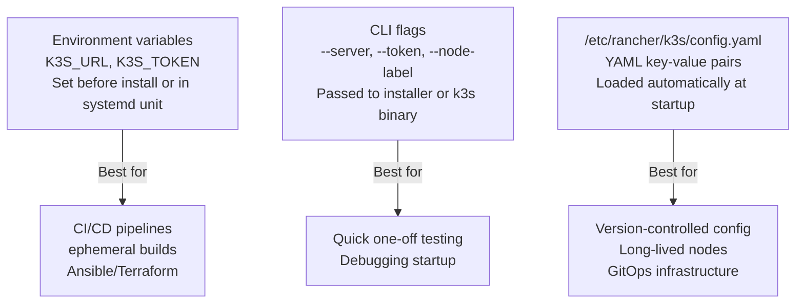
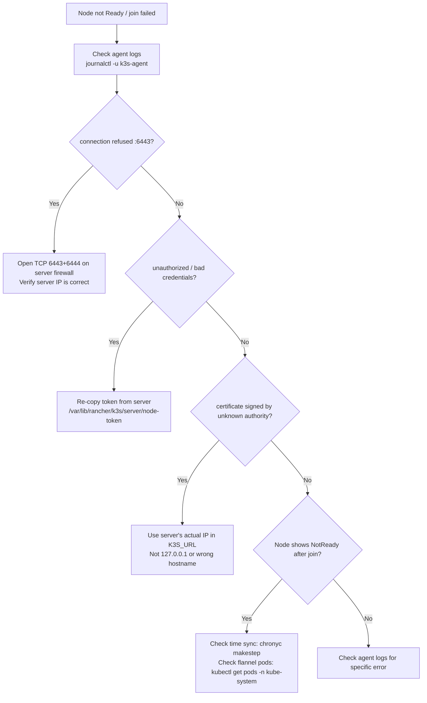

# Adding Agent Nodes

> Module 06 · Lesson 01 | [↑ Course Index](../README.md)


[](../README.md)
[](../LICENSE.md)

## Table of Contents

- [Overview](#overview)
- [How k3s Agent Nodes Work](#how-k3s-agent-nodes-work)
- [The WebSocket Tunnel Mechanics](#the-websocket-tunnel-mechanics)
- [Prerequisites](#prerequisites)
- [Retrieve the Node Token](#retrieve-the-node-token)
- [Join an Agent Node](#join-an-agent-node)
- [Verify the Node Joined](#verify-the-node-joined)
- [Agent Node Architecture](#agent-node-architecture)
- [containerd on Agent Nodes](#containerd-on-agent-nodes)
- [Environment Variables vs Flags vs config.yaml](#environment-variables-vs-flags-vs-configyaml)
- [Systemd Service on the Agent](#systemd-service-on-the-agent)
- [Troubleshooting Join Failures](#troubleshooting-join-failures)
- [Removing an Agent Node](#removing-an-agent-node)
- [Lab](#lab)

---

## Overview

A k3s cluster becomes truly powerful when you add **agent nodes** — worker machines that run your workloads while the server node handles the control plane. Distributing workloads across multiple nodes provides:

- **Horizontal scaling**: run more pods than a single node can handle
- **Node failure tolerance**: if one worker fails, pods reschedule on healthy workers
- **Resource isolation**: pin high-CPU or high-memory workloads to dedicated nodes
- **Geographic distribution**: place nodes in different racks, availability zones, or edge locations

This lesson walks through the exact steps to join one or more Linux hosts to an existing k3s server, explains what happens under the hood during join, and gives you a systematic troubleshooting guide for when things go wrong.

[↑ Back to TOC](#table-of-contents) · [↑ Course Index](../README.md)

---

## How k3s Agent Nodes Work

A k3s **agent** (worker) node:

- Runs `k3s agent` (not `k3s server`)
- Connects back to the server via a **WebSocket tunnel** (`wss://`)
- Runs the **kubelet** and **kube-proxy** equivalents embedded in the k3s binary
- Does **not** run the API server, scheduler, or controller manager
- Pulls and runs container workloads via the bundled **containerd**
- Manages its own CNI (Flannel VXLAN overlay, same subnet as server)



The key architectural point is that agents do **not** connect to the API server directly for all operations. Most communication flows through the WebSocket tunnel on port 6444 (the supervisor port) which also serves as a reverse tunnel for the kubelet's webhook callbacks.

[↑ Back to TOC](#table-of-contents) · [↑ Course Index](../README.md)

---

## The WebSocket Tunnel Mechanics

k3s uses a custom bidirectional WebSocket tunnel (based on the `remotedialer` library from Rancher) to solve a fundamental problem: the API server needs to reach the kubelet (for exec, logs, port-forward), but in many environments — NAT, firewalls, cloud security groups — the server cannot initiate connections to worker nodes.

The tunnel inverts the connection direction:



This design means:
- Only **port 6443** (API) and **port 6444** (supervisor) on the server need to be reachable from workers
- Workers do not need any inbound ports open
- NAT traversal is handled by the outbound connection from the worker

[↑ Back to TOC](#table-of-contents) · [↑ Course Index](../README.md)

---

## Prerequisites

Before joining an agent node ensure:

| Requirement | Detail |
|-------------|--------|
| OS | Linux (same distros supported as server) |
| Arch | amd64, arm64, or armv7 |
| Network | Agent can reach server on **port 6443** (API) and **port 6444** (supervisor) |
| Firewall | Open TCP 6443 and 6444 inbound on the server; no inbound needed on worker |
| Hostname | Unique hostname per node (`hostnamectl set-hostname worker-01`) |
| Time sync | NTP/chrony synchronized — clock skew > 5 min breaks TLS certificates |
| No k3s yet | Agent node must **not** already have k3s installed |
| Sufficient memory | Minimum 512 MB RAM; 1 GB+ recommended for running actual workloads |

Verify reachability from the worker node before running the installer:

```bash
# From the worker node — test server reachability
nc -zv <SERVER_IP> 6443
nc -zv <SERVER_IP> 6444

# Or with a TLS check (expected: "ok")
# (install curl if not present)
curl -k https://<SERVER_IP>:6443/readyz
```

[↑ Back to TOC](#table-of-contents) · [↑ Course Index](../README.md)

---

## Retrieve the Node Token

The node token is a shared secret that authenticates agents to the server. It is stored on the server and never changes unless you rotate it.

```bash
# On the SERVER node
sudo cat /var/lib/rancher/k3s/server/node-token
# K10abc123def456::server:xyz789abc...
```

> **Security note:** The node token grants the right to join the cluster. A compromised token allows an attacker to add a rogue node that could intercept pod scheduling, read cluster secrets, or exfiltrate workloads. Treat it like a root password: don't paste it in chat, don't commit it to Git, and rotate it periodically with `k3s token rotate`.

[↑ Back to TOC](#table-of-contents) · [↑ Course Index](../README.md)

---

## Join an Agent Node

Run the following on each **worker** machine:

```bash
# Method 1 — environment variables (clean, recommended for scripting)
export K3S_URL="https://<SERVER_IP>:6443"
export K3S_TOKEN="<NODE_TOKEN>"
curl -sfL https://get.k3s.io | sh -

# Method 2 — inline one-liner
curl -sfL https://get.k3s.io | \
  K3S_URL=https://<SERVER_IP>:6443 \
  K3S_TOKEN=<NODE_TOKEN> \
  sh -

# Method 3 — config file (best for reproducible infrastructure)
sudo mkdir -p /etc/rancher/k3s
sudo tee /etc/rancher/k3s/config.yaml <<'EOF'
server: "https://192.168.1.10:6443"
token: "K10abc123::server:def456..."
node-label:
  - "role=worker"
EOF
curl -sfL https://get.k3s.io | sh -
```

What the installer does:

1. Downloads the `k3s` binary to `/usr/local/bin/k3s`
2. Creates the systemd unit `/etc/systemd/system/k3s-agent.service`
3. Enables the service to start at boot
4. Starts the agent — it immediately connects to the server

[↑ Back to TOC](#table-of-contents) · [↑ Course Index](../README.md)

---

## Verify the Node Joined

Back on the **server** (or from any machine with a valid kubeconfig):

```bash
kubectl get nodes -o wide
```

Expected output:

```
NAME        STATUS   ROLES                  AGE   VERSION        INTERNAL-IP    OS-IMAGE
server-01   Ready    control-plane,master   10m   v1.29.x+k3s1  192.168.1.10   Ubuntu 22.04
worker-01   Ready    <none>                 2m    v1.29.x+k3s1  192.168.1.11   Ubuntu 22.04
worker-02   Ready    <none>                 1m    v1.29.x+k3s1  192.168.1.12   Ubuntu 22.04
```

Newly joined worker nodes have role `<none>`. This is normal — only control-plane nodes get their role labels set automatically. You can add a role label manually:

```bash
kubectl label node worker-01 node-role.kubernetes.io/worker=worker
kubectl get nodes  # now shows role "worker"
```

Check that the new node is `Ready`. If it shows `NotReady`, inspect the agent logs:

```bash
# On the worker node
sudo journalctl -u k3s-agent -f --no-pager
sudo journalctl -u k3s-agent --since "5 minutes ago" --no-pager
```

[↑ Back to TOC](#table-of-contents) · [↑ Course Index](../README.md)

---

## Agent Node Architecture

The complete flow from agent startup to ready node:



[↑ Back to TOC](#table-of-contents) · [↑ Course Index](../README.md)

---

## containerd on Agent Nodes

k3s bundles containerd as its container runtime — no Docker installation required. Each agent node runs its own containerd instance, configured and managed by k3s.

```bash
# View containerd status on agent node
sudo systemctl status containerd   # (managed by k3s, not as a separate service)

# Interact with containerd directly using crictl
sudo k3s crictl ps          # list running containers
sudo k3s crictl images      # list cached images
sudo k3s crictl logs <id>   # view container logs

# Or use ctr (lower-level)
sudo k3s ctr containers list
sudo k3s ctr images list

# Containerd data directory on agent
ls /var/lib/rancher/k3s/agent/containerd/
```

### Image pre-pulling (air-gap / slow networks)

For air-gapped environments or nodes with slow internet, pre-load images before joining:

```bash
# On the agent node, before joining:
# Create the images directory
sudo mkdir -p /var/lib/rancher/k3s/agent/images/

# Copy a tarball of images
sudo cp myapp-image.tar /var/lib/rancher/k3s/agent/images/

# k3s will automatically import these when the agent starts
```

[↑ Back to TOC](#table-of-contents) · [↑ Course Index](../README.md)

---

## Environment Variables vs Flags vs config.yaml

Three equivalent ways to configure an agent node, with different trade-offs:



```yaml
# /etc/rancher/k3s/config.yaml on the worker
server: "https://192.168.1.10:6443"
token: "K10abc123::server:def456..."
node-label:
  - "role=worker"
  - "zone=us-east-1a"
  - "hardware=gpu"
node-taint:
  - "dedicated=gpu:NoSchedule"    # prevent non-GPU pods from landing here
kubelet-arg:
  - "max-pods=110"                # default is 110; increase for dense nodes
  - "eviction-hard=memory.available<200Mi"
```

| Method | Best for |
|--------|----------|
| Environment variables | CI/CD pipelines, ephemeral builds |
| `config.yaml` | Persistent, version-controlled config |
| CLI flags | Quick testing / one-offs |

[↑ Back to TOC](#table-of-contents) · [↑ Course Index](../README.md)

---

## Systemd Service on the Agent

After installation, the agent runs as a systemd service:

```bash
# Check agent service status
sudo systemctl status k3s-agent

# View the full service definition
sudo systemctl cat k3s-agent

# Restart agent (e.g., after config change)
sudo systemctl restart k3s-agent

# Enable at boot (already done by installer)
sudo systemctl enable k3s-agent

# View recent logs
sudo journalctl -u k3s-agent --since "5 minutes ago"

# Follow live logs
sudo journalctl -u k3s-agent -f --no-pager
```

The agent's config and data live at:

```
/etc/rancher/k3s/config.yaml      # agent configuration
/var/lib/rancher/k3s/agent/       # agent state: containerd data, kubelet data
/var/lib/rancher/k3s/agent/containerd/  # container images and layers
/var/lib/rancher/k3s/agent/pods/  # pod volumes
```

[↑ Back to TOC](#table-of-contents) · [↑ Course Index](../README.md)

---

## Troubleshooting Join Failures

A systematic approach to diagnosing and fixing agent join failures:



Full troubleshooting table:

| Symptom | Likely Cause | Fix |
|---------|--------------|-----|
| `connection refused :6443` | Firewall blocking port | Open TCP 6443 and 6444 on server |
| `unauthorized: bad credentials` | Wrong or expired token | Re-copy `node-token` from server |
| Node stays `NotReady` (time skew) | Clock skew > 5 min breaks TLS | `chronyc makestep` then `systemctl restart k3s-agent` |
| Node stays `NotReady` (flannel) | CNI pods not ready | Wait 60s; `kubectl get pods -n kube-system` |
| `certificate signed by unknown authority` | Using wrong server IP | Use the IP/hostname in the server's TLS SAN |
| Duplicate node name | Same hostname as existing node | `hostnamectl set-hostname worker-02` then reinstall |
| Agent starts but pods don't land | Node has a taint | Check `kubectl describe node worker-01` for taints |
| Slow image pulls | Node pulling from internet | Pre-pull images or configure `registries.yaml` mirror |

### Useful diagnostic commands on agent node

```bash
# Check if agent is connecting (look for "Starting k3s agent" and "Connected to proxy")
sudo journalctl -u k3s-agent -n 100 --no-pager | grep -E "agent|connect|error|fatal"

# Check containerd is running
sudo k3s crictl info

# Check kubelet is registered
sudo k3s kubectl get nodes  # only works if kubeconfig is on this node too

# Check flannel is up
sudo k3s crictl pods | grep flannel
```

[↑ Back to TOC](#table-of-contents) · [↑ Course Index](../README.md)

---

## Removing an Agent Node

To cleanly remove a worker node from the cluster:

```bash
# Step 1: Drain the node (evict all pods gracefully)
kubectl drain worker-01 \
  --ignore-daemonsets \
  --delete-emptydir-data \
  --force

# Step 2: Verify all pods moved to other nodes
kubectl get pods -A -o wide | grep worker-01
# Should only show DaemonSet pods (they're excluded from drain)

# Step 3: Delete the node from the API
kubectl delete node worker-01

# Step 4: On the worker node itself — uninstall k3s
sudo /usr/local/bin/k3s-agent-uninstall.sh
```

> **Note:** `k3s-agent-uninstall.sh` also removes: the k3s binary, systemd service, `containerd` state, all cached images, and network interfaces created by k3s. It does **not** delete PersistentVolume data in `/opt/local-path-provisioner/` — clean that up manually if needed.

[↑ Back to TOC](#table-of-contents) · [↑ Course Index](../README.md)

---

## Lab

See [`labs/join-agent.sh`](labs/join-agent.sh) for a complete scripted walkthrough that:

- Validates network reachability
- Retrieves the node token automatically (when run on the server)
- Joins worker nodes
- Verifies cluster membership

```bash
# Run on server to generate the join command for workers
bash labs/join-agent.sh --generate

# Run on each worker node
bash labs/join-agent.sh --join --server 192.168.1.10 --token K10...
```

### Manual lab steps

```bash
# On each worker (replace placeholders)
export SERVER_IP="192.168.1.10"
export NODE_TOKEN="$(ssh server-01 sudo cat /var/lib/rancher/k3s/server/node-token)"

curl -sfL https://get.k3s.io | \
  K3S_URL=https://$SERVER_IP:6443 \
  K3S_TOKEN=$NODE_TOKEN \
  sh -

# On the server — verify
kubectl get nodes -o wide -w
```

[↑ Back to TOC](#table-of-contents) · [↑ Course Index](../README.md)

---

*Licensed under [CC BY-NC-SA 4.0](../LICENSE.md) · © 2026 UncleJS*
