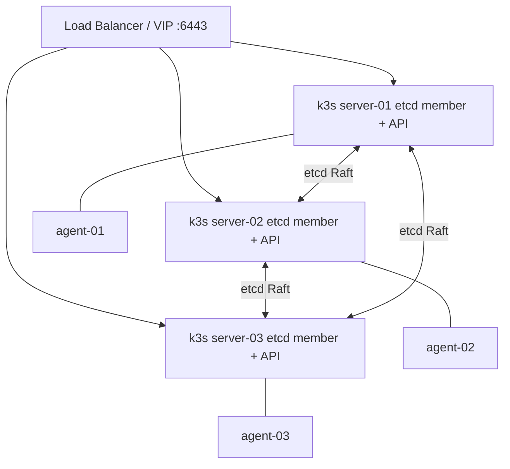
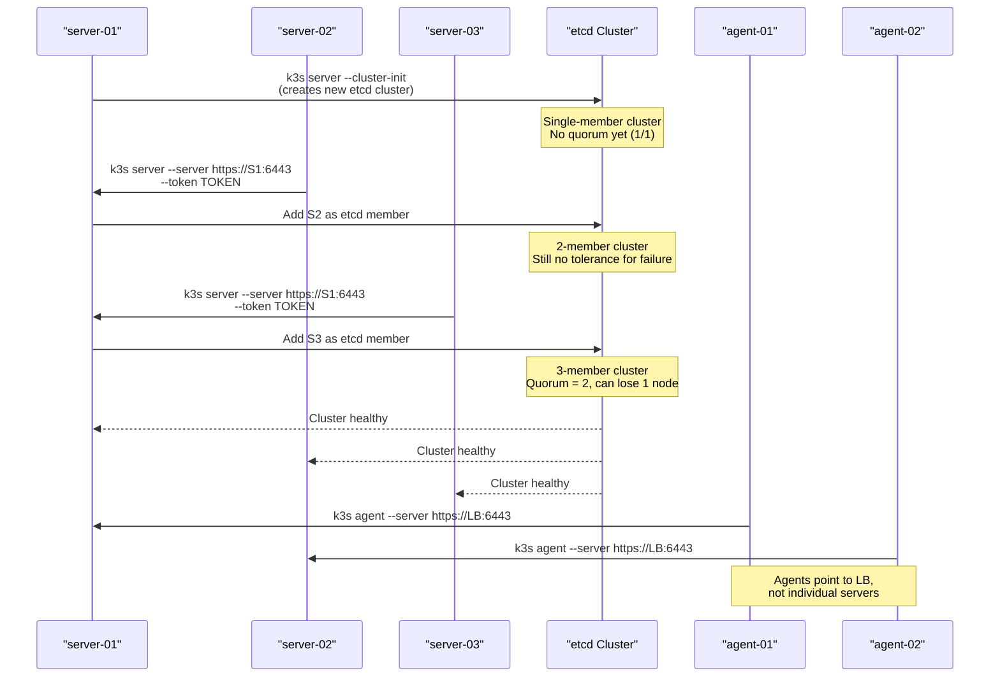
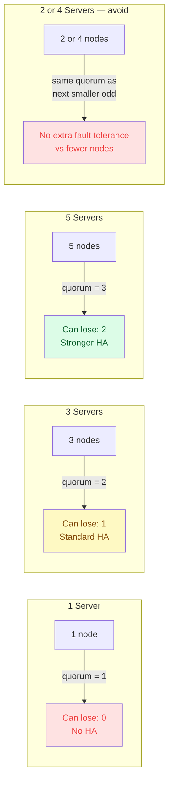
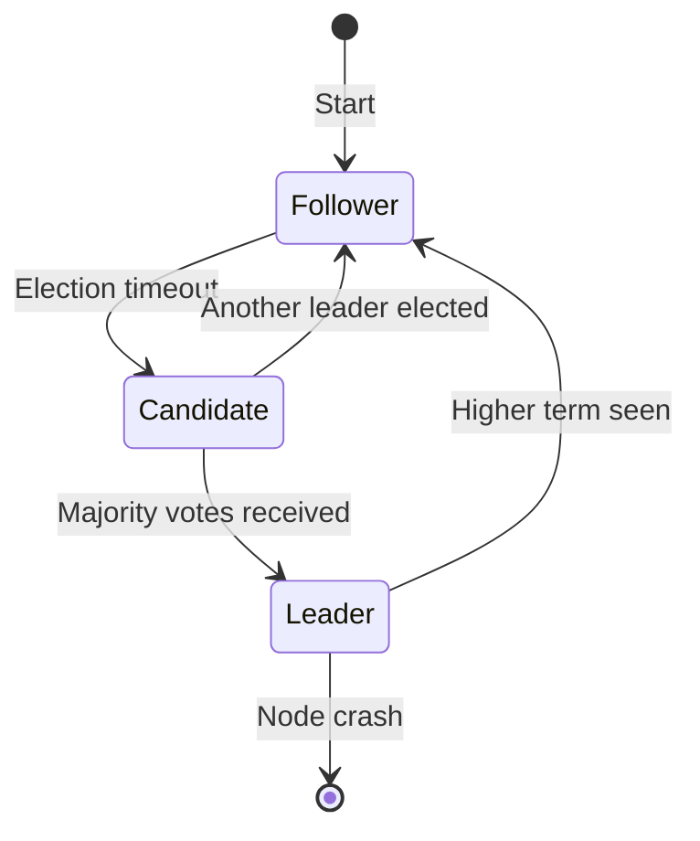
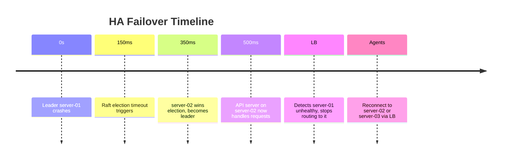

# High Availability with Embedded etcd
> Module 06 · Lesson 02 | [↑ Course Index](../README.md)


[](../README.md)
[](../LICENSE.md)

## Table of Contents
- [Overview](#overview)
- [What Is Embedded etcd HA?](#what-is-embedded-etcd-ha)
- [HA Requirements](#ha-requirements)
- [Bootstrapping the First Server](#bootstrapping-the-first-server)
- [Joining Additional Server Nodes](#joining-additional-server-nodes)
- [HA Bootstrap Sequence](#ha-bootstrap-sequence)
- [Raft Quorum Reference](#raft-quorum-reference)
- [The Fixed Registration Address](#the-fixed-registration-address)
- [Cluster State and etcd Health](#cluster-state-and-etcd-health)
- [Leader Election and Failover](#leader-election-and-failover)
- [Adding Agent Nodes to an HA Cluster](#adding-agent-nodes-to-an-ha-cluster)
- [Losing a Server Node](#losing-a-server-node)
- [Lab](#lab)

---

## Overview

A single-server k3s cluster has a single point of failure: if the server goes down, the API is unreachable and no new workloads can be scheduled (running pods keep running, but nothing new can start). **Embedded etcd HA** lets you run multiple k3s server nodes that all share a replicated etcd cluster, eliminating that single point of failure.

[↑ Back to TOC](#table-of-contents) · [↑ Course Index](../README.md)

---

## What Is Embedded etcd HA?

k3s ships with **etcd compiled in**. When you start a server with `--cluster-init`, k3s initialises a new etcd cluster. Additional servers join that etcd cluster automatically. A load balancer (or virtual IP) in front of the servers gives agents and kubectl a stable endpoint.



**Minimum quorum:** `(n/2)+1` nodes must be healthy.  
With 3 servers you can lose 1; with 5 servers you can lose 2.

| Cluster Size | Can Lose | Quorum |
|---|---|---|
| 1 | 0 | 1 |
| 3 | 1 | 2 |
| 5 | 2 | 3 |

> Always use an **odd** number of server nodes.

[↑ Back to TOC](#table-of-contents) · [↑ Course Index](../README.md)

---

## HA Requirements

| Item | Detail |
|------|--------|
| Server count | 3 or 5 (odd) |
| Ports open between servers | TCP 2379, 2380 (etcd peer), 6443 (API) |
| Fixed registration address | A load balancer or DNS name pointing to all servers |
| Unique hostnames | Each server node must have a unique hostname |
| Time sync | NTP mandatory — clock skew breaks Raft |
| Same k3s version | All nodes must run the same k3s version |

[↑ Back to TOC](#table-of-contents) · [↑ Course Index](../README.md)

---

## Bootstrapping the First Server

```bash
# On server-01 ONLY — initialises the etcd cluster
curl -sfL https://get.k3s.io | sh -s - \
  --cluster-init \
  --tls-san <LOAD_BALANCER_IP_OR_DNS>

# Wait until server-01 is Ready
sudo k3s kubectl get nodes
```

Key flag: `--cluster-init` — tells k3s to create a new embedded etcd cluster rather than use SQLite.

Retrieve the token:
```bash
sudo cat /var/lib/rancher/k3s/server/node-token
```

[↑ Back to TOC](#table-of-contents) · [↑ Course Index](../README.md)

---

## Joining Additional Server Nodes

```bash
# On server-02 and server-03
curl -sfL https://get.k3s.io | sh -s - \
  --server https://<SERVER_01_IP>:6443 \
  --token <NODE_TOKEN> \
  --tls-san <LOAD_BALANCER_IP_OR_DNS>
```

> **Note:** Use the IP of server-01 initially (not the LB) so nodes can join the existing etcd cluster. Once joined, all nodes appear behind the LB.

Verify all servers joined:
```bash
kubectl get nodes
# All three should show ROLES: control-plane,master
```

[↑ Back to TOC](#table-of-contents) · [↑ Course Index](../README.md)

---

## HA Bootstrap Sequence

The bootstrap order matters — the first server with `--cluster-init` creates the etcd cluster, and all subsequent servers join it. Agents should only be added after etcd quorum is established:



The critical sequence constraint: never bootstrap server-02 and server-03 simultaneously. Join them one at a time, waiting for each to reach `Ready` state before adding the next. Racing joins can corrupt the etcd member list.

[↑ Back to TOC](#table-of-contents) · [↑ Course Index](../README.md)

---

## Raft Quorum Reference

Raft requires a strict majority of members to be available to accept writes. This is why cluster size must be odd — even-sized clusters gain no additional fault tolerance over the next smaller odd size.



For most k3s HA deployments, 3 server nodes is the right choice. Five servers are warranted only when you need the ability to survive 2 simultaneous server failures — typically in very large or mission-critical production clusters. The overhead of 5 servers (double the API server resources, more etcd write latency) rarely justifies the gain for small teams.

[↑ Back to TOC](#table-of-contents) · [↑ Course Index](../README.md)

---

## The Fixed Registration Address

Agents need a stable endpoint that survives individual server failures. Options:

### Option A — External Load Balancer (production)
```
HAProxy / NGINX / AWS NLB → server-01:6443
                           → server-02:6443
                           → server-03:6443
```

### Option B — kube-vip (self-hosted VIP)
kube-vip provides a virtual IP using ARP or BGP — no external LB needed.

```bash
# Deploy kube-vip as a static pod (before bootstrapping)
export VIP=192.168.1.100
export INTERFACE=eth0

curl -sfL https://kube-vip.io/manifests/rbac.yaml | kubectl apply -f -
ctr image pull ghcr.io/kube-vip/kube-vip:latest
ctr run --rm --net-host ghcr.io/kube-vip/kube-vip:latest vip \
  /kube-vip manifest pod \
  --interface $INTERFACE \
  --address $VIP \
  --controlplane \
  --arp \
  --leaderElection | tee /var/lib/rancher/k3s/agent/pod-manifests/kube-vip.yaml
```

### Option C — Simple round-robin DNS
Create a DNS A record with multiple IPs:
```
k3s-api.example.com → 192.168.1.10
k3s-api.example.com → 192.168.1.11
k3s-api.example.com → 192.168.1.12
```

[↑ Back to TOC](#table-of-contents) · [↑ Course Index](../README.md)

---

## Cluster State and etcd Health

```bash
# Check etcd member list (from any server node)
sudo k3s etcd-snapshot ls

# Check etcd health via etcdctl
export ETCDCTL_CACERT=/var/lib/rancher/k3s/server/tls/etcd/server-ca.crt
export ETCDCTL_CERT=/var/lib/rancher/k3s/server/tls/etcd/client.crt
export ETCDCTL_KEY=/var/lib/rancher/k3s/server/tls/etcd/client.key
export ETCDCTL_ENDPOINTS=https://127.0.0.1:2379
export ETCDCTL_API=3

etcdctl member list
etcdctl endpoint health --cluster
etcdctl endpoint status --cluster --write-out=table
```

Sample output:
```
+------------------+---------+----------+------------------+
|     ENDPOINT     | HEALTH  |  TOOK    |       ERROR      |
+------------------+---------+----------+------------------+
| 127.0.0.1:2379   | true    | 3.42ms   |                  |
| 192.168.1.11:2379| true    | 8.01ms   |                  |
| 192.168.1.12:2379| true    | 12.3ms   |                  |
+------------------+---------+----------+------------------+
```

[↑ Back to TOC](#table-of-contents) · [↑ Course Index](../README.md)

---

## Leader Election and Failover



etcd uses the **Raft** consensus algorithm:
- One node is the **leader** at all times
- All writes go through the leader
- Reads can be served by any member (with `--consistency=linearizable` by default)
- If the leader fails, the remaining nodes elect a new leader in ~150–500ms

The k3s API server and scheduler use their own leader election (via Kubernetes leases) separately from etcd leadership.

[↑ Back to TOC](#table-of-contents) · [↑ Course Index](../README.md)

---

## Adding Agent Nodes to an HA Cluster

Point agent nodes at the **fixed registration address** (LB or VIP), not at an individual server:

```bash
curl -sfL https://get.k3s.io | \
  K3S_URL=https://<LB_IP_OR_DNS>:6443 \
  K3S_TOKEN=<NODE_TOKEN> \
  sh -
```

This ensures that if any one server goes down, the agent can still reach the cluster.

[↑ Back to TOC](#table-of-contents) · [↑ Course Index](../README.md)

---

## Losing a Server Node



To **remove** a failed server node from the cluster:
```bash
# From a healthy server node
kubectl delete node server-01

# Remove from etcd (run on a healthy server)
ETCDCTL_API=3 etcdctl member remove <member-id>
```

To **replace** it, provision a new VM with the same hostname and re-join using the same token.

[↑ Back to TOC](#table-of-contents) · [↑ Course Index](../README.md)

---

## Lab

This module's lab script (`labs/join-agent.sh`) includes an HA bootstrap section. For HA setup steps see the comments at the top of the script.

Key validation commands after setup:
```bash
# All servers present and Ready
kubectl get nodes -l node-role.kubernetes.io/control-plane

# etcd cluster healthy
sudo k3s etcd-snapshot ls

# Test failover — stop server-01 and verify API still responds
sudo systemctl stop k3s   # on server-01
kubectl get nodes          # from your workstation (via LB)
```

[↑ Back to TOC](#table-of-contents) · [↑ Course Index](../README.md)

---
*Licensed under [CC BY-NC-SA 4.0](../LICENSE.md) · © 2026 UncleJS*
