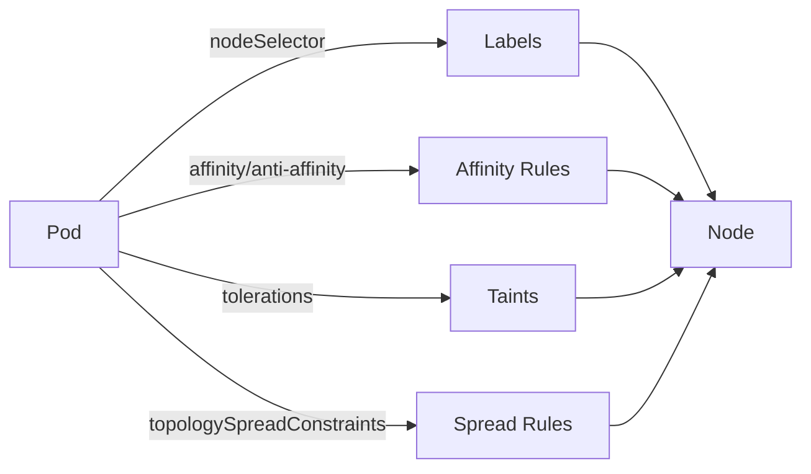
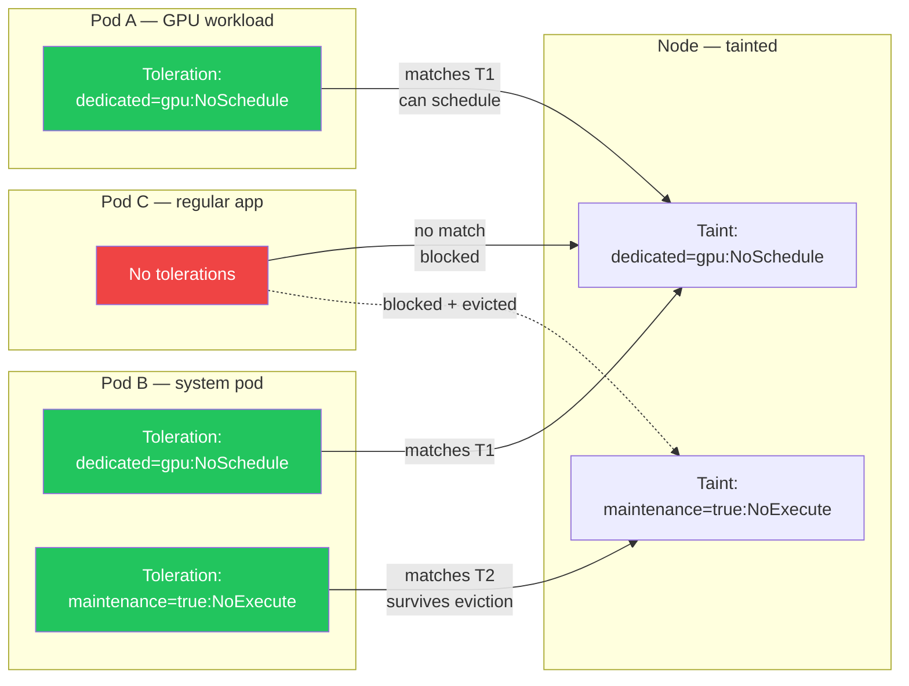
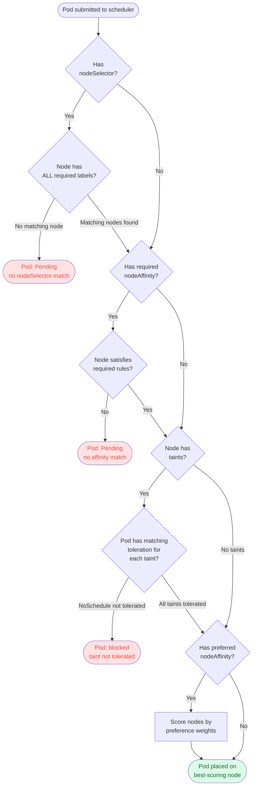
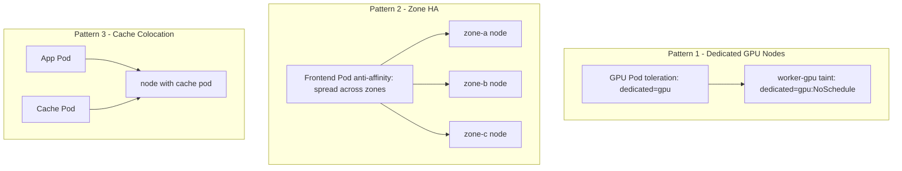

# Node Labels, Taints, and Affinity
> Module 06 · Lesson 04 | [↑ Course Index](../README.md)


[](../README.md)
[](../LICENSE.md)

## Table of Contents
- [Overview](#overview)
- [Node Labels](#node-labels)
- [Node Selectors](#node-selectors)
- [Node Taints and Tolerations](#node-taints-and-tolerations)
- [Taint and Toleration Matching](#taint-and-toleration-matching)
- [Node Affinity](#node-affinity)
- [Scheduling Decision Tree](#scheduling-decision-tree)
- [Pod Affinity and Anti-Affinity](#pod-affinity-and-anti-affinity)
- [Topology Spread Constraints](#topology-spread-constraints)
- [Common Scheduling Patterns](#common-scheduling-patterns)
- [Lab](#lab)

---

## Overview

When you have multiple nodes in a cluster, Kubernetes gives you rich controls over **where** pods land. This lesson covers the full scheduling control toolkit: labels, selectors, taints, tolerations, affinity rules, and topology spread constraints.



[↑ Back to TOC](#table-of-contents) · [↑ Course Index](../README.md)

---

## Node Labels

Labels are arbitrary key-value pairs attached to nodes. k3s applies a standard set automatically.

### Viewing Labels
```bash
kubectl get nodes --show-labels
kubectl describe node worker-01
```

### Adding Labels
```bash
# Add a label
kubectl label node worker-01 role=gpu

# Add multiple labels
kubectl label node worker-02 zone=us-east-1a tier=compute

# Override an existing label
kubectl label node worker-01 role=storage --overwrite

# Remove a label
kubectl label node worker-01 role-
```

### Common Label Conventions

| Key | Example Values | Purpose |
|-----|---------------|---------|
| `kubernetes.io/hostname` | `worker-01` | Auto-set by k3s |
| `kubernetes.io/arch` | `amd64`, `arm64` | Auto-set by k3s |
| `node.kubernetes.io/instance-type` | `m5.xlarge` | Cloud instance type |
| `topology.kubernetes.io/zone` | `us-east-1a` | Availability zone |
| `topology.kubernetes.io/region` | `us-east-1` | Region |
| `role` / `tier` / `env` | `gpu`, `compute`, `prod` | Custom workload routing |

[↑ Back to TOC](#table-of-contents) · [↑ Course Index](../README.md)

---

## Node Selectors

`nodeSelector` is the simplest scheduling constraint — schedule only on nodes that have **all** specified labels.

```yaml
apiVersion: v1
kind: Pod
spec:
  nodeSelector:
    role: gpu
    zone: us-east-1a
  containers:
  - name: trainer
    image: pytorch/pytorch:latest
```

> **Limitation:** `nodeSelector` only supports exact matches. For more expressive rules, use `nodeAffinity`.

[↑ Back to TOC](#table-of-contents) · [↑ Course Index](../README.md)

---

## Node Taints and Tolerations

**Taints** repel pods from nodes. **Tolerations** allow pods to land on tainted nodes. This is useful for:
- Dedicated nodes (GPU, high-memory)
- Reserving control-plane nodes for system workloads only
- Marking nodes that are being drained

### Taint Effects

| Effect | Behaviour |
|--------|-----------|
| `NoSchedule` | New pods without toleration won't schedule here |
| `PreferNoSchedule` | Scheduler tries to avoid the node, but may use it |
| `NoExecute` | Evicts running pods without toleration AND blocks new ones |

### Applying Taints

```bash
# Taint a node for GPU workloads only
kubectl taint node worker-gpu dedicated=gpu:NoSchedule

# Taint a node as not ready for new workloads
kubectl taint node worker-01 maintenance=true:NoExecute

# Remove a taint
kubectl taint node worker-gpu dedicated=gpu:NoSchedule-
```

### Adding Tolerations to Pods

```yaml
apiVersion: apps/v1
kind: Deployment
spec:
  template:
    spec:
      tolerations:
      - key: "dedicated"
        operator: "Equal"
        value: "gpu"
        effect: "NoSchedule"
      containers:
      - name: gpu-app
        image: myapp:latest
        resources:
          limits:
            nvidia.com/gpu: "1"
```

### Control-Plane Taint

k3s server nodes have a built-in taint that prevents regular workloads from scheduling on them:

```bash
kubectl describe node server-01 | grep Taints
# Taints: node-role.kubernetes.io/control-plane:NoSchedule
```

To **run workloads on the control plane** (single-node clusters):
```bash
kubectl taint node server-01 node-role.kubernetes.io/control-plane:NoSchedule-
```

[↑ Back to TOC](#table-of-contents) · [↑ Course Index](../README.md)

---

## Taint and Toleration Matching

Taints and tolerations work as a key-value-effect triplet. A pod must have a toleration that exactly matches the taint's key, value, and effect to be allowed on the node. Here is a visual model of the matching logic:



A common misconception: a toleration is not a magnet — it does not *attract* a pod to a tainted node, it only *allows* scheduling there. To force a pod onto a specific tainted node, you must combine a toleration (to pass the taint gate) with a `nodeSelector` or `nodeAffinity` (to actively target that node).

[↑ Back to TOC](#table-of-contents) · [↑ Course Index](../README.md)

---

## Node Affinity

Node affinity is a more expressive replacement for `nodeSelector`, supporting operators like `In`, `NotIn`, `Exists`, `Gt`, `Lt`.

### Required Affinity (hard rule)

Pods **will not** schedule unless the rule is met:

```yaml
spec:
  affinity:
    nodeAffinity:
      requiredDuringSchedulingIgnoredDuringExecution:
        nodeSelectorTerms:
        - matchExpressions:
          - key: topology.kubernetes.io/zone
            operator: In
            values:
            - us-east-1a
            - us-east-1b
```

### Preferred Affinity (soft rule)

Scheduler tries to satisfy this, but places the pod elsewhere if no matching node exists:

```yaml
spec:
  affinity:
    nodeAffinity:
      preferredDuringSchedulingIgnoredDuringExecution:
      - weight: 80
        preference:
          matchExpressions:
          - key: tier
            operator: In
            values: [compute]
      - weight: 20
        preference:
          matchExpressions:
          - key: tier
            operator: In
            values: [storage]
```

> The `weight` (1–100) determines priority when multiple preferences match.

[↑ Back to TOC](#table-of-contents) · [↑ Course Index](../README.md)

---

## Scheduling Decision Tree

The Kubernetes scheduler evaluates constraints in a specific order. Understanding this order helps you reason about why a pod lands where it does — or why it stays `Pending`:



The scheduler runs two phases: **filtering** (removes nodes that fail hard constraints like `nodeSelector`, required affinity, and untolerated taints) and **scoring** (ranks the remaining nodes by preferred affinity weights, resource availability, and spread constraints). A pod that passes all filters but has no preferred affinity rules will land on the node with the most available resources.

[↑ Back to TOC](#table-of-contents) · [↑ Course Index](../README.md)

---

## Pod Affinity and Anti-Affinity

These rules schedule pods **relative to other pods**, not just node labels.

### Co-locate pods (affinity)

Schedule this pod on a node that already has a matching pod:

```yaml
spec:
  affinity:
    podAffinity:
      requiredDuringSchedulingIgnoredDuringExecution:
      - labelSelector:
          matchLabels:
            app: cache
        topologyKey: kubernetes.io/hostname
```

### Spread pods apart (anti-affinity)

Prevent two replicas of the same app from landing on the same node:

```yaml
spec:
  affinity:
    podAntiAffinity:
      requiredDuringSchedulingIgnoredDuringExecution:
      - labelSelector:
          matchLabels:
            app: frontend
        topologyKey: kubernetes.io/hostname
```

`topologyKey` defines the unit of separation:
- `kubernetes.io/hostname` — separate across nodes
- `topology.kubernetes.io/zone` — separate across zones
- `topology.kubernetes.io/region` — separate across regions

[↑ Back to TOC](#table-of-contents) · [↑ Course Index](../README.md)

---

## Topology Spread Constraints

A cleaner way to evenly distribute pods across topology domains (nodes, zones):

```yaml
spec:
  topologySpreadConstraints:
  - maxSkew: 1              # max difference between any two domains
    topologyKey: kubernetes.io/hostname
    whenUnsatisfiable: DoNotSchedule   # or ScheduleAnyway
    labelSelector:
      matchLabels:
        app: frontend
  - maxSkew: 1
    topologyKey: topology.kubernetes.io/zone
    whenUnsatisfiable: ScheduleAnyway
    labelSelector:
      matchLabels:
        app: frontend
```

`maxSkew: 1` means no single node/zone can have more than 1 extra pod compared to the least-loaded domain.

[↑ Back to TOC](#table-of-contents) · [↑ Course Index](../README.md)

---

## Common Scheduling Patterns



### Pattern Summary

| Pattern | Mechanism | Use Case |
|---------|-----------|----------|
| Dedicated nodes | Taint + Toleration | GPU, high-memory, licensed software |
| Zone spread | Anti-affinity / TopologySpread | HA across availability zones |
| Cache colocation | Pod affinity | Low-latency data access |
| Control-plane isolation | Node taint | Keep system pods off workers |
| Canary by node | nodeSelector label | Deploy to specific node group |

[↑ Back to TOC](#table-of-contents) · [↑ Course Index](../README.md)

---

## Lab

See [`labs/affinity-deployment.yaml`](labs/affinity-deployment.yaml) for a complete Deployment demonstrating:
- Pod anti-affinity to spread replicas across nodes
- Preferred node affinity for `tier=compute` nodes
- Topology spread constraints with `maxSkew: 1`

```bash
# Apply the lab
kubectl apply -f labs/affinity-deployment.yaml

# Watch pod distribution
kubectl get pods -o wide -l app=affinity-demo

# Label your nodes to see affinity in action
kubectl label node worker-01 tier=compute
kubectl label node worker-02 tier=compute
kubectl label node worker-03 tier=storage

# Verify spread
kubectl get pods -o wide -l app=affinity-demo
```

[↑ Back to TOC](#table-of-contents) · [↑ Course Index](../README.md)

---
*Licensed under [CC BY-NC-SA 4.0](../LICENSE.md) · © 2026 UncleJS*
