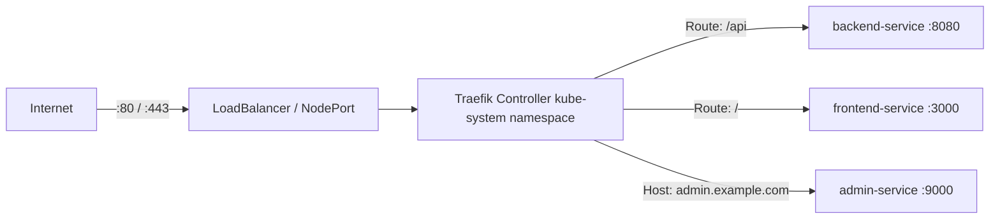
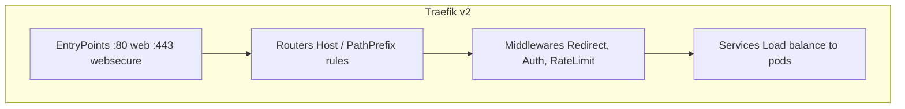

# Traefik — The Built-in Ingress Controller
> Module 07 · Lesson 01 | [↑ Course Index](../README.md)

## Table of Contents
- [Overview](#overview)
- [What is an Ingress Controller?](#what-is-an-ingress-controller)
- [Traefik in k3s](#traefik-in-k3s)
- [Traefik Architecture](#traefik-architecture)
- [Verifying Traefik is Running](#verifying-traefik-is-running)
- [The Traefik Dashboard](#the-traefik-dashboard)
- [Traefik Configuration in k3s](#traefik-configuration-in-k3s)
- [Disabling Traefik](#disabling-traefik)
- [Replacing Traefik with NGINX Ingress](#replacing-traefik-with-nginx-ingress)
- [Lab](#lab)

---

## Overview

k3s ships with **Traefik** as its built-in Ingress controller — a modern, cloud-native reverse proxy that handles HTTP/HTTPS routing, TLS termination, middleware (rate limiting, auth, redirects), and more. This lesson covers how Traefik works in k3s, how to configure it, and when you might replace it.

[↑ Back to TOC](#table-of-contents) · [↑ Course Index](../README.md)

---

## What is an Ingress Controller?

An Ingress Controller is a reverse proxy deployed inside the cluster that watches `Ingress` (and `IngressRoute`) resources and automatically configures routing rules.



Without an Ingress controller, you'd need a separate `LoadBalancer` or `NodePort` service for every application.

[↑ Back to TOC](#table-of-contents) · [↑ Course Index](../README.md)

---

## Traefik in k3s

k3s bundles Traefik v2 (k3s ≥ v1.21) as a **HelmChart** resource. This means:
- Traefik is installed and managed by a built-in Helm controller
- Configuration is done via the `HelmChartConfig` CRD
- It runs in the `kube-system` namespace
- It automatically gets a `LoadBalancer` service (or `NodePort` in some environments)

```bash
kubectl get pods -n kube-system | grep traefik
# traefik-xxxx-yyyy   1/1   Running   0   5m

kubectl get svc -n kube-system traefik
# NAME      TYPE           CLUSTER-IP   EXTERNAL-IP   PORT(S)
# traefik   LoadBalancer   10.43.x.x    <node-ip>     80:xxxxx/TCP,443:xxxxx/TCP
```

[↑ Back to TOC](#table-of-contents) · [↑ Course Index](../README.md)

---

## Traefik Architecture



Key concepts:

| Concept | Description |
|---------|-------------|
| **EntryPoint** | Listens on a port (`:80`, `:443`) |
| **Router** | Matches incoming requests by host/path |
| **Middleware** | Transforms requests (redirects, headers, auth) |
| **Service** | Forwards traffic to backend pods |
| **IngressRoute** | Traefik-native CRD for full feature access |
| **Ingress** | Standard Kubernetes Ingress (limited features) |

[↑ Back to TOC](#table-of-contents) · [↑ Course Index](../README.md)

---

## Verifying Traefik is Running

```bash
# Check Traefik pod
kubectl get pods -n kube-system -l app.kubernetes.io/name=traefik

# Check the service (note external IP — this is your cluster's ingress IP)
kubectl get svc -n kube-system traefik

# Check Traefik logs
kubectl logs -n kube-system -l app.kubernetes.io/name=traefik --tail=50

# Check the HelmChart object that manages Traefik
kubectl get helmchart -n kube-system traefik
kubectl get helmchartconfig -n kube-system traefik   # if customised
```

[↑ Back to TOC](#table-of-contents) · [↑ Course Index](../README.md)

---

## The Traefik Dashboard

Traefik has a web dashboard showing all routers, services, and middleware.

### Expose via Port-Forward (quick access)
```bash
kubectl port-forward -n kube-system \
  $(kubectl get pods -n kube-system -l app.kubernetes.io/name=traefik -o name | head -1) \
  9000:9000

# Visit http://localhost:9000/dashboard/
```

### Expose via IngressRoute (persistent)
```yaml
apiVersion: traefik.containo.us/v1alpha1
kind: IngressRoute
metadata:
  name: traefik-dashboard
  namespace: kube-system
spec:
  entryPoints:
  - web
  routes:
  - match: Host(`traefik.example.com`) && (PathPrefix(`/dashboard`) || PathPrefix(`/api`))
    kind: Rule
    services:
    - name: api@internal
      kind: TraefikService
```

> ⚠️ Protect the dashboard with authentication middleware in production — it exposes sensitive routing information.

[↑ Back to TOC](#table-of-contents) · [↑ Course Index](../README.md)

---

## Traefik Configuration in k3s

Customise Traefik without uninstalling it by creating a `HelmChartConfig`:

```yaml
# /var/lib/rancher/k3s/server/manifests/traefik-config.yaml
apiVersion: helm.cattle.io/v1
kind: HelmChartConfig
metadata:
  name: traefik
  namespace: kube-system
spec:
  valuesContent: |-
    # Enable access logs
    logs:
      access:
        enabled: true

    # Enable the Traefik dashboard
    dashboard:
      enabled: true

    # Add entrypoints
    ports:
      web:
        redirectTo:
          port: websecure   # Force HTTP→HTTPS redirect

    # Set resource limits
    resources:
      requests:
        cpu: 100m
        memory: 50Mi
      limits:
        cpu: 300m
        memory: 150Mi
```

> Drop any YAML file in `/var/lib/rancher/k3s/server/manifests/` and k3s auto-applies it at startup (and watches for changes).

[↑ Back to TOC](#table-of-contents) · [↑ Course Index](../README.md)

---

## Disabling Traefik

If you want to use a different Ingress controller (NGINX, Istio, Contour), disable Traefik at install time:

```bash
curl -sfL https://get.k3s.io | sh -s - --disable=traefik
```

Or add to `/etc/rancher/k3s/config.yaml`:
```yaml
disable:
  - traefik
```

[↑ Back to TOC](#table-of-contents) · [↑ Course Index](../README.md)

---

## Replacing Traefik with NGINX Ingress

```bash
# Step 1: Disable Traefik
echo "disable: [traefik]" >> /etc/rancher/k3s/config.yaml
sudo systemctl restart k3s

# Step 2: Install NGINX Ingress Controller via Helm
helm repo add ingress-nginx https://kubernetes.github.io/ingress-nginx
helm install ingress-nginx ingress-nginx/ingress-nginx \
  --namespace ingress-nginx \
  --create-namespace \
  --set controller.service.type=NodePort

# Step 3: Verify
kubectl get pods -n ingress-nginx
kubectl get svc -n ingress-nginx
```

> The rest of this module assumes Traefik is in use (the k3s default).

[↑ Back to TOC](#table-of-contents) · [↑ Course Index](../README.md)

---

## Lab

The lab for this module is in `labs/ingress-basic.yaml` — it deploys a demo app and exposes it via both standard `Ingress` and Traefik's `IngressRoute`.

```bash
# Apply
kubectl apply -f labs/ingress-basic.yaml

# Check
kubectl get ingress
kubectl get ingressroute   # Traefik CRD

# Test (replace with your node IP)
curl -H "Host: demo.example.com" http://<NODE_IP>/
```

[↑ Back to TOC](#table-of-contents) · [↑ Course Index](../README.md)

---
*Licensed under [CC BY-NC-SA 4.0](../LICENSE.md) · © 2026 UncleJS*
