# Custom Ingress Rules
> Module 07 · Lesson 02 | [↑ Course Index](../README.md)


[](../README.md)
[](../LICENSE.md)

## Table of Contents
- [Overview](#overview)
- [How Traefik Processes Requests](#how-traefik-processes-requests)
- [Standard Kubernetes Ingress](#standard-kubernetes-ingress)
- [Traefik IngressRoute CRD](#traefik-ingressroute-crd)
- [Path-Based Routing](#path-based-routing)
- [Host-Based Routing](#host-based-routing)
- [Middleware Chains](#middleware-chains)
- [Middleware: Redirects and Headers](#middleware-redirects-and-headers)
- [Middleware: Rate Limiting](#middleware-rate-limiting)
- [Middleware: BasicAuth](#middleware-basicauth)
- [Middleware: Strip Prefix and Add Prefix](#middleware-strip-prefix-and-add-prefix)
- [Priority System](#priority-system)
- [Weighted Traffic Splitting](#weighted-traffic-splitting)
- [TCP and UDP Routing](#tcp-and-udp-routing)
- [Canary Deployment Pattern](#canary-deployment-pattern)
- [Lab](#lab)

---

## Overview

Once Traefik is running (as it is by default in k3s), the real power comes from crafting precise routing rules that direct traffic to the right backend at the right time — with transformations along the way.

This lesson goes deep on routing rules: from simple path-based routing to advanced Traefik middleware chains, priority ordering, canary traffic splitting, and TCP/UDP passthrough. You'll work with both the portable standard `Ingress` resource and Traefik's native `IngressRoute` CRD, understanding exactly when to use each and why.

By the end you'll be able to model any routing topology your application demands — multi-tenant virtual hosting, API gateway patterns with rate limiting and auth, blue-green traffic splits, and even raw TCP proxy for databases — all expressed as Kubernetes-native YAML.

[↑ Back to TOC](#table-of-contents) · [↑ Course Index](../README.md)

---

## How Traefik Processes Requests

Before writing rules, it helps to understand the full lifecycle of a request through Traefik:

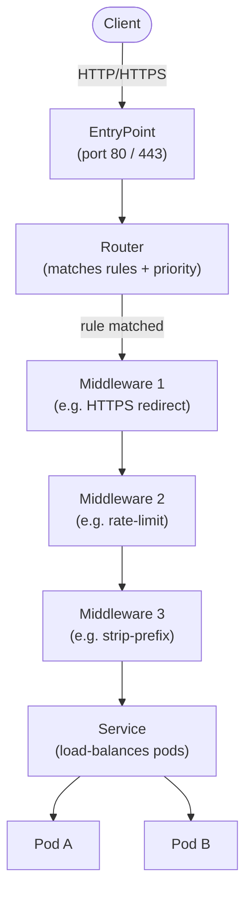

The key insight: **Routers match; Middlewares transform; Services deliver.** These three concepts are independent and composable. A single Middleware can be reused across many routes, and a single Service can be referenced by many Routes.

### EntryPoints

EntryPoints are the listening sockets. In k3s's default Traefik configuration:

| EntryPoint | Port | Protocol |
|-----------|------|---------|
| `web` | 80 | HTTP |
| `websecure` | 443 | HTTPS |
| `traefik` | 9000 | Dashboard/metrics |

You can add custom TCP/UDP entrypoints via `HelmChartConfig` (covered in lesson 01).

### Routers and Rules

A Router watches one or more EntryPoints and evaluates a **rule expression** against each incoming request. Rules are boolean expressions using built-in matchers. The router with the **highest priority** whose rule evaluates to `true` wins.

[↑ Back to TOC](#table-of-contents) · [↑ Course Index](../README.md)

---

## Standard Kubernetes Ingress

The standard `Ingress` resource is part of the `networking.k8s.io/v1` API. It's controller-agnostic, so a cluster running nginx, Traefik, or any other controller all understand the same resource type.

```yaml
apiVersion: networking.k8s.io/v1
kind: Ingress
metadata:
  name: myapp-ingress
  annotations:
    # Traefik-specific annotations (applied to the generated router)
    traefik.ingress.kubernetes.io/router.entrypoints: web,websecure
    traefik.ingress.kubernetes.io/router.tls: "true"
    traefik.ingress.kubernetes.io/router.middlewares: default-https-redirect@kubernetescrd
spec:
  ingressClassName: traefik
  rules:
  - host: myapp.example.com
    http:
      paths:
      - path: /
        pathType: Prefix
        backend:
          service:
            name: myapp-svc
            port:
              number: 80
      - path: /api
        pathType: Prefix
        backend:
          service:
            name: api-svc
            port:
              number: 8080
  tls:
  - hosts:
    - myapp.example.com
    secretName: myapp-tls
```

### Path Types

The `pathType` field controls how the path string is matched:

| Type | Behaviour | Example |
|------|-----------|---------|
| `Exact` | Matches only the exact string | `/foo` matches `/foo` only |
| `Prefix` | Matches the prefix, segment-aware | `/foo` matches `/foo`, `/foo/bar` but NOT `/foobar` |
| `ImplementationSpecific` | Delegated to the Ingress controller | Traefik applies its own rule |

> **Prefix semantics:** `Prefix` matching is segment-aware in the Ingress API. `/foo` does **not** match `/foobar` — the path is split at `/` boundaries. This differs from `PathPrefix()` in `IngressRoute` which is purely string-prefix based. Always test carefully.

### Annotations: Connecting Standard Ingress to Traefik Features

When using the standard `Ingress` resource with Traefik, you can attach Traefik-specific behaviour via annotations. The annotation `traefik.ingress.kubernetes.io/router.middlewares` references middlewares by their namespaced name: `<namespace>-<name>@kubernetescrd`.

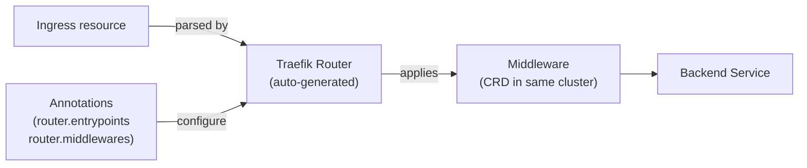

The tradeoff: standard `Ingress` is portable (works on any cluster) but you need annotations to access advanced Traefik features, and the annotation syntax can become verbose. `IngressRoute` gives you clean YAML with all features first-class.

[↑ Back to TOC](#table-of-contents) · [↑ Course Index](../README.md)

---

## Traefik IngressRoute CRD

The `IngressRoute` CRD exposes Traefik's full routing engine directly in Kubernetes YAML. It's Traefik-specific, but in practice if you're running k3s you're running Traefik, so the portability cost is negligible.

```yaml
apiVersion: traefik.containo.us/v1alpha1
kind: IngressRoute
metadata:
  name: myapp-route
  namespace: default
spec:
  entryPoints:
  - websecure
  routes:
  - match: Host(`myapp.example.com`) && PathPrefix(`/`)
    kind: Rule
    priority: 10
    middlewares:
    - name: secure-headers
      namespace: default
    services:
    - name: myapp-svc
      port: 80
  tls:
    secretName: myapp-tls
```

### Rule Matchers

Rules are boolean expressions composed from these matchers:

| Matcher | Example | Notes |
|---------|---------|-------|
| `Host()` | `Host(`api.example.com`)` | Exact hostname match |
| `HostRegexp()` | `HostRegexp(`{sub:[a-z]+}.example.com`)` | Regex with named capture |
| `PathPrefix()` | `PathPrefix(`/api/v1`)` | String prefix match |
| `Path()` | `Path(`/health`)` | Exact path match |
| `PathRegexp()` | `PathRegexp(`/items/[0-9]+`)` | Regex path match |
| `Method()` | `Method(`POST`, `PUT`)` | HTTP method |
| `Headers()` | `Headers(`X-API-Version`, `2`)` | Exact header value |
| `HeadersRegexp()` | `HeadersRegexp(`X-User`, `.+`)` | Header regex |
| `Query()` | `Query(`debug`, `true`)` | Query parameter |
| `ClientIP()` | `ClientIP(`10.0.0.0/8`)` | Source IP/CIDR |
| `&&` | — | Logical AND |
| `\|\|` | — | Logical OR |
| `!` | — | Logical NOT |

### Architecture: How IngressRoute Relates to Traefik Internals

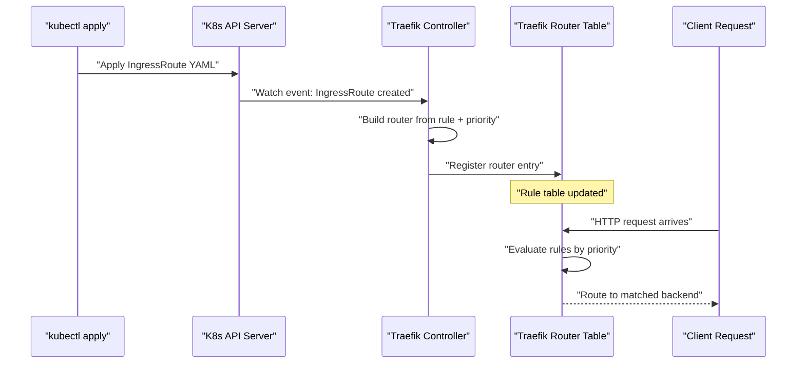

[↑ Back to TOC](#table-of-contents) · [↑ Course Index](../README.md)

---

## Path-Based Routing

Path-based routing sends different URL paths to different backend services — a common pattern for microservice frontends where a single hostname serves an API, a static CDN, and a frontend SPA.

```yaml
apiVersion: traefik.containo.us/v1alpha1
kind: IngressRoute
metadata:
  name: path-routing
  namespace: default
spec:
  entryPoints: [web]
  routes:
  # API — highest priority (most specific)
  - match: Host(`example.com`) && PathPrefix(`/api`)
    kind: Rule
    priority: 20
    middlewares:
    - name: strip-api-prefix
    services:
    - name: api-service
      port: 8080

  # Static assets — medium priority
  - match: Host(`example.com`) && PathPrefix(`/static`)
    kind: Rule
    priority: 15
    services:
    - name: cdn-service
      port: 80

  # Health check — explicit path
  - match: Host(`example.com`) && Path(`/healthz`)
    kind: Rule
    priority: 25
    services:
    - name: health-service
      port: 8080

  # Catch-all frontend — lowest priority
  - match: Host(`example.com`)
    kind: Rule
    priority: 10
    services:
    - name: frontend-service
      port: 3000
```

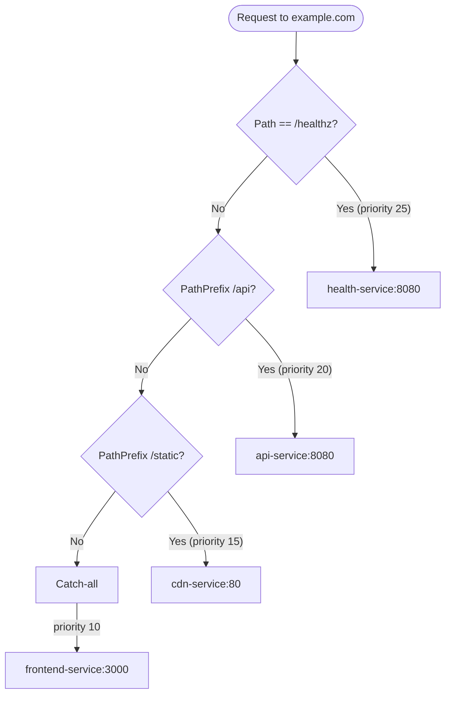

> **Priority matters!** Traefik does not use "first-match" ordering — it evaluates **all** rules and picks the highest priority match. Always assign higher priority values to more specific rules. If two rules have the same priority and both match, Traefik picks one arbitrarily.

[↑ Back to TOC](#table-of-contents) · [↑ Course Index](../README.md)

---

## Host-Based Routing

Host-based (virtual) routing sends requests to different services based on the `Host` header. This is the standard way to run multiple applications on a single cluster IP.

```yaml
apiVersion: traefik.containo.us/v1alpha1
kind: IngressRoute
metadata:
  name: host-routing
  namespace: default
spec:
  entryPoints: [websecure]
  routes:
  - match: Host(`app.example.com`)
    kind: Rule
    services:
    - name: main-app
      port: 80

  - match: Host(`api.example.com`)
    kind: Rule
    middlewares:
    - name: rate-limit
    services:
    - name: api-gateway
      port: 8080

  - match: Host(`admin.example.com`)
    kind: Rule
    middlewares:
    - name: admin-auth
    - name: secure-headers
    services:
    - name: admin-panel
      port: 9000

  - match: Host(`status.example.com`)
    kind: Rule
    services:
    - name: status-page
      port: 3000
  tls:
    secretName: wildcard-example-com
```

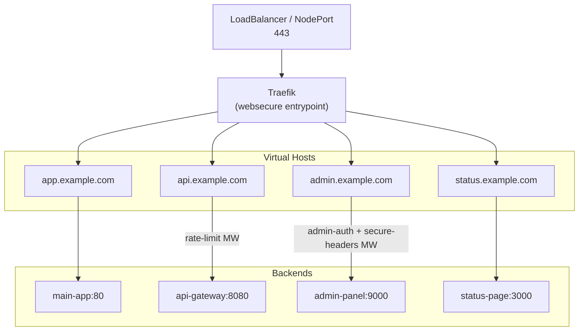

### Wildcard TLS

One TLS secret covering all subdomains (`*.example.com`) is the cleanest approach. The secret is referenced once in the `IngressRoute`, and all matching routes share it. Create the wildcard cert via cert-manager with a DNS-01 challenge (see lesson 03).

[↑ Back to TOC](#table-of-contents) · [↑ Course Index](../README.md)

---

## Middleware Chains

Middlewares are the transformation layer between Router and Service. A single route can apply multiple middlewares in sequence — they form a **chain** where the output of one is the input of the next.


Each middleware is declared as an independent CRD resource and referenced by name. This composability means you write a `secure-headers` middleware once and reuse it across every route that needs it.

> **Namespace scoping:** Middlewares are namespace-scoped. To use a middleware from another namespace, reference it as `<namespace>-<name>@kubernetescrd` in the `IngressRoute`. Within the same namespace, just use the name.

[↑ Back to TOC](#table-of-contents) · [↑ Course Index](../README.md)

---

## Middleware: Redirects and Headers

### HTTP → HTTPS Redirect

The most common middleware: catch HTTP traffic and redirect permanently to HTTPS.

```yaml
apiVersion: traefik.containo.us/v1alpha1
kind: Middleware
metadata:
  name: https-redirect
  namespace: default
spec:
  redirectScheme:
    scheme: https
    permanent: true   # 301 — tells browsers and crawlers to update bookmarks
---
# Listen on HTTP, redirect everything to HTTPS
apiVersion: traefik.containo.us/v1alpha1
kind: IngressRoute
metadata:
  name: http-catch
  namespace: default
spec:
  entryPoints: [web]
  routes:
  - match: HostRegexp(`{host:.+}`)
    kind: Rule
    priority: 1
    middlewares:
    - name: https-redirect
    services:
    - name: noop-svc   # Required field but never reached
      port: 80
```

> The redirect happens before the request reaches a service, so the `services` field is required by the schema but the traffic is redirected before the load-balancer can forward it.

### Security Headers

A comprehensive security headers middleware protects against XSS, clickjacking, MIME sniffing, and enforces HTTPS via HSTS:

```yaml
apiVersion: traefik.containo.us/v1alpha1
kind: Middleware
metadata:
  name: secure-headers
  namespace: default
spec:
  headers:
    sslRedirect: true
    forceSTSHeader: true
    stsSeconds: 31536000        # 1 year
    stsIncludeSubdomains: true
    stsPreload: true
    contentTypeNosniff: true
    browserXssFilter: true
    referrerPolicy: "strict-origin-when-cross-origin"
    frameDeny: true
    customResponseHeaders:
      X-Frame-Options: DENY
      Content-Security-Policy: "default-src 'self'; script-src 'self' 'unsafe-inline'"
      Permissions-Policy: "camera=(), microphone=(), geolocation=()"
    customRequestHeaders:
      X-Forwarded-Proto: https
```

> **HSTS preload warning:** Once `stsPreload: true` is submitted to the HSTS preload list, removing it takes months. Only enable this when you're certain the domain will always serve HTTPS.

[↑ Back to TOC](#table-of-contents) · [↑ Course Index](../README.md)

---

## Middleware: Rate Limiting

Rate limiting protects backends from abuse, DDoS, and runaway clients. Traefik's built-in rate limiter uses a token-bucket algorithm.

```yaml
apiVersion: traefik.containo.us/v1alpha1
kind: Middleware
metadata:
  name: api-rate-limit
  namespace: default
spec:
  rateLimit:
    average: 100    # Sustained requests per second (token refill rate)
    burst: 50       # Maximum burst above sustained rate
    period: 1s      # Rate window
    sourceCriterion:
      ipStrategy:
        depth: 1    # Use X-Forwarded-For[last] as the client IP
        # depth: 0 uses the direct connection IP (behind a single proxy)
```

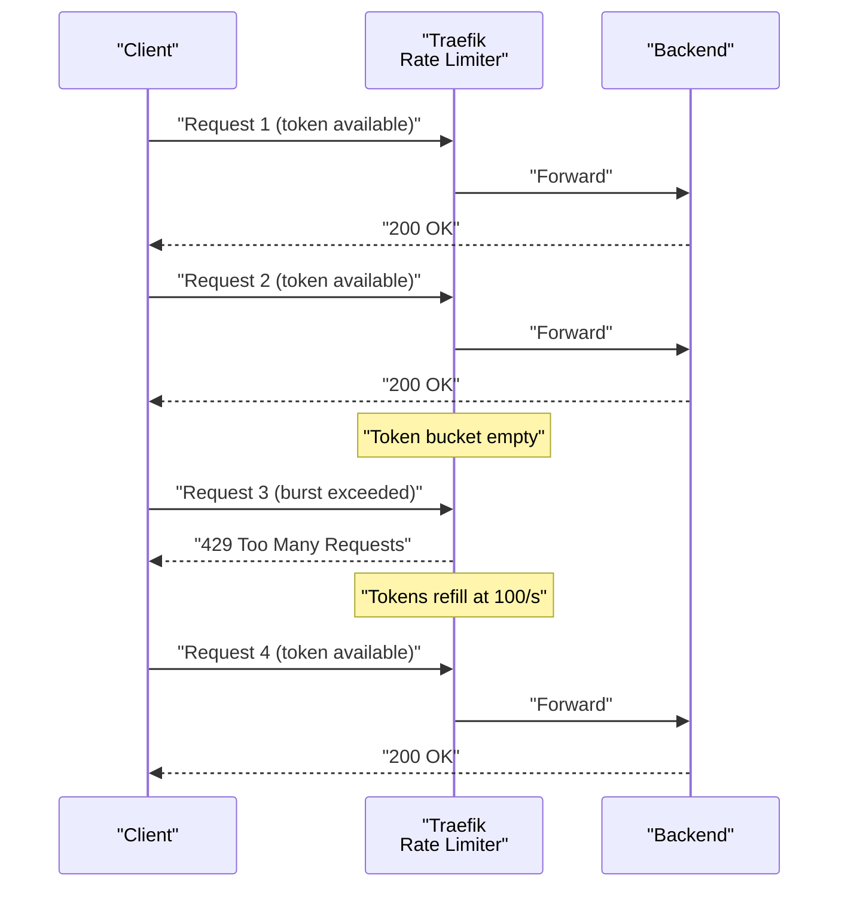

### Per-Route Rate Limiting

Apply different limits to different routes:

```yaml
# Strict limits for login endpoint
---
apiVersion: traefik.containo.us/v1alpha1
kind: Middleware
metadata:
  name: login-rate-limit
  namespace: default
spec:
  rateLimit:
    average: 5
    burst: 3
    period: 1m      # 5 requests per minute max

# Generous limits for API reads
---
apiVersion: traefik.containo.us/v1alpha1
kind: Middleware
metadata:
  name: api-read-limit
  namespace: default
spec:
  rateLimit:
    average: 500
    burst: 100
    period: 1s
```

[↑ Back to TOC](#table-of-contents) · [↑ Course Index](../README.md)

---

## Middleware: BasicAuth

BasicAuth protects routes with username/password credentials stored in an `htpasswd`-format Kubernetes Secret.

### Generating Credentials

```bash
# Install htpasswd (part of apache2-utils on Debian/Ubuntu)
sudo apt install apache2-utils

# Generate a hashed password entry
htpasswd -nb admin 'MySecretPassword'
# Output: admin:$apr1$xyz...

# Base64-encode for use in a Kubernetes Secret stringData
# (stringData handles encoding, so you can paste the raw htpasswd line)
```

```yaml
apiVersion: v1
kind: Secret
metadata:
  name: basic-auth-secret
  namespace: default
type: Opaque
stringData:
  # htpasswd format: user:$apr1$hash...
  # Multiple users: one per line
  users: |
    admin:$apr1$xyz$abc123...
    devuser:$apr1$abc$xyz456...
---
apiVersion: traefik.containo.us/v1alpha1
kind: Middleware
metadata:
  name: admin-auth
  namespace: default
spec:
  basicAuth:
    secret: basic-auth-secret
    removeHeader: true   # Don't forward Authorization header to backend
    realm: "Admin Area"  # Shown in browser auth dialog
```

```yaml
# Apply to the admin route
apiVersion: traefik.containo.us/v1alpha1
kind: IngressRoute
metadata:
  name: admin-route
  namespace: default
spec:
  entryPoints: [websecure]
  routes:
  - match: Host(`admin.example.com`)
    kind: Rule
    middlewares:
    - name: admin-auth
    - name: secure-headers
    services:
    - name: admin-panel
      port: 9000
  tls:
    secretName: wildcard-example-com
```

> **Production note:** BasicAuth sends credentials with every request (base64-encoded, not encrypted). Always use it behind TLS (`websecure` entrypoint). For production auth, prefer OAuth2/OIDC via `traefik-forward-auth` or an external identity provider.

[↑ Back to TOC](#table-of-contents) · [↑ Course Index](../README.md)

---

## Middleware: Strip Prefix and Add Prefix

When your backend service doesn't know it's mounted at a path prefix, you need to strip that prefix before forwarding.

### Strip Prefix

```yaml
apiVersion: traefik.containo.us/v1alpha1
kind: Middleware
metadata:
  name: strip-api-prefix
  namespace: default
spec:
  stripPrefix:
    prefixes:
    - /api
    # forceSlash: true  (default true — ensures the stripped path starts with /)
```

**Example:** Request to `/api/users/42` → forwarded to backend as `/users/42`.

### Add Prefix

The inverse: add a prefix before forwarding (useful when upstream expects it):

```yaml
apiVersion: traefik.containo.us/v1alpha1
kind: Middleware
metadata:
  name: add-v1-prefix
  namespace: default
spec:
  addPrefix:
    prefix: /v1
```

**Example:** Request to `/users/42` → forwarded as `/v1/users/42`.

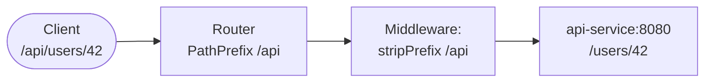

### Path Prefix in Practice: API Gateway Pattern

```yaml
apiVersion: traefik.containo.us/v1alpha1
kind: IngressRoute
metadata:
  name: api-gateway
spec:
  entryPoints: [websecure]
  routes:
  - match: Host(`api.example.com`) && PathPrefix(`/v1/users`)
    kind: Rule
    priority: 20
    middlewares:
    - name: strip-v1-users
    - name: rate-limit
    services:
    - name: user-service
      port: 8080

  - match: Host(`api.example.com`) && PathPrefix(`/v1/orders`)
    kind: Rule
    priority: 20
    middlewares:
    - name: strip-v1-orders
    - name: rate-limit
    services:
    - name: order-service
      port: 8081

  - match: Host(`api.example.com`) && PathPrefix(`/v1/payments`)
    kind: Rule
    priority: 20
    middlewares:
    - name: strip-v1-payments
    - name: rate-limit
    - name: payment-auth
    services:
    - name: payment-service
      port: 8082
  tls:
    secretName: api-tls
```

[↑ Back to TOC](#table-of-contents) · [↑ Course Index](../README.md)

---

## Priority System

Traefik's priority system is one of its most important — and most misunderstood — features. Understanding it prevents subtle routing bugs.

### How Priority Works

1. When a request arrives, Traefik evaluates **all** registered router rules.
2. All rules that match are collected.
3. The router with the **highest priority number** wins.
4. If two matching routers have equal priority, Traefik picks the one with the **longer rule string** (as a tiebreaker).
5. If still equal, behaviour is undefined — avoid this situation.

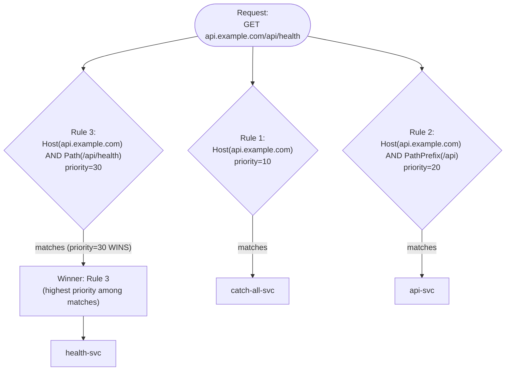

### Priority Conventions

Use these priority ranges for consistency:

| Range | Use case |
|-------|---------|
| 1–9 | Catch-alls (redirect HTTP → HTTPS, default backends) |
| 10–19 | Host-only rules (no path restriction) |
| 20–29 | Host + path prefix |
| 30–39 | Host + exact path |
| 40+ | Special high-priority rules (health checks, feature flags) |

[↑ Back to TOC](#table-of-contents) · [↑ Course Index](../README.md)

---

## Weighted Traffic Splitting

Traefik supports weighted traffic splitting natively via the `TraefikService` CRD. This enables canary releases and blue-green deployments without needing a service mesh.

```yaml
apiVersion: traefik.containo.us/v1alpha1
kind: TraefikService
metadata:
  name: weighted-app
  namespace: default
spec:
  weighted:
    services:
    - name: app-v1           # Stable version
      port: 80
      weight: 90             # 90% of traffic
    - name: app-v2           # Canary version
      port: 80
      weight: 10             # 10% of traffic
---
apiVersion: traefik.containo.us/v1alpha1
kind: IngressRoute
metadata:
  name: canary-route
  namespace: default
spec:
  entryPoints: [websecure]
  routes:
  - match: Host(`app.example.com`)
    kind: Rule
    services:
    - name: weighted-app
      kind: TraefikService   # Reference TraefikService, not a K8s Service
  tls:
    secretName: app-tls
```

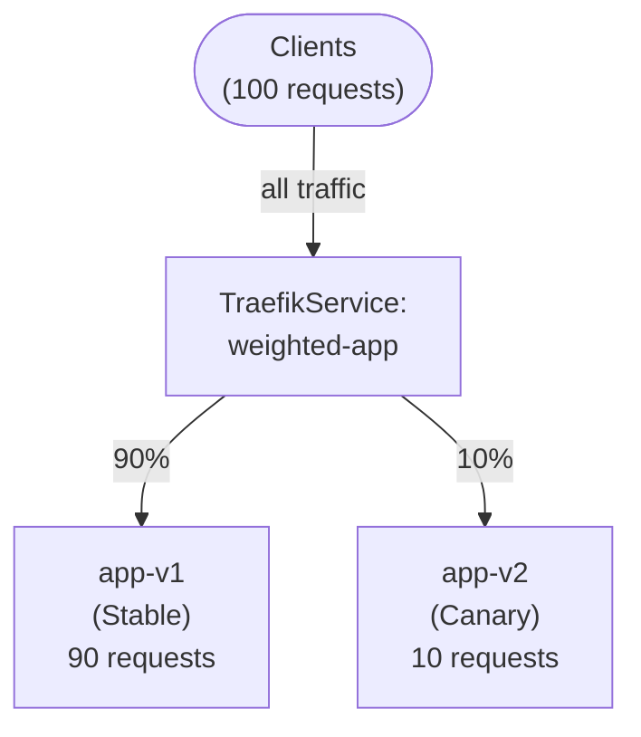

### Canary Promotion Pattern

A typical canary progression:

1. Start: v1=100%, v2=0%
2. Canary: v1=90%, v2=10% — monitor error rates
3. Expand: v1=50%, v2=50% — monitor latency
4. Promote: v1=0%, v2=100%
5. Remove v1 deployment

Each step is a YAML edit and `kubectl apply`. No downtime, no service restart.

[↑ Back to TOC](#table-of-contents) · [↑ Course Index](../README.md)

---

## TCP and UDP Routing

Traefik is not limited to HTTP — it can proxy raw TCP and UDP traffic. This is essential for databases, custom protocols, or any TCP-based service you want to expose through Traefik.

### TCP Routing

TCP routing matches on TLS SNI (Server Name Indication) — the hostname from the TLS ClientHello, before the connection is decrypted:

```yaml
# First: define a TCP entrypoint in Traefik config (via HelmChartConfig)
# ports:
#   postgres:
#     port: 5432
#     protocol: TCP

apiVersion: traefik.containo.us/v1alpha1
kind: IngressRouteTCP
metadata:
  name: postgres-route
  namespace: default
spec:
  entryPoints:
  - postgres          # Custom TCP entrypoint defined in Traefik config
  routes:
  - match: HostSNI(`db.example.com`)
    services:
    - name: postgres-svc
      port: 5432
  tls:
    passthrough: true  # Traefik does NOT terminate TLS; passes it to PostgreSQL
```

> **Passthrough TLS:** With `passthrough: true`, Traefik reads the SNI to decide where to route, but does not decrypt the connection. The backend (PostgreSQL in this case) handles its own TLS. This is the safest pattern for databases.

### TCP Routing Without SNI (Catch-All)

For clients that don't send SNI:

```yaml
routes:
- match: HostSNI(`*`)   # Match any (or no) SNI
  services:
  - name: my-tcp-service
    port: 1234
```

### UDP Routing

```yaml
apiVersion: traefik.containo.us/v1alpha1
kind: IngressRouteUDP
metadata:
  name: dns-route
  namespace: default
spec:
  entryPoints:
  - dns-udp       # UDP entrypoint defined in Traefik config
  routes:
  - services:
    - name: coredns-external
      port: 53
```

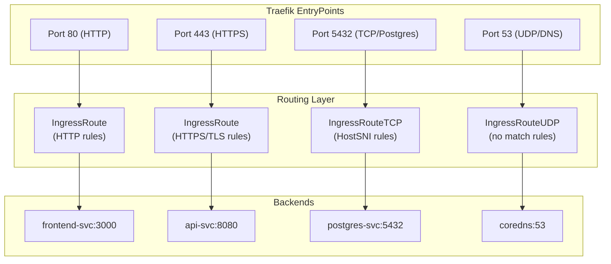

[↑ Back to TOC](#table-of-contents) · [↑ Course Index](../README.md)

---

## Canary Deployment Pattern

Combining weighted traffic splitting with health monitoring creates a safe canary deployment workflow. Here's the full pattern using only k3s-native resources:

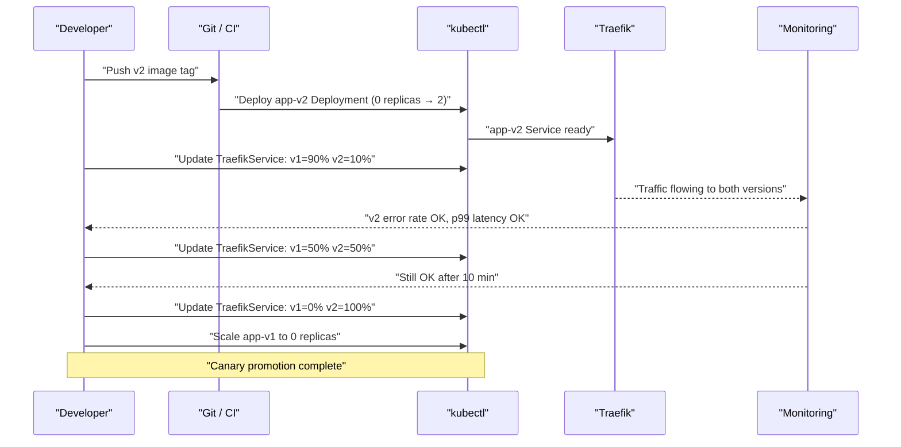

Full manifests for the canary pattern:

```yaml
# 1. Deploy v2 alongside v1
apiVersion: apps/v1
kind: Deployment
metadata:
  name: app-v2
spec:
  replicas: 2
  selector:
    matchLabels:
      app: myapp
      version: v2
  template:
    metadata:
      labels:
        app: myapp
        version: v2
    spec:
      containers:
      - name: app
        image: myorg/myapp:v2.0.0
---
apiVersion: v1
kind: Service
metadata:
  name: app-v2
spec:
  selector:
    app: myapp
    version: v2
  ports:
  - port: 80
    targetPort: 8080
---
# 2. TraefikService for weighted split
apiVersion: traefik.containo.us/v1alpha1
kind: TraefikService
metadata:
  name: canary-split
spec:
  weighted:
    services:
    - name: app-v1
      port: 80
      weight: 90
    - name: app-v2
      port: 80
      weight: 10
---
# 3. IngressRoute references the TraefikService
apiVersion: traefik.containo.us/v1alpha1
kind: IngressRoute
metadata:
  name: app-route
spec:
  entryPoints: [websecure]
  routes:
  - match: Host(`app.example.com`)
    kind: Rule
    services:
    - name: canary-split
      kind: TraefikService
  tls:
    secretName: app-tls
```

[↑ Back to TOC](#table-of-contents) · [↑ Course Index](../README.md)

---

## Lab

The lab deploys a three-service application (frontend, API, admin) with full middleware chains and demonstrates the canary pattern.

```bash
# Apply all lab resources
kubectl apply -f labs/ingress-basic.yaml

# Verify IngressRoutes are registered
kubectl get ingressroute -A

# Check middleware resources
kubectl get middleware -A

# Inspect a specific route
kubectl describe ingressroute myapp-route -n default

# Test path routing (substitute your node IP)
NODE_IP=$(kubectl get nodes -o jsonpath='{.items[0].status.addresses[0].address}')

curl -H "Host: app.example.com" http://$NODE_IP/
curl -H "Host: app.example.com" http://$NODE_IP/api/users
curl -H "Host: app.example.com" http://$NODE_IP/static/logo.png

# Test host routing
curl -H "Host: api.example.com" http://$NODE_IP/
curl -H "Host: admin.example.com" http://$NODE_IP/
# Admin should return 401 (BasicAuth required)

# Test BasicAuth
curl -u admin:SecretPass -H "Host: admin.example.com" http://$NODE_IP/

# View all routes in the Traefik dashboard
kubectl port-forward -n kube-system deploy/traefik 9000:9000 &
echo "Open http://localhost:9000/dashboard/"

# Test canary split — run 20 requests and count distribution
for i in $(seq 1 20); do
  curl -s -H "Host: app.example.com" http://$NODE_IP/version
done
# Roughly 18 responses from v1, 2 from v2

# Simulate canary promotion: edit weights and reapply
kubectl patch traefikservice canary-split \
  --type='json' \
  -p='[{"op": "replace", "path": "/spec/weighted/services/0/weight", "value": 50},
       {"op": "replace", "path": "/spec/weighted/services/1/weight", "value": 50}]'

# Clean up
kubectl delete -f labs/ingress-basic.yaml
```

[↑ Back to TOC](#table-of-contents) · [↑ Course Index](../README.md)

---
*Licensed under [CC BY-NC-SA 4.0](../LICENSE.md) · © 2026 UncleJS*
