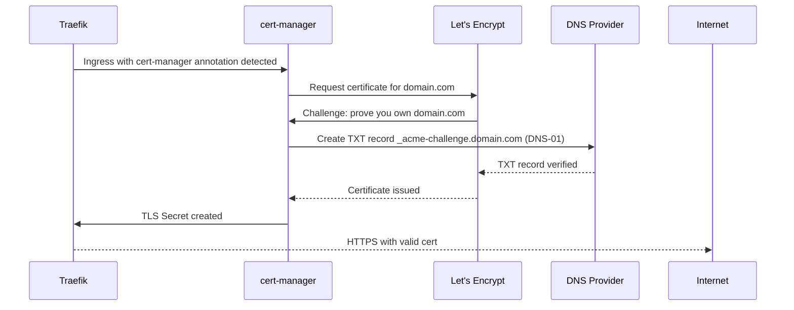
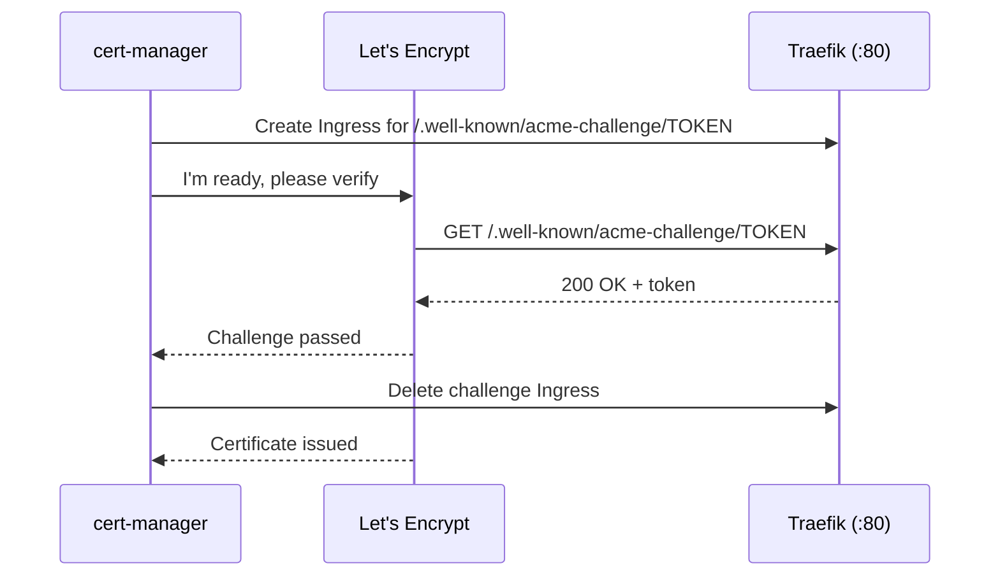

# cert-manager and Let's Encrypt TLS
> Module 07 · Lesson 03 | [↑ Course Index](../README.md)

## Table of Contents
- [Overview](#overview)
- [What is cert-manager?](#what-is-cert-manager)
- [Installing cert-manager](#installing-cert-manager)
- [ClusterIssuers: Let's Encrypt Staging and Production](#clusterissuers-lets-encrypt-staging-and-production)
- [HTTP-01 Challenge](#http-01-challenge)
- [DNS-01 Challenge](#dns-01-challenge)
- [Requesting Certificates](#requesting-certificates)
- [Automatic Certificate via Ingress Annotation](#automatic-certificate-via-ingress-annotation)
- [Automatic Certificate via IngressRoute](#automatic-certificate-via-ingressroute)
- [Certificate Renewal](#certificate-renewal)
- [Troubleshooting Certificates](#troubleshooting-certificates)
- [Lab](#lab)

---

## Overview

cert-manager is the de facto certificate management solution for Kubernetes. It automates requesting, issuing, and renewing TLS certificates from Let's Encrypt (and other CAs). Combined with Traefik, you get automatic HTTPS for all your services.



[↑ Back to TOC](#table-of-contents) · [↑ Course Index](../README.md)

---

## What is cert-manager?

cert-manager extends Kubernetes with certificate-related Custom Resource Definitions:

| CRD | Purpose |
|-----|---------|
| `ClusterIssuer` | Certificate authority config (cluster-wide) |
| `Issuer` | Certificate authority config (namespace-scoped) |
| `Certificate` | Request a specific certificate |
| `CertificateRequest` | Low-level certificate signing request |
| `Order` | ACME order lifecycle |
| `Challenge` | ACME challenge lifecycle |

[↑ Back to TOC](#table-of-contents) · [↑ Course Index](../README.md)

---

## Installing cert-manager

```bash
# Method 1: kubectl (official manifests)
kubectl apply -f https://github.com/cert-manager/cert-manager/releases/latest/download/cert-manager.yaml

# Method 2: Helm (recommended for production)
helm repo add jetstack https://charts.jetstack.io
helm repo update

helm install cert-manager jetstack/cert-manager \
  --namespace cert-manager \
  --create-namespace \
  --set installCRDs=true \
  --set global.leaderElection.namespace=cert-manager

# Verify installation
kubectl get pods -n cert-manager
# NAME                                      READY   STATUS
# cert-manager-xxxx                         1/1     Running
# cert-manager-cainjector-xxxx              1/1     Running
# cert-manager-webhook-xxxx                 1/1     Running
```

> Wait for all three pods to be `Running` before creating issuers.

[↑ Back to TOC](#table-of-contents) · [↑ Course Index](../README.md)

---

## ClusterIssuers: Let's Encrypt Staging and Production

Always test with the **staging** issuer first — Let's Encrypt production has strict rate limits (5 certificates per registered domain per week).

```yaml
# Staging — use for testing, certificate is NOT trusted by browsers
apiVersion: cert-manager.io/v1
kind: ClusterIssuer
metadata:
  name: letsencrypt-staging
spec:
  acme:
    server: https://acme-staging-v02.api.letsencrypt.org/directory
    email: you@example.com
    privateKeySecretRef:
      name: letsencrypt-staging-key
    solvers:
    - http01:
        ingress:
          class: traefik
```

```yaml
# Production — use after staging works; certificates are browser-trusted
apiVersion: cert-manager.io/v1
kind: ClusterIssuer
metadata:
  name: letsencrypt-prod
spec:
  acme:
    server: https://acme-v02.api.letsencrypt.org/directory
    email: you@example.com
    privateKeySecretRef:
      name: letsencrypt-prod-key
    solvers:
    - http01:
        ingress:
          class: traefik
```

```bash
kubectl apply -f labs/cert-manager-issuer.yaml

# Verify
kubectl get clusterissuer
# NAME                   READY   AGE
# letsencrypt-staging    True    30s
# letsencrypt-prod       True    30s
```

[↑ Back to TOC](#table-of-contents) · [↑ Course Index](../README.md)

---

## HTTP-01 Challenge

The HTTP-01 challenge proves domain ownership by serving a token at:
`http://<domain>/.well-known/acme-challenge/<token>`

Requirements:
- Your domain's DNS A record must point to the cluster's public IP
- Port 80 must be publicly accessible
- Traefik must be able to create a temporary `Ingress` for the challenge



[↑ Back to TOC](#table-of-contents) · [↑ Course Index](../README.md)

---

## DNS-01 Challenge

The DNS-01 challenge proves domain ownership by creating a DNS TXT record. It works even if port 80 is not publicly accessible (good for internal/private clusters) and supports wildcard certificates.

```yaml
# Example: DNS-01 with Cloudflare
apiVersion: cert-manager.io/v1
kind: ClusterIssuer
metadata:
  name: letsencrypt-prod-dns
spec:
  acme:
    server: https://acme-v02.api.letsencrypt.org/directory
    email: you@example.com
    privateKeySecretRef:
      name: letsencrypt-prod-dns-key
    solvers:
    - dns01:
        cloudflare:
          email: you@example.com
          apiTokenSecretRef:
            name: cloudflare-api-token
            key: api-token
```

```yaml
# Cloudflare API token secret
apiVersion: v1
kind: Secret
metadata:
  name: cloudflare-api-token
  namespace: cert-manager
type: Opaque
stringData:
  api-token: "<your-cloudflare-api-token>"
```

Supported DNS providers: Cloudflare, Route53, Google Cloud DNS, Azure DNS, DigitalOcean, and many more via [webhook solvers](https://cert-manager.io/docs/configuration/acme/dns01/).

[↑ Back to TOC](#table-of-contents) · [↑ Course Index](../README.md)

---

## Requesting Certificates

### Explicit Certificate Resource
```yaml
apiVersion: cert-manager.io/v1
kind: Certificate
metadata:
  name: example-com-tls
  namespace: default
spec:
  secretName: example-com-tls    # Where the cert will be stored
  issuerRef:
    name: letsencrypt-prod
    kind: ClusterIssuer
  dnsNames:
  - example.com
  - www.example.com
  - api.example.com
  # Wildcard requires DNS-01:
  # - "*.example.com"
  duration: 2160h       # 90 days (default for Let's Encrypt)
  renewBefore: 360h     # renew 15 days before expiry
```

```bash
# Watch certificate status
kubectl get certificate
kubectl describe certificate example-com-tls

# Check the resulting TLS secret
kubectl get secret example-com-tls -o yaml
```

[↑ Back to TOC](#table-of-contents) · [↑ Course Index](../README.md)

---

## Automatic Certificate via Ingress Annotation

The easiest method — annotate your `Ingress` and cert-manager does the rest:

```yaml
apiVersion: networking.k8s.io/v1
kind: Ingress
metadata:
  name: myapp
  annotations:
    cert-manager.io/cluster-issuer: "letsencrypt-prod"
    traefik.ingress.kubernetes.io/router.entrypoints: websecure
spec:
  ingressClassName: traefik
  rules:
  - host: myapp.example.com
    http:
      paths:
      - path: /
        pathType: Prefix
        backend:
          service:
            name: myapp
            port:
              number: 80
  tls:
  - hosts:
    - myapp.example.com
    secretName: myapp-tls   # cert-manager will populate this
```

cert-manager watches for Ingresses with this annotation and automatically creates a `Certificate` resource.

[↑ Back to TOC](#table-of-contents) · [↑ Course Index](../README.md)

---

## Automatic Certificate via IngressRoute

For Traefik `IngressRoute`, use a `Certificate` resource and reference the secret:

```yaml
apiVersion: cert-manager.io/v1
kind: Certificate
metadata:
  name: myapp-cert
spec:
  secretName: myapp-tls
  issuerRef:
    name: letsencrypt-prod
    kind: ClusterIssuer
  dnsNames: [myapp.example.com]
---
apiVersion: traefik.containo.us/v1alpha1
kind: IngressRoute
metadata:
  name: myapp-secure
spec:
  entryPoints: [websecure]
  routes:
  - match: Host(`myapp.example.com`)
    kind: Rule
    services:
    - name: myapp
      port: 80
  tls:
    secretName: myapp-tls   # references cert-manager-created secret
```

[↑ Back to TOC](#table-of-contents) · [↑ Course Index](../README.md)

---

## Certificate Renewal

cert-manager automatically renews certificates before they expire (default: 15 days before). No manual action required.

```bash
# Check certificate expiry
kubectl get certificate -A
# NAMESPACE   NAME        READY   SECRET      AGE
# default     myapp-cert  True    myapp-tls   10d

# See detailed status including expiry
kubectl describe certificate myapp-cert | grep -A5 "Renewal Time"

# Force an immediate renewal (if needed)
kubectl delete secret myapp-tls
# cert-manager will re-issue automatically

# Or annotate to trigger renewal
kubectl annotate certificate myapp-cert \
  cert-manager.io/renew-immediately="true"
```

[↑ Back to TOC](#table-of-contents) · [↑ Course Index](../README.md)

---

## Troubleshooting Certificates

```bash
# Step 1: Check certificate status
kubectl describe certificate myapp-cert

# Step 2: Check ACME Order
kubectl get orders -A
kubectl describe order myapp-cert-<hash>

# Step 3: Check Challenge
kubectl get challenges -A
kubectl describe challenge myapp-cert-<hash>-<hash>

# Step 4: Check cert-manager logs
kubectl logs -n cert-manager deploy/cert-manager --tail=50 | grep -i error

# Step 5: Test HTTP-01 accessibility (from outside the cluster)
curl http://myapp.example.com/.well-known/acme-challenge/test
```

### Common Issues

| Problem | Cause | Fix |
|---------|-------|-----|
| `Certificate not ready` | Challenge failing | Check Order and Challenge events |
| `Connection refused` on challenge | Port 80 blocked | Open firewall port 80 |
| DNS doesn't resolve | DNS not propagated | Wait for DNS TTL, or check DNS record |
| `Rate limit exceeded` | Too many cert requests | Use staging issuer; wait 1 week |
| `ClusterIssuer not ready` | Wrong ACME credentials | Check email / API token |

[↑ Back to TOC](#table-of-contents) · [↑ Course Index](../README.md)

---

## Lab

See [`labs/cert-manager-issuer.yaml`](labs/cert-manager-issuer.yaml) and [`labs/ingressroute-tls.yaml`](labs/ingressroute-tls.yaml).

```bash
# 1. Install cert-manager
kubectl apply -f https://github.com/cert-manager/cert-manager/releases/latest/download/cert-manager.yaml

# 2. Create issuers (edit email address first)
kubectl apply -f labs/cert-manager-issuer.yaml

# 3. Deploy app with TLS IngressRoute
kubectl apply -f labs/ingressroute-tls.yaml

# 4. Watch certificate issuance
kubectl get certificate -w

# 5. Verify TLS
curl -v https://myapp.example.com/ 2>&1 | grep -E "SSL|subject|issuer"
```

[↑ Back to TOC](#table-of-contents) · [↑ Course Index](../README.md)

---
*Licensed under [CC BY-NC-SA 4.0](../LICENSE.md) · © 2026 UncleJS*
