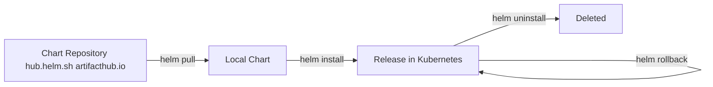
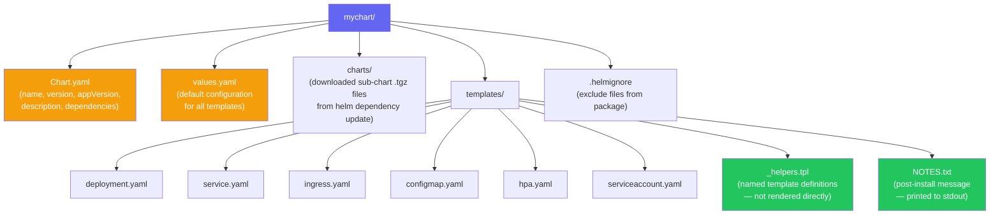
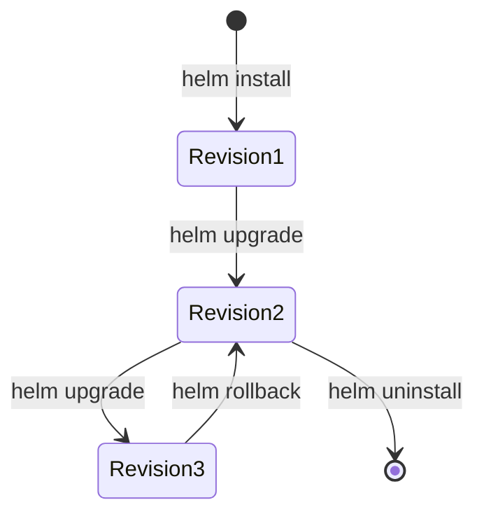
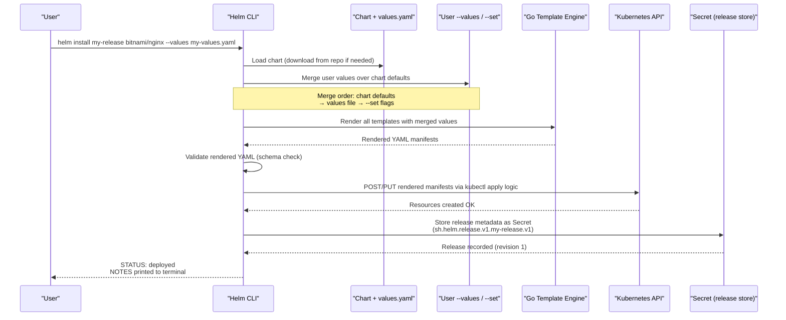

# Helm Basics
> Module 08 · Lesson 01 | [↑ Course Index](../README.md)


[](../README.md)
[](../LICENSE.md)

## Table of Contents
- [Overview](#overview)
- [What is Helm?](#what-is-helm)
- [Core Concepts](#core-concepts)
- [Helm Chart Structure](#helm-chart-structure)
- [Installing Helm](#installing-helm)
- [Helm Repositories](#helm-repositories)
- [Finding Charts](#finding-charts)
- [Installing a Chart](#installing-a-chart)
- [Helm Install Sequence](#helm-install-sequence)
- [Inspecting Releases](#inspecting-releases)
- [Upgrading and Rolling Back](#upgrading-and-rolling-back)
- [Uninstalling Releases](#uninstalling-releases)
- [Helm Values](#helm-values)
- [Lab](#lab)

---

## Overview

Helm is the package manager for Kubernetes. Instead of managing dozens of individual YAML files, you install, upgrade, and roll back entire applications with single commands. This lesson covers the fundamentals of Helm — repositories, charts, releases, and values.

[↑ Back to TOC](#table-of-contents) · [↑ Course Index](../README.md)

---

## What is Helm?



Helm is:
- A **CLI tool** (`helm`) that talks to the Kubernetes API
- A **chart format** — a package of Kubernetes manifests + templates
- A **release manager** — tracks what version of a chart is installed where

Helm v3 (current) runs entirely client-side — no Tiller server needed.

[↑ Back to TOC](#table-of-contents) · [↑ Course Index](../README.md)

---

## Core Concepts

| Concept | Description |
|---------|-------------|
| **Chart** | A package containing templates + default values |
| **Repository** | A collection of charts (like a package registry) |
| **Release** | A specific installation of a chart in a cluster |
| **Values** | Configuration that customises a chart installation |
| **Revision** | A numbered snapshot of a release (for rollback) |
| **Template** | A Go-template YAML file that renders to Kubernetes manifests |

[↑ Back to TOC](#table-of-contents) · [↑ Course Index](../README.md)

---

## Helm Chart Structure

A Helm chart is a directory tree with a specific layout. Every file has a defined role, and Helm processes them in a specific order during rendering:



Files whose names begin with `_` (like `_helpers.tpl`) are never rendered directly as Kubernetes manifests. They serve as a library of named templates that other templates can call via `{{ include "chart.name" . }}`. The `NOTES.txt` file is special — it is rendered and printed to the terminal after a successful `helm install` or `helm upgrade`, giving users connection instructions and next steps.

[↑ Back to TOC](#table-of-contents) · [↑ Course Index](../README.md)

---

## Installing Helm

```bash
# Method 1: Official install script (recommended)
curl https://raw.githubusercontent.com/helm/helm/main/scripts/get-helm-3 | bash

# Method 2: Manual binary install
HELM_VERSION=$(curl -s https://api.github.com/repos/helm/helm/releases/latest \
  | grep '"tag_name"' | cut -d'"' -f4)
curl -Lo helm.tar.gz \
  "https://get.helm.sh/helm-${HELM_VERSION}-linux-amd64.tar.gz"
tar -xzf helm.tar.gz
sudo mv linux-amd64/helm /usr/local/bin/helm

# Verify
helm version
# version.BuildInfo{Version:"v3.x.x", ...}
```

Helm uses your current kubeconfig context:
```bash
# Helm uses the same cluster as kubectl
kubectl config current-context
helm list --all-namespaces
```

[↑ Back to TOC](#table-of-contents) · [↑ Course Index](../README.md)

---

## Helm Repositories

```bash
# Add popular repositories
helm repo add stable       https://charts.helm.sh/stable
helm repo add bitnami      https://charts.bitnami.com/bitnami
helm repo add ingress-nginx https://kubernetes.github.io/ingress-nginx
helm repo add jetstack     https://charts.jetstack.io
helm repo add prometheus   https://prometheus-community.github.io/helm-charts

# Update all repositories (like apt update)
helm repo update

# List configured repositories
helm repo list

# Remove a repository
helm repo remove stable
```

[↑ Back to TOC](#table-of-contents) · [↑ Course Index](../README.md)

---

## Finding Charts

```bash
# Search Artifact Hub (the central chart registry)
helm search hub nginx
helm search hub wordpress --max-col-width=50

# Search a specific repo you've added
helm search repo bitnami/nginx
helm search repo bitnami --versions   # show all versions

# Get chart information before installing
helm show chart bitnami/nginx
helm show values bitnami/nginx        # show all configurable values
helm show readme bitnami/nginx
```

[↑ Back to TOC](#table-of-contents) · [↑ Course Index](../README.md)

---

## Installing a Chart

```bash
# Basic install (auto-generates release name)
helm install my-nginx bitnami/nginx

# Install in a specific namespace (create if needed)
helm install my-nginx bitnami/nginx \
  --namespace web \
  --create-namespace

# Install a specific chart version
helm install my-nginx bitnami/nginx \
  --version 15.3.5

# Install with custom values (via --set)
helm install my-nginx bitnami/nginx \
  --set service.type=NodePort \
  --set replicaCount=3

# Install with a values file
helm install my-nginx bitnami/nginx \
  --values labs/values-override.yaml

# Dry-run (preview manifests without applying)
helm install my-nginx bitnami/nginx \
  --dry-run --debug | head -100
```

[↑ Back to TOC](#table-of-contents) · [↑ Course Index](../README.md)

---

## Inspecting Releases

```bash
# List all releases
helm list
helm list --all-namespaces

# Show release details
helm status my-nginx

# Show computed values for a release
helm get values my-nginx
helm get values my-nginx --all     # includes defaults

# Show rendered manifests for a release
helm get manifest my-nginx

# Show all info (values + manifest + hooks)
helm get all my-nginx

# Show release history
helm history my-nginx
# REVISION   STATUS     CHART           APP VERSION
# 1          superseded nginx-15.3.5    1.25.3
# 2          deployed   nginx-15.4.0    1.25.4
```

[↑ Back to TOC](#table-of-contents) · [↑ Course Index](../README.md)

---

## Upgrading and Rolling Back

```bash
# Upgrade with new values
helm upgrade my-nginx bitnami/nginx \
  --set replicaCount=5

# Upgrade to a new chart version
helm upgrade my-nginx bitnami/nginx \
  --version 15.5.0

# Upgrade with a values file
helm upgrade my-nginx bitnami/nginx \
  --values labs/values-override.yaml

# Upgrade, install if not present (upsert)
helm upgrade --install my-nginx bitnami/nginx \
  --namespace web --create-namespace \
  --values labs/values-override.yaml

# Roll back to previous revision
helm rollback my-nginx

# Roll back to a specific revision
helm rollback my-nginx 1
```



[↑ Back to TOC](#table-of-contents) · [↑ Course Index](../README.md)

---

## Helm Install Sequence

When you run `helm install`, Helm executes several steps before any Kubernetes resources are created. Understanding the sequence helps you debug failed installs and understand what the `--dry-run` flag skips:



Helm stores each release as a Kubernetes `Secret` in the same namespace as the release. This is how `helm rollback` works — it reads the previous revision's Secret, re-renders the manifests from that snapshot, and applies them. The Secret is also why `helm list` works from any machine with cluster access, without needing local state.

[↑ Back to TOC](#table-of-contents) · [↑ Course Index](../README.md)

---

## Uninstalling Releases

```bash
# Uninstall (removes all Kubernetes resources)
helm uninstall my-nginx

# Keep history for potential rollback tracking
helm uninstall my-nginx --keep-history

# Uninstall from a specific namespace
helm uninstall my-nginx --namespace web
```

> `helm uninstall` removes all Kubernetes objects created by the chart (Deployments, Services, ConfigMaps, etc.) but does **not** delete PersistentVolumeClaims by default. Check `helm show values <chart>` for `persistence.keep` options.

[↑ Back to TOC](#table-of-contents) · [↑ Course Index](../README.md)

---

## Helm Values

Values are the configuration layer on top of a chart. They flow:

```
Chart's values.yaml  (defaults)
        ↓ overridden by
User's --values file
        ↓ overridden by
--set flags
```

### Inspecting Default Values
```bash
helm show values bitnami/nginx > nginx-defaults.yaml
```

### Creating a Values Override File
```yaml
# my-values.yaml
replicaCount: 3

service:
  type: NodePort
  nodePorts:
    http: 30080

resources:
  requests:
    cpu: 100m
    memory: 128Mi
  limits:
    cpu: 500m
    memory: 256Mi

ingress:
  enabled: true
  hostname: myapp.example.com
```

### `--set` Syntax Quick Reference
```bash
helm install app chart/name \
  --set key=value \
  # nested: a.b.c
  --set a.b.c=value \
  # list index
  --set list[0]=a \
  # whole list
  --set list={a,b,c} \
  --set "key=value with spaces" # quoted values
```

[↑ Back to TOC](#table-of-contents) · [↑ Course Index](../README.md)

---

## Lab

```bash
# Add bitnami repo
helm repo add bitnami https://charts.bitnami.com/bitnami
helm repo update

# Inspect the nginx chart
helm show values bitnami/nginx | head -50

# Install with override values
helm install nginx-demo bitnami/nginx \
  --namespace helm-demo \
  --create-namespace \
  --values labs/values-override.yaml

# Check the release
helm status nginx-demo -n helm-demo
kubectl get all -n helm-demo

# Upgrade with changed replicas
helm upgrade nginx-demo bitnami/nginx \
  --namespace helm-demo \
  --values labs/values-override.yaml \
  --set replicaCount=3

# View history and rollback
helm history nginx-demo -n helm-demo
helm rollback nginx-demo 1 -n helm-demo

# Clean up
helm uninstall nginx-demo -n helm-demo
```

[↑ Back to TOC](#table-of-contents) · [↑ Course Index](../README.md)

---
*Licensed under [CC BY-NC-SA 4.0](../LICENSE.md) · © 2026 UncleJS*
