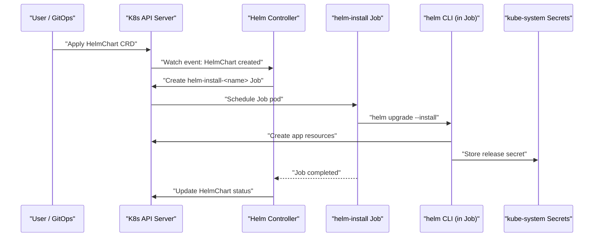
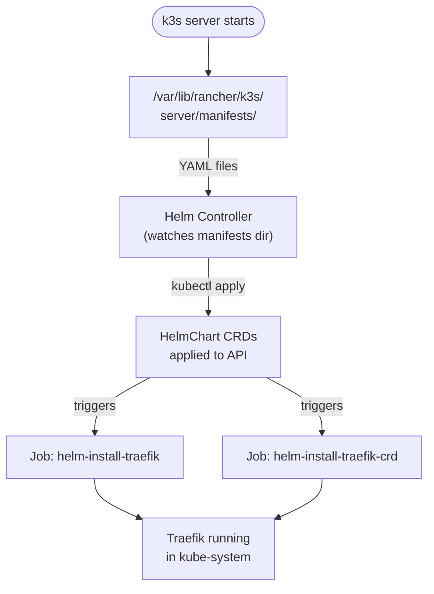
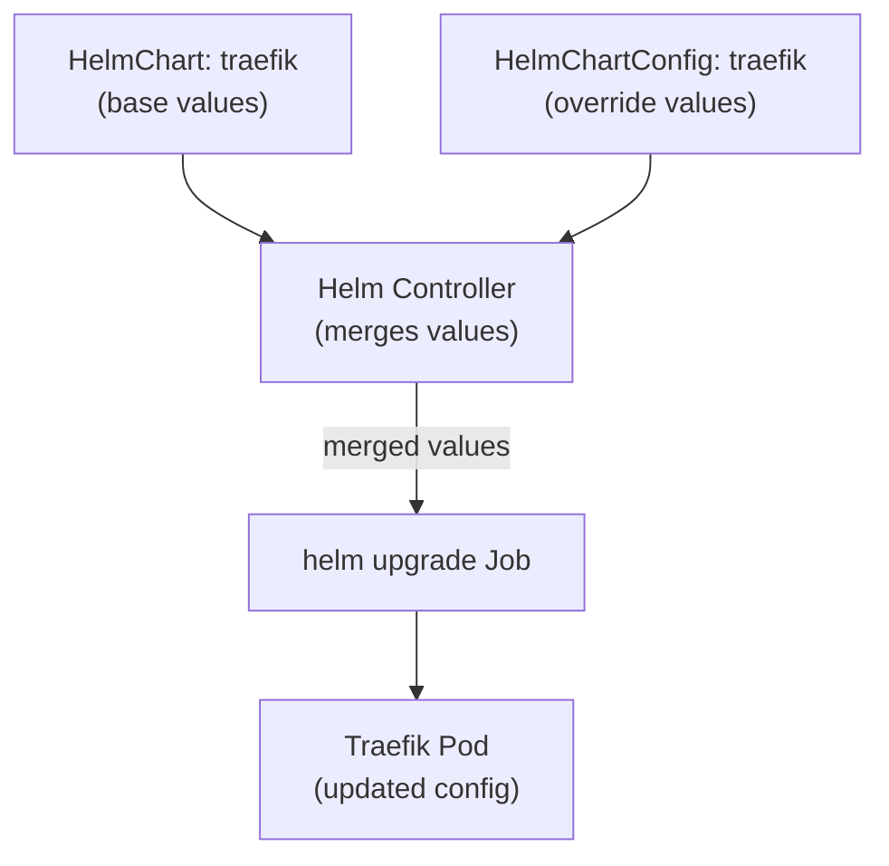
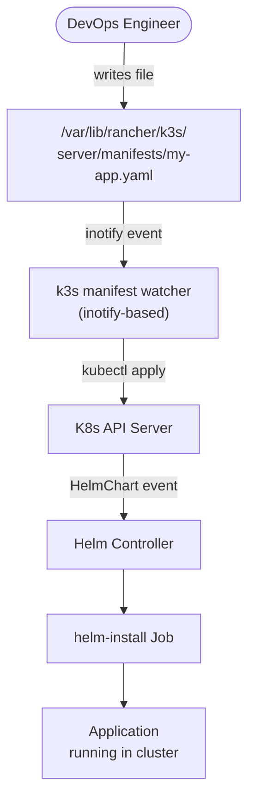
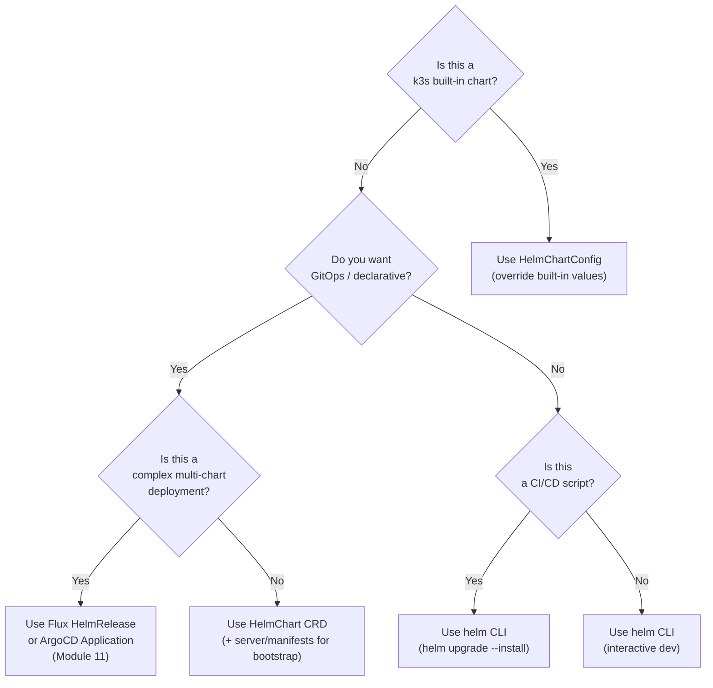
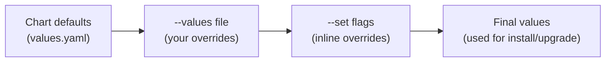
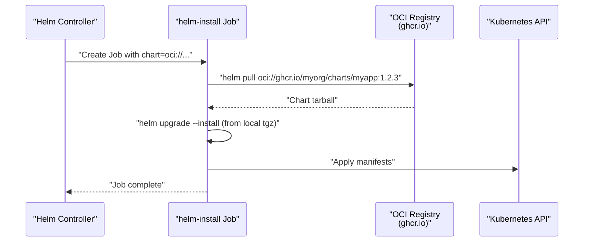
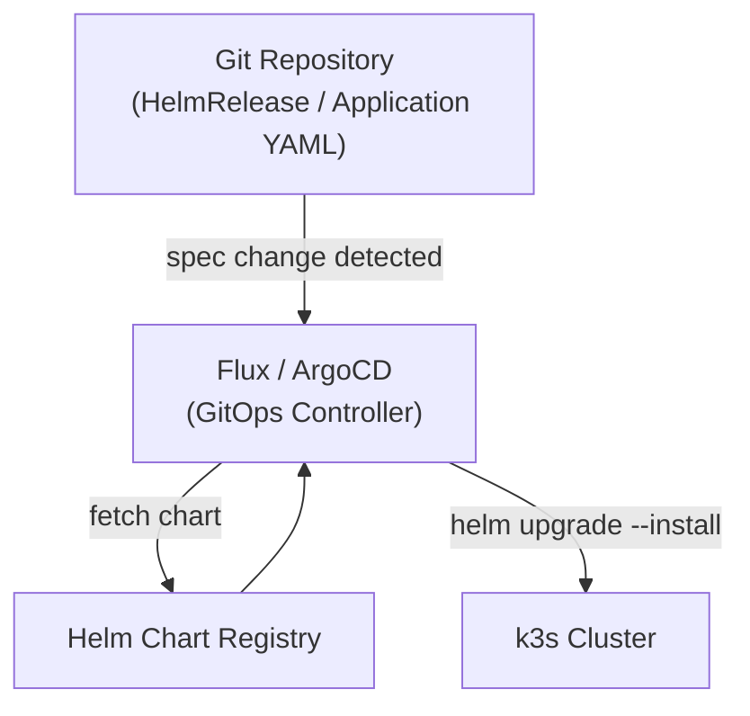
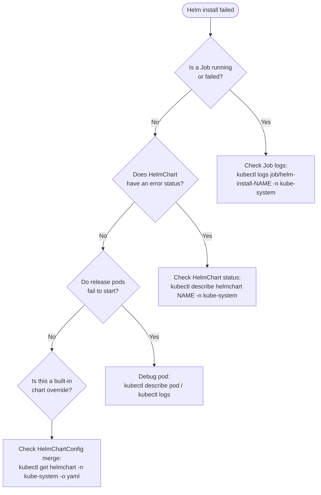

# Helm with k3s
> Module 08 · Lesson 02 | [↑ Course Index](../README.md)


[](../README.md)
[](../LICENSE.md)

## Table of Contents
- [Overview](#overview)
- [k3s Built-in Helm Controller](#k3s-built-in-helm-controller)
- [HelmChart CRD — Declarative Chart Installation](#helmchart-crd--declarative-chart-installation)
- [HelmChartConfig CRD — Customising Built-in Charts](#helmchartconfig-crd--customising-built-in-charts)
- [Auto-deploy Manifests from server/manifests](#auto-deploy-manifests-from-servermanifests)
- [Helm vs HelmChart CRD: When to Use Each](#helm-vs-helmchart-crd-when-to-use-each)
- [Deploying Applications with Helm CLI](#deploying-applications-with-helm-cli)
- [Managing Values and Upgrades](#managing-values-and-upgrades)
- [Private Chart Repositories](#private-chart-repositories)
- [OCI Chart Registries](#oci-chart-registries)
- [Helm and GitOps](#helm-and-gitops)
- [Troubleshooting Helm Releases in k3s](#troubleshooting-helm-releases-in-k3s)
- [Lab](#lab)

---

## Overview

k3s ships with a built-in **Helm Controller** — a Kubernetes operator that watches for `HelmChart` Custom Resources and automatically installs or upgrades the referenced charts using `helm`. This is exactly how k3s itself deploys its built-in components: Traefik, Flannel's CNI config, and the ServiceLB controller are all managed this way.

Understanding the k3s Helm integration gives you two complementary paths for managing charts:

1. **Helm CLI** — interactive, scriptable, and familiar. Best for development and CI/CD.
2. **HelmChart CRD** — declarative, reconciled by k3s. Best for GitOps and bootstrapping.

This lesson covers both paths deeply, including how they interact, when each is appropriate, and the special considerations that apply to k3s specifically — including the `/server/manifests/` auto-deploy mechanism and `HelmChartConfig` for customising built-in charts.

[↑ Back to TOC](#table-of-contents) · [↑ Course Index](../README.md)

---

## k3s Built-in Helm Controller

The Helm Controller is a Kubernetes operator running inside k3s itself. It lives in `kube-system` and watches two CRD types:

- `HelmChart` — declares a chart to install
- `HelmChartConfig` — extends an existing `HelmChart` with extra values

When a `HelmChart` resource is created or updated, the controller:
1. Creates a `Job` in `kube-system` that runs the `rancher/klipper-helm` image
2. That Job runs `helm install` or `helm upgrade` with the specified values
3. Helm stores the release state as Kubernetes Secrets (standard Helm behaviour)
4. The Job completes and is cleaned up



### Viewing Helm Controller Activity

```bash
# Find the Helm controller pod
kubectl get pods -n kube-system | grep helm-controller

# Watch for active install jobs
kubectl get jobs -n kube-system -w

# All HelmChart resources (k3s-managed components)
kubectl get helmchart -n kube-system

# Detailed status of a HelmChart
kubectl describe helmchart traefik -n kube-system

# Helm releases visible to the CLI (same state)
helm list -n kube-system
helm list -A   # All namespaces
```

### How k3s Bootstraps Its Own Components

k3s ships with YAML files in `/var/lib/rancher/k3s/server/manifests/` that define `HelmChart` resources for its built-in components. On first boot, the Helm Controller reads these files and installs Traefik, the CNI config, etc.



[↑ Back to TOC](#table-of-contents) · [↑ Course Index](../README.md)

---

## HelmChart CRD — Declarative Chart Installation

The `HelmChart` CRD is the k3s-native way to install and manage Helm charts declaratively. You define what you want installed, and the controller ensures it's installed (and kept up to date).

```yaml
apiVersion: helm.cattle.io/v1
kind: HelmChart
metadata:
  name: my-nginx
  namespace: kube-system    # MUST be kube-system — controller only watches here
spec:
  repo: https://charts.bitnami.com/bitnami
  chart: nginx
  version: "15.3.5"         # Pin to a specific version; omit for latest
  targetNamespace: web       # Namespace where the release is installed
  createNamespace: true      # Create targetNamespace if it doesn't exist
  valuesContent: |-
    replicaCount: 2
    service:
      type: ClusterIP
    resources:
      requests:
        cpu: 100m
        memory: 128Mi
```

> **Namespace requirement:** The `HelmChart` resource itself **must** live in `kube-system`. The `targetNamespace` field controls where the Helm release is installed.

### HelmChart Spec Reference

| Field | Description | Default |
|-------|-------------|---------|
| `repo` | Chart repository URL | — |
| `chart` | Chart name | — |
| `version` | Chart version (semver) | latest |
| `targetNamespace` | Install release into this namespace | `default` |
| `createNamespace` | Create `targetNamespace` if absent | `false` |
| `valuesContent` | Inline YAML values string | — |
| `set` | Additional `--set` overrides (map) | — |
| `jobImage` | Override the klipper-helm image | bundled |
| `timeout` | Helm operation timeout | `5m0s` |
| `helmVersion` | Force Helm v2 or v3 | `v3` |
| `backOffLimit` | Job retry limit | `1000` |

### Watching the Installation

```bash
# Watch for the Job created by the controller
kubectl get jobs -n kube-system -w

# Follow Job logs in real time
JOB=$(kubectl get jobs -n kube-system -o name | grep helm-install-my-nginx)
kubectl logs -n kube-system $JOB -f

# Once complete, verify in target namespace
kubectl get all -n web
```

### Updating a HelmChart

Just edit the `HelmChart` resource and apply. The controller detects the diff and runs `helm upgrade`:

```bash
kubectl edit helmchart my-nginx -n kube-system
# Change version or valuesContent — controller upgrades automatically
```

[↑ Back to TOC](#table-of-contents) · [↑ Course Index](../README.md)

---

## HelmChartConfig CRD — Customising Built-in Charts

`HelmChartConfig` is a companion CRD that adds extra Helm values to an **existing** `HelmChart` without replacing it. This is the canonical way to customise the Traefik chart (and other k3s built-ins) without touching k3s internals.

The controller **merges** the values from `HelmChartConfig.valuesContent` on top of `HelmChart.valuesContent`, then runs `helm upgrade`.



### Customising Traefik (Real Example)

```yaml
apiVersion: helm.cattle.io/v1
kind: HelmChartConfig
metadata:
  name: traefik           # Must match the HelmChart name exactly
  namespace: kube-system
spec:
  valuesContent: |-
    # Enable access logs
    logs:
      access:
        enabled: true
        format: json
        filePath: /data/log/traefik-access.log

    # Redirect HTTP to HTTPS globally
    ports:
      web:
        redirectTo:
          port: websecure

    # Set resource limits
    resources:
      requests:
        cpu: 100m
        memory: 50Mi
      limits:
        cpu: 300m
        memory: 150Mi

    # Enable Prometheus metrics
    metrics:
      prometheus:
        entryPoint: traefik

    # Additional arguments
    additionalArguments:
    - "--providers.kubernetesingress.ingressendpoint.publishedservice=kube-system/traefik"
```

```bash
# Apply the config
kubectl apply -f traefik-config.yaml

# Watch Traefik pod restart with new config
kubectl rollout status deploy/traefik -n kube-system
```

> **One config per chart:** There can only be one `HelmChartConfig` per `HelmChart`. If you need to manage values from multiple sources, use Flux's `HelmRelease` instead (covered in Module 11).

[↑ Back to TOC](#table-of-contents) · [↑ Course Index](../README.md)

---

## Auto-deploy Manifests from server/manifests

k3s's `/var/lib/rancher/k3s/server/manifests/` directory is a watched drop zone. Any YAML file placed here is automatically applied to the cluster on startup and whenever the file changes.



### Using server/manifests for Bootstrap

```bash
# Drop a HelmChart definition at startup time
sudo tee /var/lib/rancher/k3s/server/manifests/prometheus-stack.yaml <<'EOF'
apiVersion: helm.cattle.io/v1
kind: HelmChart
metadata:
  name: prometheus
  namespace: kube-system
spec:
  repo: https://prometheus-community.github.io/helm-charts
  chart: kube-prometheus-stack
  version: "58.0.0"
  targetNamespace: monitoring
  createNamespace: true
  valuesContent: |-
    grafana:
      adminPassword: changeme
      persistence:
        enabled: true
        size: 5Gi
    prometheus:
      prometheusSpec:
        retention: 15d
        storageSpec:
          volumeClaimTemplate:
            spec:
              resources:
                requests:
                  storage: 20Gi
EOF
```

k3s detects the file within seconds and begins the installation. No `kubectl` command needed.

### Important Behaviour Notes

| Behaviour | Details |
|-----------|---------|
| **File added** | Resources are created immediately |
| **File modified** | Resources are updated (`kubectl apply` semantics) |
| **File deleted** | Resources are **NOT** automatically deleted — you must run `helm uninstall` manually |
| **Idempotent** | Re-applying an unchanged file is safe (no-op) |
| **Ordering** | Files are applied alphabetically — prefix with `00_`, `01_` etc. if ordering matters |

> **GitOps with server/manifests:** This directory is a good place for cluster-level bootstrap resources that should be applied before any GitOps tooling is running (e.g., the Flux or ArgoCD installation itself). Once GitOps is running, let it own the rest.

[↑ Back to TOC](#table-of-contents) · [↑ Course Index](../README.md)

---

## Helm vs HelmChart CRD: When to Use Each



| Scenario | Tool |
|----------|------|
| Customise Traefik, Flannel, etc. | `HelmChartConfig` CRD |
| Declarative single-chart install | `HelmChart` CRD |
| Bootstrap charts at k3s startup | `/server/manifests/` + `HelmChart` CRD |
| Interactive dev installs | `helm install` CLI |
| CI/CD pipelines | `helm upgrade --install` CLI |
| Multi-chart GitOps deployments | Flux / ArgoCD (Module 11) |
| Complex dependency ordering | Flux `HelmRelease` with `dependsOn` |

[↑ Back to TOC](#table-of-contents) · [↑ Course Index](../README.md)

---

## Deploying Applications with Helm CLI

The Helm CLI workflow remains fully functional in k3s — Helm talks directly to the Kubernetes API and manages its own release state.

### Complete Example: Prometheus Stack

```bash
# Step 1: Add the chart repository
helm repo add prometheus-community \
  https://prometheus-community.github.io/helm-charts
helm repo update

# Step 2: Inspect available versions
helm search repo prometheus-community/kube-prometheus-stack --versions | head -10

# Step 3: Review the default values
helm show values prometheus-community/kube-prometheus-stack | less

# Step 4: Create a values override file
cat > values-prometheus.yaml <<'EOF'
grafana:
  adminPassword: "admin123"
  persistence:
    enabled: true
    size: 5Gi
prometheus:
  prometheusSpec:
    retention: 15d
alertmanager:
  enabled: true
EOF

# Step 5: Create target namespace
kubectl create namespace monitoring

# Step 6: Install
helm install prometheus prometheus-community/kube-prometheus-stack \
  --namespace monitoring \
  --values values-prometheus.yaml \
  --wait          # Block until all pods are Ready
  --timeout 10m   # k3s on low-power hardware may need extra time

# Step 7: Verify
helm status prometheus -n monitoring
kubectl get pods -n monitoring
```

[↑ Back to TOC](#table-of-contents) · [↑ Course Index](../README.md)

---

## Managing Values and Upgrades

### Values Hierarchy

Helm merges values from multiple sources in this order (later overrides earlier):



Multiple `--values` files are merged left to right:

```bash
helm upgrade prometheus prometheus-community/kube-prometheus-stack \
  --namespace monitoring \
  --values base-values.yaml \       # Applied first
  --values env-prod-values.yaml \   # Overrides base
  --set grafana.adminPassword=newpass  # Highest priority
```

### Upgrade Strategies

```bash
# Upgrade to a new chart version
helm upgrade prometheus prometheus-community/kube-prometheus-stack \
  --namespace monitoring \
  --version 59.0.0 \
  --values values-prometheus.yaml \
  --wait

# Upgrade only if installed, install if not
helm upgrade --install prometheus prometheus-community/kube-prometheus-stack \
  --namespace monitoring \
  --create-namespace \
  --values values-prometheus.yaml

# Diff before upgrading (requires helm-diff plugin)
helm plugin install https://github.com/databus23/helm-diff
helm diff upgrade prometheus prometheus-community/kube-prometheus-stack \
  --values values-prometheus.yaml -n monitoring

# Rollback to previous revision
helm history prometheus -n monitoring
helm rollback prometheus 2 -n monitoring  # Roll back to revision 2
```

### Helm Release Secrets

Helm stores each release revision as a Kubernetes Secret in the release namespace:

```bash
# View release secrets
kubectl get secrets -n monitoring -l owner=helm

# The most recent release is the current state
kubectl get secret sh.helm.release.v1.prometheus.v3 -n monitoring \
  -o jsonpath='{.data.release}' | base64 -d | gzip -d | python3 -m json.tool | less
```

[↑ Back to TOC](#table-of-contents) · [↑ Course Index](../README.md)

---

## Private Chart Repositories

```bash
# HTTP basic auth
helm repo add myrepo https://charts.company.internal \
  --username ci-user \
  --password "$(cat /run/secrets/helm-token)"

# TLS client certificate
helm repo add myrepo https://charts.company.internal \
  --cert-file ./client.crt \
  --key-file  ./client.key \
  --ca-file   ./ca.crt

# Skip TLS verification (dev only)
helm repo add myrepo https://charts.company.internal \
  --insecure-skip-tls-verify

# Update after adding
helm repo update
helm search repo myrepo/
```

### Private Repo in HelmChart CRD

For private repos with basic auth, store credentials in a Secret:

```yaml
apiVersion: v1
kind: Secret
metadata:
  name: helm-repo-credentials
  namespace: kube-system
type: Opaque
stringData:
  username: "ci-user"
  password: "my-token"
---
apiVersion: helm.cattle.io/v1
kind: HelmChart
metadata:
  name: my-private-app
  namespace: kube-system
spec:
  repo: https://charts.company.internal
  chart: my-app
  version: "1.2.0"
  targetNamespace: apps
  authSecret:
    name: helm-repo-credentials
```

[↑ Back to TOC](#table-of-contents) · [↑ Course Index](../README.md)

---

## OCI Chart Registries

Helm 3.8+ supports OCI (Open Container Initiative) registries. Charts are stored as OCI artifacts alongside container images — in GitHub Container Registry (GHCR), Docker Hub, AWS ECR, and others.

```bash
# Log in to the OCI registry
helm registry login ghcr.io \
  --username your-github-user \
  --password "$(cat ~/.github-token)"

# Pull and install in one step (no repo add needed)
helm install my-app oci://ghcr.io/myorg/charts/myapp --version 1.2.3

# Pull chart locally for inspection
helm pull oci://ghcr.io/myorg/charts/myapp --version 1.2.3
ls myapp-1.2.3.tgz

# Push your chart to OCI registry
helm package ./my-chart/            # Creates my-chart-1.0.0.tgz
helm push my-chart-1.0.0.tgz oci://ghcr.io/myorg/charts

# Show available versions (OCI doesn't support helm search — use registry API)
```

### OCI Chart in HelmChart CRD

```yaml
apiVersion: helm.cattle.io/v1
kind: HelmChart
metadata:
  name: my-oci-app
  namespace: kube-system
spec:
  # Use 'chart' instead of 'repo' + 'chart' for OCI
  chart: oci://ghcr.io/myorg/charts/myapp
  version: "1.2.3"
  targetNamespace: apps
  createNamespace: true
  valuesContent: |-
    replicaCount: 2
    image:
      tag: "1.2.3"
```



[↑ Back to TOC](#table-of-contents) · [↑ Course Index](../README.md)

---

## Helm and GitOps

In a full GitOps setup, you don't run `helm install` manually — a GitOps controller watches your Git repository and reconciles the cluster state. The two main options are:

**Flux HelmRelease** (Module 11):
```yaml
# Flux watches this HelmRelease in Git and reconciles it
apiVersion: helm.toolkit.fluxcd.io/v2
kind: HelmRelease
metadata:
  name: my-app
  namespace: apps
spec:
  interval: 5m            # Reconcile every 5 minutes
  chart:
    spec:
      chart: my-app
      version: ">=1.0.0 <2.0.0"  # SemVer range
      sourceRef:
        kind: HelmRepository
        name: myrepo
  values:
    replicaCount: 3
  upgrade:
    remediation:
      retries: 3
```

**ArgoCD Application** (Module 11):
```yaml
apiVersion: argoproj.io/v1alpha1
kind: Application
metadata:
  name: my-app
spec:
  source:
    repoURL: https://charts.bitnami.com/bitnami
    chart: nginx
    targetRevision: "15.3.5"
    helm:
      values: |
        replicaCount: 3
  destination:
    server: https://kubernetes.default.svc
    namespace: apps
```



> **HelmChart CRD vs Flux HelmRelease:** The k3s `HelmChart` CRD is simpler and good for bootstrapping, but Flux's `HelmRelease` has more features: drift detection, automated image updates, dependency ordering, notifications, and better observability. Use `HelmChart` CRD for k3s built-ins and initial cluster bootstrap; use Flux for everything else in a production GitOps setup.

[↑ Back to TOC](#table-of-contents) · [↑ Course Index](../README.md)

---

## Troubleshooting Helm Releases in k3s



### Common Issues

**Job stuck in Pending:**
```bash
# Check if klipper-helm image can be pulled
kubectl describe job helm-install-myapp -n kube-system
# Look for image pull errors
```

**Helm release in failed state:**
```bash
helm history myapp -n target-namespace
helm rollback myapp 1 -n target-namespace   # Roll back to last good revision

# Force reinstall (destructive — deletes and reinstalls)
helm uninstall myapp -n target-namespace
helm install myapp repo/chart -n target-namespace
```

**HelmChartConfig values not applying:**
```bash
# Verify the name matches the HelmChart exactly
kubectl get helmchart -n kube-system
kubectl get helmchartconfig -n kube-system

# Check merged values in the running release
helm get values traefik -n kube-system
```

**CRD conflicts after upgrade:**
```bash
# Helm doesn't update CRDs by default
helm upgrade myapp repo/chart --install --set installCRDs=true
# Or manually apply CRDs before upgrading:
helm show crds repo/chart | kubectl apply -f -
```

[↑ Back to TOC](#table-of-contents) · [↑ Course Index](../README.md)

---

## Lab

This lab deploys an application using all three methods (Helm CLI, HelmChart CRD, and `/server/manifests/`), then demonstrates the upgrade and rollback flow.

```bash
# ── Method 1: Helm CLI ──────────────────────────────────────────────
helm repo add bitnami https://charts.bitnami.com/bitnami
helm repo update

# Install nginx with custom values
helm install helm-demo bitnami/nginx \
  --namespace helm-demo \
  --create-namespace \
  --set replicaCount=1 \
  --set service.type=NodePort \
  --wait

kubectl get all -n helm-demo
helm list -n helm-demo

# Upgrade: increase replicas
helm upgrade helm-demo bitnami/nginx \
  --namespace helm-demo \
  --set replicaCount=3 \
  --set service.type=NodePort \
  --wait

helm history helm-demo -n helm-demo
# Roll back to revision 1
helm rollback helm-demo 1 -n helm-demo

# ── Method 2: HelmChart CRD ─────────────────────────────────────────
kubectl apply -f - <<'EOF'
apiVersion: helm.cattle.io/v1
kind: HelmChart
metadata:
  name: crd-demo-nginx
  namespace: kube-system
spec:
  repo: https://charts.bitnami.com/bitnami
  chart: nginx
  version: "15.3.5"
  targetNamespace: crd-demo
  createNamespace: true
  valuesContent: |-
    replicaCount: 1
    service:
      type: NodePort
EOF

# Watch the install Job
kubectl get jobs -n kube-system -w
kubectl get all -n crd-demo

# ── Method 3: server/manifests ──────────────────────────────────────
sudo tee /var/lib/rancher/k3s/server/manifests/manifest-demo.yaml <<'EOF'
apiVersion: helm.cattle.io/v1
kind: HelmChart
metadata:
  name: manifest-demo-nginx
  namespace: kube-system
spec:
  repo: https://charts.bitnami.com/bitnami
  chart: nginx
  version: "15.3.5"
  targetNamespace: manifest-demo
  createNamespace: true
  valuesContent: |-
    replicaCount: 1
    service:
      type: NodePort
EOF

# k3s picks this up automatically — no kubectl needed
sleep 10
kubectl get all -n manifest-demo

# ── Modify via server/manifests ─────────────────────────────────────
sudo sed -i 's/replicaCount: 1/replicaCount: 2/' \
  /var/lib/rancher/k3s/server/manifests/manifest-demo.yaml
# Controller detects the file change and runs helm upgrade

# ── Cleanup ─────────────────────────────────────────────────────────
helm uninstall helm-demo -n helm-demo
kubectl delete helmchart crd-demo-nginx -n kube-system
sudo rm /var/lib/rancher/k3s/server/manifests/manifest-demo.yaml
helm uninstall manifest-demo-nginx -n manifest-demo   # File deletion doesn't auto-uninstall!
```

[↑ Back to TOC](#table-of-contents) · [↑ Course Index](../README.md)

---
*Licensed under [CC BY-NC-SA 4.0](../LICENSE.md) · © 2026 UncleJS*
