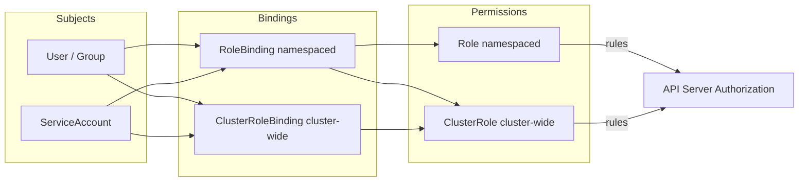
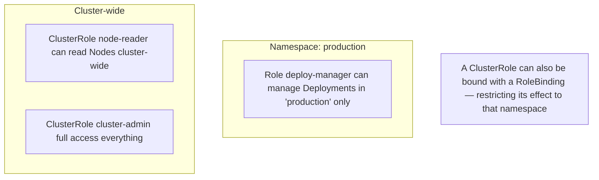
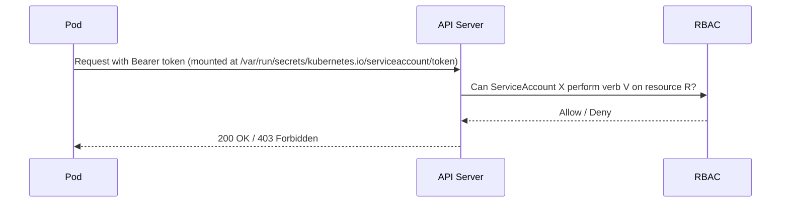
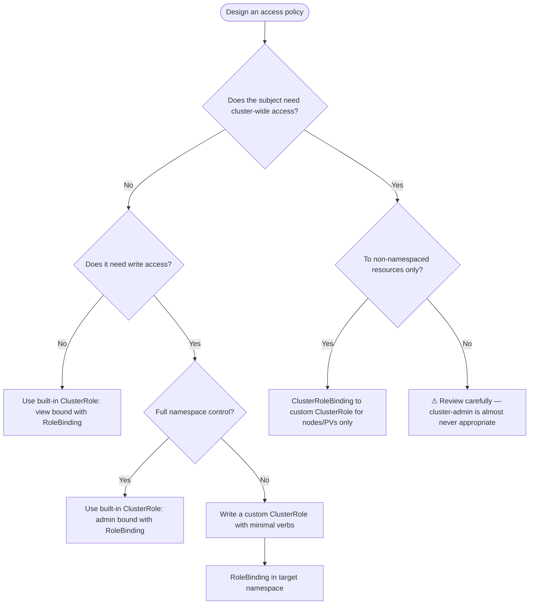

# Role-Based Access Control (RBAC)
> Module 09 · Lesson 01 | [↑ Course Index](../README.md)


[](../README.md)
[](../LICENSE.md)

## Table of Contents
- [Overview](#overview)
- [What is RBAC?](#what-is-rbac)
- [RBAC Components](#rbac-components)
- [Roles vs ClusterRoles](#roles-vs-clusterroles)
- [RoleBindings vs ClusterRoleBindings](#rolebindings-vs-clusterrolebindings)
- [ServiceAccounts](#serviceaccounts)
- [Practical Examples](#practical-examples)
  - [Read-Only User](#read-only-user)
  - [CI/CD Deployer](#cicd-deployer)
  - [Namespace Admin](#namespace-admin)
- [kubectl auth can-i](#kubectl-auth-can-i)
- [Auditing Permissions](#auditing-permissions)
- [Least-Privilege Patterns](#least-privilege-patterns)
- [Lab](#lab)

---

## Overview

RBAC is the primary access-control mechanism in Kubernetes. Every action taken against the API server — `kubectl get pods`, a controller reconciling a Deployment, a CI job pushing an image tag — is gated by RBAC rules. Getting RBAC right is the single highest-leverage security investment you can make in a k3s cluster.

[↑ Back to TOC](#table-of-contents) · [↑ Course Index](../README.md)

---

## What is RBAC?

Role-Based Access Control answers one question: **can subject S perform verb V on resource R (in namespace N)?**

RBAC was promoted to stable in Kubernetes 1.8 and is enabled by default in k3s. It replaces older attribute-based (ABAC) and webhook-only approaches.



Key properties:
- **Additive only** — there is no `deny` concept. If no rule allows an action, it is denied.
- **Namespace-scoped or cluster-scoped** — Roles live in a namespace; ClusterRoles are cluster-wide.
- **Subjects** are Users, Groups, or ServiceAccounts.

[↑ Back to TOC](#table-of-contents) · [↑ Course Index](../README.md)

---

## RBAC Components

| Object | Scope | Purpose |
|---|---|---|
| `Role` | Namespace | Defines allowed verbs on resources within one namespace |
| `ClusterRole` | Cluster | Defines allowed verbs on resources cluster-wide (or non-namespaced resources) |
| `RoleBinding` | Namespace | Binds a Role **or** ClusterRole to subjects, scoped to one namespace |
| `ClusterRoleBinding` | Cluster | Binds a ClusterRole to subjects cluster-wide |
| `ServiceAccount` | Namespace | Pod identity — automatically gets a token mounted in the pod |

### Rule anatomy

Every Role/ClusterRole contains one or more rules:

```yaml
rules:
  - apiGroups: ["apps"]          # "" = core, "apps", "batch", etc.
    resources: ["deployments"]   # plural resource name
    verbs: ["get", "list", "watch", "create", "update", "patch", "delete"]
```

Common verbs:

| Verb | HTTP equivalent | Description |
|---|---|---|
| `get` | GET (single) | Retrieve a specific resource |
| `list` | GET (collection) | List resources |
| `watch` | GET + watch | Stream change events |
| `create` | POST | Create a resource |
| `update` | PUT | Replace a resource |
| `patch` | PATCH | Partial update |
| `delete` | DELETE | Delete a resource |
| `deletecollection` | DELETE (collection) | Delete many at once |

[↑ Back to TOC](#table-of-contents) · [↑ Course Index](../README.md)

---

## Roles vs ClusterRoles



**Use a Role when:** the permission is meaningful only within a namespace (e.g., manage Deployments in `staging`).

**Use a ClusterRole when:**
- The resource is non-namespaced (`nodes`, `persistentvolumes`, `namespaces`, `storageclasses`)
- You want to reuse the same permission set across many namespaces via individual RoleBindings
- You need cluster-wide access (rare — use sparingly)

### Built-in ClusterRoles

k3s ships with several useful built-in ClusterRoles:

| ClusterRole | Description |
|---|---|
| `cluster-admin` | Full access to everything. Equivalent to root. |
| `admin` | Full access within a namespace (via RoleBinding) |
| `edit` | Read/write most resources; cannot modify RBAC |
| `view` | Read-only access to most resources |
| `system:node` | Used by kubelet — do not bind manually |

```bash
# List all built-in ClusterRoles
kubectl get clusterroles

# Describe what a built-in role allows
kubectl describe clusterrole edit
```

[↑ Back to TOC](#table-of-contents) · [↑ Course Index](../README.md)

---

## RoleBindings vs ClusterRoleBindings

```mermaid
flowchart TD
    subgraph "Option A — namespace-scoped"
        SA1[ServiceAccount ci-bot] -->|RoleBinding in 'production'| R1[Role deploy-manager in 'production']
        R1 --> EFF1[Effect: ci-bot can manage Deployments in production ONLY]
    end

    subgraph "Option B — cluster-scoped with ClusterRole"
        SA2[ServiceAccount ci-bot] -->|ClusterRoleBinding| CR1[ClusterRole deploy-manager]
        CR1 --> EFF2[Effect: ci-bot can manage Deployments in ALL namespaces]
    end

    subgraph "Option C — reuse ClusterRole namespace-scoped"
        SA3[ServiceAccount ci-bot] -->|RoleBinding in 'production'| CR2[ClusterRole deploy-manager]
        CR2 --> EFF3[Effect: ci-bot can manage Deployments in production ONLY but role definition is reusable]
    end
```



**Rules of thumb:**
- Prefer **Option C** — define permissions once as a ClusterRole, bind them per-namespace via RoleBindings. This avoids duplicating Role definitions.
- Use **ClusterRoleBinding** only for subjects that genuinely need cluster-wide access (monitoring agents, cluster-level operators).
- Never bind `cluster-admin` to application service accounts.

[↑ Back to TOC](#table-of-contents) · [↑ Course Index](../README.md)

---

## ServiceAccounts

Every pod runs as a ServiceAccount. If you don't specify one, it uses the `default` ServiceAccount in its namespace. The `default` ServiceAccount has no RBAC permissions beyond the built-in view of its own namespace in some clusters — but in k3s it starts with zero extra permissions.



### Creating and using a ServiceAccount

```bash
# Create a ServiceAccount
kubectl create serviceaccount my-app -n my-namespace

# Reference it in a Pod/Deployment
# spec:
#   serviceAccountName: my-app
```

```yaml
apiVersion: v1
kind: ServiceAccount
metadata:
  name: my-app
  namespace: my-namespace
automountServiceAccountToken: false  # disable if the pod doesn't need API access
```

> **Best practice:** Set `automountServiceAccountToken: false` on any ServiceAccount whose pods do not need to call the Kubernetes API. This prevents the token from being available inside the pod even if it is compromised.

[↑ Back to TOC](#table-of-contents) · [↑ Course Index](../README.md)

---

## Practical Examples

### Read-Only User

A human user who can view all resources in the `staging` namespace but cannot modify anything.

```yaml
apiVersion: rbac.authorization.k8s.io/v1
kind: RoleBinding
metadata:
  name: staging-viewer
  namespace: staging
subjects:
  - kind: User
    name: alice          # matches the CN in the client certificate
    apiGroup: rbac.authorization.k8s.io
roleRef:
  kind: ClusterRole
  name: view             # built-in read-only ClusterRole
  apiGroup: rbac.authorization.k8s.io
```

> **User identity in k3s:** k3s uses client certificate authentication. The `CN` field of the certificate becomes the username; `O` fields become group memberships.

### CI/CD Deployer

A CI system that needs to deploy to the `production` namespace — it can manage Deployments, Services, and ConfigMaps, but nothing else.

```yaml
apiVersion: rbac.authorization.k8s.io/v1
kind: ClusterRole
metadata:
  name: deployer
rules:
  - apiGroups: ["apps"]
    resources: ["deployments"]
    verbs: ["get", "list", "watch", "create", "update", "patch"]
  - apiGroups: [""]
    resources: ["services", "configmaps"]
    verbs: ["get", "list", "watch", "create", "update", "patch"]
---
apiVersion: rbac.authorization.k8s.io/v1
kind: RoleBinding
metadata:
  name: ci-deployer
  namespace: production
subjects:
  - kind: ServiceAccount
    name: ci-bot
    namespace: production
roleRef:
  kind: ClusterRole
  name: deployer
  apiGroup: rbac.authorization.k8s.io
```

### Namespace Admin

A team lead who has full control over the `team-alpha` namespace, but cannot touch other namespaces or cluster resources.

```yaml
apiVersion: rbac.authorization.k8s.io/v1
kind: RoleBinding
metadata:
  name: team-alpha-admin
  namespace: team-alpha
subjects:
  - kind: User
    name: bob
    apiGroup: rbac.authorization.k8s.io
roleRef:
  kind: ClusterRole
  name: admin            # built-in full-namespace ClusterRole
  apiGroup: rbac.authorization.k8s.io
```

[↑ Back to TOC](#table-of-contents) · [↑ Course Index](../README.md)

---

## kubectl auth can-i

`kubectl auth can-i` is your primary tool for verifying RBAC permissions — both your own and (as an admin) any other subject's.

```bash
# Can I list pods in the current namespace?
kubectl auth can-i list pods

# Can I create deployments in 'production'?
kubectl auth can-i create deployments -n production

# Can I delete nodes? (cluster-scoped)
kubectl auth can-i delete nodes

# Check as another user (requires admin)
kubectl auth can-i list pods --as alice -n staging

# Check as a ServiceAccount
kubectl auth can-i list secrets \
  --as system:serviceaccount:production:ci-bot \
  -n production

# List ALL actions the current user can perform in a namespace
kubectl auth can-i --list -n production

# List ALL actions a ServiceAccount can perform
kubectl auth can-i --list \
  --as system:serviceaccount:production:ci-bot \
  -n production
```

[↑ Back to TOC](#table-of-contents) · [↑ Course Index](../README.md)

---

## Auditing Permissions

Beyond `can-i`, several tools help you audit the full permission surface of your cluster.

### rakkess — access matrix

```bash
# Install
kubectl krew install access-matrix

# Show what YOU can do across all namespaces
kubectl access-matrix

# Show what a ServiceAccount can do
kubectl access-matrix \
  --as system:serviceaccount:production:ci-bot \
  -n production
```

### rbac-lookup

```bash
# Install
kubectl krew install rbac-lookup

# Find all bindings for a subject
kubectl rbac-lookup alice
kubectl rbac-lookup system:serviceaccount:production:ci-bot

# Find who has access to secrets
kubectl rbac-lookup -k secrets
```

### kubectl get rolebindings / clusterrolebindings

```bash
# Find all RoleBindings in a namespace
kubectl get rolebindings -n production -o wide

# Find all ClusterRoleBindings
kubectl get clusterrolebindings -o wide

# Find bindings that reference cluster-admin
kubectl get clusterrolebindings -o json | \
  jq '.items[] | select(.roleRef.name=="cluster-admin") | .metadata.name'
```

[↑ Back to TOC](#table-of-contents) · [↑ Course Index](../README.md)

---

## Least-Privilege Patterns



**Checklist for any new RBAC policy:**

- [ ] Does the subject really need `delete` and `deletecollection`? Usually not.
- [ ] Does it need access to `secrets`? Grant only if explicitly required.
- [ ] Is `*` (wildcard) used on resources or verbs? Replace with explicit lists.
- [ ] Is the binding cluster-wide when namespace-scoped would suffice?
- [ ] Has `automountServiceAccountToken: false` been set for pods that don't call the API?
- [ ] Are permissions verified with `kubectl auth can-i --list`?
- [ ] Is the ServiceAccount named descriptively (not `default`)?

### Wildcard anti-patterns to avoid

```yaml
# AVOID — gives access to every verb on every resource
rules:
  - apiGroups: ["*"]
    resources: ["*"]
    verbs: ["*"]

# AVOID — secrets contain credentials; be explicit
rules:
  - apiGroups: [""]
    resources: ["*"]    # this includes secrets
    verbs: ["get", "list"]
```

[↑ Back to TOC](#table-of-contents) · [↑ Course Index](../README.md)

---

## Lab

Apply the RBAC demo manifests and verify permissions:

```bash
# Apply all RBAC resources
kubectl apply -f labs/rbac-role.yaml

# Verify the CI deployer can manage deployments
kubectl auth can-i create deployments \
  --as system:serviceaccount:rbac-demo:ci-deployer \
  -n rbac-demo

# Verify the CI deployer CANNOT access secrets
kubectl auth can-i get secrets \
  --as system:serviceaccount:rbac-demo:ci-deployer \
  -n rbac-demo

# Verify the developers group can read resources
kubectl auth can-i list pods \
  --as-group developers \
  --as alice \
  -n rbac-demo

# Verify the cluster-reader can list nodes
kubectl auth can-i list nodes \
  --as cluster-reader-user

# List all permissions for the ci-deployer
kubectl auth can-i --list \
  --as system:serviceaccount:rbac-demo:ci-deployer \
  -n rbac-demo

# Clean up
kubectl delete namespace rbac-demo
kubectl delete clusterrole cluster-reader
kubectl delete clusterrolebinding cluster-reader-binding
```

See [`labs/rbac-role.yaml`](labs/rbac-role.yaml) for the full manifest.

[↑ Back to TOC](#table-of-contents) · [↑ Course Index](../README.md)

---

*Licensed under [CC BY-NC-SA 4.0](../LICENSE.md) · © 2026 UncleJS*
