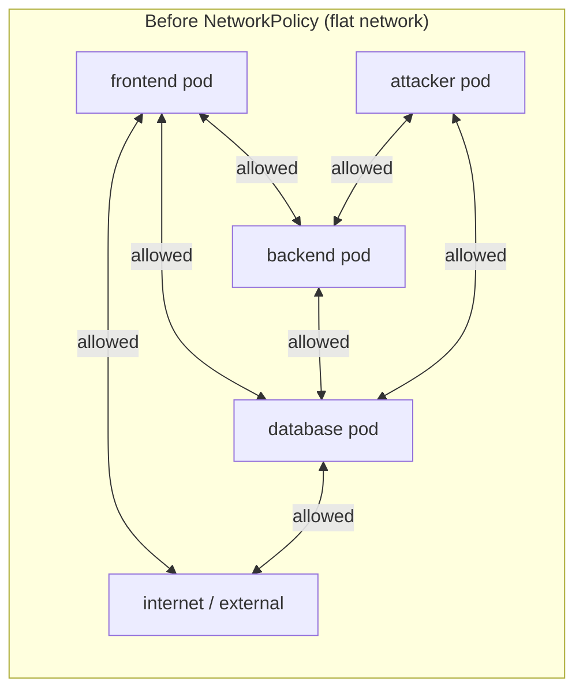
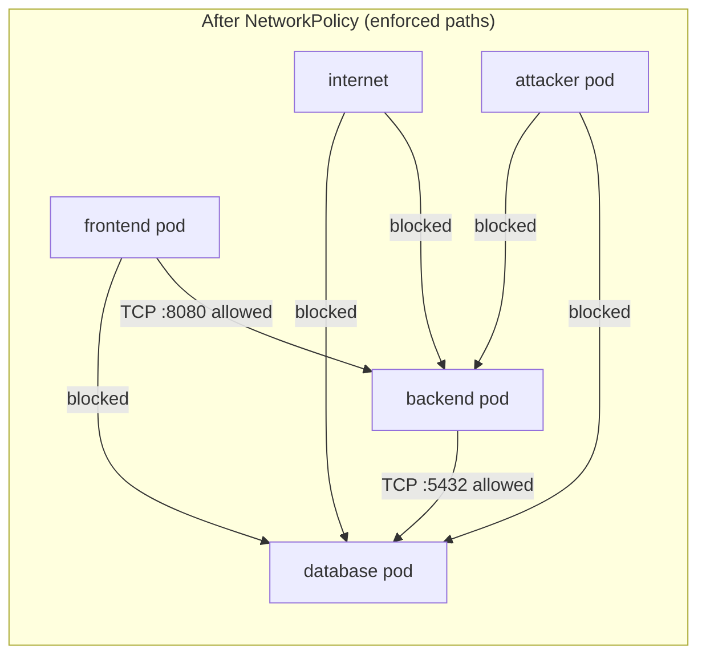
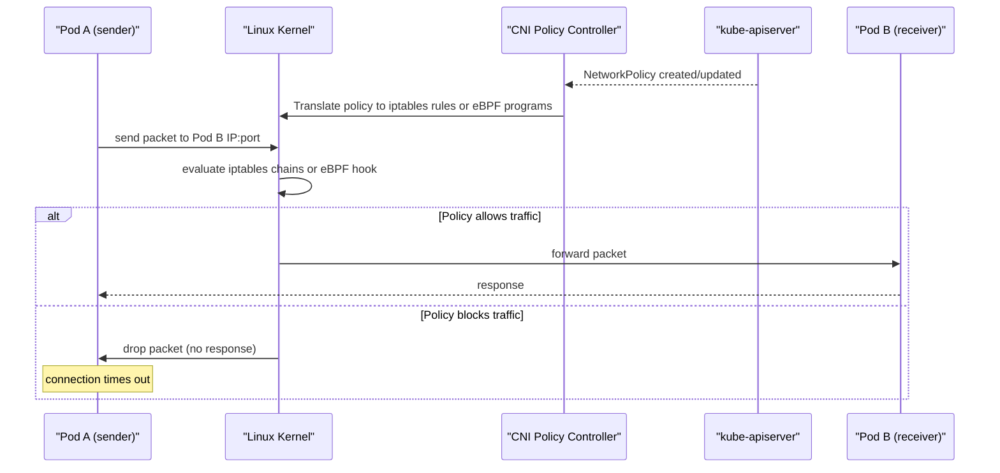
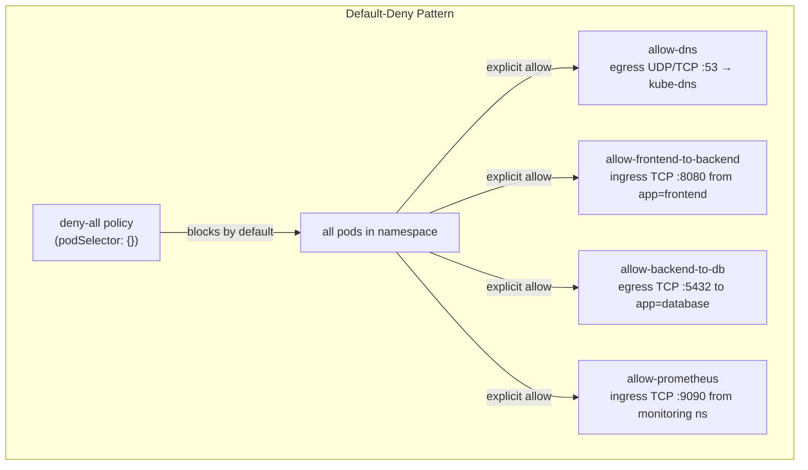
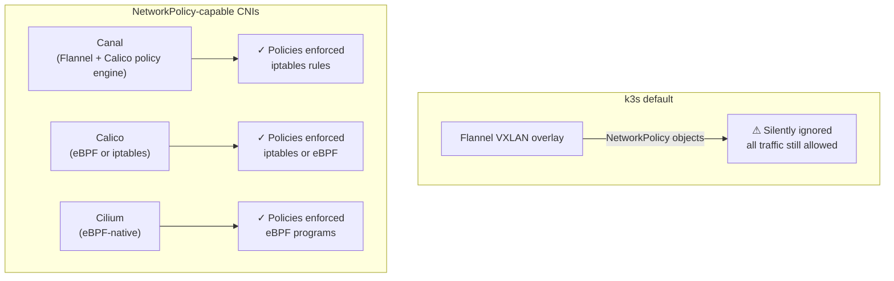
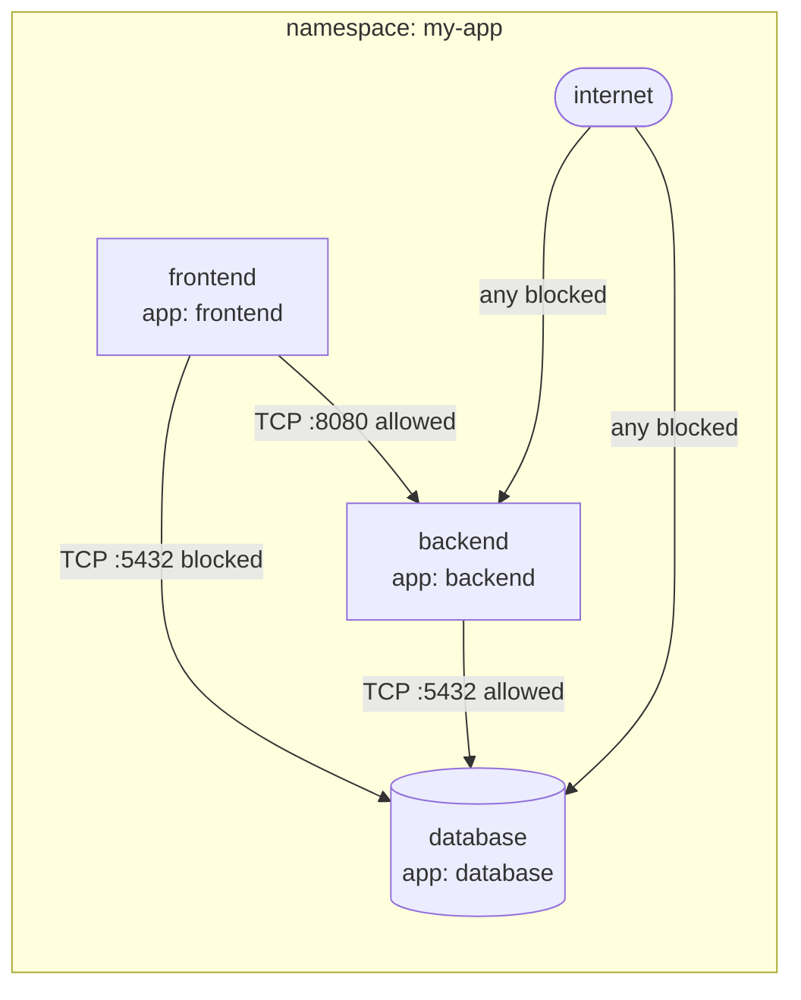
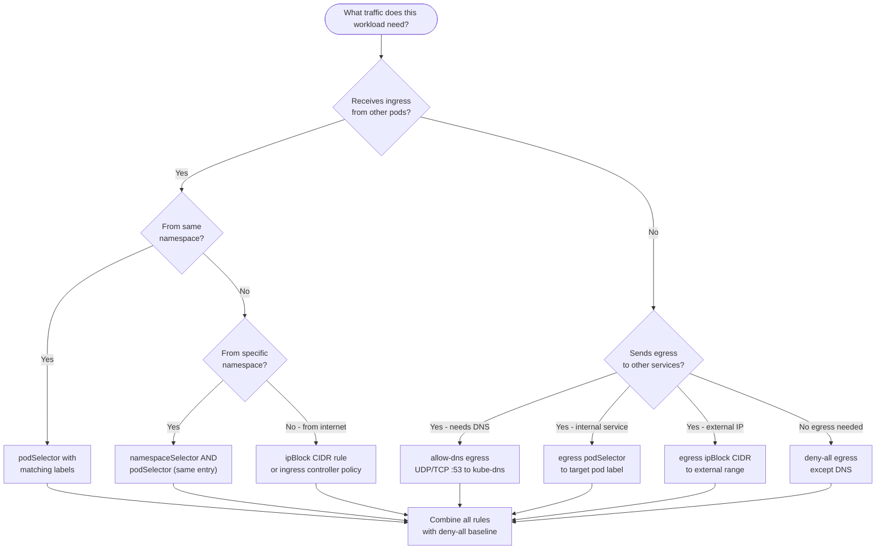

# Network Policies
> Module 09 · Lesson 02 | [↑ Course Index](../README.md)

[](../README.md)
[](../LICENSE.md)

## Table of Contents
- [Overview](#overview)
- [Default Allow-All Behaviour](#default-allow-all-behaviour)
- [How NetworkPolicy Works Under the Hood](#how-networkpolicy-works-under-the-hood)
- [Flannel Limitation](#flannel-limitation)
- [NetworkPolicy Spec Anatomy](#networkpolicy-spec-anatomy)
- [The Default-Deny Pattern](#the-default-deny-pattern)
- [Ingress Policies](#ingress-policies)
- [Egress Policies](#egress-policies)
- [Namespace Selector vs Pod Selector](#namespace-selector-vs-pod-selector)
- [CNI Compatibility — Flannel vs Canal/Calico](#cni-compatibility--flannel-vs-canalcalico)
- [Allow Specific Ingress](#allow-specific-ingress)
- [Allow Specific Egress](#allow-specific-egress)
- [Namespace Isolation](#namespace-isolation)
- [Pod Selector Rules](#pod-selector-rules)
- [Practical Patterns](#practical-patterns)
  - [Allow Frontend → Backend](#allow-frontend--backend)
  - [Block Egress to Internet](#block-egress-to-internet)
  - [Allow DNS](#allow-dns)
- [Testing NetworkPolicy](#testing-networkpolicy)
- [NetworkPolicy Limitations](#networkpolicy-limitations)
- [Writing a NetworkPolicy — Decision Tree](#writing-a-networkpolicy--decision-tree)
- [Lab](#lab)

---

## Overview

NetworkPolicies are the Kubernetes firewall abstraction. They let you express which pods can talk to which other pods (and external endpoints) using label selectors and CIDR blocks. Without NetworkPolicies, every pod in your cluster can reach every other pod — a significant lateral movement risk.

In production, a compromised container with unrestricted network access can pivot to databases, internal APIs, and metadata services. NetworkPolicies provide the network segmentation layer that limits blast radius when a container is compromised.

Key facts:
- NetworkPolicies are **namespace-scoped** resources
- They are **additive** — multiple policies selecting the same pod are OR'd together
- They only work if your **CNI plugin supports them** (Flannel alone does not)
- They operate at **Layer 3/4** (IP + port); for Layer 7 rules you need a service mesh

[↑ Back to TOC](#table-of-contents) · [↑ Course Index](../README.md)

---

## Default Allow-All Behaviour

By default, Kubernetes applies **no network restrictions**. All pods can:
- Accept connections from any source (unrestricted ingress)
- Connect to any destination (unrestricted egress)





This "flat network" model is convenient but dangerous in production:
- A compromised `frontend` pod can directly query the `database` pod
- Any pod can exfiltrate data to the internet
- A misconfigured service can be reached from anywhere
- A rogue pod can scan internal services undetected

NetworkPolicies change the default — but **only if your CNI supports them**.

[↑ Back to TOC](#table-of-contents) · [↑ Course Index](../README.md)

---

## How NetworkPolicy Works Under the Hood

Understanding enforcement mechanics helps you debug policy issues and choose the right CNI.

When you create a NetworkPolicy object in the Kubernetes API, the CNI plugin's policy controller watches for it and translates it into kernel-level enforcement rules. The exact mechanism depends on the CNI:



### Enforcement Mechanisms by CNI

| CNI | Enforcement Method | Performance |
|---|---|---|
| Flannel (alone) | None — no policy enforcement | N/A |
| Canal (Flannel + Calico) | iptables rules per-pod | Good |
| Calico | iptables or eBPF | Good to excellent |
| Cilium | eBPF programs (kernel bypass) | Excellent |
| Weave Net | iptables | Good |

**iptables mode:** The CNI controller inserts `ACCEPT`/`DROP` rules into custom iptables chains. Each pod gets its own chain. Rules are re-evaluated on every packet.

**eBPF mode (Cilium/Calico):** Programs are attached directly to network interfaces at the kernel level using BPF hooks. Faster than iptables for large rule sets and enables L7 awareness.

[↑ Back to TOC](#table-of-contents) · [↑ Course Index](../README.md)

---

## Flannel Limitation

> **This is the most important k3s-specific fact in this lesson: the default CNI is Flannel, and Flannel alone does NOT enforce NetworkPolicy.**

If you apply a NetworkPolicy to a k3s cluster running the default Flannel CNI, the policy object is created in the API server but **silently ignored** at the network level. All traffic still flows as if no policy exists.

### How to check if your CNI enforces policies

```bash
# Check which CNI is running
kubectl get pods -n kube-system -o wide | grep -E 'flannel|canal|calico|cilium|weave'

# Check the CNI config on a node
sudo cat /etc/cni/net.d/*.conflist | grep -i type

# Quick test: apply a deny-all policy and verify it is enforced
kubectl create namespace netpol-test
kubectl run server --image=nginx:alpine -n netpol-test
kubectl run client --image=busybox:1.36 -n netpol-test -- sleep 3600
kubectl wait --for=condition=ready pod/server -n netpol-test

# Before policy: should succeed
kubectl exec -n netpol-test client -- wget -q -O- --timeout=3 http://server 2>&1 | head -1

# Apply deny-all
kubectl apply -n netpol-test -f - <<EOF
apiVersion: networking.k8s.io/v1
kind: NetworkPolicy
metadata:
  name: deny-all
  namespace: netpol-test
spec:
  podSelector: {}
  policyTypes: [Ingress, Egress]
EOF

# After policy: should fail if CNI enforces policies
kubectl exec -n netpol-test client -- wget -q -O- --timeout=3 http://server 2>&1

# If the second request succeeds, your CNI does NOT enforce NetworkPolicy.
# Clean up
kubectl delete namespace netpol-test
```

### What to do if you need NetworkPolicy enforcement

Install Canal (Flannel networking + Calico policy engine) or replace Flannel entirely:

```bash
# Install k3s WITHOUT the default Flannel CNI
curl -sfL https://get.k3s.io | sh -s - \
  --flannel-backend=none \
  --disable-network-policy

# Install Canal
kubectl apply -f https://raw.githubusercontent.com/projectcalico/calico/v3.27.0/manifests/canal.yaml

# Verify Canal is running
kubectl get pods -n kube-system -l k8s-app=canal
```

[↑ Back to TOC](#table-of-contents) · [↑ Course Index](../README.md)

---

## NetworkPolicy Spec Anatomy

```yaml
apiVersion: networking.k8s.io/v1
kind: NetworkPolicy
metadata:
  name: example-policy
  namespace: my-app          # policies are namespaced
spec:
  podSelector:               # which pods this policy applies TO
    matchLabels:
      app: backend
  policyTypes:               # declare which directions this policy controls
    - Ingress
    - Egress
  ingress:                   # rules for incoming traffic
    - from:                  # list of allowed sources (OR'd together)
        - podSelector:
            matchLabels:
              app: frontend
      ports:
        - protocol: TCP
          port: 8080
  egress:                    # rules for outgoing traffic
    - to:                    # list of allowed destinations (OR'd together)
        - podSelector:
            matchLabels:
              app: database
      ports:
        - protocol: TCP
          port: 5432
```

### Key semantics

| Concept | Behaviour |
|---|---|
| Empty `podSelector: {}` | Matches **all** pods in the namespace |
| `policyTypes: [Ingress]` only | Policy controls ingress; egress is unrestricted |
| `policyTypes: [Egress]` only | Policy controls egress; ingress is unrestricted |
| Multiple `from` / `to` entries | OR logic — traffic is allowed if it matches **any** entry |
| Multiple `ports` entries | OR logic — traffic is allowed if it matches **any** port |
| `from` with both `podSelector` and `namespaceSelector` in same entry | AND logic — must match both |
| `from` with `podSelector` and `namespaceSelector` as separate entries | OR logic |

### AND vs OR for combined selectors

```yaml
# AND — pod must be in namespace AND have label (one list entry, two fields)
- from:
    - namespaceSelector:
        matchLabels:
          kubernetes.io/metadata.name: frontend-ns
      podSelector:
        matchLabels:
          app: frontend

# OR — pod is in the namespace OR has the label (two separate list entries)
- from:
    - namespaceSelector:
        matchLabels:
          kubernetes.io/metadata.name: frontend-ns
    - podSelector:
        matchLabels:
          app: frontend
```

[↑ Back to TOC](#table-of-contents) · [↑ Course Index](../README.md)

---

## The Default-Deny Pattern

The most secure starting point for any namespace is a **deny-all** policy that blocks all ingress and egress. Then you add explicit allow rules for every traffic path that your application actually needs.

This approach is called **allowlist** or **least-privilege** networking. It is the opposite of the default Kubernetes behaviour.



### Why start with deny-all?

1. **Unknown unknowns:** Without deny-all, any new pod is automatically reachable from everything. You may not realise a debug pod is exposing a database until it is exploited.
2. **Blast radius reduction:** If a pod is compromised, it cannot reach other services unless explicitly allowed.
3. **Auditability:** With deny-all, every traffic path is documented as a policy object. You can review what is allowed by listing NetworkPolicies.
4. **Compliance:** PCI-DSS, SOC 2, and HIPAA frameworks require network segmentation. Deny-all with explicit allows is the standard approach.

```yaml
# Step 1: Deny ALL ingress and egress for every pod in the namespace
apiVersion: networking.k8s.io/v1
kind: NetworkPolicy
metadata:
  name: deny-all
  namespace: my-app
spec:
  podSelector: {}       # matches all pods
  policyTypes:
    - Ingress
    - Egress
  # No ingress or egress rules = deny everything
```

After applying this policy:
- No pod can receive traffic from anywhere
- No pod can send traffic anywhere (including DNS — see [Allow DNS](#allow-dns) below)

> **Common mistake:** Forgetting to allow DNS after applying deny-all egress. Pods will fail to resolve service names. Always add the DNS allow rule immediately after the deny-all.

[↑ Back to TOC](#table-of-contents) · [↑ Course Index](../README.md)

---

## Ingress Policies

Four common ingress patterns you will use in almost every application:

### Pattern 1 — Allow from same namespace

```yaml
# Allow all pods in the same namespace to send traffic to this pod
apiVersion: networking.k8s.io/v1
kind: NetworkPolicy
metadata:
  name: allow-same-namespace
  namespace: my-app
spec:
  podSelector:
    matchLabels:
      app: backend
  policyTypes:
    - Ingress
  ingress:
    - from:
        - podSelector: {}   # empty = all pods in the SAME namespace only
      ports:
        - protocol: TCP
          port: 8080
```

Note: `podSelector: {}` (empty) matches all pods **in the same namespace as the NetworkPolicy**. It does not match pods from other namespaces.

### Pattern 2 — Allow from specific namespace

```yaml
# Allow ingress from the monitoring namespace (e.g., Prometheus scraping)
apiVersion: networking.k8s.io/v1
kind: NetworkPolicy
metadata:
  name: allow-from-monitoring
  namespace: my-app
spec:
  podSelector:
    matchLabels:
      app: backend
  policyTypes:
    - Ingress
  ingress:
    - from:
        - namespaceSelector:
            matchLabels:
              kubernetes.io/metadata.name: monitoring
          podSelector:
            matchLabels:
              app.kubernetes.io/name: prometheus
      ports:
        - protocol: TCP
          port: 9090
```

### Pattern 3 — Allow from ingress controller

```yaml
# Allow the Traefik ingress controller to reach application pods
apiVersion: networking.k8s.io/v1
kind: NetworkPolicy
metadata:
  name: allow-ingress-controller
  namespace: my-app
spec:
  podSelector:
    matchLabels:
      app: frontend
  policyTypes:
    - Ingress
  ingress:
    - from:
        - namespaceSelector:
            matchLabels:
              kubernetes.io/metadata.name: kube-system
          podSelector:
            matchLabels:
              app.kubernetes.io/name: traefik
      ports:
        - protocol: TCP
          port: 3000
```

### Pattern 4 — Allow from specific pod label (cross-namespace)

```yaml
# Allow any pod with app=api-client label in any namespace
# Use with caution — namespaceSelector: {} matches ALL namespaces
apiVersion: networking.k8s.io/v1
kind: NetworkPolicy
metadata:
  name: allow-api-clients
  namespace: my-app
spec:
  podSelector:
    matchLabels:
      app: backend
  policyTypes:
    - Ingress
  ingress:
    - from:
        - namespaceSelector: {}       # any namespace
          podSelector:
            matchLabels:
              role: api-client        # but only pods with this label
      ports:
        - protocol: TCP
          port: 8080
```

[↑ Back to TOC](#table-of-contents) · [↑ Course Index](../README.md)

---

## Egress Policies

Egress policies are equally important — they prevent compromised pods from exfiltrating data or reaching command-and-control servers.

### Pattern 1 — Allow DNS (critical — always add this first)

```yaml
# ALWAYS add this rule to any namespace with egress restrictions
# Without DNS, pods cannot resolve service names at all
apiVersion: networking.k8s.io/v1
kind: NetworkPolicy
metadata:
  name: allow-dns
  namespace: my-app
spec:
  podSelector: {}
  policyTypes:
    - Egress
  egress:
    - to:
        - namespaceSelector:
            matchLabels:
              kubernetes.io/metadata.name: kube-system
          podSelector:
            matchLabels:
              k8s-app: kube-dns
      ports:
        - protocol: UDP
          port: 53
        - protocol: TCP
          port: 53
```

### Pattern 2 — Allow egress to a specific service

```yaml
# Allow backend pods to reach only the database service
apiVersion: networking.k8s.io/v1
kind: NetworkPolicy
metadata:
  name: allow-backend-to-db
  namespace: my-app
spec:
  podSelector:
    matchLabels:
      app: backend
  policyTypes:
    - Egress
  egress:
    - to:
        - podSelector:
            matchLabels:
              app: database
      ports:
        - protocol: TCP
          port: 5432
```

### Pattern 3 — Allow egress to an external IP range

```yaml
# Allow backend to reach an on-premises API endpoint
apiVersion: networking.k8s.io/v1
kind: NetworkPolicy
metadata:
  name: allow-onprem-api
  namespace: my-app
spec:
  podSelector:
    matchLabels:
      app: backend
  policyTypes:
    - Egress
  egress:
    - to:
        - ipBlock:
            cidr: 10.20.0.0/24       # on-prem CIDR
            except:
              - 10.20.0.1/32         # exclude gateway IP if needed
      ports:
        - protocol: TCP
          port: 443
```

### Pattern 4 — Block all egress except DNS

```yaml
# Lock down a namespace so pods can only resolve names, nothing else
apiVersion: networking.k8s.io/v1
kind: NetworkPolicy
metadata:
  name: egress-dns-only
  namespace: my-app
spec:
  podSelector: {}
  policyTypes:
    - Egress
  egress:
    - to:
        - namespaceSelector:
            matchLabels:
              kubernetes.io/metadata.name: kube-system
          podSelector:
            matchLabels:
              k8s-app: kube-dns
      ports:
        - protocol: UDP
          port: 53
        - protocol: TCP
          port: 53
    # No other egress rules = everything else is blocked
```

[↑ Back to TOC](#table-of-contents) · [↑ Course Index](../README.md)

---

## Namespace Selector vs Pod Selector

One of the most common sources of NetworkPolicy bugs is using the wrong selector type or confusing AND vs OR logic.

### When to use `namespaceSelector`

Use `namespaceSelector` when you want to allow traffic from/to **all pods in a namespace**, or when you need to combine namespace identity with pod identity (AND logic).

```yaml
# Allow from the entire "staging" namespace
- from:
    - namespaceSelector:
        matchLabels:
          kubernetes.io/metadata.name: staging
```

### When to use `podSelector`

Use `podSelector` alone when the source pods are in the **same namespace** as the NetworkPolicy.

```yaml
# Allow from frontend pods in the SAME namespace
- from:
    - podSelector:
        matchLabels:
          app: frontend
```

### AND vs OR — the critical distinction

```yaml
# AND — must be a prometheus pod IN the monitoring namespace
- from:
    - namespaceSelector:
        matchLabels:
          kubernetes.io/metadata.name: monitoring
      podSelector:             # same list item = AND
        matchLabels:
          app: prometheus

# OR — any pod in monitoring namespace OR any pod with app=prometheus anywhere
- from:
    - namespaceSelector:       # separate list items = OR
        matchLabels:
          kubernetes.io/metadata.name: monitoring
    - podSelector:
        matchLabels:
          app: prometheus
```

The OR form is almost always a mistake when you intend AND. The AND form is the safe default.

### Common Mistakes

| Mistake | Symptom | Fix |
|---|---|---|
| `podSelector` alone for cross-namespace traffic | Traffic from other namespaces is unexpectedly allowed or blocked | Add `namespaceSelector` in the same list entry |
| Two separate list entries instead of one (OR instead of AND) | Too much traffic allowed | Combine into single list entry |
| Forgetting `kubernetes.io/metadata.name` label on namespace | Selector never matches | Label the namespace or use `matchExpressions` |
| Using `namespaceSelector: {}` unintentionally | Opens up traffic from all namespaces | Add namespace labels and be explicit |

[↑ Back to TOC](#table-of-contents) · [↑ Course Index](../README.md)

---

## CNI Compatibility — Flannel vs Canal/Calico

> **Critical k3s-specific note:** The default CNI for k3s is **Flannel**, which does **not** support NetworkPolicies. Any NetworkPolicy you apply will be silently ignored.



### Switching to Canal (recommended for most k3s deployments)

Canal combines Flannel's networking with Calico's policy engine — minimal change, full NetworkPolicy support.

```bash
# Install k3s WITHOUT the default Flannel CNI
curl -sfL https://get.k3s.io | sh -s - \
  --flannel-backend=none \
  --disable-network-policy

# Install Canal
kubectl apply -f https://raw.githubusercontent.com/projectcalico/calico/v3.27.0/manifests/canal.yaml

# Verify Canal is running
kubectl get pods -n kube-system -l k8s-app=canal
```

### Switching to Calico (for advanced policy or eBPF)

```bash
# Install k3s without Flannel
curl -sfL https://get.k3s.io | sh -s - \
  --flannel-backend=none \
  --disable-network-policy

# Install Calico operator
kubectl create -f https://raw.githubusercontent.com/projectcalico/calico/v3.27.0/manifests/tigera-operator.yaml

# Apply installation config
kubectl apply -f - <<EOF
apiVersion: operator.tigera.io/v1
kind: Installation
metadata:
  name: default
spec:
  cniPlugin: Calico
  calicoNetwork:
    ipPools:
      - cidr: 10.42.0.0/16   # match k3s default pod CIDR
        encapsulation: VXLAN
EOF
```

[↑ Back to TOC](#table-of-contents) · [↑ Course Index](../README.md)

---

## Allow Specific Ingress

Once deny-all is in place, add targeted allow rules:

```yaml
# Allow ingress to the backend from the frontend only, on port 8080
apiVersion: networking.k8s.io/v1
kind: NetworkPolicy
metadata:
  name: allow-frontend-to-backend
  namespace: my-app
spec:
  podSelector:
    matchLabels:
      app: backend
  policyTypes:
    - Ingress
  ingress:
    - from:
        - podSelector:
            matchLabels:
              app: frontend
      ports:
        - protocol: TCP
          port: 8080
```

```yaml
# Allow ingress from a monitoring namespace (e.g., Prometheus scraping)
apiVersion: networking.k8s.io/v1
kind: NetworkPolicy
metadata:
  name: allow-prometheus-scrape
  namespace: my-app
spec:
  podSelector:
    matchLabels:
      app: backend
  policyTypes:
    - Ingress
  ingress:
    - from:
        - namespaceSelector:
            matchLabels:
              kubernetes.io/metadata.name: monitoring
          podSelector:
            matchLabels:
              app.kubernetes.io/name: prometheus
      ports:
        - protocol: TCP
          port: 9090
```

[↑ Back to TOC](#table-of-contents) · [↑ Course Index](../README.md)

---

## Allow Specific Egress

```yaml
# Allow backend pods to reach the database only
apiVersion: networking.k8s.io/v1
kind: NetworkPolicy
metadata:
  name: allow-backend-to-db
  namespace: my-app
spec:
  podSelector:
    matchLabels:
      app: backend
  policyTypes:
    - Egress
  egress:
    - to:
        - podSelector:
            matchLabels:
              app: database
      ports:
        - protocol: TCP
          port: 5432
```

```yaml
# Allow egress to a specific external CIDR (e.g., an on-prem API)
apiVersion: networking.k8s.io/v1
kind: NetworkPolicy
metadata:
  name: allow-onprem-api
  namespace: my-app
spec:
  podSelector:
    matchLabels:
      app: backend
  policyTypes:
    - Egress
  egress:
    - to:
        - ipBlock:
            cidr: 10.20.0.0/24    # on-prem CIDR
      ports:
        - protocol: TCP
          port: 443
```

[↑ Back to TOC](#table-of-contents) · [↑ Course Index](../README.md)

---

## Namespace Isolation

Isolating namespaces from each other is a common multi-tenant requirement:

```yaml
# Allow pods to communicate within the same namespace only
apiVersion: networking.k8s.io/v1
kind: NetworkPolicy
metadata:
  name: namespace-isolation
  namespace: team-alpha
spec:
  podSelector: {}
  policyTypes:
    - Ingress
  ingress:
    - from:
        - podSelector: {}   # any pod in the SAME namespace
```

```yaml
# Allow ingress from another namespace (e.g., shared ingress controller)
apiVersion: networking.k8s.io/v1
kind: NetworkPolicy
metadata:
  name: allow-ingress-controller
  namespace: team-alpha
spec:
  podSelector: {}
  policyTypes:
    - Ingress
  ingress:
    - from:
        - namespaceSelector:
            matchLabels:
              kubernetes.io/metadata.name: kube-system
          podSelector:
            matchLabels:
              app.kubernetes.io/name: traefik
```

[↑ Back to TOC](#table-of-contents) · [↑ Course Index](../README.md)

---

## Pod Selector Rules

Pod selectors use the same `matchLabels` / `matchExpressions` syntax as Deployments:

```yaml
# Select pods by multiple labels (AND logic within matchLabels)
podSelector:
  matchLabels:
    app: backend
    tier: api

# Select pods using expressions
podSelector:
  matchExpressions:
    - key: app
      operator: In
      values: ["backend", "worker"]
    - key: environment
      operator: NotIn
      values: ["dev"]

# Select ALL pods (empty selector)
podSelector: {}
```

> **Important:** NetworkPolicies are AND'd together when multiple policies select the same pod. A pod is allowed to receive/send traffic if **any** matching policy allows it.

[↑ Back to TOC](#table-of-contents) · [↑ Course Index](../README.md)

---

## Practical Patterns

### Allow Frontend → Backend



This is a three-tier pattern with explicit paths:
- Frontend can reach backend on 8080
- Backend can reach database on 5432
- No pod can reach the internet (egress to external IPs blocked)
- No direct frontend → database traffic

### Block Egress to Internet

```yaml
# Deny all egress except to pods within the cluster
apiVersion: networking.k8s.io/v1
kind: NetworkPolicy
metadata:
  name: block-internet-egress
  namespace: my-app
spec:
  podSelector: {}
  policyTypes:
    - Egress
  egress:
    # Allow intra-cluster traffic (pod-to-pod)
    - to:
        - podSelector: {}
    # Allow DNS (required for name resolution)
    - to:
        - namespaceSelector:
            matchLabels:
              kubernetes.io/metadata.name: kube-system
      ports:
        - protocol: UDP
          port: 53
        - protocol: TCP
          port: 53
    # Block everything else (no rule = deny)
```

### Allow DNS

Every namespace with a deny-all policy needs a DNS egress rule, or pods cannot resolve service names:

```yaml
apiVersion: networking.k8s.io/v1
kind: NetworkPolicy
metadata:
  name: allow-dns
  namespace: my-app
spec:
  podSelector: {}
  policyTypes:
    - Egress
  egress:
    - to:
        - namespaceSelector:
            matchLabels:
              kubernetes.io/metadata.name: kube-system
          podSelector:
            matchLabels:
              k8s-app: kube-dns
      ports:
        - protocol: UDP
          port: 53
        - protocol: TCP
          port: 53
```

[↑ Back to TOC](#table-of-contents) · [↑ Course Index](../README.md)

---

## Testing NetworkPolicy

Applying a NetworkPolicy is not enough — you must verify it actually works. Use a debugging pod like `netshoot` (a container with network tools pre-installed).

### Deploy a test pod

```bash
# Deploy netshoot as a debug pod
kubectl run netshoot \
  --image=nicolaka/netshoot \
  --namespace=my-app \
  --rm -it \
  -- bash
```

### Testing ingress with curl

```bash
# From inside netshoot, test connectivity to the backend service
curl -v --max-time 5 http://backend-svc:8080/health

# Test that direct database access is blocked (should timeout)
curl -v --max-time 5 http://database-svc:5432

# Test DNS resolution is working
nslookup backend-svc.my-app.svc.cluster.local
```

### Testing with netcat

```bash
# Test if a port is open (nc exits immediately if connection succeeds)
nc -zv backend-svc 8080 && echo "OPEN" || echo "BLOCKED"
nc -zv database-svc 5432 && echo "OPEN" || echo "BLOCKED"
```

### Using tcpdump to observe drops

```bash
# On a node, watch for dropped packets in iptables
# (requires host network access or running as root on the node)
sudo iptables -L FORWARD -n --line-numbers | grep DROP

# Watch kernel drop counters
watch -n1 'sudo iptables -L FORWARD -nv | grep DROP'
```

### Systematic verification checklist

```bash
# 1. Verify the policy was accepted by the API server
kubectl get networkpolicy -n my-app

# 2. List all policies affecting a specific pod
kubectl get networkpolicy -n my-app -o yaml | grep -A5 podSelector

# 3. For Calico: use calicoctl to show computed policy
calicoctl get policy -n my-app

# 4. For Cilium: use cilium CLI
cilium policy get

# 5. Test actual connectivity from a controlled source pod
kubectl run test-client \
  --image=busybox:1.36 \
  --namespace=source-namespace \
  --rm -it \
  -- wget -qO- --timeout=3 http://target-service.target-namespace:8080
```

[↑ Back to TOC](#table-of-contents) · [↑ Course Index](../README.md)

---

## NetworkPolicy Limitations

NetworkPolicy is a powerful tool but it has real limits you need to know before designing your security architecture.

### What NetworkPolicy cannot do

| Limitation | Why | Alternative |
|---|---|---|
| Layer 7 filtering (HTTP methods, paths, headers) | NetworkPolicy is L3/L4 only | Istio, Linkerd, or Cilium L7 policies |
| mTLS between pods | NetworkPolicy does not encrypt traffic | Service mesh (Istio, Linkerd) |
| Policy for node-to-pod traffic | Nodes bypass pod-level NetworkPolicy | NodeRestriction admission + firewall |
| Egress to `hostNetwork` pods | `hostNetwork` pods use the node IP | Host-level firewall (iptables, nftables) |
| Logging allowed/denied connections | NetworkPolicy has no audit log | Cilium Hubble, Calico flow logs |
| Rate limiting or connection limits | L4 only, no stateful connection tracking | Service mesh sidecar or API gateway |
| TLS certificate validation | NetworkPolicy is transport-agnostic | cert-manager + service mesh |
| Policy between services in same pod | Containers in the same pod share a network namespace | Container isolation requires separate pods |

### The service mesh gap

For east-west traffic security beyond L4, a service mesh is the standard approach:

- **Istio** — full-featured service mesh with mTLS, L7 policies, traffic management
- **Linkerd** — lightweight, automatic mTLS, simpler than Istio
- **Cilium** — eBPF-based with L7 NetworkPolicy extensions (HTTP, gRPC, Kafka aware)

NetworkPolicy and a service mesh are **complementary**, not alternatives. NetworkPolicy handles L3/L4 segmentation; a service mesh adds L7 and mTLS.

[↑ Back to TOC](#table-of-contents) · [↑ Course Index](../README.md)

---

## Writing a NetworkPolicy — Decision Tree

Use this flowchart to decide which NetworkPolicy patterns you need for any given workload:



[↑ Back to TOC](#table-of-contents) · [↑ Course Index](../README.md)

---

## Lab

```bash
# Prerequisites: Canal or Calico CNI must be installed
# (NetworkPolicies are silently ignored with default Flannel)

# Apply all demo resources
kubectl apply -f labs/network-policy-deny-all.yaml

# Verify the nginx pod is running
kubectl get pods -n netpol-demo

# Test 1: client pod can reach nginx (should succeed before deny-all)
kubectl exec -n netpol-demo deploy/client -- \
  curl -s --max-time 3 http://nginx-svc

# Test 2: after applying deny-all, client cannot reach nginx
kubectl apply -f - <<EOF
apiVersion: networking.k8s.io/v1
kind: NetworkPolicy
metadata:
  name: deny-all-test
  namespace: netpol-demo
spec:
  podSelector: {}
  policyTypes: [Ingress, Egress]
EOF

kubectl exec -n netpol-demo deploy/client -- \
  curl -s --max-time 3 http://nginx-svc   # should timeout

# Test 3: verify DNS is also blocked (expected with egress deny-all)
kubectl exec -n netpol-demo deploy/client -- \
  nslookup nginx-svc   # should fail

# Test 4: apply allow-dns + allow-internal, client can reach nginx again
kubectl apply -f - <<EOF
apiVersion: networking.k8s.io/v1
kind: NetworkPolicy
metadata:
  name: allow-dns
  namespace: netpol-demo
spec:
  podSelector: {}
  policyTypes: [Egress]
  egress:
    - to:
        - namespaceSelector:
            matchLabels:
              kubernetes.io/metadata.name: kube-system
          podSelector:
            matchLabels:
              k8s-app: kube-dns
      ports:
        - protocol: UDP
          port: 53
        - protocol: TCP
          port: 53
---
apiVersion: networking.k8s.io/v1
kind: NetworkPolicy
metadata:
  name: allow-internal
  namespace: netpol-demo
spec:
  podSelector:
    matchLabels:
      app: nginx
  policyTypes: [Ingress]
  ingress:
    - from:
        - podSelector:
            matchLabels:
              app: client
      ports:
        - protocol: TCP
          port: 80
---
apiVersion: networking.k8s.io/v1
kind: NetworkPolicy
metadata:
  name: allow-client-egress
  namespace: netpol-demo
spec:
  podSelector:
    matchLabels:
      app: client
  policyTypes: [Egress]
  egress:
    - to:
        - podSelector:
            matchLabels:
              app: nginx
      ports:
        - protocol: TCP
          port: 80
EOF

kubectl exec -n netpol-demo deploy/client -- \
  curl -s --max-time 3 http://nginx-svc   # should succeed

# List all policies in effect
kubectl get networkpolicy -n netpol-demo

# Clean up
kubectl delete namespace netpol-demo
```

See [`labs/network-policy-deny-all.yaml`](labs/network-policy-deny-all.yaml) for the full manifest.

[↑ Back to TOC](#table-of-contents) · [↑ Course Index](../README.md)

---

*Licensed under [CC BY-NC-SA 4.0](../LICENSE.md) · © 2026 UncleJS*
