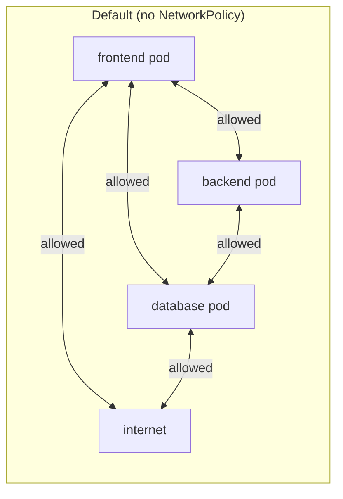
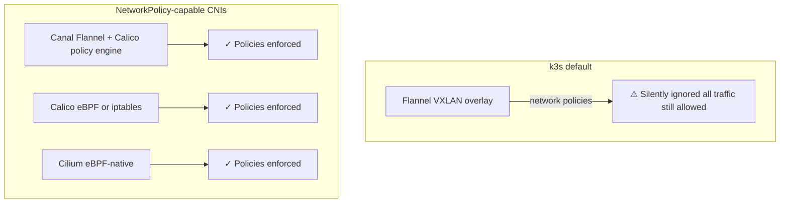
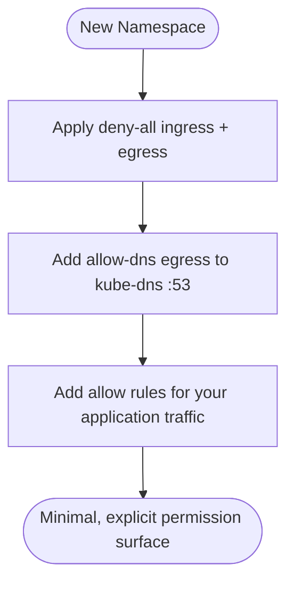
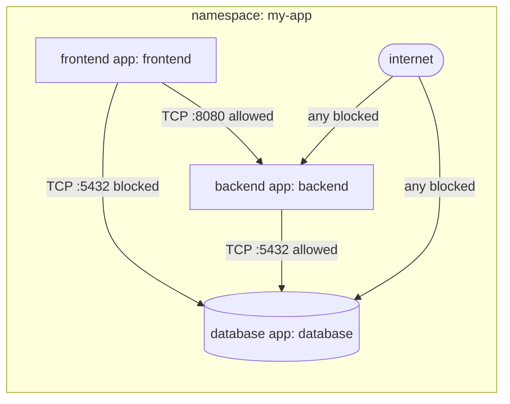

# Network Policies
> Module 09 · Lesson 02 | [↑ Course Index](../README.md)


[](../README.md)
[](../LICENSE.md)

## Table of Contents
- [Overview](#overview)
- [Default Allow-All Behaviour](#default-allow-all-behaviour)
- [NetworkPolicy Spec Anatomy](#networkpolicy-spec-anatomy)
- [CNI Compatibility — Flannel vs Canal/Calico](#cni-compatibility--flannel-vs-canalcalico)
- [Deny-All Baseline](#deny-all-baseline)
- [Allow Specific Ingress](#allow-specific-ingress)
- [Allow Specific Egress](#allow-specific-egress)
- [Namespace Isolation](#namespace-isolation)
- [Pod Selector Rules](#pod-selector-rules)
- [Practical Patterns](#practical-patterns)
  - [Allow Frontend → Backend](#allow-frontend--backend)
  - [Block Egress to Internet](#block-egress-to-internet)
  - [Allow DNS](#allow-dns)
- [Lab](#lab)

---

## Overview

NetworkPolicies are the Kubernetes firewall abstraction. They let you express which pods can talk to which other pods (and external endpoints) using label selectors and CIDR blocks. Without NetworkPolicies, every pod in your cluster can reach every other pod — a significant lateral movement risk.

[↑ Back to TOC](#table-of-contents) · [↑ Course Index](../README.md)

---

## Default Allow-All Behaviour

By default, Kubernetes applies **no network restrictions**. All pods can:
- Accept connections from any source (unrestricted ingress)
- Connect to any destination (unrestricted egress)



This "flat network" model is convenient but dangerous in production:
- A compromised `frontend` pod can directly query the `database` pod
- Any pod can exfiltrate data to the internet
- A misconfigured service can be reached from anywhere

NetworkPolicies change the default — but **only if your CNI supports them**.

[↑ Back to TOC](#table-of-contents) · [↑ Course Index](../README.md)

---

## NetworkPolicy Spec Anatomy

```yaml
apiVersion: networking.k8s.io/v1
kind: NetworkPolicy
metadata:
  name: example-policy
  namespace: my-app          # policies are namespaced
spec:
  podSelector:               # which pods this policy applies TO
    matchLabels:
      app: backend
  policyTypes:               # declare which directions this policy controls
    - Ingress
    - Egress
  ingress:                   # rules for incoming traffic
    - from:                  # list of allowed sources (OR'd together)
        - podSelector:
            matchLabels:
              app: frontend
      ports:
        - protocol: TCP
          port: 8080
  egress:                    # rules for outgoing traffic
    - to:                    # list of allowed destinations (OR'd together)
        - podSelector:
            matchLabels:
              app: database
      ports:
        - protocol: TCP
          port: 5432
```

### Key semantics

| Concept | Behaviour |
|---|---|
| Empty `podSelector: {}` | Matches **all** pods in the namespace |
| `policyTypes: [Ingress]` only | Policy controls ingress; egress is unrestricted |
| `policyTypes: [Egress]` only | Policy controls egress; ingress is unrestricted |
| Multiple `from` / `to` entries | OR logic — traffic is allowed if it matches **any** entry |
| Multiple `ports` entries | OR logic — traffic is allowed if it matches **any** port |
| `from` with both `podSelector` and `namespaceSelector` in same entry | AND logic — must match both |
| `from` with `podSelector` and `namespaceSelector` as separate entries | OR logic |

### AND vs OR for combined selectors

```yaml
# AND — pod must be in namespace AND have label (one list entry, two fields)
- from:
    - namespaceSelector:
        matchLabels:
          kubernetes.io/metadata.name: frontend-ns
      podSelector:
        matchLabels:
          app: frontend

# OR — pod is in the namespace OR has the label (two separate list entries)
- from:
    - namespaceSelector:
        matchLabels:
          kubernetes.io/metadata.name: frontend-ns
    - podSelector:
        matchLabels:
          app: frontend
```

[↑ Back to TOC](#table-of-contents) · [↑ Course Index](../README.md)

---

## CNI Compatibility — Flannel vs Canal/Calico

> **Critical k3s-specific note:** The default CNI for k3s is **Flannel**, which does **not** support NetworkPolicies. Any NetworkPolicy you apply will be silently ignored.



### Switching to Canal (recommended for most k3s deployments)

Canal combines Flannel's networking with Calico's policy engine — minimal change, full NetworkPolicy support.

```bash
# Install k3s WITHOUT the default Flannel CNI
curl -sfL https://get.k3s.io | sh -s - \
  --flannel-backend=none \
  --disable-network-policy

# Install Canal
kubectl apply -f https://raw.githubusercontent.com/projectcalico/calico/v3.27.0/manifests/canal.yaml

# Verify Canal is running
kubectl get pods -n kube-system -l k8s-app=canal
```

### Switching to Calico (for advanced policy or eBPF)

```bash
# Install k3s without Flannel
curl -sfL https://get.k3s.io | sh -s - \
  --flannel-backend=none \
  --disable-network-policy

# Install Calico operator
kubectl create -f https://raw.githubusercontent.com/projectcalico/calico/v3.27.0/manifests/tigera-operator.yaml

# Apply installation config
kubectl apply -f - <<EOF
apiVersion: operator.tigera.io/v1
kind: Installation
metadata:
  name: default
spec:
  cniPlugin: Calico
  calicoNetwork:
    ipPools:
      - cidr: 10.42.0.0/16   # match k3s default pod CIDR
        encapsulation: VXLAN
EOF
```

[↑ Back to TOC](#table-of-contents) · [↑ Course Index](../README.md)

---

## Deny-All Baseline

The recommended starting point for any namespace is a **deny-all** policy. Then explicitly add allow rules for legitimate traffic.



```yaml
# Deny ALL ingress and egress for every pod in the namespace
apiVersion: networking.k8s.io/v1
kind: NetworkPolicy
metadata:
  name: deny-all
  namespace: my-app
spec:
  podSelector: {}       # matches all pods
  policyTypes:
    - Ingress
    - Egress
  # No ingress or egress rules = deny everything
```

After applying this policy:
- No pod can receive traffic from anywhere
- No pod can send traffic anywhere (including DNS — see [Allow DNS](#allow-dns) below)

[↑ Back to TOC](#table-of-contents) · [↑ Course Index](../README.md)

---

## Allow Specific Ingress

Once deny-all is in place, add targeted allow rules:

```yaml
# Allow ingress to the backend from the frontend only, on port 8080
apiVersion: networking.k8s.io/v1
kind: NetworkPolicy
metadata:
  name: allow-frontend-to-backend
  namespace: my-app
spec:
  podSelector:
    matchLabels:
      app: backend
  policyTypes:
    - Ingress
  ingress:
    - from:
        - podSelector:
            matchLabels:
              app: frontend
      ports:
        - protocol: TCP
          port: 8080
```

```yaml
# Allow ingress from a monitoring namespace (e.g., Prometheus scraping)
apiVersion: networking.k8s.io/v1
kind: NetworkPolicy
metadata:
  name: allow-prometheus-scrape
  namespace: my-app
spec:
  podSelector:
    matchLabels:
      app: backend
  policyTypes:
    - Ingress
  ingress:
    - from:
        - namespaceSelector:
            matchLabels:
              kubernetes.io/metadata.name: monitoring
          podSelector:
            matchLabels:
              app.kubernetes.io/name: prometheus
      ports:
        - protocol: TCP
          port: 9090
```

[↑ Back to TOC](#table-of-contents) · [↑ Course Index](../README.md)

---

## Allow Specific Egress

```yaml
# Allow backend pods to reach the database only
apiVersion: networking.k8s.io/v1
kind: NetworkPolicy
metadata:
  name: allow-backend-to-db
  namespace: my-app
spec:
  podSelector:
    matchLabels:
      app: backend
  policyTypes:
    - Egress
  egress:
    - to:
        - podSelector:
            matchLabels:
              app: database
      ports:
        - protocol: TCP
          port: 5432
```

```yaml
# Allow egress to a specific external CIDR (e.g., an on-prem API)
apiVersion: networking.k8s.io/v1
kind: NetworkPolicy
metadata:
  name: allow-onprem-api
  namespace: my-app
spec:
  podSelector:
    matchLabels:
      app: backend
  policyTypes:
    - Egress
  egress:
    - to:
        - ipBlock:
            cidr: 10.20.0.0/24    # on-prem CIDR
      ports:
        - protocol: TCP
          port: 443
```

[↑ Back to TOC](#table-of-contents) · [↑ Course Index](../README.md)

---

## Namespace Isolation

Isolating namespaces from each other is a common multi-tenant requirement:

```yaml
# Allow pods to communicate within the same namespace only
apiVersion: networking.k8s.io/v1
kind: NetworkPolicy
metadata:
  name: namespace-isolation
  namespace: team-alpha
spec:
  podSelector: {}
  policyTypes:
    - Ingress
  ingress:
    - from:
        - podSelector: {}   # any pod in the SAME namespace
```

```yaml
# Allow ingress from another namespace (e.g., shared ingress controller)
apiVersion: networking.k8s.io/v1
kind: NetworkPolicy
metadata:
  name: allow-ingress-controller
  namespace: team-alpha
spec:
  podSelector: {}
  policyTypes:
    - Ingress
  ingress:
    - from:
        - namespaceSelector:
            matchLabels:
              kubernetes.io/metadata.name: kube-system
          podSelector:
            matchLabels:
              app.kubernetes.io/name: traefik
```

[↑ Back to TOC](#table-of-contents) · [↑ Course Index](../README.md)

---

## Pod Selector Rules

Pod selectors use the same `matchLabels` / `matchExpressions` syntax as Deployments:

```yaml
# Select pods by multiple labels (AND logic within matchLabels)
podSelector:
  matchLabels:
    app: backend
    tier: api

# Select pods using expressions
podSelector:
  matchExpressions:
    - key: app
      operator: In
      values: ["backend", "worker"]
    - key: environment
      operator: NotIn
      values: ["dev"]

# Select ALL pods (empty selector)
podSelector: {}
```

> **Important:** NetworkPolicies are AND'd together when multiple policies select the same pod. A pod is allowed to receive/send traffic if **any** matching policy allows it.

[↑ Back to TOC](#table-of-contents) · [↑ Course Index](../README.md)

---

## Practical Patterns

### Allow Frontend → Backend



This is a three-tier pattern with explicit paths:
- Frontend can reach backend on 8080
- Backend can reach database on 5432
- No pod can reach the internet (egress to external IPs blocked)
- No direct frontend → database traffic

### Block Egress to Internet

```yaml
# Deny all egress except to pods within the cluster
apiVersion: networking.k8s.io/v1
kind: NetworkPolicy
metadata:
  name: block-internet-egress
  namespace: my-app
spec:
  podSelector: {}
  policyTypes:
    - Egress
  egress:
    # Allow intra-cluster traffic (pod-to-pod)
    - to:
        - podSelector: {}
    # Allow DNS (required for name resolution)
    - to:
        - namespaceSelector:
            matchLabels:
              kubernetes.io/metadata.name: kube-system
      ports:
        - protocol: UDP
          port: 53
        - protocol: TCP
          port: 53
    # Block everything else (no rule = deny)
```

### Allow DNS

Every namespace with a deny-all policy needs a DNS egress rule, or pods cannot resolve service names:

```yaml
apiVersion: networking.k8s.io/v1
kind: NetworkPolicy
metadata:
  name: allow-dns
  namespace: my-app
spec:
  podSelector: {}
  policyTypes:
    - Egress
  egress:
    - to:
        - namespaceSelector:
            matchLabels:
              kubernetes.io/metadata.name: kube-system
          podSelector:
            matchLabels:
              k8s-app: kube-dns
      ports:
        - protocol: UDP
          port: 53
        - protocol: TCP
          port: 53
```

[↑ Back to TOC](#table-of-contents) · [↑ Course Index](../README.md)

---

## Lab

```bash
# Prerequisites: Canal or Calico CNI must be installed
# (NetworkPolicies are silently ignored with default Flannel)

# Apply all demo resources
kubectl apply -f labs/network-policy-deny-all.yaml

# Verify the nginx pod is running
kubectl get pods -n netpol-demo

# Test 1: client pod can reach nginx (should succeed)
kubectl exec -n netpol-demo deploy/client -- \
  curl -s --max-time 3 http://nginx-svc

# Test 2: after applying deny-all, client cannot reach nginx
# (apply the deny-all policy first if testing step by step)
kubectl apply -f - <<EOF
apiVersion: networking.k8s.io/v1
kind: NetworkPolicy
metadata:
  name: deny-all-test
  namespace: netpol-demo
spec:
  podSelector: {}
  policyTypes: [Ingress, Egress]
EOF

kubectl exec -n netpol-demo deploy/client -- \
  curl -s --max-time 3 http://nginx-svc   # should timeout

# Test 3: after applying allow-internal, client can reach nginx again
kubectl apply -f labs/network-policy-deny-all.yaml
kubectl exec -n netpol-demo deploy/client -- \
  curl -s --max-time 3 http://nginx-svc   # should succeed

# Clean up
kubectl delete namespace netpol-demo
```

See [`labs/network-policy-deny-all.yaml`](labs/network-policy-deny-all.yaml) for the full manifest.

[↑ Back to TOC](#table-of-contents) · [↑ Course Index](../README.md)

---

*Licensed under [CC BY-NC-SA 4.0](../LICENSE.md) · © 2026 UncleJS*
