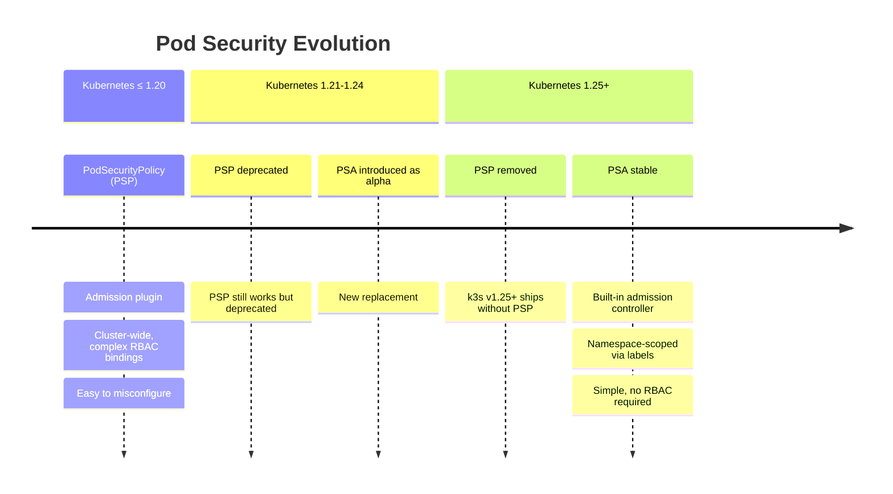
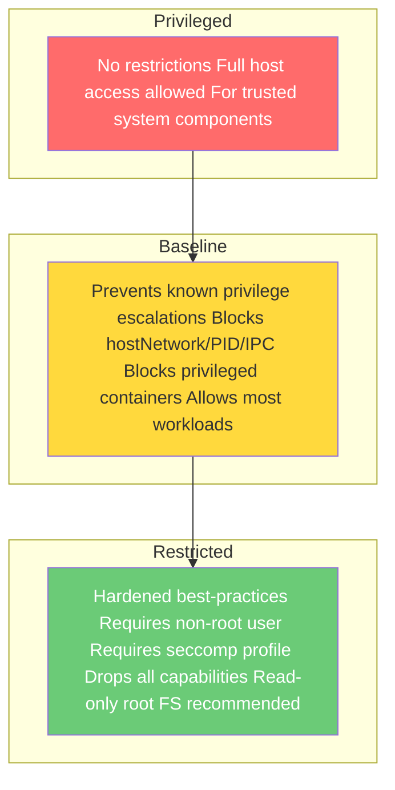
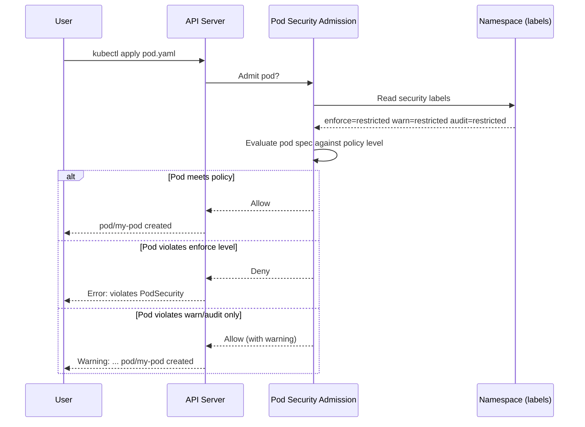
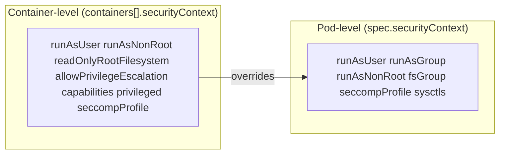

# Pod Security Standards
> Module 09 · Lesson 03 | [↑ Course Index](../README.md)


[](../README.md)
[](../LICENSE.md)

## Table of Contents
- [Overview](#overview)
- [From PSP to PSA](#from-psp-to-psa)
- [The Three Policy Levels](#the-three-policy-levels)
- [Pod Security Admission — How It Works](#pod-security-admission--how-it-works)
- [Namespace Labels](#namespace-labels)
- [SecurityContext Fields](#securitycontext-fields)
  - [runAsNonRoot](#runasnonroot)
  - [readOnlyRootFilesystem](#readonlyrootfilesystem)
  - [capabilities](#capabilities)
  - [seccompProfile](#seccompprofile)
  - [allowPrivilegeEscalation](#allowprivilegeescalation)
- [Common Patterns for Secure Pods](#common-patterns-for-secure-pods)
- [Exemptions](#exemptions)
- [Lab](#lab)

---

## Overview

Pod Security Standards (PSS) define three policy levels for pod workloads — Privileged, Baseline, and Restricted — and Pod Security Admission (PSA) enforces them at the namespace level without requiring a third-party webhook. PSA replaced the deprecated PodSecurityPolicy (PSP) in Kubernetes 1.25.

[↑ Back to TOC](#table-of-contents) · [↑ Course Index](../README.md)

---

## From PSP to PSA

PodSecurityPolicy (PSP) was deprecated in Kubernetes 1.21 and removed in 1.25. It was powerful but notoriously difficult to configure correctly — a common source of privilege escalation bugs due to misconfigured bindings.



k3s v1.25+ ships with PSA enabled. No additional components or controllers are required.

[↑ Back to TOC](#table-of-contents) · [↑ Course Index](../README.md)

---

## The Three Policy Levels



### Privileged

No restrictions. Everything is allowed. Intended only for:
- Trusted system-level components (CNI plugins, storage drivers)
- Workloads that explicitly require host namespaces or privileged containers
- The `kube-system` namespace (k3s internal components)

### Baseline

Prevents known privilege escalation vectors while allowing most containerised applications to run without modification. Blocks:
- Privileged containers (`securityContext.privileged: true`)
- `hostNetwork: true`, `hostPID: true`, `hostIPC: true`
- Dangerous capabilities (`NET_ADMIN`, `SYS_ADMIN`, etc.)
- Host path volume mounts (except specific safe paths)
- `hostPort` usage

Does **not** require:
- Running as non-root
- A seccomp profile
- Dropping all capabilities

### Restricted

Implements security best practices. Requires:
- `runAsNonRoot: true`
- `seccompProfile` set to `RuntimeDefault` or `Localhost`
- `allowPrivilegeEscalation: false`
- All capabilities dropped (no `add`)
- Volume types limited to a safe allowlist

Most application containers should target Restricted after initial development.

[↑ Back to TOC](#table-of-contents) · [↑ Course Index](../README.md)

---

## Pod Security Admission — How It Works

PSA operates as a built-in admission webhook that intercepts pod creation/modification requests:



### Three modes

| Mode | Effect |
|---|---|
| `enforce` | Reject pods that violate the policy |
| `warn` | Allow the pod but emit a user-facing warning |
| `audit` | Allow the pod but add an audit annotation (visible in audit logs) |

You can set each mode to a different level. A common progression:

```
audit=restricted → warn=restricted → enforce=restricted
```

[↑ Back to TOC](#table-of-contents) · [↑ Course Index](../README.md)

---

## Namespace Labels

PSA is configured per-namespace using well-known labels:

```yaml
apiVersion: v1
kind: Namespace
metadata:
  name: my-app
  labels:
    # Format: pod-security.kubernetes.io/<mode>: <level>
    pod-security.kubernetes.io/enforce: restricted
    pod-security.kubernetes.io/enforce-version: latest

    pod-security.kubernetes.io/warn: restricted
    pod-security.kubernetes.io/warn-version: latest

    pod-security.kubernetes.io/audit: restricted
    pod-security.kubernetes.io/audit-version: latest
```

The `-version` label pins evaluation to a specific Kubernetes version's policy definition (e.g., `v1.29`). Use `latest` to always apply the current definition.

### Apply labels to an existing namespace

```bash
# Set enforce to baseline on an existing namespace
kubectl label namespace my-app \
  pod-security.kubernetes.io/enforce=baseline \
  pod-security.kubernetes.io/warn=restricted

# Check what's already set
kubectl get namespace my-app -o yaml | grep pod-security

# Dry-run to see which existing pods would violate a policy before enforcing
kubectl label namespace my-app \
  pod-security.kubernetes.io/enforce=restricted \
  --dry-run=server
```

### Progression strategy

```bash
# Step 1 — audit only (no disruption)
kubectl label namespace my-app \
  pod-security.kubernetes.io/audit=restricted

# Step 2 — add warn (users see warnings on apply)
kubectl label namespace my-app \
  pod-security.kubernetes.io/warn=restricted

# Step 3 — enforce (rejects non-compliant pods)
kubectl label namespace my-app \
  pod-security.kubernetes.io/enforce=restricted
```

[↑ Back to TOC](#table-of-contents) · [↑ Course Index](../README.md)

---

## SecurityContext Fields

`securityContext` can be set at both the **pod level** (`spec.securityContext`) and the **container level** (`spec.containers[*].securityContext`). Container-level settings override pod-level.



### runAsNonRoot

```yaml
securityContext:
  runAsNonRoot: true      # pod level — applies to all containers
  runAsUser: 1000         # explicit UID (optional but recommended)
  runAsGroup: 3000        # explicit GID (optional)
  fsGroup: 2000           # volume files owned by this GID
```

- `runAsNonRoot: true` causes the runtime to reject containers whose image would run as UID 0.
- The image must have a non-root `USER` instruction, or `runAsUser` must be set to a non-zero value.
- `fsGroup` ensures mounted volumes are writable by the group — important for shared volumes between init containers and app containers.

### readOnlyRootFilesystem

```yaml
containers:
  - name: app
    securityContext:
      readOnlyRootFilesystem: true    # container-level only
    volumeMounts:
      - name: tmp
        mountPath: /tmp               # mount writable directories explicitly
      - name: cache
        mountPath: /var/cache/app
volumes:
  - name: tmp
    emptyDir: {}
  - name: cache
    emptyDir: {}
```

Prevents a compromised process from writing to the container filesystem. Any writes required (temp files, caches, pid files) must use explicit `emptyDir` or PVC mounts.

### capabilities

Linux capabilities divide root privileges into discrete units. Drop all, then add back only what is needed:

```yaml
securityContext:
  capabilities:
    drop:
      - ALL               # drop every capability
    add:
      - NET_BIND_SERVICE  # only re-add if needed (e.g., bind port < 1024)
```

Common capabilities and when they are needed:

| Capability | Required for |
|---|---|
| `NET_BIND_SERVICE` | Binding to ports < 1024 |
| `CHOWN` | Changing file ownership |
| `DAC_OVERRIDE` | Overriding file permission checks |
| `SETUID` / `SETGID` | Changing process user/group IDs |
| `SYS_PTRACE` | Debugging (never in production) |
| `SYS_ADMIN` | Almost everything dangerous — avoid |
| `NET_ADMIN` | Network configuration — CNI plugins only |

For the **Restricted** PSS level, `capabilities.drop: [ALL]` is required and no add is allowed.

### seccompProfile

Seccomp (secure computing mode) restricts the system calls a container can make:

```yaml
securityContext:
  seccompProfile:
    type: RuntimeDefault    # use the container runtime's default seccomp profile
    # type: Localhost       # use a custom profile from /var/lib/kubelet/seccomp/
    # type: Unconfined      # no seccomp (not allowed at Restricted level)
```

`RuntimeDefault` is the safe default — it blocks ~100 dangerous syscalls while allowing everything a normal containerised application needs. It is required at the **Restricted** level.

### allowPrivilegeEscalation

```yaml
securityContext:
  allowPrivilegeEscalation: false   # prevents setuid/setgid escalation
```

Setting this to `false` sets the `no_new_privs` flag on the container process. It prevents:
- `setuid` binaries gaining elevated privileges
- Privilege escalation via `sudo`, `su`, etc.

This is required at the **Restricted** level and is a best practice at **Baseline**.

[↑ Back to TOC](#table-of-contents) · [↑ Course Index](../README.md)

---

## Common Patterns for Secure Pods

### Minimal web application

```yaml
apiVersion: apps/v1
kind: Deployment
metadata:
  name: secure-webapp
  namespace: my-app
spec:
  replicas: 2
  selector:
    matchLabels:
      app: webapp
  template:
    metadata:
      labels:
        app: webapp
    spec:
      # Pod-level security context
      securityContext:
        runAsNonRoot: true
        runAsUser: 1000
        runAsGroup: 1000
        fsGroup: 1000
        seccompProfile:
          type: RuntimeDefault
      # Never automount token unless the app calls the k8s API
      automountServiceAccountToken: false
      containers:
        - name: webapp
          image: myapp:1.2.3
          ports:
            - containerPort: 8080
          # Container-level security context
          securityContext:
            allowPrivilegeEscalation: false
            readOnlyRootFilesystem: true
            capabilities:
              drop:
                - ALL
          volumeMounts:
            - name: tmp
              mountPath: /tmp
      volumes:
        - name: tmp
          emptyDir: {}
```

### Namespace hardening template

```yaml
apiVersion: v1
kind: Namespace
metadata:
  name: production
  labels:
    pod-security.kubernetes.io/enforce: restricted
    pod-security.kubernetes.io/enforce-version: latest
    pod-security.kubernetes.io/warn: restricted
    pod-security.kubernetes.io/warn-version: latest
    pod-security.kubernetes.io/audit: restricted
    pod-security.kubernetes.io/audit-version: latest
```

### Checking compliance

```bash
# Validate an existing deployment against restricted policy
kubectl get deployment secure-webapp -n my-app -o yaml | \
  kubectl-neat | \
  kubectl apply --dry-run=server -f -

# Check current PSS labels on all namespaces
kubectl get namespaces -o custom-columns=\
'NAME:.metadata.name,ENFORCE:.metadata.labels.pod-security\.kubernetes\.io/enforce,WARN:.metadata.labels.pod-security\.kubernetes\.io/warn'

# Use kubescape for a comprehensive PSS audit
kubescape scan framework nsa --include-namespaces my-app
```

[↑ Back to TOC](#table-of-contents) · [↑ Course Index](../README.md)

---

## Exemptions

Some workloads (monitoring agents, storage drivers, CNI pods) legitimately need privileged access. PSA supports cluster-level exemptions configured on the API server:

```yaml
# /etc/rancher/k3s/config.yaml (k3s config)
kube-apiserver-arg:
  - "admission-plugins=NodeRestriction,PodSecurity"
```

```yaml
# AdmissionConfiguration (passed via --admission-control-config-file)
apiVersion: apiserver.config.k8s.io/v1
kind: AdmissionConfiguration
plugins:
  - name: PodSecurity
    configuration:
      apiVersion: pod-security.admission.config.k8s.io/v1
      kind: PodSecurityConfiguration
      defaults:
        enforce: baseline
        enforce-version: latest
        warn: restricted
        warn-version: latest
        audit: restricted
        audit-version: latest
      exemptions:
        # Exempt specific usernames (e.g., node bootstrap)
        usernames: []
        # Exempt specific runtime class names
        runtimeClasses: []
        # Exempt entire namespaces from policy enforcement
        namespaces:
          - kube-system
          - kube-public
          - kube-node-lease
```

> **Note:** The `kube-system` namespace must always be exempted or k3s internal components (Traefik, CoreDNS, etc.) will fail admission. k3s handles this automatically.

[↑ Back to TOC](#table-of-contents) · [↑ Course Index](../README.md)

---

## Lab

```bash
# Create a namespace with restricted enforcement
kubectl apply -f - <<EOF
apiVersion: v1
kind: Namespace
metadata:
  name: pss-demo
  labels:
    pod-security.kubernetes.io/enforce: restricted
    pod-security.kubernetes.io/warn: restricted
    pod-security.kubernetes.io/audit: restricted
EOF

# Test 1: Deploy a NON-compliant pod (should be rejected)
kubectl run bad-pod \
  --image=nginx:alpine \
  --namespace=pss-demo
# Expected: Error - violates PodSecurity "restricted"

# Test 2: Deploy a compliant pod
kubectl apply -n pss-demo -f - <<EOF
apiVersion: v1
kind: Pod
metadata:
  name: good-pod
spec:
  securityContext:
    runAsNonRoot: true
    runAsUser: 1000
    seccompProfile:
      type: RuntimeDefault
  automountServiceAccountToken: false
  containers:
    - name: app
      image: busybox:1.36
      command: ["sleep", "3600"]
      securityContext:
        allowPrivilegeEscalation: false
        readOnlyRootFilesystem: true
        capabilities:
          drop: [ALL]
EOF

# Verify it's running
kubectl get pod good-pod -n pss-demo

# Inspect its security context
kubectl get pod good-pod -n pss-demo -o jsonpath='{.spec.securityContext}'

# Check audit events (if audit logging is enabled)
# grep 'pod-security' /var/log/kubernetes/audit.log

# Clean up
kubectl delete namespace pss-demo
```

[↑ Back to TOC](#table-of-contents) · [↑ Course Index](../README.md)

---

*Licensed under [CC BY-NC-SA 4.0](../LICENSE.md) · © 2026 UncleJS*
