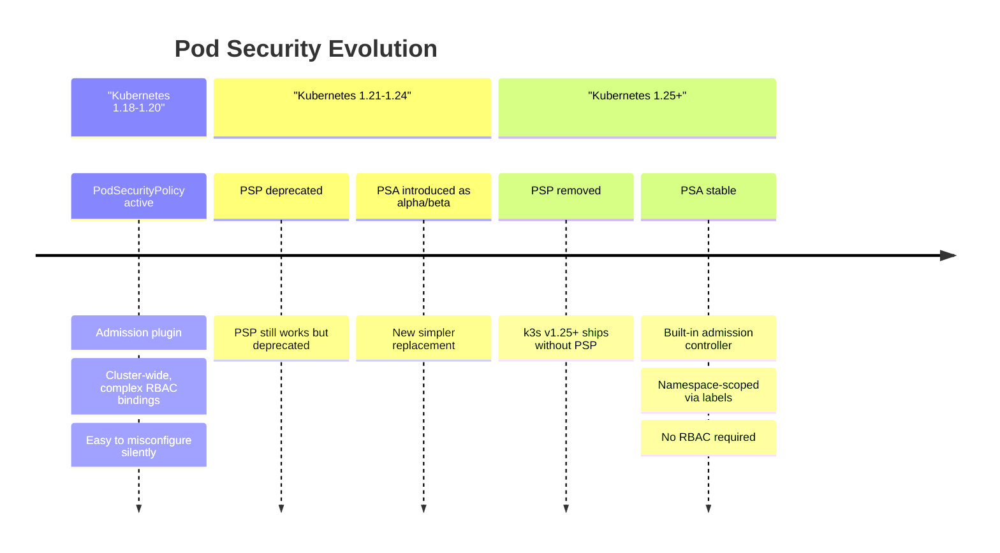
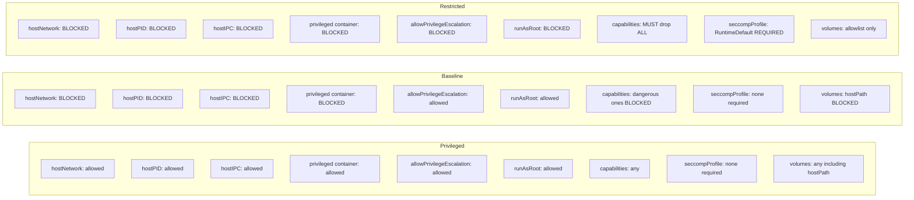
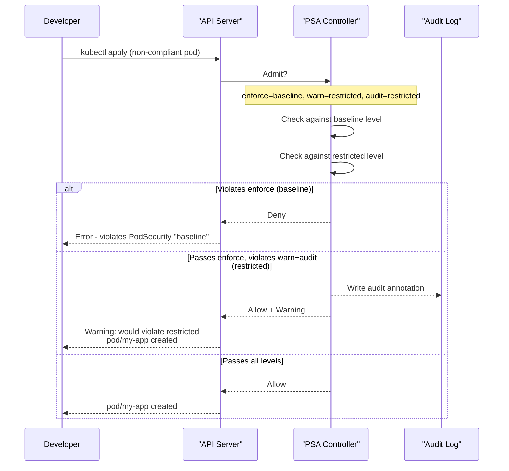
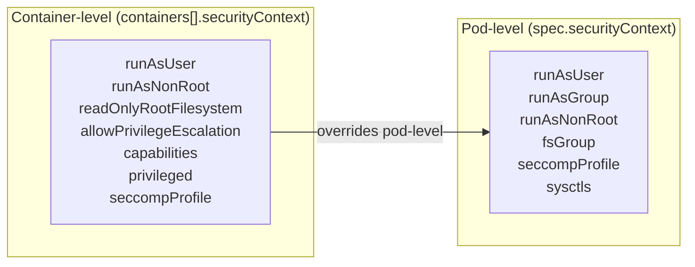

# Pod Security Standards
> Module 09 · Lesson 03 | [↑ Course Index](../README.md)

[](../README.md)
[](../LICENSE.md)

## Table of Contents
- [Overview](#overview)
- [PSS vs PSP — What Changed and Why](#pss-vs-psp--what-changed-and-why)
- [The Three PSS Levels in Detail](#the-three-pss-levels-in-detail)
- [PSS Levels Comparison](#pss-levels-comparison)
- [Pod Security Admission — How It Works](#pod-security-admission--how-it-works)
- [Namespace Labels](#namespace-labels)
- [SecurityContext Fields](#securitycontext-fields)
  - [runAsNonRoot](#runasnonroot)
  - [readOnlyRootFilesystem](#readonlyrootfilesystem)
  - [capabilities](#capabilities)
  - [seccompProfile](#seccompprofile)
  - [allowPrivilegeEscalation](#allowprivilegeescalation)
- [Common Violations and Fixes](#common-violations-and-fixes)
- [Exemptions](#exemptions)
- [Migrating from PSP to PSS](#migrating-from-psp-to-pss)
- [PSS with Kyverno/OPA](#pss-with-kyvernoopa)
- [Common Patterns for Secure Pods](#common-patterns-for-secure-pods)
- [Lab](#lab)

---

## Overview

Pod Security Standards (PSS) define three policy levels for pod workloads — Privileged, Baseline, and Restricted — and Pod Security Admission (PSA) enforces them at the namespace level without requiring a third-party webhook. PSA replaced the deprecated PodSecurityPolicy (PSP) in Kubernetes 1.25.

PSS answers a simple question: **"How much host access can a pod claim?"** The answer ranges from "anything" (Privileged) to "almost nothing" (Restricted). By labelling a namespace with the appropriate level, you establish a security floor for all pods running in it.

k3s v1.25+ ships with PSA enabled out of the box. No additional components, controllers, or webhook configurations are required.

[↑ Back to TOC](#table-of-contents) · [↑ Course Index](../README.md)

---

## PSS vs PSP — What Changed and Why

PodSecurityPolicy (PSP) was deprecated in Kubernetes 1.21 and **removed in 1.25**. k3s v1.25+ ships entirely without PSP support.

### Why PSP was removed

PSP was powerful but had serious usability and security problems:

1. **Complex RBAC bindings:** PSPs required explicit RBAC bindings to take effect. It was trivially easy to create a restrictive PSP, believe your cluster was hardened, and then discover that the binding was missing and the policy was never applied.
2. **Privilege escalation via misconfiguration:** A service account with `use` permission on a permissive PSP could create privileged pods even if that was not intended.
3. **No per-namespace defaults:** PSPs were cluster-scoped, making it hard to apply different policies to different namespaces without complex RBAC trees.
4. **Confusing evaluation order:** When a service account matched multiple PSPs, the least restrictive one often silently won.

### What PSA does differently

PSA is a built-in admission controller that:
- Is configured via **namespace labels** — no RBAC bindings needed
- Applies **three simple, well-defined levels** instead of arbitrary policy objects
- Supports **three independent modes** per namespace (enforce, warn, audit)
- Has no privilege escalation via misconfiguration — a label either matches a level or it doesn't
- Is always active — you cannot accidentally leave it unbound



[↑ Back to TOC](#table-of-contents) · [↑ Course Index](../README.md)

---

## The Three PSS Levels in Detail

### Privileged

**No restrictions.** Everything is allowed. Equivalent to running with no Pod Security policy at all.

Appropriate for:
- Trusted system-level components that require host-level access (CNI plugins, storage drivers, node exporters)
- The `kube-system` namespace — k3s internal components (Traefik, CoreDNS, Flannel) require privileged access
- Workloads that explicitly require host namespaces or privileged containers

A pod at the Privileged level can:
- Mount any host path
- Use `hostNetwork`, `hostPID`, `hostIPC`
- Run `privileged: true` containers
- Use any Linux capabilities
- Run as root

> **Never use Privileged for application workloads.** It is intended only for infrastructure components.

### Baseline

**Prevents known privilege escalation vectors** while allowing most containerised applications to run without modification. This is the practical "safe default" for most workloads.

Baseline **blocks:**
- `securityContext.privileged: true`
- `hostNetwork: true`, `hostPID: true`, `hostIPC: true`
- Dangerous capabilities: `NET_ADMIN`, `SYS_ADMIN`, `SYS_TIME`, `NET_RAW`, and others
- Host path volume mounts (any `hostPath` volume)
- `hostPort` usage
- Unsafe sysctls

Baseline **allows:**
- Running as root (UID 0)
- No seccomp profile
- `allowPrivilegeEscalation: true` (default)
- Most standard volume types (emptyDir, ConfigMap, PVC, projected, etc.)

Baseline is the right starting point when adopting PSS on existing workloads that have not been security-hardened.

### Restricted

**Implements Kubernetes security best practices.** This is the hardened target for all new application workloads.

Restricted **requires:**
- `runAsNonRoot: true`
- `seccompProfile.type: RuntimeDefault` or `Localhost`
- `allowPrivilegeEscalation: false`
- `capabilities.drop: [ALL]` — no capability additions allowed
- Volume types limited to an allowlist (ConfigMap, downwardAPI, emptyDir, projected, PVC, ephemeral)

Restricted **does not require** (but recommends):
- `readOnlyRootFilesystem: true`
- Specific UID/GID values

Most new microservices can comply with Restricted with minimal effort. The main barrier is older images that run as root by default.

[↑ Back to TOC](#table-of-contents) · [↑ Course Index](../README.md)

---

## PSS Levels Comparison



[↑ Back to TOC](#table-of-contents) · [↑ Course Index](../README.md)

---

## Pod Security Admission — How It Works

PSA operates as a built-in admission webhook that intercepts pod creation and modification requests. It reads the PSS labels on the target namespace and evaluates the incoming pod spec against the corresponding policy level.

```mermaid
flowchart TD
    REQ(["kubectl apply pod.yaml"]) --> API["API Server"]
    API --> PSA["Pod Security Admission Controller"]
    PSA --> NS["Read namespace labels<br/>pod-security.kubernetes.io/*"]

    NS --> Q1{"enforce label set?"}
    Q1 -->|"Yes"| CHECK_E["Evaluate pod spec<br/>against enforce level"]
    CHECK_E --> Q2{"Pod violates<br/>enforce policy?"}
    Q2 -->|"Yes"| REJECT["Reject request<br/>Error: violates PodSecurity"]
    Q2 -->|"No"| ALLOW["Allow pod creation"]

    Q1 -->|"No"| ALLOW

    NS --> Q3{"warn label set?"}
    Q3 -->|"Yes - pod violates warn"| WARN["Add Warning header<br/>to API response"]
    Q3 -->|"No or compliant"| SKIP_WARN["No warning"]

    NS --> Q4{"audit label set?"}
    Q4 -->|"Yes - pod violates audit"| AUDIT["Add annotation to<br/>audit log entry"]
    Q4 -->|"No or compliant"| SKIP_AUDIT["No audit annotation"]

    ALLOW --> DONE(["Pod created"])
    WARN --> DONE
    SKIP_WARN --> DONE
    SKIP_AUDIT --> DONE
```



### Three modes

| Mode | Effect | When to use |
|---|---|---|
| `enforce` | Reject pods that violate the policy | Production readiness gate |
| `warn` | Allow the pod but emit a user-facing warning in `kubectl` output | Pre-enforcement testing |
| `audit` | Allow the pod but add an audit annotation (visible in audit logs) | Discovery/reporting |

You can set each mode to a **different level**. A common migration progression:

```
audit=restricted           # Step 1: discover violations silently
→ warn=restricted          # Step 2: notify developers via warnings
→ enforce=baseline         # Step 3: block the most dangerous pods
→ enforce=restricted       # Step 4: full hardening
```



[↑ Back to TOC](#table-of-contents) · [↑ Course Index](../README.md)

---

## Namespace Labels

PSA is configured per-namespace using well-known labels:

```yaml
apiVersion: v1
kind: Namespace
metadata:
  name: my-app
  labels:
    # Format: pod-security.kubernetes.io/<mode>: <level>
    pod-security.kubernetes.io/enforce: restricted
    pod-security.kubernetes.io/enforce-version: latest

    pod-security.kubernetes.io/warn: restricted
    pod-security.kubernetes.io/warn-version: latest

    pod-security.kubernetes.io/audit: restricted
    pod-security.kubernetes.io/audit-version: latest
```

The `-version` label pins evaluation to a specific Kubernetes version's policy definition (e.g., `v1.29`). Use `latest` to always apply the current definition.

### Apply labels to an existing namespace

```bash
# Set enforce to baseline on an existing namespace
kubectl label namespace my-app \
  pod-security.kubernetes.io/enforce=baseline \
  pod-security.kubernetes.io/warn=restricted

# Check what's already set
kubectl get namespace my-app -o yaml | grep pod-security

# Dry-run to see which existing pods would violate a policy before enforcing
kubectl label namespace my-app \
  pod-security.kubernetes.io/enforce=restricted \
  --dry-run=server
```

### Why use different levels per mode

You can have each mode set to a different level on purpose. The most useful configurations are:

```yaml
# Conservative — warn about restricted violations, enforce only baseline
pod-security.kubernetes.io/enforce: baseline
pod-security.kubernetes.io/warn: restricted
pod-security.kubernetes.io/audit: restricted
```

This lets developers see that their pod would violate Restricted (via CLI warnings) without blocking their workflow, while still preventing the most dangerous configurations (Baseline violations).

```yaml
# Audit-only — no disruption, just collecting data
pod-security.kubernetes.io/audit: restricted
# No enforce or warn labels
```

Use this on existing namespaces during initial assessment to understand what would break before touching anything.

### Progression strategy

```bash
# Step 1 — audit only (no disruption)
kubectl label namespace my-app \
  pod-security.kubernetes.io/audit=restricted

# Step 2 — add warn (users see warnings on apply)
kubectl label namespace my-app \
  pod-security.kubernetes.io/warn=restricted

# Step 3 — enforce (rejects non-compliant pods)
kubectl label namespace my-app \
  pod-security.kubernetes.io/enforce=restricted
```

[↑ Back to TOC](#table-of-contents) · [↑ Course Index](../README.md)

---

## SecurityContext Fields

`securityContext` can be set at both the **pod level** (`spec.securityContext`) and the **container level** (`spec.containers[*].securityContext`). Container-level settings override pod-level.



### runAsNonRoot

```yaml
securityContext:
  runAsNonRoot: true      # pod level — applies to all containers
  runAsUser: 1000         # explicit UID (optional but recommended)
  runAsGroup: 3000        # explicit GID (optional)
  fsGroup: 2000           # volume files owned by this GID
```

- `runAsNonRoot: true` causes the runtime to reject containers whose image would run as UID 0.
- The image must have a non-root `USER` instruction, or `runAsUser` must be set to a non-zero value.
- `fsGroup` ensures mounted volumes are writable by the group — important for shared volumes between init containers and app containers.

### readOnlyRootFilesystem

```yaml
containers:
  - name: app
    securityContext:
      readOnlyRootFilesystem: true    # container-level only
    volumeMounts:
      - name: tmp
        mountPath: /tmp               # mount writable directories explicitly
      - name: cache
        mountPath: /var/cache/app
volumes:
  - name: tmp
    emptyDir: {}
  - name: cache
    emptyDir: {}
```

Prevents a compromised process from writing to the container filesystem. Any writes required (temp files, caches, pid files) must use explicit `emptyDir` or PVC mounts.

### capabilities

Linux capabilities divide root privileges into discrete units. Drop all, then add back only what is needed:

```yaml
securityContext:
  capabilities:
    drop:
      - ALL               # drop every capability
    add:
      - NET_BIND_SERVICE  # only re-add if needed (e.g., bind port < 1024)
```

Common capabilities and when they are needed:

| Capability | Required for |
|---|---|
| `NET_BIND_SERVICE` | Binding to ports < 1024 |
| `CHOWN` | Changing file ownership |
| `DAC_OVERRIDE` | Overriding file permission checks |
| `SETUID` / `SETGID` | Changing process user/group IDs |
| `SYS_PTRACE` | Debugging (never in production) |
| `SYS_ADMIN` | Almost everything dangerous — avoid |
| `NET_ADMIN` | Network configuration — CNI plugins only |

For the **Restricted** PSS level, `capabilities.drop: [ALL]` is required and no add is allowed.

### seccompProfile

Seccomp (secure computing mode) restricts the system calls a container can make:

```yaml
securityContext:
  seccompProfile:
    type: RuntimeDefault    # use the container runtime's default seccomp profile
    # type: Localhost       # use a custom profile from /var/lib/kubelet/seccomp/
    # type: Unconfined      # no seccomp (not allowed at Restricted level)
```

`RuntimeDefault` is the safe default — it blocks ~100 dangerous syscalls while allowing everything a normal containerised application needs. It is required at the **Restricted** level.

### allowPrivilegeEscalation

```yaml
securityContext:
  allowPrivilegeEscalation: false   # prevents setuid/setgid escalation
```

Setting this to `false` sets the `no_new_privs` flag on the container process. It prevents:
- `setuid` binaries gaining elevated privileges
- Privilege escalation via `sudo`, `su`, etc.

This is required at the **Restricted** level and is a best practice at **Baseline**.

[↑ Back to TOC](#table-of-contents) · [↑ Course Index](../README.md)

---

## Common Violations and Fixes

When PSA rejects or warns about a pod, the error message tells you exactly which field violated which policy. Here are the most common ones and how to fix them:

| Violation Message | Cause | Fix |
|---|---|---|
| `privileged` | `securityContext.privileged: true` | Remove `privileged: true` or move workload to a Privileged namespace |
| `hostNamespaces` | `hostNetwork`, `hostPID`, or `hostIPC: true` | Remove the host namespace fields |
| `hostPath` volumes | Volume of type `hostPath` | Replace with `emptyDir`, ConfigMap, PVC, or other allowed type |
| `allowPrivilegeEscalation != false` | Missing or `true` | Add `allowPrivilegeEscalation: false` to container securityContext |
| `unrestricted capabilities` | Missing `capabilities.drop: [ALL]` | Add drop ALL; only add back what's truly needed |
| `runAsNonRoot != true` | Image runs as root and no override | Set `runAsNonRoot: true` and `runAsUser: <non-zero>` |
| `seccompProfile` | Missing `seccompProfile` field | Add `seccompProfile: {type: RuntimeDefault}` |
| `restricted volume types` | Using a volume type not in the allowlist | Replace with ConfigMap, emptyDir, PVC, projected, or downwardAPI |
| `hostPort` | Container uses `hostPort` | Remove `hostPort`; use a Service with NodePort or LoadBalancer instead |

### Decoding the error

When a pod is rejected, PSA outputs a detailed error:

```
Error from server (Forbidden): pods "my-pod" is forbidden: violates PodSecurity "restricted:latest":
  allowPrivilegeEscalation != false (container "app" must set securityContext.allowPrivilegeEscalation=false)
  unrestricted capabilities (container "app" must set securityContext.capabilities.drop=["ALL"])
  runAsNonRoot != true (pod or container "app" must set securityContext.runAsNonRoot=true)
  seccompProfile (pod or containers "app" must set securityContext.seccompProfile.type to "RuntimeDefault" or "Localhost")
```

Each line is a separate violation you need to fix. Address all of them before the pod will be admitted.

[↑ Back to TOC](#table-of-contents) · [↑ Course Index](../README.md)

---

## Exemptions

Some workloads (monitoring agents, storage drivers, CNI pods) legitimately need privileged access. PSA supports cluster-level exemptions configured on the API server.

### Namespace exemptions (most common)

The `kube-system` namespace must be exempted, or k3s internal components (Traefik, CoreDNS, Flannel) will fail admission. k3s handles this automatically for `kube-system`, `kube-public`, and `kube-node-lease`.

```yaml
# /etc/rancher/k3s/config.yaml (k3s config)
kube-apiserver-arg:
  - "admission-plugins=NodeRestriction,PodSecurity"
```

```yaml
# AdmissionConfiguration (passed via --admission-control-config-file)
apiVersion: apiserver.config.k8s.io/v1
kind: AdmissionConfiguration
plugins:
  - name: PodSecurity
    configuration:
      apiVersion: pod-security.admission.config.k8s.io/v1
      kind: PodSecurityConfiguration
      defaults:
        enforce: baseline
        enforce-version: latest
        warn: restricted
        warn-version: latest
        audit: restricted
        audit-version: latest
      exemptions:
        # Exempt specific usernames (e.g., node bootstrap or CI service accounts)
        usernames: []
        # Exempt specific runtime class names (e.g., kata containers)
        runtimeClasses: []
        # Exempt entire namespaces from policy enforcement
        namespaces:
          - kube-system
          - kube-public
          - kube-node-lease
          - monitoring      # e.g., if Prometheus needs privileged node-exporter
```

### Per-namespace exemption via label

For a single namespace that needs elevated access, simply apply a more permissive label:

```bash
# Allow privileged workloads in the monitoring namespace
kubectl label namespace monitoring \
  pod-security.kubernetes.io/enforce=privileged \
  --overwrite

# Still warn about restricted violations
kubectl label namespace monitoring \
  pod-security.kubernetes.io/warn=restricted \
  --overwrite
```

> **Note:** The `kube-system` namespace must always be exempted or k3s internal components (Traefik, CoreDNS, etc.) will fail admission. k3s handles this automatically.

[↑ Back to TOC](#table-of-contents) · [↑ Course Index](../README.md)

---

## Migrating from PSP to PSS

If you are managing an older k3s cluster that was using PSP (k3s < 1.25) and you are upgrading, or if you are inheriting a cluster with PSP configuration, follow this migration approach.

### Step 1 — Audit your existing PSPs

```bash
# List all PSPs and their usage
kubectl get psp

# Find which service accounts use each PSP via RBAC
kubectl get clusterrolebindings,rolebindings -A \
  -o jsonpath='{range .items[*]}{.metadata.name}: {.roleRef.name}{"\n"}{end}' \
  | grep -i psp
```

### Step 2 — Map PSP settings to PSS levels

| PSP Setting | PSS Equivalent |
|---|---|
| `privileged: false` | Baseline blocks privileged containers |
| `allowPrivilegeEscalation: false` | Required by Restricted |
| `hostNetwork: false`, `hostPID: false` | Required by Baseline |
| `runAsUser: MustRunAsNonRoot` | Required by Restricted (`runAsNonRoot: true`) |
| `volumes: configmap, emptyDir, persistentVolumeClaim` | Restricted volume allowlist |
| `allowedCapabilities: []`, `defaultAddCapabilities: []` | Restricted drops ALL capabilities |

### Step 3 — Add PSA labels in audit/warn mode first

```bash
# For each namespace, start with audit only
for ns in $(kubectl get ns -o name | grep -v kube | grep -v default); do
  kubectl label ${ns} pod-security.kubernetes.io/audit=restricted 2>/dev/null
done
```

### Step 4 — Review audit logs for violations

```bash
# Grep audit log for PSA-generated annotations (if audit logging is enabled)
sudo grep 'pod-security' /var/log/kubernetes/audit.log | jq .
```

### Step 5 — Fix violations and promote to enforce

After fixing all workloads to comply with the target level, promote from `audit` to `warn` and then to `enforce`.

### Step 6 — Remove PSP resources

Once all namespaces are on PSA enforce and workloads are running correctly, remove PSP objects:

```bash
# After upgrading to k3s 1.25+, PSP objects are automatically removed
# On older clusters before upgrading:
kubectl delete psp --all
```

[↑ Back to TOC](#table-of-contents) · [↑ Course Index](../README.md)

---

## PSS with Kyverno/OPA

PSS is **intentionally simple**. It covers the most important security controls but does not address:

- Custom rules (e.g., "images must come from our registry")
- Label/annotation requirements
- Resource limits enforcement
- Container image tag pinning (`latest` ban)
- Network policy existence checks
- Service account token restrictions

For these use cases, you need a policy engine on top of PSS:

### Kyverno (recommended for k3s)

Kyverno is a Kubernetes-native policy engine that uses Kubernetes YAML — no Rego language to learn.

```bash
# Install Kyverno
kubectl create -f https://github.com/kyverno/kyverno/releases/latest/download/install.yaml

# Example: require all images to come from approved registries
kubectl apply -f - <<EOF
apiVersion: kyverno.io/v1
kind: ClusterPolicy
metadata:
  name: require-approved-registry
spec:
  validationFailureAction: Enforce
  rules:
    - name: check-registry
      match:
        any:
          - resources:
              kinds: [Pod]
      validate:
        message: "Images must come from registry.company.com"
        pattern:
          spec:
            containers:
              - image: "registry.company.com/*"
EOF
```

### OPA/Gatekeeper

OPA Gatekeeper uses Rego policies and is more powerful but requires learning the Rego policy language.

### The relationship between PSS and Kyverno/OPA

These are **layered controls**, not alternatives:

- **PSS** handles the universal security baseline (no privileged pods, no host namespaces)
- **Kyverno/OPA** adds organisation-specific policy on top

Always deploy both in a mature cluster.

[↑ Back to TOC](#table-of-contents) · [↑ Course Index](../README.md)

---

## Common Patterns for Secure Pods

### Minimal web application

```yaml
apiVersion: apps/v1
kind: Deployment
metadata:
  name: secure-webapp
  namespace: my-app
spec:
  replicas: 2
  selector:
    matchLabels:
      app: webapp
  template:
    metadata:
      labels:
        app: webapp
    spec:
      # Pod-level security context
      securityContext:
        runAsNonRoot: true
        runAsUser: 1000
        runAsGroup: 1000
        fsGroup: 1000
        seccompProfile:
          type: RuntimeDefault
      # Never automount token unless the app calls the k8s API
      automountServiceAccountToken: false
      containers:
        - name: webapp
          image: myapp:1.2.3
          ports:
            - containerPort: 8080
          # Container-level security context
          securityContext:
            allowPrivilegeEscalation: false
            readOnlyRootFilesystem: true
            capabilities:
              drop:
                - ALL
          volumeMounts:
            - name: tmp
              mountPath: /tmp
      volumes:
        - name: tmp
          emptyDir: {}
```

### Namespace hardening template

```yaml
apiVersion: v1
kind: Namespace
metadata:
  name: production
  labels:
    pod-security.kubernetes.io/enforce: restricted
    pod-security.kubernetes.io/enforce-version: latest
    pod-security.kubernetes.io/warn: restricted
    pod-security.kubernetes.io/warn-version: latest
    pod-security.kubernetes.io/audit: restricted
    pod-security.kubernetes.io/audit-version: latest
```

### Checking compliance

```bash
# Validate an existing deployment against restricted policy
kubectl get deployment secure-webapp -n my-app -o yaml | \
  kubectl apply --dry-run=server -f -

# Check current PSS labels on all namespaces
kubectl get namespaces -o custom-columns=\
'NAME:.metadata.name,ENFORCE:.metadata.labels.pod-security\.kubernetes\.io/enforce,WARN:.metadata.labels.pod-security\.kubernetes\.io/warn'

# Use kubescape for a comprehensive PSS audit
kubescape scan framework nsa --include-namespaces my-app
```

[↑ Back to TOC](#table-of-contents) · [↑ Course Index](../README.md)

---

## Lab

```bash
# Create a namespace with restricted enforcement
kubectl apply -f - <<EOF
apiVersion: v1
kind: Namespace
metadata:
  name: pss-demo
  labels:
    pod-security.kubernetes.io/enforce: restricted
    pod-security.kubernetes.io/warn: restricted
    pod-security.kubernetes.io/audit: restricted
EOF

# Test 1: Deploy a NON-compliant pod (should be rejected)
kubectl run bad-pod \
  --image=nginx:alpine \
  --namespace=pss-demo
# Expected: Error - violates PodSecurity "restricted"
# nginx:alpine runs as root and has no seccomp profile

# Test 2: See what warn mode shows before enforcing
kubectl label namespace pss-demo \
  pod-security.kubernetes.io/enforce=baseline \
  --overwrite
# Now enforce is baseline, warn is still restricted

kubectl run partial-bad \
  --image=nginx:alpine \
  --namespace=pss-demo
# Expected: Warning about restricted, but pod is created (baseline allows root)

# Test 3: Deploy a compliant pod
kubectl apply -n pss-demo -f - <<EOF
apiVersion: v1
kind: Pod
metadata:
  name: good-pod
spec:
  securityContext:
    runAsNonRoot: true
    runAsUser: 1000
    seccompProfile:
      type: RuntimeDefault
  automountServiceAccountToken: false
  containers:
    - name: app
      image: busybox:1.36
      command: ["sleep", "3600"]
      securityContext:
        allowPrivilegeEscalation: false
        readOnlyRootFilesystem: true
        capabilities:
          drop: [ALL]
EOF

# Restore full restricted enforcement
kubectl label namespace pss-demo \
  pod-security.kubernetes.io/enforce=restricted \
  --overwrite

# Verify it's running
kubectl get pod good-pod -n pss-demo

# Inspect its security context
kubectl get pod good-pod -n pss-demo -o jsonpath='{.spec.securityContext}'

# Test 4: confirm bad-pod is now blocked
kubectl run bad-pod-2 \
  --image=nginx:alpine \
  --namespace=pss-demo
# Expected: Forbidden error

# Check audit events (if audit logging is enabled)
# grep 'pod-security' /var/log/kubernetes/audit.log

# Clean up
kubectl delete namespace pss-demo
```

[↑ Back to TOC](#table-of-contents) · [↑ Course Index](../README.md)

---

*Licensed under [CC BY-NC-SA 4.0](../LICENSE.md) · © 2026 UncleJS*
