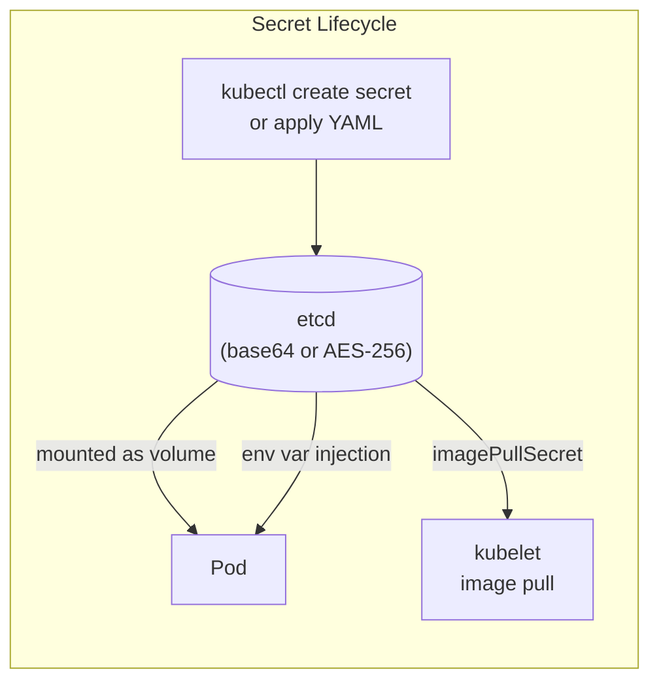
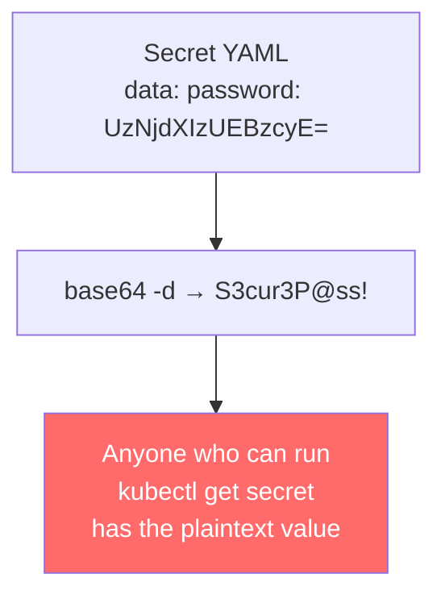
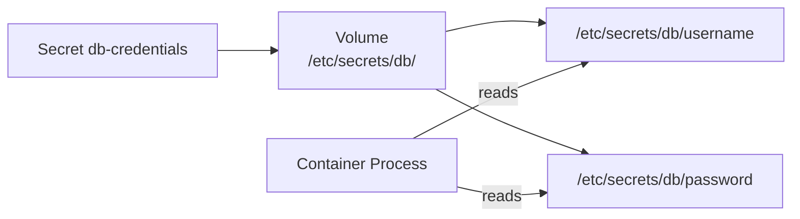
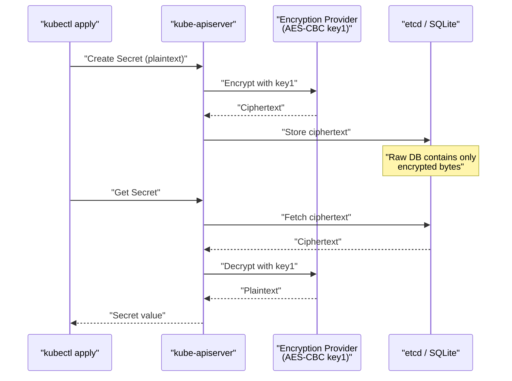
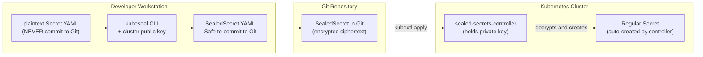
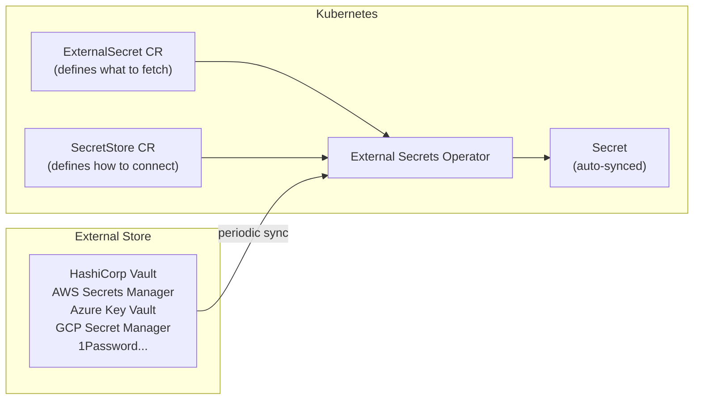
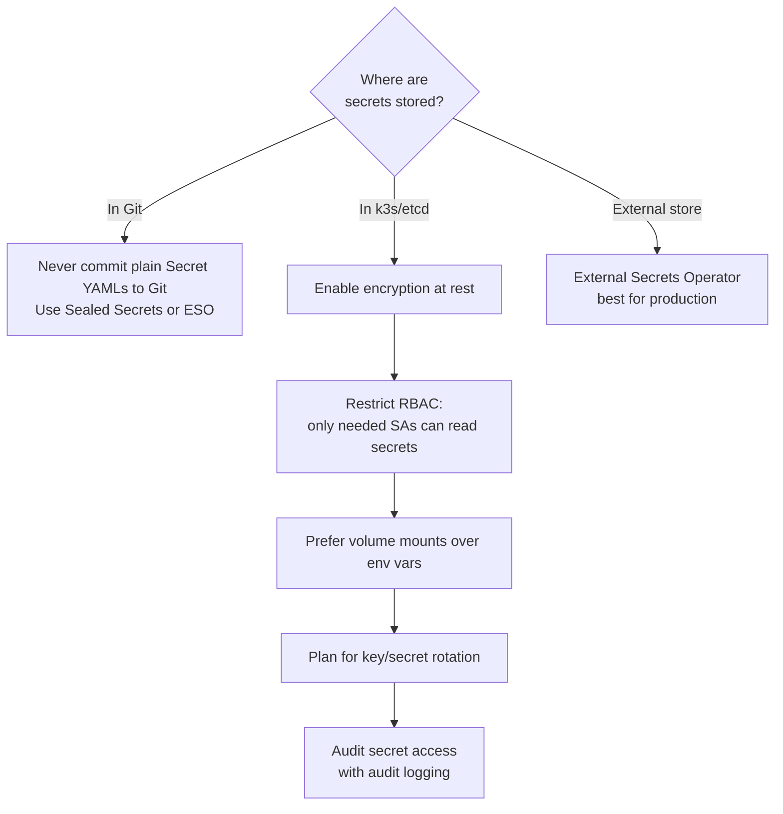

# Secrets Management
> Module 09 · Lesson 04 | [↑ Course Index](../README.md)


[](../README.md)
[](../LICENSE.md)

## Table of Contents
- [Overview](#overview)
- [Kubernetes Secrets Basics](#kubernetes-secrets-basics)
- [Base64 Encoding is Not Encryption](#base64-encoding-is-not-encryption)
- [Secret Types](#secret-types)
- [Consuming Secrets](#consuming-secrets)
  - [As Environment Variables](#as-environment-variables)
  - [As Volume Mounts](#as-volume-mounts)
- [Encrypting Secrets at Rest in k3s](#encrypting-secrets-at-rest-in-k3s)
- [Sealed Secrets — Bitnami](#sealed-secrets--bitnami)
- [External Secrets Operator](#external-secrets-operator)
- [Best Practices](#best-practices)
- [Lab](#lab)

---

## Overview

Secrets management is one of the most commonly mishandled areas in Kubernetes. The built-in `Secret` object is a starting point, not a solution — by default Secrets are stored base64-encoded (not encrypted) in etcd. This lesson covers the full spectrum: from understanding the baseline behaviour to production-grade solutions using encryption at rest and external secret stores.

[↑ Back to TOC](#table-of-contents) · [↑ Course Index](../README.md)

---

## Kubernetes Secrets Basics

A `Secret` is a Kubernetes object for holding small amounts of sensitive data: passwords, tokens, TLS certificates, SSH keys.



Creating a generic Secret imperatively:

```bash
# From literal values
kubectl create secret generic db-credentials \
  --from-literal=username=admin \
  --from-literal=password='S3cur3P@ss!'

# From files
kubectl create secret generic tls-config \
  --from-file=tls.crt=./server.crt \
  --from-file=tls.key=./server.key

# From an env file
kubectl create secret generic app-config \
  --from-env-file=.env.prod

# Inspect (decoded for readability)
kubectl get secret db-credentials -o jsonpath='{.data.password}' | base64 -d
```

[↑ Back to TOC](#table-of-contents) · [↑ Course Index](../README.md)

---

## Base64 Encoding is Not Encryption

This is the most important fact about Kubernetes Secrets: the `.data` field is **base64-encoded**, not encrypted. Anyone with `kubectl get secret` permission can read the plaintext value instantly.

```bash
# This is ALL it takes to read a secret
echo "UzNjdXIzUEBzcyE=" | base64 -d
# Output: S3cur3P@ss!
```



The real risks:

| Risk | Scenario |
|---|---|
| **etcd access** | If etcd is not encrypted at rest, reading the etcd data file gives all secrets in plaintext |
| **RBAC misconfiguration** | `list secrets` on a namespace exposes every secret there |
| **Git history** | Committing a Secret YAML to Git permanently exposes it — even after deletion |
| **kubectl get secret -o yaml** | One command returns the full base64-encoded secret |
| **Backup exposure** | etcd backups contain all secrets; protect them accordingly |

**Mitigations covered in this lesson:**
1. Encrypt Secrets at rest in etcd (reduces etcd-access risk)
2. Use Sealed Secrets (safe to commit to Git)
3. Use External Secrets (never stored in Kubernetes at all)

[↑ Back to TOC](#table-of-contents) · [↑ Course Index](../README.md)

---

## Secret Types

Kubernetes has several built-in Secret types:

| Type | Usage |
|---|---|
| `Opaque` | Default — arbitrary key/value data |
| `kubernetes.io/service-account-token` | ServiceAccount tokens (auto-created) |
| `kubernetes.io/dockerconfigjson` | Docker registry authentication |
| `kubernetes.io/tls` | TLS certificates (must have `tls.crt` and `tls.key`) |
| `kubernetes.io/ssh-auth` | SSH credentials (must have `ssh-privatekey`) |
| `kubernetes.io/basic-auth` | Basic authentication (must have `username` and `password`) |
| `bootstrap.kubernetes.io/token` | Node bootstrap tokens |

```yaml
# TLS Secret (used by Ingress for HTTPS)
apiVersion: v1
kind: Secret
metadata:
  name: my-tls-cert
  namespace: my-app
type: kubernetes.io/tls
data:
  tls.crt: <base64-encoded-certificate>
  tls.key: <base64-encoded-private-key>
```

```yaml
# Docker registry Secret
apiVersion: v1
kind: Secret
metadata:
  name: registry-credentials
  namespace: my-app
type: kubernetes.io/dockerconfigjson
data:
  .dockerconfigjson: <base64-encoded-docker-config>
```

```bash
# Create a registry pull secret imperatively (preferred for credentials)
kubectl create secret docker-registry registry-credentials \
  --docker-server=registry.example.com \
  --docker-username=my-user \
  --docker-password='my-password' \
  --docker-email=me@example.com \
  -n my-app
```

[↑ Back to TOC](#table-of-contents) · [↑ Course Index](../README.md)

---

## Consuming Secrets

### As Environment Variables

```yaml
apiVersion: apps/v1
kind: Deployment
metadata:
  name: my-app
spec:
  template:
    spec:
      containers:
        - name: app
          image: myapp:1.0.0
          env:
            # Inject a single key from a Secret
            - name: DB_PASSWORD
              valueFrom:
                secretKeyRef:
                  name: db-credentials
                  key: password
                  optional: false   # fail if secret/key is missing
            # Inject all keys from a Secret as env vars
          envFrom:
            - secretRef:
                name: app-config
                optional: false
```

**Drawbacks of environment variables:**
- Appear in `kubectl describe pod` output (visible to anyone with pod-read access)
- Can be leaked via `/proc/<pid>/environ`, crash dumps, logging frameworks that print all env vars
- Cannot be rotated without restarting the pod

### As Volume Mounts

```yaml
apiVersion: apps/v1
kind: Deployment
metadata:
  name: my-app
spec:
  template:
    spec:
      containers:
        - name: app
          image: myapp:1.0.0
          volumeMounts:
            - name: db-secret
              mountPath: /etc/secrets/db
              readOnly: true
      volumes:
        - name: db-secret
          secret:
            secretName: db-credentials
            defaultMode: 0400    # owner read-only (chmod 400)
            items:               # optional: mount specific keys only
              - key: password
                path: db-password  # file will be at /etc/secrets/db/db-password
```

**Advantages of volume mounts:**
- Files are updated automatically when the Secret changes (within ~1 minute — eventual consistency)
- Less likely to be inadvertently logged
- Can set strict file permissions (`defaultMode: 0400`)
- Does not appear in `kubectl describe pod` output



[↑ Back to TOC](#table-of-contents) · [↑ Course Index](../README.md)

---

## Encrypting Secrets at Rest in k3s

k3s uses SQLite (single-node) or an external etcd as its backing store. Secrets can be encrypted at rest using the Kubernetes `EncryptionConfiguration` feature.



### Enable encryption in k3s

```bash
# Create the encryption configuration file
sudo mkdir -p /etc/k3s
sudo tee /etc/k3s/encryption-config.yaml <<EOF
apiVersion: apiserver.config.k8s.io/v1
kind: EncryptionConfiguration
resources:
  - resources:
      - secrets
    providers:
      - aescbc:              # AES-CBC with PKCS#7 padding
          keys:
            - name: key1
              secret: $(head -c 32 /dev/urandom | base64)
      - identity: {}         # Fallback: read unencrypted secrets (for migration)
EOF

# Restrict file permissions
sudo chmod 600 /etc/k3s/encryption-config.yaml
```

```bash
# Configure k3s to use the encryption config
# Add to /etc/rancher/k3s/config.yaml:
sudo tee -a /etc/rancher/k3s/config.yaml <<EOF
kube-apiserver-arg:
  - "encryption-provider-config=/etc/k3s/encryption-config.yaml"
EOF

# Restart k3s
sudo systemctl restart k3s
```

```bash
# After restarting, re-encrypt all existing secrets
kubectl get secrets --all-namespaces -o json | \
  kubectl replace -f -
```

> **Key rotation:** To rotate the encryption key, add the new key at the **top** of the keys list, restart k3s, then re-encrypt all secrets. Only after re-encryption is complete should the old key be removed.

```yaml
# During key rotation — new key is active (first), old key can still decrypt
providers:
  - aescbc:
      keys:
        - name: key2          # new key — used for new writes
          secret: <new-key>
        - name: key1          # old key — used to read existing data
          secret: <old-key>
  - identity: {}
```

[↑ Back to TOC](#table-of-contents) · [↑ Course Index](../README.md)

---

## Sealed Secrets — Bitnami

Sealed Secrets solve the GitOps problem: how do you store Secret manifests in Git safely? A `SealedSecret` is encrypted with a cluster-public key and can only be decrypted by the Sealed Secrets controller running in your cluster.



### Installing the controller

```bash
# Install via Helm
helm repo add sealed-secrets https://bitnami-labs.github.io/sealed-secrets
helm repo update
helm install sealed-secrets sealed-secrets/sealed-secrets \
  --namespace kube-system \
  --set fullnameOverride=sealed-secrets-controller

# Verify
kubectl get pods -n kube-system -l app.kubernetes.io/name=sealed-secrets
```

### Installing kubeseal CLI

```bash
# Linux (amd64)
KUBESEAL_VERSION=$(curl -s https://api.github.com/repos/bitnami-labs/sealed-secrets/releases/latest \
  | jq -r .tag_name)
curl -Lo kubeseal.tar.gz \
  "https://github.com/bitnami-labs/sealed-secrets/releases/download/${KUBESEAL_VERSION}/kubeseal-${KUBESEAL_VERSION#v}-linux-amd64.tar.gz"
tar xzf kubeseal.tar.gz
sudo install -m 755 kubeseal /usr/local/bin/kubeseal
```

### Sealing a secret

```bash
# Option A: seal from a kubectl-generated secret (never save the plain YAML)
kubectl create secret generic db-credentials \
  --from-literal=password='S3cur3P@ss!' \
  --dry-run=client -o yaml | \
  kubeseal \
    --controller-namespace kube-system \
    --controller-name sealed-secrets-controller \
    --format yaml > sealed-db-credentials.yaml

# Option B: seal from an existing file
kubeseal --format yaml < plain-secret.yaml > sealed-secret.yaml

# Apply to the cluster
kubectl apply -f sealed-db-credentials.yaml

# The controller automatically creates the plain Secret
kubectl get secret db-credentials
```

See [`labs/sealed-secret-example.yaml`](labs/sealed-secret-example.yaml) for a complete annotated example.

[↑ Back to TOC](#table-of-contents) · [↑ Course Index](../README.md)

---

## External Secrets Operator

For production environments with an existing secret store (HashiCorp Vault, AWS Secrets Manager, Azure Key Vault, GCP Secret Manager), the External Secrets Operator (ESO) synchronises secrets from the external store into Kubernetes `Secret` objects automatically.



### Quick example with Vault

```bash
# Install ESO
helm repo add external-secrets https://charts.external-secrets.io
helm install external-secrets external-secrets/external-secrets \
  --namespace external-secrets \
  --create-namespace
```

```yaml
# SecretStore — how to authenticate to Vault
apiVersion: external-secrets.io/v1beta1
kind: SecretStore
metadata:
  name: vault-backend
  namespace: my-app
spec:
  provider:
    vault:
      server: "https://vault.example.com"
      path: "secret"
      version: "v2"
      auth:
        kubernetes:
          mountPath: "kubernetes"
          role: "my-app-role"
---
# ExternalSecret — what to sync
apiVersion: external-secrets.io/v1beta1
kind: ExternalSecret
metadata:
  name: db-credentials
  namespace: my-app
spec:
  refreshInterval: 1h             # re-sync every hour
  secretStoreRef:
    name: vault-backend
    kind: SecretStore
  target:
    name: db-credentials          # name of the resulting Secret
    creationPolicy: Owner
  data:
    - secretKey: password         # key in the resulting Secret
      remoteRef:
        key: my-app/db            # path in Vault
        property: password        # field in Vault secret
```

[↑ Back to TOC](#table-of-contents) · [↑ Course Index](../README.md)

---

## Best Practices



**Summary checklist:**

- [ ] Never commit plain Secret YAMLs to Git — use Sealed Secrets or an external secret store
- [ ] Enable encryption at rest in k3s for etcd/SQLite
- [ ] Restrict RBAC — only grant `get secret` where genuinely required
- [ ] Use volume mounts instead of environment variables for sensitive values
- [ ] Set `defaultMode: 0400` on secret volume mounts
- [ ] Set `automountServiceAccountToken: false` for pods that don't need API access
- [ ] Rotate secrets and encryption keys on a schedule or after any suspected exposure
- [ ] Protect etcd backups with the same care as the secrets themselves
- [ ] Enable audit logging to detect unexpected secret reads
- [ ] Scan for accidentally committed secrets using tools like `git-secrets` or `truffleHog`

[↑ Back to TOC](#table-of-contents) · [↑ Course Index](../README.md)

---

## Lab

```bash
# Create a test namespace
kubectl create namespace secrets-demo

# Create a secret
kubectl create secret generic app-secret \
  --from-literal=api-key='abc123' \
  --from-literal=db-password='hunter2' \
  -n secrets-demo

# Deploy a pod that consumes the secret via volume mount
kubectl apply -n secrets-demo -f - <<EOF
apiVersion: v1
kind: Pod
metadata:
  name: secret-consumer
spec:
  automountServiceAccountToken: false
  securityContext:
    runAsNonRoot: true
    runAsUser: 1000
    seccompProfile:
      type: RuntimeDefault
  containers:
    - name: app
      image: busybox:1.36
      command: ["sh", "-c", "cat /etc/secrets/db-password && sleep 3600"]
      securityContext:
        allowPrivilegeEscalation: false
        readOnlyRootFilesystem: true
        capabilities:
          drop: [ALL]
      volumeMounts:
        - name: app-secret
          mountPath: /etc/secrets
          readOnly: true
  volumes:
    - name: app-secret
      secret:
        secretName: app-secret
        defaultMode: 0400
EOF

# Read the secret from within the pod
kubectl exec -n secrets-demo secret-consumer -- cat /etc/secrets/db-password

# Demonstrate base64 encoding (NOT encryption)
kubectl get secret app-secret -n secrets-demo -o jsonpath='{.data.db-password}' | base64 -d
echo

# Check audit logs for secret access (if enabled)
# grep '"resource":"secrets"' /var/log/kubernetes/audit.log

# Install Sealed Secrets and try the lab
kubectl apply -f labs/sealed-secret-example.yaml

# Clean up
kubectl delete namespace secrets-demo
```

See [`labs/sealed-secret-example.yaml`](labs/sealed-secret-example.yaml) for the Sealed Secrets workflow.

[↑ Back to TOC](#table-of-contents) · [↑ Course Index](../README.md)

---

*Licensed under [CC BY-NC-SA 4.0](../LICENSE.md) · © 2026 UncleJS*
