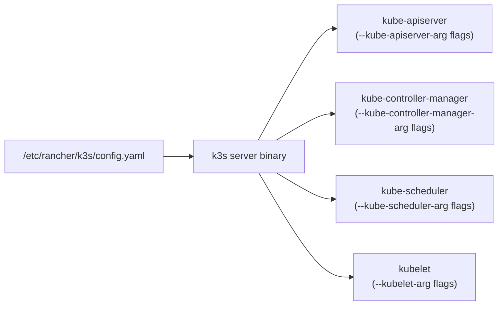
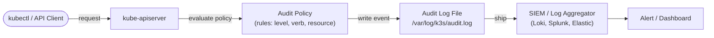
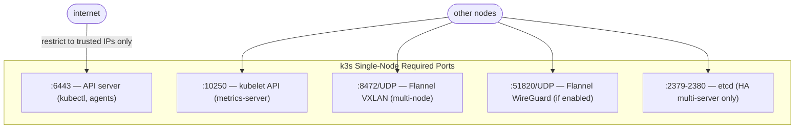
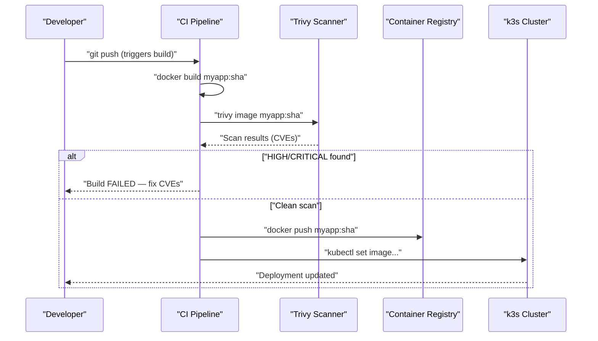
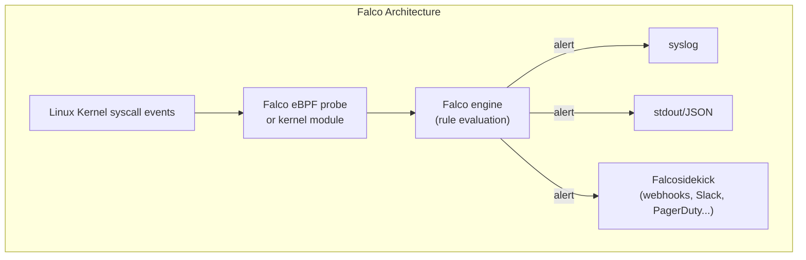

# k3s Hardening Guide
> Module 09 · Lesson 05 | [↑ Course Index](../README.md)


[](../README.md)
[](../LICENSE.md)

## Table of Contents
- [Overview](#overview)
- [CIS Benchmark Basics](#cis-benchmark-basics)
- [k3s-Specific Hardening Flags](#k3s-specific-hardening-flags)
  - [API Server Hardening](#api-server-hardening)
  - [Controller Manager Flags](#controller-manager-flags)
  - [Scheduler Flags](#scheduler-flags)
  - [kubelet Flags via k3s](#kubelet-flags-via-k3s)
  - [Audit Logging](#audit-logging)
- [Node OS Hardening](#node-os-hardening)
  - [Firewall Configuration](#firewall-configuration)
  - [SSH Hardening](#ssh-hardening)
  - [Minimal Package Surface](#minimal-package-surface)
- [Limiting API Server Exposure](#limiting-api-server-exposure)
- [Image Scanning with Trivy](#image-scanning-with-trivy)
- [Runtime Security with Falco](#runtime-security-with-falco)
- [Hardening Checklist](#hardening-checklist)
- [Lab](#lab)

---

## Overview

Security is a process, not a destination. This lesson covers the layered approach to hardening a k3s cluster: from CIS Benchmark alignment and k3s-specific flags, through OS-level controls, to runtime threat detection. No single control is sufficient — defence-in-depth means assuming each layer will eventually be breached and ensuring the next layer still holds.

```mermaid
flowchart TD
    subgraph "Defence in Depth"
        L1["Layer 1: Image security<br/>Scanned, minimal, non-root images"]
        L2["Layer 2: Pod security<br/>PSA Restricted, SecurityContext"]
        L3["Layer 3: Network security<br/>NetworkPolicies, TLS everywhere"]
        L4["Layer 4: RBAC<br/>Least-privilege, no cluster-admin"]
        L5["Layer 5: Secrets security<br/>Encryption at rest, Sealed Secrets"]
        L6["Layer 6: Node OS security<br/>Firewall, SSH, minimal packages"]
        L7["Layer 7: k3s/API hardening<br/>CIS Benchmark, audit logging"]
        L8["Layer 8: Runtime detection<br/>Falco, anomaly detection"]

        L1 --> L2 --> L3 --> L4 --> L5 --> L6 --> L7 --> L8
    end
```



[↑ Back to TOC](#table-of-contents) · [↑ Course Index](../README.md)

---

## CIS Benchmark Basics

The Center for Internet Security (CIS) publishes a Kubernetes Benchmark — a detailed guide of configuration checks for hardening Kubernetes components. The benchmark is divided into:

- **Control Plane components:** API server, controller manager, scheduler, etcd
- **Worker node components:** kubelet, configuration files
- **Policies:** RBAC, PSA, network policies

k3s ships with a companion [CIS Hardening Guide](https://docs.k3s.io/security/hardening-guide) that maps each CIS check to k3s-specific configuration.

### Running kube-bench

`kube-bench` is the de facto tool for automated CIS Benchmark scanning:

```bash
# Run kube-bench as a Job in the cluster
kubectl apply -f https://raw.githubusercontent.com/aquasecurity/kube-bench/main/job.yaml

# View results
kubectl logs job/kube-bench

# Run locally against a k3s node
# Download kube-bench binary
curl -Lo kube-bench.tar.gz \
  https://github.com/aquasecurity/kube-bench/releases/latest/download/kube-bench_linux_amd64.tar.gz
tar xzf kube-bench.tar.gz

# Run with k3s profile
sudo ./kube-bench --config-dir cfg --config cfg/config.yaml \
  --benchmark k3s-cis-1.24    # native k3s benchmark (kube-bench v0.7+)
```

### CIS check categories

| Category | Examples |
|---|---|
| API Server | Anonymous auth disabled, audit logging enabled, TLS cipher suites |
| etcd | TLS peer/client auth, data encryption at rest |
| kubelet | Read-only port disabled, webhook auth enabled, protect-kernel-defaults |
| RBAC | No cluster-admin bindings to service accounts, no wildcard permissions |
| Networking | NetworkPolicies present, no default-allow |

[↑ Back to TOC](#table-of-contents) · [↑ Course Index](../README.md)

---

## k3s-Specific Hardening Flags

k3s consolidates all components (API server, controller manager, scheduler, kubelet) into a single binary. Flags for each component are passed via `kube-apiserver-arg`, `kube-controller-manager-arg`, `kube-scheduler-arg`, and `kubelet-arg` in `/etc/rancher/k3s/config.yaml`.



### API Server Hardening

```yaml
# /etc/rancher/k3s/config.yaml
kube-apiserver-arg:
  # Disable anonymous authentication (any unauthenticated request is rejected)
  - "anonymous-auth=false"

  # Restrict which admission plugins are active
  - "enable-admission-plugins=NodeRestriction,PodSecurity,ServiceAccount,EventRateLimit"

  # Disable profiling endpoint (reduces attack surface)
  - "profiling=false"

  # Enable audit logging (see Audit Logging section below)
  - "audit-log-path=/var/log/k3s/audit.log"
  - "audit-log-maxage=30"
  - "audit-log-maxbackup=10"
  - "audit-log-maxsize=100"
  - "audit-policy-file=/etc/k3s/audit-policy.yaml"

  # Restrict API server to bind on specific interface only
  - "bind-address=0.0.0.0"          # change to specific IP in production
  - "secure-port=6443"

  # TLS hardening — restrict to strong cipher suites
  - "tls-min-version=VersionTLS12"
  - "tls-cipher-suites=TLS_ECDHE_ECDSA_WITH_AES_128_GCM_SHA256,TLS_ECDHE_RSA_WITH_AES_128_GCM_SHA256,TLS_ECDHE_ECDSA_WITH_AES_256_GCM_SHA384,TLS_ECDHE_RSA_WITH_AES_256_GCM_SHA384"

  # Encryption at rest for secrets
  - "encryption-provider-config=/etc/k3s/encryption-config.yaml"

  # Service account token security
  - "service-account-lookup=true"        # verify SA tokens against etcd on every request
  - "service-account-issuer=https://kubernetes.default.svc"

  # Request timeout
  - "request-timeout=300s"
```

### Controller Manager Flags

```yaml
kube-controller-manager-arg:
  # Disable profiling
  - "profiling=false"

  # Use secure port only
  - "bind-address=127.0.0.1"      # listen on loopback only

  # Terminate and rotate service account tokens
  - "use-service-account-credentials=true"

  # Root CA bundle for pod service account verification
  - "root-ca-file=/var/lib/rancher/k3s/server/tls/server-ca.crt"
```

### Scheduler Flags

```yaml
kube-scheduler-arg:
  # Disable profiling
  - "profiling=false"

  # Bind to loopback only
  - "bind-address=127.0.0.1"
```

### kubelet Flags via k3s

```yaml
kubelet-arg:
  # CIS Benchmark: protect kernel defaults
  # Ensures sysctl settings required by Kubernetes match expectations
  - "protect-kernel-defaults=true"

  # Disable the read-only port (10255) — exposes pod/node info without auth
  - "read-only-port=0"

  # Enable webhook authentication (use API server to authenticate)
  - "authentication-token-webhook=true"
  - "authorization-mode=Webhook"

  # Restrict anonymous access
  - "anonymous-auth=false"

  # Event recording limits
  - "event-qps=5"

  # Rotate kubelet certificates automatically
  - "rotate-certificates=true"

  # Only allow images from trusted registries (optional — set your registry)
  # - "pod-infra-container-image=registry.example.com/pause:3.9"

  # Streaming connection timeout
  - "streaming-connection-idle-timeout=5m"
```

> **Note on `protect-kernel-defaults`:** This flag requires that the OS kernel parameters match what Kubernetes expects. You may need to set sysctl values before enabling this:
> ```bash
> sudo sysctl -w vm.panic_on_oom=0
> sudo sysctl -w vm.overcommit_memory=1
> sudo sysctl -w kernel.panic=10
> sudo sysctl -w kernel.panic_on_oops=1
> ```

[↑ Back to TOC](#table-of-contents) · [↑ Course Index](../README.md)

---

## Audit Logging

Audit logging records every request made to the API server — essential for incident response and compliance.



### Audit policy file

```yaml
# /etc/k3s/audit-policy.yaml
apiVersion: audit.k8s.io/v1
kind: Policy
rules:
  # Log secret accesses at the Metadata level (don't log values)
  - level: Metadata
    resources:
      - group: ""
        resources: ["secrets"]

  # Log pod exec/attach/portforward at Request level
  - level: Request
    verbs: ["create"]
    resources:
      - group: ""
        resources: ["pods/exec", "pods/attach", "pods/portforward"]

  # Log RBAC changes at RequestResponse level
  - level: RequestResponse
    resources:
      - group: "rbac.authorization.k8s.io"
        resources: ["clusterroles", "clusterrolebindings", "roles", "rolebindings"]

  # Log namespace changes
  - level: RequestResponse
    resources:
      - group: ""
        resources: ["namespaces"]

  # Skip high-volume, low-value events
  - level: None
    users: ["system:kube-proxy"]
    verbs: ["watch"]
    resources:
      - group: ""
        resources: ["endpoints", "services", "services/status"]

  - level: None
    users: ["system:unsecured"]
    namespaces: ["kube-system"]
    verbs: ["get"]
    resources:
      - group: ""
        resources: ["configmaps"]

  - level: None
    userGroups: ["system:nodes"]
    verbs: ["get"]
    resources:
      - group: ""
        resources: ["nodes", "nodes/status"]

  # Default: log everything else at Metadata level
  - level: Metadata
    omitStages:
      - RequestReceived
```

```bash
# Query audit logs for secret reads
grep '"resource":"secrets"' /var/log/k3s/audit.log | \
  jq 'select(.verb=="get") | {user: .user.username, secret: .objectRef.name, ns: .objectRef.namespace, time: .requestReceivedTimestamp}'

# Check for privileged pod creations
grep '"resource":"pods"' /var/log/k3s/audit.log | \
  jq 'select(.verb=="create") | {user: .user.username, pod: .objectRef.name, ns: .objectRef.namespace}'
```

[↑ Back to TOC](#table-of-contents) · [↑ Course Index](../README.md)

---

## Node OS Hardening

The k3s binary and API are only as secure as the OS they run on. Node hardening is essential.

### Firewall Configuration



```bash
# Using UFW (Ubuntu/Debian)
# Default deny incoming, allow outgoing
sudo ufw default deny incoming
sudo ufw default allow outgoing

# Allow SSH from your management network only
sudo ufw allow from 192.168.1.0/24 to any port 22

# Allow API server from kubectl workstations
sudo ufw allow from 192.168.1.0/24 to any port 6443

# Allow kubelet from other nodes
sudo ufw allow from 10.0.0.0/8 to any port 10250

# Allow Flannel VXLAN between nodes
sudo ufw allow from 10.0.0.0/8 to any port 8472 proto udp

# Enable firewall
sudo ufw enable
sudo ufw status verbose
```

```bash
# Using nftables (RHEL/Rocky/AlmaLinux)
sudo tee /etc/nftables.d/k3s.conf <<'EOF'
table inet k3s {
    chain input {
        type filter hook input priority 0; policy drop;

        # Allow established/related
        ct state established,related accept

        # Allow loopback
        iifname lo accept

        # ICMP (ping)
        ip protocol icmp accept
        ip6 nexthdr icmpv6 accept

        # SSH — management network only
        ip saddr 192.168.1.0/24 tcp dport 22 accept

        # k3s API server — management network only
        ip saddr 192.168.1.0/24 tcp dport 6443 accept

        # kubelet, Flannel — node network only
        ip saddr 10.0.0.0/8 tcp dport 10250 accept
        ip saddr 10.0.0.0/8 udp dport 8472 accept
    }
    chain forward {
        type filter hook forward priority 0; policy accept;
    }
    chain output {
        type filter hook output priority 0; policy accept;
    }
}
EOF
sudo nft -f /etc/nftables.d/k3s.conf
sudo systemctl enable --now nftables
```

### SSH Hardening

```bash
# /etc/ssh/sshd_config.d/hardening.conf
sudo tee /etc/ssh/sshd_config.d/hardening.conf <<'EOF'
# Disable password authentication — key-based only
PasswordAuthentication no
ChallengeResponseAuthentication no
PermitRootLogin no

# Use modern key exchange algorithms only
KexAlgorithms curve25519-sha256,curve25519-sha256@libssh.org,diffie-hellman-group16-sha512,diffie-hellman-group18-sha512
Ciphers chacha20-poly1305@openssh.com,aes256-gcm@openssh.com,aes128-gcm@openssh.com
MACs hmac-sha2-256-etm@openssh.com,hmac-sha2-512-etm@openssh.com

# Connection limits
MaxAuthTries 3
MaxSessions 5
LoginGraceTime 30

# Disable unused features
X11Forwarding no
AllowAgentForwarding no
AllowTcpForwarding no

# Log level
LogLevel VERBOSE
EOF

sudo systemctl reload sshd
```

### Minimal Package Surface

```bash
# Ubuntu/Debian — remove unnecessary services
sudo systemctl disable --now avahi-daemon 2>/dev/null || true
sudo systemctl disable --now cups 2>/dev/null || true
sudo systemctl disable --now bluetooth 2>/dev/null || true
sudo apt-get remove --purge -y telnet rsh-client ftp 2>/dev/null || true
sudo apt-get autoremove -y

# RHEL/Rocky — remove unnecessary services
sudo systemctl disable --now avahi-daemon 2>/dev/null || true
sudo dnf remove -y telnet rsh ftp 2>/dev/null || true

# Check listening ports — reduce to minimum
sudo ss -tlnp
sudo ss -ulnp

# Disable IPv6 if not needed (reduces attack surface)
sudo tee /etc/sysctl.d/99-disable-ipv6.conf <<'EOF'
net.ipv6.conf.all.disable_ipv6 = 1
net.ipv6.conf.default.disable_ipv6 = 1
EOF
sudo sysctl --system
```

[↑ Back to TOC](#table-of-contents) · [↑ Course Index](../README.md)

---

## Limiting API Server Exposure

The API server (port 6443) should never be exposed to the internet:

```bash
# Check current exposure
curl -k https://$(hostname -I | awk '{print $1}'):6443/version

# Verify the API server is not listening on 0.0.0.0 in production
# In k3s config.yaml, restrict bind address:
# kube-apiserver-arg:
#   - "bind-address=10.0.1.5"   # your node's internal IP
```

### Using a bastion / jump host

```
External workstation
        |
        | SSH tunnel (port forwarding)
        v
   Bastion host (DMZ)
        |
        | Private network
        v
   k3s node (API server :6443)
```

```bash
# Set up kubectl via SSH tunnel
ssh -L 6443:10.0.1.5:6443 bastion.example.com -N &

# Configure kubeconfig to use localhost
kubectl config set-cluster my-k3s \
  --server=https://127.0.0.1:6443 \
  --kubeconfig=~/.kube/config-k3s
```

### API server RBAC for kubeconfig

```bash
# Revoke kubeconfig access for a user
# (delete their client certificate — requires CA key rotation for full revocation)
# Better practice: use short-lived tokens or OIDC with instant revocation capability

# Check who has kubeconfig credentials
kubectl config view --raw | grep "name:"
```

[↑ Back to TOC](#table-of-contents) · [↑ Course Index](../README.md)

---

## Image Scanning with Trivy

Every container image is a potential attack vector — outdated packages, misconfigured files, embedded secrets. Trivy is the most widely adopted open-source image scanner.



```bash
# Install Trivy
curl -sfL https://raw.githubusercontent.com/aquasecurity/trivy/main/contrib/install.sh | \
  sh -s -- -b /usr/local/bin

# Scan a single image
trivy image nginx:latest

# Scan with severity filter — fail CI if HIGH or CRITICAL found
trivy image --exit-code 1 --severity HIGH,CRITICAL nginx:latest

# Scan for misconfigurations in Kubernetes manifests
trivy config ./k8s-manifests/

# Scan a running pod's image
POD_IMAGE=$(kubectl get pod my-pod -o jsonpath='{.spec.containers[0].image}')
trivy image "$POD_IMAGE"

# Generate an SBOM (Software Bill of Materials)
trivy image --format spdx-json --output sbom.json myapp:1.0.0

# Scan all images currently running in the cluster
kubectl get pods --all-namespaces -o jsonpath='{range .items[*]}{.spec.containers[*].image}{"\n"}{end}' | \
  sort -u | \
  while read -r img; do
    echo "=== Scanning: $img ==="
    trivy image --severity HIGH,CRITICAL --quiet "$img"
  done
```

### Trivy in CI/CD

```yaml
# .github/workflows/security.yml (GitHub Actions example)
jobs:
  trivy-scan:
    runs-on: ubuntu-latest
    steps:
      - uses: actions/checkout@v4
      - name: Scan image
        uses: aquasecurity/trivy-action@master
        with:
          image-ref: myapp:${{ github.sha }}
          format: sarif
          output: trivy-results.sarif
          severity: HIGH,CRITICAL
          exit-code: '1'
      - name: Upload SARIF
        uses: github/codeql-action/upload-sarif@v3
        with:
          sarif_file: trivy-results.sarif
```

### Image best practices

```dockerfile
# Use minimal base images
FROM gcr.io/distroless/static-debian12   # no shell, no package manager
# or
FROM alpine:3.19                          # minimal shell for debugging

# Run as non-root
RUN addgroup -S appgroup && adduser -S appuser -G appgroup
USER appuser

# Don't copy secrets into the image
# Use build args with --secret mount instead
RUN --mount=type=secret,id=npm_token \
    npm config set //registry.npmjs.org/:_authToken "$(cat /run/secrets/npm_token)"

# Keep base image updated
# Use Renovate or Dependabot to get automatic image update PRs
```

[↑ Back to TOC](#table-of-contents) · [↑ Course Index](../README.md)

---

## Runtime Security with Falco

While Trivy scans images before deployment, Falco monitors running workloads for suspicious behaviour at runtime — syscall-level threat detection.



### Installing Falco

```bash
# Install via Helm
helm repo add falcosecurity https://falcosecurity.github.io/charts
helm repo update

helm install falco falcosecurity/falco \
  --namespace falco \
  --create-namespace \
  --set driver.kind=ebpf \
  --set falcosidekick.enabled=true \
  --set falcosidekick.config.slack.webhookurl="https://hooks.slack.com/..."
```

### Key Falco rules

Falco's default ruleset detects many common attack patterns:

| Rule | What it detects |
|---|---|
| `Terminal shell in container` | `exec /bin/bash` or `/bin/sh` in a running container |
| `Write below etc` | Any write to `/etc/` in a container |
| `Read sensitive file untrusted` | Reading `/etc/shadow`, `/etc/passwd`, SSH keys |
| `Contact K8S API Server From Container` | Pod calling the Kubernetes API directly |
| `Unexpected outbound connection` | Connections to IPs not in an allowlist |
| `Privilege escalation via setuid` | setuid binary execution |
| `Container started with new privileges` | `--privileged` or `SYS_ADMIN` at runtime |

### Custom rule example

```yaml
# /etc/falco/rules.d/custom.yaml
- rule: Unexpected kubectl in container
  desc: Detect kubectl binary execution inside a container
  condition: >
    spawned_process and
    container and
    proc.name = "kubectl"
  output: >
    kubectl executed in container
    (user=%user.name container=%container.name
     image=%container.image.repository:%container.image.tag
     command=%proc.cmdline)
  priority: WARNING
  tags: [container, lateral_movement]
```

[↑ Back to TOC](#table-of-contents) · [↑ Course Index](../README.md)

---

## Hardening Checklist

Use this checklist as a baseline before promoting a cluster to production:

### API Server & k3s Configuration

- [ ] `anonymous-auth=false` — no unauthenticated API access
- [ ] `profiling=false` — API server, controller-manager, scheduler
- [ ] `protect-kernel-defaults=true` — kubelet sysctl protection
- [ ] `read-only-port=0` — kubelet read-only port disabled
- [ ] Encryption at rest enabled for Secrets
- [ ] Audit logging enabled with an appropriate policy
- [ ] TLS minimum version set to TLS 1.2
- [ ] Strong cipher suites configured
- [ ] `service-account-lookup=true` — token validation against etcd

### RBAC

- [ ] No ClusterRoleBinding to `cluster-admin` for application ServiceAccounts
- [ ] No wildcard (`*`) permissions in custom Roles
- [ ] All ServiceAccounts have `automountServiceAccountToken: false` where not needed
- [ ] `kubectl auth can-i --list` reviewed for all application ServiceAccounts
- [ ] `default` ServiceAccount in each namespace has no bound roles

### Network

- [ ] CNI supports NetworkPolicies (Canal, Calico, or Cilium — not vanilla Flannel)
- [ ] `deny-all` NetworkPolicy in every application namespace
- [ ] API server port (6443) not exposed to the internet
- [ ] `allow-dns` NetworkPolicy present in deny-all namespaces
- [ ] Firewall configured on each node (UFW or nftables)
- [ ] Unused ports closed

### Pod Security

- [ ] PSA `enforce: restricted` (or at minimum `baseline`) on all application namespaces
- [ ] All containers run as non-root (`runAsNonRoot: true`)
- [ ] `readOnlyRootFilesystem: true` where possible
- [ ] `allowPrivilegeEscalation: false` on all containers
- [ ] `capabilities.drop: [ALL]` with minimal adds
- [ ] `seccompProfile: RuntimeDefault` on all pods

### Secrets

- [ ] No plain Secret YAMLs committed to Git
- [ ] Sealed Secrets or External Secrets Operator in use
- [ ] Secrets mounted as volumes (not env vars) where possible
- [ ] Volume mounts use `defaultMode: 0400`
- [ ] RBAC restricts `get/list secrets` to only required subjects
- [ ] etcd backups encrypted and access-controlled

### Node OS

- [ ] SSH password authentication disabled
- [ ] Root SSH login disabled
- [ ] Unnecessary services disabled
- [ ] Firewall enabled and configured
- [ ] OS packages up to date
- [ ] `aide` or equivalent file integrity monitoring installed

### Images & Runtime

- [ ] All images scanned with Trivy (no HIGH/CRITICAL unpatched CVEs)
- [ ] Images use minimal base (distroless or Alpine)
- [ ] Images run as non-root user
- [ ] No secrets embedded in image layers
- [ ] Falco deployed for runtime threat detection
- [ ] Image pull policy is `Always` for mutable tags

### Monitoring & Response

- [ ] Audit log aggregation configured (ship to SIEM or log storage)
- [ ] Falco alerts routed to incident response channel
- [ ] kube-bench run and results reviewed
- [ ] Security contact and incident response runbook documented

[↑ Back to TOC](#table-of-contents) · [↑ Course Index](../README.md)

---

## Lab

```bash
# Install kube-bench and run a scan
curl -Lo kube-bench.tar.gz \
  https://github.com/aquasecurity/kube-bench/releases/latest/download/kube-bench_linux_amd64.tar.gz
tar xzf kube-bench.tar.gz
sudo install -m 755 kube-bench /usr/local/bin/

# Run against k3s using the native k3s benchmark (kube-bench v0.7+)
sudo kube-bench --benchmark k3s-cis-1.24

# Apply the hardening configuration to k3s
# (Review each flag carefully before applying to production)
sudo tee /etc/rancher/k3s/config.yaml <<'EOF'
kubelet-arg:
  - "protect-kernel-defaults=true"
  - "read-only-port=0"
  - "anonymous-auth=false"
  - "authentication-token-webhook=true"
  - "authorization-mode=Webhook"
  - "streaming-connection-idle-timeout=5m"
  - "event-qps=5"
  - "rotate-certificates=true"
kube-apiserver-arg:
  - "anonymous-auth=false"
  - "profiling=false"
  - "service-account-lookup=true"
  - "tls-min-version=VersionTLS12"
kube-controller-manager-arg:
  - "profiling=false"
  - "bind-address=127.0.0.1"
  - "use-service-account-credentials=true"
kube-scheduler-arg:
  - "profiling=false"
  - "bind-address=127.0.0.1"
EOF

# Restart k3s to apply
sudo systemctl restart k3s

# Install Trivy and scan a common image
curl -sfL https://raw.githubusercontent.com/aquasecurity/trivy/main/contrib/install.sh | \
  sh -s -- -b /usr/local/bin
trivy image --severity HIGH,CRITICAL nginx:latest

# Install Falco (requires Helm)
helm repo add falcosecurity https://falcosecurity.github.io/charts
helm repo update
helm install falco falcosecurity/falco \
  --namespace falco \
  --create-namespace \
  --set driver.kind=ebpf

# Watch Falco logs for detections
kubectl logs -n falco daemonset/falco -f

# Trigger a Falco alert (terminal shell in container)
kubectl run test-shell --image=alpine --restart=Never -- sleep 3600
kubectl exec -it test-shell -- sh   # this triggers "Terminal shell in container"
# Check falco logs — should show an alert

# Clean up
kubectl delete pod test-shell
```

[↑ Back to TOC](#table-of-contents) · [↑ Course Index](../README.md)

---

*Licensed under [CC BY-NC-SA 4.0](../LICENSE.md) · © 2026 UncleJS*
