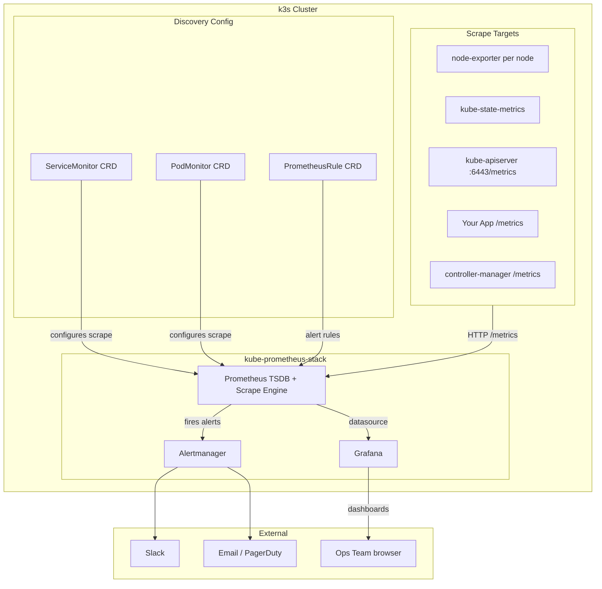

# Prometheus Stack
> Module 10 · Lesson 01 | [↑ Course Index](../README.md)


[](../README.md)
[](../LICENSE.md)

## Table of Contents
- [Overview](#overview)
- [Prometheus Architecture](#prometheus-architecture)
- [kube-prometheus-stack Helm Chart](#kube-prometheus-stack-helm-chart)
- [Installing on k3s](#installing-on-k3s)
- [What Gets Deployed](#what-gets-deployed)
- [ServiceMonitor and PodMonitor CRDs](#servicemonitor-and-podmonitor-crds)
- [PromQL Basics](#promql-basics)
- [Persistent Storage for Prometheus](#persistent-storage-for-prometheus)
- [Resource Considerations for k3s](#resource-considerations-for-k3s)
- [Lab](#lab)

---

## Overview

Prometheus is the de facto standard for metrics-based monitoring in Kubernetes. It uses a **pull (scrape) model**: Prometheus periodically fetches metrics from HTTP endpoints exposed by your workloads and the cluster itself. The scraped data is stored in a local time-series database (TSDB) and queryable via PromQL.

The `kube-prometheus-stack` Helm chart bundles everything you need — Prometheus, Alertmanager, Grafana, node-exporter, and kube-state-metrics — into a single, production-ready installation.

[↑ Back to TOC](#table-of-contents) · [↑ Course Index](../README.md)

---

## Prometheus Architecture



### How scraping works

1. Prometheus reads its configuration (generated from ServiceMonitor/PodMonitor CRDs).
2. Every `scrapeInterval` (default 30 s) it sends an HTTP GET to each target's `/metrics` endpoint.
3. The response is a text-based exposition format: `metric_name{label="value"} numeric_value timestamp`.
4. Prometheus stores the samples in its on-disk TSDB with configurable retention (default 15 days).
5. Alert rules are evaluated on each scrape cycle; firing alerts are forwarded to Alertmanager.

[↑ Back to TOC](#table-of-contents) · [↑ Course Index](../README.md)

---

## kube-prometheus-stack Helm Chart

The `kube-prometheus-stack` chart (formerly `prometheus-operator`) is maintained by the Prometheus community at `prometheus-community/kube-prometheus-stack`.

| Component | Chart sub-chart | Purpose |
|---|---|---|
| Prometheus Operator | built-in | Watches CRDs and generates Prometheus config |
| Prometheus | built-in | Metrics collection and storage |
| Alertmanager | built-in | Alert routing and deduplication |
| Grafana | `grafana/grafana` | Visualization |
| node-exporter | `prometheus-node-exporter` | Per-node OS/hardware metrics |
| kube-state-metrics | `kube-state-metrics` | Kubernetes object state metrics |

### Why use this chart vs plain Prometheus?

- The **Prometheus Operator** watches `ServiceMonitor` and `PrometheusRule` CRDs and dynamically updates Prometheus configuration — no manual config file edits.
- Pre-built **recording rules** reduce query overhead for dashboards.
- Pre-built **alert rules** cover the most common Kubernetes failure scenarios out of the box.
- `kube-state-metrics` provides object-level metrics (pod phase, deployment replicas, etc.) that are absent from the node-level metrics.

[↑ Back to TOC](#table-of-contents) · [↑ Course Index](../README.md)

---

## Installing on k3s

### Prerequisites

- Helm 3 installed (`helm version`)
- A running k3s cluster (Module 02)
- At least 2 GB RAM available across nodes (see [Resource Considerations](#resource-considerations-for-k3s))

### Step 1 — Add the Helm repo

```bash
helm repo add prometheus-community https://prometheus-community.github.io/helm-charts
helm repo update
```

### Step 2 — Create a namespace

```bash
kubectl create namespace monitoring
```

### Step 3 — Install with custom values

```bash
helm install kube-prometheus-stack \
  prometheus-community/kube-prometheus-stack \
  --namespace monitoring \
  --values 10_monitoring/labs/prometheus-values.yaml \
  --version 58.1.3   # pin to a known good version
```

> **k3s-specific note:** k3s ships with an embedded etcd that uses different TLS certificates than what kube-prometheus-stack expects. Disable etcd monitoring in your values file (covered in the lab) or you will see persistent scrape errors.

### Step 4 — Verify the installation

```bash
# All pods should be Running or Completed
kubectl get pods -n monitoring

# Check that Prometheus is ready
kubectl get prometheus -n monitoring

# Check ServiceMonitors
kubectl get servicemonitors -n monitoring
```

### Step 5 — Quick access (port-forward)

```bash
# Prometheus UI on http://localhost:9090
kubectl port-forward -n monitoring svc/kube-prometheus-stack-prometheus 9090:9090

# Grafana UI on http://localhost:3000
kubectl port-forward -n monitoring svc/kube-prometheus-stack-grafana 3000:80
```

### Upgrading

```bash
helm upgrade kube-prometheus-stack \
  prometheus-community/kube-prometheus-stack \
  --namespace monitoring \
  --values 10_monitoring/labs/prometheus-values.yaml \
  --reuse-values
```

> **Warning:** Major version upgrades of this chart sometimes change CRD versions. Always read the chart's CHANGELOG before upgrading.

[↑ Back to TOC](#table-of-contents) · [↑ Course Index](../README.md)

---

## What Gets Deployed

After installation you will find the following key resources in the `monitoring` namespace:

### Pods

| Pod | Purpose |
|---|---|
| `prometheus-kube-prometheus-stack-prometheus-0` | Main Prometheus server (StatefulSet) |
| `alertmanager-kube-prometheus-stack-alertmanager-0` | Alertmanager (StatefulSet) |
| `kube-prometheus-stack-grafana-*` | Grafana (Deployment) |
| `kube-prometheus-stack-prometheus-node-exporter-*` | DaemonSet — one pod per node |
| `kube-prometheus-stack-kube-state-metrics-*` | Kubernetes object state metrics |
| `kube-prometheus-stack-operator-*` | Prometheus Operator controller |

### CRDs installed

```bash
kubectl get crds | grep monitoring.coreos.com
```

```
alertmanagerconfigs.monitoring.coreos.com
alertmanagers.monitoring.coreos.com
podmonitors.monitoring.coreos.com
probes.monitoring.coreos.com
prometheuses.monitoring.coreos.com
prometheusrules.monitoring.coreos.com
scrapeconfigs.monitoring.coreos.com
servicemonitors.monitoring.coreos.com
thanosrulers.monitoring.coreos.com
```

### node-exporter — what it measures

node-exporter runs as a DaemonSet with `hostNetwork: true` and `hostPID: true`, giving it access to host-level metrics:

- CPU usage per core and mode (`node_cpu_seconds_total`)
- Memory: available, buffers, cache (`node_memory_*`)
- Disk I/O (`node_disk_*`)
- Filesystem usage (`node_filesystem_*`)
- Network: bytes, errors, dropped (`node_network_*`)
- System load average (`node_load1`, `node_load5`, `node_load15`)

### kube-state-metrics — what it measures

kube-state-metrics watches the Kubernetes API and exposes object state:

- `kube_pod_status_phase` — pod phase (Running, Pending, Failed…)
- `kube_deployment_status_replicas_ready` — ready replica count
- `kube_node_status_condition` — node Ready/NotReady
- `kube_persistentvolumeclaim_status_phase` — PVC bound status
- `kube_job_status_failed` — failed job count

[↑ Back to TOC](#table-of-contents) · [↑ Course Index](../README.md)

---

## ServiceMonitor and PodMonitor CRDs

The Prometheus Operator introduces a declarative way to configure scraping. Instead of editing a static `prometheus.yml`, you create CRD objects that the operator translates into scrape configurations.

### ServiceMonitor

Targets **Services** — Prometheus discovers pods through the Service's label selector.

```yaml
apiVersion: monitoring.coreos.com/v1
kind: ServiceMonitor
metadata:
  name: my-app-monitor
  namespace: monitoring
  labels:
    release: kube-prometheus-stack   # must match Prometheus' serviceMonitorSelector
spec:
  selector:
    matchLabels:
      app: my-app                    # selects Services with this label
  namespaceSelector:
    matchNames:
      - default
  endpoints:
    - port: http-metrics             # the port name in the Service spec
      path: /metrics
      interval: 30s
      scrapeTimeout: 10s
```

### PodMonitor

Targets **Pods directly** — useful when a Service is not available (e.g., batch jobs, DaemonSets without Services).

```yaml
apiVersion: monitoring.coreos.com/v1
kind: PodMonitor
metadata:
  name: my-batch-job-monitor
  namespace: monitoring
  labels:
    release: kube-prometheus-stack
spec:
  selector:
    matchLabels:
      app: batch-processor
  podMetricsEndpoints:
    - port: metrics
      path: /metrics
      interval: 60s
```

### Label matching

The `Prometheus` custom resource has a `serviceMonitorSelector` field. A ServiceMonitor is only picked up if its labels match this selector. The default installation uses:

```yaml
serviceMonitorSelector:
  matchLabels:
    release: kube-prometheus-stack
```

Always add `release: kube-prometheus-stack` to your ServiceMonitor labels.

[↑ Back to TOC](#table-of-contents) · [↑ Course Index](../README.md)

---

## PromQL Basics

PromQL (Prometheus Query Language) is a functional query language for time-series data. All queries in Grafana dashboards and alert rules are written in PromQL.

### Core concepts

| Concept | Description | Example |
|---|---|---|
| Instant vector | Set of time series at a single point in time | `node_cpu_seconds_total` |
| Range vector | Set of time series over a time window | `node_cpu_seconds_total[5m]` |
| Scalar | Single numeric value | `42` |
| Label filter | Narrow results by label | `{namespace="default"}` |

### Essential functions

| Function | Purpose |
|---|---|
| `rate(v[d])` | Per-second average rate of increase over duration `d` |
| `irate(v[d])` | Instantaneous rate (last two samples) — more responsive |
| `increase(v[d])` | Total increase over duration `d` |
| `sum(v)` | Aggregate by summing |
| `avg(v)` | Aggregate by averaging |
| `by (label)` | Group aggregation by label |
| `without (label)` | Group aggregation excluding label |
| `topk(n, v)` | Top N time series by value |
| `histogram_quantile(φ, v)` | Compute φ quantile from histogram |

### 5 useful example queries

**1. Node CPU usage percentage (excluding idle)**

```promql
100 - (
  avg by (instance) (
    rate(node_cpu_seconds_total{mode="idle"}[5m])
  ) * 100
)
```

**2. Node memory available as percentage**

```promql
100 * (
  node_memory_MemAvailable_bytes /
  node_memory_MemTotal_bytes
)
```

**3. Pods not in Running state per namespace**

```promql
count by (namespace) (
  kube_pod_status_phase{phase!="Running", phase!="Succeeded"}
)
```

**4. Top 5 containers by CPU usage**

```promql
topk(5,
  sum by (namespace, pod, container) (
    rate(container_cpu_usage_seconds_total{container!=""}[5m])
  )
)
```

**5. HTTP request rate per service (requires app instrumentation)**

```promql
sum by (service) (
  rate(http_requests_total{namespace="default"}[2m])
)
```

### Recording rules

For expensive queries run frequently by dashboards, use **recording rules** to pre-compute and store results:

```yaml
apiVersion: monitoring.coreos.com/v1
kind: PrometheusRule
metadata:
  name: my-recording-rules
  namespace: monitoring
  labels:
    release: kube-prometheus-stack
spec:
  groups:
    - name: node.rules
      interval: 1m
      rules:
        - record: instance:node_cpu_utilisation:rate5m
          expr: |
            1 - avg without (cpu, mode) (
              rate(node_cpu_seconds_total{mode="idle"}[5m])
            )
```

[↑ Back to TOC](#table-of-contents) · [↑ Course Index](../README.md)

---

## Persistent Storage for Prometheus

By default, Prometheus stores data in an `emptyDir` — data is **lost when the pod restarts**. For production use, always configure a PersistentVolumeClaim.

### Configure via Helm values

```yaml
prometheus:
  prometheusSpec:
    retention: 30d          # keep 30 days of data
    retentionSize: "8GiB"   # or cap by size
    storageSpec:
      volumeClaimTemplate:
        spec:
          storageClassName: local-path   # k3s built-in
          accessModes: ["ReadWriteOnce"]
          resources:
            requests:
              storage: 10Gi
```

### Sizing guidance

| Metric count | Scrape interval | Approx storage per day |
|---|---|---|
| 10,000 | 30s | ~100 MB |
| 50,000 | 30s | ~500 MB |
| 200,000 | 30s | ~2 GB |

A typical small k3s cluster (3 nodes, ~20 workloads) generates around 30,000–60,000 active time series. **10 Gi is sufficient for 30 days** at this scale.

### Retention tuning

```yaml
prometheus:
  prometheusSpec:
    retention: 15d         # time-based retention
    retentionSize: "8GiB"  # size-based (applied first when both set)
```

[↑ Back to TOC](#table-of-contents) · [↑ Course Index](../README.md)

---

## Resource Considerations for k3s

kube-prometheus-stack is resource-hungry by default (designed for large clusters). On a small k3s cluster you must tune the resource requests and limits.

### Default vs recommended for small clusters

| Component | Default requests | k3s small cluster |
|---|---|---|
| Prometheus | 200m CPU / 400Mi RAM | 100m CPU / 512Mi RAM |
| Alertmanager | 100m CPU / 200Mi RAM | 50m CPU / 128Mi RAM |
| Grafana | 250m CPU / 750Mi RAM | 50m CPU / 256Mi RAM |
| node-exporter | 100m CPU / 30Mi RAM | 50m CPU / 30Mi RAM |
| kube-state-metrics | 100m CPU / 130Mi RAM | 50m CPU / 128Mi RAM |
| Operator | 100m CPU / 100Mi RAM | 50m CPU / 64Mi RAM |

**Total minimum:** ~400m CPU / ~1.1 Gi RAM across the monitoring namespace.

### Reducing scrape load

```yaml
prometheus:
  prometheusSpec:
    scrapeInterval: "60s"      # default 30s — reduce on small clusters
    evaluationInterval: "60s"  # default 30s
    scrapeTimeout: "30s"
```

### Disabling components you don't need

```yaml
# Disable etcd monitoring (k3s uses different certs)
kubeEtcd:
  enabled: false

# Disable scheduler and controller-manager metrics
# (not exposed by default in k3s)
kubeControllerManager:
  enabled: false
kubeScheduler:
  enabled: false
```

[↑ Back to TOC](#table-of-contents) · [↑ Course Index](../README.md)

---

## Lab

Use the values file at `labs/prometheus-values.yaml` to install kube-prometheus-stack.

```bash
# 1. Add repo
helm repo add prometheus-community https://prometheus-community.github.io/helm-charts
helm repo update

# 2. Create namespace
kubectl create namespace monitoring

# 3. Install
helm install kube-prometheus-stack \
  prometheus-community/kube-prometheus-stack \
  --namespace monitoring \
  --values labs/prometheus-values.yaml

# 4. Wait for pods
kubectl rollout status deployment/kube-prometheus-stack-grafana -n monitoring
kubectl rollout status statefulset/prometheus-kube-prometheus-stack-prometheus -n monitoring

# 5. Open Prometheus UI
kubectl port-forward -n monitoring svc/kube-prometheus-stack-prometheus 9090:9090 &
# Visit http://localhost:9090

# 6. Try a PromQL query
# In the Prometheus UI Expression field, enter:
# 100 - (avg by (instance) (rate(node_cpu_seconds_total{mode="idle"}[5m])) * 100)
```

[↑ Back to TOC](#table-of-contents) · [↑ Course Index](../README.md)

---

*Licensed under [CC BY-NC-SA 4.0](../LICENSE.md) · © 2026 UncleJS*
