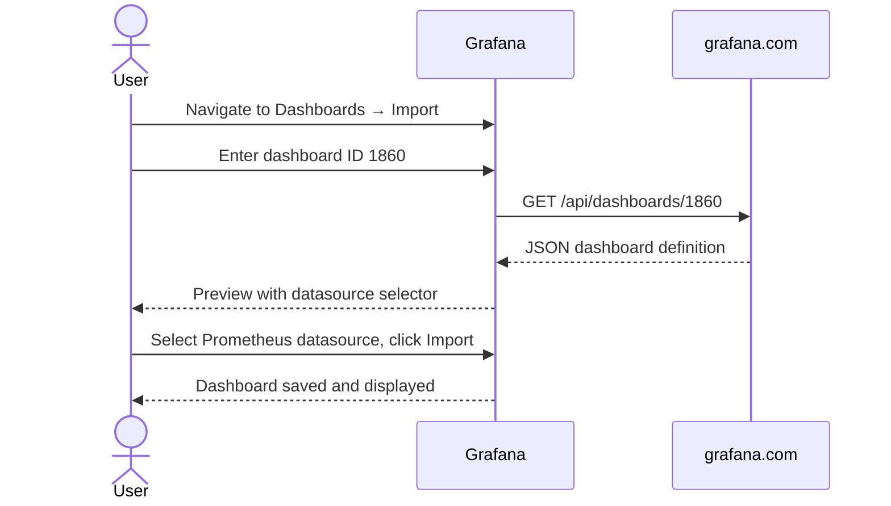

# Grafana Dashboards
> Module 10 · Lesson 02 | [↑ Course Index](../README.md)

## Table of Contents
- [Overview](#overview)
- [Accessing Grafana](#accessing-grafana)
- [Built-in Dashboards in kube-prometheus-stack](#built-in-dashboards-in-kube-prometheus-stack)
- [Importing Community Dashboards](#importing-community-dashboards)
- [Creating a Custom Dashboard](#creating-a-custom-dashboard)
- [Datasource Configuration](#datasource-configuration)
- [Persistent Storage for Grafana](#persistent-storage-for-grafana)
- [Exposing Grafana via Traefik IngressRoute](#exposing-grafana-via-traefik-ingressroute)
- [Authentication Options](#authentication-options)
- [Lab](#lab)

---

## Overview

Grafana is an open-source visualization platform that turns Prometheus time-series data into interactive dashboards. When installed via `kube-prometheus-stack`, Grafana comes pre-configured with a Prometheus datasource and a rich set of Kubernetes dashboards.

[↑ Back to TOC](#table-of-contents) · [↑ Course Index](../README.md)

---

## Accessing Grafana

### Port-forward (quick access, no ingress required)

```bash
kubectl port-forward -n monitoring svc/kube-prometheus-stack-grafana 3000:80
```

Then open `http://localhost:3000` in your browser.

Default credentials set in the Helm values:
- **Username:** `admin`
- **Password:** from `grafana.adminPassword` in your values file (see `labs/prometheus-values.yaml`)

### Find the admin password if unset

```bash
kubectl get secret -n monitoring kube-prometheus-stack-grafana \
  -o jsonpath="{.data.admin-password}" | base64 --decode
```

### NodePort access (useful for remote clusters)

If you enabled NodePort in your values file (port 30300), access via:

```
http://<node-ip>:30300
```

[↑ Back to TOC](#table-of-contents) · [↑ Course Index](../README.md)

---

## Built-in Dashboards in kube-prometheus-stack

The chart ships with pre-built dashboards stored as ConfigMaps in the `monitoring` namespace. Grafana's sidecar container loads them automatically at startup.

```bash
# List all dashboard ConfigMaps
kubectl get configmaps -n monitoring -l grafana_dashboard=1
```

### Key pre-built dashboards

| Dashboard | What it shows |
|---|---|
| **Kubernetes / Compute Resources / Cluster** | Cluster-wide CPU and memory requests vs limits vs actual usage |
| **Kubernetes / Compute Resources / Namespace (Pods)** | Per-namespace pod resource usage |
| **Kubernetes / Compute Resources / Node (Pods)** | Per-node breakdown of pod resource consumption |
| **Kubernetes / Networking / Cluster** | Network ingress/egress by namespace |
| **Kubernetes / Persistent Volumes** | PVC usage, capacity, and inode counts |
| **Node Exporter / Nodes** | Per-node OS metrics (CPU, memory, disk, network) |
| **Alertmanager / Overview** | Current alert states and Alertmanager health |
| **Prometheus / Overview** | Prometheus self-monitoring (scrape duration, TSDB stats) |

### Navigating dashboards

1. Click the **Grid** (Dashboards) icon in the left sidebar.
2. Browse the **General** and **Kubernetes** folders.
3. Use the **time range picker** (top right) to select your window.
4. Use **variables** (dropdowns at the top) to filter by namespace, node, or pod.

[↑ Back to TOC](#table-of-contents) · [↑ Course Index](../README.md)

---

## Importing Community Dashboards

Grafana hosts thousands of community dashboards at [grafana.com/grafana/dashboards](https://grafana.com/grafana/dashboards). Import by dashboard ID.

### Dashboard ID 1860 — Node Exporter Full

One of the most popular dashboards. Shows every node-exporter metric with gauges, graphs, and heatmaps.

**To import:**
1. In Grafana, go to **Dashboards → Import**.
2. Enter `1860` in the "Import via grafana.com" field.
3. Click **Load**.
4. Select your Prometheus datasource from the dropdown.
5. Click **Import**.



### Dashboard ID 6417 — Kubernetes Cluster (Prometheus)

Comprehensive cluster overview with pod, node, namespace, and deployment panels.

**To import:**
1. Go to **Dashboards → Import**.
2. Enter `6417`.
3. Load and select the Prometheus datasource.
4. Import.

### Importing from a JSON file

If your cluster has no internet access, export the dashboard JSON from another Grafana instance and import via JSON:

1. On the source Grafana: Dashboard → Share → Export → Save to file.
2. On the target Grafana: Dashboards → Import → Upload JSON file.

### Provisioning dashboards via ConfigMap

To deploy a community dashboard as code (GitOps-friendly):

```yaml
apiVersion: v1
kind: ConfigMap
metadata:
  name: node-exporter-full-dashboard
  namespace: monitoring
  labels:
    grafana_dashboard: "1"    # triggers the Grafana sidecar to load it
data:
  node-exporter-full.json: |
    { ... dashboard JSON content ... }
```

[↑ Back to TOC](#table-of-contents) · [↑ Course Index](../README.md)

---

## Creating a Custom Dashboard

### Using the Grafana UI

1. Click **+** → **New Dashboard**.
2. Click **Add visualization**.
3. Select the **Prometheus** datasource.
4. Enter a PromQL query, for example:

```promql
sum by (namespace) (
  rate(container_cpu_usage_seconds_total{container!=""}[5m])
)
```

5. Choose a visualization type (Time series, Gauge, Stat, Table, etc.).
6. Set a panel title and axis labels.
7. Click **Apply**, then **Save dashboard** (floppy disk icon).

### Useful panel types

| Panel type | Best for |
|---|---|
| **Time series** | CPU, memory, request rate over time |
| **Stat** | Single current value (e.g., pod count, uptime) |
| **Gauge** | Percentage or value within a range |
| **Bar gauge** | Comparison across multiple series |
| **Table** | Multi-column data (e.g., pod name + CPU + memory) |
| **Heatmap** | Histogram distribution over time |

### Dashboard variables

Variables create interactive dropdowns:

1. Go to **Dashboard Settings** (gear icon) → **Variables** → **Add variable**.
2. **Type:** Query.
3. **Query:** `label_values(kube_pod_info, namespace)` — lists all namespaces.
4. Reference in panel queries as `$namespace`:

```promql
sum by (pod) (
  rate(container_cpu_usage_seconds_total{namespace="$namespace"}[5m])
)
```

### Persisting custom dashboards as code

Export your dashboard JSON and store it in a ConfigMap (see previous section). This ensures your dashboards survive a Grafana pod restart when persistence is disabled.

[↑ Back to TOC](#table-of-contents) · [↑ Course Index](../README.md)

---

## Datasource Configuration

kube-prometheus-stack automatically provisions a Prometheus datasource pointing to the in-cluster Prometheus service.

### Verify the datasource

1. Go to **Configuration** (gear icon) → **Data Sources**.
2. Click on **Prometheus**.
3. The URL should be `http://kube-prometheus-stack-prometheus.monitoring:9090`.
4. Click **Save & Test** — you should see "Data source is working".

### Adding a second Prometheus (e.g., a remote cluster)

```yaml
# In Helm values — additional datasources
grafana:
  additionalDataSources:
    - name: Prometheus-Remote
      type: prometheus
      url: http://remote-prometheus.example.com:9090
      access: proxy
      isDefault: false
```

### Thanos / VictoriaMetrics datasource

For long-term storage solutions, add a second datasource pointing to your Thanos Query or VictoriaMetrics endpoint alongside the short-term Prometheus datasource.

[↑ Back to TOC](#table-of-contents) · [↑ Course Index](../README.md)

---

## Persistent Storage for Grafana

Without persistence, custom dashboards and datasources created via the UI are lost when the Grafana pod restarts.

### Enable via Helm values

```yaml
grafana:
  persistence:
    enabled: true
    storageClassName: local-path   # k3s built-in provisioner
    accessModes:
      - ReadWriteOnce
    size: 5Gi
```

### What is persisted

- `grafana.db` — SQLite database containing dashboards, users, organizations, datasources.
- `plugins/` — installed plugins.
- `grafana-storage/` — alert images.

### Best practice: dashboards-as-code

Even with persistence enabled, always store dashboards as ConfigMaps (provisioned dashboards). The SQLite database can become the source-of-truth for manually created content, but provisioned dashboards are version-controlled and survive cluster rebuilds.

[↑ Back to TOC](#table-of-contents) · [↑ Course Index](../README.md)

---

## Exposing Grafana via Traefik IngressRoute

k3s ships with Traefik. Expose Grafana externally using a Traefik `IngressRoute`:

```yaml
apiVersion: traefik.io/v1alpha1
kind: IngressRoute
metadata:
  name: grafana
  namespace: monitoring
spec:
  entryPoints:
    - websecure          # port 443 (TLS)
  routes:
    - match: Host(`grafana.example.com`)
      kind: Rule
      services:
        - name: kube-prometheus-stack-grafana
          port: 80
  tls:
    certResolver: letsencrypt   # requires cert-manager or Traefik ACME
```

Or with standard Kubernetes Ingress:

```yaml
apiVersion: networking.k8s.io/v1
kind: Ingress
metadata:
  name: grafana
  namespace: monitoring
  annotations:
    traefik.ingress.kubernetes.io/router.entrypoints: websecure
    traefik.ingress.kubernetes.io/router.tls: "true"
    cert-manager.io/cluster-issuer: letsencrypt-prod
spec:
  ingressClassName: traefik
  tls:
    - hosts:
        - grafana.example.com
      secretName: grafana-tls
  rules:
    - host: grafana.example.com
      http:
        paths:
          - path: /
            pathType: Prefix
            backend:
              service:
                name: kube-prometheus-stack-grafana
                port:
                  number: 80
```

> See Module 07 for cert-manager and TLS certificate setup.

[↑ Back to TOC](#table-of-contents) · [↑ Course Index](../README.md)

---

## Authentication Options

### Built-in username/password

Set in Helm values and stored in a Kubernetes Secret:

```yaml
grafana:
  adminUser: admin
  adminPassword: "changeme-in-production"
```

### OAuth / SSO (GitHub, Google, GitLab)

```yaml
grafana:
  grafana.ini:
    auth.github:
      enabled: true
      allow_sign_up: true
      client_id: YOUR_GITHUB_CLIENT_ID
      client_secret: YOUR_GITHUB_CLIENT_SECRET
      scopes: user:email,read:org
      auth_url: https://github.com/login/oauth/authorize
      token_url: https://github.com/login/oauth/access_token
      api_url: https://api.github.com/user
      allowed_organizations: your-org-name
```

### LDAP / Active Directory

```yaml
grafana:
  grafana.ini:
    auth.ldap:
      enabled: true
      config_file: /etc/grafana/ldap.toml
  ldap:
    enabled: true
    config: |
      [[servers]]
      host = "ldap.example.com"
      port = 389
      bind_dn = "cn=grafana,dc=example,dc=com"
      bind_password = "secret"
      search_base_dns = ["dc=example,dc=com"]
```

### Disabling anonymous access

```yaml
grafana:
  grafana.ini:
    auth.anonymous:
      enabled: false
```

[↑ Back to TOC](#table-of-contents) · [↑ Course Index](../README.md)

---

## Lab

```bash
# 1. Ensure kube-prometheus-stack is installed (see Lesson 01)

# 2. Port-forward Grafana
kubectl port-forward -n monitoring svc/kube-prometheus-stack-grafana 3000:80 &

# 3. Login at http://localhost:3000 with admin / admin123

# 4. Import dashboard 1860 (Node Exporter Full)
#    Dashboards → Import → enter 1860 → Load → select Prometheus → Import

# 5. Import dashboard 6417 (Kubernetes Cluster)
#    Dashboards → Import → enter 6417 → Load → select Prometheus → Import

# 6. Create a custom panel
#    + → New Dashboard → Add visualization
#    Enter: 100 - (avg by (instance) (rate(node_cpu_seconds_total{mode="idle"}[5m])) * 100)
#    Visualization: Time series
#    Title: "Node CPU Usage %"
#    Apply → Save

# 7. Explore built-in dashboards
#    Dashboards → Kubernetes / Compute Resources / Cluster
```

[↑ Back to TOC](#table-of-contents) · [↑ Course Index](../README.md)

---

*Licensed under [CC BY-NC-SA 4.0](../LICENSE.md) · © 2026 UncleJS*
