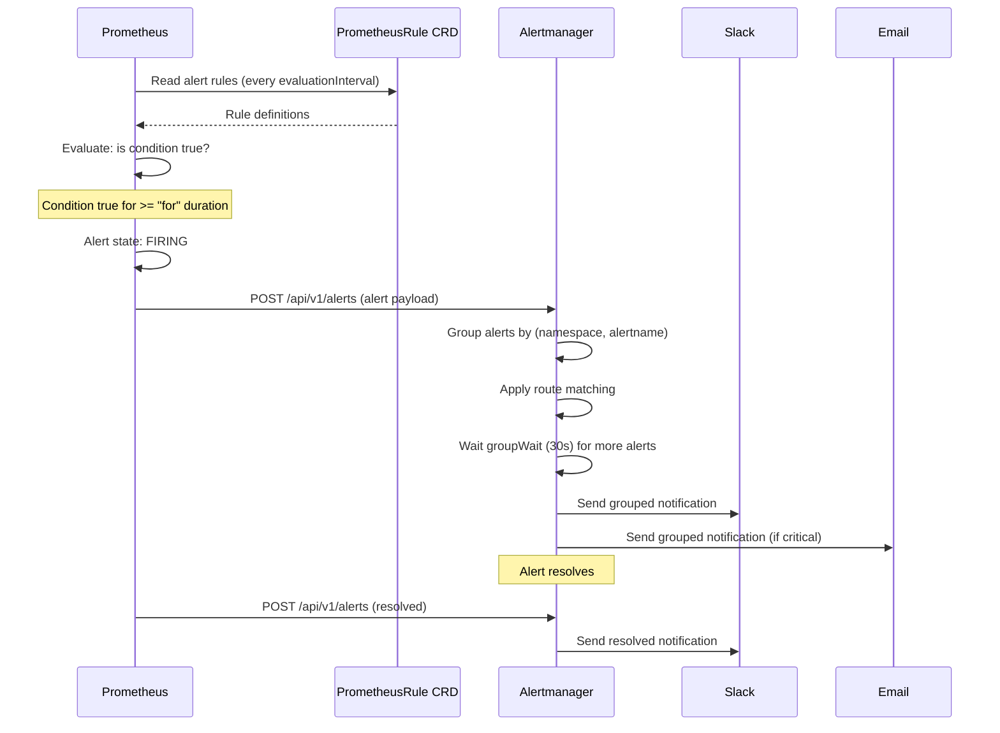
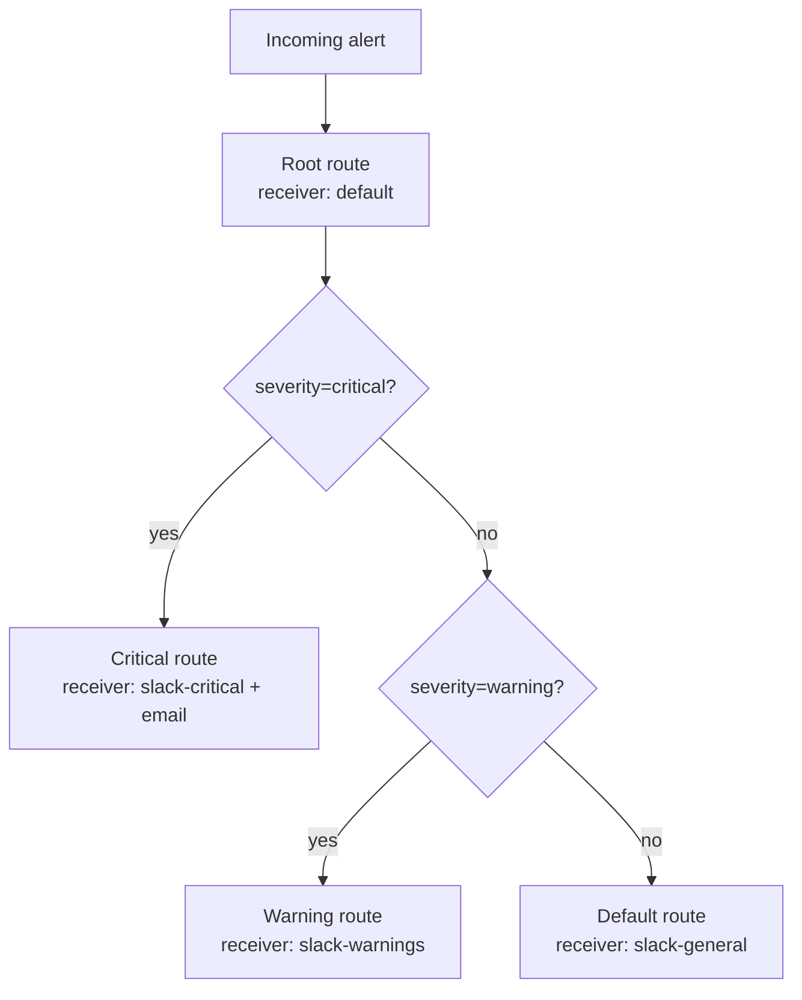

# Alerting
> Module 10 · Lesson 03 | [↑ Course Index](../README.md)

## Table of Contents
- [Overview](#overview)
- [PrometheusRule CRD](#prometheusrule-crd)
- [Alert Rule Examples](#alert-rule-examples)
- [Alertmanager Concepts](#alertmanager-concepts)
- [Alertmanager Configuration](#alertmanager-configuration)
- [Slack and Email Receivers](#slack-and-email-receivers)
- [Silences and Inhibitions](#silences-and-inhibitions)
- [Testing Alerts](#testing-alerts)
- [Alert Fatigue Best Practices](#alert-fatigue-best-practices)
- [Lab](#lab)

---

## Overview

Alerting in the kube-prometheus-stack involves two components:

1. **Prometheus** — evaluates alert rules against collected metrics; when a condition fires it sends an alert to Alertmanager.
2. **Alertmanager** — receives alerts, deduplicates them, groups related alerts together, applies routing rules, and delivers notifications to receivers (Slack, email, PagerDuty, etc.).



[↑ Back to TOC](#table-of-contents) · [↑ Course Index](../README.md)

---

## PrometheusRule CRD

`PrometheusRule` is a CRD provided by the Prometheus Operator. It allows you to define alert rules and recording rules as Kubernetes objects — no manual `prometheus.yml` editing required.

### Basic structure

```yaml
apiVersion: monitoring.coreos.com/v1
kind: PrometheusRule
metadata:
  name: my-alert-rules
  namespace: monitoring
  labels:
    release: kube-prometheus-stack   # REQUIRED — must match Prometheus ruleSelector
spec:
  groups:
    - name: group-name             # logical grouping
      interval: 1m                 # evaluation interval (overrides global)
      rules:
        - alert: AlertName         # alert rules
          expr: <promql>
          for: 5m                  # must be true for this duration before firing
          labels:
            severity: warning      # custom labels attached to the alert
          annotations:
            summary: "Short description"
            description: "Detailed description with {{ $value | humanize }}"

        - record: recorded:metric:name   # recording rules (no "alert" field)
          expr: <promql>
```

### Label matching

The `Prometheus` CRD has a `ruleSelector`. Ensure your PrometheusRule has matching labels:

```bash
kubectl get prometheus -n monitoring kube-prometheus-stack-prometheus \
  -o jsonpath='{.spec.ruleSelector}'
# Output: {"matchLabels":{"release":"kube-prometheus-stack"}}
```

[↑ Back to TOC](#table-of-contents) · [↑ Course Index](../README.md)

---

## Alert Rule Examples

### High CPU usage

```yaml
- alert: HighNodeCPUUsage
  expr: |
    100 - (
      avg by (instance) (
        rate(node_cpu_seconds_total{mode="idle"}[5m])
      ) * 100
    ) > 80
  for: 5m
  labels:
    severity: warning
  annotations:
    summary: "High CPU usage on {{ $labels.instance }}"
    description: >
      Node {{ $labels.instance }} CPU usage is {{ $value | humanize }}%
      (threshold: 80%). Sustained for 5 minutes.
    runbook: "https://wiki.example.com/runbooks/high-cpu"
```

### Pod crashlooping

```yaml
- alert: PodCrashLooping
  expr: |
    rate(kube_pod_container_status_restarts_total[15m]) * 60 * 15 > 3
  for: 5m
  labels:
    severity: critical
  annotations:
    summary: "Pod {{ $labels.namespace }}/{{ $labels.pod }} is crashlooping"
    description: >
      Container {{ $labels.container }} in pod {{ $labels.pod }}
      (namespace {{ $labels.namespace }}) has restarted
      {{ $value | humanize }} times in the last 15 minutes.
```

### Disk usage high

```yaml
- alert: NodeDiskUsageHigh
  expr: |
    (
      node_filesystem_size_bytes{fstype!~"tmpfs|overlay|squashfs"}
      - node_filesystem_free_bytes{fstype!~"tmpfs|overlay|squashfs"}
    )
    /
    node_filesystem_size_bytes{fstype!~"tmpfs|overlay|squashfs"}
    * 100 > 85
  for: 5m
  labels:
    severity: warning
  annotations:
    summary: "Disk {{ $labels.device }} on {{ $labels.instance }} is {{ $value | humanize }}% full"
    description: >
      Filesystem {{ $labels.mountpoint }} on {{ $labels.instance }}
      is {{ $value | humanize }}% full. Device: {{ $labels.device }}.
```

### Memory pressure

```yaml
- alert: NodeMemoryPressure
  expr: |
    (
      node_memory_MemAvailable_bytes /
      node_memory_MemTotal_bytes
    ) * 100 < 10
  for: 2m
  labels:
    severity: critical
  annotations:
    summary: "Low memory on {{ $labels.instance }}"
    description: >
      Node {{ $labels.instance }} has only {{ $value | humanize }}%
      memory available (less than 10%).
```

### Deployment not fully available

```yaml
- alert: DeploymentNotAvailable
  expr: |
    kube_deployment_status_replicas_available
    /
    kube_deployment_spec_replicas < 0.5
  for: 5m
  labels:
    severity: critical
  annotations:
    summary: "Deployment {{ $labels.namespace }}/{{ $labels.deployment }} has fewer than 50% replicas"
    description: >
      Deployment {{ $labels.deployment }} in namespace {{ $labels.namespace }}
      has {{ $value | humanizePercentage }} of desired replicas available.
```

[↑ Back to TOC](#table-of-contents) · [↑ Course Index](../README.md)

---

## Alertmanager Concepts

### Routes

Routes define a tree of matchers. Alertmanager walks the tree top-to-bottom and routes each alert to the first matching node (or all matching nodes if `continue: true`).



### Receivers

Receivers define where to send notifications: Slack, email, PagerDuty, OpsGenie, webhook, etc.

### Groups

Alertmanager groups related alerts together before sending. Grouping reduces notification spam when many alerts fire simultaneously (e.g., a node goes down and 30 pod alerts fire at once).

```yaml
route:
  group_by: [namespace, alertname]   # group alerts with same namespace + alertname
  group_wait: 30s                    # wait 30s for more alerts before first notification
  group_interval: 5m                 # wait 5m between notifications for ongoing group
  repeat_interval: 4h                # re-notify after 4h if alert still firing
```

### Inhibitions

An inhibition rule **suppresses** one alert when another is already firing. Example: suppress all `warning` alerts for a namespace when a `critical` alert is firing for the same namespace.

```yaml
inhibit_rules:
  - source_match:
      severity: critical
    target_match:
      severity: warning
    equal: [namespace, alertname]
```

[↑ Back to TOC](#table-of-contents) · [↑ Course Index](../README.md)

---

## Alertmanager Configuration

Alertmanager configuration is stored in a Kubernetes Secret. The Prometheus Operator reconciles an `AlertmanagerConfig` CRD (namespace-scoped) or the global `alertmanager.yaml` secret.

### Global alertmanager.yaml secret

```yaml
apiVersion: v1
kind: Secret
metadata:
  name: alertmanager-kube-prometheus-stack-alertmanager
  namespace: monitoring
type: Opaque
stringData:
  alertmanager.yaml: |
    global:
      resolve_timeout: 5m
      slack_api_url: "https://hooks.slack.com/services/PLACEHOLDER"
      smtp_smarthost: "smtp.example.com:587"
      smtp_from: "alertmanager@example.com"
      smtp_auth_username: "alertmanager@example.com"
      smtp_auth_password: "SMTP_PASSWORD_PLACEHOLDER"
      smtp_require_tls: true

    route:
      receiver: slack-warnings
      group_by: [namespace, alertname, severity]
      group_wait: 30s
      group_interval: 5m
      repeat_interval: 4h
      routes:
        - matchers:
            - severity =~ "critical"
          receiver: pagerduty-critical
          continue: true
        - matchers:
            - severity = "critical"
          receiver: email-critical

    receivers:
      - name: slack-warnings
        slack_configs:
          - channel: "#alerts"
            send_resolved: true
            title: '{{ template "slack.default.title" . }}'
            text: '{{ template "slack.default.text" . }}'

      - name: pagerduty-critical
        slack_configs:
          - channel: "#alerts-critical"
            send_resolved: true

      - name: email-critical
        email_configs:
          - to: "oncall@example.com"
            send_resolved: true

    inhibit_rules:
      - source_matchers:
          - severity = "critical"
        target_matchers:
          - severity = "warning"
        equal: [namespace, alertname]
```

[↑ Back to TOC](#table-of-contents) · [↑ Course Index](../README.md)

---

## Slack and Email Receivers

### Slack receiver — full example

```yaml
receivers:
  - name: slack-critical
    slack_configs:
      - api_url: "https://hooks.slack.com/services/T.../B.../..."
        channel: "#alerts-critical"
        username: "Alertmanager"
        icon_emoji: ":fire:"
        send_resolved: true
        title: |
          [{{ .Status | toUpper }}{{ if eq .Status "firing" }}:{{ .Alerts.Firing | len }}{{ end }}]
          {{ .CommonLabels.alertname }}
        text: |
          {{ range .Alerts }}
          *Alert:* {{ .Annotations.summary }}
          *Severity:* {{ .Labels.severity }}
          *Namespace:* {{ .Labels.namespace }}
          *Description:* {{ .Annotations.description }}
          {{ if .Annotations.runbook }}*Runbook:* {{ .Annotations.runbook }}{{ end }}
          {{ end }}
        actions:
          - type: button
            text: "View in Grafana"
            url: "https://grafana.example.com/d/kubernetes-cluster"
```

### Email receiver — full example

```yaml
receivers:
  - name: email-critical
    email_configs:
      - to: "oncall@example.com, team-lead@example.com"
        from: "alertmanager@example.com"
        smarthost: "smtp.gmail.com:587"
        auth_username: "alertmanager@example.com"
        auth_identity: "alertmanager@example.com"
        auth_password: "APP_PASSWORD_PLACEHOLDER"
        send_resolved: true
        html: |
          <h2>{{ .Status | title }}</h2>
          {{ range .Alerts }}
          <p><b>{{ .Annotations.summary }}</b></p>
          <p>{{ .Annotations.description }}</p>
          {{ end }}
```

### Webhook receiver (generic)

```yaml
receivers:
  - name: webhook-generic
    webhook_configs:
      - url: "https://webhook.example.com/alertmanager"
        send_resolved: true
        http_config:
          bearer_token: "TOKEN_PLACEHOLDER"
```

[↑ Back to TOC](#table-of-contents) · [↑ Course Index](../README.md)

---

## Silences and Inhibitions

### Silences

A silence **mutes** alerts for a defined time window. Useful during planned maintenance.

**Via the Alertmanager UI:**

1. Open Alertmanager UI (`http://localhost:9093` via port-forward or NodePort).
2. Click **Silences** → **Create Silence**.
3. Set matchers (e.g., `namespace=production`), duration, and a comment.
4. Click **Create**.

**Via the amtool CLI:**

```bash
# Install amtool
# brew install prometheus/brew/amtool  # macOS
# or download from GitHub releases

# Create a 4-hour silence for all alerts in namespace production
amtool silence add \
  --alertmanager.url=http://localhost:9093 \
  --duration=4h \
  --comment="Planned maintenance window" \
  namespace=production

# List active silences
amtool silence query --alertmanager.url=http://localhost:9093

# Expire (delete) a silence
amtool silence expire --alertmanager.url=http://localhost:9093 <silence-id>
```

**Via kubectl (temporary silence as a YAML):**

Alertmanager doesn't natively use CRDs for silences — use the UI or amtool.

### Inhibitions — production patterns

| Pattern | Source alert | Suppresses |
|---|---|---|
| Critical overrides warning | `severity=critical` | `severity=warning` (same namespace + alertname) |
| Node down overrides pod alerts | `NodeDown` | `PodCrashLooping`, `HighCPU` (same node) |
| Maintenance mode | `MaintenanceMode` | All alerts (same namespace) |

```yaml
inhibit_rules:
  # Pattern 1: Critical overrides warning
  - source_matchers:
      - severity = "critical"
    target_matchers:
      - severity = "warning"
    equal: [namespace, alertname]

  # Pattern 2: Node down overrides pod-level alerts
  - source_matchers:
      - alertname = "NodeDown"
    target_matchers:
      - alertname =~ "Pod.*|Container.*"
    equal: [node]
```

[↑ Back to TOC](#table-of-contents) · [↑ Course Index](../README.md)

---

## Testing Alerts

### Method 1: Check rule evaluation in Prometheus UI

1. Port-forward Prometheus: `kubectl port-forward -n monitoring svc/kube-prometheus-stack-prometheus 9090:9090`.
2. Go to `http://localhost:9090/alerts`.
3. Verify your rules are listed. Rules show as `inactive`, `pending`, or `firing`.

### Method 2: Force an alert to fire (test environment only)

Artificially spike CPU to trigger `HighNodeCPUUsage`:

```bash
# Run a CPU-intensive job
kubectl run cpu-stress --image=busybox --restart=Never -- \
  sh -c "while true; do :; done"

# After ~5 minutes, check Prometheus /alerts for FIRING state
# Clean up
kubectl delete pod cpu-stress
```

### Method 3: amtool check-config

```bash
# Validate alertmanager config syntax
amtool check-config /path/to/alertmanager.yaml
```

### Method 4: promtool check rules

```bash
# Validate PrometheusRule syntax
promtool check rules /path/to/rules.yaml

# Example output:
# Checking /path/to/rules.yaml
#   SUCCESS: 5 rules found
```

### Method 5: Alertmanager test notification

In the Alertmanager web UI, go to **Status** → **Send Test Notification** (if configured) or use the API:

```bash
# Send a test alert to Alertmanager
curl -X POST http://localhost:9093/api/v1/alerts \
  -H "Content-Type: application/json" \
  -d '[{
    "labels": {
      "alertname": "TestAlert",
      "severity": "warning",
      "namespace": "default"
    },
    "annotations": {
      "summary": "This is a test alert",
      "description": "Testing Alertmanager configuration"
    },
    "startsAt": "2026-01-01T00:00:00Z"
  }]'
```

[↑ Back to TOC](#table-of-contents) · [↑ Course Index](../README.md)

---

## Alert Fatigue Best Practices

Alert fatigue occurs when too many low-quality alerts are sent, causing the team to start ignoring notifications. This is one of the most common operational failures.

### The golden rules

| Rule | Detail |
|---|---|
| **Every alert must be actionable** | If you cannot act on the alert, it is noise. Delete it or make it a dashboard panel instead. |
| **Use the `for` duration** | Never set `for: 0s`. Always require the condition to be sustained before alerting. |
| **Alert on symptoms, not causes** | Alert on "users can't reach the service", not "CPU is high". |
| **Tier your severities** | Use `critical` (page immediately), `warning` (check soon), `info` (for dashboards only). |
| **Write runbooks** | Every alert `annotations` should include a `runbook` URL. |
| **Review alerts quarterly** | Delete or downgrade any alert that fired but no action was taken. |

### Severity tier definitions

```yaml
# CRITICAL — wake someone up NOW
# - User-facing service is down
# - Data loss is imminent
# - SLA breach within minutes

# WARNING — check within business hours
# - Performance degradation
# - Resource usage trending toward a limit
# - Non-critical components degraded

# INFO — never pages; used in dashboards only
# - Informational events (deployments, restarts)
```

### Reducing default kube-prometheus-stack noise

The chart ships with many default alerts, some of which are not appropriate for all environments. Disable specific groups:

```yaml
defaultRules:
  rules:
    etcd: false                  # not applicable for k3s embedded etcd
    kubeApiserver: false         # sometimes too noisy on small clusters
    kubeControllerManager: false # not exposed in k3s
    kubeScheduler: false         # not exposed in k3s
  disabled:
    KubeAPIErrorsHigh: true      # too noisy on small clusters
    KubeClientErrors: true
```

### Alert deduplication with Alertmanager

Use `group_by` carefully. Over-grouping hides related issues; under-grouping creates notification storms:

```yaml
route:
  # Good: group by namespace + alertname + severity
  group_by: [namespace, alertname, severity]
  group_wait: 30s
  group_interval: 5m
  repeat_interval: 6h   # don't re-notify more often than every 6 hours
```

[↑ Back to TOC](#table-of-contents) · [↑ Course Index](../README.md)

---

## Lab

```bash
# 1. Apply the PrometheusRule from labs/alertmanager-config.yaml
kubectl apply -f labs/alertmanager-config.yaml

# 2. Verify the rule is loaded in Prometheus
kubectl port-forward -n monitoring svc/kube-prometheus-stack-prometheus 9090:9090 &
# Visit http://localhost:9090/rules — find "k3s-custom-rules" group

# 3. Verify Alertmanager
kubectl port-forward -n monitoring svc/kube-prometheus-stack-alertmanager 9093:9093 &
# Visit http://localhost:9093

# 4. Send a test alert
curl -X POST http://localhost:9093/api/v1/alerts \
  -H "Content-Type: application/json" \
  -d '[{
    "labels": {
      "alertname": "TestAlert",
      "severity": "warning",
      "namespace": "default"
    },
    "annotations": {
      "summary": "Lab test alert",
      "description": "Verifying Alertmanager routing"
    },
    "startsAt": "'$(date -u +%Y-%m-%dT%H:%M:%SZ)'"
  }]'

# 5. Check the alert appears in the Alertmanager UI at http://localhost:9093

# 6. Create a silence for the test alert
#    In the UI: Silences → Create Silence
#    Matcher: alertname = TestAlert
#    Duration: 1h
```

[↑ Back to TOC](#table-of-contents) · [↑ Course Index](../README.md)

---

*Licensed under [CC BY-NC-SA 4.0](../LICENSE.md) · © 2026 UncleJS*
