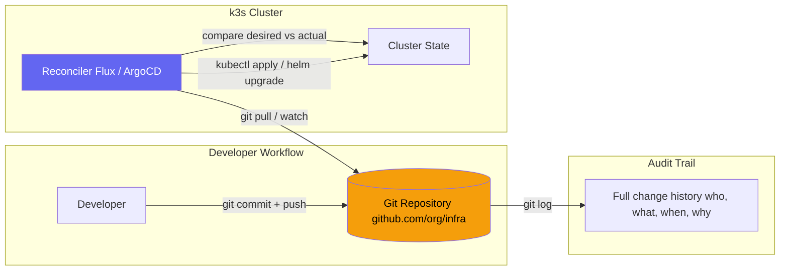
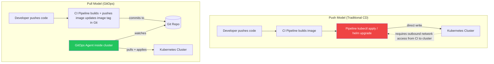
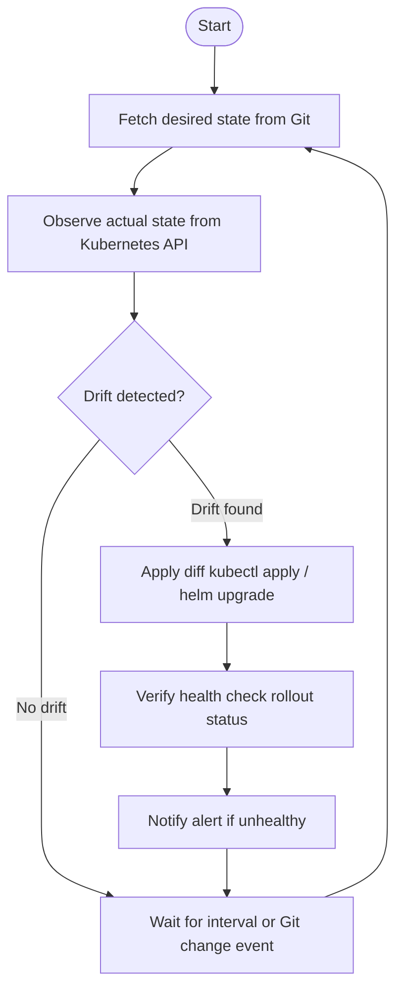
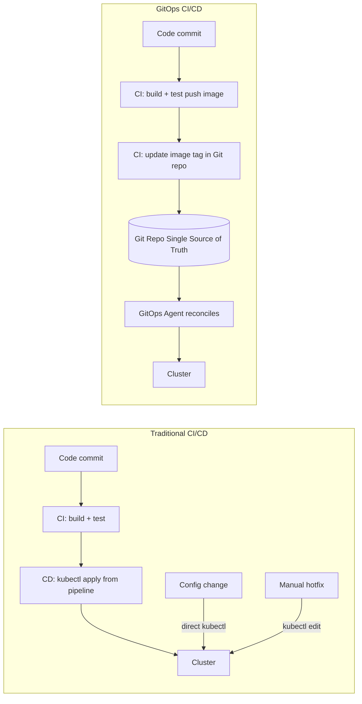

# GitOps Concepts
> Module 11 · Lesson 01 | [↑ Course Index](../README.md)

## Table of Contents
- [Overview](#overview)
- [What is GitOps?](#what-is-gitops)
- [The Four Principles](#the-four-principles)
- [Pull vs Push Deployments](#pull-vs-push-deployments)
- [The Reconciliation Loop](#the-reconciliation-loop)
- [GitOps vs Traditional CD](#gitops-vs-traditional-cd)
- [Benefits of GitOps](#benefits-of-gitops)
- [Trade-offs and Limitations](#trade-offs-and-limitations)
- [GitOps Tooling Landscape](#gitops-tooling-landscape)

---

## Overview

GitOps is an operational model that uses Git repositories as the single source of truth for declarative infrastructure and application configuration. Instead of running `kubectl apply` or `helm upgrade` from a CI/CD pipeline, a **reconciler** running inside the cluster continuously compares the desired state in Git with the actual state in the cluster and applies any differences.

[↑ Back to TOC](#table-of-contents) · [↑ Course Index](../README.md)

---

## What is GitOps?

GitOps was coined by Weaveworks in 2017 and has since become a CNCF-recognized practice. At its core:

> **Git is the single source of truth. The cluster converges to whatever is in Git.**



Key insight: **there is no manual `kubectl apply` or pipeline step that touches the cluster**. The reconciler is the only actor that modifies cluster state, and it does so only in response to changes in Git.

[↑ Back to TOC](#table-of-contents) · [↑ Course Index](../README.md)

---

## The Four Principles

The CNCF GitOps Working Group defines GitOps around four core principles:

### 1. Declarative

The entire system is described **declaratively**. You describe *what* the system should look like, not *how* to get there. Kubernetes YAML, Helm charts, and Kustomize overlays are all declarative.

```yaml
# Declarative: "I want 3 replicas of nginx running"
spec:
  replicas: 3
  template:
    spec:
      containers:
        - name: nginx
          image: nginx:1.25.3
```

### 2. Versioned and Immutable

The desired state is stored in a system that enforces **immutability and versioning**. Git's content-addressed storage means every commit is a snapshot with a unique SHA. You can always see what the cluster looked like at any point in the past, and roll back to any previous state with `git revert`.

### 3. Pulled Automatically

Software agents automatically **pull** the desired state from the source. You do not push configuration directly to the cluster. This means:
- The cluster never needs to be directly accessible from the CI/CD system.
- Network firewalls only need to allow outbound connections from the cluster to Git.

### 4. Continuously Reconciled

Software agents **continuously observe** the actual cluster state and attempt to match it to the desired state. If someone runs `kubectl delete deployment nginx` manually, the reconciler will recreate it within seconds. This is **self-healing**.

[↑ Back to TOC](#table-of-contents) · [↑ Course Index](../README.md)

---

## Pull vs Push Deployments



| Aspect | Push (Traditional) | Pull (GitOps) |
|---|---|---|
| **Who applies changes** | CI/CD pipeline (external) | Agent inside the cluster |
| **Cluster network exposure** | Cluster API must be reachable from CI | Cluster only needs outbound Git access |
| **Drift detection** | None — pipeline is fire-and-forget | Continuous — agent reconciles every N seconds |
| **Audit trail** | CI logs (may be ephemeral) | Git commit history (permanent) |
| **Rollback** | Re-run pipeline with old version | `git revert` + push |
| **Secrets handling** | Injected by pipeline | Must be in Git (encrypted) or from external vault |

[↑ Back to TOC](#table-of-contents) · [↑ Course Index](../README.md)

---

## The Reconciliation Loop

The reconciler runs a continuous control loop:



### Reconciliation interval

Both Flux and ArgoCD support configurable reconciliation intervals:

| Interval | Trade-off |
|---|---|
| 30s | Fastest convergence, more Git API calls |
| 1m (Flux default) | Good balance for most clusters |
| 5m | Reduces load, slower drift correction |
| On-demand (webhook) | Instant on push, no polling overhead |

**Webhook-triggered reconciliation** is strongly recommended in production — the reconciler watches a Git webhook and reconciles immediately on push, rather than waiting for the poll interval.

[↑ Back to TOC](#table-of-contents) · [↑ Course Index](../README.md)

---

## GitOps vs Traditional CD



### Key difference: CI vs CD separation

In GitOps, **CI** (Continuous Integration) still builds, tests, and pushes container images. The change in model is in the **CD** (Continuous Delivery) step:

- **Traditional CD:** Pipeline applies changes directly to the cluster.
- **GitOps CD:** Pipeline commits the new image tag to the Git repository. The agent picks it up and applies it.

This means:
1. The CI pipeline does not need `kubectl` access to the cluster.
2. The cluster's state is always reflected in Git — you can reconstruct any cluster from scratch.
3. Every change to the cluster (deployment update, config change, secret rotation) goes through a Git commit with a diff, author, and timestamp.

[↑ Back to TOC](#table-of-contents) · [↑ Course Index](../README.md)

---

## Benefits of GitOps

### Auditability and compliance

Every change to the cluster is a Git commit. You can answer:
- "Who deployed version 2.3.1 to production?"
- "What changed between this incident and the last stable state?"
- "Has anyone modified the cluster outside of the approved process?"

### Disaster recovery

With GitOps, rebuilding a cluster from scratch is straightforward:

```bash
# Point a new cluster at the same Git repo
flux bootstrap github --owner=my-org --repository=infra --path=clusters/production
# Within minutes, all workloads are restored to the last committed state
```

### Rollback as a first-class operation

```bash
git revert HEAD
git push
# The GitOps agent detects the revert and rolls back the cluster automatically
```

### Reduced blast radius

Since the CI pipeline does not have direct cluster access, a compromised CI environment cannot directly modify production. An attacker would need to compromise both the CI system AND the Git repository (which can require code review approvals).

### Developer self-service

Teams can deploy to their namespaces by submitting pull requests to the infra repository. Platform teams review and merge — no need to manage individual kubeconfig files or RBAC for each developer.

[↑ Back to TOC](#table-of-contents) · [↑ Course Index](../README.md)

---

## Trade-offs and Limitations

GitOps is not a silver bullet. Understand these trade-offs before adopting it:

| Challenge | Detail |
|---|---|
| **Secrets in Git** | You cannot store plaintext secrets in Git. Requires tooling: Sealed Secrets, SOPS, or an external vault (HashiCorp Vault, AWS SSM). This adds complexity. |
| **Bootstrapping chicken-and-egg** | To install the GitOps agent, you need to interact with the cluster directly at least once. |
| **Debugging complexity** | When a deployment fails, the error may be in Git, the reconciler, or the cluster. Multiple layers to investigate. |
| **Not suitable for one-off tasks** | `kubectl exec`, database migrations, `kubectl debug` — these are imperative operations that don't fit the GitOps model. |
| **Slow feedback loop** | Changes must be committed and pushed, then the agent must reconcile before the developer sees the result. Port-forward and local testing remain important during development. |
| **Repo structure discipline required** | Teams must agree on directory layouts, branching strategies, and PR workflows. Without discipline, the repo becomes hard to maintain. |
| **Stateful workloads** | Database schema migrations and stateful data don't version well in Git. GitOps manages the *deployment* but not the *data*. |

[↑ Back to TOC](#table-of-contents) · [↑ Course Index](../README.md)

---

## GitOps Tooling Landscape

| Tool | Model | Strengths |
|---|---|---|
| **Flux v2** | Pull — lightweight controllers | CNCF graduated, modular, Helm native, no UI required |
| **ArgoCD** | Pull — rich UI + API | Excellent Web UI, multi-cluster, ApplicationSets |
| **Rancher Fleet** | Pull — multi-cluster focus | Built into Rancher, scales to thousands of clusters |
| **Jenkins X** | Hybrid | Opinionated full CI/CD platform |

Modules 11.02 and 11.03 cover Flux v2 and ArgoCD respectively — the two most widely adopted tools.

[↑ Back to TOC](#table-of-contents) · [↑ Course Index](../README.md)

---

*Licensed under [CC BY-NC-SA 4.0](../LICENSE.md) · © 2026 UncleJS*
