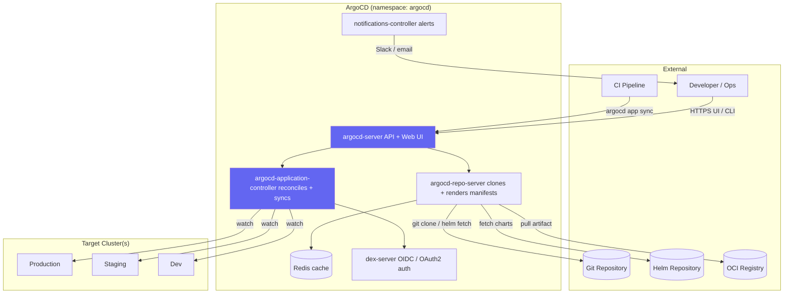

# ArgoCD Install and Setup
> Module 11 · Lesson 03 | [↑ Course Index](../README.md)


[](../README.md)
[](../LICENSE.md)

## Table of Contents
- [Overview](#overview)
- [ArgoCD Architecture](#argocd-architecture)
- [Installing ArgoCD via Helm](#installing-argocd-via-helm)
- [Accessing the UI](#accessing-the-ui)
- [Initial Admin Password](#initial-admin-password)
- [Creating an Application via the UI](#creating-an-application-via-the-ui)
- [Creating an Application via YAML](#creating-an-application-via-yaml)
- [Sync Policies](#sync-policies)
- [App Health and Sync Status](#app-health-and-sync-status)
- [Useful argocd CLI Commands](#useful-argocd-cli-commands)
- [Lab](#lab)

---

## Overview

ArgoCD is a declarative, GitOps continuous delivery tool for Kubernetes. It is part of the CNCF ecosystem and distinguishes itself from Flux with a feature-rich Web UI, powerful multi-cluster management, and role-based access control for application delivery teams.

[↑ Back to TOC](#table-of-contents) · [↑ Course Index](../README.md)

---

## ArgoCD Architecture



### Components

| Component | Purpose |
|---|---|
| **argocd-server** | Serves the Web UI and API. Used by the `argocd` CLI and CI integrations. |
| **argocd-repo-server** | Clones Git repositories, renders Helm/Kustomize manifests, and caches results in Redis. |
| **argocd-application-controller** | Watches Application resources, compares desired (Git) vs live (cluster) state, and syncs on demand or automatically. |
| **dex-server** | OpenID Connect (OIDC) provider for SSO integration (GitHub, GitLab, LDAP). |
| **notifications-controller** | Sends notifications (Slack, email, GitHub commit status) on sync events. |

[↑ Back to TOC](#table-of-contents) · [↑ Course Index](../README.md)

---

## Installing ArgoCD via Helm

### Add the Helm repo

```bash
helm repo add argo https://argoproj.github.io/argo-helm
helm repo update
```

### Create the namespace

```bash
kubectl create namespace argocd
```

### Install

```bash
helm install argocd argo/argo-cd \
  --namespace argocd \
  # pin a version
  --version 6.7.x \
  --set server.service.type=NodePort \
  --set server.service.nodePortHttp=30080 \
  --set server.service.nodePortHttps=30443
```

Or with a values file:

```yaml
# argocd-values.yaml
server:
  service:
    type: NodePort
    nodePortHttp: 30080
    nodePortHttps: 30443
  resources:
    requests:
      cpu: 50m
      memory: 128Mi
    limits:
      cpu: 500m
      memory: 256Mi
  extraArgs:
    - --insecure   # disable TLS termination at argocd-server (let Traefik handle it)

repoServer:
  resources:
    requests:
      cpu: 50m
      memory: 128Mi
    limits:
      cpu: 500m
      memory: 256Mi

applicationSet:
  resources:
    requests:
      cpu: 20m
      memory: 64Mi
    limits:
      cpu: 200m
      memory: 128Mi

controller:
  resources:
    requests:
      cpu: 100m
      memory: 256Mi
    limits:
      cpu: 1000m
      memory: 512Mi

redis:
  resources:
    requests:
      cpu: 20m
      memory: 32Mi
    limits:
      cpu: 100m
      memory: 64Mi
```

```bash
helm install argocd argo/argo-cd \
  --namespace argocd \
  --values argocd-values.yaml
```

### Verify

```bash
kubectl get pods -n argocd
# NAME                                              READY   STATUS    RESTARTS
# argocd-server-xxxx                                1/1     Running   0
# argocd-repo-server-xxxx                           1/1     Running   0
# argocd-application-controller-0                   1/1     Running   0
# argocd-notifications-controller-xxxx              1/1     Running   0
# argocd-dex-server-xxxx                            1/1     Running   0
# argocd-redis-xxxx                                 1/1     Running   0
```

[↑ Back to TOC](#table-of-contents) · [↑ Course Index](../README.md)

---

## Accessing the UI

### Port-forward (quick access)

```bash
kubectl port-forward svc/argocd-server -n argocd 8080:443
# Access at https://localhost:8080 (self-signed cert warning is expected)
```

### NodePort access

If you set `server.service.type=NodePort`:

```
https://<node-ip>:30443
```

### Expose via Traefik IngressRoute

```yaml
apiVersion: traefik.io/v1alpha1
kind: IngressRoute
metadata:
  name: argocd
  namespace: argocd
spec:
  entryPoints:
    - websecure
  routes:
    - match: Host(`argocd.example.com`)
      kind: Rule
      services:
        - name: argocd-server
          port: 80          # use port 80 if argocd-server runs with --insecure
  tls:
    certResolver: letsencrypt
```

> Set `server.extraArgs: ["--insecure"]` when TLS is terminated at the ingress layer.

### Standard Kubernetes Ingress

```yaml
apiVersion: networking.k8s.io/v1
kind: Ingress
metadata:
  name: argocd-server
  namespace: argocd
  annotations:
    traefik.ingress.kubernetes.io/router.entrypoints: websecure
    traefik.ingress.kubernetes.io/router.tls: "true"
    cert-manager.io/cluster-issuer: letsencrypt-prod
    nginx.ingress.kubernetes.io/ssl-passthrough: "true"   # if using nginx
spec:
  ingressClassName: traefik
  tls:
    - hosts:
        - argocd.example.com
      secretName: argocd-server-tls
  rules:
    - host: argocd.example.com
      http:
        paths:
          - path: /
            pathType: Prefix
            backend:
              service:
                name: argocd-server
                port:
                  number: 80
```

[↑ Back to TOC](#table-of-contents) · [↑ Course Index](../README.md)

---

## Initial Admin Password

ArgoCD auto-generates an initial admin password and stores it in a Secret:

```bash
# Get the initial admin password
kubectl get secret argocd-initial-admin-secret \
  -n argocd \
  -o jsonpath="{.data.password}" | base64 --decode
echo   # add newline
```

Login with username `admin` and the decoded password.

### Change the password

After first login, change the password via the CLI:

```bash
# Login first
argocd login localhost:8080 \
  --username admin \
  --password $(kubectl get secret argocd-initial-admin-secret -n argocd -o jsonpath="{.data.password}" | base64 -d) \
  --insecure

# Update password
argocd account update-password \
  --current-password $(kubectl get secret argocd-initial-admin-secret -n argocd -o jsonpath="{.data.password}" | base64 -d) \
  --new-password "new-secure-password-here"

# Delete the initial password secret
kubectl delete secret argocd-initial-admin-secret -n argocd
```

[↑ Back to TOC](#table-of-contents) · [↑ Course Index](../README.md)

---

## Creating an Application via the UI

1. Click **+ NEW APP** in the top left of the ArgoCD UI.
2. Fill in the form:

| Field | Value |
|---|---|
| **Application Name** | `nginx-demo` |
| **Project** | `default` |
| **Sync Policy** | `Automatic` (or Manual) |
| **Repository URL** | `https://github.com/your-org/your-repo` |
| **Revision** | `HEAD` |
| **Path** | `deploy/nginx` |
| **Cluster** | `https://kubernetes.default.svc` (in-cluster) |
| **Namespace** | `default` |

3. Click **CREATE**.
4. ArgoCD fetches the manifests, shows a **diff**, and syncs if automated.
5. Click into the application to see the resource graph.

[↑ Back to TOC](#table-of-contents) · [↑ Course Index](../README.md)

---

## Creating an Application via YAML

```yaml
apiVersion: argoproj.io/v1alpha1
kind: Application
metadata:
  name: nginx-demo
  namespace: argocd
  # Finalizer ensures ArgoCD deletes managed resources when the Application is deleted
  finalizers:
    - resources-finalizer.argocd.argoproj.io
spec:
  project: default

  # ---- Source: where to get the manifests from ----
  source:
    repoURL: https://github.com/my-org/my-infra-repo
    targetRevision: main
    path: deploy/nginx

  # Alternative: Helm chart source
  # source:
  #   repoURL: https://charts.nginx.com/stable
  #   chart: nginx-ingress
  #   targetRevision: "0.18.x"
  #   helm:
  #     values: |
  #       controller:
  #         replicaCount: 2

  # ---- Destination: where to deploy ----
  destination:
    server: https://kubernetes.default.svc   # in-cluster
    namespace: default

  # ---- Sync policy ----
  syncPolicy:
    automated:
      prune: true        # delete resources removed from Git
      selfHeal: true     # re-sync if cluster state drifts from Git
      allowEmpty: false  # never sync an empty set of resources
    syncOptions:
      - CreateNamespace=true     # create destination namespace if missing
      - PrunePropagationPolicy=foreground
      - PruneLast=true           # delete removed resources last (safer)
    retry:
      limit: 5
      backoff:
        duration: 5s
        factor: 2
        maxDuration: 3m

  # ---- Health ignore rules ----
  ignoreDifferences:
    - group: apps
      kind: Deployment
      jsonPointers:
        - /spec/replicas   # ignore manual replica scaling
```

Apply:

```bash
kubectl apply -f my-application.yaml
```

[↑ Back to TOC](#table-of-contents) · [↑ Course Index](../README.md)

---

## Sync Policies

### Manual sync

The application is not synced automatically. You trigger sync via:
- ArgoCD UI → click **SYNC**
- `argocd app sync nginx-demo`
- A webhook event

Use manual sync when:
- You want human approval before deploying to production.
- You are deploying stateful workloads that need careful ordering.

### Automated sync

```yaml
syncPolicy:
  automated:
    prune: true       # IMPORTANT: without this, deleted resources are never removed
    selfHeal: true    # re-sync if someone manually modifies the cluster
```

With `automated`, ArgoCD syncs:
- When a new commit is pushed to the source repository.
- When drift is detected (with `selfHeal: true`).
- Every 3 minutes as a fallback poll (configurable).

### `prune: true` — important consideration

Without `prune: true`, if you delete a resource from Git, it **remains in the cluster**. Always enable prune unless you have a specific reason not to.

### `selfHeal: true` — important consideration

With `selfHeal: true`, **any manual change to the cluster is immediately reverted**. This is the true GitOps model but can surprise operators who are used to ad-hoc `kubectl edit`. Only enable in environments where Git is truly the single source of truth.

[↑ Back to TOC](#table-of-contents) · [↑ Course Index](../README.md)

---

## App Health and Sync Status

### Sync status

| Status | Meaning |
|---|---|
| **Synced** | Cluster state matches Git |
| **OutOfSync** | Diff detected between Git and cluster |
| **Unknown** | Cannot determine (usually a permissions issue) |

### Health status

| Status | Meaning |
|---|---|
| **Healthy** | All resources pass health checks (Deployments ready, Services up, etc.) |
| **Progressing** | Resources are being created or updated |
| **Degraded** | Resources failed health check (e.g., Deployment not available) |
| **Suspended** | Sync is suspended |
| **Missing** | Resources defined in Git do not exist in the cluster |
| **Unknown** | Health cannot be determined |

### Resource-level health

ArgoCD has built-in health checks for common resource types:
- `Deployment` — checks `status.availableReplicas >= spec.replicas`
- `StatefulSet` — checks ready replicas
- `DaemonSet` — checks desired == ready
- `Ingress` — checks load balancer IP is assigned
- `PersistentVolumeClaim` — checks `Bound` phase

Custom health checks can be written in Lua.

[↑ Back to TOC](#table-of-contents) · [↑ Course Index](../README.md)

---

## Useful argocd CLI Commands

### Install the CLI

```bash
# Linux
curl -sSL -o argocd https://github.com/argoproj/argo-cd/releases/latest/download/argocd-linux-amd64
chmod +x argocd
sudo mv argocd /usr/local/bin/

# macOS
brew install argocd
```

### Authentication

```bash
# Login
argocd login argocd.example.com --username admin --password <password>

# Login with port-forward
argocd login localhost:8080 --insecure --username admin --password <password>

# Logout
argocd logout argocd.example.com
```

### Managing applications

```bash
# List all applications
argocd app list

# Get detailed status of an app
argocd app get nginx-demo

# Sync an app (deploy now)
argocd app sync nginx-demo

# Sync with prune (delete removed resources)
argocd app sync nginx-demo --prune

# Sync a specific resource within an app
argocd app sync nginx-demo --resource apps:Deployment:nginx

# Diff — show what would change
argocd app diff nginx-demo

# Delete an app (and its resources if finalizer is set)
argocd app delete nginx-demo
```

### Managing repositories

```bash
# Add a private repo
argocd repo add https://github.com/my-org/my-private-repo \
  --username git \
  --password ghp_xxxxx

# List configured repos
argocd repo list
```

### Managing clusters

```bash
# List clusters ArgoCD manages
argocd cluster list

# Add an external cluster
argocd cluster add <context-name-from-kubeconfig>
```

### Viewing logs and events

```bash
# View application events
argocd app get nginx-demo --show-operation

# View resource logs (pod logs via ArgoCD)
argocd app logs nginx-demo --kind Pod --name nginx-xxxx
```

[↑ Back to TOC](#table-of-contents) · [↑ Course Index](../README.md)

---

## Lab

```bash
# 1. Install ArgoCD
helm repo add argo https://argoproj.github.io/argo-helm
helm repo update
kubectl create namespace argocd
helm install argocd argo/argo-cd \
  --namespace argocd \
  --set server.service.type=NodePort \
  --set server.service.nodePortHttps=30443

# 2. Wait for pods to be ready
kubectl rollout status deployment/argocd-server -n argocd

# 3. Get admin password
kubectl get secret argocd-initial-admin-secret -n argocd \
  -o jsonpath="{.data.password}" | base64 -d
echo

# 4. Port-forward and login
kubectl port-forward svc/argocd-server -n argocd 8080:443 &
argocd login localhost:8080 \
  --username admin \
  --password <password-from-step-3> \
  --insecure

# 5. Apply the lab Application from labs/argocd-application.yaml
kubectl apply -f labs/argocd-application.yaml

# 6. Watch sync
argocd app get nginx-helm-demo --watch

# 7. Check health
argocd app list
```

[↑ Back to TOC](#table-of-contents) · [↑ Course Index](../README.md)

---

*Licensed under [CC BY-NC-SA 4.0](../LICENSE.md) · © 2026 UncleJS*
